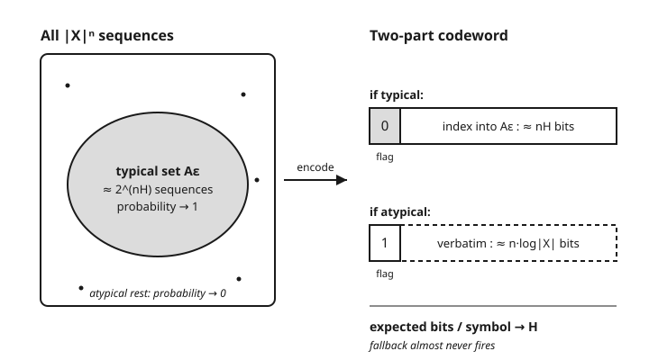

# Information Theory · Lesson 2.2: Shannon's source-coding theorem

> ⏱ ~15 min · Module 2: Source coding and data compression · Builds on: [2.1 The asymptotic equipartition property](02-01-asymptotic-equipartition-property.md) · Unlocks: [2.3 Prefix codes and the Kraft inequality](02-03-prefix-codes-kraft-inequality.md)

## Why this matters

Every compressor you have ever used — gzip, PNG, ZIP, the codec streaming this sentence — is chasing one number and can never beat it. That number is the entropy $H$ of the source. Lesson 1.1 promised that $H(X)$ is "the average bits needed to describe $X$"; this lesson turns that promise into a theorem with two teeth. **Achievability:** you *can* squeeze an i.i.d. source down to essentially $H$ bits per symbol. **Converse:** no scheme, however clever, ever gets below $H$ without losing data. The whole engine is the typical set from [2.1](02-01-asymptotic-equipartition-property.md): compress the sequences that actually occur, and ignore the rest.

## The idea

You have a source spitting out symbols i.i.d. — say a biased coin, heads with probability $0.9$. Naively each symbol costs $1$ bit to store. But the AEP (Lesson 2.1) says something startling: for a long block of $n$ symbols, essentially *all* the probability piles onto a small **typical set** of about $2^{nH}$ sequences, each roughly equally likely. For the $0.9$ coin, $H \approx 0.469$ bits, so of the $2^n$ possible sequences only about $2^{0.469\,n}$ ever really show up.

That is the entire trick. If only $2^{nH}$ sequences matter, then **hand each one a numbered ticket**. There are $2^{nH}$ tickets, so a ticket number is just $nH$ bits long — and that number, not the raw sequence, is what you store. You have spent $nH$ bits to describe $n$ symbols: a rate of $H$ bits per symbol, well under the naive $1$. The rare, atypical sequences still have to be handled — but they occur so seldom (probability $\to 0$) that you can afford to store them stupidly (spell them out verbatim) and still pay almost nothing on average.

Turn it around and the converse is just as forced. If you insist on a budget below $nH$ bits, your ticket book has fewer than $2^{nH}$ tickets — too few to cover the typical sequences that soak up all the probability. Most of the time you would have no ticket to hand out, and reconstruction fails. Below $H$, you *must* lose data.

## The formal version

Let $X_1, X_2, \dots$ be i.i.d. draws from a source with pmf $p(x)$ on alphabet $\mathcal{X}$ and entropy $H = H(X)$ (in bits). A **rate** $R$ means we spend $nR$ bits to encode a block of $n$ symbols; a code is **lossless in the limit** if the probability of failing to reconstruct the block $\to 0$ as $n \to \infty$.

**Shannon's source-coding theorem.**

$$\text{Rate } R \text{ is achievable} \iff R > H.$$

In words: any rate strictly above the entropy can be reached with vanishing error, and any rate strictly below it cannot — $H$ is the exact bits-per-symbol floor for lossless compression.

**Achievability (upper half).** For every $\varepsilon > 0$ and all large $n$, there is a code with rate $R \le H + \varepsilon$ whose reconstruction-error probability is arbitrarily small.

In words: you can get within a hair $\varepsilon$ of $H$ and still recover the data almost surely.

**Converse (lower half).** For every $\varepsilon > 0$, any code with rate $R \le H - \varepsilon$ has reconstruction-error probability $\to 1$ as $n \to \infty$.

In words: undershoot the entropy by any fixed margin and you don't just lose a little — you lose almost everything.

Both halves ride on the AEP's typical set $A_\varepsilon^{(n)}$: the set of blocks $x^n$ whose per-symbol surprise $-\tfrac1n \log_2 p(x^n)$ sits within $\varepsilon$ of $H$. From 2.1, $A_\varepsilon^{(n)}$ has probability $\to 1$, contains at most $2^{n(H+\varepsilon)}$ sequences, and each of its members has probability between $2^{-n(H+\varepsilon)}$ and $2^{-n(H-\varepsilon)}$.

## Concrete instance

The **two-part typical-set code** makes achievability concrete. Encode a block $x^n$ with a leading flag bit, then a payload:

- **Flag $0$ (typical):** if $x^n \in A_\varepsilon^{(n)}$, follow the flag with its index in the typical set. There are $\le 2^{n(H+\varepsilon)}$ typical sequences, so the index needs at most $\lceil n(H+\varepsilon)\rceil \le n(H+\varepsilon)+1$ bits.
- **Flag $1$ (atypical):** if $x^n \notin A_\varepsilon^{(n)}$, follow the flag with the sequence spelled out verbatim, which costs $\lceil n\log_2|\mathcal{X}|\rceil \le n\log_2|\mathcal{X}| + 1$ bits.

The flag makes it decodable — one look tells you which format follows — so reconstruction is **exact**: this is a genuinely lossless code, error zero. The payoff is the *average* length. Typical blocks cost about $n(H+\varepsilon)$ bits and happen with probability $\to 1$; atypical blocks cost the fat $n\log_2|\mathcal{X}|$ but happen with probability $\to 0$. The expensive branch is a rounding error, so the expected rate slides down to $H+\varepsilon$, and $\varepsilon$ was arbitrary. Rate $\to H$.

## Worked examples

**Example 1 (mechanical — count the bits of the two-part code).** Take the expected length $\mathbb{E}[L]$ of the code above. Let $P_{\text{atyp}} = \Pr(x^n \notin A_\varepsilon^{(n)})$; by the AEP, $P_{\text{atyp}} \to 0$. Every codeword carries the $1$-bit flag, so:

$$\mathbb{E}[L] \;\le\; \underbrace{1}_{\text{flag}} + \underbrace{(1-P_{\text{atyp}})\big(n(H+\varepsilon)+1\big)}_{\text{typical branch}} + \underbrace{P_{\text{atyp}}\big(n\log_2|\mathcal{X}| + 1\big)}_{\text{atypical branch}}.$$

Divide by $n$ to get bits per symbol:

$$\frac{\mathbb{E}[L]}{n} \;\le\; (1-P_{\text{atyp}})(H+\varepsilon) + P_{\text{atyp}}\log_2|\mathcal{X}| + \frac{2}{n}.$$

As $n \to \infty$: $P_{\text{atyp}} \to 0$ kills the atypical term, $\tfrac{2}{n}\to 0$ kills the overhead, and the first term $\to H + \varepsilon$. Since $\varepsilon$ was any positive number, the achievable rate is $H$. And because the fallback handles every atypical block exactly, the error is **zero** — not just small. (If you instead ditch the fallback and use a flat $\lceil n(H+\varepsilon)\rceil$-bit index that only labels typical blocks, declaring failure otherwise, the error is exactly $P_{\text{atyp}} \to 0$: the fixed-length version of the same theorem.)

**Example 2 (why you'd care — the $0.9$ coin, and the converse).** A source emits heads with probability $0.9$, tails with $0.1$. Its entropy (computed in [1.1](01-01-entropy-uncertainty-surprise.md)) is

$$H = -0.9\log_2 0.9 - 0.1\log_2 0.1 = 0.9(0.152) + 0.1(3.322) \approx 0.469 \text{ bits/symbol}.$$

So a block of $n = 1000$ flips, naively $1000$ bits, compresses to about $469$ bits — a compression ratio of $0.469$, and you cannot do better losslessly. **Why not** — the converse in miniature. Suppose you budget only $R = 0.4$ bits/symbol, i.e. $2^{0.4 n}$ codewords. The typical set holds $\approx 2^{0.469 n}$ nearly-equiprobable sequences, each of probability $\approx 2^{-0.469 n}$. Keeping your $2^{0.4n}$ most probable sequences captures probability at most about

$$2^{0.4 n} \cdot 2^{-0.469 n} = 2^{-0.069\, n} \xrightarrow{n\to\infty} 0.$$

You cover a vanishing slice of the probability; reconstruction fails with probability $\to 1$. The floor at $0.469$ is not a limitation of *your* cleverness — it is a property of the source.

## Watch out

- **You might think $H$ is achievable symbol by symbol — it's a block, asymptotic limit.** The theorem promises $H$ bits/symbol only as the block length $n \to \infty$. A per-symbol code (like Huffman, [2.4](02-04-huffman-coding.md)) can be forced up to $H + 1$ bits/symbol; the "$+1$" is the price of refusing to code in blocks. Arithmetic coding ([2.5](02-05-arithmetic-coding.md)) recovers the block gain without the wait.
- **You might think a smarter algorithm could dip below $H$ — the converse forbids it forever.** This is not "no *known* code beats $H$"; it is a proof that *no code can exist*. Any claim of lossless sub-entropy compression is a claim of a perpetual-motion machine.
- **You might think the atypical sequences are a bug — they're handled, with vanishing cost.** They never disappear, but their total probability $\to 0$, so the verbatim fallback is charged almost never. Lossless means exact reconstruction with probability $\to 1$; the fallback is what makes it *exactly* $1$.
- **You might think this covers your text file or photo — only if the source is i.i.d.** Real data has memory (a $\texttt{q}$ predicts a $\texttt{u}$). The right floor is then the *entropy rate*, and beating the i.i.d. entropy by modeling structure is exactly what gzip and PNG do — they are not breaking the theorem, they are using a better $p$.

## One-liner

> Entropy is the compression floor: an i.i.d. source squeezes to $H$ bits per symbol and not one bit less — index the $2^{nH}$ typical sequences to reach it, and no code in existence can undercut it.

## Problems

**P1 (🟢)** A source is uniform over an alphabet of $|\mathcal{X}| = 8$ symbols. What is its entropy $H$? What rate (bits/symbol) does the source-coding theorem give as the best possible lossless compression, and does blocking help here? Explain in one sentence.

**P2 (🟡)** A biased coin has $\Pr(\text{heads}) = 0.8$. (a) Compute $H$ in bits (you may use $\log_2 0.8 \approx -0.322$, $\log_2 0.2 \approx -2.322$). (b) For blocks of $n = 100$ flips, roughly how many bits does the typical-set code use, and what is the compression ratio versus the naive $100$ bits? (c) If a rival claims a lossless scheme averaging $0.6$ bits/symbol on this source, what do you say?

**P3 (🔴, optional)** A source is uniform over $|\mathcal{X}| = 3$ symbols, so $H = \log_2 3 \approx 1.585$ bits. You must use a *fixed* number of bits per block of $n$ symbols and want reconstruction to succeed with high probability. (a) Using the typical-set picture, roughly how many bits per block do you need? (b) Suppose you are given only $1.4n$ bits per block. Argue, with a $2^{(\cdot)}$ count, why the error probability $\to 1$. (c) In one sentence, what changes if the three symbols are *not* equally likely?

Solutions

**P1** A uniform source over $8$ symbols has $H = \log_2 8 = 3$ bits/symbol (max entropy for $8$ outcomes, from 1.1). The theorem says the best lossless rate is $H = 3$ bits/symbol. Blocking does **not** help: each symbol already carries a full $3$ bits with no redundancy to exploit, so you cannot beat $3$ — the naive code is already optimal. (Compression only buys you something when the source is non-uniform; a uniform source is incompressible.)

**P2** (a)
$$H = -0.8\log_2 0.8 - 0.2\log_2 0.2 = 0.8(0.322) + 0.2(2.322) = 0.258 + 0.464 = 0.722 \text{ bits}.$$
(b) The typical-set code uses about $nH = 100 \times 0.722 \approx 72$ bits per block (plus $O(1)$ overhead that washes out). Compression ratio $\approx 72/100 = 0.72$ — you save roughly $28\%$ over the naive $100$ bits.
(c) The claim is impossible. $0.6 < H = 0.722$, so by the converse any code at $0.6$ bits/symbol has error $\to 1$ — it cannot be lossless. Either the rival is losing data, or the source is not the i.i.d. $0.8$ coin they described.

**P3** (a) The typical set has $\approx 2^{nH} = 2^{1.585 n}$ nearly-equiprobable sequences; indexing them needs about $nH \approx 1.585\,n$ bits per block. Any fixed budget slightly above that (say $n(H+\varepsilon)$ bits) covers the typical set, whose probability $\to 1$, so reconstruction succeeds with high probability.
(b) With $1.4n$ bits you have $2^{1.4n}$ codewords. The typical sequences each have probability $\approx 2^{-1.585 n}$, so the probability you can cover with your best $2^{1.4n}$ codewords is at most about
$$2^{1.4n} \cdot 2^{-1.585 n} = 2^{-0.185\, n} \xrightarrow{n\to\infty} 0.$$
You reach a vanishing fraction of the probability, so the error $\to 1$. $1.4 < 1.585 = H$, exactly the converse.
(c) If the symbols are unequal, $H$ drops below $\log_2 3 = 1.585$ (uniform is the max, from 1.1), so the compression floor is *lower* — you can beat $1.585$ bits/symbol, and a budget like $1.4n$ might now suffice depending on how far $H$ falls.

## Flashback

**From Lesson 2.1 (Asymptotic equipartition property):** A source emits symbols i.i.d. from $\{a, b, c\}$ with probabilities $p(a) = \tfrac12$, $p(b) = \tfrac14$, $p(c) = \tfrac14$. (a) Compute the entropy $H$. (b) Consider the specific length-$4$ sequence $x^4 = (a, a, b, c)$. Compute its per-symbol empirical surprise $-\tfrac14\log_2 p(x^4)$ and compare it to $H$ — is this sequence "typical"? (c) Roughly how many typical sequences of length $n$ are there, in $2^{(\cdot)}$ form?

Solution

(a) $H = -\tfrac12\log_2\tfrac12 - \tfrac14\log_2\tfrac14 - \tfrac14\log_2\tfrac14 = \tfrac12(1) + \tfrac14(2) + \tfrac14(2) = 0.5 + 0.5 + 0.5 = 1.5$ bits.

(b) By independence, $p(x^4) = p(a)^2\,p(b)\,p(c) = \left(\tfrac12\right)^2 \cdot \tfrac14 \cdot \tfrac14 = \tfrac14 \cdot \tfrac{1}{16} = \tfrac{1}{64}$. Then
$$-\tfrac14\log_2 p(x^4) = -\tfrac14\log_2\tfrac{1}{64} = -\tfrac14(-6) = 1.5 \text{ bits}.$$
It lands *exactly* on $H = 1.5$, so for any $\varepsilon > 0$ this sequence is typical — its per-symbol surprise is within $\varepsilon$ of $H$. (Concretely: its symbol counts $2, 1, 1$ match the expected proportions $\tfrac12,\tfrac14,\tfrac14$ of a length-$4$ block, which is exactly what makes a sequence typical.)

(c) About $2^{nH} = 2^{1.5\,n}$ typical sequences — out of $3^n = 2^{n\log_2 3} \approx 2^{1.585 n}$ total. The typical set is a shrinking fraction of all sequences, yet carries essentially all the probability: the seed of the whole compression argument.

## Connections

- **Backward:** the engine is the AEP of [2.1](02-01-asymptotic-equipartition-property.md) — the $\approx 2^{nH}$ typical sequences are precisely what the code indexes — and $H$ itself is the entropy built in [1.1](01-01-entropy-uncertainty-surprise.md), whose "average bits to describe $X$" reading is now a proved limit, not a slogan.
- **Forward:** [2.3](02-03-prefix-codes-kraft-inequality.md) and [2.4 Huffman coding](02-04-huffman-coding.md) build *practical* symbol-by-symbol codes and pay the "$+1$ bit" penalty for not blocking; [2.5 Arithmetic coding](02-05-arithmetic-coding.md) reaches $H$ on real streams without waiting for $n \to \infty$.
- **Forward:** allow a little *distortion* — lossy compression — and you can drop below $H$; how far is answered by rate-distortion theory in [4.3](04-03-rate-distortion.md).
- **Sideways (statistical mechanics):** counting the $2^{nH}$ typical sequences is the information-theoretic twin of counting typical microstates of a gas — Boltzmann's $S = k_B \ln \Omega$ is this same "log of the number of ways" logic. See [stat-mech](../../stat-mech/syllabus.md); [4.4](04-04-maximum-entropy-stat-mech.md) makes the bridge explicit.
- **Sideways (computing, in prose):** gzip, PNG, and FLAC are all approaching an entropy floor — they beat the naive rate not by breaking this theorem but by modeling a better $p$ (exploiting the memory in real data that the i.i.d. assumption ignores). See the [syllabus](../syllabus.md) for where practical codecs sit relative to the ideal.
