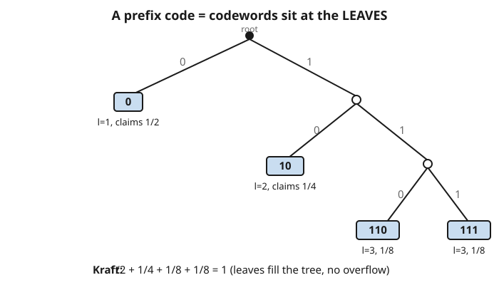

# Information Theory · Lesson 2.3: Prefix codes and the Kraft inequality

> ⏱ ~15 min · Module 2: Source coding and data compression · Builds on: [2.2 Shannon's source-coding theorem](02-02-source-coding-theorem.md) · Unlocks: [2.4 Huffman coding](02-04-huffman-coding.md)

## Why this matters

Lesson 2.2 told you the *floor*: no code can compress a source below its entropy $H$ bits per symbol. But it didn't hand you a code you could actually run. The moment you assign short bit-strings to frequent symbols and long ones to rare symbols — Morse code's whole idea — a new hazard appears: if you don't insert separators, how does the decoder know where one codeword ends and the next begins? This lesson gives the clean answer (**prefix codes**), a one-line test for which codeword lengths are even buildable (**Kraft**), and the payoff: a code whose average length sits within one bit of $H$. That "within one bit" is the concrete, achievable version of 2.2's promise.

## The idea

You want a variable-length code with *no commas* — the bits arrive glued together as `01011100…` and the decoder must split them unambiguously, reading left to right, deciding each symbol the instant it finishes without peeking ahead. The trick: make sure **no codeword is the start of another one**. If `0` is a codeword, then no other codeword may begin with `0` — so `01` is banned. This is a **prefix code**.

Why does that solve it? Picture a binary tree: go left for `0`, right for `1`, so every bit-string is a path from the root. "No codeword is a prefix of another" means exactly "no codeword sits on the path to another codeword" — i.e. **every codeword is a leaf**, with no codeword hanging above it. When the decoder walks the incoming bits down the tree and hits a leaf, it *knows* the symbol is done — a leaf has nothing below it to wait for. Instant, comma-free decoding.

Leaves aren't free, though. Planting a codeword at depth $\ell$ (a length-$\ell$ string) kills off an entire sub-tree beneath it — a fraction $2^{-\ell}$ of all the leaves "down there" become unusable. A short codeword is greedy: length 1 eats half the tree. The **Kraft inequality** is just the statement that these claimed fractions can't sum past 1 — you can't overbook the tree.

## The formal version

**Prefix (instantaneous) code.** A code is *prefix-free* if no codeword is a prefix of any other codeword.

*In words:* once you've read a full codeword, you can stop and decode it immediately — no codeword you've seen so far could be the opening of a longer one.

**Kraft inequality.** A binary prefix code with codeword lengths $\ell_1, \ell_2, \dots, \ell_m$ *exists* if and only if

$$\sum_{i=1}^{m} 2^{-\ell_i} \le 1.$$

*In words:* a length set is buildable as a prefix code exactly when the leaves' claimed tree-fractions fit inside the budget of 1. It's a condition on the **lengths**, not on any particular codeword assignment — if the sum fits, *some* prefix code with those lengths exists (you build it by planting leaves left to right).

**Kraft–McMillan.** The *same* inequality $\sum_i 2^{-\ell_i} \le 1$ is necessary for **every uniquely decodable code** — not just prefix ones.

*In words:* even codes that need lookahead to decode obey the identical length budget. So allowing that extra complication buys you nothing: prefix codes already reach every length set that any decodable code can. This is why we only ever bother with prefix codes.

**Expected length and its bounds.** For a source with symbol probabilities $p_i$, the expected codeword length is $L = \sum_i p_i \ell_i$ (average bits per symbol). Then

$$H(X) \le L, \qquad \text{and an optimal code has } L < H(X) + 1,$$

where $H(X) = -\sum_i p_i \log_2 p_i$ is the entropy from Lesson 1.1.

*In words:* you can never beat entropy (the 2.2 floor, now proved for real codes), and you can always get within one bit of it. The upper bound is achieved by the **Shannon code** $\ell_i = \lceil -\log_2 p_i \rceil$ — assign each symbol a length equal to its surprisal, rounded up.

## Picture

## Worked examples

**Example 1 (mechanical — is a length set buildable?).**

Lengths $\{1,2,3,3\}$: $\ \frac{1}{2} + \frac{1}{4} + \frac{1}{8} + \frac{1}{8} = 1 \le 1$. ✓ A prefix code exists. Build it by planting leaves greedily, shortest first: `0` (uses the whole left half), then `10`, then `110`, `111`. Check prefix-freeness: none of these four strings starts another — decodable. (This is exactly the tree in the Picture.)

Lengths $\{1,2,2,3\}$: $\ \frac{1}{2} + \frac{1}{4} + \frac{1}{4} + \frac{1}{8} = \frac{9}{8} > 1$. ✗ **No** prefix code with these lengths exists — and by Kraft–McMillan, no uniquely decodable code either. The `1`-long codeword already claims half the tree; the two length-2 codewords claim the other half between them; there is no room left to hang a fourth leaf. The lengths overbook the tree.

**Example 2 (why you'd care — proving $H \le L$, and hitting $H+1$).**

Given prefix lengths $\ell_i$, set $c = \sum_j 2^{-\ell_j} \le 1$ (Kraft) and define $q_i = \dfrac{2^{-\ell_i}}{c}$, a genuine probability distribution (the $q_i$ are non-negative and sum to 1). Then $\ell_i = -\log_2 q_i - \log_2 c$, so

$$L - H = \sum_i p_i \ell_i + \sum_i p_i \log_2 p_i = \sum_i p_i \log_2 \frac{p_i}{q_i} \;-\; \log_2 c = D(p \,\|\, q) + \log_2\frac{1}{c}.$$

Both terms are $\ge 0$: the relative entropy $D(p\|q) \ge 0$ by **Gibbs' inequality** (Lesson 1.4), and $\log_2\frac{1}{c} \ge 0$ because $c \le 1$. Hence $L - H \ge 0$, i.e. $H \le L$. Equality needs *both* $p = q$ **and** $c = 1$ — that is, $p_i = 2^{-\ell_i}$ exactly, so every probability is a power of $\tfrac12$ (a **dyadic** source).

For the upper bound, take the **Shannon code** $\ell_i = \lceil -\log_2 p_i \rceil$. First it's legal: $\ell_i \ge -\log_2 p_i$ gives $2^{-\ell_i} \le p_i$, so $\sum_i 2^{-\ell_i} \le \sum_i p_i = 1$ — Kraft holds, the code exists. And since $\lceil x \rceil < x + 1$,

$$L = \sum_i p_i \ell_i < \sum_i p_i\bigl(-\log_2 p_i + 1\bigr) = H(X) + 1.$$

So a prefix code with $H \le L < H+1$ always exists. Bounds proved, both sides.

## Watch out

- **"Prefix" means something specific about *lookahead*.** You might think any decodable code is fine, but a prefix code is *instantaneously* decodable — you commit to each symbol the moment its bits complete, never backtracking. A code like $\{0, 01, 011\}$ is uniquely decodable yet not prefix-free, so the decoder must sometimes read ahead to resolve a symbol. Prefix-free = no waiting.
- **Kraft is about the *lengths*, not a specific code.** The inequality tells you a length *set* is realizable — that *some* prefix code with those lengths exists. It does **not** certify that a particular assignment you scribbled down is prefix-free; you check that separately (no codeword starts another).
- **Uniquely decodable codes gain nothing.** By Kraft–McMillan the length budget is identical, so the messier non-prefix codes can't achieve any shorter $L$. Never trade instant decoding for a phantom improvement.
- **The "+1" is a rounding tax, not slack in the theory.** $H \le L$ is exact and unbeatable; the gap up to $H+1$ comes from codeword lengths being forced to whole numbers ($\lceil -\log_2 p_i\rceil$). Equality $H = L$ happens *only* for dyadic sources. That +1 is real per-symbol overhead — Lesson 2.5 kills it by coding long blocks at once, amortizing one rounding over many symbols.

## One-liner

> Prefix-free means codewords live at the leaves of a binary tree, Kraft says the leaves can't overbook it ($\sum 2^{-\ell_i}\le 1$), and the reward is a code with $H \le L < H+1$.

## Problems

**P1 (🟢)** For lengths $\{2,2,2,3,3\}$, does a binary prefix code exist? If so, exhibit one; if not, say what fails.

**P2 (🟡)** A source has symbols $A,B,C,D$ with probabilities $\tfrac12, \tfrac14, \tfrac18, \tfrac18$. Give the Shannon-code lengths $\ell_i = \lceil -\log_2 p_i\rceil$, verify Kraft, compute $L$ and $H$, and explain why they're equal here.

**P3 (🔴, optional)** Show that if $\sum_i 2^{-\ell_i} < 1$ *strictly*, then the code is "wasteful": some codeword can be shortened by at least one bit while keeping the code prefix-free. (Hint: think about a leaf that has an empty sibling sub-tree.)

Solutions

**P1** Sum the claimed fractions: $\frac{1}{4}+\frac{1}{4}+\frac{1}{4}+\frac{1}{8}+\frac{1}{8} = \frac{3}{4}+\frac{1}{4} = 1 \le 1$. ✓ A prefix code exists. Build greedily, shortest first: the three length-2 leaves are `00`, `01`, `10`; that leaves the sub-tree under `11` free, giving length-3 leaves `110`, `111`. Final code $\{00, 01, 10, 110, 111\}$ — check: no string is a prefix of another. ✓

**P2** Surprisals: $-\log_2\tfrac12 = 1$, $-\log_2\tfrac14 = 2$, $-\log_2\tfrac18 = 3$, $-\log_2\tfrac18 = 3$ — all already integers, so $\lceil\cdot\rceil$ changes nothing: lengths $\{1,2,3,3\}$. Kraft: $\frac12+\frac14+\frac18+\frac18 = 1 \le 1$ ✓ (a valid code is `0,10,110,111`). Expected length:

$$L = \tfrac12(1) + \tfrac14(2) + \tfrac18(3) + \tfrac18(3) = \tfrac12 + \tfrac12 + \tfrac38 + \tfrac38 = \tfrac{7}{4} = 1.75 \text{ bits}.$$

Entropy:

$$H = \tfrac12(1) + \tfrac14(2) + \tfrac18(3) + \tfrac18(3) = 1.75 \text{ bits}.$$

They match exactly because every $p_i$ is a power of $\tfrac12$ (dyadic), so $\ell_i = -\log_2 p_i$ with **no rounding** — the equality case of $H \le L$. The +1 tax vanishes when the probabilities line up with the tree.

**P3** Suppose $\sum_i 2^{-\ell_i} < 1$. Consider the deepest codeword, at some leaf of depth $\ell$. Look at its sibling — the other child of its parent node. If that sibling were also a codeword leaf, we could pair-merge; more directly: because the total is strictly below 1, the tree has "unclaimed budget," meaning at least one node has a child sub-tree containing no codeword. Concretely, take a codeword $w$ whose sibling sub-tree is empty of codewords (one must exist, else every internal node's two subtrees are both used and the fractions would sum to exactly 1). Replacing $w$ by its parent's address — i.e. dropping $w$'s last bit — still yields a string that is no codeword's prefix and has no codeword below it (its old sibling side was empty). So the shortened string is a valid prefix-free codeword, cutting length by 1 (and lowering $L$). Hence strict Kraft ⟹ shortenable ⟹ not optimal. Contrapositive: an optimal code saturates Kraft with equality, $\sum_i 2^{-\ell_i} = 1$.

## Flashback

**From Lesson 2.2 (Shannon's source-coding theorem):** A memoryless source emits symbols with probabilities $\{0.5, 0.25, 0.125, 0.125\}$. (a) What is the entropy $H$, and what does 2.2 say is the best possible average bits/symbol for coding long blocks? (b) A naive fixed-length code uses 2 bits for all four symbols. How many bits per symbol does it waste versus the limit?

Solution

(a) $H = 0.5(1) + 0.25(2) + 0.125(3) + 0.125(3) = 0.5 + 0.5 + 0.375 + 0.375 = 1.75$ bits/symbol. Shannon's source-coding theorem says $1.75$ bits/symbol is the asymptotic floor: coding long blocks, you can approach $1.75$ but never beat it.

(b) Fixed-length uses $2$ bits/symbol, so it wastes $2 - 1.75 = 0.25$ bit per symbol — a 14% overhead. (Note the *prefix* code `0,10,110,111` from this lesson already hits $L = 1.75$ exactly, matching the floor with no blocking needed, because the source is dyadic.)

## Connections

- **Backward:** Lesson 2.2 set the floor $H$; this lesson delivers a runnable code that *reaches* within one bit of it. The proof of $H \le L$ leans directly on **Gibbs' inequality** / relative entropy from [1.4 Relative entropy and KL divergence](01-04-relative-entropy-kl-jensen.md) — the $D(p\|q) \ge 0$ term is the whole engine.
- **Forward:** [2.4 Huffman coding](02-04-huffman-coding.md) constructs the *optimal* prefix code — the one minimizing $L$ over all length sets Kraft allows. [2.5 Arithmetic coding](02-05-arithmetic-coding.md) closes the annoying "+1" gap by coding whole blocks, amortizing the rounding across many symbols toward the $H$ limit.
- **Sideways (algebra):** codes as leaf-labelings of trees are combinatorial structures; the same tree/finite-alphabet bookkeeping recurs when you build codes over larger symbol sets and finite fields — see [abstract-algebra](../../abstract-algebra/syllabus.md) for the group/field machinery behind linear codes.
- **Sideways (computing):** every variable-length format you've met — UTF-8's self-synchronizing byte prefixes, Huffman tables inside ZIP/JPEG/PNG — is a prefix code exploiting exactly the leaf property so a byte stream decodes with no separators.
