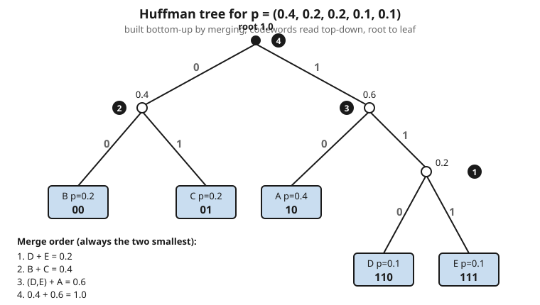

# Information Theory · Lesson 2.4: Huffman coding

> ⏱ ~15 min · Module 2: Source coding and data compression · Builds on: [2.3 Prefix codes and the Kraft inequality](02-03-prefix-codes-kraft-inequality.md) · Unlocks: [2.5 Beyond symbol codes: arithmetic coding](02-05-arithmetic-coding.md)

## Why this matters

Lesson 2.3 told you *which* codeword-length lists are physically buildable (the Kraft inequality) and gave you the target every code aims for (entropy $H$). It did **not** tell you how to actually pick the lengths. That gap is what Huffman coding closes — with a four-line greedy algorithm that provably produces the **shortest possible** prefix code for a known symbol distribution. It is not a heuristic that "does pretty well": it is optimal, and it has been optimal since 1952. When your JPEG, your ZIP file, and your MP3 shave off their last bits, a Huffman tree is doing the shaving.

## The idea

You have a distribution over symbols and you want a prefix code where **common symbols get short codewords** and rare ones get long ones — that is the whole game (2.3's $L = \sum_i p_i \ell_i$ is a weighted average, so the heavy weights are where length hurts).

Huffman's insight is to build the tree **from the bottom up**, and to be greedy about the cheapest thing you can commit to. The two *rarest* symbols are the ones you can afford to bury deepest, so pair them off first: make them siblings, and treat the pair as a single new "super-symbol" whose probability is the sum of the two. Now you have one fewer symbol. Repeat — always merging the two least-probable items on the table — until only one item is left. That last item is the root, and every merge you did is one branching level of the tree.

The beautiful part: you never had to think about the *whole* tree at once. Each step only asks "what are the two smallest?" — and greedily answering that local question, over and over, lands you on the globally optimal code.

## The formal version

**The Huffman algorithm.** Given symbols with probabilities $p_1, \dots, p_n$:

1. Put all $n$ symbols in a pool, each a leaf node weighted by its probability.
2. Remove the **two smallest-weight** nodes, $x$ and $y$. Create a new internal node with weight $p_x + p_y$, with $x$ and $y$ as its two children. Put the new node back in the pool.
3. Repeat step 2 until one node remains — the root.
4. Label every left branch $0$ and every right branch $1$ (the choice is arbitrary but fixed). Each symbol's **codeword** is the sequence of bits on the path from the root down to its leaf.

*In words:* keep gluing the two rarest things together into one thing until there is nothing left to glue; read each symbol's code off the path down to it.

**Optimality.** The Huffman code minimizes expected length $L = \sum_i p_i \ell_i$ over *all* prefix codes for that distribution.

*In words:* no other per-symbol prefix code beats it — you cannot hand-craft a shorter one.

**Why (the exchange argument, sketched).** In *any* optimal prefix code the two least-probable symbols can be assumed to be **siblings at the deepest level**. Reason: if the deepest leaf were a common symbol, you could swap it with a rarer, shallower one and *lower* $L$ (moving weight up shortens the average), so an optimal code already has the rarest symbols deepest; and a deepest leaf must have a sibling (a lone deep leaf could be pulled up one level, again lowering $L$). Huffman *enforces* exactly this at every step — it merges the two rarest into a deepest sibling pair — so by induction on the merged, smaller problem it stays optimal all the way up.

**The bound (from 2.3).** Because $L$ is optimal it certainly beats the round-up-each-length code, so it inherits 2.3's guarantee:

$$H(X) \le L < H(X) + 1,$$

where $H(X) = -\sum_i p_i \log_2 p_i$ is the entropy in bits.

*In words:* Huffman never uses fewer bits than entropy demands, and never wastes more than one bit per symbol on top of it.

## Picture

## Worked examples

**Example 1 (the full pipeline).** Take $p = (0.4, 0.2, 0.2, 0.1, 0.1)$ for symbols $A, B, C, D, E$.

*Run Huffman* (merge the two smallest each round):

- Pool $\{0.4, 0.2, 0.2, 0.1, 0.1\}$. Two smallest are $D, E$ at $0.1$ each → merge into node $m_1 = 0.2$.
- Pool $\{0.4,\ 0.2,\ 0.2,\ 0.2\}$ (that is $A, B, C, m_1$). Two smallest are both $0.2$; pick $B, C$ → merge into $m_2 = 0.4$.
- Pool $\{0.4,\ 0.2,\ 0.4\}$ (that is $A, m_1, m_2$). Two smallest are $m_1 = 0.2$ and $A = 0.4$ → merge into $m_3 = 0.6$.
- Pool $\{0.4,\ 0.6\}$ (that is $m_2, m_3$) → merge into the root $= 1.0$. Done.

*Read the codewords* off the tree in the Picture (left branch $0$, right branch $1$):

| symbol | $p_i$ | codeword | $\ell_i$ |
|---|---|---|---|
| $A$ | 0.4 | 10 | 2 |
| $B$ | 0.2 | 00 | 2 |
| $C$ | 0.2 | 01 | 2 |
| $D$ | 0.1 | 110 | 3 |
| $E$ | 0.1 | 111 | 3 |

*Expected length:*

$$L = \sum_i p_i \ell_i = 0.4(2) + 0.2(2) + 0.2(2) + 0.1(3) + 0.1(3) = 0.8 + 0.4 + 0.4 + 0.3 + 0.3 = 2.2 \text{ bits}.$$

*Entropy:*

$$H = -\sum_i p_i \log_2 p_i = -0.4\log_2 0.4 - 2(0.2\log_2 0.2) - 2(0.1\log_2 0.1).$$

Using $\log_2 0.4 = -1.3219$, $\log_2 0.2 = -2.3219$, $\log_2 0.1 = -3.3219$:

$$H = 0.4(1.3219) + 2\cdot 0.2(2.3219) + 2\cdot 0.1(3.3219) = 0.5288 + 0.9288 + 0.6644 = 2.122 \text{ bits}.$$

*Verify the bound:* $H = 2.122 \le L = 2.2 < H + 1 = 3.122$. ✓ Huffman spends just $0.078$ bit/symbol over the entropy floor.

*Verify Kraft* (2.3 — a valid prefix code fills its budget):

$$\sum_i 2^{-\ell_i} = 3\cdot 2^{-2} + 2\cdot 2^{-3} = \tfrac{3}{4} + \tfrac{2}{8} = \tfrac{3}{4} + \tfrac{1}{4} = 1. ✓$$

Equality means the tree is **complete** — every leaf is a codeword, no bit budget wasted.

**Example 2 (where Huffman hurts).** Now a skewed two-symbol source, $p = (0.9, 0.1)$. With only two symbols the tree has one branch: each symbol gets a single bit, $0$ and $1$. There is no other choice — so

$$L = 0.9(1) + 0.1(1) = 1.0 \text{ bit/symbol}.$$

But the entropy is

$$H = -0.9\log_2 0.9 - 0.1\log_2 0.1 = 0.9(0.1520) + 0.1(3.3219) = 0.1368 + 0.3322 = 0.469 \text{ bits}.$$

Huffman is spending $1.0$ bit to convey $0.469$ bits of information — a **2.1× overhead**. It is still optimal *among per-symbol prefix codes* (you cannot use half a bit for one symbol), but the "$< H+1$" slack is nearly maxed out. The fix is to stop coding one symbol at a time: code *blocks* of symbols, so the fixed $+1$ overhead is amortized over many symbols (or go all the way to arithmetic coding, [2.5](02-05-arithmetic-coding.md), which drops the per-symbol integer constraint entirely).

## Watch out

- **You might think "optimal" means "reaches $H$."** It does not. Huffman is optimal only *among prefix codes that assign a whole number of bits to each symbol*. Whenever a symbol's ideal length $-\log_2 p_i$ is not an integer, rounding leaks bits — up to almost 1 per symbol, as Example 2 shows. Reaching $H$ needs blocking or arithmetic coding.
- **You might think the code is unique.** Ties in probability are broken arbitrarily, and the $0$/$1$ branch labels are a free choice, so a distribution can have several distinct Huffman codes. They all share the *same* optimal $L$ — the tree shape may differ, the expected length cannot.
- **You might build the tree the wrong direction.** Merge **bottom-up** (always the two smallest); read codewords **top-down** (root to leaf). Reverse either and you get garbage — a common exam-day slip.

## One-liner

> Glue the two rarest symbols together, over and over, and you have — provably — the shortest prefix code there is; it just can't beat entropy by more than a bit, which is a lot when the source is skewed.

## Problems

**P1 (🟢)** Build a Huffman code for the four-symbol source $p = (0.5, 0.25, 0.15, 0.1)$. List the codewords and their lengths, and compute $L$.

**P2 (🟡)** For the code you built in P1, compute the entropy $H$ and confirm $H \le L < H + 1$. Then compute $\sum_i 2^{-\ell_i}$ and say what its value tells you about the tree. (Use $\log_2 0.5 = -1$, $\log_2 0.25 = -2$, $\log_2 0.15 = -2.737$, $\log_2 0.1 = -3.322$.)

**P3 (🔴, optional)** A source has $p = (0.6, 0.4)$. (a) What is Huffman's $L$? (b) What is $H$? (c) Now consider coding *pairs* of symbols: the four pairs have probabilities $0.36, 0.24, 0.24, 0.16$. Build a Huffman code for the pairs, find its expected length **per pair**, and divide by 2 to get bits **per original symbol**. Did blocking move you closer to $H$?

Solutions

**P1** Symbols $A,B,C,D$ with $p = (0.5, 0.25, 0.15, 0.1)$.

- Pool $\{0.5, 0.25, 0.15, 0.1\}$. Two smallest: $C = 0.15$, $D = 0.1$ → merge $m_1 = 0.25$.
- Pool $\{0.5, 0.25, 0.25\}$ (that is $A, B, m_1$). Two smallest: $B = 0.25$ and $m_1 = 0.25$ → merge $m_2 = 0.5$.
- Pool $\{0.5, 0.5\}$ → merge to root $= 1.0$.

Reading paths (root: left $0$ = $A$, right $1$ = $m_2$; inside $m_2$: $B$ and $m_1$; inside $m_1$: $C$ and $D$):

| symbol | $p$ | codeword | $\ell$ |
|---|---|---|---|
| $A$ | 0.5 | 0 | 1 |
| $B$ | 0.25 | 10 | 2 |
| $C$ | 0.15 | 110 | 3 |
| $D$ | 0.1 | 111 | 3 |

$$L = 0.5(1) + 0.25(2) + 0.15(3) + 0.1(3) = 0.5 + 0.5 + 0.45 + 0.3 = 1.75 \text{ bits}.$$

**P2** Entropy:

$$H = 0.5(1) + 0.25(2) + 0.15(2.737) + 0.1(3.322) = 0.5 + 0.5 + 0.4106 + 0.3322 = 1.743 \text{ bits}.$$

Bound: $H = 1.743 \le L = 1.75 < 2.743 = H + 1$. ✓ (Very tight — only $0.007$ bit of overhead, because three of the four probabilities are near-exact powers of $\tfrac12$.)

Kraft: $\sum_i 2^{-\ell_i} = 2^{-1} + 2^{-2} + 2^{-3} + 2^{-3} = \tfrac12 + \tfrac14 + \tfrac18 + \tfrac18 = 1.$ The sum equals $1$, so the tree is **complete**: every leaf carries a codeword and no coding budget is left on the table.

**P3** (a) Two symbols → one bit each, so $L = 1.0$ bit/symbol.

(b) $H = -0.6\log_2 0.6 - 0.4\log_2 0.4 = 0.6(0.737) + 0.4(1.322) = 0.4422 + 0.5288 = 0.971$ bits. Overhead $\approx 0.029$ bit — modest here, since $0.6/0.4$ is only mildly skewed.

(c) Pairs with $p = (0.36, 0.24, 0.24, 0.16)$:

- Two smallest: $0.24$ and $0.16$ → merge $= 0.40$. Pool $\{0.36, 0.24, 0.40\}$.
- Two smallest: $0.24$ and $0.36$ → merge $= 0.60$. Pool $\{0.40, 0.60\}$ → root.

Lengths: the $0.36$ and $0.24$ symbols sit at depth 2, and the merged $0.40 = 0.24 + 0.16$ splits into two depth-2... let us read carefully. Root splits into the $0.60$ node (holding $0.36$ and $0.24$) and the $0.40$ node (holding $0.24$ and $0.16$). So **all four pairs are at depth 2**: lengths $(2,2,2,2)$.

$$L_{\text{pair}} = 2(0.36 + 0.24 + 0.24 + 0.16) = 2.0 \text{ bits per pair} \Rightarrow 1.0 \text{ bit per symbol}.$$

No improvement — this particular distribution rounds to a uniform 2-bit code. Blocking *can* help (it is the escape route in general), but a single doubling of an already-mild source need not move the needle; the gain shows up as you block more symbols or when the source is more skewed. The reliable way to close the gap for any source is arithmetic coding ([2.5](02-05-arithmetic-coding.md)).

## Flashback

**From Lesson 2.3 (Prefix codes and the Kraft inequality):** Can a binary prefix code have codeword lengths $\{1, 2, 2, 3\}$? If yes, exhibit one; if no, explain why.

Solution

Check the Kraft sum:

$$\sum_i 2^{-\ell_i} = 2^{-1} + 2^{-2} + 2^{-2} + 2^{-3} = \tfrac{4}{8} + \tfrac{2}{8} + \tfrac{2}{8} + \tfrac{1}{8} = \tfrac{9}{8} > 1.$$

Since the sum exceeds $1$, the Kraft inequality fails, so **no** prefix code (indeed no uniquely-decodable code) with these lengths exists — you would need more than a full tree's worth of leaf budget. Intuitively, a length-$1$ codeword already claims half the tree; two length-$2$ codewords claim another half between them; there is nothing left for the length-$3$ leaf.

## Connections

- **Backward:** this is the constructive payoff of [2.3](02-03-prefix-codes-kraft-inequality.md) — Kraft said which length-lists are legal and gave the $H \le L < H+1$ bound; Huffman *chooses* the legal lengths that minimize $L$. The entropy floor it chases is [2.2](02-02-source-coding-theorem.md)'s source-coding limit.
- **Forward:** [2.5 arithmetic coding](02-05-arithmetic-coding.md) removes Huffman's fatal restriction — the whole-number-of-bits-per-symbol rule — and drives $L$ down onto $H$ even for skewed sources like Example 2, closing the $+1$ gap.
- **Sideways (computing):** Huffman coding is not a museum piece — it is the final entropy-coding stage inside JPEG, PNG/DEFLATE (the `zip`/`gzip` engine), and MP3. Compression pipelines do modeling first, then hand the residual symbol frequencies to a Huffman tree.
- **Sideways (learning):** an optimal code assigns length $\approx -\log_2 p_i$, so building the best code *is* estimating the best model of the source — the same quantity that appears as **cross-entropy loss** when you fit a predictor in [statistical-learning](../../statistical-learning/syllabus.md). Minimizing description length and minimizing prediction loss are two faces of one coin.
- See the full course map in the [syllabus](../syllabus.md).
