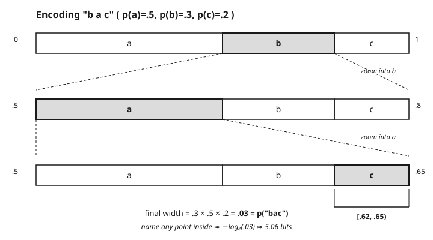

# Information Theory · Lesson 2.5: Beyond symbol codes — arithmetic coding

> ⏱ ~15 min · Module 2: Source coding and data compression · Builds on: [2.4 Huffman coding](02-04-huffman-coding.md) · Unlocks: [3.1 Discrete channels and capacity](03-01-discrete-channels-capacity.md)

## Why this matters

Huffman coding (2.4) is optimal *among codes that spend a whole number of bits per symbol* — and that caveat is exactly its weakness. It can waste up to almost 1 extra bit on every symbol, which is nothing for a 4-bit alphabet but ruinous for a skewed source whose true cost is a fraction of a bit. A symbol that "should" cost 0.15 bits still costs Huffman at least 1. Compress a genome, a fax page, or the output of a good predictive model and that rounding tax can double your file. **Arithmetic coding** removes it: it lets a symbol cost a *fractional* number of bits, reaching the entropy floor $H$ without any integer-length penalty and without the exponentially large code tables that blocking would demand. It is the compressor hiding inside PDFs, JPEG/JBIG, and modern formats.

## The idea

Stop thinking about a codeword *per symbol*. Instead, represent the **entire message as a single sub-interval of $[0,1)$**, and make its *width equal to the message's probability*.

Here is the whole trick in one picture. Line up your symbols along $[0,1)$, each owning a slice as wide as its probability. Read the first symbol — zoom into its slice, throwing away the rest of the line. Now subdivide *that* slice by the same probabilities and read the second symbol — zoom again. Each symbol narrows the live interval to one of its sub-slices; the interval shrinks by a factor of $p(\text{symbol})$ every step. After the whole message you're left with a tiny interval, and by construction its width is
$$p(x_1)\,p(x_2)\cdots p(x_n) = p(\text{message}).$$
To transmit the message you just send *enough bits to pin down any single point inside that final interval*. A width-$w$ interval always contains a binary fraction you can name in about $-\log_2 w$ bits — so a message of probability $p$ costs about $-\log_2 p$ bits, its ideal surprisal. No symbol was ever rounded to a whole bit; the rounding happens **once, at the very end, for the whole message**. That one-time overhead is at most a couple of bits total, so per symbol it vanishes.

Rare symbols carve off thin slices and shrink the interval a lot (many bits); common symbols barely dent it (a fraction of a bit). The bit budget flows to surprise automatically — exactly what entropy asks for.

## The formal version

Fix an alphabet with probabilities $p(s)$ and pick any order on the symbols. Define the **cumulative distribution**
$$F(s) = \sum_{s' \prec s} p(s'),$$
**In words:** $F(s)$ is the total probability of every symbol ordered before $s$ — the left edge of the slice that symbol $s$ owns in $[0,1)$, and $p(s)$ is that slice's width.

Maintain a live interval $[L, H)$ with width $W = H - L$, starting at $[0,1)$. On reading symbol $s$, replace it by its sub-slice:
$$L \leftarrow L + W\cdot F(s), \qquad H \leftarrow L + W\cdot\big(F(s) + p(s)\big).$$
**In words:** keep the same layout of slices, but rescaled to sit inside the current interval; jump to the sub-slice belonging to $s$. The new width is the old width times $p(s)$.

After processing $x_1 x_2 \cdots x_n$, the final width is
$$W = \prod_{i=1}^{n} p(x_i) = p(x_1\cdots x_n).$$
Transmit any dyadic point in $[L,H)$; this takes at most $\lceil -\log_2 W\rceil + 1$ bits. So the code length is
$$\ell \approx -\log_2 p(x_1\cdots x_n) = \sum_{i=1}^n \big(-\log_2 p(x_i)\big),$$
**In words:** the message costs (essentially) the sum of its symbols' surprisals — the ideal. For an i.i.d. source the expected length per symbol is $\frac{1}{n}\mathbb{E}[-\log_2 p] \to H$, hitting the source-coding floor of 2.2 with only an $O(1)$ overhead spread across the entire message — no per-symbol rounding.

## Picture

## Worked examples

**Example 1 (mechanical — encode a message by zooming).** Alphabet $a,b,c$ with $p(a)=0.5,\ p(b)=0.3,\ p(c)=0.2$, so $F(a)=0,\ F(b)=0.5,\ F(c)=0.8$. Encode the message **`bac`**, tracking $[L,H)$:

- Start $[0,1)$, $W=1$.
- Read **b**: $L = 0 + 1\cdot 0.5 = 0.5$, $H = 0 + 1\cdot 0.8 = 0.8$. Interval $[0.5,\,0.8)$, width $0.3$.
- Read **a**: $L = 0.5 + 0.3\cdot 0 = 0.5$, $H = 0.5 + 0.3\cdot 0.5 = 0.65$. Interval $[0.5,\,0.65)$, width $0.15$.
- Read **c**: $L = 0.5 + 0.15\cdot 0.8 = 0.62$, $H = 0.5 + 0.15\cdot 1.0 = 0.65$. Interval $[0.62,\,0.65)$, width $0.03$.

The final width is $0.3\cdot 0.5\cdot 0.2 = 0.03 = p(\texttt{bac})$, exactly as promised. Naming a point inside costs about $-\log_2 0.03 \approx 5.06$ bits — and note $5.06 = (-\log_2 0.3) + (-\log_2 0.5) + (-\log_2 0.2) = 1.74 + 1.00 + 2.32$, the three surprisals added up. Rounding up to a real bitstring adds at most a bit or two, *once*, not per symbol.

**Example 2 (why you'd care — the skewed source).** Take a binary source with $p = (0.9,\ 0.1)$. Its entropy is
$$H = -0.9\log_2 0.9 - 0.1\log_2 0.1 \approx 0.469 \text{ bits/symbol}.$$
Huffman is stuck: with only two symbols, *any* prefix code must give each at least 1 bit, so $L = 1.0$ bit/symbol — **more than twice** the entropy. Blocking symbols into pairs or triples would shave the Huffman gap toward $H$ (the AEP of 2.1 guarantees $L/n \to H$), but the code table grows as $|\mathcal{X}|^n$ — exponential, quickly hopeless.

Arithmetic coding skips the table entirely and drives $L/n \to H \approx 0.469$ directly: a run of a hundred symbols, mostly the $0.9$ symbol, keeps the interval wide and costs about $0.469$ bits each. That is a $1.0 / 0.469 \approx 2.1\times$ saving over Huffman, with no exponential blowup — and the more skewed the source, the bigger the win. (You don't even need to know $p$ in advance: **universal** codes like Lempel–Ziv — the LZ engine inside gzip and zip — learn the statistics adaptively as they read and still converge to $H$.)

## Watch out

- **You might think Huffman is "the optimal code," full stop — but** it is only optimal *per-symbol with integer lengths*. Arithmetic coding reaches $H$ *without* that integer-length penalty, which is its decisive edge precisely on the skewed and adaptive sources where Huffman's up-to-$+1$-bit gap hurts most.
- **You might think the interval math is exact — but** on a real machine those widths shrink below floating-point precision within a few dozen symbols. Practical coders use **incremental output with renormalization**: as soon as the leading bits of $L$ and $H$ agree, emit them and rescale the interval back to full size. It's the same algorithm, just streamed — that engineering is what makes arithmetic coding usable, and getting it exactly right on both ends is the subtle part.
- **You might think a cleverer code could beat $H$ — but** nothing does. Universal codes (LZ) reach $H$ *without knowing* the distribution by adapting to it; arithmetic coding reaches $H$ when you *do* know it; neither goes below. The entropy floor of 2.2 is fundamental — these codes remove the *waste above* $H$, they do not lower the floor.

## One-liner

> Arithmetic coding names the whole message as one shrinking sub-interval of width $p(\text{message})$, spending $\approx -\log_2 p$ bits total — so the per-symbol rounding tax that caps Huffman simply disappears.

## Problems

**P1 (🟢)** Using the alphabet and cumulative table of Example 1 ($p(a)=0.5,\ p(b)=0.3,\ p(c)=0.2$; $F(a)=0,\ F(b)=0.5,\ F(c)=0.8$), encode the message **`ca`**. Give the final interval $[L,H)$, its width, and the ideal bit cost $-\log_2 W$.

**P2 (🟡)** A source emits symbol $s$ with probability $0.8$ and symbol $t$ with probability $0.2$. (a) Compute the entropy $H$. (b) What is the best possible bits/symbol for a Huffman code on this source, and by what factor does arithmetic coding beat it as the block length grows? (c) In one sentence, explain why the Huffman number can't drop below 1 without blocking.

**P3 (🔴, optional)** Show that arithmetic coding assigns essentially the *same* bit length to a message no matter what order you process its symbols in (e.g. `bac` vs. `cab`, treating them as the same multiset). What quantity, invariant under reordering, controls the length — and why does that make arithmetic coding indifferent to symbol order while a Huffman *tree* is not?

Solutions

**P1** Start $[0,1)$, $W=1$.
- Read **c**: $L = 0 + 1\cdot F(c) = 0.8$, $H = 0 + 1\cdot(0.8+0.2) = 1.0$. Interval $[0.8,\,1.0)$, width $0.2$.
- Read **a**: $L = 0.8 + 0.2\cdot F(a) = 0.8 + 0 = 0.8$, $H = 0.8 + 0.2\cdot(0+0.5) = 0.9$. Interval $[0.8,\,0.9)$, width $0.1$.

Final interval $[0.8,\,0.9)$, width $W = 0.2\cdot 0.5 = 0.1 = p(\texttt{ca})$. Ideal cost $-\log_2 0.1 \approx 3.32$ bits (which is $-\log_2 0.2 - \log_2 0.5 = 2.32 + 1.00$). ✓

**P2** (a) $H = -0.8\log_2 0.8 - 0.2\log_2 0.2 = 0.8(0.3219) + 0.2(2.3219) \approx 0.2575 + 0.4644 = 0.722$ bits/symbol.
(b) With two symbols, a Huffman code assigns 1 bit to each, so its best rate is $L = 1.0$ bit/symbol. Arithmetic coding drives the rate to $H \approx 0.722$, a factor of $1.0/0.722 \approx 1.39\times$ fewer bits.
(c) A binary prefix code must give both symbols distinct codewords, and the shortest distinct codewords are the single bits `0` and `1` — so 1 bit each is the floor unless you code *blocks* of several symbols at once (which lets the per-symbol average fall below 1).

**P3** The final interval's width is $W = \prod_i p(x_i)$, a **product** — and multiplication is commutative, so $W$ (hence $-\log_2 W$, hence the bit length) depends only on *how many* of each symbol the message contains, not their order. Equivalently, the length is $\sum_i (-\log_2 p(x_i))$, a sum of surprisals, and sums don't care about order. Arithmetic coding charges each symbol its own surprisal on the spot, so rearranging the message only rearranges the addends. A Huffman *tree*, by contrast, fixes one integer-length codeword per symbol up front; the *total* Huffman length for a fixed multiset is likewise order-independent (it's $\sum_i \ell(x_i)$), but each symbol pays its rounded-up length $\ell(x_i) \ge -\log_2 p(x_i)$ rather than the exact surprisal — which is precisely the gap arithmetic coding closes. *(Full credit for identifying $W = \prod p(x_i)$ / the surprisal sum as the order-invariant that sets the length.)*

## Flashback

**From Lesson 2.4 (Huffman coding):** A source has five symbols with probabilities $(0.4,\ 0.2,\ 0.2,\ 0.1,\ 0.1)$. Build a binary Huffman code, give each symbol's code length, and compute the expected length $L$ in bits/symbol. How far is $L$ above the entropy $H \approx 2.12$ bits?

Solution

Repeatedly merge the two smallest probabilities:

1. Merge $0.1 + 0.1 = 0.2$ (the two rarest, call this node $DE$). Pool: $0.4,\ 0.2,\ 0.2,\ 0.2$.
2. Merge two $0.2$'s $\to 0.4$ (node $BC$). Pool: $0.4,\ 0.4\,(BC),\ 0.2\,(DE)$.
3. Merge $0.2\,(DE) + 0.4 = 0.6$. Pool: $0.4,\ 0.6$.
4. Merge $0.4 + 0.6 = 1.0$. Done.

Reading depths from the root: the $0.4$ symbol sits one branch from the root $\Rightarrow$ length **1**; the other four symbols ($0.2, 0.2, 0.1, 0.1$) all end up at depth **3**. Expected length:
$$L = 0.4(1) + 0.2(3) + 0.2(3) + 0.1(3) + 0.1(3) = 0.4 + 0.6 + 0.6 + 0.3 + 0.3 = 2.2 \text{ bits/symbol}.$$
That is only $2.2 - 2.12 = 0.08$ bit above the entropy $H \approx 2.12$ — comfortably inside the $H \le L < H+1$ guarantee. (Tie-breaking during the merges can produce a different-shaped tree, but $L$ is always $2.2$; Huffman's expected length is unique.)

## Connections

- **Backward:** this closes the up-to-$+1$-bit gap left open by [2.4](02-04-huffman-coding.md) — the same gap that motivated blocking symbols under the AEP in [2.1](02-01-asymptotic-equipartition-property.md), where $L/n \to H$. The floor everything approaches is the source-coding theorem of [2.2](02-02-source-coding-theorem.md); arithmetic coding removes the waste above it without lowering it.
- **Forward:** with lossless compression pushed to its $H$ limit, Module 3 turns to the *noisy* channel — how many bits survive transmission — and later [4.3 Rate–distortion](04-03-rate-distortion.md) asks what happens when you're allowed to *lose* information on purpose.
- **Sideways (computing):** arithmetic/range coders and LZ-family universal codes are the real machinery of gzip, zip, PNG, PDF, and JBIG — the entropy stage of nearly every compressor you use.
- **Sideways (learning):** a good *predictive model* is exactly a good compressor. The bits an arithmetic coder spends are $-\log_2 p(\text{data})$ under the model — the **cross-entropy**, a.k.a. **log-loss**. Training a model to predict the next symbol *is* training it to compress; see [statistical-learning](../../statistical-learning/syllabus.md). Better predictions $\Rightarrow$ narrower intervals $\Rightarrow$ fewer bits, which is why "compression" and "learning" are two views of the same objective.

[syllabus](../syllabus.md)
