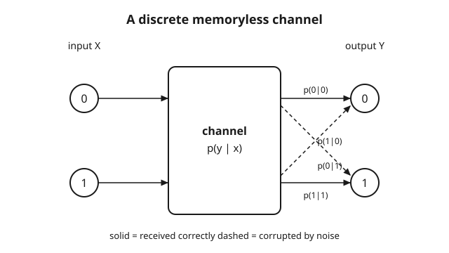

# Information Theory · Lesson 3.1: Discrete channels and capacity

> ⏱ ~15 min · Module 3: Channel capacity · Builds on: [2.5 Beyond symbol codes: arithmetic coding](02-05-arithmetic-coding.md) · Unlocks: [3.2 Canonical channels](03-02-canonical-channels.md)

## Why this matters

Module 2 was about *compression* — squeezing a source down to its entropy so nothing is wasted. Module 3 flips the problem: now the enemy is **noise**. You send a symbol; something scrambles it in transit; the receiver sees a corrupted version and has to guess what you meant. A phone line, a scratched DVD, a deep-space radio link, a strand of DNA copied by an error-prone enzyme — all the same shape. The question this module answers is the deepest one in the subject: *how much information can you reliably push through a noisy pipe per use?* That number has a name — **capacity** — and this lesson defines it.

## The idea

Picture the channel as a box. You feed in a symbol on the left; a symbol comes out on the right; the box is noisy, so what comes out is a random, possibly-wrong function of what went in. The box's behavior is fully described by a table: *given I put in $x$, what's the probability I get out each possible $y$?* That table is the channel — fixed, out of your control, a property of the physics.

What *is* in your control is **how you use** the box: which input symbols you send, and how often. Some ways of using a noisy channel are smart and some are wasteful. If two of your input symbols get scrambled into the same output half the time, leaning on that confusable pair is throwing information away. The **capacity** is what you get when you use the channel as cleverly as possible — the input strategy that lets the receiver recover the most about your input from the output.

"Recover the most about the input from the output" is exactly the mutual information $I(X;Y)$ from Lesson 1.3 — how much seeing $Y$ tells you about $X$. So capacity is just: *maximize $I(X;Y)$ over every way of driving the channel.* The channel fixes the noise; you optimize your input; the best achievable $I(X;Y)$ is the capacity.

## The formal version

**Discrete memoryless channel (DMC).** A DMC is a triple: an input alphabet $\mathcal{X}$, an output alphabet $\mathcal{Y}$, and a **transition matrix** $p(y\mid x)$ — for each input $x$, a probability distribution over outputs $y$. "Memoryless" means each use of the channel is independent of the others: the noise on use $n$ ignores what happened on uses $1,\dots,n-1$.

In words: the channel is a lookup table of conditional distributions. Row $x$ tells you the odds of each output when you send $x$; every row sums to 1, because *something* always comes out.

**Channel capacity.**
$$C \;=\; \max_{p(x)}\, I(X;Y),$$
where the maximum is over all input distributions $p(x)$ on $\mathcal{X}$, and $Y$ is the output produced by feeding that input through the fixed $p(y\mid x)$.

In words: try every possible input distribution, compute the mutual information each one achieves, and keep the largest. That largest value is the capacity, measured in **bits per channel use**.

Two pieces make up the $I(X;Y)$ you are maximizing. Using $I(X;Y) = H(Y) - H(Y\mid X)$ (Lesson 1.3):
- $H(Y)$ — the uncertainty in the output. You influence this by choosing $p(x)$.
- $H(Y\mid X) = \sum_x p(x)\,H(Y\mid X=x)$ — the *residual* uncertainty in $Y$ once the input is known. This is pure channel noise: $H(Y\mid X=x)$ is the entropy of row $x$ of the transition matrix, fixed by the channel.

In words: information through the channel = total output surprise minus the surprise that's just noise. Capacity pushes the first term up (make the output as informative as possible) while the second term is a floor set by the hardware.

The maximizing $p(x)$ is called the **capacity-achieving distribution**. Lesson 3.3 will prove the payoff — that $C$ is exactly the highest rate at which you can communicate with vanishing error — but the *definition* stands on its own right here.

## Picture

## Worked examples

**Example 1 (a Z-channel — compute $I$, then maximize).** Inputs $\mathcal{X}=\{0,1\}$, outputs $\mathcal{Y}=\{0,1\}$. A $0$ is always received correctly, but a $1$ is flipped to $0$ with probability $a$. The transition matrix (rows = input, columns = output $0,1$):
$$p(y\mid x): \quad \begin{array}{c|cc} & y=0 & y=1 \\\hline x=0 & 1 & 0 \\ x=1 & a & 1-a \end{array}$$
Send $x=1$ with probability $\alpha$ (so $x=0$ with probability $1-\alpha$). Then the output is $1$ only when we sent $1$ and it survived:
$$P(Y=1) = \alpha(1-a), \qquad P(Y=0) = 1 - \alpha(1-a).$$
Now the two terms. The output entropy, writing $H_b(t) = -t\log_2 t - (1-t)\log_2(1-t)$ for the binary entropy function:
$$H(Y) = H_b\big(\alpha(1-a)\big).$$
The noise term: row $x=0$ is deterministic so $H(Y\mid X=0)=0$; row $x=1$ has entropy $H_b(a)$. Weighted by input probabilities,
$$H(Y\mid X) = (1-\alpha)\cdot 0 + \alpha\cdot H_b(a) = \alpha\,H_b(a).$$
So the mutual information for input weight $\alpha$ is
$$I(X;Y) = H_b\big(\alpha(1-a)\big) - \alpha\,H_b(a).$$
Capacity is the max over $\alpha\in[0,1]$: $C = \max_{\alpha}\,\big[H_b(\alpha(1-a)) - \alpha H_b(a)\big]$. Take a concrete $a = \tfrac12$ (a sent $1$ is a coin flip). Then $H_b(a)=1$ and $I = H_b(\alpha/2) - \alpha$. Differentiate and set to zero: $\frac{d}{d\alpha}H_b(\alpha/2) = \tfrac12\log_2\!\frac{1-\alpha/2}{\alpha/2}$, so the condition is $\tfrac12\log_2\frac{2-\alpha}{\alpha} = 1$, i.e. $\frac{2-\alpha}{\alpha} = 4$, giving $\alpha = \tfrac{2}{5} = 0.4$. Then
$$C = H_b(0.2) - 0.4 = 0.7219 - 0.4 \approx 0.322 \text{ bits per use.}$$
Notice the capacity-achieving input is **not** uniform — it favors the "safe" symbol $0$ (weight $0.6$) because sending $1$ is where the noise lives.

**Example 2 (the two extremes).**

*Noiseless channel:* $Y = X$ always, with $|\mathcal{X}| = m$ symbols. Every row of $p(y\mid x)$ is deterministic, so $H(Y\mid X) = 0$ and $I(X;Y) = H(Y)$. The output entropy is maxed by a uniform input, giving $H(Y) = \log_2 m$. Hence
$$C = \log_2 m \text{ bits per use.}$$
For $m=2$, that's exactly $1$ bit per use — a clean binary wire carries one bit each time, no more, no less. The capacity equals the raw symbol count's log: perfect channel, nothing lost.

*Useless channel:* $Y$ is independent of $X$ — the output distribution is the same no matter what you send. Then knowing $X$ tells you nothing about $Y$, so $H(Y\mid X) = H(Y)$ and
$$I(X;Y) = H(Y) - H(Y\mid X) = 0 \quad\Rightarrow\quad C = 0.$$
No input strategy helps: the receiver could generate $Y$ on its own without you. Zero bits per use — the pipe is disconnected in all but name.

## Watch out

- **You optimize the input, not the noise.** You might think capacity somehow improves the channel — but $p(y\mid x)$ is fixed hardware. The $\max$ is over the *input distribution* $p(x)$, the one thing you choose. Capacity is a property of the **channel**; it's the best you can do *given* that noise.
- **The best input is usually not uniform.** You might reflexively feed the channel a uniform input. That's optimal only for *symmetric* channels; Example 1 tilted to $0.4$/$0.6$ to dodge the noisier symbol. Always solve the maximization — don't assume uniform.
- **Capacity is a ceiling reached only via coding, not a per-symbol promise.** You might read "$C = 0.322$ bits" as "each single use delivers $0.322$ bits reliably." It doesn't — a single noisy use can still be wrong. $C$ is the *asymptotic* reliable rate, achievable only by coding across many uses (the theorem in [3.3](03-03-noisy-channel-coding-achievability.md)). And the units are always **bits per channel use**.

## One-liner

> The channel fixes the noise $p(y\mid x)$; you pick the input $p(x)$ — capacity $C=\max_{p(x)} I(X;Y)$ is the most information that best choice can push through, in bits per use.

## Problems

**P1 (🟢)** A binary channel has transition matrix (rows $x=0,1$; columns $y=0,1$)
$$\begin{array}{c|cc} & y=0 & y=1\\\hline x=0 & 0.9 & 0.1\\ x=1 & 0.1 & 0.9\end{array}$$
With a uniform input ($p(0)=p(1)=\tfrac12$), compute $H(Y)$, $H(Y\mid X)$, and $I(X;Y)$. (This is a symmetric channel, so uniform is in fact capacity-achieving — you're computing $C$.)

**P2 (🟡)** A channel has $\mathcal{X}=\{0,1\}$ and *three* outputs $\mathcal{Y}=\{0,\,?,\,1\}$: a sent $0$ comes out $0$ with prob $0.8$ and "?" (erasure) with prob $0.2$; a sent $1$ comes out $1$ with prob $0.8$ and "?" with prob $0.2$. So symbols are never *flipped*, only sometimes erased. With uniform input, compute $I(X;Y)$. What's the intuition for why it equals $1 - 0.2 = 0.8$?

**P3 (🔴, optional)** For the Z-channel of Example 1 with general crossover $a$, you have $I(\alpha) = H_b(\alpha(1-a)) - \alpha H_b(a)$. Show that the capacity-achieving weight satisfies
$$\alpha^* (1-a) = \frac{1}{1 + 2^{\,H_b(a)/(1-a)}}.$$
(Hint: differentiate $I$ with respect to $\alpha$, use $\frac{d}{dt}H_b(t) = \log_2\frac{1-t}{t}$ and the chain rule, set to zero, and solve for the quantity $\alpha(1-a) = P(Y=1)$.)

Solutions

**P1** Output distribution: $P(Y=0) = \tfrac12(0.9) + \tfrac12(0.1) = 0.5$, and $P(Y=1)=0.5$ by symmetry. So $H(Y) = H_b(0.5) = 1$ bit. Noise term: each row has entropy $H_b(0.1) = -0.1\log_2 0.1 - 0.9\log_2 0.9 = 0.3322 + 0.1368 = 0.4690$ bits; both rows the same, so $H(Y\mid X) = 0.469$ regardless of input weights. Therefore
$$I(X;Y) = 1 - 0.469 = 0.531 \text{ bits per use} = C.$$
A binary symmetric channel with 10% error carries about half a bit per use — the noise eats the other half.

**P2** Output distribution under uniform input: $P(Y=0) = \tfrac12(0.8) = 0.4$, $P(Y=1) = \tfrac12(0.8) = 0.4$, $P(Y=?) = \tfrac12(0.2)+\tfrac12(0.2) = 0.2$. So
$$H(Y) = -0.4\log_2 0.4 - 0.4\log_2 0.4 - 0.2\log_2 0.2 = 0.5288 + 0.5288 + 0.4644 = 1.5219 \text{ bits.}$$
Noise term: each row is $(0.8, 0.2)$ over two outcomes, entropy $H_b(0.2) = 0.7219$; same for both inputs, so $H(Y\mid X) = 0.7219$. Then
$$I(X;Y) = 1.5219 - 0.7219 = 0.8 \text{ bits per use.}$$
Intuition: when the symbol isn't erased (prob $0.8$) the receiver learns $X$ *perfectly* — no flips, so an un-erased output pins down the input; when it is erased (prob $0.2$) it learns nothing. Averaging: $0.8\times 1 + 0.2\times 0 = 0.8$ bits. (This is the binary erasure channel; its capacity is $1 - p_{\text{erase}}$, and uniform input is optimal by symmetry.)

**P3** Write $q = \alpha(1-a) = P(Y=1)$, so $H(Y) = H_b(q)$ and $I = H_b(q) - \alpha H_b(a)$. Differentiate with respect to $\alpha$; since $q = \alpha(1-a)$, $\frac{dq}{d\alpha} = 1-a$:
$$\frac{dI}{d\alpha} = \frac{dH_b(q)}{dq}\cdot(1-a) - H_b(a) = (1-a)\log_2\frac{1-q}{q} - H_b(a).$$
Set to zero:
$$(1-a)\log_2\frac{1-q}{q} = H_b(a) \;\Rightarrow\; \log_2\frac{1-q}{q} = \frac{H_b(a)}{1-a} \;\Rightarrow\; \frac{1-q}{q} = 2^{\,H_b(a)/(1-a)}.$$
Solving $\frac{1-q}{q} = K$ gives $q = \frac{1}{1+K}$, i.e.
$$\alpha^*(1-a) = q = \frac{1}{1 + 2^{\,H_b(a)/(1-a)}}. \qquad\checkmark$$
Check against Example 1's $a=\tfrac12$: $H_b(\tfrac12)=1$, $1-a=\tfrac12$, exponent $=1/0.5 = 2$, so $q = \frac{1}{1+4} = 0.2$. Then $\alpha^* = q/(1-a) = 0.2/0.5 = 0.4$ ✓, matching the earlier answer.

## Flashback

**From Lesson 2.4 (Huffman coding):** A source emits five symbols with probabilities $\{0.4, 0.2, 0.2, 0.1, 0.1\}$. Build a binary Huffman code and compute its expected length $L$. Then compare $L$ to the source entropy $H$ — which side of $H$ must $L$ land on, and why?

Solution

Merge the two smallest repeatedly. Start $\{0.4,\,0.2,\,0.2,\,0.1,\,0.1\}$.
1. Merge $0.1 + 0.1 = 0.2$ → $\{0.4,\,0.2,\,0.2,\,0.2\}$.
2. Merge two $0.2$'s $= 0.4$ → $\{0.4,\,0.4,\,0.2\}$.
3. Merge $0.4 + 0.2 = 0.6$ → $\{0.6,\,0.4\}$.
4. Merge $= 1.0$.

Assigning bits along the tree gives codeword lengths: the $0.4$ symbol gets length 1, the two original $0.2$ symbols get length 2 and 3 (depending on the merge structure), and the two $0.1$ symbols get length 4. A valid length assignment consistent with the tree is $\{1, 2, 3, 4, 4\}$ paired with probabilities $\{0.4, 0.2, 0.2, 0.1, 0.1\}$. Expected length:
$$L = 0.4(1) + 0.2(2) + 0.2(3) + 0.1(4) + 0.1(4) = 0.4 + 0.4 + 0.6 + 0.4 + 0.4 = 2.2 \text{ bits.}$$
Source entropy:
$$H = -0.4\log_2 0.4 - 2(0.2\log_2 0.2) - 2(0.1\log_2 0.1) = 0.5288 + 2(0.4644) + 2(0.3322) = 2.122 \text{ bits.}$$
So $L = 2.2 \ge H = 2.122$. Huffman is optimal, yet still $L \ge H$: the source coding theorem guarantees no prefix code beats entropy ($L \ge H$ always), and Huffman achieves within one bit ($L < H+1$). The small gap ($0.078$ bit) is the unavoidable cost of integer codeword lengths — exactly the slack arithmetic coding (Lesson 2.5) closes by coding many symbols at once.

## Connections

- **Backward:** capacity *is* the mutual information of [1.3](01-03-mutual-information.md), maximized — $C = \max_{p(x)} I(X;Y)$. The decomposition $I = H(Y) - H(Y\mid X)$ uses the conditional entropy of [1.2](01-02-joint-conditional-entropy-chain-rule.md), where the noise term $H(Y\mid X=x)$ is just the entropy of a transition-matrix row.
- **Forward:** [3.2](03-02-canonical-channels.md) works out $C$ for the standard channels (symmetric, erasure) in closed form; [3.3](03-03-noisy-channel-coding-achievability.md) proves the payoff — that $C$ is the maximum rate of *arbitrarily reliable* communication; [3.4](03-04-converse-fano-inequality.md) proves you can't beat it (the converse, via Fano's inequality).
- **Sideways (probability):** the transition matrix $p(y\mid x)$ is a family of **conditional distributions** — one output distribution per input — exactly the conditional-probability machinery from [probability theory](../../probability-theory/syllabus.md). A channel is a stochastic map from $\mathcal{X}$ to $\mathcal{Y}$.
- **Sideways (linear algebra):** $p(y\mid x)$ is a **row-stochastic matrix** (nonnegative, rows summing to 1) — the same objects as Markov transition matrices in [linear algebra](../../linalg-refresher/syllabus.md). Later, when many channels run in parallel, their structure gets diagonalized and capacity splits across independent modes — an eigen-decomposition story we'll meet in the Gaussian setting.
