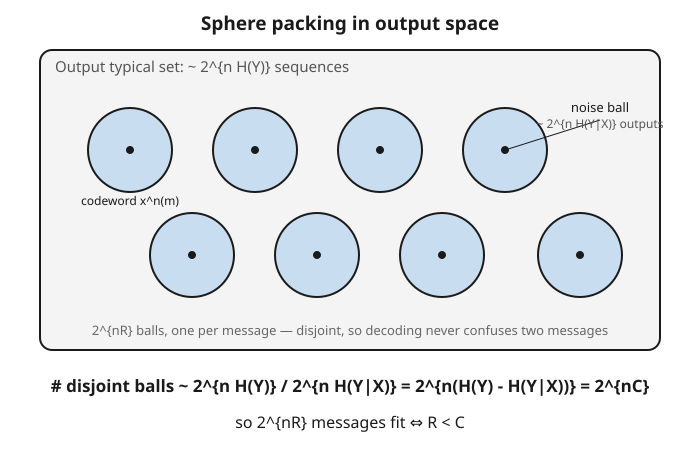

# Information Theory · Lesson 3.3: The noisy-channel coding theorem — achievability

> ⏱ ~15 min · Module 3: Channel capacity · Builds on: [3.2 Canonical channels](03-02-canonical-channels.md) · Unlocks: [3.4 The converse and Fano's inequality](03-04-converse-fano-inequality.md)

## Why this matters

Here is the result that founded the digital age. A channel corrupts a fixed fraction of everything you send — flip a bit here, erase a symbol there — and naive intuition says the only way to fight noise is redundancy that drags your error rate down *at the cost of* your rate: repeat every bit three times and you're slower but safer, five times safer still, and to reach *zero* errors you'd have to send infinitely slowly. Shannon proved that intuition wrong. Below a sharp threshold called the **capacity** $C$, you can drive the error probability to **zero while keeping the rate positive and fixed**. Reliable communication over an unreliable channel isn't a fantasy you approach asymptotically for free — it's a theorem. This lesson proves the achievable half: every rate $R < C$ is attainable.

## The idea

The trick is to stop protecting bits one at a time and instead **code over long blocks**. Send a length-$n$ block, and the channel's noise, averaged over $n$ symbols, becomes predictable: by the law of large numbers a transmitted block lands in a well-defined cloud of "typical" outputs — its **noise ball** — and almost never outside it.

Now picture the space of all typical output blocks. It holds about $2^{nH(Y)}$ sequences. Each codeword you might send occupies a noise ball of about $2^{nH(Y \mid X)}$ of them — the outputs its particular noise is likely to produce. So the question "how many distinct messages can I reliably send?" becomes a packing question: **how many noise balls fit disjointly inside the output space?** Divide the volumes:

$$\frac{2^{nH(Y)}}{2^{nH(Y \mid X)}} = 2^{n(H(Y) - H(Y \mid X))} = 2^{nI(X;Y)}.$$

At the input distribution that maximizes $I(X;Y)$, that exponent is exactly $nC$. If your balls don't overlap, the receiver can look at the output block, see which ball it fell in, and recover the message with near-certainty. You can afford $2^{nR}$ messages precisely when $2^{nR}$ balls fit — that is, when $R < C$.

The genuinely surprising part is *how* Shannon shows such a packing exists: he doesn't construct one. He throws down $2^{nR}$ codewords **at random** and shows the *average* codebook already works. If the average is good, at least one specific codebook is at least that good — so a good code must exist, even though we never built it.

## The formal version

Fix a discrete memoryless channel with transition law $p(y \mid x)$ and capacity $C = \max_{p(x)} I(X;Y)$.

**Rate.** A block code of length $n$ carrying $M$ equally-likely messages has **rate**

$$R = \frac{\log_2 M}{n} \quad \text{bits per channel use}, \qquad M = 2^{nR}.$$

In words: $R$ is how many bits of message you push through per symbol sent — total message bits $\log_2 M$, spread over the $n$ uses of the channel.

A $(2^{nR}, n)$ **code** is an encoder $m \mapsto x^n(m)$ assigning each message $m \in \{1,\dots,2^{nR}\}$ a length-$n$ codeword, plus a decoder $\hat{m}(y^n)$. Its error probability is $\Pr(\hat{m} \neq m)$.

**Joint typicality.** A pair $(x^n, y^n)$ is **jointly typical** if $x^n$ is typical for $p(x)$, $y^n$ is typical for $p(y)$, *and* the pair is typical for the joint $p(x,y)$ — i.e. all three per-symbol surprises sit within $\varepsilon$ of their entropies $H(X)$, $H(Y)$, $H(X,Y)$. The **joint AEP** gives two facts we need:

1. If $(X^n, Y^n)$ is a genuine input–output pair, $\Pr\big((X^n,Y^n) \text{ jointly typical}\big) \to 1$.
2. If instead $\tilde{X}^n$ and $Y^n$ are drawn *independently* with those same marginals, then $\Pr\big((\tilde{X}^n, Y^n) \text{ jointly typical}\big) \le 2^{-n(I(X;Y) - 3\varepsilon)}$.

In words: a true pair is almost always jointly typical (fact 1), but an unrelated pair is jointly typical only exponentially rarely (fact 2) — and the exponent is the mutual information. That gap is the whole engine.

**The theorem (Shannon, 1948 — achievability).** For every rate $R < C$ there exists a sequence of $(2^{nR}, n)$ codes whose error probability $\to 0$ as $n \to \infty$.

In words: any rate below capacity is achievable with arbitrarily reliable decoding, given long enough blocks.

**Proof sketch (random coding).** Generate the codebook by drawing all $2^{nR}$ codewords i.i.d. from the capacity-achieving $p(x)$. To decode $y^n$, output the unique message whose codeword is jointly typical with $y^n$ (error if there is none, or more than one). Averaged over both the random codebook and the random message, the error splits into two events:

- $E_0$: the *true* codeword is not jointly typical with $y^n$. By fact 1, $\Pr(E_0) \to 0$.
- $E_i$ (for each wrong message $i$): the *wrong* codeword $x^n(i)$ is jointly typical with $y^n$. Since $x^n(i)$ was drawn independently of the received $y^n$, fact 2 gives $\Pr(E_i) \le 2^{-n(I - 3\varepsilon)}$.

Union bound over the $2^{nR} - 1$ wrong messages:

$$\Pr(\text{error}) \le \Pr(E_0) + \sum_{i \neq m} \Pr(E_i) \le \varepsilon + 2^{nR}\, 2^{-n(I - 3\varepsilon)} = \varepsilon + 2^{-n(I - R - 3\varepsilon)}.$$

With $p(x)$ chosen so $I = C$, the exponent is positive whenever $R < C - 3\varepsilon$, so the whole bound $\to 0$. That kills the *average* error over random codebooks — hence **some** specific codebook has error at least this small. (Throwing away the worst half of its codewords upgrades "average error small" to "maximal error small" at a negligible rate cost.) $\blacksquare$

## Picture

Each dark dot is a codeword; its shaded ball is the set of outputs its noise is likely to produce. Reliable decoding = disjoint balls. The output space fits about $2^{nC}$ of them, so you can place $2^{nR}$ messages exactly when $R < C$.

## Worked examples

**Example 1 (the counting argument, concretely).** Take a binary symmetric channel with crossover probability $p = 0.11$, driven by a uniform input. Then the output $Y$ is uniform, so $H(Y) = 1$ bit, and each sent bit is flipped with probability $p$, so $H(Y \mid X) = H(p) = H(0.11) \approx 0.5$ bits. Over a block of length $n = 100$:

- The output typical set holds $\approx 2^{nH(Y)} = 2^{100}$ sequences.
- Each codeword's noise ball holds $\approx 2^{nH(Y \mid X)} = 2^{50}$ of them (the outputs differing from the codeword in $\approx np = 11$ positions).
- Distinguishable messages $\approx 2^{100} / 2^{50} = 2^{50}$.

So $2^{50}$ messages ride reliably on $2^{100}$ possible outputs — a rate of $R = \frac{\log_2 2^{50}}{100} = 0.5$ bits/use, and indeed $C = H(Y) - H(Y \mid X) = 1 - 0.5 = 0.5$. The packing is tight: you get exactly $2^{nC}$ balls, no more.

**Example 2 (why the average codebook works).** It's worth seeing *why* random junk codewords don't collide. Suppose $I(X;Y) = 0.7$ bits and you attempt rate $R = 0.5$ over blocks of length $n = 50$. A single wrong codeword is jointly typical with the received $y^n$ with probability $\le 2^{-nI} = 2^{-35}$ — astronomically small, because an unrelated codeword has no reason to "explain" $y^n$. You have $2^{nR} - 1 \approx 2^{25}$ wrong codewords, so the expected number of false matches is

$$2^{nR} \cdot 2^{-nI} = 2^{n(R - I)} = 2^{50(0.5 - 0.7)} = 2^{-10} \approx 0.001.$$

Vanishingly few impostors, plus a true codeword that is almost surely jointly typical (fact 1) — so the average codebook decodes correctly with probability $\approx 1$. Push $R$ up toward $I = 0.7$ and the impostor count $2^{n(R-I)}$ climbs back toward 1; cross $R = 0.7$ and it explodes. The reliable rate on a BSC with crossover $p$ is exactly $C = 1 - H(p)$: for $p = 0.11$, up to $0.5$ bits/use. Note what *did not* happen — no error-correcting construction, no parity checks. Existence, proved by averaging.

## Watch out

- **You might think you're correcting each symbol as it arrives — you're not.** The guarantee is about *blocks*. There is no per-symbol fix that beats capacity; reliability emerges only from coding jointly over long $n$, letting the law of large numbers tame the noise. A single symbol is as corrupted as ever.
- **You might think $R < C$ and $R > C$ differ by degree — they differ by a wall.** Below $C$, error $\to 0$; above $C$, error is bounded *away* from 0 no matter how cleverly you code (that's the converse, [3.4](03-04-converse-fano-inequality.md)). Capacity is a sharp threshold, not a gradual speed-vs-reliability dial.
- **You might think random coding hands you a usable code — it doesn't.** It proves a good code *exists*; it gives no way to encode or decode efficiently (joint-typicality decoding over $2^{nR}$ codewords is astronomically expensive). Building practical codes that approach $C$ took another fifty years — see [3.5](03-05-codes-in-practice.md).
- **You might think this holds for any block length — it's asymptotic.** "Error $\to 0$" needs $n \to \infty$. At finite $n$ there is a residual error and a rate penalty; the clean threshold is a large-$n$ statement.

## One-liner

> Pack $2^{nR}$ noise balls of size $2^{nH(Y \mid X)}$ into an output space of size $2^{nH(Y)}$: they fit disjointly — so every message decodes — exactly when $R < C$, and a purely random codebook already achieves it.

## Problems

**P1 (🟢)** A channel used over blocks has output typical set of size $\approx 2^{nH(Y)}$ with $H(Y) = 1$ bit, and each codeword's noise ball has size $\approx 2^{nH(Y\mid X)}$ with $H(Y\mid X) = 0.5$ bits. For $n = 100$: (a) how many messages can be distinguished reliably (as a power of 2)? (b) What is the corresponding rate in bits/use, and how does it compare to the capacity $C = H(Y) - H(Y\mid X)$?

**P2 (🟡)** In the random-coding argument the union bound gives $\Pr(\text{error}) \le \varepsilon + 2^{n(R - I)}$, with $I = C$. (a) Take $C = 0.7$ bits and $R = 0.5$; evaluate the exponential term $2^{n(R-C)}$ at $n = 50$ and at $n = 200$, and say what happens as $n \to \infty$. (b) For which rates $R$ does that term vanish as $n \to \infty$? (c) In one sentence, what goes wrong with the bound when $R > C$?

**P3 (🔴, optional)** Give the sphere-packing count for a binary symmetric channel with crossover probability $p$, uniform input. (a) Over a block of length $n$, roughly how many output sequences lie in one codeword's noise ball, expressed as a power of 2? (Hint: a typical output differs from the sent codeword in $\approx np$ of the $n$ bit positions; count those sequences with the entropy estimate $\binom{n}{np} \approx 2^{nH(p)}$.) (b) The total number of length-$n$ binary outputs is $2^n$. Divide to get the number of disjoint balls, and identify it as $2^{nC}$. (c) For $p = 0.1$, give $C$ numerically and the maximum reliable rate.

Solutions

**P1** (a) Distinguishable messages $\approx \dfrac{2^{nH(Y)}}{2^{nH(Y\mid X)}} = 2^{n(H(Y) - H(Y\mid X))} = 2^{100(1 - 0.5)} = 2^{50}$. (b) Rate $R = \dfrac{\log_2 2^{50}}{100} = \dfrac{50}{100} = 0.5$ bits/use. The capacity is $C = H(Y) - H(Y\mid X) = 1 - 0.5 = 0.5$ bits/use, so this packing achieves *exactly* capacity — the noise balls tile the output space with none to spare, which is the boundary case $R = C$.

**P2** (a) The term is $2^{n(R-C)} = 2^{n(0.5 - 0.7)} = 2^{-0.2n}$. At $n = 50$: $2^{-10} \approx 9.8 \times 10^{-4}$. At $n = 200$: $2^{-40} \approx 9.1 \times 10^{-13}$. As $n \to \infty$ it $\to 0$, so (with $\varepsilon$ also taken small) $\Pr(\text{error}) \to 0$. (b) The exponent $R - C$ is negative exactly when $R < C$; then $2^{n(R-C)} \to 0$. So every rate below capacity works. (Strictly, the proof needs $R < C - 3\varepsilon$, but $\varepsilon$ can be taken arbitrarily small, recovering all $R < C$.) (c) For $R > C$ the exponent $R - C$ is positive, so $2^{n(R-C)} \to \infty$: the union bound blows up and gives no control — the expected number of jointly-typical impostor codewords grows without bound, and (by the converse) reliable decoding is genuinely impossible, not just unprovable here.

**P3** (a) A typical received sequence flips $\approx np$ of the $n$ bits, and the number of ways to choose which positions flip is $\binom{n}{np} \approx 2^{nH(p)}$ (the entropy estimate of a binomial coefficient). So each noise ball holds $\approx 2^{nH(p)}$ outputs, i.e. $2^{nH(Y\mid X)}$ with $H(Y\mid X) = H(p)$. (b) Number of disjoint balls $\approx \dfrac{2^n}{2^{nH(p)}} = 2^{n(1 - H(p))} = 2^{nC}$, since for the BSC with uniform input $C = 1 - H(p)$. (c) $H(0.1) = -0.1\log_2 0.1 - 0.9\log_2 0.9 \approx 0.332 + 0.137 = 0.469$ bits, so $C = 1 - 0.469 = 0.531$ bits/use — the maximum reliable rate. Any $R < 0.531$ is achievable; any $R > 0.531$ is not.

## Flashback

**From Lesson 3.2 (Canonical channels):** Two channels each lose a fraction $0.05$ of what you send, but in different ways. Channel A is a **binary symmetric channel** with crossover probability $p = 0.05$ (a bit is *flipped* 5% of the time, and you don't know which). Channel B is a **binary erasure channel** with erasure probability $\varepsilon = 0.05$ (a bit is *erased* 5% of the time, and you *do* know which). Compute the capacity of each and explain in one sentence why erasures are the friendlier failure.

Solution

BSC: $C_A = 1 - H(p) = 1 - H(0.05)$, where
$$H(0.05) = -0.05\log_2 0.05 - 0.95\log_2 0.95 \approx 0.216 + 0.070 = 0.286 \text{ bits},$$
so $C_A \approx 1 - 0.286 = 0.714$ bits/use.

BEC: $C_B = 1 - \varepsilon = 1 - 0.05 = 0.95$ bits/use.

Erasures are friendlier because the receiver *knows the location* of every lost bit — the uncertainty is only "what was there," not "was anything corrupted at all." A flip forces you to spend coding effort finding *and* fixing the error; an erasure only asks you to fill a marked gap, so the BEC gives up just the $\varepsilon$ fraction it deletes ($C = 1 - \varepsilon$), while the BSC pays the steeper $H(p)$ toll. ✓

## Connections

- **Backward:** the whole argument is [2.1](02-01-asymptotic-equipartition-property.md)'s AEP, run on *pairs* $(X^n, Y^n)$ instead of single sequences — "typical" becomes "jointly typical," and the noise-ball size $2^{nH(Y\mid X)}$ is the conditional version of the typical-set count. The capacity $C = \max I(X;Y)$ being packed against comes from [3.1](03-01-discrete-channels-capacity.md), and the specific $C$ values (BSC, BEC) from [3.2](03-02-canonical-channels.md).
- **Forward:** [3.4 The converse and Fano's inequality](03-04-converse-fano-inequality.md) proves the other half — that $R > C$ *cannot* be made reliable — turning capacity into a two-sided sharp threshold. [3.5 Codes in practice](03-05-codes-in-practice.md) confronts the gap this lesson leaves open: random coding proves existence but builds nothing usable.
- **Sideways (probability):** every "$\to 1$" and "$\to 0$" here is the **law of large numbers** from [probability-theory](../../probability-theory/syllabus.md) acting on i.i.d. per-symbol surprises — the same concentration that powered the AEP, now deciding whether noise balls stay disjoint.
- **Sideways (learning):** the random-coding move — *bound the average over a random ensemble, then conclude a good individual exists* — is a cousin of generalization bounds in [statistical-learning](../../statistical-learning/syllabus.md), where a union bound over a hypothesis class plus concentration shows some low-error predictor must exist. Same two ingredients: a union bound over exponentially many candidates, tamed by an exponentially small tail.
