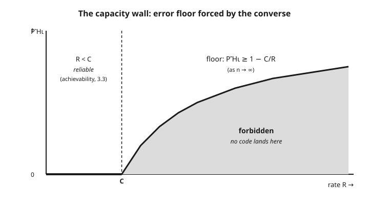

# Information Theory · Lesson 3.4: The converse and Fano's inequality

> ⏱ ~15 min · Module 3: Channel capacity · Builds on: [3.3 The noisy-channel coding theorem: achievability](03-03-noisy-channel-coding-achievability.md) · Unlocks: [3.5 Codes in practice](03-05-codes-in-practice.md)

## Why this matters

[Lesson 3.3](03-03-noisy-channel-coding-achievability.md) gave you the good news: for any rate $R$ below capacity $C$, codes exist that drive the error probability to zero. But that only proves capacity is *achievable* — it leaves open whether some ingenious scheme could sneak above $C$ and still be reliable. This lesson slams that door. We prove the **converse**: any code running at a rate above capacity has an error probability bounded away from zero, no matter how clever, no matter how long the block. Together the two halves pin $C$ as the *exact* dividing line between what's possible and what's not — one of the sharpest thresholds in all of applied mathematics. The single tool that does it, **Fano's inequality**, also underlies the fundamental limits of statistical estimation, so it's worth meeting properly.

## The idea

Suppose you send one of $M$ equally likely messages across a noisy channel and, from the garbled output, try to guess which one it was. Intuitively, if the channel destroyed a lot of information — if there's still real uncertainty about the message *after* you've seen the output — then you're going to guess wrong sometimes. You can't decode away uncertainty that the channel never let through.

Fano's inequality makes that intuition quantitative. It says: the leftover uncertainty about the message, given the output, puts a **floor** under how often you err. Lots of residual uncertainty forces a high error rate; you simply cannot be reliable when the output doesn't nail down the input.

Now stack that against the channel's bandwidth. A length-$n$ block can carry at most $nC$ bits of information about the message — that's what capacity *means*. But a message at rate $R$ carries $nR$ bits of its own. If $R > C$, the message is fatter than the pipe: $nR$ bits of intent, only $nC$ bits get through, and the gap is pure residual uncertainty. Fano converts that leftover uncertainty straight into an error floor. Push $R$ above $C$ and reliability is not merely hard — it is impossible.

## The formal version

**Fano's inequality.** Let $X$ be a random variable on an alphabet $\mathcal{X}$ of size $|\mathcal{X}|$, and let $\hat{X}$ be any estimate of $X$ computed from an observation $Y$ (so $X \to Y \to \hat{X}$). Let the error probability be $P_e = \Pr(\hat{X} \neq X)$. Then

$$H(X \mid Y) \;\leq\; H_b(P_e) + P_e \log\big(|\mathcal{X}| - 1\big).$$

In words: the uncertainty about $X$ that remains after seeing $Y$ can be blamed on two things — a coin flip for *whether* you erred ($H_b(P_e)$), plus, if you did, which of the other $|\mathcal{X}|-1$ values it was ($P_e \log(|\mathcal{X}|-1)$). Here $H(X\mid Y)$ is the conditional entropy from [1.2](01-02-joint-conditional-entropy-chain-rule.md), and $H_b(t) = -t\log t - (1-t)\log(1-t)$ is the binary entropy of a probability $t$. Logs are base 2, so everything is in bits.

Rearranged, Fano lower-bounds the error by the residual uncertainty:

$$P_e \;\geq\; \frac{H(X\mid Y) - H_b(P_e)}{\log(|\mathcal{X}|-1)} \;\geq\; \frac{H(X\mid Y) - 1}{\log|\mathcal{X}|},$$

using $H_b(P_e) \leq 1$ and $\log(|\mathcal{X}|-1) \leq \log|\mathcal{X}|$. In words: uncertainty you can't resolve is error you can't avoid.

**The converse to the coding theorem.** Send a message $W$ drawn uniformly from $\{1, \dots, 2^{nR}\}$ (so $H(W) = nR$ bits) through $n$ uses of a channel with capacity $C$, producing output $Y^n$, and let $\hat{W}$ be the decoder's guess with block error $P_e = \Pr(\hat{W} \neq W)$. Split $H(W)$ using [mutual information](01-03-mutual-information.md):

$$nR = H(W) = I(W; Y^n) + H(W \mid Y^n).$$

In words: what you meant to send equals what got through, plus what stayed uncertain. Now bound each piece.

- **The channel piece.** $I(W; Y^n) \leq nC$. The decoder and encoder are just processing, so by the [data-processing inequality](01-05-data-processing-inequality.md) the message can share no more information with the output than the channel's $n$ uses permit — and that is $nC$ by definition of capacity.
- **The uncertainty piece.** Apply Fano with alphabet size $2^{nR}$: $H(W\mid Y^n) \leq H_b(P_e) + P_e \log(2^{nR}-1) \leq 1 + P_e\, nR$.

Substitute both:

$$nR \;\leq\; nC + 1 + P_e\, nR.$$

Solve for $P_e$:

$$\boxed{\,P_e \;\geq\; 1 - \frac{C}{R} - \frac{1}{nR}\,}$$

In words: whenever $R > C$, the term $1 - C/R$ is a *positive* constant, and $1/(nR) \to 0$ as $n$ grows — so the block error is trapped above a fixed floor and can never be driven to zero. Reliable communication above capacity is impossible.

## Concrete instance

Fano's floor drawn against rate. Below $C$, achievability ([3.3](03-03-noisy-channel-coding-achievability.md)) lets the error vanish — the floor sits at $0$. Above $C$, the converse forces $P_e \geq 1 - C/R$ (in the $n\to\infty$ limit); the shaded region is unreachable by *any* code.

For a **binary symmetric channel** with crossover probability $p$, capacity is $C = 1 - H_b(p)$ (derived in [3.2](03-02-canonical-channels.md)). Any rate above that value inherits this wall: the noise leaves $H_b(p)$ bits of irreducible uncertainty per symbol, and asking the channel to carry more than $1 - H_b(p)$ bits per use forces a guaranteed error floor. The BSC is where the abstract threshold becomes a concrete, computable number — see Example 2.

## Worked examples

**Example 1 (state Fano, then run the converse).** First, read Fano's inequality as an accounting identity for uncertainty. Imagine a friend must guess $X$ from $Y$. To describe $X$ completely to them, you could send: (i) one bit saying whether their best guess was right — costing $H_b(P_e)$ on average — and (ii) *only if wrong*, the true answer among the remaining $|\mathcal{X}|-1$ candidates, costing at most $\log(|\mathcal{X}|-1)$ but only paid a $P_e$ fraction of the time. That two-part description is an upper bound on the true residual uncertainty $H(X\mid Y)$, which is exactly

$$H(X\mid Y) \leq H_b(P_e) + P_e\log(|\mathcal{X}|-1).$$

Now the converse chain, step by step. Message $W$ is uniform on $2^{nR}$ values, so $H(W) = nR$. Split it:

$$nR = H(W) = \underbrace{I(W;Y^n)}_{\text{got through}} + \underbrace{H(W\mid Y^n)}_{\text{stayed uncertain}}.$$

The first term is capped by the channel: $I(W;Y^n) \le nC$, because the message reaches the decoder only through $n$ channel uses and processing cannot manufacture information ([DPI, 1.5](01-05-data-processing-inequality.md)). The second term is capped by Fano with $|\mathcal{X}| = 2^{nR}$: $H(W\mid Y^n) \le 1 + P_e\,nR$ (the "$1$" absorbs $H_b(P_e)\le 1$; the other term uses $\log(2^{nR}-1) < nR$). Then

$$nR \le nC + 1 + P_e\,nR \;\Longrightarrow\; P_e \ge 1 - \frac{C}{R} - \frac{1}{nR}.$$

For $R > C$ the right side tends to the positive constant $1 - C/R$, so no sequence of codes at rate $R$ can push $P_e$ to $0$. That is the converse.

**Example 2 (Boss 3 finish — a BSC above capacity).** Take a BSC with crossover $p = 0.1$. Its capacity ([3.2](03-02-canonical-channels.md)) is

$$C = 1 - H_b(0.1) = 1 - 0.469 = 0.531 \text{ bits/use}.$$

Suppose an engineer insists on transmitting at rate $R = 0.7$ bits/use — comfortably above $C$. In the long-block limit, the converse gives

$$P_e \ge 1 - \frac{C}{R} = 1 - \frac{0.531}{0.7} = 1 - 0.759 = 0.241.$$

So *no matter what code they design*, at least about $24\%$ of blocks will be decoded wrong, forever — lengthening the block only removes the vanishing $1/(nR)$ slack, it never lowers the $0.241$ floor. Contrast rate $R = 0.5 < C$: there achievability ([3.3](03-03-noisy-channel-coding-achievability.md)) promises codes with $P_e \to 0$. The line between "reliable" and "hopeless" sits exactly at $C = 0.531$, and Boss 3's two halves — deriving $C=1-H_b(p)$ in [3.2](03-02-canonical-channels.md) and this converse — together nail it.

## Watch out

- **You might think** capacity is just "hard to beat," a soft practical limit — **but actually** the converse makes it a *hard ceiling*: above $C$, reliable communication is literally impossible, not merely expensive. There is no code, present or future, that gets around it.
- **You might think** Fano upper-bounds the error — **but actually** it *lower*-bounds it. The residual uncertainty $H(X\mid Y)$ is a floor under $P_e$: uncertainty you cannot decode away is error you cannot avoid. (It says nothing about how *low* error can go — that direction is achievability's job.)
- **You might think** the floor is about some worst-case unlucky message — **but actually** $P_e$ here is the **block/average** error probability over the uniform message set. The bound constrains the average, so it constrains every code as a whole.
- **You might think** the $H_b(P_e)$ in Fano is the channel's binary entropy $H_b(p)$ — **but actually** it is the binary entropy of the *error probability itself*, a different quantity. Don't conflate the two even when both appear in a BSC problem.
- **You might think** achievability and the converse overlap or compete — **but actually** they cover disjoint regimes and meet at a point: [3.3](03-03-noisy-channel-coding-achievability.md) handles $R < C$ (possible), this lesson handles $R > C$ (impossible). Their agreement is what makes $C$ *exactly* the threshold.

## One-liner

> Fano turns leftover uncertainty into unavoidable error, and applied to a rate-$R$ code it forces $P_e \ge 1 - C/R$ — so above capacity, reliable communication is not hard, it's impossible.

## Problems

**P1 (🟢)** A message $W$ is uniform on $2^{nR}$ values, sent over a channel of capacity $C$. Starting from $nR = I(W;Y^n) + H(W\mid Y^n)$, and using $I(W;Y^n)\le nC$ and Fano's bound $H(W\mid Y^n)\le 1 + P_e\,nR$, derive $P_e \ge 1 - C/R - 1/(nR)$. Name which inequality justifies each of the two bounds you plug in.

**P2 (🟡)** A BSC has crossover probability $p = 0.2$. (a) Compute its capacity $C$, using $H_b(0.2) = 0.722$. (b) An engineer transmits at $R = 0.6$ bits/use. Give the asymptotic ($n\to\infty$) lower bound on the block error probability. (c) In one sentence, what rate would they need to instead have a hope of reliable transmission?

**P3 (🔴, optional)** Fano's inequality connects to estimation, not just channels. Suppose a statistician must identify an unknown parameter $\theta$ drawn uniformly from a set of $|\mathcal{X}| = M$ candidates, based on data $Y$, and let $P_e = \Pr(\hat\theta \neq \theta)$. (a) Write down what Fano gives as a lower bound on $P_e$ in terms of $H(\theta\mid Y)$ and $M$. (b) Argue that if the data are nearly useless — $I(\theta;Y)$ small, so $H(\theta\mid Y)\approx \log M$ — then $P_e$ is forced close to $1$. This is the seed of *minimax lower bounds* in [statistical-learning](../../statistical-learning/syllabus.md).

Solutions

**P1** Start from the exact split, valid because $H(W) = nR$ (uniform message) and $H(W) = I(W;Y^n) + H(W\mid Y^n)$ is the definition of mutual information:

$$nR = I(W;Y^n) + H(W\mid Y^n).$$

Bound the first term by $I(W;Y^n) \le nC$: the decoder sees $W$ only through $n$ channel uses, so by the **data-processing inequality** ([1.5](01-05-data-processing-inequality.md)) plus the definition of capacity as the maximum information per use, the message shares at most $nC$ bits with the output. Bound the second term by **Fano's inequality** with alphabet size $2^{nR}$: $H(W\mid Y^n) \le H_b(P_e) + P_e\log(2^{nR}-1) \le 1 + P_e\, nR$. Substituting,

$$nR \le nC + 1 + P_e\, nR.$$

Subtract $nC + P_e\,nR$ and divide by $nR$:

$$nR - nC - P_e\,nR \le 1 \;\Longrightarrow\; 1 - \frac{C}{R} - P_e \le \frac{1}{nR} \;\Longrightarrow\; P_e \ge 1 - \frac{C}{R} - \frac{1}{nR}. \checkmark$$

**P2** (a) $C = 1 - H_b(0.2) = 1 - 0.722 = 0.278$ bits/use.

(b) With $R = 0.6 > C$, the asymptotic floor is

$$P_e \ge 1 - \frac{C}{R} = 1 - \frac{0.278}{0.6} = 1 - 0.463 = 0.537.$$

So over half of all blocks are decoded incorrectly, no matter the code — worse than a coin flip on the message content.

(c) They would need $R < C = 0.278$ bits/use; only below capacity does achievability ([3.3](03-03-noisy-channel-coding-achievability.md)) permit $P_e \to 0$.

**P3** (a) Fano with alphabet size $M$ gives, after rearranging,

$$P_e \ge \frac{H(\theta\mid Y) - 1}{\log M},$$

using $H_b(P_e)\le 1$ and $\log(M-1) \le \log M$.

(b) Since $\theta$ is uniform on $M$ values, $H(\theta) = \log M$, and $H(\theta\mid Y) = H(\theta) - I(\theta;Y) = \log M - I(\theta;Y)$. If the data barely inform the parameter, $I(\theta;Y)$ is small and $H(\theta\mid Y) \approx \log M$. Plugging in,

$$P_e \ge \frac{\log M - 1}{\log M} = 1 - \frac{1}{\log M},$$

which approaches $1$ as $M$ grows. Interpretation: with many candidates and weak data, misidentification is nearly certain — you cannot estimate what the data didn't reveal. Choosing a hard finite family of $\theta$'s and applying exactly this bound is the standard recipe for proving that *no* estimator can beat a certain error rate (a minimax lower bound).

## Flashback

**From Lesson 3.3 (Achievability via joint typicality):** In random-coding at rate $R < C$, a decoder declares $\hat W = m$ when the received $Y^n$ is *jointly typical* with codeword $X^n(m)$ and with no other codeword. A decoding error from a *wrong* codeword $m' \neq m$ happens when its independently drawn $X^n(m')$ happens to look jointly typical with $Y^n$. The probability of any one such false match is about $2^{-nI(X;Y)}$. With $2^{nR}$ codewords in play, roughly bound the total probability that *some* wrong codeword falsely matches, and state the condition on $R$ that sends it to $0$.

Solution

There are $2^{nR} - 1 < 2^{nR}$ wrong codewords, each falsely jointly typical with $Y^n$ with probability $\le 2^{-nI(X;Y)}$. By the union bound, the probability that *at least one* wrong codeword matches is at most

$$(2^{nR}-1)\cdot 2^{-nI(X;Y)} \;<\; 2^{nR}\cdot 2^{-nI(X;Y)} \;=\; 2^{-n\,(I(X;Y) - R)}.$$

This exponent is positive — and the whole bound decays to $0$ as $n\to\infty$ — precisely when $R < I(X;Y)$. Maximizing the input distribution to make $I(X;Y) = C$, the condition becomes $R < C$: below capacity, the expected error over the random codebook vanishes, so some specific code achieves it. (This is the mirror image of today's converse: there, $2^{nR}$ messages outran the channel's $nC$ bits and forced error; here, keeping $R < C$ keeps the union bound of false matches under control.)

## Connections

- **Backward:** the converse is the completion of [3.3](03-03-noisy-channel-coding-achievability.md) — achievability shows $R<C$ works, this shows $R>C$ can't, and the two together make $C$ the *exact* capacity (Boss 3 spans deriving $C = 1-H_b(p)$ in [3.2](03-02-canonical-channels.md) and this converse). The engine is conditional entropy from [1.2](01-02-joint-conditional-entropy-chain-rule.md) and the [data-processing inequality](01-05-data-processing-inequality.md), which caps $I(W;Y^n)$ at $nC$.
- **Forward:** [3.5](03-05-codes-in-practice.md) asks how close real, low-complexity codes get to the wall this lesson erected — the converse is the benchmark every practical code is measured against.
- **Sideways (statistical learning):** Fano's inequality is the standard tool for **minimax lower bounds** in estimation — reduce "estimate $\theta$" to "identify $\theta$ among $M$ hard candidates," then Fano says weak data (small $I(\theta;Y)$) forces large error, exactly as in P3. See [statistical-learning](../../statistical-learning/syllabus.md); it is the same inequality that here caps communication, now capping how well anything can be learned.
- **Syllabus:** [Module 3 map](../syllabus.md).
