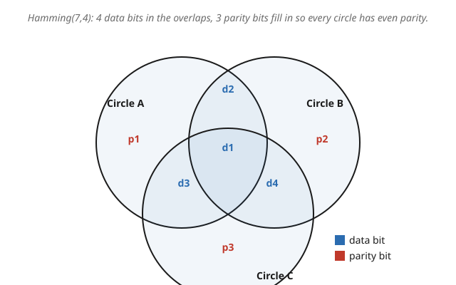

# Information Theory · Lesson 3.5: Codes in practice

> ⏱ ~15 min · Module 3: Channel capacity · Builds on: [3.4 The converse and Fano's inequality](03-04-converse-fano-inequality.md) · Unlocks: [4.1 Differential entropy](04-01-differential-entropy.md)

## Why this matters

The noisy-channel coding theorem (3.3) promised something almost too good: for any rate below capacity $C$, a code exists with vanishing error. But its proof was an *existence* argument — average a random codebook over all possibilities and note that at least one beats the average. It hands you no codebook you can hold, and even if it did, decoding a random code means comparing the received block against every codeword, which is hopeless for real block lengths. This lesson closes the gap between "a good code exists" and "here is one you can encode and decode by hand." The star witness is the Hamming(7,4) code — small enough to trace end to end, yet built on the exact linear-algebra-over-a-finite-field machinery that runs your QR codes, hard drives, and deep-space links.

## The idea

Repetition is the naive way to fight noise: send each bit three times, majority-vote at the other end. It corrects one flip, but it costs you a rate of $1/3$ — you pay two redundant bits per real bit. That is wasteful because the three copies overlap completely; every check re-checks the same lone bit.

The Hamming insight is to make the checks *overlap cleverly instead of totally*. Take 4 data bits and add 3 parity bits, where each parity bit watches a different, overlapping subset of the positions. Pin down the subsets so that each of the 7 positions sits in a **unique combination** of the 3 checks. Now a single flip breaks exactly the checks that watch it — and because that combination is its fingerprint, the pattern of broken checks *names the guilty position outright*. You do not search; you read off an address.

The clean way to see the overlaps is three circles in a Venn diagram. The 4 data bits go in the overlap regions, the 3 parity bits go one to each circle's private slice, and each parity bit is chosen so that **its whole circle has an even number of 1s**. A single flipped bit spoils the parity of exactly the circles it lives in — and each of the 7 regions lives in its own distinct set of circles.

## The formal version

**Encoding.** Label the 4 data bits $d_1,d_2,d_3,d_4$ and the 3 parity bits $p_1,p_2,p_3$. With $\oplus$ meaning addition mod 2 (XOR), place them so each circle sums to even:

$$p_1 = d_1 \oplus d_2 \oplus d_3, \qquad p_2 = d_1 \oplus d_2 \oplus d_4, \qquad p_3 = d_1 \oplus d_3 \oplus d_4.$$

In words: each parity bit is the XOR of the data bits sharing its circle, which forces that circle to hold an even count of 1s. The transmitted 7-bit codeword is $(d_1,d_2,d_3,d_4,p_1,p_2,p_3)$.

**Decoding by syndrome.** At the receiver, recompute each parity check on the received bits:

$$s_1 = p_1 \oplus d_1 \oplus d_2 \oplus d_3, \quad s_2 = p_2 \oplus d_1 \oplus d_2 \oplus d_4, \quad s_3 = p_3 \oplus d_1 \oplus d_3 \oplus d_4.$$

In words: $s_i = 0$ means circle $i$ still has even parity (check passes), $s_i = 1$ means it was spoiled (check fails). The triple $(s_1,s_2,s_3)$ is the **syndrome**. If it is $000$, no single error occurred; otherwise it equals the unique fingerprint of exactly one position, so flip that bit back.

**Minimum distance and correction power.** The **Hamming distance** between two codewords is the number of bit positions in which they differ; the **minimum distance** $d$ is the smallest such distance over all distinct codeword pairs. For Hamming(7,4), $d = 3$. The general guarantee:

$$\text{a code of minimum distance } d \text{ corrects up to } \left\lfloor \tfrac{d-1}{2} \right\rfloor \text{ errors and detects up to } d-1.$$

In words: codewords sit at least $d$ apart, so a received word within $\lfloor (d-1)/2 \rfloor$ flips of a codeword is still closer to that one than to any other — decode to the nearest. For $d=3$ that is $\lfloor 1 \rfloor = 1$ error corrected. The **rate** is $R = 4/7 \approx 0.57$ data bits per transmitted bit.

## Picture

## Worked examples

**Example 1 (mechanical — encode, corrupt, decode).** Message $d = (d_1,d_2,d_3,d_4) = (1,0,1,1)$.

*Encode.* Compute the parities:
$$p_1 = 1\oplus 0\oplus 1 = 0,\quad p_2 = 1\oplus 0\oplus 1 = 0,\quad p_3 = 1\oplus 1\oplus 1 = 1.$$
Codeword $(d_1,d_2,d_3,d_4,p_1,p_2,p_3) = (1,0,1,1,0,0,1)$. Sanity-check each circle holds an even count of 1s: circle A $= \{p_1,d_1,d_2,d_3\} = \{0,1,0,1\}$ has two 1s ✓; circle B $=\{p_2,d_1,d_2,d_4\}=\{0,1,0,1\}$ two 1s ✓; circle C $=\{p_3,d_1,d_3,d_4\}=\{1,1,1,1\}$ four 1s ✓.

*Corrupt.* The channel flips $d_2$: the received word has $d_2 = 1$, i.e. $(1,1,1,1,0,0,1)$.

*Decode.* Recompute the syndrome:
$$s_1 = p_1\oplus d_1\oplus d_2\oplus d_3 = 0\oplus 1\oplus 1\oplus 1 = 1,$$
$$s_2 = p_2\oplus d_1\oplus d_2\oplus d_4 = 0\oplus 1\oplus 1\oplus 1 = 1,$$
$$s_3 = p_3\oplus d_1\oplus d_3\oplus d_4 = 1\oplus 1\oplus 1\oplus 1 = 0.$$
Syndrome $(s_1,s_2,s_3) = (1,1,0)$: circles A and B fail, C passes. On the Venn diagram, the *only* region inside both A and B but outside C is the $d_2$ overlap. So the flip is at $d_2$ — flip it back to $0$, recover $(1,0,1,1)$. The three checks located the single error with no searching at all.

**Example 2 (why you'd care — the distance/rate accounting).** Why does $d=3$ mean exactly one error corrected?

Picture each codeword as a point, with received words as nearby points at Hamming distance 1, 2, 3, … Two distinct codewords are $\geq 3$ apart. A single flip moves you distance 1 from the true codeword, hence still $\geq 2$ from every other — unambiguously nearest to the original, so it corrects. Two flips could land you distance 1 from a *different* codeword (since $1+2 = 3$), so you cannot reliably correct two, but you can still *detect* them: two flips never land you exactly on another codeword (that needs distance 3), so the syndrome is nonzero and you know something is wrong. Hence $\lfloor (3-1)/2\rfloor = 1$ corrected, $3-1 = 2$ detected.

The cost is rate $R = 4/7 \approx 0.57$. Hamming(7,4) is even "perfect": its $2^3 = 8$ syndromes are used with zero waste — one for "no error" and one for each of the 7 single-error positions. But perfect at the packing does *not* mean at capacity. On a binary symmetric channel with crossover $0.01$, capacity is $C = 1 - H_2(0.01) \approx 0.92$ bits, far above $0.57$; and Hamming only survives one error per 7-bit block, so its block error probability barely improves on doing nothing when errors cluster. Reaching the $0.92$ ceiling of 3.3 needs *much longer* blocks, which is precisely why the practical breakthroughs came from long codes with clever iterative decoders, not from stretching Hamming.

## Watch out

- **You might think 3.3 already handed you a code, but actually it only proved one *exists*.** Random coding shows a good codebook is out there on average; it gives no construction and no efficient decoder. A practical code — Hamming, LDPC, Reed–Solomon — trades a sliver of optimality for an *encoder and decoder you can actually run*. Existence and constructibility are different achievements.
- **You might think a bigger minimum distance is the whole game, but actually it only fixes the *guaranteed* correction count $\lfloor (d-1)/2\rfloor$.** A code can still fail on error patterns beyond that radius, and a code with modest $d$ but enormous block length (LDPC) can crush error rate through iterative decoding in ways a short high-$d$ code cannot. Distance is one lever; block length and decoder are others.
- **You might think Hamming(7,4) being "perfect" means it is near capacity, but actually "perfect" only means its syndromes are used without waste.** Its rate $4/7$ sits well below the capacity of any decent channel. Capacity-*approaching* performance came from **LDPC**, **turbo**, and **polar** codes — long blocks with practical (iterative or successive-cancellation) decoding that ride right up to $C$. Hamming is the training-wheels construction, not the finish line.
- **You might think this XOR arithmetic is ad hoc, but actually it is linear algebra over the finite field $\mathrm{GF}(2)$.** Codewords form a vector subspace; encoding is a matrix multiply and the syndrome is another. Over the larger fields $\mathrm{GF}(2^m)$ the same idea yields **Reed–Solomon** codes — the algebra behind CDs, DVDs, QR codes, and deep-space telemetry. The machinery this lesson only samples is a full course of its own.

## One-liner

> A minimum-distance-$d$ code corrects $\lfloor (d-1)/2\rfloor$ errors by nearest-codeword decoding; Hamming(7,4) makes its 3 parity checks overlap so a single flip's syndrome names the culprit outright — a real, decodable code where 3.3 gave only existence.

## Problems

**P1 (🟢)** Encode the message $d = (d_1,d_2,d_3,d_4) = (1,1,0,1)$ with the Hamming(7,4) rules. Verify each of the three circles has even parity.

**P2 (🟡)** You receive the 7-bit word $(d_1,d_2,d_3,d_4,p_1,p_2,p_3) = (1,0,0,1,1,1,0)$. Assuming at most one bit flipped, compute the syndrome, identify the flipped position, correct it, and report the original 4 data bits.

**P3 (🔴, optional)** A code has minimum distance $d = 5$. (a) How many errors can it correct, and how many can it detect? (b) A different design uses each 7-bit block *only to detect* errors (never correct), and retransmits on any failure. For Hamming(7,4) used purely as a detector, how many simultaneous bit-flips is it guaranteed to catch, and why is that more than it can *correct*?

Solutions

**P1** Apply the encoding rules with $\oplus$ = XOR (mod-2 add):
$$p_1 = d_1\oplus d_2\oplus d_3 = 1\oplus 1\oplus 0 = 0,$$
$$p_2 = d_1\oplus d_2\oplus d_4 = 1\oplus 1\oplus 1 = 1,$$
$$p_3 = d_1\oplus d_3\oplus d_4 = 1\oplus 0\oplus 1 = 0.$$
Codeword $(1,1,0,1,0,1,0)$. Check parities: circle A $=\{p_1,d_1,d_2,d_3\}=\{0,1,1,0\}$, two 1s (even) ✓; circle B $=\{p_2,d_1,d_2,d_4\}=\{1,1,1,1\}$, four 1s (even) ✓; circle C $=\{p_3,d_1,d_3,d_4\}=\{0,1,0,1\}$, two 1s (even) ✓.

**P2** Received $(d_1,d_2,d_3,d_4,p_1,p_2,p_3) = (1,0,0,1,1,1,0)$. Syndrome:
$$s_1 = p_1\oplus d_1\oplus d_2\oplus d_3 = 1\oplus 1\oplus 0\oplus 0 = 0,$$
$$s_2 = p_2\oplus d_1\oplus d_2\oplus d_4 = 1\oplus 1\oplus 0\oplus 1 = 1,$$
$$s_3 = p_3\oplus d_1\oplus d_3\oplus d_4 = 0\oplus 1\oplus 0\oplus 1 = 0.$$
Syndrome $(0,1,0)$: only circle B fails. The region inside circle B but outside A and C is B's private slice — the parity bit $p_2$. So $p_2$ flipped. Correct it ($p_2: 1\to 0$); the data bits $(d_1,d_2,d_3,d_4) = (1,0,0,1)$ were untouched. Original message: $\mathbf{(1,0,0,1)}$.

(Note the payoff: the error was in a *parity* bit, and the syndrome still pinpointed it — the decoder does not need to know in advance whether a data or parity bit was hit.)

**P3** (a) Minimum distance $d=5$: corrects $\lfloor (5-1)/2\rfloor = \lfloor 2\rfloor = 2$ errors, detects $d-1 = 4$ errors.

(b) Used purely as a detector, a code catches any error pattern that does not turn one codeword into another — i.e. up to $d-1$ flips, since it takes at least $d$ flips to reach a different valid codeword. For Hamming(7,4), $d = 3$, so it detects up to $d-1 = 2$ simultaneous flips. That exceeds the 1 error it can *correct* because detection only asks "is the syndrome nonzero?", whereas correction must also unambiguously assign the culprit: two flips give a nonzero syndrome (detected) but that syndrome coincides with some single-flip fingerprint, so a *correcting* decoder would confidently fix the wrong bit. Detection is the weaker, safer demand, so it tolerates more errors.

## Flashback

**From Lesson 3.4 (The converse and Fano's inequality):** A source emits one of $M = 16$ equally likely messages, sent over a channel and decoded to an estimate $\hat{W}$ with block error probability $P_e = 0.10$. Use Fano's inequality to lower-bound the conditional entropy $H(W \mid \hat{W})$, and say in one line what that bound means for how much the channel output has failed to pin down $W$. (Use $\log_2$; $H_2(p) = -p\log_2 p - (1-p)\log_2(1-p)$.)

Solution

Fano's inequality for a message uniform over $M$ possibilities:
$$H(W\mid \hat{W}) \leq H_2(P_e) + P_e\,\log_2(M-1).$$
Here it *upper*-bounds the residual uncertainty, but the exam-style ask is the standard rearranged reading — plug in the numbers to see the size of the leftover uncertainty the errors force. With $P_e = 0.10$ and $M = 16$:
$$H_2(0.10) = -0.10\log_2 0.10 - 0.90\log_2 0.90 = 0.10(3.322) + 0.90(0.152) = 0.332 + 0.137 = 0.469 \text{ bits},$$
$$P_e\,\log_2(M-1) = 0.10\,\log_2 15 = 0.10(3.907) = 0.391 \text{ bits}.$$
So $H(W\mid\hat{W}) \leq 0.469 + 0.391 = 0.860$ bits. **In words:** even a modest $10\%$ error rate leaves up to about $0.86$ bits of uncertainty about the true message given the decoder's guess — the residual entropy the output could not remove. (The converse turns this around: to *drive* $P_e \to 0$ you need $H(W\mid\hat{W})\to 0$, and Fano shows that is impossible whenever the rate exceeds capacity, because then $H(W\mid\hat{W})$ stays bounded away from zero.)

## Connections

- **Backward:** [3.3 Achievability](03-03-noisy-channel-coding-achievability.md) proved good codes *exist* by random coding; this lesson supplies one you can actually build and decode, closing the existence-vs-construction gap. [3.4](03-04-converse-fano-inequality.md) set the capacity $C$ these constructions chase from below.
- **Forward:** the same distance-and-redundancy thinking reappears when Module 4 leaves the discrete world — continuous channels ([4.2](04-02-gaussian-channel-water-filling.md)) still measure how much redundancy the noise demands, now in energy and bandwidth instead of parity bits.
- **Sideways (abstract algebra):** linear codes are vector subspaces over the finite field $\mathrm{GF}(2)$, encoding and syndrome computation are matrix products, and moving to $\mathrm{GF}(2^m)$ yields Reed–Solomon codes. The field theory is developed in [abstract-algebra](../../abstract-algebra/syllabus.md); this lesson only samples it.
- **Sideways (computing & engineering):** these ideas run everywhere data must survive noise — QR codes and CD/DVD scratches (Reed–Solomon), RAID arrays (parity across disks), and deep-space telemetry (long capacity-approaching codes). LDPC, turbo, and polar codes are the modern descendants that finally reach the 3.3 ceiling with practical iterative decoding.
