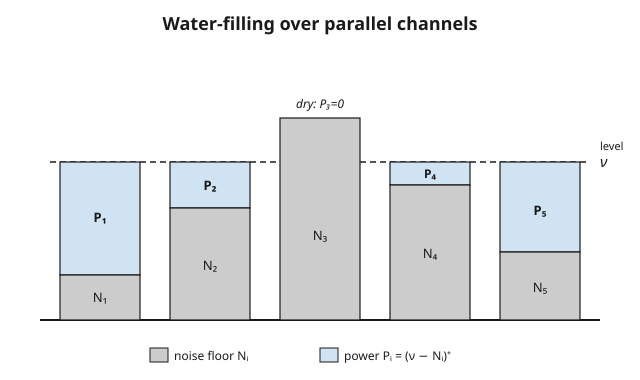

# Information Theory · Lesson 4.2: The Gaussian channel and water-filling

> ⏱ ~15 min · Module 4: Continuous information and the bridges · Builds on: [4.1 Differential entropy](04-01-differential-entropy.md) · Unlocks: [4.3 Rate–distortion theory](04-03-rate-distortion.md)

## Why this matters

Every real communication link is analog underneath: a voltage on a wire, a radio wave, light in a fiber — a continuous signal fighting continuous noise. The single most-used formula in all of engineering, the one that sets the speed limit of your WiFi, your 5G phone, your DSL modem, and the Voyager probe's whisper from interstellar space, is the capacity of the **Gaussian channel**: $C = \tfrac12\log(1 + \mathrm{SNR})$. This lesson derives it in three lines from the differential entropy of Lesson 4.1, then answers the sequel question — *if you have many parallel channels of differing quality and a fixed power budget, where do you spend the power?* The answer, **water-filling**, is a small gem of constrained optimization you have already met wearing an economist's hat.

## The idea

Send a real number $X$; the channel adds independent Gaussian noise $Z$; the receiver sees $Y = X + Z$. You can't send arbitrarily loud signals — physics and your battery cap the average power $E[X^2]$. So the question is: with a fixed power budget fighting a fixed noise level, how many bits per use can you reliably push through?

The trick is that capacity is $\max I(X;Y) = \max\,[\,h(Y) - h(Y\mid X)\,]$, and the second piece is *just the noise* — it doesn't depend on your input at all. So you only have one lever: make the output $Y$ as uncertain (as information-rich) as possible for the power you're allowed. From Lesson 4.1 we know exactly who wins that contest at a fixed variance — the **Gaussian** — so you should send a Gaussian signal, and the capacity falls out as the gap between two Gaussian entropies.

Now scale up. Suppose you have several independent sub-channels — think of different frequency bands, each with its own noise level $N_i$ — and one shared power budget to split among them. Pour a unit of power into the quietest channel and it buys you a lot of rate; pour it into a noisy channel and it buys little. So you fill the quiet channels first. Picture the noise levels as the uneven floor of a tank: high floor = noisy channel, low floor = clean channel. Pour in a total volume of water equal to your power budget. Water finds a common level $\nu$; the **depth** over each patch of floor is the power you allocate there; and any floor sticking up above the waterline gets nothing. That is water-filling, and the picture *is* the algorithm.

## The formal version

**The Gaussian channel.** Each use: $Y = X + Z$ with noise $Z \sim \mathcal{N}(0, N)$ independent of $X$, subject to the average-power constraint $E[X^2] \le P$. Here $P$ is the signal power budget and $N$ is the noise variance. The **capacity** is

$$C \;=\; \max_{p(x):\, E[X^2]\le P} I(X;Y) \;=\; \tfrac12 \log\!\Big(1 + \frac{P}{N}\Big) \quad\text{bits per use},$$

with the log base 2. The ratio $\mathrm{SNR} = P/N$ is the **signal-to-noise ratio**, so $C = \tfrac12\log(1+\mathrm{SNR})$.

In words: the best you can do is half a bit per use for every doubling-ish of $(1 + \text{signal-to-noise})$ — and it is *achieved* by sending a Gaussian $X \sim \mathcal{N}(0, P)$.

*Derivation (three lines, all machinery from 4.1).* Split the mutual information and use that $Z$ is independent of $X$:

$$I(X;Y) = h(Y) - h(Y\mid X) = h(Y) - h(X + Z \mid X) = h(Y) - h(Z).$$

The noise entropy is fixed: $h(Z) = \tfrac12\log(2\pi e N)$. For $h(Y)$, note $\mathrm{Var}(Y) = \mathrm{Var}(X) + N \le P + N$, and 4.1's max-entropy theorem says a fixed variance is best spent on a Gaussian: $h(Y) \le \tfrac12\log(2\pi e (P+N))$, with equality iff $Y$ is Gaussian — which happens exactly when $X$ is Gaussian. Subtract:

$$C = \tfrac12\log\big(2\pi e (P+N)\big) - \tfrac12\log(2\pi e N) = \tfrac12\log\frac{P+N}{N} = \tfrac12\log\Big(1+\frac{P}{N}\Big). \qquad\blacksquare$$

**Parallel Gaussian channels and water-filling.** Now $k$ independent channels, $Y_i = X_i + Z_i$ with $Z_i \sim \mathcal{N}(0, N_i)$, sharing one budget $\sum_i E[X_i^2] \le P$. Writing $P_i = E[X_i^2]$ for the power in channel $i$, the total capacity is

$$C = \max_{\sum_i P_i = P,\; P_i \ge 0}\ \sum_{i=1}^{k} \tfrac12\log\Big(1 + \frac{P_i}{N_i}\Big),$$

and the optimal allocation is

$$\boxed{\,P_i = (\nu - N_i)^+ \,}\qquad\text{where } (t)^+ = \max(t,0),$$

with the **water level** $\nu$ chosen so that $\sum_i (\nu - N_i)^+ = P$.

In words: raise a single flat waterline $\nu$ until the total water poured equals your budget $P$; the power in channel $i$ is how far the waterline sits *above* that channel's noise floor $N_i$, and channels whose floor pokes above the waterline ($N_i > \nu$) get zero power.

## Picture

## Worked examples

**Example 1 (the capacity of a single Gaussian channel — and why the log stings).** Take a budget $P = 15$ against noise $N = 1$, so $\mathrm{SNR} = 15$. Then

$$C = \tfrac12\log_2(1 + 15) = \tfrac12\log_2 16 = \tfrac12 \cdot 4 = 2 \ \text{bits per use}.$$

Now ask the engineer's follow-up: *how much more power buys one more bit?* We need $\tfrac12\log_2(1 + P'/1) = 3$, i.e. $1 + P' = 2^{6} = 64$, so $P' = 63$. Going from $2$ to $3$ bits took power from $15$ up to $63$ — more than a **quadrupling** of power for a single extra bit. That is the whole personality of the Gaussian channel: capacity grows only *logarithmically* in power, so each additional bit costs geometrically more energy. (Doubling power near high SNR adds only $\tfrac12\log_2 2 = \tfrac12$ bit.) The Gaussian input is what makes even this modest rate achievable, because at fixed power the Gaussian is the max-entropy signal (Lesson 4.1) — any other input shape wastes output uncertainty.

**Example 2 (water-filling over three channels — same KKT machinery as micro).** Three parallel channels with noise levels $N_1 = 1$, $N_2 = 2$, $N_3 = 5$, and a total budget $P = 4$. Maximize

$$\sum_{i=1}^{3}\tfrac12\log_2\Big(1+\frac{P_i}{N_i}\Big)\quad\text{s.t.}\quad P_1+P_2+P_3 = 4,\ \ P_i \ge 0.$$

Form the Lagrangian $\mathcal{L} = \sum_i \tfrac12\log_2(1+P_i/N_i) + \lambda\big(P - \sum_i P_i\big)$. For any channel we actually use ($P_i > 0$), set $\partial\mathcal{L}/\partial P_i = 0$. Since $\frac{d}{dP_i}\tfrac12\log_2(1+P_i/N_i) = \frac{1}{2\ln 2}\cdot\frac{1}{N_i + P_i}$, the stationarity condition is

$$\frac{1}{N_i + P_i} = \text{constant across all active } i \quad\Longrightarrow\quad N_i + P_i = \nu \quad\Longrightarrow\quad P_i = \nu - N_i.$$

Every active channel is filled to the *same* total height $\nu = N_i + P_i$ — the waterline. Combined with $P_i \ge 0$, that is exactly $P_i = (\nu - N_i)^+$.

Now find $\nu$. **Guess all three active:** then $\sum(\nu - N_i) = 3\nu - (1+2+5) = 3\nu - 8 = 4 \Rightarrow \nu = 4$, which would give $P_3 = 4 - 5 = -1 < 0$ — impossible. So channel 3 is dry. **Drop it and refill the other two:** $2\nu - (1+2) = 4 \Rightarrow \nu = 3.5$. Then

$$P_1 = 3.5 - 1 = 2.5,\qquad P_2 = 3.5 - 2 = 1.5,\qquad P_3 = (3.5 - 5)^+ = 0,$$

and indeed $P_1 + P_2 = 4$. Check consistency: $\nu = 3.5 < N_3 = 5$, so channel 3 correctly stays below the waterline. The resulting rate is

$$C = \tfrac12\log_2(1 + 2.5) + \tfrac12\log_2\!\Big(1 + \tfrac{1.5}{2}\Big) = \tfrac12\log_2 3.5 + \tfrac12\log_2 1.75 \approx 0.904 + 0.404 = 1.307\ \text{bits}.$$

The noisiest channel got *nothing*, and the quietest got the most power — the exact opposite of "help the weakest." This Lagrangian-with-inequality-constraints, solve-then-check-feasibility-then-drop-a-constraint dance is the **Karush–Kuhn–Tucker (KKT)** procedure — the very same one you run to allocate a consumer's budget across goods in [grad-micro](../../grad-micro/syllabus.md). Power here is money; $1/(N_i+P_i)$ is a marginal utility; the waterline $\nu$ is the shadow price $\lambda$ that equalizes marginal returns across everything you actually buy.

## Watch out

- **Capacity grows only logarithmically — diminishing returns are brutal.** You might expect twice the power to buy twice the bits. It doesn't: at high SNR, doubling power adds a flat $\tfrac12$ bit (Example 1 needed $\sim 4\times$ power for one bit). Bandwidth and lower noise beat raw power for buying rate.
- **Water-filling favors the *best* channels, not the worst.** The intuitive "spread it evenly" or "prop up the weak links" are both wrong. Power flows to the *lowest-noise* channels first, and channels with $N_i > \nu$ get exactly zero — because a dollar of power buys more rate where the noise is quiet.
- **The factor $\tfrac12$ is per real dimension.** $C = \tfrac12\log(1+\mathrm{SNR})$ is bits per *real* sample. A complex channel (two real dimensions, in-phase and quadrature) carries $\log(1+\mathrm{SNR})$ — no $\tfrac12$. Don't drop or double the half without checking whether you're counting real or complex uses.
- **$\mathrm{SNR} = P/N$ uses the noise *variance* $N$, not its standard deviation.** Both $P$ and $N$ are powers (mean-square quantities), so the ratio is dimensionless as required.

## One-liner

> A Gaussian channel carries $\tfrac12\log(1+\mathrm{SNR})$ bits per use — achieved by a Gaussian input — and when many channels share a power budget you pour power to a common waterline $\nu$, filling the quiet channels first and leaving the noisy ones dry.

## Problems

**P1 (🟢)** A Gaussian channel has noise variance $N = 4$ and power budget $P = 60$. (a) Compute its capacity in bits per use. (b) You want to *add one full bit* of capacity. By what factor must you scale the power $P$? (Give the general rule, then the number here.)

**P2 (🟡)** Two parallel Gaussian channels, $N_1 = 1$ and $N_2 = 3$. (a) Water-fill a budget of $P = 4$: find $\nu$, $P_1$, $P_2$, and the total capacity. (b) Now shrink the budget to $P = 1$ and water-fill again. Show that channel 2 goes dry, and give $P_1, P_2$. What general principle about scarce budgets does the switch illustrate?

**P3 (🔴, optional)** Derive water-filling from scratch as a KKT problem. Maximize $\sum_i \tfrac12\log(1+P_i/N_i)$ subject to $\sum_i P_i = P$ and $P_i \ge 0$. Write the Lagrangian with a multiplier $\lambda$ for the budget and multipliers $\mu_i \ge 0$ for the nonnegativity constraints, and use complementary slackness ($\mu_i P_i = 0$) to show $P_i = (\nu - N_i)^+$ with $\nu = 1/(2\lambda \ln 2)$. Explain in one sentence what complementary slackness *means* for a dry channel.

Solutions

**P1** (a) $\mathrm{SNR} = P/N = 60/4 = 15$, so

$$C = \tfrac12\log_2(1 + 15) = \tfrac12\log_2 16 = 2\ \text{bits per use}.$$

(b) Adding one bit means $\tfrac12\log_2(1 + P'/N) = C + 1$, i.e. $\log_2(1+\mathrm{SNR}') = \log_2(1+\mathrm{SNR}) + 2$, so $1 + \mathrm{SNR}'$ must be **$4\times$ larger**: $(1+\mathrm{SNR}') = 4(1+\mathrm{SNR})$. General rule: each extra bit multiplies $(1+\mathrm{SNR})$ by $4$. Here $1 + \mathrm{SNR}$ goes from $16$ to $64$, so $\mathrm{SNR}' = 63$ and $P' = 63 N = 252$ — a factor $252/60 = 4.2$ in power. (The factor exceeds $4$ because of the $+1$ offset; at high SNR it tends to exactly $4$.)

**P2** (a) Guess both active: $\sum(\nu - N_i) = 2\nu - (1+3) = 4 \Rightarrow \nu = 4$. Then $P_1 = 4 - 1 = 3$ and $P_2 = 4 - 3 = 1$, both $\ge 0$, sum $= 4$ ✓. Capacity:

$$C = \tfrac12\log_2(1+3) + \tfrac12\log_2\!\Big(1+\tfrac{1}{3}\Big) = \tfrac12(2) + \tfrac12\log_2\tfrac{4}{3} \approx 1 + \tfrac12(0.415) = 1.208\ \text{bits}.$$

(b) Budget $P = 1$. Guess both active: $2\nu - 4 = 1 \Rightarrow \nu = 2.5$, giving $P_2 = 2.5 - 3 = -0.5 < 0$ — infeasible. So channel 2 is dry. Put all power in channel 1: $\nu = N_1 + P_1 = 1 + 1 = 2$, and check $\nu = 2 < N_2 = 3$ ✓ (channel 2 correctly stays below the waterline). Thus

$$P_1 = 1,\qquad P_2 = 0.$$

Principle: when the budget is *scarce*, you concentrate everything in the single best channel; only as the budget grows does the waterline rise high enough to spill into worse channels. Channels switch on one at a time as $P$ increases — a threshold effect, not a smooth spread.

**P3** Lagrangian (maximization, so add the budget term and the nonnegativity terms):

$$\mathcal{L} = \sum_i \tfrac12\log_2\!\Big(1+\frac{P_i}{N_i}\Big) + \lambda\Big(P - \sum_i P_i\Big) + \sum_i \mu_i P_i,\qquad \mu_i \ge 0.$$

Stationarity in $P_i$: $\dfrac{1}{2\ln 2}\cdot\dfrac{1}{N_i + P_i} - \lambda + \mu_i = 0$.

*Case $P_i > 0$ (channel active):* complementary slackness $\mu_i P_i = 0$ forces $\mu_i = 0$, so $\frac{1}{2\ln2}\cdot\frac{1}{N_i+P_i} = \lambda$, giving $N_i + P_i = \dfrac{1}{2\lambda\ln 2} =: \nu$, i.e. $P_i = \nu - N_i$ (and this is positive only where $N_i < \nu$).

*Case $P_i = 0$ (channel dry):* then $\mu_i \ge 0$ gives $\frac{1}{2\ln2}\cdot\frac{1}{N_i} = \lambda - \mu_i \le \lambda$, so $N_i \ge \frac{1}{2\lambda\ln2} = \nu$ — a channel is dry exactly when its noise floor is at or above the waterline.

Combining both cases: $P_i = (\nu - N_i)^+$, with $\nu$ fixed by $\sum_i(\nu - N_i)^+ = P$. Complementary slackness $\mu_i P_i = 0$ means: for any channel that gets *zero* power, its nonnegativity constraint is the binding one (its multiplier $\mu_i$ can be positive), which is precisely the statement "the constraint $P_i \ge 0$ is active — the optimum wants to push $P_i$ negative but can't, so it pins it at $0$." That is the dry channel.

## Flashback

**From Lesson 4.1 (Differential entropy):** Let $X$ have the exponential density $f(x) = \lambda e^{-\lambda x}$ for $x \ge 0$ (and $0$ otherwise), where $\lambda > 0$ is the rate parameter. Compute the differential entropy $h(X)$ in nats. Then say what happens to $h(X)$ as $\lambda \to \infty$, and why that sign makes sense.

Solution

Differential entropy in nats uses the natural log: $h(X) = -\int_0^\infty f(x)\ln f(x)\,dx$. Since $\ln f(x) = \ln\lambda - \lambda x$,

$$h(X) = -\int_0^\infty f(x)\big(\ln\lambda - \lambda x\big)\,dx = -\ln\lambda\underbrace{\int_0^\infty f\,dx}_{=\,1} + \lambda\underbrace{\int_0^\infty x f(x)\,dx}_{=\,E[X]}.$$

The density integrates to $1$, and $E[X] = 1/\lambda$ for the exponential, so

$$h(X) = -\ln\lambda + \lambda\cdot\frac{1}{\lambda} = 1 - \ln\lambda \ \text{ nats}.$$

(For $\lambda = 2$: $h = 1 - \ln 2 \approx 0.307$ nats, or $0.307/\ln 2 \approx 0.443$ bits.) As $\lambda \to \infty$ the distribution concentrates ever more tightly near $0$ (its mean $1/\lambda \to 0$ and its spread shrinks), so $h(X) = 1 - \ln\lambda \to -\infty$. Negative differential entropy is normal and fine — unlike discrete entropy, $h$ can go negative when a density is concentrated into a region narrower than one unit of $x$; it measures uncertainty *relative to the coordinate scale*, not an absolute bit count.

## Connections

- **Backward:** the whole derivation rides on [4.1](04-01-differential-entropy.md) — $h(Z) = \tfrac12\log(2\pi eN)$ and, crucially, that the Gaussian *maximizes* differential entropy at fixed variance (which is why a Gaussian input is optimal). Capacity itself is still the maximized mutual information of [3.1](03-01-discrete-channels-capacity.md), $C = \max_{p(x)} I(X;Y)$ — only now $X$ ranges over densities under a power constraint instead of over a finite alphabet.
- **Forward:** [4.3](04-03-rate-distortion.md) runs the same Gaussian-max-entropy machinery in reverse — asking not how many bits a channel carries but how few bits describe a Gaussian source to a given fidelity — and water-filling reappears there as reverse water-filling over source components.
- **Sideways (engineering):** $C = \tfrac12\log(1+\mathrm{SNR})$, in its bandwidth-$W$ form $C = W\log(1+\mathrm{SNR})$, is the **Shannon–Hartley theorem** — the rate ceiling every modem, WiFi radio, LTE/5G base station, and deep-space link is engineered against. Water-filling over frequency bands is literally how DSL and OFDM systems assign bits to subcarriers.
- **Sideways (optimization / economics):** water-filling *is* a KKT-constrained optimization — the same Lagrange-multiplier-plus-complementary-slackness engine used to allocate a budget across goods in [grad-micro](../../grad-micro/syllabus.md). The waterline $\nu$ is a shadow price equalizing marginal returns; dry channels are the "corner solutions" (goods you buy zero of).
- **Sideways (linear algebra):** parallel independent channels are the eigen-channels of a matrix channel $Y = HX + Z$. Diagonalizing $H$ by the **SVD** (from [linalg-refresher](../../linalg-refresher/syllabus.md)) turns the coupled problem into independent Gaussian channels with noise levels set by the singular values — and you water-fill over *those*. MIMO wireless is exactly this.
