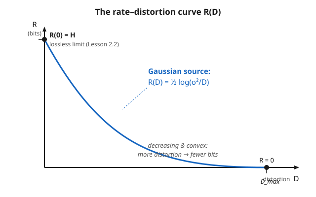

# Information Theory · Lesson 4.3: Rate–distortion theory

> ⏱ ~15 min · Module 4: Continuous information and the bridges · Builds on: [4.2 The Gaussian channel and water-filling](04-02-gaussian-channel-water-filling.md) · Unlocks: [4.4 Maximum entropy and statistical mechanics](04-04-maximum-entropy-stat-mech.md)

## Why this matters

Module 2 gave you the floor for *lossless* compression: you cannot squeeze a source below its entropy $H$ and still recover it perfectly. But nobody stores raw photos or audio losslessly — JPEG, MP3, and every video codec throw information *away* on purpose, and the whole game is throwing away the least-noticed bits first. That raises the sharp question this lesson answers: if you are willing to tolerate an average error of $D$, how few bits per symbol do you *actually* need? The answer is a curve, $R(D)$, and it is the exact dual of the channel capacity from the last lesson.

## The idea

Lossless coding asks: "reproduce $X$ exactly — cheapest bit budget?" Rate–distortion asks the relaxed version: "reproduce $X$ *within a tolerance $D$* — cheapest bit budget?" The tolerance buys you compression below $H$.

Picture a dial. At one end you demand perfect fidelity ($D = 0$) and pay the full entropy $H$ bits per symbol. As you turn the dial toward sloppier reconstructions, the required rate falls — first steeply (the early bits you drop barely hurt), then more gently. Eventually you allow so much distortion that you can send **zero bits**: just output a fixed best guess and eat the error. Between those two ends lives $R(D)$, the smallest rate that still keeps average distortion under $D$.

Two features fall out of that story immediately. The curve is **decreasing** (more slack → fewer bits) and **convex** (diminishing returns: each extra unit of tolerance buys fewer and fewer saved bits). And it is a *minimum* — you are hunting for the most efficient way to be lazy. That "min" is the tell that this is the mirror image of capacity, which was a "max."

## The formal version

Fix a source $X$ with distribution $p(x)$ and a **distortion measure** $d(x,\hat{x}) \ge 0$ — a number saying how bad it is to reconstruct symbol $x$ as $\hat{x}$ (e.g. squared error $(x-\hat{x})^2$, or Hamming distortion $d = 0$ if equal, $1$ if not). A reconstruction scheme is a conditional distribution $p(\hat{x}\mid x)$.

**Rate–distortion function.**

$$R(D) = \min_{\,p(\hat{x}\mid x)\;:\;\mathbb{E}[d(X,\hat{X})]\,\le\, D\,} I(X;\hat{X}).$$

In words: among all reconstruction schemes whose *average* distortion stays within $D$, pick the one whose reconstruction $\hat{X}$ shares the fewest bits of information with the source — that minimum mutual information (in bits, using $\log_2$) is the fewest bits per symbol you need.

Three properties nail down its shape:

- $R(0) = H(X)$ for a discrete source — zero tolerance recovers the lossless limit of [2.2 The source coding theorem](02-02-source-coding-theorem.md). *In words: demand perfection and you are back to paying full entropy.*
- $R(D)$ is **decreasing and convex** in $D$. *In words: more allowed error means fewer bits, with diminishing savings.*
- $R(D_{\max}) = 0$, where $D_{\max}$ is the distortion of the single best fixed guess. *In words: past enough slack, send nothing and just output a constant.*

**The duality.** Capacity was $C = \max_{p(x)} I(X;Y)$ over input distributions; rate–distortion is $R(D) = \min_{p(\hat x\mid x)} I(X;\hat X)$ over reconstruction distributions. Same functional $I$, opposite extremum — capacity is the *most* you can push through a fixed channel, rate–distortion the *least* you must spend for a fixed fidelity.

## Picture

## Worked examples

**Example 1 (the Gaussian source — squared error).** Let $X \sim \mathcal{N}(0,\sigma^2)$ with distortion $d(x,\hat x) = (x-\hat x)^2$. The rate–distortion function is

$$R(D) = \begin{cases} \dfrac{1}{2}\log_2\dfrac{\sigma^2}{D}, & 0 < D \le \sigma^2,\\[2mm] 0, & D > \sigma^2.\end{cases}$$

Read it off: at $D = \sigma^2$ you may as well guess $\hat X = 0$ (the mean), which already has expected squared error $\sigma^2$ — so $R(\sigma^2) = 0$, and indeed $\frac{1}{2}\log_2\frac{\sigma^2}{\sigma^2} = 0$. Now sharpen the fidelity: **halving $D$** changes the rate by

$$\tfrac{1}{2}\log_2\tfrac{\sigma^2}{D/2} - \tfrac{1}{2}\log_2\tfrac{\sigma^2}{D} = \tfrac{1}{2}\log_2 2 = \tfrac{1}{2}\ \text{bit}.$$

Every factor-of-two improvement in tolerable squared error costs exactly one extra half-bit per sample. Concretely, with $\sigma^2 = 4$ and $D = 1$: $R = \frac{1}{2}\log_2 4 = 1$ bit/sample. Tighten to $D = 0.5$: $R = \frac{1}{2}\log_2 8 = 1.5$ bits.

Now hold it against last lesson's Gaussian *channel* capacity, $C = \frac{1}{2}\log_2(1 + \mathrm{SNR})$. The source's $\frac{1}{2}\log_2(\sigma^2/D)$ and the channel's $\frac{1}{2}\log_2(1+\mathrm{SNR})$ are the same $\frac{1}{2}\log_2(\cdot)$ skeleton — one a **min** for reproduction, the other a **max** for transmission. That is the capacity/rate–distortion duality in one glance.

**Example 2 (the binary source — Hamming distortion).** Let $X \sim \text{Bernoulli}(p)$ with $d$ = Hamming (an error costs 1, a match costs 0, so average distortion = bit-error probability). Writing $H(\cdot)$ for the binary entropy $H(q) = -q\log_2 q - (1-q)\log_2(1-q)$,

$$R(D) = \begin{cases} H(p) - H(D), & 0 \le D \le \min(p,\,1-p),\\ 0, & D > \min(p,\,1-p).\end{cases}$$

Take a fair coin, $p = \tfrac12$, so $H(p) = 1$ bit — incompressible losslessly. Allow a bit-error rate of $D = 0.11$. Then $H(0.11) = -0.11\log_2 0.11 - 0.89\log_2 0.89 \approx 0.500$, so

$$R(0.11) = 1 - 0.500 = 0.500 \ \text{bits/symbol}.$$

Tolerating 11% flipped bits *halves* the rate on a source that was impossible to shrink at all losslessly. And the lossless limit is recovered cleanly: $R(0) = H(p) - H(0) = H(p) - 0 = H(p)$, exactly the entropy floor from Module 2.

## Watch out

- **You might think $R(D)$ is a maximum like capacity, but it's a minimum.** Capacity maximizes $I$ (squeeze the most through a channel); rate–distortion minimizes $I$ (spend the least to hit a fidelity). Same $I(X;\hat X)$, dual extremum — mixing them up inverts every inequality.
- **You might think $R(0)$ is something exotic, but it's just $H$.** Zero distortion collapses rate–distortion back onto lossless source coding ([2.2](02-02-source-coding-theorem.md)). Rate–distortion is the strict generalization; entropy is its $D=0$ boundary — for a *discrete* source. (A continuous Gaussian has $R(D)\to\infty$ as $D\to0$; you cannot losslessly code a real number in finite bits, which is why differential entropy in [4.1](04-01-differential-entropy.md) was not an absolute bit count.)
- **You might think more distortion could cost more bits, but $R$ is monotone decreasing.** Extra slack can never *raise* the required rate — a scheme valid at tolerance $D$ is automatically valid at any larger tolerance. Convexity adds that the savings shrink as you go.
- **You might read $D$ as a per-symbol guarantee, but it is an *average*.** $\mathbb{E}[d(X,\hat X)] \le D$ constrains the mean distortion; individual symbols can be reconstructed much worse (or better). JPEG at a given quality setting sits at one point on this curve — some blocks are mangled, the average is what's bounded.

## One-liner

> $R(D)$ is the fewest bits per symbol to reconstruct a source within average distortion $D$ — a convex, decreasing curve from $R(0)=H$ down to $0$, and the exact min-vs-max dual of channel capacity.

## Problems

**P1 (🟢)** A Gaussian source has $\sigma^2 = 9$. (a) What rate is needed for average squared-error distortion $D = 1$? (b) By how many bits does the rate change if you loosen the tolerance from $D=1$ to $D=4$? (c) At what $D$ does the required rate hit $0$?

**P2 (🟡)** A biased binary source has $p = 0.2$ under Hamming distortion. (a) Compute the lossless rate $R(0)$. (b) You allow a bit-error rate $D = 0.05$; find $R(0.05)$. (c) Above what distortion is $R(D) = 0$, and what does the encoder output there? *(Use $H(0.2)\approx0.7219$, $H(0.05)\approx0.2864$.)*

**P3 (🔴, optional)** Explain, without heavy computation, why $R(D)$ must be convex. *(Hint: given two schemes achieving $(D_1, R_1)$ and $(D_2, R_2)$, build a scheme that time-shares between them — use scheme 1 a fraction $\lambda$ of the symbols, scheme 2 the rest. What distortion and what rate does the blend achieve, and where does that put it relative to the curve?)*

Solutions

**P1** (a) $R = \frac{1}{2}\log_2\frac{\sigma^2}{D} = \frac{1}{2}\log_2\frac{9}{1} = \frac{1}{2}\log_2 9 = \frac{1}{2}(3.1699) \approx 1.585$ bits/sample.
(b) At $D=4$: $R = \frac{1}{2}\log_2\frac{9}{4} = \frac{1}{2}(1.1699) \approx 0.585$ bits. The change is $1.585 - 0.585 = 1.0$ bit saved. (Sanity check via the halving rule: going $1 \to 4$ is two doublings of $D$, so $2 \times \frac{1}{2} = 1$ bit — matches.)
(c) $R = 0$ when $D = \sigma^2 = 9$: allow distortion equal to the variance and the best fixed guess $\hat X = 0$ already meets it, so zero bits are needed.

**P2** (a) $R(0) = H(p) - H(0) = H(0.2) - 0 \approx 0.7219$ bits/symbol — the lossless floor.
(b) $R(0.05) = H(0.2) - H(0.05) \approx 0.7219 - 0.2864 = 0.4355$ bits/symbol. Tolerating a 5% error rate cuts the rate by about 40%.
(c) $R(D) = 0$ for $D \ge \min(p,1-p) = \min(0.2, 0.8) = 0.2$. There the encoder sends nothing and outputs the constant most-likely symbol ($\hat X = 0$, the majority value), incurring average distortion $p = 0.2$ — exactly the allowed budget.

**P3** Suppose scheme A achieves distortion $D_1$ at rate $R_1 = R(D_1)$ and scheme B achieves $D_2$ at rate $R_2 = R(D_2)$. Time-share: apply A to a fraction $\lambda$ of the symbols and B to the remaining $1-\lambda$. Average distortion of the blend is the weighted average $\lambda D_1 + (1-\lambda)D_2$ (distortion is linear in the per-symbol errors), and its rate is the weighted average $\lambda R_1 + (1-\lambda)R_2$ (bits add). So the point $\big(\lambda D_1 + (1-\lambda)D_2,\ \lambda R_1 + (1-\lambda)R_2\big)$ is *achievable*. Since $R(D)$ is the **minimum** achievable rate at each distortion, the true curve can only lie on or below this achievable blend:

$$R\big(\lambda D_1 + (1-\lambda)D_2\big) \le \lambda R(D_1) + (1-\lambda)R(D_2).$$

That inequality is exactly the definition of a convex function — the curve never rises above its chords. (This is the same time-sharing argument that makes capacity regions convex; convexity is a fingerprint of "best achievable rate" quantities.)

## Flashback

**From Lesson 4.2 (The Gaussian channel and water-filling):** You have three parallel independent Gaussian subchannels with noise powers $N_1 = 1$, $N_2 = 2$, $N_3 = 6$, and a total power budget $P = 6$ to split among them. Find the water-filling allocation and the resulting capacity (in bits per use). Does every subchannel get used?

Solution

Water-filling assigns power $P_i = (\nu - N_i)^+$ to subchannel $i$, where the water level $\nu$ is set so the powers sum to $P$, and $(\cdot)^+$ means "zero if negative." First guess that all three are active: $(\nu-1)+(\nu-2)+(\nu-6) = 6 \Rightarrow 3\nu - 9 = 6 \Rightarrow \nu = 5$. But $\nu = 5 < N_3 = 6$, so subchannel 3 would get *negative* power — it must be shut off (its floor pokes above the water). Re-solve with only channels 1 and 2:

$$(\nu-1)+(\nu-2) = 6 \Rightarrow 2\nu - 3 = 6 \Rightarrow \nu = 4.5.$$

Since $4.5 < N_3 = 6$, subchannel 3 stays off — consistent. Powers: $P_1 = 4.5 - 1 = 3.5$, $P_2 = 4.5 - 2 = 2.5$, $P_3 = 0$. Capacity:

$$C = \tfrac{1}{2}\log_2\!\Big(1+\tfrac{P_1}{N_1}\Big) + \tfrac{1}{2}\log_2\!\Big(1+\tfrac{P_2}{N_2}\Big) = \tfrac{1}{2}\log_2(4.5) + \tfrac{1}{2}\log_2(2.25).$$

Numerically $\frac{1}{2}(2.170) + \frac{1}{2}(1.170) \approx 1.085 + 0.585 = 1.67$ bits per channel use. The lesson of water-filling: pour power into the quietest channels first, and abandon any channel too noisy to clear the water level.

## Connections

- **Backward:** at $D=0$ this collapses to the lossless floor $R(0)=H$ of [2.2 The source coding theorem](02-02-source-coding-theorem.md); the object being minimized is the mutual information $I(X;\hat X)$ built in [1.3 Mutual information](01-03-mutual-information.md).
- **Forward / dual:** rate–distortion is the min-of-$I$ mirror of the max-of-$I$ capacity from [4.2 The Gaussian channel and water-filling](04-02-gaussian-channel-water-filling.md) — the Gaussian $\frac{1}{2}\log_2(\sigma^2/D)$ and $\frac{1}{2}\log_2(1+\mathrm{SNR})$ are the two faces of the same coin.
- **Sideways (engineering):** every lossy codec — JPEG for images, MP3/AAC for audio, H.264/H.265 for video — is an engineered point on a rate–distortion curve; the "quality slider" is you choosing $D$, and perceptual coding is the art of choosing a distortion measure $d$ that matches human eyes and ears.
- **Sideways (machine learning):** compressing data into features while preserving what matters is rate–distortion for *representations* — the **information bottleneck** minimizes $I(X;\hat X)$ subject to keeping $I(\hat X; Y)$ high, exactly this trade-off wearing a learning hat. See [statistical-learning](../../statistical-learning/syllabus.md).
