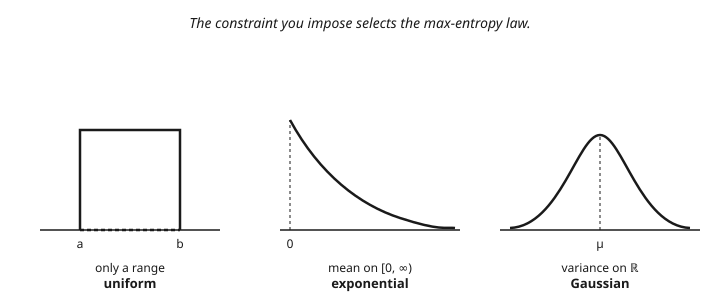

# Information Theory · Lesson 4.4: Maximum entropy and statistical mechanics

> ⏱ ~15 min · Module 4: Continuous information and the bridges · Builds on: [4.3 Rate–distortion theory](04-03-rate-distortion.md) · Unlocks: [4.5 Information in learning and inference](04-05-information-in-learning-inference.md)

## Why this matters

Here is the punchline the whole course has been walking toward: **the laws of statistical mechanics are not separate physics — they are information theory plus one energy constraint.** The Boltzmann distribution, the partition function, thermodynamic entropy — all of them fall out of a single question: *given only what you actually know about a system, what is the most honest guess for its state?* Jaynes' answer is that you pick the distribution that maximizes entropy subject to your constraints. Turn the crank with Lagrange multipliers and physics appears. This is Boss 4, and it is the headline bridge of the course.

## The idea

Suppose all you know about a die is that its long-run average roll is $4.5$ (loaded, apparently). Infinitely many distributions over $\{1,\dots,6\}$ have that mean. Which one should you assume?

The **maximum-entropy principle** says: pick the one that maximizes entropy $H(p)$ *among all distributions satisfying your constraint*. Why? Entropy measures how non-committal a distribution is (Lesson 1.1). The max-entropy choice is the one that assumes **as little as the data forces** — it spreads probability as evenly as the constraint permits and injects zero extra structure you can't justify. Any lower-entropy distribution is secretly asserting something you don't actually know.

Now watch what the constraint does. "Fix the mean energy" is a linear constraint, and — as we'll derive — maximizing entropy under a linear constraint always spits out a distribution of the shape $p_i \propto e^{-\beta E_i}$: an **exponential family**. Feed in "mean energy = $U$" and this *is* the Boltzmann distribution of thermodynamics. The physics was never separate; it was the least-biased inference given one number.

## The formal version

**Max-entropy principle.** Among all distributions $p$ on states $\{x_1,\dots,x_n\}$ satisfying $\sum_i p_i = 1$ and a moment constraint $\sum_i p_i\, f(x_i) = \langle f\rangle$, choose the one maximizing

$$H(p) = -\sum_i p_i \ln p_i.$$

*In words:* of all guesses consistent with your one measured average, take the flattest, most spread-out one — it is the unique guess that adds no assumption beyond the constraint.

**Solution (proved in the next section).** The maximizer is the exponential family

$$p_i = \frac{e^{-\beta f(x_i)}}{Z}, \qquad Z = \sum_i e^{-\beta f(x_i)},$$

where $\beta$ is the Lagrange multiplier enforcing the constraint and $Z$ (the **partition function**) is the normalizer that makes the probabilities sum to $1$.

*In words:* the least-biased distribution consistent with a fixed average is always exponential in the quantity you constrained; $\beta$ is dialed to hit your target $\langle f\rangle$, and $Z$ just re-scales so everything totals $1$.

## Concrete instance

**The Lagrange derivation (discrete, giving Boltzmann).** Maximize $H = -\sum_i p_i \ln p_i$ subject to $\sum_i p_i = 1$ and $\sum_i p_i E_i = U$, where $E_i$ is the energy of state $i$ and $U$ the known mean energy. (We use $\ln$; switching to $\log_2$ only rescales $H$ by a constant and changes nothing.) Attach one multiplier per constraint:

$$\mathcal{L} = -\sum_i p_i \ln p_i \;-\; \alpha\Big(\sum_i p_i - 1\Big) \;-\; \beta\Big(\sum_i p_i E_i - U\Big).$$

Differentiate with respect to a single $p_i$ (note $\frac{d}{dp_i}(-p_i\ln p_i) = -\ln p_i - 1$) and set to zero:

$$\frac{\partial \mathcal{L}}{\partial p_i} = -\ln p_i - 1 - \alpha - \beta E_i = 0 \;\;\Longrightarrow\;\; p_i = e^{-1-\alpha}\,e^{-\beta E_i}.$$

The factor $e^{-1-\alpha}$ is a constant; fix it by normalization. Requiring $\sum_i p_i = 1$ forces $e^{-1-\alpha} = 1/Z$ with $Z = \sum_i e^{-\beta E_i}$, so

$$\boxed{\,p_i = \dfrac{e^{-\beta E_i}}{Z}\,}$$

— the **Boltzmann distribution**. The multiplier $\beta$ is not slack notation: it is the physical **inverse temperature**, $\beta = 1/(kT)$, with $k$ Boltzmann's constant and $T$ absolute temperature. Its value is set by the constraint — crank $\beta$ until $\sum_i p_i E_i = U$. The remaining multiplier $\alpha$ became $\ln Z$.

**Continuous version (giving Gaussian).** On $\mathbb{R}$ the sum becomes an integral and the pointwise stationarity condition reads $-\ln f(x) - 1 - \lambda_0 - \lambda_1 x - \lambda_2 x^2 = 0$ once you constrain normalization, mean, and variance. Solving gives $f(x) \propto e^{-\lambda_1 x - \lambda_2 x^2}$ — a quadratic in the exponent, which is exactly a **Gaussian**. (Worked Example 2 finishes the identification.)

The general pattern — same machinery, different constraint:

| What you fix | Support | Max-entropy law |
|---|---|---|
| nothing (only the range) | $[a,b]$ | uniform |
| the mean | $[0,\infty)$ | exponential |
| mean and variance | $\mathbb{R}$ | Gaussian |

## Worked examples

**Example 1 (mechanical — Boltzmann for a two-level system, and $H = \ln Z + \beta U$).** A particle has two states: ground energy $E_0 = 0$ and excited energy $E_1 = \varepsilon$. At inverse temperature $\beta$,

$$Z = e^{-\beta\cdot 0} + e^{-\beta\varepsilon} = 1 + e^{-\beta\varepsilon}, \qquad p_0 = \frac{1}{Z},\quad p_1 = \frac{e^{-\beta\varepsilon}}{Z}.$$

Now compute the maximized entropy in general and confirm it equals $\ln Z + \beta U$. Take the log of the Boltzmann form: $\ln p_i = -\beta E_i - \ln Z$. Then

$$H = -\sum_i p_i \ln p_i = -\sum_i p_i(-\beta E_i - \ln Z) = \beta\sum_i p_i E_i + \ln Z\sum_i p_i = \beta U + \ln Z,$$

using $\sum_i p_i E_i = U$ and $\sum_i p_i = 1$. So

$$\boxed{\,H_{\max} = \ln Z + \beta U\,}.$$

This is the whole thermodynamic dictionary. Multiply by Boltzmann's constant to get the **Gibbs entropy** $S = kH = k\ln Z + k\beta U$. Since $\beta = 1/(kT)$, the second term is $U/T$, and rearranging gives the **free energy**

$$F \equiv U - TS = -kT\ln Z.$$

The partition function $Z$ — a pure normalizer from the information problem — turns out to encode all of equilibrium thermodynamics.

**Example 2 (why you'd care — variance constraint gives the Gaussian).** Maximize the differential entropy $h(f) = -\int_{\mathbb{R}} f\ln f\,dx$ subject to $\int f\,dx = 1$, $\int x f\,dx = \mu$, and $\int x^2 f\,dx = \sigma^2 + \mu^2$ (fixed mean and variance). With multipliers $\lambda_0,\lambda_1,\lambda_2$, the pointwise condition is

$$-\ln f(x) - 1 - \lambda_0 - \lambda_1 x - \lambda_2 x^2 = 0 \;\;\Longrightarrow\;\; f(x) = C\,e^{-\lambda_1 x - \lambda_2 x^2}.$$

Complete the square in the exponent: $-\lambda_2\big(x + \tfrac{\lambda_1}{2\lambda_2}\big)^2 + \text{const}$, so $f$ is a bell curve centered at $-\lambda_1/(2\lambda_2)$. Matching to $\mathcal{N}(\mu,\sigma^2)$, i.e. $f(x) = \frac{1}{\sqrt{2\pi\sigma^2}}\exp\!\big(-\frac{(x-\mu)^2}{2\sigma^2}\big)$, identifies the multipliers:

$$\lambda_2 = \frac{1}{2\sigma^2}, \qquad \lambda_1 = -\frac{\mu}{\sigma^2},$$

with $C$ set by normalization. So **the Gaussian is exactly the max-entropy density at fixed variance** — the honest default whenever all you know is a spread. This is the deep reason the bell curve is everywhere, and it is the same fact that made the Gaussian the worst-case channel noise back in [4.2](04-02-gaussian-channel-water-filling.md).

## Watch out

- You might think max-entropy means "assume everything is as random as possible." It means the opposite in spirit: assume **as little as the constraints force**. It is the least-biased, most honest distribution — maximally noncommittal about everything you didn't measure, not randomness for its own sake.
- You might think the Lagrange multiplier $\beta$ is just bookkeeping. It **is** the physics: $\beta = 1/(kT)$ is the inverse temperature. The abstract multiplier and the thermometer reading are the same number.
- You might think the exponential shape is a physical postulate. It is *forced* by the choice of constraint: a linear (mean-energy) constraint gives $e^{-\beta E}$; change the constraint and the family changes (variance $\to$ Gaussian, mean on $[0,\infty)$ $\to$ exponential, nothing $\to$ uniform).
- You might think Shannon's $H$ and thermodynamic $S$ are analogies. They are the **same quantity**, $S = kH$, differing only by Boltzmann's constant $k$ (and the log base). Information and thermodynamic entropy are one thing measured in different units.

## One-liner

> The least-biased distribution consistent with your data maximizes entropy under those constraints — do it with Lagrange multipliers and a mean-energy constraint, and thermodynamics (Boltzmann, $Z$, Gibbs entropy) falls out for free.

## Problems

**P1 (🟢)** For the two-level system of Example 1 ($E_0 = 0$, $E_1 = \varepsilon$), take $\beta\varepsilon = \ln 2$. Compute $Z$, $p_0$, $p_1$, the mean energy $U$, and verify numerically that $H_{\max} = \ln Z + \beta U$ (work in nats, i.e. natural log).

**P2 (🟡)** Show directly, via Lagrange multipliers, that with **no** constraint beyond normalization ($\sum_{i=1}^n p_i = 1$), the max-entropy distribution on $n$ states is uniform, $p_i = 1/n$. Then explain in one sentence why this is the $\beta = 0$ special case of Boltzmann.

**P3 (🔴, optional)** A continuous variable is known to be nonnegative ($x \ge 0$) with fixed mean $\int_0^\infty x f\,dx = m$. Set up the Lagrangian for maximizing $h(f) = -\int_0^\infty f\ln f\,dx$ under $\int_0^\infty f\,dx = 1$ and the mean constraint, and show the maximizer is the **exponential density** $f(x) = \frac{1}{m}e^{-x/m}$. Identify the rate $1/m$ with the mean-constraint multiplier.

Solutions

**P1** With $\beta\varepsilon = \ln 2$, we have $e^{-\beta\varepsilon} = e^{-\ln 2} = \tfrac12$. Then

$$Z = 1 + \tfrac12 = \tfrac32,\qquad p_0 = \frac{1}{3/2} = \tfrac23,\qquad p_1 = \frac{1/2}{3/2} = \tfrac13.$$

Mean energy: $U = p_0 E_0 + p_1 E_1 = \tfrac23(0) + \tfrac13\varepsilon = \tfrac{\varepsilon}{3}$.

Entropy directly: $H = -\tfrac23\ln\tfrac23 - \tfrac13\ln\tfrac13 = -\tfrac23(-0.405465) - \tfrac13(-1.098612) = 0.270310 + 0.366204 = 0.636514$ nats.

Via the formula: $\ln Z = \ln 1.5 = 0.405465$, and $\beta U = \beta\cdot\tfrac{\varepsilon}{3} = \tfrac13\beta\varepsilon = \tfrac13\ln 2 = 0.231049$. Sum $= 0.405465 + 0.231049 = 0.636514$ nats. ✓ They match.

**P2** Lagrangian with only normalization: $\mathcal{L} = -\sum_i p_i\ln p_i - \alpha(\sum_i p_i - 1)$. Then $\partial\mathcal{L}/\partial p_i = -\ln p_i - 1 - \alpha = 0$, so $p_i = e^{-1-\alpha}$ — the **same value for every $i$**, independent of $i$. Normalizing, $\sum_i p_i = n\,e^{-1-\alpha} = 1$, hence $p_i = 1/n$: the uniform distribution.

This is Boltzmann with $\beta = 0$: setting $\beta = 0$ kills the energy dependence, $e^{-\beta E_i} = 1$ for all $i$, so $p_i = 1/Z = 1/n$. Physically $\beta = 0$ is infinite temperature — every state equally likely, which is exactly "no information beyond the state list."

**P3** Lagrangian: $\mathcal{L} = -\int_0^\infty f\ln f\,dx - \lambda_0\big(\int_0^\infty f\,dx - 1\big) - \lambda_1\big(\int_0^\infty x f\,dx - m\big)$. The pointwise stationarity condition (varying $f$ at each $x$) is

$$-\ln f(x) - 1 - \lambda_0 - \lambda_1 x = 0 \;\;\Longrightarrow\;\; f(x) = e^{-1-\lambda_0}\,e^{-\lambda_1 x} = A\,e^{-\lambda_1 x}.$$

Normalize on $[0,\infty)$: $\int_0^\infty A e^{-\lambda_1 x}\,dx = A/\lambda_1 = 1$, so $A = \lambda_1$ (and $\lambda_1 > 0$ for convergence). Mean: $\int_0^\infty x\,\lambda_1 e^{-\lambda_1 x}\,dx = 1/\lambda_1$, and setting this to $m$ gives $\lambda_1 = 1/m$. Hence

$$f(x) = \frac{1}{m}\,e^{-x/m},$$

the exponential density with rate $1/m$ — which is precisely the mean-constraint multiplier $\lambda_1$. A fixed mean on the half-line forces the exponential, the second row of the table.

## Flashback

**From Lesson 4.3 (Rate–distortion theory):** A binary source emits $X \sim \mathrm{Bernoulli}(p)$ with $p = 0.25$, and we allow lossy reconstruction under Hamming (bit-error) distortion. The rate–distortion function is $R(D) = H_b(p) - H_b(D)$ for $0 \le D \le \min(p, 1-p)$ and $R(D) = 0$ beyond, where $H_b(q) = -q\log_2 q - (1-q)\log_2(1-q)$. Find $R(D)$ at $D = 0.1$, in bits.

Solution

Since $D = 0.1 \le \min(0.25, 0.75) = 0.25$, we are on the sloped part. Compute both binary entropies (bits):

$$H_b(0.25) = -0.25\log_2 0.25 - 0.75\log_2 0.75 = 0.25(2) + 0.75(0.415037) = 0.5 + 0.311278 = 0.811278.$$

$$H_b(0.1) = -0.1\log_2 0.1 - 0.9\log_2 0.9 = 0.1(3.321928) + 0.9(0.152003) = 0.332193 + 0.136803 = 0.468996.$$

Therefore

$$R(0.1) = 0.811278 - 0.468996 \approx 0.342 \text{ bits per symbol}.$$

So allowing a $10\%$ bit-error rate cuts the required description from $H_b(0.25) \approx 0.811$ bits down to about $0.342$ bits — you pay less than half the rate to store a source you're willing to slightly corrupt.

## Connections

- **Backward:** maximizing $H$ subject to constraints is the same as **minimizing KL divergence to the uniform (or a reference) distribution** subject to those constraints — the [1.4](01-04-relative-entropy-kl-jensen.md) machinery in disguise, since $H(p) = \ln n - D_{\mathrm{KL}}(p\,\|\,\text{uniform})$. And [4.1](04-01-differential-entropy.md) already flagged the Gaussian as the max-differential-entropy law at fixed variance — Example 2 is the proof.
- **Forward:** [4.5](04-05-information-in-learning-inference.md) turns this around — Bayesian updating and maximum-likelihood estimation are the same variational game (minimize KL, maximize entropy) applied to inference.
- **Sideways (physics):** this lesson *derives* the Boltzmann distribution, the partition function $Z$, and the Gibbs entropy $S = kH$ from pure information plus one energy constraint — the headline bridge of the course. A statistical-mechanics course ([stat-mech](../../stat-mech/syllabus.md)) postulates the Boltzmann factor and builds thermodynamics on it; here we see it was never a postulate but the least-biased inference.
- **Sideways (economics/optimization):** the Lagrangian-with-KKT setup is *identical* to constrained optimization in microeconomic theory ([grad-micro](../../grad-micro/syllabus.md)) — the multiplier $\beta$ here plays the role of a shadow price on the energy budget, exactly as a Lagrange multiplier prices a resource constraint.
- **Sideways (statistics):** the exponential family $p_i \propto e^{-\beta f(x_i)}$ is the workhorse of statistics, where $f$ is the **sufficient statistic** and $\beta$ the natural parameter — the exponential-families and sufficiency thread from [prob-stat-refresher](../../prob-stat-refresher/syllabus.md).
- See the [syllabus](../syllabus.md) for where Module 4 lands.
