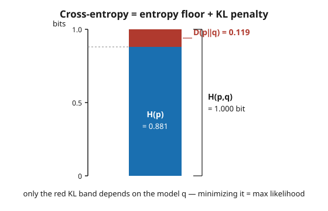

# Information Theory · Lesson 4.5: Information in learning and inference

> ⏱ ~15 min · Module 4: Continuous information and the bridges · Builds on: [4.4 Maximum entropy and statistical mechanics](04-04-maximum-entropy-stat-mech.md) · Unlocks: (capstone — the end of the course)

## Why this matters

You have spent four modules measuring, compressing, and transmitting information. Here is the payoff: the same three quantities — entropy $H$, mutual information $I$, and relative entropy $D$ — are the load-bearing objects of *machine learning*, *statistical inference*, and *the economics of decisions*, usually under other names. The loss function a neural net minimizes is a KL divergence. The reason maximum likelihood works is a cancellation you already know. The price a rational agent pays for a market report is a mutual information. This lesson cashes in the bridges, then points at the sequel the course deliberately stops short of. Nothing new to derive — just the same tools, worn on the other side.

## The idea

Three translations, one dictionary.

**Mutual information is a predictiveness score.** In [1.3](01-03-mutual-information.md), $I(X;Y)$ measured how much observing one variable tells you about another. Rename $X$ a *feature* and $Y$ a *label*, and $I(\text{feature};\text{label})$ is exactly "how useful is this feature for predicting the target." Feature selection is ranking by $I$. And the **information bottleneck** — squeeze the raw data $X$ into a compact representation $T$ that keeps $I(T;Y)$ high while making $I(X;T)$ small — is nothing but the [rate–distortion](04-03-rate-distortion.md) trade-off (4.3) applied to *learning a representation*, policed by the [data-processing inequality](01-05-data-processing-inequality.md) (1.5).

**KL divergence is a loss function.** When you train a classifier you minimize *cross-entropy* between the true label distribution $p$ and the model's prediction $q$. But cross-entropy splits into $H(p) + D(p\|q)$ — a constant fixed by the data, plus the KL gap. Minimizing the loss is minimizing the KL gap, which is *maximum likelihood*. The whole machinery of fitting models is KL descent.

**Mutual information is the value of a signal.** A decision-maker uncertain about a state $X$ can buy a noisy signal $Y$. The uncertainty it removes is $H(X) - H(X\mid Y) = I(X;Y)$. Attach a payoff and that reduction becomes money: a rational agent pays up to the expected profit the signal unlocks.

## The formal version

**Cross-entropy and its decomposition.** For a true distribution $p$ and a model $q$ over the same outcomes, the *cross-entropy* is

$$H(p, q) = -\sum_x p(x)\log q(x) = H(p) + D(p\|q).$$

*In words:* the average surprise you feel using the wrong codebook $q$ on data drawn from $p$ equals the irreducible surprise $H(p)$ plus a penalty $D(p\|q) \ge 0$ that vanishes exactly when $q = p$. Here $H(p) = -\sum_x p(x)\log p(x)$ is the entropy (1.1) and $D(p\|q) = \sum_x p(x)\log\frac{p(x)}{q(x)}$ is the relative entropy (1.4).

Because $H(p)$ does not involve $q$, minimizing $H(p,q)$ over models and minimizing $D(p\|q)$ are the *same optimization*. With $p$ the empirical data distribution, that minimization is **maximum likelihood estimation** — averaging $-\log q(x)$ over your samples is the negative log-likelihood.

**Value of information.** For a state $X$ and signal $Y$,

$$I(X;Y) = H(X) - H(X\mid Y) \;\ge\; 0.$$

*In words:* observing $Y$ shrinks your uncertainty about $X$ by $I(X;Y)$ bits on average; a useless signal ($X \perp Y$) gives zero, and no signal can ever *increase* uncertainty on average.

**The information bottleneck.** A representation $T$ built from $X$ (so $Y \to X \to T$ forms a Markov chain) obeys, by data processing (1.5),

$$I(T;Y) \le I(X;Y).$$

*In words:* no amount of post-processing $X$ into features $T$ can manufacture information about the label $Y$ that the raw data did not already contain — you can only lose it, and good representation learning loses as little label-information as possible while discarding everything else.

## Concrete instance

Take a two-class problem. The truth is $p = (0.7,\, 0.3)$; a lazy model guesses uniform, $q = (0.5,\, 0.5)$. Working in bits ($\log_2$):

- **Entropy floor:** $H(p) = -0.7\log_2 0.7 - 0.3\log_2 0.3 = 0.881$ bits.
- **Cross-entropy loss:** $H(p,q) = -0.7\log_2 0.5 - 0.3\log_2 0.5 = 1.000$ bit.
- **KL penalty:** $D(p\|q) = 0.7\log_2\tfrac{0.7}{0.5} + 0.3\log_2\tfrac{0.3}{0.5} = 0.119$ bits.

The decomposition closes: $0.881 + 0.119 = 1.000$. The figure stacks them — the blue floor $H(p)$ is fixed by the data and untouchable; only the red band $D(p\|q)$ responds to the model. Training pushes on the red band alone, and it bottoms out at zero precisely when $q$ matches $p$.

For the second bridge — the *value* of a signal — hold that thought; the worked example below turns $I(X;Y)$ into dollars.

## Worked examples

**Example 1 (cross-entropy = KL + constant = maximum likelihood).** Keep $p = (0.7, 0.3)$ and compare two models, $q_1 = (0.5, 0.5)$ and $q_2 = (0.65, 0.35)$. Which does maximum likelihood prefer, and does the cross-entropy agree?

Compute each KL (bits):

$$D(p\|q_1) = 0.7\log_2\tfrac{0.7}{0.5} + 0.3\log_2\tfrac{0.3}{0.5} = 0.339799 - 0.221090 = 0.119\ \text{bits}.$$

$$D(p\|q_2) = 0.7\log_2\tfrac{0.7}{0.65} + 0.3\log_2\tfrac{0.3}{0.35} = 0.7(0.106916) + 0.3(-0.222392) = 0.0748 - 0.0667 = 0.0081\ \text{bits}.$$

Now the cross-entropies. Since $H(p) = 0.881$ is shared, add it back:

$$H(p, q_1) = 0.881 + 0.119 = 1.000, \qquad H(p, q_2) = 0.881 + 0.008 = 0.889\ \text{bits}.$$

The closer model $q_2$ has both the smaller KL *and* the smaller cross-entropy — necessarily, because they differ only by the constant $H(p)$. Maximum likelihood, which minimizes average $-\log q$, picks $q_2$ for exactly this reason: it is KL descent with the data's own entropy floor subtracted off. The floor never moves, so it never affects *which* model wins.

**Example 2 (the value of a signal, in payoff units).** An investor faces a binary state: the venture is Good ($G$) or Bad ($B$), each with prior probability $0.5$, so $H(X) = 1$ bit. Actions: **Invest** pays $+10$ if $G$, $-10$ if $B$; **Abstain** pays $0$ either way.

*Without a signal.* $\mathbb{E}[\text{Invest}] = 0.5(10) + 0.5(-10) = 0$, tied with Abstain. Best expected payoff: $\mathbf{0}$.

*With a noisy signal* $Y$ that is correct with probability $0.8$ (and symmetric). Each signal value is equally likely, and the posteriors are:

- $P(G \mid Y{=}G) = \dfrac{0.8 \cdot 0.5}{0.5} = 0.8$, so $\mathbb{E}[\text{Invest}\mid Y{=}G] = 0.8(10) + 0.2(-10) = +6$. **Invest**, value $6$.
- $P(G \mid Y{=}B) = 0.2$, so $\mathbb{E}[\text{Invest}\mid Y{=}B] = 0.2(10) + 0.8(-10) = -6 < 0$. **Abstain**, value $0$.

Expected payoff with the signal: $0.5(6) + 0.5(0) = 3$. So the **value of information** is $3 - 0 = 3$ payoff units — the most the investor should pay for the report.

The uncertainty the signal removed is a mutual information: with posterior entropy $H(X\mid Y) = H_2(0.8) = 0.722$ bits (the same for either signal value),

$$I(X;Y) = H(X) - H(X\mid Y) = 1 - 0.722 = 0.278\ \text{bits}.$$

Two currencies for one event: the signal is worth $0.278$ bits of certainty and $3$ dollars of decision value. The bits are fixed by the channel; the dollars needed the payoff table to exist at all.

## Watch out

- **You might think** cross-entropy loss and KL divergence are different objectives you could trade off. **Actually** they differ by $H(p)$, a constant of the data — so they have the same minimizer, and *that identity is the whole reason* minimizing cross-entropy equals maximum likelihood. The floor $H(p)$ is why a perfectly-fit model's loss is $H(p)$, not zero.
- **You might think** a high-$I(X;Y)$ signal is automatically valuable. **Actually** mutual information is symmetric and payoff-blind; a signal has economic *value* only once a decision problem with payoffs is specified. Change the payoffs and the same $0.278$-bit signal can be worth anything from $0$ to a fortune. Information has no value without a decision to inform.
- **You might think** a cleverer feature-extraction pipeline could squeeze out more label-information than the raw data holds. **Actually** the information bottleneck *is* the data-processing inequality (1.5): $I(T;Y) \le I(X;Y)$ always. Processing can only discard label-information, never create it — the art is discarding the *right* bits.
- **You might think** entropy always means Shannon's $-\sum p\log p$. **Actually** quantum systems replace the probability vector with a density matrix $\rho$ and use the *von Neumann entropy* $S(\rho) = -\operatorname{Tr}(\rho\log\rho)$, which reduces to Shannon's when $\rho$ is diagonal but captures genuinely non-classical effects like entanglement. That generalization is the sequel — out of scope here.

## One-liner

> Cross-entropy is KL plus the data's fixed entropy floor (so minimizing it is maximum likelihood), and a signal's worth is the mutual information it delivers — cashed out in bits for certainty, in dollars only once a decision is on the table.

## Problems

**P1 (🟢)** True labels are $p = (0.5, 0.5)$ over two classes. Model $q = (0.9, 0.1)$ is overconfident. In bits, compute $H(p)$, the cross-entropy $H(p,q)$, and $D(p\|q)$, and verify the decomposition $H(p,q) = H(p) + D(p\|q)$.

**P2 (🟡)** Redo Example 2's decision problem but with a *perfect* signal (correct with probability $1$). What is the value of information now, and what is $I(X;Y)$? Confirm the value equals the expected payoff of acting with full knowledge minus the no-signal value.

**P3 (🔴, optional)** A representation $T$ is built from data $X$ that predicts label $Y$, forming the Markov chain $Y \to X \to T$. Suppose $I(X;Y) = 0.278$ bits (as in Example 2). Your colleague reports a feature $T$ with $I(T;Y) = 0.31$ bits. Without any computation about $T$, explain why this claim must be wrong, and name the theorem.

Solutions

**P1** With $p = (0.5, 0.5)$: $H(p) = -0.5\log_2 0.5 - 0.5\log_2 0.5 = 1$ bit.

Cross-entropy: $H(p,q) = -0.5\log_2 0.9 - 0.5\log_2 0.1$. Now $\log_2 0.9 = -0.152003$ and $\log_2 0.1 = -3.321928$, so

$$H(p,q) = -0.5(-0.152003) - 0.5(-3.321928) = 0.076002 + 1.660964 = 1.737\ \text{bits}.$$

KL: $D(p\|q) = 0.5\log_2\tfrac{0.5}{0.9} + 0.5\log_2\tfrac{0.5}{0.1} = 0.5(-0.847997) + 0.5(2.321928) = -0.423999 + 1.160964 = 0.737\ \text{bits}.$

Check: $H(p) + D(p\|q) = 1 + 0.737 = 1.737 = H(p,q)$. ✓ The overconfident model pays a steep $0.737$-bit penalty on top of the $1$-bit floor.

**P2** With a perfect signal, the posterior after seeing $Y$ is a point mass: $H(X\mid Y) = 0$, so $I(X;Y) = H(X) - 0 = 1$ bit (the signal delivers all the uncertainty).

Decision value: seeing $Y{=}G$ you know it is Good, Invest for $+10$; seeing $Y{=}B$ you know it is Bad, Abstain for $0$. Expected payoff $= 0.5(10) + 0.5(0) = 5$. Value of information $= 5 - 0 = 5$ payoff units.

Cross-check via "acting with full knowledge": knowing the state, you Invest on $G$ (+10) and Abstain on $B$ (0), expected $5$; minus the no-signal value $0$ gives $5$. ✓ A perfect signal is worth more (5 vs 3) and carries more bits (1 vs 0.278) than the noisy one — both currencies move the same direction, but they are not proportional.

**P3** The chain $Y \to X \to T$ means $T$ is a function of (or noisy processing of) $X$ alone, with no independent access to $Y$. The data-processing inequality gives $I(T;Y) \le I(X;Y) = 0.278$ bits. A claimed $I(T;Y) = 0.31 > 0.278$ is impossible — processing cannot create label-information. The colleague has either a bug, a leak of $Y$ into $T$ (breaking the Markov chain), or an estimation error. Theorem: the **data-processing inequality** ([1.5](01-05-data-processing-inequality.md)).

## Flashback

**From Lesson 4.4 (Maximum entropy and statistical mechanics):** Among all probability distributions on the states $\{0, 1, 2, \dots\}$ with a *fixed mean* $\mathbb{E}[i] = \mu$, find the form of the maximum-entropy distribution. Identify what physical distribution it is.

Solution

Maximize $H = -\sum_{i\ge 0} p_i \ln p_i$ subject to $\sum_i p_i = 1$ and $\sum_i i\,p_i = \mu$. Form the Lagrangian with multipliers $\lambda$ (normalization) and $\beta$ (mean):

$$\mathcal{L} = -\sum_i p_i \ln p_i - \lambda\Big(\sum_i p_i - 1\Big) - \beta\Big(\sum_i i\,p_i - \mu\Big).$$

Stationarity in each $p_i$: $\dfrac{\partial \mathcal{L}}{\partial p_i} = -\ln p_i - 1 - \lambda - \beta i = 0$, so

$$p_i = e^{-1-\lambda}\,e^{-\beta i} = C\,r^{i}, \qquad r = e^{-\beta}.$$

Normalizing the geometric series ($\sum_{i\ge 0} C r^i = 1$ needs $C = 1 - r$) gives $p_i = (1-r)\,r^i$ — the **geometric distribution**, i.e. the Boltzmann distribution $p_i \propto e^{-\beta E_i}$ with linear energy levels $E_i = i$. Same recipe as 4.4: a mean constraint always produces an *exponential family*, with $\beta$ tuned so the mean comes out to $\mu$ (here $r = \mu/(1+\mu)$). Max entropy under a mean constraint is Boltzmann, whatever the state labels mean.

## Connections

- **Backward:** this lesson is the whole course spent again in ten minutes. It runs on mutual information ([1.3](01-03-mutual-information.md)), the KL / cross-entropy identity ([1.4](01-04-relative-entropy-kl-jensen.md)), the data-processing inequality ([1.5](01-05-data-processing-inequality.md)), the rate–distortion view of lossy representations ([4.3](04-03-rate-distortion.md)), and max-entropy modeling ([4.4](04-04-maximum-entropy-stat-mech.md)) — no new theorems, only new names for old ones.
- **Sideways (learning):** cross-entropy loss, mutual-information feature selection, and the information bottleneck are the information-theoretic backbone of [statistical-learning](../../statistical-learning/syllabus.md) — the training objective you minimize there is literally the KL descent derived here.
- **Sideways (economics):** the value of a signal is the theory of information in decision-making — a rational agent in [grad-micro](../../grad-micro/syllabus.md) updates beliefs by conditioning (the same posterior move as Example 2) and pays for a signal up to the expected payoff it unlocks, which is bounded by the $I(X;Y)$ it carries.
- **Sideways (physics):** the max-entropy → Boltzmann bridge ties straight into [stat-mech](../../stat-mech/syllabus.md); the flashback re-derives it from a bare mean constraint.
- **Forward (the sequel, in prose):** replace the probability distribution with a density matrix $\rho$ and Shannon's $H$ with the von Neumann entropy $S(\rho) = -\operatorname{Tr}(\rho\log\rho)$, and this entire course generalizes to **quantum information** — qubits, entanglement, quantum channels and capacities. That is where the story continues, in the quantum-mechanics track.

---

**Capstone reflection.** Four modules, one arc. You learned to **measure** information — surprise, entropy, mutual information, KL (Module 1). You learned to **compress** it down to the entropy floor $H$ and no further, the source-coding limit (Module 2). You learned to **communicate** it reliably across noise, up to the channel capacity $C$ and not a bit more (Module 3). Then you went **continuous** and cashed in the bridges: the Gaussian channel and water-filling, rate–distortion, maximum entropy as the engine of statistical mechanics, and — here — the same $H$, $I$, and $D$ running learning, inference, and the economics of decisions (Module 4). Measure, compress, communicate, connect. One dictionary, spoken in every quantitative field you will touch. The [syllabus](../syllabus.md) closes here — the sequel is quantum.
