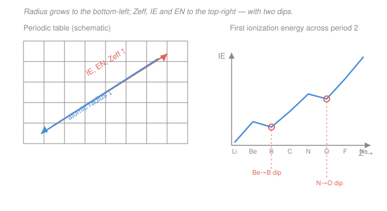

# Inorganic Chemistry · Lesson 1.1: Periodic Trends, Revisited

> ⏱ ~15 min · Module 1: Periodicity, Ionic Solids & Acid–Base Theory · Builds on: [`general-chemistry` 1.3 Periodic trends](../../general-chemistry/lessons/01-03-periodic-trends.md), [`general-chemistry` 1.2 Electron configurations](../../general-chemistry/lessons/01-02-electron-configurations-periodic-table.md) · Unlocks: 1.2 (ionic solids & lattice energy)

## Why this matters

Almost every prediction in inorganic chemistry — which salt has the higher melting point, whether a metal ion prefers a "hard" or "soft" partner, how strongly a ligand field splits d-orbitals — traces back to one question: *how strongly does the nucleus grip its outermost electrons?* In general chemistry you learned the trends as arrows on a chart ("radius shrinks across a period"). Here we make that quantitative with **effective nuclear charge**, learn a back-of-envelope tool (Slater's rules) to actually compute it, and then meet the handful of **anomalies** that break the tidy arrows — because those exceptions are exactly where real chemistry gets interesting. This is the predictive toolkit the rest of the course leans on.

## The idea

A sodium atom has 11 protons, but its lone valence electron does *not* feel a pull of $+11$. The ten inner electrons sit between it and the nucleus, partly cancelling the charge it sees — they **shield** it. What's left over is the **effective nuclear charge**, $Z_\text{eff}$: the net positive pull an electron actually experiences after its fellow electrons have blurred out part of the nucleus.

That single number explains the whole periodic table. Move **left to right** across a period: you add protons to the nucleus but the new electrons go into the *same* shell, where they shield each other poorly. So $Z_\text{eff}$ climbs, the grip tightens, atoms shrink, and it costs more to remove an electron. Move **down a group**: the valence electron lands in a shell farther out, with a full extra layer of inner electrons shielding it — the grip loosens, atoms swell, electrons leave easily. Radius, ionization energy, electron affinity, electronegativity are all just different ways of asking "how hard is the pull?" — and the pull is $Z_\text{eff}$.

The beauty is that we can *estimate* $Z_\text{eff}$ with a scrap of paper, using a recipe John Slater fit to real data in 1930.

## The formal version

**Effective nuclear charge.**

$$Z_\text{eff} = Z - S,$$

where $Z$ is the atomic number (the true nuclear charge, = number of protons) and $S$ is the **shielding (or screening) constant** — the fraction of the nuclear charge cancelled by the other electrons. *In words: start with the full nuclear pull, subtract off how much the other electrons hide it.*

**Slater's rules** give a recipe for $S$. First write the electron configuration in these groupings, kept in order:

$$(1s)\;(2s,2p)\;(3s,3p)\;(3d)\;(4s,4p)\;(4d)\;(4f)\;(5s,5p)\;\dots$$

To find $S$ for one chosen electron, add up contributions from all the *other* electrons:

- **Same group as the chosen electron:** $0.35$ each — except the $(1s)$ group, where the other $1s$ electron contributes $0.30$.
- **For an $s$ or $p$ electron:** each electron in the **$n-1$** shell contributes $0.85$; each electron in shells **$n-2$ and deeper** contributes $1.00$.
- **For a $d$ or $f$ electron:** *every* electron in a group to its **left** contributes $1.00$ (inner electrons screen a diffuse d/f electron almost completely).
- Electrons in groups to the **right** of the chosen one contribute **0** (they're farther out; they don't shield inward).

*In words: your own shell-mates hide about a third of a proton each; the shell just inside hides most of a proton; anything deeper hides a full proton — and d/f electrons get shielded completely by everything inside them.*

**Worked estimate — a $3p$ electron in silicon ($Z=14$).** Configuration $(1s)^2(2s,2p)^8(3s,3p)^4$. For one of the $3p$ electrons:

$$S = \underbrace{3(0.35)}_{\text{other }3s,3p} + \underbrace{8(0.85)}_{n-1:\ 2s,2p} + \underbrace{2(1.00)}_{\text{deeper}:\ 1s} = 1.05 + 6.80 + 2.00 = 9.85,$$

$$Z_\text{eff} = 14 - 9.85 = 4.15.$$

So Si's valence electron feels about $+4.15$, not $+14$ — the ten inner electrons hide most of the nucleus. (The trend engine: for the analogous $3p$ electron in $\ce{Cl}$, $Z=17$, you'd get $Z_\text{eff}=6.10$ — bigger $Z_\text{eff}$ to the right, hence Cl's smaller radius and larger ionization energy.)

**The four properties, all downstream of $Z_\text{eff}$:**

- **Atomic / ionic radius** — the size of the electron cloud. Shrinks **across** a period (rising $Z_\text{eff}$), grows **down** a group (new outer shell). Cations are smaller than their parent atom (lost a shell / less electron–electron repulsion); anions are larger.
- **Ionization energy (IE)** — energy to pull off the most loosely held electron, $\ce{X(g) -> X+(g) + e-}$. Rises **across**, falls **down** — it tracks $Z_\text{eff}$ over distance.
- **Electron affinity (EA)** — energy released when a gas-phase atom *gains* an electron, $\ce{X(g) + e- -> X-(g)}$. Generally more exothermic across a period; halogens are the champions (one electron short of a closed shell).
- **Electronegativity (EN)** — pull on shared electrons *inside a bond*. **Pauling** defined it from bond energies (fluorine $\approx 4.0$, the top of the scale); **Mulliken** gave the intuition: $\text{EN} \propto \tfrac12(\text{IE} + \text{EA})$ — an atom that both clings to its own electrons (high IE) and grabs more (high EA) hogs the bonding pair.

**The anomalies that break the arrows.** The trends are averages; four bumps recur:

1. **Group 2 → 13 IE dip** (e.g. $\text{IE}_1$: $\ce{Be} > \ce{B}$, $\ce{Mg} > \ce{Al}$). Group 2 removes an $ns$ electron; group 13 removes a higher-energy, better-shielded $np$ electron — easier to pull despite the larger $Z$.
2. **Group 15 → 16 IE dip** ($\ce{N} > \ce{O}$, $\ce{P} > \ce{S}$). Group 15 has a stable half-filled $np^3$ (one electron per orbital, no pairing). Group 16's fourth $p$ electron must *pair up*, and the electron–electron repulsion of that pair makes it easier to remove.
3. **d-block contraction & the lanthanide contraction.** Filling a $d$ (or $f$) subshell adds electrons that shield poorly, so $Z_\text{eff}$ creeps up and radii shrink more than expected. Across the 14 lanthanides ($4f$ filling) this **lanthanide contraction** accumulates enough to shrink the following $5d$ elements down to the size of their $4d$ cousins — which is why $\ce{Zr}$ & $\ce{Hf}$, and $\ce{Nb}$ & $\ce{Ta}$, are near-twins in size and chemistry.
4. **Inert-pair effect.** Heavy $p$-block elements ($\ce{Tl}, \ce{Pb}, \ce{Bi}$) increasingly favor an oxidation state **two below** the group value ($\ce{Tl+}$ over $\ce{Tl^3+}$, $\ce{Pb^2+}$ over $\ce{Pb^4+}$): the $ns^2$ pair is held tightly (relativistic + poor $d/f$ shielding) and stays out of bonding.

## Picture

*Left: the two master arrows point opposite ways — radius toward the bottom-left, $Z_\text{eff}$/IE/EN toward the top-right. Right: the first-ionization-energy sawtooth across period 2 rises overall but drops at boron (group 2→13) and again at oxygen (group 15→16) — the two circled anomalies.*

## Worked examples

**Example 1 (mechanical — $Z_\text{eff}$ and the trend).** Compare the pull on a valence electron in $\ce{Na}$ ($Z=11$) versus its $3p$-region neighbor. Sodium's config is $(1s)^2(2s,2p)^8(3s)^1$. For the lone $3s$ electron:

$$S = \underbrace{0}_{\text{no same-group peers}} + \underbrace{8(0.85)}_{2s,2p} + \underbrace{2(1.00)}_{1s} = 6.80 + 2.00 = 8.80,\qquad Z_\text{eff} = 11 - 8.80 = 2.20.$$

Sodium's valence electron feels only $+2.20$. Compare Si's $3p$ from above ($+4.15$): across period 3 the pull nearly doubles, so Si is much smaller and far harder to ionize than Na. That's the "across a period" arrow, made numeric.

**Example 2 (why you'd care — sizing a bond).** Which is more electronegative, $\ce{O}$ or $\ce{S}$, and why does it matter? Both are group 16, but oxygen sits one period up: its valence electrons are in $n=2$, closer to the nucleus with less shielding, so a higher $Z_\text{eff}$-over-distance and thus higher IE and EA — Mulliken then gives $\ce{O}$ (EN $3.44$) $>$ $\ce{S}$ (EN $2.58$). Consequence you'll use in Module 1: the $\ce{O-H}$ bond is far more polarized than $\ce{S-H}$, which is a big reason $\ce{H2O}$ hydrogen-bonds and $\ce{H2S}$ barely does — and it foreshadows the hard/soft acid–base distinction (small, hard, electronegative O vs. large, soft, polarizable S) coming in [1.5](01-05-hard-soft-acid-base.md).

## Watch out

- **You might think $Z_\text{eff}$ equals the group number.** It's smaller — shielding always eats into $Z$. Slater's $Z_\text{eff}$ for a period-3 valence electron runs $\sim 2$–$6$, not $1$–$7$. (Slater is an *estimate*; more exact "clementi" values differ by a few tenths, but the trends are identical.)
- **You might read the IE dips as the trend "reversing."** It doesn't reverse — $Z$ still rises. The dip means a *different, more removable* electron is now the target (an $np$ instead of $ns$, or a paired vs. unpaired $p$ electron). The overall climb resumes right after.
- **You might expect $5d$ elements to be much bigger than $4d$ ones** (they're a whole period lower). The lanthanide contraction cancels that expected growth, so $\ce{Hf}$ ≈ $\ce{Zr}$ in size — a genuine surprise if you only knew "radius increases down a group."
- **You might apply Slater's $0.85$/$1.00$ split to a $d$ electron.** For $d$ and $f$ electrons, *everything* to the left counts as $1.00$ (not $0.85$ for $n-1$) — inner shells screen a diffuse d-orbital almost totally.

## One-liner

> Every periodic trend is a story about $Z_\text{eff} = Z - S$ — the net nuclear grip after shielding — and every famous exception is a story about *which* electron you're removing.

## Problems

**P1 (🟢)** Use Slater's rules to compute $Z_\text{eff}$ for a $3p$ electron in phosphorus ($\ce{P}$, $Z=15$) and in sulfur ($\ce{S}$, $Z=16$). Which prediction about atomic radius do the two numbers support?

**P2 (🟡)** Rank the first ionization energies of $\ce{Mg}$, $\ce{Al}$, $\ce{Si}$, and $\ce{P}$ from highest to lowest, and justify the order in terms of $Z_\text{eff}$/shielding. Your ranking should contain exactly one anomaly — name which pair it is and explain it.

**P3 (🔴)** Explain the *lanthanide contraction* and use it to account for the observation that zirconium ($\ce{Zr}$, period 5) and hafnium ($\ce{Hf}$, period 6) have almost identical atomic radii (~$159$ vs ~$156$ pm) and remarkably similar chemistry — so much so that hafnium was one of the last stable elements to be discovered.

Solutions

**P1** Both have configuration $(1s)^2(2s,2p)^8(3s,3p)^n$; a $3p$ electron sees $(n-1)$ others in its own $(3s,3p)$ group.

*Phosphorus*, $(3s,3p)^5$ — 4 other electrons in the group:
$$S = 4(0.35) + 8(0.85) + 2(1.00) = 1.40 + 6.80 + 2.00 = 10.20,\qquad Z_\text{eff} = 15 - 10.20 = 4.80.$$

*Sulfur*, $(3s,3p)^6$ — 5 other electrons in the group:
$$S = 5(0.35) + 8(0.85) + 2(1.00) = 1.75 + 6.80 + 2.00 = 10.55,\qquad Z_\text{eff} = 16 - 10.55 = 5.45.$$

$Z_\text{eff}$ rises from $4.80$ (P) to $5.45$ (S): adding a proton raises $Z$ by $1.00$ while the extra same-shell electron only adds $0.35$ to $S$, a net $+0.65$ grip. The stronger pull means **S is smaller than P** — consistent with radius shrinking left-to-right across period 3. (Nice twist to notice: Slater predicts a *higher* $Z_\text{eff}$ for S, yet S's first ionization energy is actually *lower* than P's — that's the group 15→16 anomaly of P2, which shielding alone can't see.)

**P2** General trend across period 3: $Z_\text{eff}$ rises Mg → Al → Si → P, so IE should rise in that order. But there's the **group 2 → 13 dip**: Mg's outer config is $3s^2$; removing an electron from Al means removing a single $3s^2 3p^1$ electron — a $3p$ electron that is higher in energy and shielded by the filled $3s^2$, so it leaves *more* easily than one of Mg's $3s$ electrons. Hence $\ce{Al} < \ce{Mg}$ despite Al's larger $Z$. Actual values (kJ/mol) confirm the order:

$$\ce{P}\ (1012) \;>\; \ce{Si}\ (786) \;>\; \ce{Mg}\ (738) \;>\; \ce{Al}\ (578).$$

The single anomaly is the **Al–Mg pair** (Al lower than Mg); Si and P follow the normal rising trend. (P is further boosted by its half-filled $3p^3$, but the ranking doesn't require that here.)

**P3** *The contraction.* Going across the lanthanides ($\ce{La}$ → $\ce{Lu}$), electrons fill the $4f$ subshell. The $4f$ orbitals are diffuse and inner-lying, so they shield the outer electrons very poorly (Slater: an $f$ electron barely screens the $6s$/$5d$ electrons). Every added $4f$ electron therefore lets $Z_\text{eff}$ creep up, and the atoms steadily shrink. Over all fourteen lanthanides this small per-step shrinkage accumulates into a substantial total — the **lanthanide contraction**.

*The consequence for Zr and Hf.* Normally an element one period lower is noticeably larger (an extra shell). Hf ($Z=72$) sits just after the lanthanide block, so its "expected" period-6 size increase over Zr ($Z=40$) is almost exactly cancelled by the contraction that occurred while the $4f$ shell filled. The two end up nearly the same size (~$159$ vs ~$156$ pm). Because atomic/ionic size largely dictates ionic radius, coordination behavior, and bonding, Zr and Hf behave almost identically — their ores occur together and are notoriously hard to separate, which is why Hf was only identified in 1923, long after its lighter twin. The same contraction makes Nb/Ta and Mo/W near-twins.

## Connections

- **Backward:** this quantifies the qualitative arrows from [`general-chemistry` 1.3](../../general-chemistry/lessons/01-03-periodic-trends.md) and rests on the shell/subshell filling order from [`general-chemistry` 1.2](../../general-chemistry/lessons/01-02-electron-configurations-periodic-table.md) — the same $(1s)(2s,2p)\dots$ groupings, now weighted by Slater's coefficients.
- **Forward:** ionic radius and $Z_\text{eff}$ set the ion sizes and charges that drive **lattice energy** in [1.2 (ionic solids & lattice energy)](01-02-ionic-solids-lattice-energy.md); electronegativity and size feed the **hard/soft acid–base** classification in [1.5](01-05-hard-soft-acid-base.md); and radial $Z_\text{eff}$ controls how far d-orbitals extend, which sets the crystal-field splitting $\Delta_o$ in Module 2.
- **Sideways:** the "every well is a parabola" spirit of approximation you met in mechanics shows up here as Slater's rules — a crude, fitted model that captures the leading behavior perfectly while quietly missing the exchange/pairing effects (the IE anomalies) that a fuller quantum treatment in [`quantum-mechanics`](../../quantum-mechanics/syllabus.md) restores.
