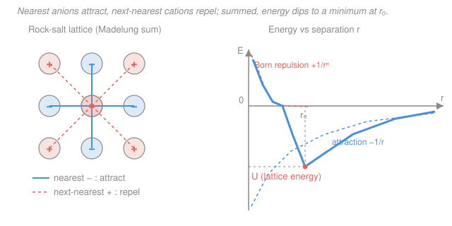

# Inorganic Chemistry · Lesson 1.2: Ionic Solids & Lattice Energy

> ⏱ ~15 min · Module 1: Periodicity, Ionic Solids & Acid–Base Theory · Builds on: [1.1 Periodic trends revisited](01-01-periodic-trends-revisited.md), [general chemistry 1.4 (ionic & covalent bonds)](../../general-chemistry/lessons/01-04-ionic-covalent-bonds-lewis-structures.md) · Unlocks: [1.3 Born–Haber cycle](01-03-born-haber-cycle.md)

## Why this matters

Why does table salt melt at 801 °C but magnesium oxide holds out past 2800 °C? Why is MgO used to line furnaces while NaCl dissolves in your soup? Both are just "a metal cation plus a nonmetal anion stacked in a crystal" — the same picture you drew in [general chemistry](../../general-chemistry/lessons/01-04-ionic-covalent-bonds-lewis-structures.md). The difference is **lattice energy**: the glue holding the crystal together. One number, computed from charge and size, predicts melting points, hardness, and solubility across the whole ionic world. It is also the biggest term in the [Born–Haber cycle](01-03-born-haber-cycle.md) you'll build next — so getting a physical feel for it now pays off immediately.

## The idea

Picture an ionic crystal as a 3-D checkerboard: every cation is surrounded by anions, every anion by cations, repeating forever. Now imagine tearing it apart into a gas of free-floating, infinitely separated ions. That costs energy — a *lot* of it — because you're fighting every electrostatic attraction at once. That cost is the **lattice energy**. A big lattice energy means a tightly bound, hard-to-disturb solid.

Two knobs set how strong the glue is, and both come straight from Coulomb's law. **Charge**: doubling the charge on *both* ions quadruples the pull, so a 2+/2− solid is dramatically tougher than a 1+/1− one. **Size**: the closer two ions sit, the harder they attract, so small ions bind more strongly than big fat ones. That's the whole story in one line — **more charge, less distance, stronger crystal** — and everything below is just making it quantitative.

One subtlety the checkerboard reveals: a given cation isn't only *attracted* to its nearest anion neighbors — it's also *repelled* by the next-nearest cations sitting one step further out, then attracted again beyond them. The true binding energy is the sum of this alternating series over the entire lattice, and that geometric sum is captured by a single number, the Madelung constant.

## The formal version

**Coulomb's law for one ion pair.** Two ions of charges $z_+e$ and $z_-e$ (where $z_\pm$ is the integer charge number — $+2$ for $\ce{Mg^2+}$, $-1$ for $\ce{Cl-}$ — and $e = 1.602\times10^{-19}$ C is the elementary charge) separated by $r$ have potential energy

$$E = \frac{1}{4\pi\varepsilon_0}\,\frac{z_+ z_-\, e^2}{r},$$

with $\varepsilon_0 = 8.854\times10^{-12}\ \mathrm{C^2 J^{-1} m^{-1}}$ the vacuum permittivity; the constant $\frac{1}{4\pi\varepsilon_0} = 8.988\times10^{9}\ \mathrm{J\,m\,C^{-2}}$. *In words: the energy of a cation–anion pair. Since $z_+ z_-$ is negative (opposite charges), $E$ is negative — a bound, stabilized pair — and it grows more negative as $r$ shrinks.*

**The Madelung constant.** A real crystal isn't one pair; it's an infinite alternating lattice. Summing the Coulomb energy from a reference ion to *every* other ion — nearest neighbors (attraction), next-nearest (repulsion), and on outward — multiplies the pair energy by a dimensionless geometric factor $M$, the **Madelung constant**:

$$E_\text{electrostatic} = \frac{1}{4\pi\varepsilon_0}\,\frac{N_A\, M\, z_+ z_-\, e^2}{r},$$

where $N_A = 6.022\times10^{23}\ \mathrm{mol^{-1}}$ scales to one mole. *In words: $M$ packages the entire lattice geometry into one number.* Crucially, **$M$ depends only on the structure type, not on which ions occupy it** — every rock-salt crystal shares $M \approx 1.748$ (NaCl), while CsCl-type has $M \approx 1.763$ and zinc-blende $M \approx 1.638$. The value exceeds 1 because attractions (nearer, more numerous) win over repulsions.

**The Born–Landé equation.** Pure Coulomb attraction would collapse the crystal to $r = 0$. What stops it is **Born repulsion** — the sharp push-back when electron clouds start to overlap (Pauli exclusion). Modeling that repulsion as $\propto 1/r^{\,n}$ and minimizing the total energy at the equilibrium separation $r_0$ gives the **lattice energy**:

$$\boxed{\,U = -\frac{N_A\, M\, |z_+ z_-|\, e^2}{4\pi\varepsilon_0\, r_0}\left(1 - \frac{1}{n}\right)}$$

*In words: the lattice energy is the Coulomb sum, shrunk slightly by the factor $(1 - 1/n)$ that accounts for repulsion pushing the ions apart.* Here $r_0$ is the equilibrium cation–anion distance (sum of the ionic radii), and $n$ is the **Born exponent** (typically 5–12; larger for bigger, less compressible ions). Note the sign convention: with the leading minus sign and $|z_+ z_-|$, $U$ comes out **negative** (energy released when the crystal forms). Many texts instead report lattice energy as the positive energy to *break* the crystal apart; watch which convention a problem uses.

**The two predictive rules.** Strip away the constants and $U$ is governed by

$$U \propto \frac{|z_+ z_-|}{r_0}.$$

*In words: lattice energy scales with the product of the charges and inversely with ion separation.* So (1) charge dominates — $\ce{MgO}$ ($2\times2 = 4$) crushes $\ce{NaCl}$ ($1\times1 = 1$); and (2) among same-charge salts, smaller ions win — $\ce{LiF} > \ce{LiI}$ because $\ce{F-}$ is far smaller than $\ce{I-}$.

**Radius-ratio rules.** Which structure type (and so how many neighbors each ion has, the *coordination number*, CN) does a salt adopt? A cation wants as many anions around it as will fit without the anions grinding into each other. The geometry depends only on the ratio $\rho = r_+/r_-$:

| $\rho = r_+/r_-$ | CN | Geometry | Structure type |
|---|---|---|---|
| $0.225 - 0.414$ | 4 | tetrahedral | zinc blende ($\ce{ZnS}$) |
| $0.414 - 0.732$ | 6 | octahedral | rock salt ($\ce{NaCl}$) |
| $0.732 - 1.000$ | 8 | cubic | cesium chloride ($\ce{CsCl}$) |

*In words: bigger cations relative to anions pack more neighbors around them.* Below 0.225 you get CN 3 or 2; the cutoffs come from pure hard-sphere packing geometry. **Caveat:** these are guidelines, not laws — ions aren't hard spheres, and covalency or polarizability routinely breaks the prediction (see P3).

## Picture

The left shows the Madelung idea: the central cation is pulled toward its nearest anions (blue) and pushed from the next-nearest cations (coral) — the lattice energy is the sum over all such shells. The right shows why a crystal has a preferred spacing: Coulomb attraction (pulls ions together, $-1/r$) plus Born repulsion (pushes them apart at short range, $+1/r^{\,n}$) add to a well whose minimum sits at $r_0$, with depth $U$.

## Worked examples

**Example 1 (charge beats size).** Rank $\ce{NaF}$, $\ce{MgO}$, and $\ce{CsI}$ by lattice energy. Use $U \propto |z_+z_-|/r_0$. Charge products: $\ce{NaF}$ and $\ce{CsI}$ are both $1\times1 = 1$; $\ce{MgO}$ is $2\times2 = 4$. Charge is the dominant term, so $\ce{MgO}$ wins outright — no size comparison can overcome a 4× charge factor. Between the two 1+/1− salts, size decides: $\ce{Na+}$/$\ce{F-}$ are small ions, $\ce{Cs+}$/$\ce{I-}$ are huge, so $r_0(\ce{NaF}) \ll r_0(\ce{CsI})$ and $\ce{NaF} > \ce{CsI}$. Final order: $\ce{MgO} \gg \ce{NaF} > \ce{CsI}$. (Experimental magnitudes: $3795$, $923$, $\sim 600\ \mathrm{kJ/mol}$ — the charge gap is enormous.)

**Example 2 (why melting points track lattice energy).** MgO and NaCl both crystallize in the rock-salt structure with the *same* $M = 1.748$ and similar $r_0$ ($\sim 2.1$ Å vs $2.8$ Å). Yet MgO melts at 2852 °C and NaCl at 801 °C. The Born–Landé numerator carries $|z_+z_-|$: going from $1\times1$ to $2\times2$ multiplies $U$ by 4, and the smaller $r_0$ pushes it higher still. Melting means shaking ions loose from the lattice, so a 4× deeper energy well demands a far higher temperature. Same logic explains hardness (MgO scratches NaCl) and low solubility (water can't easily pry apart the strongly bound MgO lattice). *One number, three macroscopic properties.*

## Watch out

- **You might think doubling the charge doubles the lattice energy — it roughly quadruples it.** $U \propto |z_+ z_-|$ is the *product*, so $\ce{MgO}$ (2·2) beats $\ce{NaCl}$ (1·1) by a factor of ~4, not 2. Charge is almost always the deciding factor; only compare sizes *after* charges tie.
- **You might mix up the sign of $U$.** Born–Landé as boxed gives a *negative* number (crystal formation releases energy). "Lattice energy" is often quoted as the positive energy to *break* the lattice. Both describe the same glue — just flip the sign. State your convention.
- **You might trust radius-ratio rules too far.** They're hard-sphere geometry; real ions polarize and bond partly covalently. $\ce{LiI}$'s ratio predicts one structure but it adopts another (P3). Treat the rules as a first guess, not a verdict.

## One-liner

> Lattice energy $U \propto |z_+z_-|/r_0$ — high charge and small ions make a tightly bound crystal — with the Madelung constant summing the lattice geometry and the Born exponent trimming for short-range repulsion.

## Problems

**P1 (🟢)** Rank these four ionic solids by lattice energy (most negative first) and justify each comparison using $U \propto |z_+z_-|/r_0$: $\ce{NaCl}$, $\ce{MgO}$, $\ce{CaO}$, $\ce{KBr}$. Ionic radii (pm): $\ce{Na+}\ 102$, $\ce{K+}\ 138$, $\ce{Mg^2+}\ 72$, $\ce{Ca^2+}\ 100$, $\ce{Cl-}\ 181$, $\ce{Br-}\ 196$, $\ce{O^2-}\ 140$.

**P2 (🟡)** Use the Born–Landé equation to compute the lattice energy of $\ce{NaCl}$. Given: $M = 1.748$, $z_+ = +1$, $z_- = -1$, $r_0 = 2.82\times10^{-10}$ m, Born exponent $n = 8$. Constants: $\frac{1}{4\pi\varepsilon_0} = 8.988\times10^{9}\ \mathrm{J\,m\,C^{-2}}$, $e = 1.602\times10^{-19}$ C, $N_A = 6.022\times10^{23}\ \mathrm{mol^{-1}}$. Report your answer in kJ/mol.

**P3 (🔴)** (a) Predict the coordination number and structure type for $\ce{CsCl}$ using the radius ratio, given $r(\ce{Cs+}) = 167$ pm and $r(\ce{Cl-}) = 181$ pm. (b) Now try $\ce{LiI}$, with $r(\ce{Li+}) = 76$ pm and $r(\ce{I-}) = 220$ pm — what does the rule predict? $\ce{LiI}$ actually crystallizes in the rock-salt (CN 6) structure. Explain why the rule fails here.

Solutions

**P1** Compute charge products and separations $r_0 = r_+ + r_-$:

- $\ce{MgO}$: $|z_+z_-| = 2\cdot2 = 4$; $r_0 = 72 + 140 = 212$ pm.
- $\ce{CaO}$: $|z_+z_-| = 2\cdot2 = 4$; $r_0 = 100 + 140 = 240$ pm.
- $\ce{NaCl}$: $|z_+z_-| = 1\cdot1 = 1$; $r_0 = 102 + 181 = 283$ pm.
- $\ce{KBr}$: $|z_+z_-| = 1\cdot1 = 1$; $r_0 = 138 + 196 = 334$ pm.

Charge dominates, so the two oxides (product 4) outrank the two halides (product 1). Within each charge class, smaller $r_0$ wins: $\ce{MgO}$ ($212$) beats $\ce{CaO}$ ($240$); $\ce{NaCl}$ ($283$) beats $\ce{KBr}$ ($334$). A quick proportionality check ($|z_+z_-|/r_0$, in units of $1/\text{pm}$): $\ce{MgO}\ 4/212 = 0.0189$; $\ce{CaO}\ 4/240 = 0.0167$; $\ce{NaCl}\ 1/283 = 0.0035$; $\ce{KBr}\ 1/334 = 0.0030$.

**Order: $\ce{MgO} > \ce{CaO} \gg \ce{NaCl} > \ce{KBr}$.** (Matches experiment: $3795 > 3414 \gg 787 > 682\ \mathrm{kJ/mol}$.)

**P2** Assemble the boxed formula piece by piece.

First the constant chunk $\frac{1}{4\pi\varepsilon_0}e^2 = (8.988\times10^{9})(1.602\times10^{-19})^2$. Now $(1.602\times10^{-19})^2 = 2.566\times10^{-38}\ \mathrm{C^2}$, so this chunk $= 8.988\times10^{9}\times2.566\times10^{-38} = 2.307\times10^{-28}\ \mathrm{J\,m}$.

Multiply by $N_A$, $M$, and $|z_+z_-| = 1$, then divide by $r_0$:

$$\frac{N_A M |z_+z_-|}{r_0}\cdot\frac{e^2}{4\pi\varepsilon_0} = \frac{(6.022\times10^{23})(1.748)(1)}{2.82\times10^{-10}}\times 2.307\times10^{-28}.$$

Numerator of the fraction: $6.022\times10^{23}\times1.748 = 1.0526\times10^{24}$. Divide by $r_0$: $1.0526\times10^{24} / 2.82\times10^{-10} = 3.733\times10^{33}\ \mathrm{m^{-1}\,mol^{-1}}$. Times the constant chunk: $3.733\times10^{33}\times2.307\times10^{-28} = 8.61\times10^{5}\ \mathrm{J/mol}$.

Apply the Born factor $\left(1 - \tfrac1n\right) = 1 - \tfrac18 = 0.875$ and the leading minus sign:

$$U = -8.61\times10^{5}\times 0.875 = -7.54\times10^{5}\ \mathrm{J/mol} \approx \boxed{-753\ \mathrm{kJ/mol}}.$$

*Check.* The experimental lattice energy of NaCl is about $-787\ \mathrm{kJ/mol}$; Born–Landé lands within ~4%, the expected accuracy for this simple model. ✓

**P3** (a) $\rho = r_+/r_- = 167/181 = 0.923$. This falls in the $0.732 - 1.000$ band → **CN 8, cubic (CsCl-type)**. Correct — CsCl is the structure's namesake.

(b) $\rho = 76/220 = 0.345$. This falls in the $0.225 - 0.414$ band → the rule predicts **CN 4, tetrahedral (zinc-blende)**. But $\ce{LiI}$ is actually rock salt (CN 6). **Why it fails:** the radius-ratio model treats ions as incompressible hard spheres just touching. Here the tiny $\ce{Li+}$ sits inside a cage of huge, highly *polarizable* $\ce{I-}$ ions; the large anions deform and effectively cushion contact, and the real bonding has enough covalent/polarization character that the hard-sphere geometry no longer applies. The higher (CN 6) coordination is more stable than the naive ratio suggests. The lesson: radius ratios are a starting guess, especially unreliable when one ion is very small and the counter-ion very large and soft.

## Connections

- **Backward:** the charge-and-size logic is exactly the [periodic trends](01-01-periodic-trends-revisited.md) of ionic radius and charge, now driving an energy; and the crystal itself is the ionic bond from [general chemistry](../../general-chemistry/lessons/01-04-ionic-covalent-bonds-lewis-structures.md) extended from one pair to an infinite lattice.
- **Forward:** lattice energy is the star term of the [Born–Haber cycle](01-03-born-haber-cycle.md) — Hess's law wrapped around a crystal — where it's extracted from measurable enthalpies instead of computed from geometry. The "small hard cation, big soft polarizable anion" idea in P3 previews [hard–soft acid–base theory](01-05-hard-soft-acid-base.md).
- **Sideways:** the Coulomb-plus-Born-repulsion well (attraction $-1/r$, repulsion $+1/r^n$, minimum at $r_0$) is the same shape as the Lennard-Jones potential in [physical chemistry](../../physical-chemistry/syllabus.md) and the [condensed matter](../../condensed-matter/syllabus.md) treatment of crystal binding — and structurally identical to any potential well with a stable equilibrium at its minimum.
