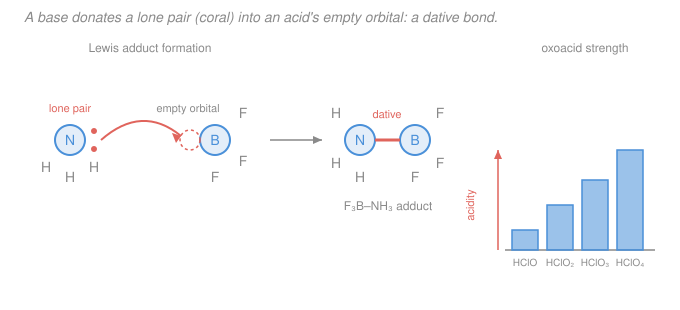

# Inorganic Chemistry · Lesson 1.4: Brønsted & Lewis Acids and Bases

> ⏱ ~15 min · Module 1: Periodicity, Ionic Solids & Acid–Base Theory · Builds on: [1.1 Periodic trends revisited](01-01-periodic-trends-revisited.md), [`general-chemistry` 4.1 Acids, bases, pH & strength](../../general-chemistry/lessons/04-01-acids-bases-ph-strength.md) · Unlocks: [1.5 Hard–soft acid–base theory](01-05-hard-soft-acid-base.md)

## Why this matters

In general chemistry an acid was "a thing that gives up an $\ce{H+}$." That definition is true but small — it can't explain why $\ce{BF3}$ behaves like an acid despite having no proton to give, why $\ce{Fe^3+}$ in water is corrosively acidic, or why an ammonia molecule wraps six-deep around a metal ion. This lesson widens the lens twice. The **Brønsted–Lowry** view keeps the proton but makes the *transfer* the point; the **Lewis** view drops the proton entirely and makes the *electron pair* the point. That second move is the master key to Module 2: every metal complex you will ever draw — $\ce{[Fe(CN)6]^4-}$, $\ce{[Co(NH3)6]^3+}$ — is nothing but a Lewis acid (the metal) clamped onto Lewis bases (the ligands). Get this lesson and coordination chemistry becomes one idea repeated.

## The idea

Two ways to widen "acid and base," nested one inside the other.

**First widening — follow the proton, not the substance.** Forget "acids are sour dissolved things." A **Brønsted acid** is simply whatever *hands off* a proton in a given reaction; a **Brønsted base** is whatever *catches* it. It's a transfer, so it always has two sides and two products, and those products are themselves a base and an acid waiting to run the reaction backward — a **conjugate pair**. The same molecule can be donor in one reaction and acceptor in another (water does both). The interesting inorganic payoff is *predicting strength from the periodic table*: how tightly a proton is held depends on the bond it sits in and how happy the leftover anion is, and both track cleanly with position and oxidation state.

**Second widening — follow the electron pair.** A proton is really just a bare positive charge looking for a pair of electrons to snuggle into. So why insist on the proton at all? **Lewis** stripped it out: an **acid is anything with an empty orbital that accepts an electron pair**, a **base is anything with a lone pair to donate.** They meet and share the pair — one new bond, both electrons from the base. That bond is a **dative** (coordinate) bond, and the union is an **adduct**. This is strictly bigger than Brønsted: $\ce{H+}$ is just *one particular* Lewis acid (an empty $1s$ orbital), so every Brønsted reaction is secretly a Lewis reaction, but not vice versa. $\ce{BF3}$, $\ce{Al^3+}$, $\ce{Fe^3+}$ — all acids with no proton in sight.

## The formal version

**Brønsted–Lowry.** In a proton transfer,

$$\ce{HA + B <=> A- + HB+},$$

$\ce{HA}$ is the acid (proton donor), $\ce{B}$ the base (proton acceptor). *In words: the acid gives $\ce{H+}$, the base takes it.* Removing $\ce{H+}$ from an acid leaves its **conjugate base** $\ce{A-}$; adding $\ce{H+}$ to a base gives its **conjugate acid** $\ce{HB+}$. The pairs $\ce{HA}/\ce{A-}$ and $\ce{HB+}/\ce{B}$ are **conjugate acid–base pairs**, differing by exactly one proton. Strong acid $\Rightarrow$ weak (stable, contented) conjugate base — the strength lives in *how badly the acid wants to be rid of the proton*.

**Periodic trends in Brønsted strength** (all about how easily $\ce{H+}$ leaves and how stable the leftover is):

- *Binary acids down a group — acidity increases.* $\ce{HF < HCl < HBr < HI}$. Going down, the H–X bond gets longer and weaker (bigger, more diffuse valence orbital), so the proton leaves more easily; bond strength dominates over electronegativity here. *In words: the weaker the bond, the stronger the acid.* ($\ce{HI}$ is a strong acid; $\ce{HF}$, despite F's electronegativity, is only weak.)
- *Binary acids across a period — acidity increases with electronegativity.* $\ce{CH4 < NH3 < H2O < HF}$. A more electronegative atom better stabilizes the negative charge on the conjugate base $\ce{A-}$.
- *Oxoacids $\ce{H_nEO_m}$ — more terminal oxygens (equivalently, higher oxidation state of the central atom $\ce{E}$) means a stronger acid.* Extra electronegative O atoms pull electron density off the O–H bond and spread the conjugate base's negative charge over more oxygens (resonance delocalization). **Pauling's rules** capture it: acid strength climbs by roughly five orders of magnitude in $K_a$ per additional terminal (non-OH) oxygen. Hence

$$\ce{HClO < HClO2 < HClO3 < HClO4}, \qquad \text{Cl oxidation state } +1 < +3 < +5 < +7.$$

*In words: pile more oxygens on the central atom and the O–H proton leaves more willingly.* Same logic across central atoms: $\ce{HClO4 > HBrO4 > HIO4}$ (more electronegative center) and $\ce{H2SO4 > H2SeO3}$ etc.

**Amphoterism.** A species is **amphoteric** if it can act as *either* acid or base depending on its partner. Water is the archetype: $\ce{H2O + HCl -> H3O+ + Cl-}$ (water is the base) but $\ce{H2O + NH3 -> OH- + NH4+}$ (water is the acid). Bicarbonate $\ce{HCO3-}$ is amphoteric ($\ce{-> CO3^2-}$ as acid, $\ce{-> H2CO3}$ as base). The inorganic showpiece is **amphoteric oxides/hydroxides** — $\ce{Al2O3}$, $\ce{ZnO}$, $\ce{Al(OH)3}$ — which dissolve in *both* strong acid and strong base (worked below). These sit on the metal/nonmetal diagonal: metal oxides are basic, nonmetal oxides acidic, and the borderline ones do both.

**Lewis.** A **Lewis acid** accepts an electron pair (needs a low-lying empty orbital); a **Lewis base** donates an electron pair (has an accessible lone pair). They combine into an **adduct** joined by a **dative bond** — an ordinary covalent bond in which *both* shared electrons came from the base:

$$\ce{BF3 + :NH3 -> F3B-NH3}.$$

*In words: the nitrogen lone pair drops into boron's empty $2p$ orbital, and now they share it.* Representative players:

- Lewis acids: $\ce{H+}$ (empty $1s$), $\ce{BF3}$/$\ce{AlCl3}$ (electron-deficient octet), $\ce{CO2}$/$\ce{SO3}$ (accept at C/S), and — the ones that matter most here — **metal cations** $\ce{Fe^3+}, \ce{Cu^2+}, \ce{Ag+}, \ce{Co^3+}$, which have empty valence $d$/$s$/$p$ orbitals.
- Lewis bases: $\ce{NH3}$, $\ce{H2O}$, $\ce{OH-}$, $\ce{F-}$, $\ce{CN-}$, $\ce{Cl-}$ — anything with a spare lone pair. In coordination chemistry these are called **ligands**.

The whole of Module 2 is this one reaction: a metal-ion Lewis acid binding several ligand Lewis bases, e.g.

$$\ce{Fe^3+ + 6 H2O -> [Fe(H2O)6]^3+},$$

six dative bonds, six lone pairs donated into the metal's empty orbitals. Because $\ce{H+}$ is just the smallest Lewis acid, **every Brønsted acid–base reaction is a Lewis reaction in disguise** — but $\ce{BF3 + NH3}$, with no proton anywhere, is Lewis-only. Lewis is the strict generalization.

## Picture

The nitrogen lone pair (coral) flows into boron's empty orbital, and the resulting dative bond (coral) is what holds the adduct together — the exact move a ligand makes onto a metal. The ladder on the right shows Pauling's rule at a glance: each extra oxygen raises $\ce{HClO}_n$'s acidity another rung.

## Worked examples

**Example 1 (Lewis vs. Brønsted bookkeeping).** Classify $\ce{HCl + NH3 -> NH4+ + Cl-}$ both ways.

*Brønsted:* $\ce{HCl}$ donates a proton (acid), $\ce{NH3}$ accepts it (base). Conjugate pairs: $\ce{HCl}/\ce{Cl-}$ and $\ce{NH4+}/\ce{NH3}$.

*Lewis:* the $\ce{NH3}$ lone pair attacks the H of $\ce{HCl}$, forming the new N–H bond while $\ce{Cl-}$ leaves. So $\ce{NH3}$ is the Lewis base (pair donor) and *the proton* is the Lewis acid (pair acceptor). Same event, two vocabularies — and note the Lewis reading names the electron pair explicitly, which is why it generalizes.

**Example 2 (why $\ce{Fe^3+}$ makes water acidic).** Dissolve $\ce{FeCl3}$ and the solution turns markedly acidic (pH can drop below 2) with no added acid. Why? $\ce{Fe^3+}$ is a small, highly charged **Lewis acid**; it pulls six water molecules into $\ce{[Fe(H2O)6]^3+}$ via dative bonds. That much positive charge drains electron density from the bound waters, weakening their O–H bonds so one lets a proton go:

$$\ce{[Fe(H2O)6]^3+ + H2O <=> [Fe(H2O)5(OH)]^2+ + H3O+}.$$

The Lewis acidity of the metal *creates* Brønsted acidity in its ligands — a preview of how central to inorganic chemistry the metal-as-acid idea is. Higher charge and smaller radius (both from the periodic trends of [1.1](01-01-periodic-trends-revisited.md)) make this worse: $\ce{Al^3+}$ and $\ce{Fe^3+}$ are noticeably acidic, $\ce{Na+}$ is not.

## Watch out

- **You might think $\ce{HF}$ is a strong acid because F is so electronegative.** Across a period electronegativity wins, but *down a group bond strength wins* — and the short, strong H–F bond keeps the proton, so $\ce{HF}$ is *weak* while $\ce{HI}$ is strong. Don't mix the two trends.
- **You might count *all* oxygens in an oxoacid.** Pauling's rule counts only **terminal** (non-hydroxyl) oxygens — the ones double-bonded / not carrying an H. $\ce{HClO4}$ has 3 terminal O (strong); $\ce{HClO}$ has 0 (weak). The OH oxygens don't count.
- **You might think "Lewis acid" means "has an H."** It's the opposite emphasis — a Lewis acid needs an *empty orbital*, not a proton. $\ce{BF3}$, $\ce{Al^3+}$, and $\ce{CO2}$ are Lewis acids with zero acidic protons.
- **Amphoteric ≠ amphiphilic and ≠ "always neutral."** Amphoteric means it *reacts as* acid or base depending on the partner — not that it's inert. $\ce{Al(OH)3}$ is happily unreactive in neutral water but dissolves in both $\ce{HCl}$ and $\ce{NaOH}$.

## One-liner

> A Brønsted acid gives a proton and a base takes it; strip away the proton and you get Lewis — acid = empty orbital, base = lone pair — the dative bond that builds every metal complex.

## Problems

**P1 (🟢)** For each species say whether it can act as a Lewis acid, a Lewis base, or both, and give a one-phrase reason: (a) $\ce{BF3}$, (b) $\ce{NH3}$, (c) $\ce{Fe^3+}$, (d) $\ce{OH-}$, (e) $\ce{CO2}$.

**P2 (🟡)** Rank each set from weakest to strongest Brønsted acid and justify with the relevant trend or rule: (a) $\ce{HF}, \ce{HCl}, \ce{HI}$; (b) $\ce{H3PO4}, \ce{HNO3}, \ce{HClO4}$ — actually rank the oxoacids $\ce{HNO2}$ vs. $\ce{HNO3}$, and $\ce{HClO}$ vs. $\ce{HClO3}$, and say which is stronger and why.

**P3 (🔴)** Aluminium hydroxide $\ce{Al(OH)3}$ is amphoteric. Write balanced equations for it dissolving (a) in strong acid and (b) in strong base, and identify the Lewis acid and Lewis base in each dissolution.

Solutions

**P1**
- (a) $\ce{BF3}$ — **Lewis acid.** Boron has only 6 valence electrons and an empty $2p$ orbital to accept a pair. No lone pair to donate, so acid only.
- (b) $\ce{NH3}$ — **Lewis base.** Nitrogen carries one lone pair to donate. (It has no low-lying empty orbital, so not an acid.)
- (c) $\ce{Fe^3+}$ — **Lewis acid.** A bare cation with empty valence orbitals; grabs electron pairs from ligands/water. (It cannot donate a pair.)
- (d) $\ce{OH-}$ — **Lewis base** (and a good Brønsted base too): oxygen has lone pairs to donate.
- (e) $\ce{CO2}$ — **Lewis acid.** The carbon accepts a lone pair (e.g. from $\ce{OH-}$, giving $\ce{HCO3-}$); the electrophilic C is the empty-orbital site. (One could argue an O lone pair makes it a weak base, but its characteristic behavior is as an acid.)

**P2** *(a)* $\ce{HF < HCl < HI}$. Same group (halogens), so **bond strength down the group** governs: H–I is the longest, weakest bond, so it releases $\ce{H+}$ most easily — strongest acid. $\ce{HF}$'s short strong bond makes it weak.

*(oxoacid comparisons, Pauling's rule — more terminal O / higher central oxidation state = stronger):*
- $\ce{HNO2 < HNO3}$: N goes from $+3$ to $+5$; $\ce{HNO3}$ has 2 terminal O vs. 1, spreading the conjugate-base charge better, so $\ce{HNO3}$ is much stronger (it's a strong acid, $\ce{HNO2}$ weak).
- $\ce{HClO < HClO3}$: Cl goes from $+1$ (0 terminal O) to $+5$ (2 terminal O); each added O raises $K_a$ by ~$10^5$, so $\ce{HClO3}$ is far stronger than the very weak $\ce{HClO}$.

Rule of thumb: number of terminal oxygens $0,1,2,3 \Rightarrow$ very weak, weak, strong, very strong.

**P3** Amphoteric $\ce{Al(OH)3}$ dissolves both ways.

*(a) In strong acid* — $\ce{Al(OH)3}$ acts as a **base**, its hydroxide O lone pairs accepting protons:
$$\ce{Al(OH)3 + 3 H+ -> Al^3+ + 3 H2O} \quad(\text{as } \ce{[Al(H2O)6]^3+ in water}).$$
Lewis view: the $\ce{H+}$ is the **Lewis acid**, the O of $\ce{Al(OH)3}$ (via $\ce{OH-}$) is the **Lewis base** donating a pair to the proton.

*(b) In strong base* — $\ce{Al(OH)3}$ acts as an **acid**, the $\ce{Al^3+}$ center accepting another hydroxide:
$$\ce{Al(OH)3 + OH- -> [Al(OH)4]-}.$$
Lewis view: $\ce{Al}$ (electron-poor, empty orbital) is the **Lewis acid**; the incoming $\ce{OH-}$ lone pair is the **Lewis base**, forming a fourth Al–O dative bond to give the aluminate ion $\ce{[Al(OH)4]-}$.

So the *same* compound plays base toward $\ce{H+}$ and acid toward $\ce{OH-}$ — the definition of amphoterism, and both readings are cleanest as Lewis acid–base events.

## Flashback

**From Lesson 1.1 (Periodic trends revisited):** Rank the cations $\ce{Na+}$, $\ce{Mg^2+}$, $\ce{Al^3+}$ by *charge density* (charge per size), and use it to predict which gives the most acidic aqueous solution. (Fresh variant — ties last lesson's trends to this one's Lewis-acidity idea.)

Solution

Across period 3 the nuclear charge rises while electrons fill the same shell, so **ionic radius shrinks** left→right *and* the cation charge grows: $\ce{Na+}$ ($+1$, ~102 pm) $< \ce{Mg^2+}$ ($+2$, ~72 pm) $< \ce{Al^3+}$ ($+3$, ~54 pm) in charge density. Higher charge density = a stronger **Lewis acid**: it polarizes bound water more, weakening those O–H bonds, so

$$\ce{[Al(H2O)6]^3+ <=> [Al(H2O)5(OH)]^2+ + H+}$$

goes furthest. Prediction: $\ce{Al^3+}$ gives the most acidic solution (aqueous $\ce{AlCl3}$ is genuinely acidic), $\ce{Mg^2+}$ mildly so, $\ce{Na+}$ essentially neutral. This is exactly Example 2's mechanism, now read straight off the periodic trend from [1.1](01-01-periodic-trends-revisited.md): smaller + more highly charged = stronger Lewis acid.

## Connections

- **Backward:** the acidity trends here are the periodic trends of [1.1](01-01-periodic-trends-revisited.md) (electronegativity, size, effective nuclear charge) applied to O–H and H–X bonds, and the electron-pair bookkeeping refines the Lewis-structure/VSEPR picture from [`general-chemistry` 1.5](../../general-chemistry/lessons/01-05-molecular-shape-vsepr-hybridization-mo.md). The proton-transfer half is straight from [`general-chemistry` 4.1](../../general-chemistry/lessons/04-01-acids-bases-ph-strength.md).
- **Forward:** [1.5 Hard–soft acid–base theory](01-05-hard-soft-acid-base.md) refines *which* Lewis acids prefer *which* Lewis bases (hard $\ce{Al^3+}$ likes hard $\ce{F-}$; soft $\ce{Ag+}$ likes soft $\ce{I-}$). All of Module 2 — [complexes and ligands](02-01-complexes-ligands-coordination-number.md) onward — is the metal-Lewis-acid + ligand-Lewis-base reaction developed here.
- **Sideways:** the dative bond is the same donor–acceptor idea behind Lewis adducts in organic chemistry (a nucleophile's lone pair attacking an electrophile is a Lewis base meeting a Lewis acid) and behind acid catalysis; the charge-density argument for Lewis acidity reappears in physical-chemistry solvation and lattice-energy reasoning (see [1.2 Ionic solids & lattice energy](01-02-ionic-solids-lattice-energy.md)).
