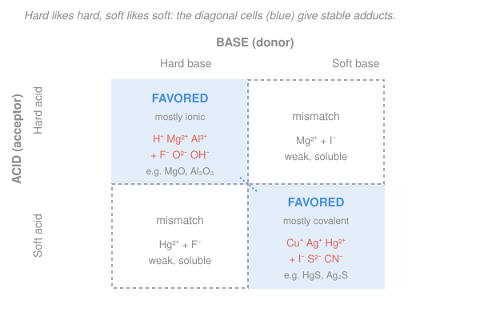

# Inorganic Chemistry · Lesson 1.5: Hard–Soft Acid–Base Theory

> ⏱ ~15 min · Module 1: Periodicity, Ionic Solids & Acid–Base Theory · Builds on: [1.4 Brønsted & Lewis acids and bases](01-04-bronsted-lewis-acids-bases.md) · Unlocks: [2.1 Complexes, ligands & coordination number](02-01-complexes-ligands-coordination-number.md)

## Why this matters

Lewis theory (from [1.4](01-04-bronsted-lewis-acids-bases.md)) tells you *what* an acid–base reaction is — an electron pair donated into an empty orbital — but not *which* pairing wins when several are possible. Yet nature is picky about pairings in a way that shapes whole subjects. Magnesium and calcium sit in the ground as oxides, carbonates, and silicates; copper, silver, and mercury sit in the *same* ground as **sulfide** ores. Iron in your blood is held by oxygen atoms, but a dose of mercury poisons you by grabbing the sulfur atoms in your proteins. All of this — geology, metallurgy, heavy-metal toxicity, why one solvent extracts a metal and another doesn't — is predicted by a single one-line heuristic. **Hard–Soft Acid–Base (HSAB) theory** is that heuristic, and it closes Module 1 by turning the Lewis picture into a predictive tool. It is the direct key to Boss Problem 1.

## The idea

Sort every Lewis acid and base into two bins: **hard** and **soft**.

A **hard** species is small, highly charged, and *tight* — its electron cloud is compact and barely deforms when another charge comes near. Think of a marble: dense, rigid, high charge packed into little volume. $\ce{H+}$, $\ce{Mg^2+}$, $\ce{Al^3+}$ are hard acids; $\ce{F-}$, $\ce{OH-}$, $\ce{O^2-}$ are hard bases.

A **soft** species is large, low-charged, and *squishy* — a big, loose, easily-distorted electron cloud (chemists say **polarizable**). Think of a water balloon: fat, floppy, easy to smear toward a partner. $\ce{Ag+}$, $\ce{Cu+}$, $\ce{Hg^2+}$ are soft acids; $\ce{I-}$, $\ce{S^2-}$, $\ce{CN-}$ are soft bases.

Now the whole theory in five words:

> **Hard likes hard; soft likes soft.**

Two marbles bond by pure *electrostatics* — plus charge meets minus charge, an essentially **ionic** bond. Two water balloons bond by *sharing and smearing* their loose electrons into each other — a **covalent** bond. But a marble and a water balloon are a bad match: the marble is too rigid to smear, and its concentrated charge can't get the diffuse balloon to line up cleanly. So a **matched** pairing (hard–hard or soft–soft) makes a *stronger, more stable* adduct than a **mismatched** one (hard–soft). That single preference is what predicts ore chemistry, solubility, and poison biology.

One honest caveat up front: this is a **trend, a heuristic — not a law**. It has no single equation you plug into. It sorts species by a *tendency* and ranks pairings by *relative* stability. It fails at the edges. But used with judgment it is astonishingly predictive, which is why it earns a lesson.

## The formal version

**Classification.** A Lewis acid or base is **hard** if it has:

- small ionic radius,
- high charge (for acids) or high electronegativity / low polarizability (for bases),
- a tightly held, weakly polarizable electron cloud.

It is **soft** if it has large radius, low charge, and a loosely held, highly **polarizable** electron cloud. *In words: hard = small and stiff; soft = big and squishy.* **Polarizability** is the tendency of an electron cloud to distort under a nearby electric field — big diffuse atoms polarize easily (soft); small dense ones resist (hard).

| | **Hard** | **Soft** |
|---|---|---|
| **Acids** (acceptors) | $\ce{H+}$, $\ce{Li+}$, $\ce{Mg^2+}$, $\ce{Al^3+}$, $\ce{Fe^3+}$ | $\ce{Cu+}$, $\ce{Ag+}$, $\ce{Au+}$, $\ce{Hg^2+}$, $\ce{Pt^2+}$ |
| **Bases** (donors) | $\ce{F-}$, $\ce{OH-}$, $\ce{O^2-}$, $\ce{H2O}$, $\ce{NH3}$, $\ce{CO3^2-}$ | $\ce{I-}$, $\ce{S^2-}$, $\ce{CN-}$, $\ce{CO}$, phosphines ($\ce{PR3}$), thiols ($\ce{RSH}$) |

Two patterns make the table almost self-generating: **(1)** down a group, softness increases ($\ce{F- < Cl- < Br- < I-}$: bigger, more polarizable). **(2)** For a metal, *lower* oxidation state and *heavier* (lower in the periodic table) means softer — $\ce{Fe^3+}$ is hard, but $\ce{Fe^2+}$ is borderline; $\ce{Cu^2+}$ is borderline while $\ce{Cu+}$ is soft. The donor atom's identity carries most of a ligand's character: N and O donors are hard, heavier P and S donors are soft.

**Pearson's principle.** For the exchange in which acids swap bases,

$$\text{(hard acid–soft base)} + \text{(soft acid–hard base)} \;\rightleftharpoons\; \text{(hard–hard)} + \text{(soft–soft)},$$

the equilibrium lies to the **right**. *In words: rearrange the partners so hard pairs with hard and soft with soft, and you release energy — the matched products are more stable.* The mechanism behind the arrow: hard–hard bonds gain stability from strong **ionic/electrostatic** attraction (two concentrated charges, close together), while soft–soft bonds gain it from good **covalent** orbital overlap (two diffuse, polarizable clouds that share electrons well). A hard–soft pair gets neither bonus fully, so it is the weakest of the four and the one the reaction spends to make the other two.

Consequences you can now predict:

- **Adduct/complex stability:** matched pairs form the more stable complexes and the higher formation constants.
- **Solubility:** a matched, strongly-bonded salt (e.g. soft–soft $\ce{HgS}$) is held together so tightly it barely dissolves — very low solubility. Mismatched salts dissolve more readily.
- **Which partner a metal seeks in nature or in a separation:** a metal ion ends up bound to whichever available donor matches its hardness.

## Picture

The two blue diagonal cells are the winners: hard acids with hard bases (top-left, giving ionic solids like $\ce{MgO}$) and soft acids with soft bases (bottom-right, giving covalent solids like $\ce{HgS}$). The grey off-diagonal cells — hard acid with soft base, or soft acid with hard base — are the mismatches Pearson's equilibrium runs *away* from.

## Worked examples

**Example 1 (mechanical — classify and pair).** Does silver, $\ce{Ag+}$, prefer to bind $\ce{F-}$ or $\ce{I-}$?

$\ce{Ag+}$ is a large, singly-charged, heavy $d$-block cation — a textbook **soft** acid. Among the halides, $\ce{F-}$ is small and hard; $\ce{I-}$ is large and **soft**. Soft likes soft, so $\ce{Ag+}$ prefers $\ce{I-}$. The evidence is exactly the solubility rule above: $\ce{AgF}$ is freely water-soluble (mismatched, weakly held), whereas $\ce{AgI}$ is famously *insoluble* — a soft–soft bond so stable it won't let go into water. (This is why halide photographic film and $\ce{AgI}$ cloud-seeding both use iodide, not fluoride.)

**Example 2 (why you'd care — predict an exchange direction).** In which direction does $\ce{HgF2 + BeS -> ?}$ go?

List the acids and bases. Acids: $\ce{Hg^2+}$ (large, heavy, low charge — **soft**) and $\ce{Be^2+}$ (tiny, high charge density — very **hard**). Bases: $\ce{F-}$ (**hard**) and $\ce{S^2-}$ (large, polarizable — **soft**). The reactants are *both mismatched*: soft $\ce{Hg^2+}$ stuck with hard $\ce{F-}$, and hard $\ce{Be^2+}$ stuck with soft $\ce{S^2-}$. Pearson's principle says swap the partners to match:

$$\ce{HgF2 + BeS -> BeF2 + HgS}.$$

The products pair hard $\ce{Be^2+}$ with hard $\ce{F-}$ and soft $\ce{Hg^2+}$ with soft $\ce{S^2-}$ — both matched, both more stable — so the reaction runs strongly to the right. (The near-insolubility of $\ce{HgS}$, the mineral cinnabar, helps drive it.)

## Watch out

- **You might think "hard/soft" means the same as "strong/weak."** It doesn't — they are independent axes. $\ce{OH-}$ and $\ce{F-}$ are both hard, but $\ce{OH-}$ is a much *stronger* base. HSAB predicts *which partner* an acid prefers (a matching question), not *how strong* the acid or base is. A weak-but-matched interaction can still beat a strong-but-mismatched one.
- **You might treat borderline species as hard or soft by force.** Many aren't cleanly either: $\ce{Fe^2+}$, $\ce{Cu^2+}$, $\ce{Zn^2+}$, $\ce{Pb^2+}$, $\ce{SO3^2-}$ are **borderline**, and forcing them into a bin gives wrong calls. Remember charge and oxidation state matter: $\ce{Fe^3+}$ (hard) and $\ce{Fe^2+}$ (borderline) are the *same element* behaving differently.
- **You might expect HSAB to give numbers.** It won't — it is a ranking heuristic, not a law with an equation. Use it to predict *directions* and *relative* stabilities/solubilities; if you need a magnitude, that comes from lattice energies, formation constants, or thermochemistry, not from HSAB itself.

## One-liner

> Hard (small, tight, ionic) likes hard and soft (big, squishy, covalent) likes soft — so matched pairs make the stable, low-solubility adducts, which is why $\ce{Mg}$ is an oxide and $\ce{Hg}$ is a sulfide.

## Problems

**P1 (🟢)** Classify each as hard or soft, then predict the favored pairing. (a) Does $\ce{Hg^2+}$ bind more strongly to $\ce{O^2-}$ or to $\ce{S^2-}$? (b) Does the hard acid $\ce{Al^3+}$ prefer $\ce{F-}$ or $\ce{I-}$? (c) Would you expect $\ce{Cu+}$ to bind ammonia ($\ce{NH3}$, N-donor) or a phosphine ($\ce{PR3}$, P-donor) more strongly?

**P2 (🟡)** Predict the direction of $\ce{AgI + NaF <=> AgF + NaI}$, and separately rank the two silver salts $\ce{AgF}$ and $\ce{AgI}$ by water solubility. Justify both with HSAB.

**P3 (🔴, Boss-1 tie-in)** Using HSAB together with charge and size, explain **(a)** why $\ce{Mg^2+}$ is found in nature as oxide/carbonate/silicate minerals while $\ce{Cu+}$ and $\ce{Hg^2+}$ are found as *sulfide* ores, and **(b)** why mercury is toxic — i.e. why $\ce{Hg^2+}$ attacks the cysteine $\ce{-SH}$ (thiol) groups of proteins rather than leaving them alone.

Solutions

**P1**
(a) $\ce{Hg^2+}$ is large, heavy, and only doubly charged — a **soft** acid. $\ce{O^2-}$ is small and **hard**; $\ce{S^2-}$ is large and **soft**. Soft likes soft, so $\ce{Hg^2+}$ binds **$\ce{S^2-}$** far more strongly. (Confirmed by $\ce{HgS}$ being one of the most insoluble solids known, while $\ce{HgO}$ is comparatively reactive.)

(b) $\ce{Al^3+}$ is tiny with a +3 charge — a very **hard** acid. $\ce{F-}$ is **hard**, $\ce{I-}$ is **soft**. Hard likes hard, so $\ce{Al^3+}$ prefers **$\ce{F-}$**. (Indeed $\ce{AlF6^3-}$ is stable; an analogous $\ce{Al-I}$ complex is not — and aluminium occurs geologically as oxide/fluoride/silicate, never as an iodide.)

(c) $\ce{Cu+}$ is a **soft** acid. The donor atom decides the ligand's character: $\ce{NH3}$ donates through hard **N**; a phosphine donates through soft **P**. Soft $\ce{Cu+}$ prefers the soft **phosphine**. (This is the everyday reason soft, low-oxidation-state metals in organometallic and catalytic chemistry are surrounded by phosphine ligands — a theme returning in Module 4.)

**P2** List the four species. Acids: $\ce{Ag+}$ (**soft**) and $\ce{Na+}$ (small, hard — **hard**). Bases: $\ce{I-}$ (**soft**) and $\ce{F-}$ (**hard**). On the left, soft $\ce{Ag+}$ is matched with soft $\ce{I-}$ (good) and hard $\ce{Na+}$ with hard $\ce{F-}$ (good) — **both reactants are already matched**. On the right they would become mismatched (soft $\ce{Ag+}$–hard $\ce{F-}$, hard $\ce{Na+}$–soft $\ce{I-}$). Pearson's principle therefore keeps the equilibrium on the **left**: $\ce{AgF + NaI -> AgI + NaF}$, not the reverse. The written forward reaction as drawn does *not* proceed.

Solubility: $\ce{AgI}$ is the matched soft–soft salt — a strong, largely covalent bond that resists dissolving, so it is **very insoluble**. $\ce{AgF}$ is the mismatched soft-acid/hard-base salt — weakly held, so it is **freely soluble** in water. Ranking: $\ce{AgF} \gg \ce{AgI}$ in solubility. (Consistent with the equilibrium answer: the system wants to *make* insoluble $\ce{AgI}$.)

**P3**
(a) **Charge/size sets hardness, hardness sets the partner.** $\ce{Mg^2+}$ is small (radius $\approx 72$ pm) with a +2 charge — high charge density, tightly held electrons, a **hard** acid. It seeks the **hard** bases available in the crust: $\ce{O^2-}$, $\ce{CO3^2-}$, silicate oxygens. Hard–hard bonding is strong and ionic, so magnesium is locked up as $\ce{MgO}$/$\ce{MgCO3}$ (magnesite) and magnesium silicates. $\ce{Cu+}$ and $\ce{Hg^2+}$, by contrast, are large, heavy, low-charge cations with loose, polarizable electron clouds — **soft** acids. They seek the **soft** base present in the crust, sulfide $\ce{S^2-}$. Soft–soft bonding is strong and covalent, so copper and mercury are concentrated as **sulfide ores**: $\ce{Cu2S}$ (chalcocite), $\ce{HgS}$ (cinnabar). The extreme insolubility of these matched sulfides is exactly why the ores persist as discrete deposits. (This is the geochemical sorting rule — lithophile "rock-loving" hard ions to oxides/silicates, chalcophile "sulfur-loving" soft ions to sulfides.)

(b) **Same rule, biological cost.** $\ce{Hg^2+}$ is a soft acid. A protein offers several donor types, but cysteine's side chain ends in a **thiol**, $\ce{-SH}$, whose donor atom is soft, polarizable **sulfur**. Soft likes soft, so $\ce{Hg^2+}$ binds cysteine sulfur avidly and essentially irreversibly, in preference to the hard N/O donors elsewhere. That hijacks the very $\ce{-SH}$ groups that enzymes use for catalysis and structure (and that normally hold soft physiological metals), denaturing or disabling the protein — the molecular basis of mercury (and, similarly, $\ce{Pb^2+}$ and $\ce{Cd^2+}$) poisoning. It also explains the antidote strategy: chelators like dimercaprol are dosed *with their own soft thiol sulfurs* to out-compete the protein and carry the mercury away.

## Flashback

**From Lesson 1.4 (Brønsted & Lewis acids and bases):** In the reaction $\ce{BF3 + NH3 -> F3B\bond{-}NH3}$, identify the Lewis acid and the Lewis base, name the electron feature that makes each play its role, and state what type of bond forms between them.

Solution

A **Lewis acid** is an electron-pair *acceptor*; a **Lewis base** is an electron-pair *donor* (1.4). Here $\ce{BF3}$ has an electron-deficient boron — only six electrons around it, an **empty $2p$ orbital** — so it is the **Lewis acid** (acceptor). $\ce{NH3}$ has a **lone pair** on nitrogen, so it is the **Lewis base** (donor). The nitrogen lone pair drops into boron's empty orbital, forming a **coordinate (dative) covalent bond** — a single covalent bond in which *both* shared electrons came from one partner (the base). 

Footnote in light of this lesson: $\ce{BF3}$ (hard acid, boron) pairing with $\ce{NH3}$ (hard base, N donor) is a matched hard–hard adduct — HSAB and Lewis theory agreeing, as they should.

## Connections

- **Backward:** HSAB is built directly on the Lewis acid/base picture from [1.4](01-04-bronsted-lewis-acids-bases.md) — it keeps the "empty orbital meets lone pair" definition and adds a *selection rule* for which donor–acceptor pairs win. The hardness axis itself is periodic-trend chemistry: radius and charge density from [general chemistry's periodic trends](../../general-chemistry/lessons/01-03-periodic-trends.md), and the ionic-vs-covalent character of the resulting bond is the [ionic/covalent continuum](../../general-chemistry/lessons/01-04-ionic-covalent-bonds-lewis-structures.md). It also completes the "why is this salt insoluble" story that lattice energy ([1.2](01-02-ionic-solids-lattice-energy.md), [1.3](01-03-born-haber-cycle.md)) began.
- **Forward:** This is the bridge into Module 2. When a metal ion gathers ligands into a [coordination complex](02-01-complexes-ligands-coordination-number.md), *which* ligands bind and how tightly is an HSAB question — soft metals collect soft ligands (CN⁻, CO, phosphines), hard metals collect hard ones (F⁻, H₂O, O-donors). It sets up the ligand preferences behind the spectrochemical series later in the module, and reappears in [bioinorganic chemistry (4.3)](04-03-bioinorganic-metals-in-life.md) — hard $\ce{Fe^3+}$ held by O-donors, soft heavy metals poisoning via thiols.
- **Sideways:** the same hard/soft sorting is the geochemist's *lithophile* vs *chalcophile* classification of the elements (Goldschmidt), and it drives real hydrometallurgy — soft extractants (thiol- or phosphine-based) selectively pull soft metals like $\ce{Cu+}$/$\ce{Ag+}$ out of ore leachates while hard $\ce{Mg^2+}$/$\ce{Al^3+}$ stay behind.
