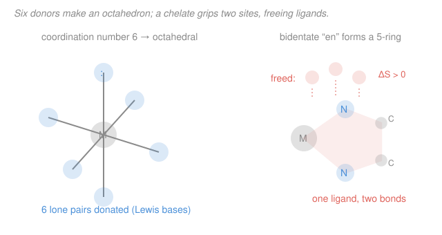

# Inorganic Chemistry · Lesson 2.1: Complexes, Ligands & Coordination Number

> ⏱ ~15 min · Module 2: Coordination Chemistry & Bonding · Builds on: [1.4 Brønsted & Lewis acids and bases](01-04-bronsted-lewis-acids-bases.md), [1.5 Hard–soft acid–base](01-05-hard-soft-acid-base.md) · Unlocks: 2.2 (nomenclature & oxidation state)

## Why this matters

The color of blood, the blue of a copper-sulfate crystal, the way plants harvest light, the drug that clears platinum-resistant tumors — all of them are transition metals wrapped in a shell of small molecules. That shell is a **coordination complex**, and the entire second half of this course is about how it forms, what shape it takes, and why it does what it does. This lesson lays the vocabulary and the one counting rule everything downstream depends on: how many things are actually bonded to the metal. Get the count right and geometry, isomerism, color, and magnetism all follow.

## The idea

Back in [1.4](01-04-bronsted-lewis-acids-bases.md) you met the Lewis picture: an **acid accepts** an electron pair, a **base donates** one. A transition-metal cation like $\ce{Co^3+}$ or $\ce{Fe^3+}$ is an electron-pair vacuum — empty $d$ orbitals, positive charge, hungry for electron density. So it is a **Lewis acid**, and a first-rate one. Anything carrying a lone pair — water, ammonia, a chloride ion — is a **Lewis base**. Let several bases each hand a lone pair into the metal's empty orbitals and you've built a complex: one central metal gripped by a ring of donors.

Those donor molecules or ions are the **ligands** (Latin *ligare*, "to bind"). The metal plus its directly attached ligands is the **coordination sphere**, written in square brackets: $\ce{[Co(NH3)6]^3+}$. Anything ionic that's just balancing charge but *not* bonded to the metal sits **outside** the brackets as a counterion — in $\ce{[Co(NH3)6]Cl3}$ the three chlorides are spectators, not ligands.

The one number that organizes everything is the **coordination number**: how many donor atoms actually touch the metal. Not how many ligands — how many *donor atoms*. Those are the same only when every ligand donates through a single atom. The moment a ligand grabs the metal with two hands (like ethylenediamine), the two counts diverge, and that difference is where the chemistry gets interesting.

## The formal version

**Complex / coordination compound.** A central metal ion (Lewis acid) bonded to a set of **ligands** (Lewis bases), each donating one or more lone pairs into the metal's empty orbitals via **coordinate covalent bonds** (both electrons come from the ligand). *In words: a metal at the center, surrounded by electron-pair donors it borrowed lone pairs from.* The whole assembly $\ce{[ML_n]}$ inside square brackets is the coordination sphere; ions outside the brackets are counterions and are not bonded to the metal.

**Donor atom.** The specific atom of a ligand that carries the lone pair actually pointing at the metal. Common donors sit toward the top-right of the periodic table: **N** (ammonia, amines), **O** (water, hydroxide, carboxylates), **S** (thiolates, sulfides), the **halides** (Cl, Br, I, F), and **C** (cyanide, carbon monoxide). Which donor a given metal prefers is exactly the hard–soft story from [1.5](01-05-hard-soft-acid-base.md): hard metals favor hard O/F/N donors, soft metals favor soft S/P/I donors.

**Denticity** — how many donor atoms one ligand uses to grip the metal:

- **Monodentate** ("one tooth"): one donor atom. $\ce{H2O}$, $\ce{NH3}$, $\ce{Cl-}$, $\ce{CN-}$, $\ce{OH-}$.
- **Bidentate**: two donor atoms from the same ligand. **Ethylenediamine** ($\ce{H2N-CH2-CH2-NH2}$, abbreviated **en**, two N donors), **oxalate** ($\ce{C2O4^2-}$, two O donors), **2,2'-bipyridine** (bipy, two N donors).
- **Polydentate / chelating**: three or more donor atoms. **EDTA** wraps a metal with six donors (2 N + 4 O) — it is **hexadentate**.

A ligand that bites with two or more teeth is a **chelate** (Greek *chelē*, "claw"); the metal–ligand rings it forms are chelate rings.

**Coordination number (CN).** The total count of donor atoms bonded to the metal:

$$\text{CN} = \sum_{\text{ligands}} (\text{denticity of that ligand}).$$

*In words: add up the teeth, not the ligands.* For all-monodentate complexes CN equals the number of ligands; for chelates it exceeds it. CN sets the geometry:

| CN | Geometry | Example |
|----|----------|---------|
| 2  | linear | $\ce{[Ag(NH3)2]+}$ |
| 4  | tetrahedral **or** square planar | $\ce{[Zn(NH3)4]^2+}$ (td); $\ce{[PtCl4]^2-}$ (sq. planar) |
| 6  | octahedral (by far the commonest) | $\ce{[Co(NH3)6]^3+}$ |

**The chelate effect.** A chelating ligand forms a **more stable** complex than the same number of comparable monodentate ligands. Compare, for a metal $\ce{M^2+}$ in water,

$$\ce{[M(H2O)6]^2+ + 6\,NH3 <=> [M(NH3)6]^2+ + 6\,H2O}$$
$$\ce{[M(H2O)6]^2+ + 3\,en <=> [M(en)3]^2+ + 6\,H2O}$$

Both swap out six water donors for six N donors of nearly identical bond strength, so the **enthalpies are almost the same**. But count particles. In the monodentate reaction, 7 species become 7 — no net change. In the chelate reaction, **4 species become 7**: three `en` plus one aqua-complex go in, one complex plus six waters come out. *In words: each chelate that binds releases several free water molecules, and freeing molecules raises the disorder of the solution.* More particles floating free means a positive $\Delta S$, and through

$$\Delta G^\circ = \Delta H^\circ - T\,\Delta S^\circ,$$

a positive $\Delta S^\circ$ makes $\Delta G^\circ$ more negative — hence a larger formation constant $K_f$ (since $\Delta G^\circ = -RT\ln K_f$). The chelate effect is, at heart, an **entropy** effect: one claw that displaces many loose ligands wins on disorder.

## Picture

## Worked examples

**Example 1 (mechanical — read off metal, ligands, donors, CN).** Take $\ce{[Cr(H2O)4Cl2]Cl}$.

- The coordination sphere is everything in brackets: $\ce{Cr}$ with four $\ce{H2O}$ and two $\ce{Cl-}$. The single $\ce{Cl-}$ *outside* the brackets is a counterion — a spectator, not a ligand.
- Ligands: 4 water (O donor, monodentate) + 2 chloride (Cl donor, monodentate) = 6 ligands.
- Donor atoms: 4 O + 2 Cl = 6. Every ligand is monodentate, so CN = number of ligands = **6** → octahedral.

**Example 2 (why you'd care — chelation locks up a metal).** EDTA is hexadentate: one EDTA molecule supplies all six donors a metal wants:

$$\ce{[Ca(H2O)6]^2+ + EDTA^4- -> [Ca(EDTA)]^2- + 6\,H2O}.$$

Here CN is still 6, but it comes from **one** ligand, not six. Two species on the left become seven on the right — a huge entropy gain — so the complex is extraordinarily stable ($K_f \sim 10^{10}$). That is exactly why EDTA is the workhorse of water-softening (it sequesters $\ce{Ca^2+}$ and $\ce{Mg^2+}$), of titrations, and of clinical chelation therapy that pulls toxic $\ce{Pb^2+}$ out of the body. One claw beats six loose hands, and entropy is the reason.

## Watch out

- **You might think coordination number counts ligands.** It counts **donor atoms**. $\ce{[Ni(en)3]^2+}$ has three ligands but CN = 6, because each `en` bites twice. Always multiply each ligand by its denticity before summing.
- **You might think everything in the formula is bonded to the metal.** Only what's inside the square brackets is. In $\ce{[Co(NH3)6]Cl3}$ the chlorides are counterions; in $\ce{[CoCl2(NH3)4]Cl}$ two chlorides are ligands and one is a counterion. The brackets are the whole boundary of the coordination sphere.
- **You might think the chelate effect is about stronger bonds.** It's mostly not — the individual M–N bonds in $\ce{[Ni(en)3]^2+}$ and $\ce{[Ni(NH3)6]^2+}$ are nearly equal in strength ($\Delta H$ barely differs). The extra stability comes from **entropy**: chelation frees more particles into solution.

## One-liner

> A complex is a metal Lewis acid ringed by lone-pair-donating ligands; coordination number counts donor *atoms* (teeth), not ligands — and biting with many teeth wins on entropy, not bond strength.

## Problems

**P1 (🟢)** For each complex, identify the metal (and its charge), the ligand(s), the donor atom(s), the denticity of each ligand, and the coordination number:
(a) $\ce{[Co(NH3)6]^3+}$  (b) $\ce{[Pt(en)2]^2+}$  (c) $\ce{[Fe(C2O4)3]^3-}$

**P2 (🟡)** Consider $\ce{[Co(en)2Cl2]+}$. Count the coordination number and name the likely geometry. How many *ligands* are bonded to the metal, and why does that differ from the coordination number?

**P3 (🔴)** Explain quantitatively why $\ce{[Ni(en)3]^2+}$ is more stable than $\ce{[Ni(NH3)6]^2+}$. Write the ligand-substitution reaction that converts one into the other, count the change in the number of free particles, and use the sign of $\Delta S^\circ$ (via $\Delta G^\circ = \Delta H^\circ - T\Delta S^\circ$ and $\Delta G^\circ = -RT\ln K_f$) to argue for the larger formation constant.

Solutions

**P1**

(a) $\ce{[Co(NH3)6]^3+}$. Metal: cobalt. Overall charge +3; the six $\ce{NH3}$ are neutral, so the metal is $\ce{Co^3+}$ (oxidation state +III). Ligands: six ammonia, each **monodentate**, donor atom **N**. Coordination number = $6 \times 1 = $ **6** (octahedral).

(b) $\ce{[Pt(en)2]^2+}$. Metal: platinum. Each `en` is neutral, overall +2, so $\ce{Pt^2+}$. Ligands: two ethylenediamine, each **bidentate**, donor atoms **N, N**. Coordination number = $2 \times 2 = $ **4**. (With $\ce{Pt^2+}$, a $d^8$ ion, the geometry is square planar — a preview of [2.6](02-06-tetrahedral-square-planar-fields.md).)

(c) $\ce{[Fe(C2O4)3]^3-}$. Metal: iron. Each oxalate is $\ce{C2O4^2-}$, so three contribute $-6$; overall charge $-3$; metal charge = $-3 - (-6) = +3$, so $\ce{Fe^3+}$. Ligands: three oxalate, each **bidentate**, donor atoms **O, O**. Coordination number = $3 \times 2 = $ **6** (octahedral).

**P2** $\ce{[Co(en)2Cl2]+}$: two `en` (bidentate, 2 donor atoms each) contribute $2 \times 2 = 4$ donor atoms; two chloride (monodentate) contribute $2 \times 1 = 2$. Coordination number = $4 + 2 = $ **6** → **octahedral**. There are **4 ligands** (two `en` + two $\ce{Cl-}$) but CN = 6, because coordination number counts donor **atoms**, and each `en` supplies two. (Charge check, for practice: two neutral `en` + two $\ce{Cl-}$ give $-2$; overall $+1$; so $\ce{Co^3+}$.)

**P3** The two complexes carry the same donor set (six metal–N bonds) and the same metal, so per-bond enthalpies are nearly equal — $\Delta H^\circ \approx 0$ for the interconversion. Write the substitution:

$$\ce{[Ni(NH3)6]^2+ + 3\,en -> [Ni(en)3]^2+ + 6\,NH3}.$$

Count free particles. **Left:** 1 complex + 3 `en` = 4 species. **Right:** 1 complex + 6 $\ce{NH3}$ = 7 species. Net change $\Delta n = 7 - 4 = +3$ particles released into solution. Freeing three extra independent particles increases disorder, so $\Delta S^\circ > 0$. Then

$$\Delta G^\circ = \underbrace{\Delta H^\circ}_{\approx\,0} - T\,\underbrace{\Delta S^\circ}_{>\,0} < 0,$$

so the reaction runs toward $\ce{[Ni(en)3]^2+}$. Since $\Delta G^\circ = -RT\ln K_f$, a more negative $\Delta G^\circ$ means a larger $\ln K_f$, i.e. a larger formation constant — experimentally $\log K_f \approx 18.3$ for $\ce{[Ni(en)3]^2+}$ versus $\approx 8.6$ for $\ce{[Ni(NH3)6]^2+}$, a factor of nearly $10^{10}$ in stability, driven almost entirely by the $+\Delta S^\circ$ of releasing particles. That is the chelate effect quantitatively: same bonds, more disorder, more stable.

## Flashback

**From Lesson 1.5 (Hard–soft acid–base):** You need to pull soft, toxic $\ce{Hg^2+}$ out of a solution that also contains hard $\ce{Ca^2+}$. Two collecting ligands are on the shelf: one that donates through **sulfur** (a thiolate) and one that donates through **oxygen** (a carboxylate). Which donor atom will bind $\ce{Hg^2+}$ more strongly, and why? (Fresh variant — a selectivity question, not a definition.)

Solution

$\ce{Hg^2+}$ is a large, highly polarizable, **soft** Lewis acid. The HSAB principle from [1.5](01-05-hard-soft-acid-base.md) says *soft prefers soft*: soft acids form their strongest, most covalent bonds with soft, polarizable donors. **Sulfur** is a soft donor; **oxygen** is a hard donor. So the **thiolate (S donor)** binds $\ce{Hg^2+}$ far more strongly than the carboxylate would — and, conveniently, the hard $\ce{Ca^2+}$ would rather stay with hard O/water donors, so the sulfur ligand grabs the mercury selectively and leaves the calcium behind. (This is exactly why thiol-based chelators like dimercaprol are the clinical antidote for heavy-metal poisoning.)

## Connections

- **Backward:** the metal-as-Lewis-acid, ligand-as-Lewis-base bond is the coordinate covalent bond from [1.4](01-04-bronsted-lewis-acids-bases.md); *which* donor a metal prefers is the hard–soft matching rule from [1.5](01-05-hard-soft-acid-base.md). The empty $d$ orbitals doing the accepting are the electron configurations from general chemistry ([1.2](../../general-chemistry/lessons/01-02-electron-configurations-periodic-table.md)).
- **Forward:** [2.2](02-02-nomenclature-oxidation-state.md) turns these formulas into systematic names and reads off oxidation states; [2.3](02-03-isomerism-complexes.md) shows that once CN and geometry are fixed, the *same* formula can arrange in different ways (cis/trans, optical). The octahedral CN-6 geometry set here is the stage on which crystal-field splitting ([2.4](02-04-crystal-field-octahedral-splitting.md)) plays out.
- **Sideways (thermodynamics):** the chelate effect is the entropy term $\Delta S^\circ$ in $\Delta G^\circ = \Delta H^\circ - T\Delta S^\circ$ deciding a reaction the enthalpy alone would call a tie — the same $\Delta G$/$K$ bookkeeping you use for any equilibrium (see physical chemistry's [syllabus](../../physical-chemistry/syllabus.md)).
