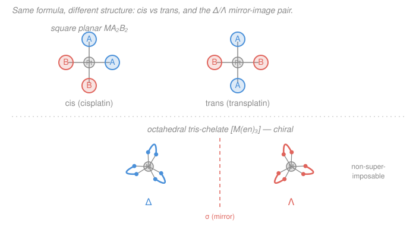

# Inorganic Chemistry · Lesson 2.3: Isomerism in Complexes

> ⏱ ~15 min · Module 2: Coordination Chemistry & Bonding · Builds on: [2.1 Complexes, ligands, coordination number](02-01-complexes-ligands-coordination-number.md), [2.2 Nomenclature and oxidation state](02-02-nomenclature-oxidation-state.md) · Unlocks: [2.4 Crystal field: octahedral splitting](02-04-crystal-field-octahedral-splitting.md)

## Why this matters

Write down a complex's formula — say $\ce{[Pt(NH3)2Cl2]}$ — and you have *not* pinned down a single substance. Two compounds share that formula: one, **cisplatin**, is a front-line anticancer drug that has treated millions; the other, transplatin, is therapeutically useless. Same atoms, same bonds, different geometry — and the difference is life or death. Isomerism is where coordination chemistry stops being bookkeeping and starts having consequences: color, reactivity, magnetism, and biological function all depend on which arrangement you got, not just which atoms. It is also the natural warm-up for [2.4](02-04-crystal-field-octahedral-splitting.md), where *geometry* becomes the thing that splits the d-orbitals.

## The idea

**Isomers are different compounds with the same molecular formula.** For complexes they come in two big families, and the split is about *what* differs.

- **Structural (constitutional) isomers** differ in **connectivity** — literally which atoms are bonded to what. Swap which end of a ligand grabs the metal, or move a counter-ion in or out of the coordination sphere, and you've changed the bonding skeleton.
- **Stereoisomers** have the *same* connectivity — same atoms bonded to the same neighbors — but differ in the **spatial arrangement**. Same skeleton, folded through space differently.

An analogy: structural isomers are two houses with the plumbing routed to different rooms; stereoisomers are two houses with *identical* floor plans, one built as the mirror image of the other. The second distinction is subtler and it is where chirality lives.

Within stereoisomers, two flavors matter. **Cis/trans (and fac/mer)** ask *which ligands sit next to each other*. **Optical isomers** ask *whether the molecule is the same as its mirror image* — if not, you have a left-handed and a right-handed version that are genuinely different substances.

## The formal version

### Structural isomers (differ in connectivity)

**Linkage isomers.** An **ambidentate ligand** has two different donor atoms and can bind through either. *In words: same ligand, different atom does the bonding.* The classics:

- nitro $\ce{-NO2}$ (binds through **N**) vs nitrito $\ce{-ONO}$ (binds through **O**): $\ce{[Co(NH3)5(NO2)]^2+}$ (yellow) vs $\ce{[Co(NH3)5(ONO)]^2+}$ (red).
- thiocyanato bound through **S** ($\ce{M-SCN}$) vs through **N** ($\ce{M-NCS}$). (Which one wins is a hard/soft acid–base call — see [1.5](01-05-hard-soft-acid-base.md): soft metals prefer soft S, hard metals prefer N.)

**Ionization isomers.** Swap an anion between *inside* the coordination sphere (bonded to the metal) and *outside* (a free counter-ion). *In words: whichever ion is inside is the ligand; the leftover floats as a counter-ion.*

$$\ce{[Co(NH3)5Br]SO4} \qquad\text{vs}\qquad \ce{[Co(NH3)5SO4]Br}.$$

The first frees $\ce{SO4^2-}$ in solution (and $\ce{Br-}$ is the ligand); the second frees $\ce{Br-}$. A dissolved-and-test distinguishes them: add $\ce{BaCl2}$ and only the first precipitates $\ce{BaSO4}$.

**Hydrate (solvate) isomers** are the special case where the swapped species is water — inside as a ligand vs outside as water of crystallization: $\ce{[Cr(H2O)6]Cl3}$ (violet), $\ce{[Cr(H2O)5Cl]Cl2.H2O}$, $\ce{[Cr(H2O)4Cl2]Cl.2H2O}$ (green). **Coordination isomers** apply when *both* ions are complexes and the ligands are distributed differently between them, e.g. $\ce{[Co(NH3)6][Cr(CN)6]}$ vs $\ce{[Cr(NH3)6][Co(CN)6]}$.

### Stereoisomers (same connectivity, different geometry)

**Cis/trans (geometric) isomerism** appears when identical ligands can sit either adjacent ($90^\circ$, *cis*) or opposite ($180^\circ$, *trans*).

- **Square planar $\ce{MA2B2}$:** the two A's are either cis or trans. $\ce{[Pt(NH3)2Cl2]}$ is the headline — cisplatin (cis) vs transplatin (trans).
- **Octahedral $\ce{MA4B2}$:** the two B's are cis ($90^\circ$) or trans ($180^\circ$).

**Fac/mer isomerism** is the octahedral $\ce{MA3B3}$ case. *In words: the three identical ligands either cap one triangular **fac**e, or wrap around the **mer**idian.*

- **fac** (facial): the three A's occupy one face — all mutually cis ($90^\circ$ apart).
- **mer** (meridional): the three A's lie in a plane through the metal — two trans, one cis.

**Optical isomerism (chirality).** A molecule is **chiral** if it is *not superimposable on its mirror image*. The two mirror-image forms are **enantiomers**. The operational test is symmetry:

$$\boxed{\text{chiral} \iff \text{no improper axis } S_n \ (\text{in particular no mirror plane } \sigma \text{ and no center } i).}$$

*In words: if you can find any mirror plane or inversion center that maps the molecule onto itself, it is achiral; if there is none, the molecule and its mirror image are two different substances.* The showcase is the **octahedral tris-chelate** $\ce{[Co(en)3]^3+}$ (en $=$ ethylenediamine, a bidentate ligand from [2.1](02-01-complexes-ligands-coordination-number.md)): the three chelate rings wind like a three-bladed propeller, and a propeller has a handedness. The two enantiomers are labeled **Δ** (right-handed twist) and **Λ** (left-handed). They are identical in every scalar property (melting point, color, $\Delta_o$) but rotate plane-polarized light in opposite directions.

### Enumerating isomers systematically

For a given formula, work outward: (1) fix the geometry (from coordination number, [2.1](02-01-complexes-ligands-coordination-number.md)); (2) place the ligand sets and list the geometrically distinct arrangements (cis/trans, fac/mer); (3) for *each* arrangement, draw its mirror image and check superimposability — if it can't be superimposed, that arrangement splits into a Δ/Λ pair. Chelating ligands, because they must bridge two *cis* sites, are what most often force a chiral twist.

## Picture

Top row: in **cis**, the two blue A ligands are $90^\circ$ apart (adjacent); in **trans**, they are $180^\circ$ apart (across the metal). Bottom row: the **Δ** and **Λ** tris-chelates are mirror images across the dashed plane — twist one to match the other and it never lines up, the signature of chirality.

## Worked examples

**Example 1 (cis/trans, and why it's biological).** $\ce{[Pt(NH3)2Cl2]}$ is square planar ($\ce{Pt^2+}$, $d^8$). Place two $\ce{NH3}$ and two $\ce{Cl}$ on the four corners. Either the chlorides are adjacent (**cis**) or opposite (**trans**) — two isomers. Only **cisplatin** works as a drug: its two $\ce{Cl}$ ligands are cis, the right distance apart to leave together and let the Pt bridge two adjacent guanine bases on one DNA strand, kinking it and blocking replication. Transplatin's chlorides point $180^\circ$ apart — wrong geometry, no useful crosslink. Same formula, same bonds; the $90^\circ$-vs-$180^\circ$ placement is the entire pharmacology.

**Example 2 (enumerate $\ce{[Co(NH3)3Cl3]}$).** Octahedral $\ce{MA3B3}$. The three $\ce{Cl}$ either cap a face (**fac** — all three mutually cis) or lie on a meridian (**mer** — two trans, one cis). That's two geometric isomers. Now the chirality check: both fac and mer possess a mirror plane (fac has a $C_{3v}$ mirror through each Co–Cl bond; mer has a plane containing the mer set), so **neither is chiral**. Total: **2 isomers, fac and mer, both achiral.** Contrast $\ce{[Co(en)3]^3+}$, where the chelate rings remove every mirror plane and you get the Δ/Λ pair instead.

## Watch out

- **You might think cis/trans requires a "double bond" like in organic chemistry.** In complexes it doesn't — the rigid $90^\circ$/$180^\circ$ geometry of the coordination polyhedron is what locks positions in place. No rotation to worry about; the metal just holds the ligands at fixed angles.
- **You might think tetrahedral $\ce{MA2B2}$ has cis/trans isomers.** It doesn't — in a tetrahedron *all four positions are equivalent* (every pair is $109.5^\circ$ apart), so there's no "adjacent vs opposite." Cis/trans needs square-planar or octahedral geometry. (A tetrahedron with *four different* ligands, $\ce{MABCD}$, is chiral, though — like an asymmetric carbon.)
- **You might equate "has no mirror plane by eye" with achiral, or assume any complex with a chelate is chiral.** Use the real test: superimposability on the mirror image ($\iff$ no $S_n$). $\ce{[Co(en)3]^3+}$ is chiral; *trans*-$\ce{[Co(en)2Cl2]^+}$ is **not**, because a mirror plane survives — a single chelate isn't enough, you need the twist that destroys every plane.

## One-liner

> Structural isomers differ in *what's bonded to what*; stereoisomers differ in *where things sit* — cis/trans and fac/mer set adjacency, and a complex is chiral exactly when it has no mirror image it can superimpose on (the tris-chelate Δ/Λ propeller).

## Problems

**P1 (🟢)** Draw and label the two geometric isomers of octahedral $\ce{[Co(NH3)4Cl2]^+}$ (an $\ce{MA4B2}$ complex). State which is cis and which is trans, and give the Cl–Co–Cl angle in each.

**P2 (🟡)** Enumerate all stereoisomers of octahedral $\ce{[Cr(NH3)3(NO2)3]}$. Name the type of isomerism, and state whether any isomer is chiral. (Bonus: name one *structural* isomer this formula could also have, using the ambidentate $\ce{NO2}$.)

**P3 (🔴)** Of the three complexes below, identify which are optically active (chiral). Justify each with a symmetry argument.
(a) $\ce{[Co(en)3]^3+}$  (b) *cis*-$\ce{[Co(en)2Cl2]^+}$  (c) *trans*-$\ce{[Co(en)2Cl2]^+}$

Solutions

**P1** Octahedral, four $\ce{NH3}$ + two $\ce{Cl}$. The two chlorides are placed either adjacent or opposite:

- **cis-$\ce{[Co(NH3)4Cl2]^+}$**: the two $\ce{Cl}$ are on adjacent vertices, **Cl–Co–Cl $= 90^\circ$**. (Draw an octahedron with both Cl on the same edge, e.g. top and one equatorial site; the other four sites are $\ce{NH3}$.)
- **trans-$\ce{[Co(NH3)4Cl2]^+}$**: the two $\ce{Cl}$ are on opposite vertices, **Cl–Co–Cl $= 180^\circ$** (top and bottom axial); the four equatorial sites are $\ce{NH3}$.

Two isomers total. (Neither is chiral: the trans has a mirror plane through the four $\ce{NH3}$; the cis has a plane bisecting the Cl–Co–Cl angle.)

**P2** Octahedral $\ce{MA3B3}$ with $\ce{A}=\ce{NH3}$, $\ce{B}=\ce{NO2}$ (N-bound). This is **fac/mer (geometric) isomerism**:

- **fac**: the three $\ce{NO2}$ cap one face, all mutually $90^\circ$ (cis).
- **mer**: the three $\ce{NO2}$ lie on a meridian — two trans ($180^\circ$), one cis.

**Two stereoisomers, fac and mer; neither is chiral** — each retains a mirror plane (fac is $C_{3v}$; mer has a plane containing all three $\ce{NO2}$ and the metal), so each is superimposable on its mirror image.

*Bonus (structural):* since $\ce{NO2}$ is ambidentate, binding through O instead of N gives **linkage isomers** — e.g. the nitrito form $\ce{[Cr(NH3)3(ONO)3]}$ has the same formula but different connectivity.

**P3** The test is *no improper axis* $\iff$ chiral; in practice, look for a mirror plane $\sigma$.

- **(a) $\ce{[Co(en)3]^3+}$ — chiral.** Three bidentate en rings each span a pair of cis sites, winding into a three-bladed propeller ($D_3$ symmetry, which has *no* $\sigma$ and no $S_n$). Its mirror image cannot be superimposed → **Δ and Λ enantiomers**. Optically active.
- **(b) cis-$\ce{[Co(en)2Cl2]^+}$ — chiral.** With the two $\ce{Cl}$ cis, the two en rings are forced into a twisted, propeller-like arrangement ($C_2$ only, no mirror plane). Mirror image is non-superimposable → a Δ/Λ pair. Optically active.
- **(c) trans-$\ce{[Co(en)2Cl2]^+}$ — achiral.** With the two $\ce{Cl}$ trans (axial), the two en rings lie in the equatorial plane and a **mirror plane** (the equatorial plane itself, plus one containing the Cl–Co–Cl axis) maps the molecule onto itself. Superimposable on its mirror image → **not** optically active.

So (a) and (b) are chiral; (c) is not. The lesson: a chelate helps *break* symmetry, but only when the geometry (cis placement) forces the twist — trans placement lets a mirror plane survive.

## Flashback

**From Lesson 2.2 (Nomenclature and oxidation state):** For the complex $\ce{[Cr(H2O)4Cl2]Cl}$, determine (a) the oxidation state of chromium and (b) the coordination number of the metal. (Fresh variant — a mixed-ligand, mixed-inside/outside case.)

Solution

**(a) Oxidation state.** Only ligands *inside* the coordination sphere count toward the charge balance; the outer $\ce{Cl-}$ is a counter-ion. Inside: four neutral $\ce{H2O}$ (charge $0$ each) and two $\ce{Cl-}$ (charge $-1$ each), so the ligands contribute $4(0) + 2(-1) = -2$. The whole complex ion $\ce{[Cr(H2O)4Cl2]^+}$ must carry $+1$ to balance the single outer $\ce{Cl-}$. Therefore

$$x + (-2) = +1 \;\Longrightarrow\; x = +3, \qquad \text{Cr is } \mathrm{Cr(III)}.$$

**(b) Coordination number.** Count donor atoms *bonded to Cr*: four $\ce{H2O}$ (one donor each) $+$ two $\ce{Cl}$ (one each) $= \mathbf{6}$. The outer $\ce{Cl-}$ does not bond to the metal, so it does not count. Coordination number $= 6$ (octahedral).

*Check:* $\mathrm{Cr(III)}$ is $d^3$ and almost universally six-coordinate octahedral — consistent. And note this very formula is one of the **hydrate isomers** of $\ce{[Cr(H2O)6]Cl3}$ from this lesson.

## Connections

- **Backward:** isomer counting rests on geometry from [2.1](02-01-complexes-ligands-coordination-number.md) (coordination number → shape; bidentate ligands like en must span cis sites) and on the charge/inside–outside distinction from [2.2](02-02-nomenclature-oxidation-state.md) (which drives ionization and hydrate isomers). Linkage-isomer preference (S vs N, N vs O) is an application of hard–soft acid–base matching from [1.5](01-05-hard-soft-acid-base.md).
- **Forward:** [2.4](02-04-crystal-field-octahedral-splitting.md) shows *why geometry matters energetically* — the ligand arrangement sets how the d-orbitals split ($t_{2g}/e_g$), so cis and trans isomers can have different colors and reactivities. The symmetry test used here (mirror planes, $S_n$) is the seed of point groups in [3.1](03-01-symmetry-elements-operations.md)–[3.2](03-02-assigning-point-groups.md).
- **Sideways:** Δ/Λ chirality is the same non-superimposable-mirror-image idea as a stereocenter in organic chemistry — see the [organic-chemistry syllabus](../../organic-chemistry/syllabus.md) — and enantiomers' opposite biological activity (cisplatin vs transplatin, and chiral-drug handedness generally) is why pharma cares which one you make.
