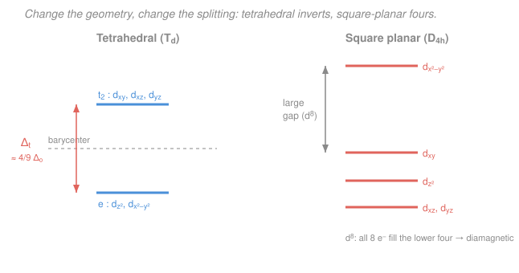

# Inorganic Chemistry · Lesson 2.6: Tetrahedral & Square-Planar Fields

> ⏱ ~15 min · Module 2: Coordination Chemistry & Bonding · Builds on: [2.4 Crystal-field octahedral splitting](02-04-crystal-field-octahedral-splitting.md), [2.5 High-spin, low-spin & the spectrochemical series](02-05-high-spin-low-spin-spectrochemical-series.md) · Unlocks: [3.1 Symmetry elements & operations](03-01-symmetry-elements-operations.md)

## Why this matters

Not every complex is an octahedron. Four-coordinate complexes are everywhere — and they come in two flavors that behave nothing alike. Tetrahedral complexes are almost always high-spin and weakly colored; square-planar complexes are the geometry of the anticancer drug **cisplatin** and of nearly every $d^8$ metal used in industrial catalysis. Same crystal-field logic as the octahedron from [2.4](02-04-crystal-field-octahedral-splitting.md), but the *geometry of where the ligands sit* rearranges the $d$-orbital ladder — and once you can redraw that ladder for a new shape, you can predict spin, color, and magnetism for the whole four-coordinate world. This lesson closes Module 2 by making the crystal-field picture geometry-portable.

## The idea

The octahedral story had one moving part: the two $d$ orbitals that **point straight at the ligands** ($d_{z^2}, d_{x^2-y^2}$) got shoved up, and the three that point *between* the ligands ($d_{xy}, d_{xz}, d_{yz}$) stayed low. Repulsion is worst when an orbital aims right at a lone pair. That single rule — *aim at a ligand, pay an energy penalty* — is all you need. Move the ligands, re-ask "which orbitals now aim at them?", and the ladder redraws itself.

**Tetrahedral:** put four ligands at alternating corners of a cube. None of the $d$ orbitals point *exactly* at a ligand, but now it's the *between-axis* orbitals ($d_{xy}, d_{xz}, d_{yz}$) that come closest to the cube corners, while the on-axis orbitals ($d_{z^2}, d_{x^2-y^2}$) point at the *centers of the cube faces* — farther away. So the splitting **flips**: the on-axis set is now *lower*. And because only four ligands push (versus six) and none of them aim cleanly, the gap is **much smaller** — about $\tfrac49$ of the octahedral gap. A small gap means electrons would rather spread out than pair up, so **tetrahedral complexes are essentially always high-spin.**

**Square planar:** start from an octahedron and pull the two ligands on the $z$-axis away to infinity. Every orbital with a $z$-component suddenly feels far less repulsion and drops; the $d_{x^2-y^2}$ orbital, pointing straight at the four ligands *still* in the $xy$-plane, is left stranded at the top with a huge gap below it. That giant gap is a gift to a $d^8$ metal: eight electrons fill the lower four orbitals two-by-two and leave the costly top orbital empty — no unpaired spins, big stabilization. That's why $d^8$ ions with strong-field ligands (Pt$^{2+}$, Pd$^{2+}$, Ni$^{2+}$, Au$^{3+}$) love this shape.

## The formal version

**Tetrahedral field.** Four ligands at alternate cube corners split the five $d$ orbitals into a **lower $e$ set** ($d_{z^2}, d_{x^2-y^2}$) and an **upper $t_2$ set** ($d_{xy}, d_{xz}, d_{yz}$). *In words: the labels and the ordering are the exact inverse of octahedral* — the between-axis orbitals are now the high-energy ones. (No "$g$" subscript: a tetrahedron has no center of inversion, so the gerade/ungerade label doesn't apply — a first taste of the symmetry bookkeeping in [3.1](03-01-symmetry-elements-operations.md).) The gap is

$$\Delta_t \approx \tfrac49\,\Delta_o,$$

where $\Delta_o$ is the octahedral splitting for the *same* metal and ligands. *In words: a tetrahedral field is less than half as strong as an octahedral one* — fewer ligands (4 vs 6) and none pointing cleanly at an orbital. Because $\Delta_t$ is so small it is **almost always** smaller than the pairing energy $P$ (defined in [2.5](02-05-high-spin-low-spin-spectrochemical-series.md)):

$$\Delta_t < P \;\Longrightarrow\; \text{high-spin, essentially always.}$$

Low-spin tetrahedral complexes are so rare they're a curiosity, not a case you plan for.

**Square-planar field.** Removing the two axial ($\pm z$) ligands from an octahedron splits the $d$ orbitals into **four** levels. From top to bottom:

$$\underbrace{d_{x^2-y^2}}_{\text{highest}} \;\gg\; d_{xy} \;>\; d_{z^2} \;>\; \underbrace{d_{xz},\,d_{yz}}_{\text{lowest}}.$$

*In words: $d_{x^2-y^2}$ points straight at the four in-plane ligands and is pushed far up; $d_{xy}$ lies in the plane but between the ligands, so it's next; $d_{z^2}$ has only its small doughnut in the plane, lower still; the two orbitals living in the vertical planes ($d_{xz}, d_{yz}$) feel the ligands least and sit at the bottom.* The defining feature is the **large $d_{x^2-y^2}$–$d_{xy}$ gap**. A $d^8$ configuration places all eight electrons in the lower four orbitals — fully paired, **diamagnetic**, with a large crystal-field stabilization energy (CFSE). This is why square-planar geometry is the ground state for $d^8$ with strong-field ligands: **Pt$^{2+}$, Pd$^{2+}$, Au$^{3+}$**, and Ni$^{2+}$ with strong ligands like CN$^-$. **Cisplatin, $\ce{[Pt(NH3)2Cl2]}$, is square-planar** — the *cis* isomer distinction from [2.3](02-03-isomerism-complexes.md) only matters because the geometry is planar, not tetrahedral.

**Jahn–Teller distortion.** A separate but related idea: *any nonlinear molecule in an orbitally degenerate electronic state distorts to remove the degeneracy and lower its energy.* The case you'll actually meet: an octahedral ion whose **$e_g$ set is unequally occupied** — high-spin $d^4$ ($t_{2g}^3 e_g^1$) or $d^9$ ($t_{2g}^6 e_g^3$, e.g. $\ce{Cu^2+}$). The two $e_g$ orbitals ($d_{z^2}$ and $d_{x^2-y^2}$) point at ligands; if electrons occupy them unequally, the complex **elongates along $z$** (the two axial ligands move out). *In words: pulling the axial ligands away lowers the energy of any orbital with $z$-character* — $d_{z^2}$ drops, $d_{x^2-y^2}$ rises — so the electrons in the now-lower orbital win more than the ones in the raised orbital lose. This tetragonal elongation is why octahedral $\ce{Cu^2+}$ complexes are never perfectly symmetric, and it's the same distortion that, taken to the limit, *becomes* the square-planar splitting above.

## Picture

## Worked examples

**Example 1 (mechanical — a tetrahedral $d^6$).** Take $\ce{[FeCl4]^2-}$ (Fe$^{2+}$, $d^6$). Fill the tetrahedral ladder high-spin (lower $e$ holds 2, upper $t_2$ holds 3): put one electron in each of the five orbitals (Hund), then the sixth pairs in the lowest available — the $e$ set. Configuration $e^3\,t_2^3$: the $e$ orbitals hold 3 electrons (one pair + one single), the $t_2$ orbitals hold 3 (all single). Unpaired count: one single in $e$ + three singles in $t_2$ = **4 unpaired electrons**. Spin-only moment $\mu = \sqrt{n(n+2)} = \sqrt{4\cdot 6} = \sqrt{24} \approx 4.9\ \mu_B$. We never even asked whether it was low-spin — for tetrahedral you don't have to.

**Example 2 (why you'd care — why $\ce{[Ni(CN)4]^2-}$ is flat and $\ce{[NiCl4]^2-}$ is not).** Both are Ni$^{2+}$, $d^8$. With the **strong-field** ligand CN$^-$ (high in the spectrochemical series, [2.5](02-05-high-spin-low-spin-spectrochemical-series.md)), the square-planar gap is large: all 8 electrons pack into the lower four orbitals, leaving $d_{x^2-y^2}$ empty — **square-planar, diamagnetic**, large CFSE pays for the geometry. With the **weak-field** ligand Cl$^-$, that gap is too small to be worth the trouble; the complex stays **tetrahedral**, high-spin, with 2 unpaired electrons ($\mu \approx 2.8\ \mu_B$) and is paramagnetic. Same metal, same $d^8$ count — the *ligand's field strength* decides the geometry. This is the crystal-field payoff: geometry is not just handed to you by sterics, it's chosen to minimize $d$-electron energy.

## Watch out

- **You might think tetrahedral just uses the octahedral diagram upside down with the same gap.** The ordering inverts *and* the gap shrinks to $\approx \tfrac49\Delta_o$. Forgetting the shrink is what makes people wrongly predict low-spin tetrahedral complexes — they essentially don't exist.
- **You might expect every $d^8$ complex to be square-planar.** Only with a large gap — i.e. strong-field ligands or heavy metals (Pd, Pt, Au, where $\Delta$ is intrinsically large). Weak-field $d^8$ like $\ce{[NiCl4]^2-}$ stays tetrahedral. Field strength, not electron count alone, is the deciding vote.
- **You might think Jahn–Teller needs a special orbital state to look up in a table.** The trigger is mechanical: a *degenerate, unequally occupied* set. High-spin $d^4$ and $d^9$ (the classic $\ce{Cu^2+}$) distort strongly because the culprit is the ligand-pointing $e_g$ set; unequal occupancy of the inner $t_{2g}$ set (e.g. $d^1$) distorts only weakly and is usually ignored.

## One-liner

> Aim an orbital at a ligand and it costs energy — so tetrahedral inverts and shrinks the split (always high-spin), square-planar strands $d_{x^2-y^2}$ up high (a $d^8$ diamagnet's paradise), and an unevenly filled degenerate set just distorts its way out.

## Problems

**P1 (🟢)** Draw the tetrahedral $d$-orbital splitting for a $d^5$ ion (e.g. $\ce{[MnCl4]^2-}$, Mn$^{2+}$). Fill it high-spin, give the $e$/$t_2$ configuration, and count the unpaired electrons. In one sentence, say why you didn't need to consider a low-spin option.

**P2 (🟡)** $\ce{[PtCl4]^2-}$ is square-planar. Identify the $d$-electron count of Pt$^{2+}$, explain in terms of the four-level splitting why this $d^8$ ion adopts square-planar geometry rather than tetrahedral, and predict whether it is diamagnetic or paramagnetic.

**P3 (🔴)** $\ce{[Cu(H2O)6]^2+}$ is an octahedral Cu$^{2+}$ complex. Give the $d$-electron count and $t_{2g}/e_g$ occupation, state whether it is Jahn–Teller active and why, and predict the direction of the distortion and which two $d$ orbitals move up vs. down in energy.

Solutions

**P1** Mn$^{2+}$ is [Ar]$3d^5$ (Mn is $[\text{Ar}]4s^2 3d^5$; remove the two $4s$ electrons to make Mn$^{2+}$), so $d^5$. Tetrahedral ladder: lower $e$ (2 orbitals), upper $t_2$ (3 orbitals). High-spin filling puts one electron in each of the five orbitals before any pairing (Hund's rule): $e^2\,t_2^3$, i.e. both $e$ orbitals singly occupied and all three $t_2$ orbitals singly occupied. **Unpaired electrons: 5** ($\mu = \sqrt{5\cdot 7} = \sqrt{35} \approx 5.9\ \mu_B$). You didn't need to weigh a low-spin option because $\Delta_t \approx \tfrac49\Delta_o$ is essentially always smaller than the pairing energy $P$ — tetrahedral complexes are high-spin by default. (Bonus: $d^5$ high-spin has zero CFSE, one reason tetrahedral $d^5$ is common and pale.)

**P2** Pt is in group 10; Pt$^{2+}$ has lost two electrons from the neutral atom, leaving a $5d^8$ configuration — **$d^8$**. In the square-planar ladder the top orbital $d_{x^2-y^2}$ sits far above the other four, separated by a large gap. A $d^8$ ion places all eight electrons in the lower four orbitals ($d_{xz}, d_{yz}, d_{z^2}, d_{xy}$), two per orbital, leaving the expensive $d_{x^2-y^2}$ empty. This gives a large CFSE that a tetrahedral arrangement (small gap, electrons forced high, high-spin) cannot match — especially for a $5d$ metal like Pt where $\Delta$ is intrinsically large. All electrons paired $\Rightarrow$ **diamagnetic** ($n = 0$, $\mu = 0$).

**P3** Cu$^{2+}$: Cu is $[\text{Ar}]3d^{10}4s^1$; Cu$^{2+}$ removes the $4s$ electron and one $3d$, giving $[\text{Ar}]3d^9$ — **$d^9$**. Octahedral occupation is $t_{2g}^6\,e_g^3$: the $t_{2g}$ set is full and symmetric, but the $e_g$ set holds 3 electrons in 2 orbitals — **unequally occupied and degenerate**, so the ion is **Jahn–Teller active**. To break the degeneracy it distorts by **tetragonal elongation** (the two axial, $\pm z$, ligands move outward). Elongation lowers every orbital with $z$-character and raises those confined to the $xy$-plane: **$d_{z^2}$ moves down, $d_{x^2-y^2}$ moves up** (and among $t_{2g}$, $d_{xz}, d_{yz}$ drop while $d_{xy}$ rises slightly). Placing the doubly-occupied orbital ($d_{z^2}$) below the singly-occupied one ($d_{x^2-y^2}$) nets an energy gain — the reason $\ce{Cu^2+}$ octahedral complexes are always tetragonally distorted.

## Flashback

**From Lesson 2.5 (High-spin, low-spin & the spectrochemical series):** $\ce{[Fe(H2O)6]^2+}$ and $\ce{[Fe(CN)6]^4-}$ are both octahedral Fe$^{2+}$ ($d^6$). Using the spectrochemical series, decide which is high-spin and which is low-spin, give each $t_{2g}/e_g$ configuration, and count the unpaired electrons in each. (Fresh variant — different ligands than the worked case.)

Solution

Fe$^{2+}$ is $d^6$. H$_2$O is a **weak-field** ligand and CN$^-$ is a **strong-field** ligand, so $\Delta_o(\text{CN}^-) > \Delta_o(\text{H}_2\text{O})$.

- $\ce{[Fe(H2O)6]^2+}$: small $\Delta_o < P$, so **high-spin**. Fill all five orbitals singly, then pair one: $t_{2g}^4\,e_g^2$. Unpaired = the four $t_{2g}$ electrons occupy 3 orbitals (one pair + two singles = 2 unpaired) plus 2 singles in $e_g$ → **4 unpaired electrons** ($\mu = \sqrt{4\cdot6} = \sqrt{24} \approx 4.9\ \mu_B$).
- $\ce{[Fe(CN)6]^4-}$: large $\Delta_o > P$, so **low-spin**. All six electrons pack into $t_{2g}$: $t_{2g}^6\,e_g^0$. Every electron paired → **0 unpaired electrons**, diamagnetic ($\mu = 0$).

*Check.* Same metal and oxidation state, opposite magnetism — exactly the spectrochemical-series lesson: the ligand's field strength, set against the pairing energy, decides spin. This is the octahedral analogue of the geometry choice in this lesson's Example 2.

## Connections

- **Backward:** this reuses the "orbitals that point at ligands go up" rule from [2.4](02-04-crystal-field-octahedral-splitting.md) and the $\Delta$-vs-$P$ spin decision and spectrochemical series from [2.5](02-05-high-spin-low-spin-spectrochemical-series.md) — the same machinery, applied to new ligand geometries. The square-planar reasoning also gives teeth to the *cis/trans* isomerism of planar complexes from [2.3](02-03-isomerism-complexes.md), including cisplatin.
- **Forward:** the missing "$g$" on the tetrahedral $e/t_2$ labels is your first symmetry cue — [3.1 Symmetry elements & operations](03-01-symmetry-elements-operations.md) and [3.2](03-02-assigning-point-groups.md) formalize why $T_d$, $O_h$, and $D_{4h}$ carry different orbital labels, and [3.3](03-03-electronic-spectra-dd-transitions.md) turns these gaps into the colors you actually see. Square-planar $d^8$ metals reappear as the workhorses of catalysis in [4.2](04-02-homogeneous-catalysis-cycle.md).
- **Sideways:** the spin-only moment $\mu = \sqrt{n(n+2)}$ counting unpaired electrons ties directly to the magnetism measurements of [3.4](03-04-magnetism-of-complexes.md); Jahn–Teller distortion is a chemical instance of the same "a degenerate state lowers its energy by breaking symmetry" idea that underlies structural distortions and Peierls transitions in [condensed matter](../../condensed-matter/syllabus.md).
