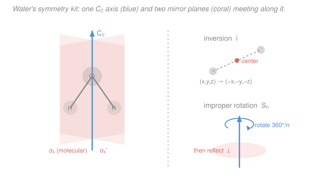

# Inorganic Chemistry · Lesson 3.1: Symmetry Elements & Operations

> ⏱ ~15 min · Module 3: Symmetry, Electronic Spectra & Magnetism · Builds on: [2.3 Isomerism in complexes](02-03-isomerism-complexes.md), [2.1 Complexes, ligands & coordination number](02-01-complexes-ligands-coordination-number.md) · Unlocks: 3.2 (assigning point groups)

## Why this matters

Symmetry is the compression algorithm of inorganic chemistry. Once you can name a molecule's symmetry precisely, a torrent of otherwise-hard questions answers itself almost for free: Is this complex chiral? Which d–d transitions are allowed and which are dark? Which vibrations show up in the IR versus the Raman? Are these two orbitals even allowed to mix? All of that flows from one skill you build here — *cataloguing the ways a molecule can be moved and land on top of itself*. This lesson is the alphabet; [3.2](03-02-assigning-point-groups.md) turns the letters into words (point groups), and Modules 3–4 read whole sentences (spectra, magnetism, bonding). We start with the payoff you already met: the rigorous test for chirality from [2.3](02-03-isomerism-complexes.md).

## The idea

Pick up a water molecule and rotate it 180° about the vertical axis that bisects the H–O–H angle. The two hydrogens swap places — but since they're identical, the molecule looks *exactly* as it did before. You performed a real motion, yet an outside observer couldn't tell. That "indistinguishable after the move" is the whole concept: a **symmetry operation** is any rigid motion that leaves a molecule looking unchanged.

Here's the one distinction people trip on, so nail it now. A symmetry **element** is a *geometric prop* — a point, a line, or a plane sitting in space. A symmetry **operation** is the *action you perform using that prop*. The vertical line through water is the element (an axis); rotating 180° about it is the operation. One element can host several operations (an axis lets you rotate once, twice, three times…), but they're born together. Think of it like a hinge (element) versus the act of swinging the door on it (operation).

There are only **five** kinds of element/operation, and every molecule's symmetry is just some collection of these five. Learn the five and you can inventory anything.

## The formal version

Each element is named by a symbol; the operation shares the symbol. Throughout, "the molecule is indistinguishable" means every atom lands on an atom of the same element.

**1. Identity, $E$.** The element is the whole molecule; the operation is *do nothing*. *In words: leave it alone.* Trivial, but every molecule has it, and it's the mathematical anchor (the "1" of the group) that [3.2](03-02-assigning-point-groups.md) needs.

**2. Proper rotation, $C_n$.** The element is an axis; the operation is rotation by $360^\circ/n$ about it. *In words: spin it by one $n$-th of a full turn and it matches.* Water has a $C_2$ (rotate $180^\circ$); ammonia has a $C_3$ (rotate $120^\circ$). Repeating the operation gives **powers**: $C_n^k$ means rotate $k$ times, i.e. by $k \cdot 360^\circ/n$. For ammonia, $C_3^1$ and $C_3^2$ are two distinct operations (rotate $120^\circ$ and $240^\circ$), while $C_3^3 = E$. The axis with the **largest** $n$ is the **principal axis**, conventionally drawn vertical — it's the reference for naming everything else.

**3. Reflection, $\sigma$.** The element is a mirror plane; the operation reflects every atom to the other side. *In words: hold up a mirror through the molecule and it's unchanged.* Named by orientation relative to the principal axis:
- $\sigma_v$ (**vertical**) — *contains* the principal axis.
- $\sigma_h$ (**horizontal**) — *perpendicular* to the principal axis.
- $\sigma_d$ (**dihedral**) — a special $\sigma_v$ that *bisects* the angle between two $C_2$ axes perpendicular to the principal axis.

**4. Inversion, $i$.** The element is a single point, the **inversion center**; the operation sends every point $(x,y,z) \to (-x,-y,-z)$ through it. *In words: push every atom straight through the center to an equal distance on the far side.* An octahedral $\ce{[Co(NH3)6]^3+}$ has one; a tetrahedral $\ce{CH4}$ does not.

**5. Improper rotation, $S_n$.** The element is an axis; the operation is a two-step combo: **rotate by $360^\circ/n$, then reflect through the plane perpendicular to that axis.** *In words: a rotation and a flip done as a single move — neither half need be a symmetry on its own.* Two special cases are worth memorizing because they collapse to earlier elements:

$$S_1 = \sigma \qquad (\text{rotate } 360^\circ = \text{nothing, then reflect}),$$
$$S_2 = i \qquad (\text{rotate } 180^\circ, \text{ then reflect} = \text{inversion}).$$

*In words: reflection and inversion are secretly improper rotations* — which is exactly what makes $S_n$ the master category for the chirality test below.

**The chirality test.** From [2.3](02-03-isomerism-complexes.md) you know a chiral molecule is one non-superimposable on its mirror image (it rotates plane-polarized light). The rigorous, mechanical criterion is:

$$\boxed{\text{A molecule is chiral} \iff \text{it has } \textbf{no improper axis } S_n \text{ of any order.}}$$

*In words: any $S_n$ — and remember $\sigma$ ($=S_1$) and $i$ ($=S_2$) count — makes a molecule achiral.* This is stronger and safer than "look for a mirror plane," because some achiral molecules have *no* $\sigma$ and *no* $i$ yet still possess a higher $S_n$ (e.g. $S_4$). The improper-axis test never misses.

## Picture

The two coral planes both contain the blue $C_2$ axis (so both are $\sigma_v$): one is the plane of the molecule itself, the other is perpendicular to it and slices between the two H atoms. The right panels show inversion carrying a point through the center, and the two-step improper rotation $S_n$ (rotate, then reflect through the perpendicular plane).

## Worked examples

**Example 1 (find every element — $\ce{H2O}$).** Water is bent ($C_{2v}$-shaped). Work through the five:
- $E$: yes (always).
- $C_n$: the vertical axis bisecting H–O–H is a $C_2$ — rotating $180^\circ$ swaps the identical H's. No higher axis exists, so $C_2$ is the **principal axis**.
- $\sigma$: two planes each contain that $C_2$, hence both $\sigma_v$. One is the molecular plane (all three atoms lie in it, so reflection is trivially fine); the other is perpendicular to the molecule and reflects H onto H. So $2\sigma_v$.
- $i$: no — the O is not centered between two identical atoms on opposite sides.
- $S_n$: none beyond what's implied.

**Full inventory:** $\{E,\ C_2,\ 2\sigma_v\}$ — four operations. (In [3.2](03-02-assigning-point-groups.md) this set is christened the point group $C_{2v}$.)

**Example 2 (why you'd care — is a complex chiral?).** Take the tris-chelate $\ce{[Co(en)3]^3+}$ (en $=$ ethylenediamine, the bidentate ligand from [2.1](02-01-complexes-ligands-coordination-number.md)). Its three chelate rings wind around the octahedron like a three-bladed propeller. Hunt for improper elements:
- Mirror plane $\sigma$? Any plane you try cuts through a chelate ring and fails to map the propeller onto itself.
- Inversion $i$? No — the propeller's twist has a handedness; inversion would reverse it.
- Any $S_n$? None.

What it *does* have is a $C_3$ (down the propeller axis) and three $C_2$'s — all **proper** rotations. No improper axis of any kind $\Rightarrow$ **chiral**. So $\ce{[Co(en)3]^3+}$ exists as two non-superimposable enantiomers (labelled $\Delta$ and $\Lambda$), exactly the optical isomers you met in [2.3](02-03-isomerism-complexes.md) — and now you can prove it, not just eyeball it. Contrast $\ce{[Co(en)2Cl2]+}$ in its *trans* form: it has a $\sigma$ plane through the two Cl and Co, so it is achiral.

## Watch out

- **You might think a symmetry element and its operation are the same thing.** The element is the static geometric object (the axis, the plane, the point); the operation is the motion carried out on it. Point groups in [3.2](03-02-assigning-point-groups.md) count *operations*, not elements — a single $C_3$ axis (one element) contributes two rotation operations, $C_3^1$ and $C_3^2$.
- **You might classify a mirror plane by its own tilt.** A plane isn't "vertical" because it stands up on the page — it's $\sigma_v$ because it *contains the principal axis*, $\sigma_h$ because it's *perpendicular* to it. Always name planes relative to the principal axis, so find that axis first.
- **You might test chirality by looking only for a mirror plane.** Necessary-but-not-sufficient. The complete test is "no $S_n$ of any order." A molecule can lack both $\sigma$ and $i$ yet still be achiral via an $S_4$. When in doubt, check for improper axes, not just planes.

## One-liner

> A symmetry element is the geometric prop (axis, plane, or point) and the operation is the motion that leaves the molecule unchanged; catalogue the five ($E, C_n, \sigma, i, S_n$), and "no $S_n$ at all" is the exact test for chirality.

## Problems

**P1 (🟢)** List all symmetry elements (and their operations) of (a) $\ce{BF3}$ (trigonal planar) and (b) $\ce{CHFClBr}$ (a carbon bearing four *different* groups).

**P2 (🟡)** For ammonia $\ce{NH3}$: identify the principal axis, list every rotation operation it generates, and classify each mirror plane as $\sigma_v$, $\sigma_h$, or $\sigma_d$.

**P3 (🔴)** Use the improper-axis test to decide whether each is chiral, and connect your verdict to the optical isomers of [2.3](02-03-isomerism-complexes.md): (a) *cis*-$\ce{[Co(en)2Cl2]+}$, (b) *trans*-$\ce{[Co(en)2Cl2]+}$, (c) $\ce{[Co(en)3]^3+}$.

Solutions

**P1**

(a) $\ce{BF3}$ is flat with three identical F at $120^\circ$. Its principal axis is a $C_3$ perpendicular to the plane through B; it generates $C_3^1$ and $C_3^2$ (rotate $120^\circ$, $240^\circ$). Three $C_2$ axes lie in the plane, each through B and one F. The molecular plane is $\sigma_h$ (perpendicular to the $C_3$). Three $\sigma_v$ planes each contain the $C_3$ and one B–F bond. Finally $S_3$ exists (rotate $120^\circ$ + reflect through the plane). Full element list:
$$\{E,\ C_3,\ 3C_2,\ \sigma_h,\ 3\sigma_v,\ S_3\}.$$
(This is the point group $D_{3h}$ — foreshadowing 3.2.)

(b) $\ce{CHFClBr}$: the central C has four *different* substituents, so no rotation maps it onto itself and no mirror plane can pair identical groups. The **only** symmetry element is $E$. With no $C_n$, no $\sigma$, no $i$, no $S_n$, it is maximally asymmetric — and (see P3's logic) therefore chiral, the textbook asymmetric carbon.

**P2** $\ce{NH3}$ is a trigonal pyramid (N at the apex, three identical H forming the base).
- **Principal axis:** the $C_3$ running through N and the center of the H$_3$ triangle — the highest-order axis, so it's principal (drawn vertical).
- **Rotation operations from it:** $C_3^1$ (rotate $120^\circ$) and $C_3^2$ (rotate $240^\circ$); $C_3^3 = E$. So two non-trivial rotations.
- **Mirror planes:** three planes, each containing the $C_3$ axis and one N–H bond (reflecting the other two H into each other). Because they *contain* the principal axis, all three are $\sigma_v$. There is **no** $\sigma_h$ (a horizontal plane would have to reflect N to nothing) and no $C_2$ axes, so none qualify as $\sigma_d$.

Full inventory: $\{E,\ 2C_3,\ 3\sigma_v\}$ — the point group $C_{3v}$.

**P3** Apply "chiral $\iff$ no improper axis $S_n$ (including $\sigma$ and $i$)."

(a) *cis*-$\ce{[Co(en)2Cl2]+}$: the two Cl are adjacent ($90^\circ$). Searching for any $\sigma$ or $i$: none maps the twisted pair of chelate rings onto itself; there's no $S_n$. It has only a $C_2$ (proper). **Chiral** — it exists as a pair of enantiomers, matching the optical isomerism flagged for *cis* bis-chelates in [2.3](02-03-isomerism-complexes.md).

(b) *trans*-$\ce{[Co(en)2Cl2]+}$: the two Cl are opposite ($180^\circ$). Now a mirror plane containing Co and both Cl atoms reflects the two en ligands into each other — a genuine $\sigma$. Since $\sigma = S_1$, an improper axis exists $\Rightarrow$ **achiral**. (It also has an $i$.) So only the *cis* isomer is optically active — the exact conclusion from [2.3](02-03-isomerism-complexes.md), now proven by the improper-axis test.

(c) $\ce{[Co(en)3]^3+}$: three chelate rings form a propeller. No $\sigma$, no $i$, no $S_n$ of any order; only $C_3$ and $C_2$ proper axes remain. **Chiral** — the $\Delta$/$\Lambda$ enantiomers of Example 2.

Pattern: whenever an improper element ($\sigma$, $i$, or a higher $S_n$) survives, the complex is achiral; when only proper rotations survive, it's chiral.

## Flashback

**From Lesson 2.3 (Isomerism in complexes):** The octahedral complex $\ce{[Cr(NH3)4Cl2]+}$ can be prepared in two geometric forms. (a) Name them and describe how the two Cl ligands are arranged in each. (b) Which form, if either, is chiral — and does that match what the improper-axis test would say?

Solution

(a) The two forms are the **cis** isomer (the two Cl on *adjacent* vertices, subtending $90^\circ$) and the **trans** isomer (the two Cl on *opposite* vertices, $180^\circ$ apart, with the four $\ce{NH3}$ in the equatorial plane).

(b) Neither is chiral. Unlike the chelated $\ce{[Co(en)2Cl2]+}$ of P3, the monodentate $\ce{NH3}$ ligands leave a mirror plane in both isomers:
- *trans*: a plane through the two Cl and Co reflects the four $\ce{NH3}$ onto themselves — a $\sigma$ (also an $i$), so achiral.
- *cis*: a plane bisecting the Cl–Cr–Cl angle and containing the two trans-$\ce{NH3}$ pairs reflects one Cl onto the other — again a $\sigma$, so achiral.

Both possess an improper axis ($\sigma = S_1$), so the improper-axis test calls both achiral — consistent with [2.3](02-03-isomerism-complexes.md): plain monodentate complexes like this show geometric (cis/trans) isomerism but **not** optical isomerism. It takes a chelating ligand (as in P3) to remove every mirror plane and make the complex chiral.

## Connections

- **Backward:** the chirality criterion here makes rigorous the optical isomers introduced qualitatively in [2.3](02-03-isomerism-complexes.md), and it uses the ligand/geometry vocabulary (chelates, coordination number, octahedral vertices) from [2.1](02-01-complexes-ligands-coordination-number.md).
- **Forward:** [3.2](03-02-assigning-point-groups.md) bundles these five elements into **point groups** via a decision flowchart; the operation *count* you practiced feeds directly into the character tables that predict d–d selection rules in [3.3](03-03-electronic-spectra-dd-transitions.md).
- **Sideways:** the same molecular-symmetry language governs vibrational spectroscopy and orbital mixing across chemistry — the group-theory bridge to [physical chemistry](../../physical-chemistry/syllabus.md) (IR/Raman activity) and to molecular-orbital construction in [general chemistry](../../general-chemistry/lessons/01-05-molecular-shape-vsepr-hybridization-mo.md).
