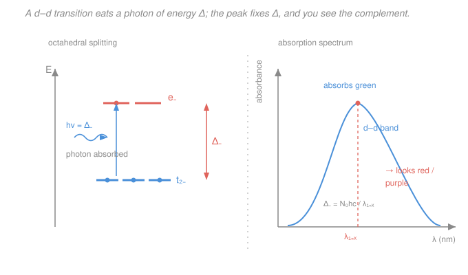

# Inorganic Chemistry · Lesson 3.3: Electronic Spectra & d–d Transitions

> ⏱ ~15 min · Module 3: Symmetry, Electronic Spectra & Magnetism · Builds on: [2.4 Crystal-field octahedral splitting](02-04-crystal-field-octahedral-splitting.md), [2.5 High-spin/low-spin & the spectrochemical series](02-05-high-spin-low-spin-spectrochemical-series.md), [`physical-chemistry` electronic spectroscopy](../../physical-chemistry/syllabus.md) · Unlocks: 3.4 (magnetism of complexes)

## Why this matters

Ruby is red, emerald is green, copper sulfate is blue, and a ruthenium dye can turn sunlight into current — all for the same reason: a transition metal ion sitting in a field of ligands has a tiny energy gap that happens to match visible light. In [2.4](02-04-crystal-field-octahedral-splitting.md) you learned that six ligands split the five $d$ orbitals into a lower $t_{2g}$ set and an upper $e_g$ set, separated by the **crystal-field splitting** $\Delta_o$. This lesson cashes that in: shine white light on the complex and it swallows exactly the photon whose energy equals $\Delta_o$, then hands your eye whatever is left. Color becomes a *ruler* — the wavelength a complex absorbs is a direct readout of $\Delta_o$, and therefore of how strong its ligands are. That single measurement is the experimental backbone of everything in this module, and it feeds Boss Problem 3.

## The idea

Picture the $d$ electrons resting in the lower $t_{2g}$ orbitals. A photon comes in. If — and only if — its energy exactly equals the gap $\Delta_o$, an electron can jump up into the empty $e_g$ set, and the photon is destroyed (absorbed). This is a **$d$–$d$ transition**: an electron moving from one $d$-derived level to another across the crystal-field gap.

Now the payoff. White light is every color at once. The complex removes the color whose photon energy matches $\Delta_o$ and lets the rest pass through (or reflect). Your eye adds up what survives and reports the **complementary** color — the color opposite the absorbed one on the color wheel. Absorb green light and the leftovers look red-purple; absorb orange and they look blue. So the color you *see* is never the color that got absorbed — it's the mirror image.

That gives a beautifully direct chain: **you see a color → the complementary color is what's absorbed → its wavelength $\lambda_{max}$ tells you the photon energy → that energy *is* $\Delta_o$.** A cheap benchtop spectrometer, aimed at a solution of the complex, reads off the crystal-field splitting that [2.4](02-04-crystal-field-octahedral-splitting.md) could only draw as an abstract gap. And because stronger-field ligands make $\Delta_o$ bigger ([2.5](02-05-high-spin-low-spin-spectrochemical-series.md)'s spectrochemical series), swapping ligands visibly shifts the color — chemistry you can watch with your eyes.

## The formal version

**Photon energy and the gap.** A photon of wavelength $\lambda$ (in meters) carries energy $E = hc/\lambda$, where $h = 6.626\times10^{-34}\ \mathrm{J\,s}$ is Planck's constant and $c = 3.00\times10^{8}\ \mathrm{m/s}$ is the speed of light. Absorption happens when this equals the gap:

$$\Delta_o = \frac{hc}{\lambda_{max}} \quad(\text{per complex}), \qquad \Delta_o = \frac{N_A\,hc}{\lambda_{max}} \quad(\text{per mole}),$$

where $\lambda_{max}$ is the wavelength of maximum absorption and $N_A = 6.022\times10^{23}\ \mathrm{mol^{-1}}$ is Avogadro's number. *In words: the wavelength the complex absorbs most strongly pins the size of the crystal-field gap; multiply by $N_A$ to get a molar energy in kJ/mol.* A handy shortcut is the constant $N_A hc = 0.1196\ \mathrm{J\,m\,mol^{-1}} = 1.196\times10^{5}\ \mathrm{kJ\,nm\,mol^{-1}}$, so

$$\Delta_o\ (\mathrm{kJ/mol}) = \frac{1.196\times10^{5}}{\lambda_{max}\ (\mathrm{nm})}.$$

Spectroscopists often quote $\Delta_o$ as a **wavenumber** $\bar\nu = 1/\lambda$ in $\mathrm{cm^{-1}}$ (just $10^{7}/\lambda_{\mathrm{nm}}$); typical $\Delta_o$ runs $10{,}000$–$30{,}000\ \mathrm{cm^{-1}}$, squarely in the visible.

**The absorbed ↔ observed color wheel.** Roughly:

| Absorbed $\lambda$ (nm) | Color absorbed | Color you see (complementary) |
|---|---|---|
| 400–430 | violet | yellow-green |
| 450–490 | blue | orange |
| 490–560 | green | red / purple |
| 560–580 | yellow | violet / indigo |
| 580–620 | orange | blue |
| 620–700 | red | green |

*In words: read the absorbed wavelength off the spectrum, then look up its opposite — that's the color of the bottle.*

**Ligand strength shifts the color.** From the spectrochemical series ([2.5](02-05-high-spin-low-spin-spectrochemical-series.md)),

$$\ce{I- < Br- < Cl- < F- < H2O < NH3 < en < CN- \approx CO}\qquad(\text{weak} \to \text{strong field}),$$

a stronger-field ligand makes $\Delta_o$ larger. Larger $\Delta_o$ means a *higher*-energy, *shorter*-$\lambda$ absorption — so the absorbed band moves toward the blue/UV and the observed color shifts accordingly. *In words: climb the series and the color you absorb marches to shorter wavelengths.*

**Selection rules — why some colors are pale and others blaze.** Not every conceivable transition actually happens; two rules govern intensity (quantified by the molar absorptivity $\varepsilon$, in $\mathrm{M^{-1}cm^{-1}}$):

- **The Laporte (parity) rule.** In a centrosymmetric complex (like octahedral $O_h$), an allowed transition must change parity, $g \leftrightarrow u$. But all $d$ orbitals are *gerade* ($g$), so a $d$–$d$ transition is $g\to g$ — **Laporte-forbidden**. *In words: jumping between two $d$ orbitals doesn't flip the symmetry the rule demands, so it's officially not allowed.* It happens anyway, only feebly, because molecular vibrations momentarily destroy the perfect center of symmetry (vibronic coupling), and tetrahedral complexes — which *have no* center of symmetry — escape the rule and absorb more strongly. Result: $d$–$d$ bands are weak, $\varepsilon \approx 1$–$100$, and the colors are pale.
- **The spin rule.** The total spin can't change: $\Delta S = 0$. A transition that would flip a spin (change the number of unpaired electrons) is **spin-forbidden** and even weaker, $\varepsilon \lesssim 1$. *In words: you may move an electron, but you can't turn it over.* The showcase is high-spin $d^5$ — e.g. $\ce{[Mn(H2O)6]^2+}$: every $d$ orbital already holds one electron, all spins parallel, so *any* $d$–$d$ excitation must pair a spin (flip one) **and** is Laporte-forbidden. Doubly forbidden $\Rightarrow$ nearly colorless (very faint pink).

**Charge-transfer bands — the loud exception.** Some intense colors are *not* $d$–$d$ transitions at all. In **ligand-to-metal charge transfer (LMCT)** an electron jumps from a ligand orbital onto the metal; in **metal-to-ligand charge transfer (MLCT)** it goes the other way. Because these move an electron *between different atoms/orbitals of different parity*, they are Laporte- **and** spin-allowed, so $\varepsilon \approx 10^{3}$–$10^{4}$ — a hundred to ten-thousand times more intense than a $d$–$d$ band. The deep purple of permanganate, $\ce{MnO4-}$, is the classic case: manganese here is $d^0$ (no $d$ electrons at all, so a $d$–$d$ band is impossible), and the color is an O$\to$Mn LMCT. *In words: a vivid, intense color usually means charge transfer, not a $d$–$d$ jump.*

## Picture

## Worked examples

**Example 1 (mechanical — color to gap).** A complex has its $d$–$d$ band at $\lambda_{max} = 500\ \mathrm{nm}$. Find $\Delta_o$ in kJ/mol and predict the color.

$$\Delta_o = \frac{1.196\times10^{5}\ \mathrm{kJ\,nm/mol}}{500\ \mathrm{nm}} = 239\ \mathrm{kJ/mol}.$$

As a wavenumber that's $\bar\nu = 10^{7}/500 = 20{,}000\ \mathrm{cm^{-1}}$ — a textbook mid-visible $\Delta_o$. Absorbed light at 500 nm is **green**, so the complex transmits the complement: it looks **red / purple**. Notice the whole answer came from one number off a spectrometer.

**Example 2 (why you'd care — reading ligand strength).** Two octahedral $\ce{Cr^3+}$ complexes: $\ce{[Cr(H2O)6]^3+}$ absorbs near 575 nm, while $\ce{[Cr(en)3]^3+}$ (en = ethylenediamine, a stronger-field chelating ligand) absorbs near 460 nm. Which has the larger $\Delta_o$, and does the trend match the spectrochemical series?

$$\Delta_o(\text{aqua}) = \frac{1.196\times10^{5}}{575} = 208\ \mathrm{kJ/mol}, \qquad \Delta_o(\text{en}) = \frac{1.196\times10^{5}}{460} = 260\ \mathrm{kJ/mol}.$$

The en complex has the larger gap — exactly as the series predicts, since $\ce{en}$ sits above $\ce{H2O}$. The color follows too: 575 nm (yellow) absorbed $\to$ the aqua complex looks violet; 460 nm (blue) absorbed $\to$ the en complex looks orange-yellow. Swapping to a stronger-field ligand pushed the absorption to shorter $\lambda$ and flipped the color — the spectrum *is* the spectrochemical series made visible.

## Watch out

- **You might think the color you see is the color absorbed.** It's the opposite — a blue complex absorbs *orange*, not blue. Always convert to the complementary color before reasoning about $\Delta_o$.
- **You might think a bigger $\Delta_o$ means a longer absorbed wavelength.** Backwards: $\lambda = hc/\Delta_o$, so a *bigger* gap absorbs *shorter* (higher-energy) wavelengths. Stronger field $\Rightarrow$ larger $\Delta_o$ $\Rightarrow$ blue-shifted absorption.
- **You might assume every strong color is a $d$–$d$ transition.** Intense colors ($\varepsilon \sim 10^{3}$+) are almost always charge-transfer. $\ce{MnO4-}$ ($d^0$) can't have a $d$–$d$ band at all — its purple is LMCT. A pale color signals a forbidden $d$–$d$ band; a blazing one signals allowed charge transfer.
- **You might expect all $d^n$ ions to be brightly colored.** High-spin $d^5$ (e.g. $\ce{Mn^2+}$, $\ce{Fe^3+}$) is nearly colorless because every $d$–$d$ transition is *both* Laporte- and spin-forbidden.

## One-liner

> A complex swallows the photon whose energy equals $\Delta_o$ and shows you the complement, so $\lambda_{max}$ reads out the crystal-field gap — while Laporte and spin rules set whether that color is a pale $d$–$d$ whisper or a charge-transfer shout.

## Problems

**P1 (🟢)** An octahedral complex shows a single $d$–$d$ absorption band with $\lambda_{max} = 520\ \mathrm{nm}$. Compute $\Delta_o$ in kJ/mol and state the observed (complementary) color of the solution.

**P2 (🟡)** $\ce{[Ni(H2O)6]^2+}$ is green, with its lowest-energy $d$–$d$ band at about $\lambda_{max} = 720\ \mathrm{nm}$. The water ligands are replaced by ammonia to give $\ce{[Ni(NH3)6]^2+}$. Using the spectrochemical series, predict whether $\lambda_{max}$ increases or decreases and in which direction the color shifts; then, if the band moves to 570 nm, compute $\Delta_o$ for both complexes (kJ/mol) and confirm the observed colors.

**P3 (🔴, Boss-3 rehearsal)** A $d^6$ octahedral complex (e.g. low-spin $\ce{[Co(NH3)6]^3+}$) absorbs at $\lambda_{max} = 490\ \mathrm{nm}$. (a) Compute $\Delta_o$ in kJ/mol and in $\mathrm{cm^{-1}}$, and state the observed color. (b) This $d$–$d$ band is *weak* ($\varepsilon \approx 60$), yet $\ce{MnO4-}$'s band is *intense* ($\varepsilon \approx 2000$) even though Mn here is $d^0$. Use the Laporte and spin rules to explain both facts.

Solutions

**P1** Using $\Delta_o\ (\mathrm{kJ/mol}) = (1.196\times10^{5})/\lambda_{\mathrm{nm}}$:

$$\Delta_o = \frac{1.196\times10^{5}}{520} = 230\ \mathrm{kJ/mol}.$$

Absorbed light at 520 nm is **green**; the complement is **red / purple**, so the solution looks red-purple (magenta).

*Check.* As a wavenumber, $10^{7}/520 = 19{,}200\ \mathrm{cm^{-1}}$ — right in the $10{,}000$–$30{,}000\ \mathrm{cm^{-1}}$ visible window for $\Delta_o$. ✓

**P2** Ammonia is above water in the spectrochemical series, so it is the stronger-field ligand: $\Delta_o$ **increases**, the absorbed wavelength **decreases** (blue-shifts from 720 to 570 nm), and the color shifts. Computing both:

$$\Delta_o(\text{aqua}) = \frac{1.196\times10^{5}}{720} = 166\ \mathrm{kJ/mol}, \qquad \Delta_o(\text{ammine}) = \frac{1.196\times10^{5}}{570} = 210\ \mathrm{kJ/mol}.$$

Colors: 720 nm is **red** absorbed $\to$ complement **green**, matching the green aqua complex. 570 nm is **yellow-green** absorbed $\to$ complement **violet/blue**, so $\ce{[Ni(NH3)6]^2+}$ looks blue-violet. ✓ (Real ammine nickel complexes are indeed blue-violet.)

*Check.* Stronger field $\to$ larger $\Delta_o$ (166 $\to$ 210 kJ/mol) $\to$ shorter $\lambda$ (720 $\to$ 570 nm), all three moving consistently. ✓

**P3** (a) Energy of the gap:

$$\Delta_o = \frac{1.196\times10^{5}}{490} = 244\ \mathrm{kJ/mol}, \qquad \bar\nu = \frac{10^{7}}{490} = 20{,}400\ \mathrm{cm^{-1}}.$$

Absorbed at 490 nm is **blue-green (cyan)**; the complement is **orange / red**, so the complex looks orange (low-spin $\ce{[Co(NH3)6]^3+}$ is indeed yellow-orange).

(b) The $d$–$d$ jump is $t_{2g} \to e_g$ — a $g\to g$ move, so it is **Laporte-forbidden** in the centrosymmetric octahedron; it appears only because vibrations transiently break the center of symmetry (vibronic coupling), giving a weak $\varepsilon \approx 60$. (It is spin-*allowed* here — low-spin $d^6$ goes $t_{2g}^6 \to t_{2g}^5 e_g^1$ with $\Delta S = 0$ — so the Laporte rule alone keeps it dim.) $\ce{MnO4-}$ has $d^0$ manganese: there are no $d$ electrons, so a $d$–$d$ band is impossible. Its purple is a **ligand-to-metal charge transfer** (O $2p \to$ Mn), a transition between orbitals of *different* parity on *different* atoms — Laporte- **and** spin-allowed — hence intense, $\varepsilon \approx 2000$. So the same photon-energy formula sets the *color*, but the selection rules set the *brightness*: forbidden $d$–$d$ = pale, allowed charge transfer = vivid.

*Check.* $244\ \mathrm{kJ/mol}$ corresponds to $20{,}400\ \mathrm{cm^{-1}}$, a reasonable $\Delta_o$ for a strong-field low-spin $\ce{Co^3+}$ complex, and the $\varepsilon$ ratio ($\sim 2000/60 \approx 30\times$) is exactly the order of magnitude the Laporte rule predicts between forbidden and allowed bands. ✓

## Flashback

**From Lesson 2.5 (High-spin/low-spin & the spectrochemical series):** $\ce{Fe^3+}$ is a $d^5$ ion. Give the $t_{2g}/e_g$ occupation, the number of unpaired electrons, and the crystal-field stabilization energy (CFSE, in units of $\Delta_o$, ignoring pairing energy) for octahedral $\ce{[FeF6]^3-}$ (F⁻ is weak-field) and $\ce{[Fe(CN)6]^3-}$ (CN⁻ is strong-field).

Solution

$d^5$ with $t_{2g}$ at $-0.4\,\Delta_o$ and $e_g$ at $+0.6\,\Delta_o$ each.

- **$\ce{[FeF6]^3-}$ (weak field → high spin):** electrons spread out to stay unpaired, $t_{2g}^3 e_g^2$. **5 unpaired electrons.** CFSE $= 3(-0.4) + 2(+0.6) = -1.2 + 1.2 = 0\,\Delta_o$.
- **$\ce{[Fe(CN)6]^3-}$ (strong field → low spin):** electrons pile into $t_{2g}$ first, $t_{2g}^5 e_g^0$. **1 unpaired electron.** CFSE $= 5(-0.4) = -2.0\,\Delta_o$ (offset by two extra pairing energies, $+2P$).

*Check.* High-spin $d^5$ has the maximum 5 unpaired electrons and, uniquely, *zero* CFSE — one reason high-spin $d^5$ ions like $\ce{Fe^3+}$ and $\ce{Mn^2+}$ are pale: their $d$–$d$ transitions are also spin-forbidden, tying straight back to this lesson's spin rule. ✓

## Connections

- **Backward:** this turns [2.4](02-04-crystal-field-octahedral-splitting.md)'s abstract gap $\Delta_o$ into a measurable number and makes [2.5](02-05-high-spin-low-spin-spectrochemical-series.md)'s spectrochemical series visible — stronger ligand, bigger gap, bluer absorption, different color. The photon relation $E = hc/\lambda$ is the same one behind atomic and molecular spectra in physical-chemistry electronic spectroscopy.
- **Forward:** [3.4 Magnetism of complexes](03-04-magnetism-of-complexes.md) picks up the *other* observable of the $t_{2g}/e_g$ occupation — the spin-only moment $\mu = \sqrt{n(n+2)}$ counts the unpaired electrons this lesson's spin rule kept track of, so color and magnetism together fully characterize a complex's $d$-electron configuration. These numbers also feed **Boss Problem 3**.
- **Sideways:** the Laporte parity rule ($g \leftrightarrow u$) is a direct consequence of the molecular symmetry you classified in [3.1](03-01-symmetry-elements-operations.md)–[3.2](03-02-assigning-point-groups.md): whether a complex *has* a center of inversion decides whether its $d$–$d$ bands are forbidden (octahedral) or allowed (tetrahedral) — symmetry predicting spectroscopy.
