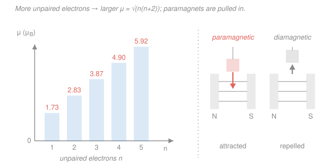

# Inorganic Chemistry · Lesson 3.4: Magnetism of Complexes

> ⏱ ~15 min · Module 3: Symmetry, Electronic Spectra & Magnetism · Builds on: [2.5 High/low spin & the spectrochemical series](02-05-high-spin-low-spin-spectrochemical-series.md), [3.3 Electronic spectra & d–d transitions](03-03-electronic-spectra-dd-transitions.md) · Unlocks: 4.1 (the 18-electron rule — electron counting for organometallics)

## Why this matters

In [2.5](02-05-high-spin-low-spin-spectrochemical-series.md) we argued — on paper — that a $d^6$ complex is either **high-spin** (four unpaired electrons) or **low-spin** (zero), depending on whether the ligand field $\Delta_o$ beats the pairing energy. But how would you *know* which one you actually have in the flask? You can't see electrons. What you *can* do is hang the sample near a magnet and watch. A substance's response to a magnetic field is a direct, quantitative readout of its number of unpaired electrons — and therefore of its spin state. Magnetism is the experimental handle on everything crystal field theory predicts. Together with the color/spectrum tool from [3.3](03-03-electronic-spectra-dd-transitions.md), it lets two independent measurements cross-check a single electronic structure.

## The idea

Unpaired electrons are tiny magnets. When you place a sample in a magnetic field, two things can happen:

- **Every** electron, paired or not, sets up a weak counter-field (Lenz's law, at the atomic scale) that *opposes* the applied field. A substance with **all electrons paired** shows only this effect: it is **diamagnetic** and is *weakly pushed out* of the field.
- If the atom has **unpaired** electrons, their little spin-magnets try to *align with* the field, and this alignment effect is far stronger than the diamagnetic push-back. The sample is **paramagnetic** and is *pulled into* the field — and the more unpaired electrons, the harder the pull.

So the direction and strength of the tug tell you the electron count. A **Gouy** or **Evans balance** literally weighs this force: it measures how much heavier (paramagnet, pulled down into the field) or lighter (diamagnet, pushed up) the sample appears when the magnet is switched on. That force converts to a number — the **effective magnetic moment** $\mu_{\text{eff}}$ — and $\mu_{\text{eff}}$ counts unpaired electrons.

The beautiful part: the count comes out in near-integer steps. Zero unpaired electrons, one, two, three... each gives a predictable moment, so a single measurement usually pins $n$ unambiguously.

## The formal version

Each unpaired electron carries spin quantum number $\tfrac12$. With $n$ unpaired electrons all aligned, the **total spin** is

$$S = \tfrac{n}{2}.$$

*In words: pile up $n$ half-units of spin.* A magnetic moment from spin alone is $\mu_S = g_e\sqrt{S(S+1)}\ \mu_B$, where $\mu_B$ is the **Bohr magneton** (the natural unit of atomic magnetism, $9.27\times10^{-24}\ \mathrm{J/T}$) and $g_e \approx 2$ is the electron $g$-factor. Substituting $S = n/2$ and $g_e = 2$:

$$\mu_S = 2\sqrt{\tfrac{n}{2}\!\left(\tfrac{n}{2}+1\right)}\ \mu_B = 2\sqrt{\tfrac{n}{2}\cdot\tfrac{n+2}{2}}\ \mu_B = 2\cdot\tfrac12\sqrt{n(n+2)}\ \mu_B.$$

The twos cancel and you land on the **spin-only formula**:

$$\boxed{\;\mu_{so} = \sqrt{n(n+2)}\ \ \mu_B\;}$$

*In words: the magnetic moment depends only on $n$, the number of unpaired electrons.* Plug in $n = 0,1,2,\dots$:

| $n$ (unpaired) | $\mu_{so} = \sqrt{n(n+2)}$ | magnetic behavior |
|:---:|:---:|:---|
| 0 | $0$ | diamagnetic |
| 1 | $\sqrt{3} = 1.73\ \mu_B$ | paramagnetic |
| 2 | $\sqrt{8} = 2.83\ \mu_B$ | paramagnetic |
| 3 | $\sqrt{15} = 3.87\ \mu_B$ | paramagnetic |
| 4 | $\sqrt{24} = 4.90\ \mu_B$ | paramagnetic |
| 5 | $\sqrt{35} = 5.92\ \mu_B$ | paramagnetic |

To *use* it, you run the logic in whichever direction you need:

$$\text{predict: } d^n \text{ config} \;\to\; n \;\to\; \mu_{so}, \qquad\qquad \text{deduce: } \mu_{\text{eff}} \;\to\; n \;\to\; \text{spin state.}$$

**The caveat — "spin-only."** The formula assumes the electrons' *orbital* motion contributes nothing, only their spin. For many first-row (3$d$) complexes that's an excellent approximation, and measured $\mu_{\text{eff}}$ sits within a few tenths of a $\mu_B$ of $\mu_{so}$. But when the ground state lets electrons circulate around the metal (unquenched **orbital angular momentum** — common for some $t_{2g}$ configurations, and always significant for heavy 4$d$/5$d$ metals with strong spin–orbit coupling), the true moment drifts above the spin-only value. Rule of thumb: for 3$d$ complexes, round $\mu_{\text{eff}}$ to the nearest table entry to read off $n$.

## Picture

## Worked examples

**Example 1 (predict — config to moment).** Hexaaquairon(III), $\ce{[Fe(H2O)6]^3+}$. Iron(III) is $d^5$; water is a weak-field ligand (low in the spectrochemical series from [2.5](02-05-high-spin-low-spin-spectrochemical-series.md)), so this is **high-spin**: all five $d$ orbitals singly occupied, $t_{2g}^3 e_g^2$, giving $n = 5$ unpaired electrons. Then

$$\mu_{so} = \sqrt{5(5+2)} = \sqrt{35} = 5.92\ \mu_B.$$

Measured value: about $5.9\ \mu_B$ — a textbook match, and the largest moment you'll see for a first-row metal (five is the most unpaired electrons a $d$ shell can hold).

**Example 2 (deduce — moment to config, and why you'd care).** A cobalt(III) complex is measured on an Evans balance and comes out **diamagnetic**, $\mu_{\text{eff}} \approx 0$. Cobalt(III) is $d^6$. From the table, $\mu = 0$ means $n = 0$: *all six electrons are paired*. The only way to pair up a $d^6$ ion is to cram all six into the lower $t_{2g}$ set, $t_{2g}^6 e_g^0$ — the **low-spin** configuration. So the single magnetic measurement tells us $\Delta_o$ *beat* the pairing energy: the ligand is strong-field. This is exactly how $\ce{[Co(NH3)6]^3+}$ is diagnosed as low-spin — you don't have to assume it, you weigh it. (Contrast $\ce{[CoF3(...)]}$-type high-spin $d^6$, which we tackle in the Problems.)

## Watch out

- **You might read "high-spin" as "high moment" automatically — check the electron count, not the label.** High-spin $d^6$ has $n=4$ ($\mu = 4.90$), but high-spin $d^8$ has only $n=2$ ($\mu = 2.83$). The moment tracks the *number of unpaired electrons*, which peaks at $d^5$ and falls off on either side — not the "high/low" word.
- **You might expect measured $\mu_{\text{eff}}$ to hit the table value exactly.** For 3$d$ complexes it's close; for 4$d$/5$d$ metals or orbitally-degenerate ground states, orbital angular momentum pushes it noticeably higher (and temperature dependence appears). Spin-only is a *first-row approximation*, not a law.
- **You might think diamagnetic means "no $d$ electrons."** No — it means *no unpaired* ones. Low-spin $d^6$ is packed with six $d$ electrons yet is perfectly diamagnetic because they're all paired.

## One-liner

> A magnet counts unpaired electrons: $\mu_{so} = \sqrt{n(n+2)}\ \mu_B$ turns a balance reading into $n$, and $n$ into the high/low spin state you could only guess at on paper.

## Problems

**P1 (🟢)** Compute the spin-only moment for (a) high-spin $\ce{[Mn(H2O)6]^2+}$ (manganese(II) is $d^5$, weak field), and (b) low-spin $\ce{[Fe(CN)6]^4-}$ (iron(II) is $d^6$, strong field). State whether each is para- or diamagnetic.

**P2 (🟡)** A first-row octahedral complex is measured at $\mu_{\text{eff}} = 3.87\ \mu_B$. How many unpaired electrons does it have? Give one $d^n$ configuration/spin state consistent with that count, and name a real ion that fits.

**P3 (🔴, Boss-3 rehearsal)** An octahedral iron(II) complex ($d^6$) is measured at $\mu_{\text{eff}} \approx 4.9\ \mu_B$. Its electronic spectrum (from the [3.3](03-03-electronic-spectra-dd-transitions.md) toolkit) shows a single $d$–$d$ band at $490\ \mathrm{nm}$. (a) Find $n$ and the spin state, writing the $t_{2g}/e_g$ occupation. (b) Convert the $490\ \mathrm{nm}$ band to $\Delta_o$ in kJ/mol. (c) Explain how the magnetic and spectroscopic results together confirm a **weak-field** ligand — and which measurement actually *proves* the spin state.

Solutions

**P1** (a) High-spin $d^5$: each of the five $d$ orbitals holds one electron, so $n = 5$ unpaired.
$$\mu_{so} = \sqrt{5(5+2)} = \sqrt{35} = 5.92\ \mu_B \quad\Rightarrow\quad \textbf{paramagnetic.}$$
(b) Low-spin $d^6$: strong field forces $t_{2g}^6 e_g^0$, all paired, $n = 0$.
$$\mu_{so} = \sqrt{0(0+2)} = 0 \quad\Rightarrow\quad \textbf{diamagnetic.}$$
The two cyanide/water choices sit at opposite ends of the spectrochemical series, and the moments — $5.92$ vs $0$ — are as far apart as first-row magnetism gets.

**P2** Reading the table, $\mu = 3.87\ \mu_B$ corresponds to $\sqrt{n(n+2)} = 3.87 \Rightarrow n(n+2) = 15 \Rightarrow n = 3$: **three unpaired electrons.** A clean fit is octahedral $d^3$ — the $t_{2g}^3 e_g^0$ configuration is the *only* option for $d^3$ (high- and low-spin coincide), always giving $n=3$. Real ion: $\ce{[Cr(H2O)6]^3+}$ (chromium(III), $d^3$). *(High-spin $d^7$, e.g. $\ce{[Co(H2O)6]^2+}$ with $t_{2g}^5 e_g^2$, also gives $n=3$ — so a spectrum or known oxidation state is needed to break the tie. Either answer earns full marks.)*

**P3** (a) Solve $\sqrt{n(n+2)} = 4.9 \Rightarrow n(n+2) = 24 \Rightarrow n = 4$: **four unpaired electrons.** For $d^6$ the only way to expose four unpaired electrons is the **high-spin** arrangement $t_{2g}^4 e_g^2$ (fill all five orbitals singly — that's five electrons and five unpaired — then the sixth pairs up in a $t_{2g}$ orbital, leaving $4$ unpaired).

(b) The absorption energy equals $\Delta_o$. Using $E = \dfrac{N_A\, hc}{\lambda}$ with $hc = 1.986\times10^{-25}\ \mathrm{J\,m}$, $\lambda = 490\times10^{-9}\ \mathrm{m}$, $N_A = 6.022\times10^{23}\ \mathrm{mol^{-1}}$:
$$\Delta_o = \frac{(6.022\times10^{23})(1.986\times10^{-25})}{490\times10^{-9}} = \frac{0.1196}{4.90\times10^{-7}}\ \mathrm{J/mol} \approx 2.44\times10^{5}\ \mathrm{J/mol} = \mathbf{244\ kJ/mol}$$
(about $20{,}400\ \mathrm{cm^{-1}}$).

(c) **Magnetism proves the spin state.** $\mu_{\text{eff}} = 4.9\ \mu_B \Rightarrow n = 4 \Rightarrow$ high-spin, which by definition means $\Delta_o$ *lost* to the pairing energy $P$ (i.e. $\Delta_o < P$) — the signature of a **weak-field** ligand low in the spectrochemical series. The spectrum then *quantifies* that field: the single band at $490\ \mathrm{nm}$ fixes $\Delta_o \approx 244\ \mathrm{kJ/mol}$, a moderate splitting consistent with the weak-field assignment made in [3.3](03-03-electronic-spectra-dd-transitions.md). The two experiments are independent windows onto the same $\Delta_o$-vs-$P$ competition from [2.5](02-05-high-spin-low-spin-spectrochemical-series.md): the balance tells you *who won* (high-spin), the spectrophotometer tells you *by how much* ($\Delta_o$). Note it's the magnetism, not the raw $\Delta_o$ number, that clinches high-spin — you'd need the pairing energy to judge spin from $\Delta_o$ alone.

## Flashback

**From Lesson 3.3 (Electronic spectra & d–d transitions):** A $d^1$ complex, $\ce{[Ti(H2O)6]^3+}$-like, shows its single $d$–$d$ absorption band centered at $600\ \mathrm{nm}$. Estimate $\Delta_o$ in kJ/mol, and predict the complex's color. (Fresh variant — different metal and wavelength from the lesson.)

Solution

The band energy equals $\Delta_o$ (for $d^1$, promoting the lone electron $t_{2g}\to e_g$ costs exactly $\Delta_o$). With $hc = 1.986\times10^{-25}\ \mathrm{J\,m}$ and $\lambda = 600\times10^{-9}\ \mathrm{m}$:
$$\Delta_o = \frac{N_A hc}{\lambda} = \frac{(6.022\times10^{23})(1.986\times10^{-25})}{600\times10^{-9}} = \frac{0.1196}{6.00\times10^{-7}} \approx 1.99\times10^{5}\ \mathrm{J/mol} \approx \mathbf{199\ kJ/mol}.$$
Color: $600\ \mathrm{nm}$ is orange light, so the complex *absorbs orange* and transmits its **complement — blue** (the classic hue of aqueous Ti(III), just shifted). *Check:* a longer wavelength than the $490\ \mathrm{nm}$ case above means a *smaller* $\Delta_o$ ($199 < 244\ \mathrm{kJ/mol}$), as it must — lower photon energy, weaker splitting. ✓

## Connections

- **Backward:** this is the payoff for [2.5](02-05-high-spin-low-spin-spectrochemical-series.md)'s high/low-spin bookkeeping — the abstract "count the unpaired electrons" now has a number, $\mu_{so}=\sqrt{n(n+2)}$, and a measuring device. It also pairs with [3.3](03-03-electronic-spectra-dd-transitions.md): color fixes $\Delta_o$, magnetism fixes $n$, and consistency between them validates the crystal-field picture. Together these three lessons close Module 3.
- **Forward:** Module 4 opens with [4.1's 18-electron rule](04-01-organometallics-18-electron-rule.md) — another electron-counting principle, but for organometallics; the diamagnetic, filled-shell stability there is the same "all paired" idea taken to its extreme (18 electrons, $n = 0$). This magnetism/spin analysis also feeds **Boss Problem 3**.
- **Sideways:** the spin-only formula is a special case of the general atomic moment $g\sqrt{J(J+1)}\,\mu_B$ from atomic physics; quenching of orbital angular momentum by the ligand field is why the *spin-only* piece survives — a bridge to the spectroscopy and term-symbol machinery in [physical chemistry](../../physical-chemistry/syllabus.md). The Bohr magneton $\mu_B$ itself comes straight from the quantum treatment of the electron in [quantum-mechanics](../../quantum-mechanics/syllabus.md).
