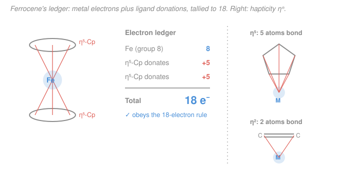

# Inorganic Chemistry · Lesson 4.1: Organometallics & the 18-Electron Rule

> ⏱ ~15 min · Module 4: Organometallics & Applications · Builds on: [2.1 Complexes, ligands & coordination number](02-01-complexes-ligands-coordination-number.md), [2.2 Nomenclature & oxidation state](02-02-nomenclature-oxidation-state.md), [1.4 Brønsted & Lewis acids/bases](01-04-bronsted-lewis-acids-bases.md) · Unlocks: [4.2 The homogeneous catalytic cycle](04-02-homogeneous-catalysis-cycle.md)

## Why this matters

Every industrial catalyst that hydrogenates a double bond, polymerizes ethylene, or stitches a C–C bond runs through a **metal–carbon bond** — an organometallic complex. To predict which of these species are stable, robust catalysts have one back-of-the-envelope tool: the **18-electron rule**. It plays the same role for transition metals that the octet rule plays for carbon and oxygen — a magic electron count that says "this is a filled, contented shell." Count to 18 and a complex is usually stable and isolable; land short of it and the complex is *hungry* for another ligand — which, as [4.2](04-02-homogeneous-catalysis-cycle.md) will show, is exactly what makes a catalyst work. This one counting skill is the spine of Boss Problem 4.

## The idea

A main-group atom like carbon has four valence orbitals (one $2s$ + three $2p$), holding eight electrons when full — the octet. A transition metal has *more room*: five $d$ orbitals join the party, for **nine valence orbitals** ($5d + 1s + 3p$). Nine orbitals, two electrons each, gives a filled valence shell of **18 electrons**. That's the whole idea. The 18-electron rule is just the octet rule with the $d$ orbitals included.

Where do the 18 come from? Two sources. First, the metal brings its *own* valence electrons. Second, every ligand is a Lewis base ([1.4](01-04-bronsted-lewis-acids-bases.md)) — an electron-pair donor — so each ligand *hands the metal a share of electrons*. Add the metal's contribution to everything the ligands donate, adjust for any overall charge, and you get the count. When smart chemists design a stable carbonyl or sandwich complex, they are unconsciously balancing this ledger to 18.

The catch — and the payoff — is that some of the most useful complexes deliberately stop at **16**. A 16-electron complex has an empty orbital, a vacant seat at the table. That empty seat is where an incoming molecule binds and gets transformed. So counting electrons isn't bookkeeping for its own sake: it tells you at a glance whether a complex is a stable end-product (18) or a reactive catalyst poised to grab a substrate (16).

## The formal version

**The 18-electron rule.** A transition-metal complex tends toward maximal stability when the total number of valence electrons around the metal — its own plus those donated by the ligands — equals **18**, filling all nine valence orbitals ($5d + 1s + 3p$).

*In words: a transition metal is "full" at 18 electrons, the same way carbon is full at 8.*

To count, use the **neutral (covalent) method**. Two rules:

1. **Metal contribution = its group number.** Treat the metal as a neutral atom and count all its valence electrons — which for a group-$N$ transition metal is exactly $N$ (e.g. Cr is group 6 → 6 electrons; Fe is group 8 → 8; Ni is group 10 → 10).
2. **Each ligand donates a fixed number of electrons,** as if the metal and ligand were bound by neutral radicals. The common donations:

| Ligand | Donates | | Ligand | Donates |
|---|---|---|---|---|
| $\ce{CO}$ (carbonyl) | 2 | | $\ce{H}$ (hydride) | 1 |
| $\ce{PR3}$ (phosphine) | 2 | | $\ce{CH3}$ / alkyl | 1 |
| $\eta^2$-alkene | 2 | | halide ($\ce{Cl}$, $\ce{Br}$…) | 1 |
| $\eta^5$-Cp (cyclopentadienyl) | 5 | | $\eta^6$-benzene | 6 |

Finally, **adjust for overall charge**: subtract one electron for each unit of positive charge, add one for each unit of negative charge. So the master formula is

$$\text{electron count} = \underbrace{N_{\text{metal}}}_{\text{group number}} \;+\; \sum_{\text{ligands}} (\text{donation}) \;-\; (\text{overall charge}).$$

*In words: metal's group number, plus what every ligand gives, minus the charge.*

**Hapticity.** The symbol $\eta^n$ ("eta-$n$") counts how many *contiguous* atoms of one ligand are bonded to the metal. Ethylene binding through both its carbons is $\eta^2$; a cyclopentadienyl ring lying flat, all five carbons touching the metal, is $\eta^5$. *In words: $\eta^n$ is the number of a ligand's atoms simultaneously gripping the metal* — and for these $\pi$-ligands it directly sets the donation ($\eta^2 \to 2$, $\eta^5 \to 5$, $\eta^6 \to 6$).

**A note on the other method.** The **ionic method** instead assigns each ligand a formal charge (so $\ce{Cl}$ becomes $\ce{Cl^-}$, Cp becomes $\ce{Cp^-}$), computes the metal's *oxidation state* and its resulting $d$-electron count ([2.2](02-02-nomenclature-oxidation-state.md)), then adds two electrons per donated lone pair. It always gives the **same total** — a hydride is $\ce{H}$ donating 1 (neutral) or $\ce{H^-}$ donating 2 with the metal one electron poorer (ionic); the bookkeeping shifts, the sum doesn't. We use the neutral method throughout because it needs no oxidation-state step.

## Picture

## Worked examples

**Example 1 (mechanical — three classic 18-electron complexes).** Run the ledger.

- **Chromium hexacarbonyl, $\ce{Cr(CO)6}$.** Cr is group 6 → 6. Six $\ce{CO}$ at 2 each → 12. Neutral, so no adjustment. Total $6 + 12 = \mathbf{18}$. ✓
- **Ferrocene, $\ce{Fe(\eta^5\text{-}Cp)2}$.** Fe is group 8 → 8. Two $\eta^5$-Cp at 5 each → 10. Total $8 + 10 = \mathbf{18}$. ✓ (This is the sandwich in the figure.)
- **Nickel tetracarbonyl, $\ce{Ni(CO)4}$.** Ni is group 10 → 10. Four $\ce{CO}$ at 2 each → 8. Total $10 + 8 = \mathbf{18}$. ✓

All three are stable, isolable, textbook compounds — the rule earns its keep.

**Example 2 (why you'd care — reading structure off the count).** Suppose you're told a stable neutral iron carbonyl $\ce{Fe(CO)_x}$ exists but not how many $\ce{CO}$'s it has. Use the rule as a *predictor*. Fe contributes 8; you need 18; so the ligands must supply $18 - 8 = 10$ electrons. Each $\ce{CO}$ gives 2, so $x = 10/2 = 5$: the answer is $\ce{Fe(CO)5}$, iron pentacarbonyl — a real, stable liquid. The 18-electron rule didn't just check a structure; it *told you the formula*. This is the everyday move in organometallic design: pick a metal, decide the electron target, and let the arithmetic dictate the ligand set.

## Watch out

- **You might think the rule is a law like the octet — it's not, it's a strong tendency.** Early transition metals and bulky ligands often can't reach 18 (too few electrons or no room), and 16-electron square-planar $d^8$ complexes — $\ce{Rh(I)}$, $\ce{Ir(I)}$, $\ce{Pd(II)}$, $\ce{Pt(II)}$ — are *stable at 16 on purpose*. Wilkinson's catalyst $\ce{RhCl(PPh3)3}$ and Vaska's complex are 16-electron and thrive there. The exceptions are the catalysts (see P3 and [4.2](04-02-homogeneous-catalysis-cycle.md)).
- **You might double-count charge and oxidation state.** In the neutral method you use the metal's *group number*, never its oxidation state, and then adjust once for the *overall* complex charge. Don't also assign ligand charges — that's the other method. Pick one lane and stay in it.
- **You might forget that hapticity can change.** A Cp ring is usually $\eta^5$ (donates 5), but it can "slip" to $\eta^3$ (donates 3) or $\eta^1$ (donates 1) to open a coordination site. If a problem gives you $\eta^n$, use *that* number — don't assume 5.
- **Bridging vs terminal ligands.** A terminal $\ce{CO}$ (bound to one metal) donates 2 to that metal; a bridging $\mu$-$\ce{CO}$ spanning two metals donates 1 to *each*. A metal–metal bond likewise contributes 1 electron to each metal's count (see P1).

## One-liner

> A transition metal is "full" at 18 electrons — its group number plus every ligand's donation, minus the charge — and the useful catalysts are the ones that stop short at 16, leaving an empty seat for the substrate.

## Problems

**P1 (🟢)** Count the valence electrons and check the 18-electron rule for each: (a) $\ce{V(CO)6}$; (b) $[\ce{Mn(CO)5}]^-$; (c) dimanganese decacarbonyl $\ce{Mn2(CO)10}$ — count *per Mn*, remembering the two metals are joined by a Mn–Mn bond and each Mn carries five terminal $\ce{CO}$'s.

**P2 (🟡)** Use the rule as a predictor. (a) What charge $q$ makes the fragment $[\ce{Co(CO)4}]^q$ an 18-electron species? (b) Neutral $\ce{Cr(\eta^6\text{-}C6H6)(CO)_x}$ is a known stable complex — find $x$.

**P3 (🔴, Boss-4 rehearsal)** Wilkinson's catalyst is $\ce{RhCl(PPh3)3}$. (a) Count its valence electrons. (b) It is called *coordinatively unsaturated* — explain what that means in terms of the count and the nine valence orbitals, and why a 16-electron complex is exactly what you want at the *start* of a catalytic cycle.

Solutions

**P1**

(a) $\ce{V(CO)6}$: V is group 5 → 5; six $\ce{CO}$ → $6 \times 2 = 12$; neutral. Total $5 + 12 = \mathbf{17}$. This is **one short of 18** — a rare stable 17-electron radical, and a textbook *exception*. Its hunger for one more electron shows: $\ce{V(CO)6}$ is easily reduced to $[\ce{V(CO)6}]^-$, which counts $5 + 12 + 1 = 18$ and is far more stable. ✓ (rule "fails," but instructively).

(b) $[\ce{Mn(CO)5}]^-$: Mn is group 7 → 7; five $\ce{CO}$ → 10; overall charge $-1$, so **add** 1. Total $7 + 10 + 1 = \mathbf{18}$. ✓

(c) $\ce{Mn2(CO)10}$, per Mn: Mn group 7 → 7; five terminal $\ce{CO}$ → 10; the **Mn–Mn bond donates 1** electron from the partner metal → $+1$. Total $7 + 10 + 1 = \mathbf{18}$. ✓ The metal–metal bond is what lets each half reach 18 — without it, each $\ce{Mn(CO)5}$ fragment would be a 17-electron radical (which is exactly why two of them pair up).

**P2**

(a) $[\ce{Co(CO)4}]^q$: Co is group 9 → 9; four $\ce{CO}$ → 8; that's 17 before charge. To reach 18 we need one *more* electron, i.e. a $-1$ charge (adding an electron). So $q = \mathbf{-1}$: the stable species is $[\ce{Co(CO)4}]^-$, the tetracarbonylcobaltate anion. Check: $9 + 8 + 1 = 18$. ✓

(b) $\ce{Cr(\eta^6\text{-}C6H6)(CO)_x}$: Cr is group 6 → 6; $\eta^6$-benzene donates 6; each $\ce{CO}$ donates 2; neutral. Set $6 + 6 + 2x = 18 \Rightarrow 2x = 6 \Rightarrow x = \mathbf{3}$. The complex is $\ce{Cr(\eta^6\text{-}C6H6)(CO)3}$ (benzenechromium tricarbonyl), a real 18-electron compound. ✓

**P3**

(a) $\ce{RhCl(PPh3)3}$: Rh is group 9 → 9; one halide $\ce{Cl}$ → 1; three phosphines $\ce{PPh3}$ → $3 \times 2 = 6$; neutral. Total $9 + 1 + 6 = \mathbf{16}$ electrons.

(b) With only 16 electrons, one of the metal's nine valence orbitals is **empty** — the complex is two electrons (one coordination site) short of a filled shell. That vacancy is what "coordinatively unsaturated" means: there is literally an open seat where another ligand could bind. This is precisely the property a catalyst needs at the *start* of its cycle: an incoming substrate molecule (an alkene, $\ce{H2}$, etc.) can coordinate into the empty orbital *without* first having to eject an existing ligand. A saturated 18-electron complex would have to lose a ligand before it could bind anything — a slower, higher-barrier detour. So Wilkinson's catalyst is deliberately built at 16 to stay reactive. In [4.2](04-02-homogeneous-catalysis-cycle.md) you'll watch the count breathe between 16 and 18 as substrate binds, reacts, and product leaves — the electron count *is* the pulse of the catalytic cycle.

## Flashback

**From Lesson 2.2 (Nomenclature & oxidation state):** For the complex $\ce{[Cr(H2O)6]^3+}$, determine (a) the oxidation state of chromium and (b) its $d$-electron count. (Fresh variant — a classical Werner complex, not an organometallic.)

Solution

(a) Water is a **neutral** ligand, so it contributes 0 to the charge balance. The whole complex carries $+3$, and that charge must sit on the metal: oxidation state of Cr $= \mathbf{+3}$.

(b) Neutral chromium is $\ce{[Ar]}\,3d^5 4s^1$ (group 6, six valence electrons). Forming $\ce{Cr^3+}$ removes three electrons — the $4s$ electron first, then two $3d$ — leaving $6 - 3 = 3$ valence electrons, all in $d$: a $\mathbf{d^3}$ ion.

*Check.* Group number (6) minus oxidation state (+3) equals the $d$-count (3) — the standard shortcut $d\text{-count} = N_{\text{group}} - \text{ox.\ state}$, and it lands on $d^3$. ✓ Note this is the *ionic*-method $d$-count for the metal; the neutral-method electron count of this lesson (which would tally the whole 18-electron shell) is a different quantity — same complex, two ledgers.

## Connections

- **Backward:** every ligand donation *is* a Lewis acid–base interaction from [1.4](01-04-bronsted-lewis-acids-bases.md) — the metal is the Lewis acid (empty orbitals), each ligand the Lewis base (lone pair) — and coordination number from [2.1](02-01-complexes-ligands-coordination-number.md) counts the ligand *attachment points* while this rule counts the *electrons* those attachments deliver. The charge-vs-oxidation-state care in the "Watch out" is the bookkeeping first met in [2.2](02-02-nomenclature-oxidation-state.md).
- **Forward:** [4.2 The homogeneous catalytic cycle](04-02-homogeneous-catalysis-cycle.md) uses the 16↔18 electron seesaw as the organizing logic of catalysis — oxidative addition adds 2, reductive elimination removes 2, and every intermediate's count tells you what can happen next. Boss Problem 4 is built directly on the counting practiced here.
- **Sideways:** the 18-electron rule mirrors the octet/filled-shell reasoning of general chemistry — see [electron configurations and the periodic table](../../general-chemistry/lessons/01-02-electron-configurations-periodic-table.md) for where the nine valence orbitals ($5d + 1s + 3p$) come from. The $\pi$-donor/acceptor picture behind $\ce{CO}$ and alkene binding also connects to the bonding models in [physical chemistry](../../physical-chemistry/syllabus.md).
