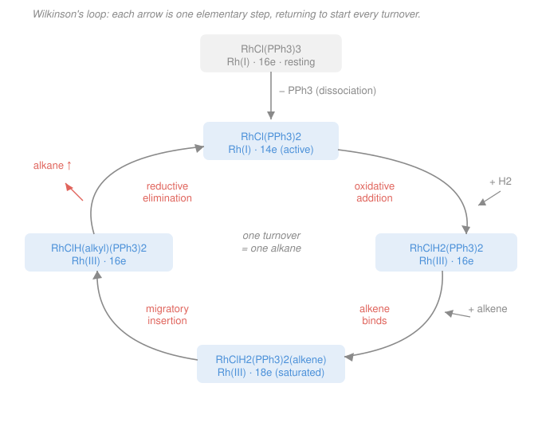

# Inorganic Chemistry · Lesson 4.2: Homogeneous Catalysis — A Cycle

> ⏱ ~15 min · Module 4: Organometallics & Applications · Builds on: [4.1 Organometallics and the 18-electron rule](04-01-organometallics-18-electron-rule.md), [2.2 Nomenclature and oxidation state](02-02-nomenclature-oxidation-state.md) · Unlocks: [4.3 Bioinorganic — metals in life](04-03-bioinorganic-metals-in-life.md)

## Why this matters

A single dissolved metal complex can turn thousands of molecules of substrate into product without being consumed — that is **homogeneous catalysis**, and it makes margarine, pharmaceuticals, and industrial polymers. The magic isn't one clever reaction; it's a **loop** of a few simple, repeatable moves. Learn to read a catalytic cycle and you can look at almost any organometallic catalyst — Wilkinson's hydrogenation, the Monsanto acetic-acid process, cross-coupling — and see the same four elementary steps rearranged. This is where the bookkeeping from [4.1](04-01-organometallics-18-electron-rule.md) (electron counts) and [2.2](02-02-nomenclature-oxidation-state.md) (oxidation states) pays off: they're the two dials you track around the loop to prove it closes.

## The idea

Think of the catalyst as a worker at a station with a fixed number of hands. To do a job it must (1) free up a hand, (2) grab the raw materials, (3) rearrange them into product, and (4) let go — ending exactly as it started, ready for the next piece. A catalytic cycle is that choreography written for a metal, and the "hands" are **coordination sites**.

Every move in the dance is one of four **elementary steps**, and each one shifts two dials by a fixed, predictable amount:

- how many electrons surround the metal (its **electron count**, from [4.1](04-01-organometallics-18-electron-rule.md)), and
- the metal's **oxidation state** (from [2.2](02-02-nomenclature-oxidation-state.md)).

The whole point of a *cycle* is that these two dials must come back to their starting values after one loop — otherwise the "catalyst" would be permanently changed and you'd have a reactant, not a catalyst. So the discipline is simple: name each step, apply its fixed shift to both dials, and check you land back home.

## The formal version

An electron count uses the ionic (donor-pair) convention from [4.1](04-01-organometallics-18-electron-rule.md): the metal contributes its $d^n$ electrons, each neutral two-electron donor (a phosphine $\ce{PPh3}$, an alkene, $\ce{CO}$) gives 2, each anionic ligand (a hydride $\ce{H^-}$, a halide, an alkyl $\ce{R^-}$) gives 2. Here is the **step toolkit** — memorize the shifts, not the examples:

| Elementary step | Oxidation state | Electron count | Coordination number |
|---|---|---|---|
| **Ligand dissociation** (a ligand leaves) | 0 | $-2$ | $-1$ |
| **Ligand association** (a ligand binds) | 0 | $+2$ | $+1$ |
| **Oxidative addition** (M inserts into an X–Y bond) | $+2$ | $+2$ | $+2$ |
| **Reductive elimination** (two cis ligands couple and leave) | $-2$ | $-2$ | $-2$ |
| **Migratory insertion** (a bound alkene/CO inserts into an adjacent M–H or M–R) | 0 | $-2$ | $-1$ |

*In words:* dissociation and association just open or fill a hand — redox untouched. **Oxidative addition** is the metal breaking a bond in a small molecule such as $\ce{H2}$ or $\ce{R-X}$ and binding both pieces: it loses two electrons to make two new bonds, so its oxidation state climbs by 2 and it gains a full electron pair plus two new ligands. **Reductive elimination** is the exact reverse — two neighboring ligands join into one molecule and leave, handing the metal back its two electrons (oxidation state drops by 2); this is usually the product-releasing step. **Migratory insertion** slides an already-bound unsaturated ligand (an alkene, a $\ce{CO}$) into a neighboring M–H or M–R bond, fusing two ligands into one and thereby *opening a site* (electron count drops by 2) while leaving the oxidation state alone.

Two structural facts fall out immediately, and both matter:

1. **Oxidative addition needs two open sites and reductive elimination needs two cis ligands.** Because they move the count by $\pm 2$, they come in matched pairs around a loop — one oxidative addition demands one reductive elimination for the metal to return to its starting oxidation state.
2. **To bind a substrate you must be electron-unsaturated (below 18).** A saturated **18-electron** complex has no empty orbital to accept a new donor pair, so before it can grab substrate it *must first dissociate a ligand* to drop to 16 electrons and open a site. This is the engine of the whole cycle — and the point the boss problem turns on.

### Turnover numbers

A catalyst's productivity is measured by two numbers. The **turnover number (TON)** is how many product molecules one catalyst molecule makes before it dies: $\text{TON} = (\text{mol product})/(\text{mol catalyst})$. The **turnover frequency (TOF)** is the rate of that, $\text{TOF} = \text{TON}/t$ (per second or per hour). *In words: TON is total mileage, TOF is speed.* A good industrial catalyst has TON in the thousands to millions.

## Picture

Trace **Wilkinson's catalyst**, $\ce{RhCl(PPh3)3}$, hydrogenating an alkene ($\ce{R-CH=CH2 + H2 -> R-CH2-CH3}$). Start at the resting complex and walk the loop:

1. **Resting state → active species (dissociation).** $\ce{RhCl(PPh3)3}$ is a 16-electron Rh(I) complex. It sheds one phosphine to open a site:
$$\ce{RhCl(PPh3)3 <=> RhCl(PPh3)2 + PPh3}.$$
Now 14 electrons, still Rh(I). Oxidation state unchanged, count $-2$. This coordinatively hungry 14-electron species is what actually does chemistry.
2. **Oxidative addition of $\ce{H2}$.** Rhodium splits the H–H bond and binds two hydrides: $\ce{RhCl(PPh3)2 + H2 -> RhClH2(PPh3)2}$. Rh(I) $\to$ Rh(III), count $14 \to 16$.
3. **Alkene binds (association).** The alkene coordinates through its $\pi$ bond: count $16 \to 18$, still Rh(III). The complex is now **saturated** — it cannot pick up anything else and must react internally.
4. **Migratory insertion.** The alkene inserts into a Rh–H bond, becoming a $\sigma$-bonded alkyl and freeing a site: count $18 \to 16$, still Rh(III).
5. **Reductive elimination.** The remaining hydride and the alkyl couple and leave as the alkane: Rh(III) $\to$ Rh(I), count $16 \to 14$. We are back at the 14-electron active species — **turnover complete** — and it re-enters at step 2.

Walk the dials around the productive loop: electron count $14 \to 16 \to 18 \to 16 \to 14$; oxidation state $\text{I} \to \text{III} \to \text{III} \to \text{III} \to \text{I}$. Both return exactly. One oxidative addition, one reductive elimination — the matched pair.

## Worked examples

**Example 1 (a single step's shift).** What happens to a $\ce{Pd(0)}$, 14-electron complex $\ce{Pd(PPh3)2}$ on **oxidative addition** of an aryl bromide $\ce{Ar-Br}$?

Oxidative addition always does $(+2, +2, +2)$. So Pd(0) $\to$ Pd(II); electron count $14 \to 16$; coordination number $2 \to 4$. The product is $\ce{Pd(Ar)(Br)(PPh3)2}$, a 16-electron Pd(II) complex — the first step of a cross-coupling. Notice we didn't need the structure; the step's fixed shift told us everything.

**Example 2 (why saturation forces the sequence).** Suppose you tried to feed the alkene to $\ce{RhCl(PPh3)3}$ *directly*, before anything dissociates. Count it: 16 electrons, but binding an alkene is an association $(+2)$, which would demand $16 \to 18$ — legal only if a site is open. In fact the resting complex is square-planar and its sites are filled by the three phosphines and chloride; to accept the alkene it must **first lose a phosphine** ($16 \to 14$), opening a hand. This is why every step in the picture happens in the order it does: you can never exceed 18 electrons, so each association or oxidative addition must be preceded by something that opened a site. The cycle is choreographed by the 18-electron ceiling.

## Watch out

- **You might think oxidative addition and migratory insertion are the same "insert" move.** They're not. Oxidative addition breaks a bond in an *incoming* molecule and raises the oxidation state by 2. Migratory insertion rearranges *ligands already on the metal* and leaves the oxidation state alone — it only lowers the electron count by opening a site.
- **You might think the metal is "used up."** It isn't — that's the definition of catalysis. If your dials don't return to their starting values after one loop, you've either mislabeled a step or missed one; a real cycle must close in both oxidation state and electron count.
- **You might expect an 18-electron complex to be the most reactive.** The opposite: 18 electrons means *saturated and content*. Reactivity lives in the coordinatively unsaturated 16- and 14-electron intermediates, which is why the resting catalyst must shed a ligand before it can work.

## One-liner

> A catalytic cycle is four elementary steps — dissociate, oxidatively add, insert, reductively eliminate — each nudging oxidation state and electron count by a fixed amount, arranged so both dials return home every turnover.

## Problems

**P1 (🟢)** State the change in oxidation state and in electron count for each elementary step: (a) oxidative addition of $\ce{H2}$ to a metal center; (b) reductive elimination of an alkane; (c) dissociation of a $\ce{CO}$ ligand.

**P2 (🟡)** A model hydrogenation catalyst rests as a 16-electron, $\ce{M(I)}$ complex. It runs the loop: (1) alkene **association**, (2) **migratory insertion** of the alkene into an M–H bond, (3) **oxidative addition** of $\ce{H2}$, (4) **reductive elimination** of the alkane. Fill in the metal's oxidation state and electron count after each step, and confirm it returns to 16-electron $\ce{M(I)}$. (Assume the resting 16-electron species has already opened a site as needed — start your count at the association step from a 16-electron M(I) intermediate carrying an M–H bond.)

**P3 (🔴, Boss-4)** For Wilkinson's hydrogenation of an alkene by $\ce{RhCl(PPh3)3}$: (a) label each of the four productive steps (dissociation is given) as oxidative addition, migratory insertion, or reductive elimination; (b) track the rhodium oxidation state **and** electron count at every intermediate around the loop and show both return to their starting values; (c) explain why the 18-electron resting-type saturation forbids substrate binding, so a ligand must dissociate first.

Solutions

**P1** Read the shifts straight off the toolkit.
(a) **Oxidative addition of $\ce{H2}$:** oxidation state $+2$, electron count $+2$ (and coordination number $+2$). The metal splits H–H into two hydrides.
(b) **Reductive elimination of an alkane:** oxidation state $-2$, electron count $-2$ (coordination number $-2$). Two cis ligands (an alkyl and a hydride) couple to R–H and leave.
(c) **Dissociation of $\ce{CO}$:** oxidation state **0** (no redox), electron count $-2$ (coordination number $-1$). $\ce{CO}$ is a neutral 2-electron donor, so losing it removes 2 from the count but does not change the metal's oxidation state.

**P2** Start: 16-electron, M(I), with an M–H bond present.

- **(1) Association of the alkene** $(0, +2)$: still **M(I)**, count $16 \to 18$. (Saturated.)
- **(2) Migratory insertion** of the alkene into the M–H $(0, -2)$: still **M(I)**, count $18 \to 16$. The hydride and alkene fuse into an M–alkyl, opening a site.
- **(3) Oxidative addition of $\ce{H2}$** $(+2, +2)$: **M(I) $\to$ M(III)**, count $16 \to 18$. Now the metal carries the alkyl plus two new hydrides.
- **(4) Reductive elimination** of the alkane $(-2, -2)$: **M(III) $\to$ M(I)**, count $18 \to 16$. The alkyl couples with one hydride and leaves as the alkane; one M–H remains, so we are back exactly at a 16-electron M(I) intermediate with an M–H bond.

Tally the dials: oxidation state $\text{I} \to \text{I} \to \text{I} \to \text{III} \to \text{I}$ (net 0 — one oxidative addition matched by one reductive elimination); electron count $16 \to 18 \to 16 \to 18 \to 16$ (net 0). The cycle **closes**, so this is a genuine catalyst. Note the association/insertion pair moved only the electron count, while the oxidative-addition/reductive-elimination pair moved both dials — that pairing is exactly why the loop can return home.

**P3**

**(a) Labels.** Resting $\ce{RhCl(PPh3)3}$ (Rh(I), 16e) loses a phosphine (*dissociation*, given) to the 14-electron active species $\ce{RhCl(PPh3)2}$. Then:
- $\ce{RhCl(PPh3)2 + H2 -> RhClH2(PPh3)2}$: **oxidative addition** of $\ce{H2}$.
- alkene coordinates: **ligand association**.
- alkene inserts into a Rh–H: **migratory insertion**.
- alkyl + hydride couple, alkane departs: **reductive elimination** (regenerates $\ce{RhCl(PPh3)2}$).

**(b) Dials around the productive loop** (starting from the 14-electron active species):

| Intermediate | Step that made it | Oxidation state | Electron count |
|---|---|---|---|
| $\ce{RhCl(PPh3)2}$ | (dissociation from resting) | Rh(I) | 14 |
| $\ce{RhClH2(PPh3)2}$ | oxidative addition of $\ce{H2}$ | Rh(III) | 16 |
| $\ce{RhClH2(PPh3)2(alkene)}$ | alkene association | Rh(III) | 18 |
| $\ce{RhClH(alkyl)(PPh3)2}$ | migratory insertion | Rh(III) | 16 |
| $\ce{RhCl(PPh3)2}$ | reductive elimination (alkane out) | Rh(I) | 14 |

Oxidation state runs $\text{I} \to \text{III} \to \text{III} \to \text{III} \to \text{I}$ and electron count runs $14 \to 16 \to 18 \to 16 \to 14$. Both return to the starting values (Rh(I), 14e), so the loop closes and each turnover consumes one $\ce{H2}$ and one alkene to release one alkane. (Spot-check one count: $\ce{RhClH2(PPh3)2}$ is Rh(III) $= d^6 = 6$, plus $\ce{Cl^-}$ (2), two $\ce{H^-}$ ($2\times2=4$), two $\ce{PPh3}$ ($2\times2=4$) $= 16$. ✓)

**(c) Why saturation forces dissociation.** An 18-electron metal has every valence orbital filled — nine metal orbitals holding 18 electrons — so it has **no empty orbital to accept the electron pair a substrate would donate**. Binding an alkene or oxidatively adding $\ce{H2}$ is an association-type event that would push the count to 20, which is not allowed. The resting-type saturated (or near-saturated 16-electron, coordinatively filled) complex must therefore **first dissociate a ligand** — here a phosphine, $16 \to 14$ — to open a coordination site before any substrate can bind. Saturation is stability; unsaturation is reactivity, and the cycle is engineered to keep dipping just below the ceiling.

## Flashback

**From Lesson 4.1 (Organometallics and the 18-electron rule):** Using neutral-atom electron counting, find the value of $x$ that makes each metal carbonyl obey the 18-electron rule: $\ce{Fe(CO)_x}$ and $\ce{Ni(CO)_x}$. (Fresh variant — solve for the formula, don't just count a given one.)

Solution

In the neutral-atom method the metal contributes its group number of valence electrons and each $\ce{CO}$ contributes 2. Set the total to 18 and solve.

**$\ce{Fe(CO)_x}$:** iron is group 8, so $8 + 2x = 18 \Rightarrow x = 5$. The 18-electron carbonyl is $\ce{Fe(CO)5}$ (iron pentacarbonyl) — and indeed it is a stable, well-known liquid.

**$\ce{Ni(CO)_x}$:** nickel is group 10, so $10 + 2x = 18 \Rightarrow x = 4$. The 18-electron carbonyl is $\ce{Ni(CO)4}$ (nickel tetracarbonyl).

*Check:* the more valence electrons the metal already brings, the fewer $\ce{CO}$ ligands it needs to reach 18 — Fe (8) needs five, Ni (10) needs four, differing by one $\ce{CO}$ for every two group-number electrons, exactly as $8+2(5)=10+2(4)=18$. ✓

## Connections

- **Backward:** every node in the loop is an electron count from [4.1](04-01-organometallics-18-electron-rule.md) and an oxidation-state assignment from [2.2](02-02-nomenclature-oxidation-state.md); the 18-electron ceiling that choreographs the cycle is exactly that lesson's rule doing real work. The hydrides and alkyls are anionic (X-type) ligands, the phosphines and alkene neutral (L-type) donors.
- **Forward:** [4.3 Bioinorganic — metals in life](04-03-bioinorganic-metals-in-life.md) shows nature running the same playbook — metalloenzymes cycle a metal through oxidation states and open/close coordination sites to catalyze reactions (oxygen binding, C–H activation) with turnover numbers that dwarf industrial catalysts.
- **Sideways (organic chemistry):** this cycle *is* catalytic hydrogenation, and the oxidative-addition / reductive-elimination pair from Example 1 is the backbone of palladium-catalyzed cross-coupling (Suzuki, Heck) — the C–C bond-forming reactions in the [organic chemistry](../../organic-chemistry/syllabus.md) toolkit. The energetics of each step (why insertion is favorable, why reductive elimination releases product) connect to reaction thermodynamics in [physical chemistry](../../physical-chemistry/syllabus.md).
