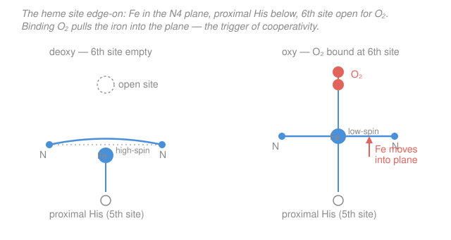

# Inorganic Chemistry · Lesson 4.3: Bioinorganic Chemistry — Metals in Life

> ⏱ ~15 min · Module 4: Organometallics & Applications · Builds on: [2.1 Complexes, ligands, coordination number](02-01-complexes-ligands-coordination-number.md), [2.5 High-spin/low-spin & the spectrochemical series](02-05-high-spin-low-spin-spectrochemical-series.md), [1.5 Hard–soft acid–base](01-05-hard-soft-acid-base.md), [4.2 Homogeneous catalysis](04-02-homogeneous-catalysis-cycle.md) · Unlocks: **the finish line** — this closes Inorganic Chemistry and hands off to a future biochemistry track

## Why this matters

Every breath you take runs on a coordination complex. The iron at the center of hemoglobin picks up $\ce{O2}$ in your lungs and drops it in your tissues billions of times a day, and it does so using *exactly* the machinery this course has been building: a metal ion, a set of ligands, a crystal field, a spin state, an open coordination site. Nature didn't invent new chemistry for biology — it engineered ordinary inorganic chemistry with ruthless precision. This lesson shows how one metalloprotein's job falls straight out of its metal's electronic structure, then tours the wider zoo, and finally ties the whole course together.

## The idea

Picture the problem evolution had to solve: grab $\ce{O2}$ tightly enough to carry it, but loosely enough to *let go* where it's needed. A bare $\ce{Fe^2+}$ ion in water won't do — it would either ignore $\ce{O2}$ or rust irreversibly. The trick is to wrap the iron in a custom ligand environment that leaves it *poised*: coordinatively almost-saturated, with a single vacant site held open for oxygen, and an electronic structure that flips the instant oxygen lands.

That wrapper is **heme**: an $\ce{Fe^2+}$ ion cradled in a **porphyrin**, a flat ring that donates four nitrogen atoms in a square around the iron. This is a tetradentate $\ce{N4}$ macrocycle — one ligand, four grips, exactly the chelate idea from [2.1](02-01-complexes-ligands-coordination-number.md). Below the ring, a fifth bond ties the iron to the protein through a histidine side chain (the **proximal histidine**). That leaves one site — the sixth — open, pointing into a pocket. That open site is where $\ce{O2}$ reversibly binds. Heme is, in one phrase, a coordination complex with a deliberately reserved parking spot.

The beautiful part is what happens when $\ce{O2}$ parks. The iron doesn't just gain a ligand — it **changes electronic state**, and that change is mechanical. Empty-site iron is high-spin and a touch too big for the hole in the ring, so it sits slightly *below* the plane, doming the porphyrin. The moment $\ce{O2}$ binds, the iron goes low-spin, shrinks, and drops *into* the plane. That tiny tug — a fraction of an ångström — pulls on the proximal histidine, which pulls on the protein, which nudges the *other three* hemes in hemoglobin toward their oxygen-friendly shape. One binding event makes the next one easier. That is **cooperativity**, and it is why the oxygen-binding curve is S-shaped instead of a boring hyperbola.

## The formal version

**The heme coordination sphere.** The iron is six-coordinate, octahedral (see [2.1](02-01-complexes-ligands-coordination-number.md)):

- **Four equatorial** $\ce{N}$ donors from the porphyrin ring (one tetradentate macrocyclic ligand).
- **One axial** $\ce{N}$ donor from the proximal histidine (the 5th site, anchoring to protein).
- **One axial site open** (the 6th) — vacant in deoxy-heme, occupied by $\ce{O2}$ in oxy-heme.

*In words: five ligands are permanently installed; the sixth seat is left empty on purpose.*

**The spin-state switch.** Recall from [2.5](02-05-high-spin-low-spin-spectrochemical-series.md) that an octahedral $d^n$ ion chooses high-spin or low-spin by comparing the field splitting $\Delta_o$ to the pairing energy. $\ce{Fe^2+}$ is $d^6$. In **deoxy**-heme the sixth site is empty, the field is weaker, and the iron is **high-spin** $d^6$ (four unpaired electrons, $t_{2g}^4 e_g^2$). High-spin $\ce{Fe^2+}$ has a larger ionic radius (electrons occupy the antibonding-pointing $e_g$ orbitals), so it cannot fit the porphyrin hole and sits $\sim 0.4\ \text{Å}$ out of the mean $\ce{N4}$ plane.

$\ce{O2}$ is a strong-field axial ligand. Binding it raises $\Delta_o$ past the pairing threshold, so the iron flips to **low-spin** $d^6$ ($t_{2g}^6 e_g^0$, zero unpaired electrons — diamagnetic). Emptying the $e_g$ orbitals shrinks the ion; it now fits, and drops **into** the plane:

$$\underbrace{\ce{Fe^2+}\ (\text{high-spin},\ \text{out of plane})}_{\text{deoxy}} \;+\; \ce{O2} \;\;\ce{<=>}\;\; \underbrace{\ce{Fe^2+}\!\!-\!\ce{O2}\ (\text{low-spin},\ \text{in plane})}_{\text{oxy}}$$

*In words: oxygen strengthens the crystal field, low-spins the iron, and the shrinking metal snaps into the ring.* The double arrow is the whole point — the binding is **reversible**, so the protein can release $\ce{O2}$ where oxygen is scarce.

**Cooperativity.** Hemoglobin has four heme subunits. The in-plane motion propagates through the proximal histidine into the protein backbone, shifting all four subunits from the low-affinity (T) state toward the high-affinity (R) state. So each $\ce{O2}$ bound raises the affinity of the remaining sites. The result is the **sigmoidal** (S-shaped) binding curve — steep in the middle — which lets hemoglobin load nearly full in the lungs and unload efficiently in tissue. (Myoglobin, with one heme and nobody to talk to, has a plain hyperbolic curve.)

**Why $\ce{CO}$ is poison.** Carbon monoxide binds the *same* sixth site, but $\sim 200$ times more tightly than $\ce{O2}$. Once $\ce{CO}$ occupies the seat, the equilibrium above no longer runs backward — the site is jammed, the iron can never present it to oxygen, and that heme is dead for transport. *In words: $\ce{CO}$ doesn't break the machine, it parks in the one spot the machine needs free.*

## Picture

## Worked examples

**Example 1 (the coordination sphere in course vocabulary).** Describe deoxy-heme's iron as a coordination complex. — Coordination number 5 (the sixth site is vacant): four $\ce{N}$ from the porphyrin macrocycle plus one $\ce{N}$ from histidine, giving a square-pyramidal $\ce{FeN5}$ arrangement, with an empty axial site completing a would-be octahedron. Oxidation state of iron: $+2$ throughout (both deoxy and oxy — oxygen binds as a neutral ligand without formally oxidizing the metal in the transport cycle). This is the same bookkeeping you did for $\ce{[Co(NH3)6]^3+}$-type complexes in [2.1](02-01-complexes-ligands-coordination-number.md) — biology just uses a fancier ligand.

**Example 2 (why the spin flip *must* move the iron).** Why can't a high-spin iron simply sit in the plane and skip the drama? High-spin $d^6$ puts two electrons in the $e_g$ set — the orbitals that point *straight at* the four porphyrin nitrogens (from [2.4](02-04-crystal-field-octahedral-splitting.md), $e_g = d_{x^2-y^2}, d_{z^2}$). Electron–ligand repulsion there swells the ion and lengthens the $\ce{Fe-N}$ bonds, so the iron literally doesn't fit the ring's hole and buckles out. Low-spin empties $e_g$, the $\ce{Fe-N}$ bonds contract, and the ion settles flush in the plane. The geometry change isn't incidental — it is the direct mechanical readout of the crystal-field occupancy. That readout is the signal cooperativity is built on.

## Watch out

- **You might think $\ce{O2}$ oxidizes the iron to $\ce{Fe^3+}$.** In the working cycle it stays $\ce{Fe^2+}$ (though the $\ce{Fe-O2}$ bond has real charge-transfer character). If iron *does* get oxidized to $\ce{Fe^3+}$ (met-hemoglobin), it can no longer bind $\ce{O2}$ — the protein spends energy actively reducing it back.
- **You might think heme grabs $\ce{O2}$ as hard as possible.** No — a carrier that binds too tightly can't deliver. The design target is *reversible, tunable* affinity, which is exactly what cooperativity provides. Maximal binding is the failure mode (that's the $\ce{CO}$ story).
- **You might think the out-of-plane displacement is negligible because it's tiny.** The motion is a fraction of an ångström, yet it is amplified through the protein into a global conformational switch. Small cause, large effect — that's allostery.

## One-liner

> Heme is an octahedral $\ce{Fe^2+}$ complex holding its sixth site open for $\ce{O2}$; binding low-spins the iron and snaps it into the porphyrin plane, and that snap — relayed through the protein — makes hemoglobin cooperative.

## A broader tour

Heme is one solution; here is the range of what metals do in biology, each an application of something from this course.

- **Electron transfer.** **Cytochromes** are heme proteins whose iron shuttles between $\ce{Fe^2+}$ and $\ce{Fe^3+}$, ferrying electrons down the respiratory chain — the porphyrin here is a redox relay, not an $\ce{O2}$ carrier. **Iron–sulfur clusters** (e.g. $\ce{[2Fe-2S]}$, $\ce{[4Fe-4S]}$ cubes of iron bridged by sulfide and cysteine thiolates) do the same job across a tunable range of potentials. Both exploit that first-row transition metals sit at accessible, closely spaced oxidation states — the redox flexibility that made the $d$-block interesting from Module 1.

- **Lewis-acid catalysis.** **Zinc** in **carbonic anhydrase** is redox-inert ($d^{10}$, no crystal-field or spin games) and instead acts as a pure Lewis acid: it polarizes a bound water molecule, lowering its $\mathrm{p}K_a$ so it deprotonates to a nucleophilic hydroxide that attacks $\ce{CO2}$. The same trick appears in **carboxypeptidase**, where $\ce{Zn^2+}$ polarizes the peptide carbonyl for hydrolysis. This is Lewis acid–base chemistry ([1.4](01-04-bronsted-lewis-acids-bases.md)) doing catalysis — the metal's job is to concentrate positive charge exactly where the reaction needs it.

- **Why nature picks a particular metal.** It's [1.5](01-05-hard-soft-acid-base.md) HSAB matching plus redox needs plus abundance. Borderline-to-hard $\ce{Fe}$ and $\ce{Zn}$ pair with $\ce{N}$/$\ce{O}$ donors (histidine, water, carboxylates); softer $\ce{Cu^+}$ and the $\ce{Fe}$ in $\ce{Fe-S}$ clusters take soft $\ce{S}$ donors (cysteine, sulfide). Redox jobs go to metals with accessible couples ($\ce{Fe}$, $\ce{Cu}$, $\ce{Mn}$); pure structural or Lewis-acid jobs go to redox-silent $\ce{Zn^2+}$. And it helps to be common: iron is cheap and everywhere, which is why life leans on it so heavily.

## Closing the course — the arc

Step back and look at what you built. **Module 1** set the stage with periodic trends and ionic energetics — how far across and down the table an element sits fixes its size, charge, and the lattice and Born–Haber bookkeeping of its solids, and (via HSAB) which partners it prefers. **Module 2** put a metal at the center of a set of ligands and turned on the **crystal-field engine**: the $d$-orbital splitting that dictates a complex's geometry, its color, and its high- vs low-spin electron count. **Module 3** gave you the instruments — symmetry and point groups, electronic ($d$–$d$) spectra, and magnetism — to *measure* that splitting and spin state from the outside. **Module 4** set the metal to work: the 18-electron rule and organometallic bonding, catalytic cycles that open and close coordination sites, and finally biology, where every one of these ideas — coordination geometry, spin state, an open site, HSAB matching — converges on the iron that carries your next breath.

Notice the through-line of this last lesson: heme keeps its sixth site open for $\ce{O2}$ for the *exact same reason* a catalyst must have or open a vacant site to bind substrate ([4.2](04-02-homogeneous-catalysis-cycle.md)). Reactivity lives at the empty coordination site. That single idea unifies organometallic catalysis and bioinorganic transport — and it's where this course hands you off. The natural next stop is a **biochemistry** track, where these metalloproteins become the enzymes and electron-transport chains of metabolism. You now have the inorganic foundation to read them as what they are: exquisitely tuned coordination complexes.

## Problems

**P1 (🟢)** Using the vocabulary of this course, state the coordination number, the coordinating donor atoms, and the geometry of the heme iron **(a)** in deoxy-heme (no $\ce{O2}$) and **(b)** in oxy-heme ($\ce{O2}$ bound).

**P2 (🟡)** Explain the deoxy → oxy change in the iron's spin state and geometry, and why this change is what makes hemoglobin's $\ce{O2}$ binding *cooperative* (sigmoidal) rather than simple.

**P3 (🔴, Boss-4 bridge)** Connect heme to catalysis. Explain **(a)** how heme's reserved sixth site for reversible $\ce{O2}$ binding parallels the requirement that a catalyst's metal have — or be able to open — a vacant site to bind substrate, and **(b)** why $\ce{CO}$ poisons heme in terms of that same open-site logic.

Solutions

**P1**
**(a) Deoxy-heme.** Coordination number **5**. Donors: four $\ce{N}$ atoms from the porphyrin macrocycle (equatorial) + one $\ce{N}$ from the proximal histidine (axial). Geometry: **square pyramidal** ($\ce{FeN5}$), i.e. an octahedron missing one vertex — the vacant sixth site.
**(b) Oxy-heme.** Coordination number **6**. Donors: the same five $\ce{N}$ atoms + one $\ce{O}$ from the bound $\ce{O2}$ occupying the sixth site. Geometry: **octahedral**. Iron oxidation state is $+2$ in both.

**P2** $\ce{Fe^2+}$ is $d^6$. In deoxy-heme the sixth site is empty, the ligand field is weaker, and the iron is **high-spin** ($t_{2g}^4 e_g^2$, four unpaired electrons). Occupying the $e_g$ orbitals — which point directly at the porphyrin nitrogens — swells the ion, so it can't fit the ring's central hole and sits $\sim0.4\ \text{Å}$ **out of the plane** (domed). Binding $\ce{O2}$, a strong-field ligand, raises $\Delta_o$ above the pairing energy; the iron becomes **low-spin** ($t_{2g}^6 e_g^0$, diamagnetic). Emptying $e_g$ shrinks the ion, which now fits and drops **into the plane**.

That in-plane motion tugs the proximal histidine, which shifts the protein backbone, and in a four-subunit hemoglobin this nudges the *other* subunits from their low-affinity (T) shape toward the high-affinity (R) shape. So each $\ce{O2}$ bound makes the next easier to bind — positive **cooperativity** — producing the **sigmoidal** binding curve. Without a spin-state-driven geometry change there would be no mechanical signal to transmit, and binding would be independent at each site (hyperbolic, as in single-heme myoglobin).

**P3**
**(a)** Both are stories about a **vacant coordination site being the reactive spot**. A homogeneous catalyst can only bind and activate substrate at an empty coordination site — the catalytic cycle ([4.2](04-02-homogeneous-catalysis-cycle.md)) repeatedly opens a site (e.g. by ligand dissociation), binds substrate there, transforms it, and releases it to regenerate the open site. Heme does the identical thing at slower stakes: it holds one site permanently open so it can bind its "substrate" $\ce{O2}$, then release it. Five ligands are locked down precisely so that the sixth stays available and selective — reactivity lives at the open site, in both the catalyst and the carrier.
**(b)** $\ce{CO}$ poisons heme by **occupying that open site too well**. It binds the sixth position $\sim200\times$ more tightly than $\ce{O2}$, so it does not come back off — the reversible equilibrium is killed and the site is permanently blocked. In catalytic terms this is exactly **catalyst poisoning by too-strong substrate binding**: a species that binds the active site so strongly it never dissociates halts turnover, because a site that can't reopen can't do its job. A good carrier (and a good catalyst) needs binding strong enough to grab but weak enough to let go; $\ce{CO}$ breaks that balance.

## Flashback

**From Lesson 2.5 (High-spin/low-spin & the spectrochemical series):** The complex $\ce{[Fe(H2O)6]^2+}$ is high-spin, while $\ce{[Fe(CN)6]^4-}$ is low-spin. Both are octahedral $\ce{Fe^2+}$ ($d^6$). For each, give the $t_{2g}/e_g$ electron configuration, the number of unpaired electrons, and the spin-only magnetic moment $\mu = \sqrt{n(n+2)}\ \mu_B$. Which ligand causes the low-spin case, and why?

Solution

Both are $d^6$; the split is over how $\Delta_o$ compares to the pairing energy $P$.

- **$\ce{[Fe(H2O)6]^2+}$ (high-spin):** water is a weak-field ligand, so $\Delta_o < P$ and electrons spread out before pairing: $t_{2g}^4 e_g^2$, giving $n = 4$ unpaired electrons.
$$\mu = \sqrt{4(4+2)} = \sqrt{24} \approx 4.9\ \mu_B.$$
- **$\ce{[Fe(CN)6]^4-}$ (low-spin):** cyanide is a strong-field ligand (high in the spectrochemical series), so $\Delta_o > P$ and all six electrons pair in the lower set: $t_{2g}^6 e_g^0$, giving $n = 0$ unpaired electrons (diamagnetic).
$$\mu = \sqrt{0(0+2)} = 0\ \mu_B.$$

$\ce{CN^-}$ causes the low-spin case because it is a strong-field ligand — a good $\sigma$-donor and $\pi$-acceptor — that pushes $\Delta_o$ above the pairing energy. This is the very same weak-vs-strong-field logic that governs the heme iron in this lesson: an empty (or weak-field) sixth site leaves iron high-spin, while binding strong-field $\ce{O2}$ flips it low-spin.

## Connections

- **Backward:** this lesson is a capstone that reuses nearly everything — coordination number and geometry ([2.1](02-01-complexes-ligands-coordination-number.md)), the octahedral crystal field ([2.4](02-04-crystal-field-octahedral-splitting.md)), high-spin/low-spin and the spectrochemical series ([2.5](02-05-high-spin-low-spin-spectrochemical-series.md)), HSAB metal–donor matching ([1.5](01-05-hard-soft-acid-base.md)), and the open-site logic of catalysis ([4.2](04-02-homogeneous-catalysis-cycle.md)). The spin-only moment from the Flashback is the same tool that would report deoxy-heme as paramagnetic and oxy-heme as diamagnetic (magnetism, [3.4](03-04-magnetism-of-complexes.md)).
- **Forward:** this is the course's final lesson. It hands off to a **biochemistry** track, where these metalloproteins — hemoglobin, cytochromes, iron–sulfur proteins, zinc enzymes — become the working parts of respiration and metabolism.
- **Sideways (chemistry & spectroscopy):** the reversible $\ce{Fe-O2}$ equilibrium and its temperature/pressure response are the [physical-chemistry](../../physical-chemistry/syllabus.md) language of binding equilibria and cooperativity; the electron configurations underneath all of this trace back to [general-chemistry periodic trends](../../general-chemistry/lessons/01-03-periodic-trends.md) and the $d$-block's accessible oxidation states.
