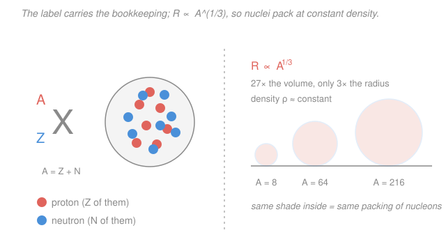

# Intro to Nuclear Engineering & Radiation · Lesson 1.1: The nucleus and its bookkeeping

> ⏱ ~15 min · Module 1: Nuclear structure, radioactivity & reactions · Builds on: [`general-chemistry`](../../general-chemistry/syllabus.md) (atomic structure), [`relativity`](../../relativity/syllabus.md) ($E=mc^2$) · Unlocks: [1.2 Binding energy and the chart of nuclides](01-02-binding-energy-chart-of-nuclides.md)

## Why this matters

Everything in this course — decay rates, reactor power, radiation dose — is accounting. Before you can compute how much energy a fissioning uranium nucleus releases or how fast a cobalt source decays, you need to *name* the nucleus precisely, know how big it is, and speak fluently in the two currencies of nuclear physics: **mass** and **energy**. The punchline you'll use for the rest of the course is that those two currencies are the same thing at a fixed exchange rate — Einstein's $E=mc^2$ — which is why a mass difference smaller than a rounding error can power a city.

## The idea

A nucleus is a tight ball of two kinds of particle: **protons** (positive charge) and **neutrons** (no charge). Collectively they're **nucleons**. Two counts tell you everything about which nucleus you have: how many protons ($Z$), which fixes the *element* (6 protons is always carbon, 92 is always uranium), and how many total nucleons ($A$), which fixes the specific *isotope*. The neutron count is just the leftover, $N = A - Z$.

Two facts about size make nuclei feel very unlike everyday objects. First, they're absurdly small — a few **femtometers** ($1\,\text{fm} = 10^{-15}\,\text{m}$), a hundred-thousand times smaller than the atom's electron cloud. Second, and more useful: they're **incompressible**. You can't squeeze nucleons closer together; they pack like marbles in a bag at a fixed spacing. So a nucleus with twice the nucleons has twice the *volume*, not twice the radius. Volume grows like radius cubed, so the radius only creeps up as the **cube root** of $A$. Double $A$ and the radius grows by just $2^{1/3}\approx 1.26$. That single "constant-density" idea is the whole picture on the right of the figure below.

## The formal version

**Nuclide notation.** A specific nucleus (a *nuclide*) is written

$$\ce{^{A}_{Z}X}$$

where $X$ is the chemical symbol, $Z$ is the **atomic number** (proton count), and $A$ is the **mass number** (total nucleon count). The neutron number is

$$N = A - Z, \qquad A = Z + N.$$

*In words: the top number counts all nucleons, the bottom number counts just the protons, and their difference is the neutrons.* The symbol $X$ and $Z$ are redundant (carbon is *always* $Z=6$), so you'll often see just $\ce{^{60}Co}$ or "Co-60" — the $Z$ is implied by the name.

Three relationships get their own words:

- **Isotopes** — same $Z$, different $N$ (same element, different weight): $\ce{^{235}_{92}U}$ and $\ce{^{238}_{92}U}$.
- **Isobars** — same $A$, different $Z$ (same weight, different element): $\ce{^{14}_{6}C}$ and $\ce{^{14}_{7}N}$.
- **Isotones** — same $N$, different $Z$: $\ce{^{13}_{6}C}$ ($N=7$) and $\ce{^{14}_{7}N}$ ($N=7$).

**Nuclear radius.** Measured radii follow

$$R \approx r_0\, A^{1/3}, \qquad r_0 \approx 1.2\,\text{fm}.$$

*In words: radius grows as the cube root of the nucleon count, because nucleons pack at a fixed density.* The consequence: since volume $\propto R^3 \propto A$ and mass $\propto A$, the **density is the same for every nucleus** — roughly $2\times 10^{17}\,\text{kg/m}^3$ (a teaspoon would weigh a billion tonnes). Nuclear matter is essentially one universal fluid; big nuclei are just bigger drops of it.

**The mass–energy exchange rate.** Nuclear masses are quoted in **atomic mass units** (u), defined so that a neutral $\ce{^{12}C}$ atom weighs exactly $12\,\text{u}$. Energies are quoted in **electron-volts**: $1\,\text{eV}$ is the energy an electron gains falling through one volt, and $1\,\text{MeV} = 10^{6}\,\text{eV}$. Einstein's relation ties them:

$$E = mc^2 \quad\Longrightarrow\quad 1\,\text{u} = 931.5\,\text{MeV}/c^2.$$

*In words: mass and energy are interconvertible, and one atomic mass unit is worth 931.5 MeV of energy.* Carrying the $c^2$ around is tedious, so nuclear physicists write masses directly in $\text{MeV}/c^2$ and treat "$1\,\text{u} = 931.5\,\text{MeV}/c^2$" as a unit conversion. A tiny mass *difference* between reactants and products, multiplied by 931.5, is the energy a reaction releases — the seed of every later lesson.

## Picture

## Worked examples

**Example 1 (parse three nuclides, then size one).** Read off $Z$, $N$, $A$ for each:

| Nuclide | $Z$ | $A$ | $N = A - Z$ |
|---|---|---|---|
| $\ce{^{235}_{92}U}$ | 92 | 235 | 143 |
| $\ce{^{12}_{6}C}$ | 6 | 12 | 6 |
| $\ce{^{60}_{27}Co}$ | 27 | 60 | 33 |

Now size the cobalt nucleus with $R = r_0 A^{1/3}$:

$$R_{\text{Co}} = 1.2\,\text{fm}\times 60^{1/3} = 1.2\times 3.915 = 4.70\,\text{fm}.$$

*Is the density really constant?* Check the ratio $R^3/A$ (which should equal $r_0^3$ for every nuclide, since $R^3 = r_0^3 A$). For uranium, $R_{\text{U}} = 1.2\times 235^{1/3} = 7.41\,\text{fm}$, so $R^3/A = 7.41^3/235 = 1.73$. For carbon, $R^3/A = (1.2\times 12^{1/3})^3/12 = 2.75^3/12 = 1.73$. Same number ($=1.2^3$) — density is constant, exactly as promised. Note uranium has $\sim 20\times$ the nucleons of carbon but only $\sim 2.7\times$ the radius.

**Example 2 (mass ↔ energy).** First, derive the exchange rate from scratch. One atomic mass unit is $m = 1.6605\times 10^{-27}\,\text{kg}$, and $c = 2.998\times 10^{8}\,\text{m/s}$:

$$E = mc^2 = (1.6605\times 10^{-27})(2.998\times 10^{8})^2 = 1.492\times 10^{-10}\,\text{J}.$$

Convert joules to MeV using $1\,\text{MeV} = 1.602\times 10^{-13}\,\text{J}$:

$$E = \frac{1.492\times 10^{-10}}{1.602\times 10^{-13}} = 931.5\,\text{MeV}. \qquad\checkmark$$

Now use it. A deuteron ($\ce{^{2}_{1}H}$, one proton + one neutron) weighs slightly *less* than its parts: the proton and neutron together weigh $1.007276 + 1.008665 = 2.015941\,\text{u}$, while the bound deuteron weighs $2.013553\,\text{u}$. The **mass defect** is

$$\Delta m = 2.015941 - 2.013553 = 0.002388\,\text{u}.$$

That missing mass was released as energy when the nucleon pair bound together:

$$E = \Delta m\, c^2 = 0.002388\,\text{u}\times 931.5\,\tfrac{\text{MeV}}{\text{u}} = 2.22\,\text{MeV}.$$

A mass difference in the fourth decimal place of a "u" becomes millions of electron-volts. This 2.22 MeV is the deuteron's **binding energy** — and Lesson 1.2 turns exactly this calculation into the master curve of nuclear engineering.

## Watch out

- **You might think a heavier nucleus is proportionally bigger.** It isn't — radius goes as $A^{1/3}$, not $A$. Uranium (235 nucleons) is only about 2.7 times wider than carbon (12 nucleons), because the *volume*, not the radius, tracks the nucleon count.
- **You might read $A$ as the atomic weight from the periodic table.** $A$ is an integer nucleon count for one specific nuclide; the periodic-table value (e.g. carbon's 12.011) is an *average* over an element's naturally occurring isotopes. For a single nuclide, use the integer $A$.
- **You might carry $c^2$ through every line.** Don't. Treat "$1\,\text{u} = 931.5\,\text{MeV}/c^2$" as a conversion factor: multiply a mass-in-u by $931.5$ to get the energy-in-MeV directly.

## One-liner

> A nuclide is pinned down by two integers $(Z,A)$ — $Z$ names the element, $A-Z$ counts the neutrons — its radius is only $1.2\,A^{1/3}\,\text{fm}$ because nuclear matter is incompressible, and 931.5 MeV per u is the exchange rate that turns a whisker of mass into nuclear energy.

## Problems

**P1 (🟢)** Consider $\ce{^{56}_{26}Fe}$. (a) Give $Z$, $N$, and $A$. (b) Compute its nuclear radius using $R = r_0 A^{1/3}$ with $r_0 = 1.2\,\text{fm}$. (c) Is $\ce{^{56}_{26}Fe}$ an isotope, isobar, or isotone of $\ce{^{54}_{26}Fe}$?

**P2 (🟡)** An electron has rest mass $m_e = 9.109\times 10^{-31}\,\text{kg}$. Using $E = mc^2$, compute its rest energy in MeV from scratch. (This 0.511 MeV number will reappear the moment we meet beta decay and positron annihilation.)

**P3 (🔴, optional)** Using $R = r_0 A^{1/3}$ and the fact that each nucleon weighs about $1.66\times 10^{-27}\,\text{kg}$, estimate the mass density of nuclear matter in $\text{kg/m}^3$. How many times denser than water ($1000\,\text{kg/m}^3$) is it? (Hint: work with one nucleon — its mass over the volume it occupies, $\tfrac{4}{3}\pi r_0^3$.)

Solutions

**P1** (a) The subscript is $Z = 26$ (iron), the superscript is $A = 56$, so $N = A - Z = 56 - 26 = 30$.

(b) $R = 1.2\,\text{fm}\times 56^{1/3} = 1.2\times 3.826 = 4.59\,\text{fm}.$

(c) Both have $Z = 26$ (same element, iron) but different $A$ (56 vs. 54), hence different $N$. Same $Z$, different $N$ → they are **isotopes**.

**P2** With $c = 2.998\times 10^{8}\,\text{m/s}$:

$$E = m_e c^2 = (9.109\times 10^{-31})(2.998\times 10^{8})^2 = 8.187\times 10^{-14}\,\text{J}.$$

Convert with $1\,\text{MeV} = 1.602\times 10^{-13}\,\text{J}$:

$$E = \frac{8.187\times 10^{-14}}{1.602\times 10^{-13}} = 0.511\,\text{MeV}.$$

*Check.* Equivalently, $m_e = 9.109\times 10^{-31}/1.6605\times 10^{-27} = 5.486\times 10^{-4}\,\text{u}$, and $5.486\times 10^{-4}\times 931.5 = 0.511\,\text{MeV}$ ✓ — same answer through the u-conversion route.

**P3** Take one nucleon of mass $m = 1.66\times 10^{-27}\,\text{kg}$ occupying a sphere of radius $r_0 = 1.2\,\text{fm} = 1.2\times 10^{-15}\,\text{m}$ (this is what "constant density $r_0$" means — one nucleon per little sphere of radius $r_0$):

$$V = \tfrac{4}{3}\pi r_0^3 = \tfrac{4}{3}\pi (1.2\times 10^{-15})^3 = 7.24\times 10^{-45}\,\text{m}^3.$$

$$\rho = \frac{m}{V} = \frac{1.66\times 10^{-27}}{7.24\times 10^{-45}} = 2.3\times 10^{17}\,\text{kg/m}^3.$$

Compared to water: $\rho/\rho_{\text{water}} = 2.3\times 10^{17}/10^{3} = 2.3\times 10^{14}$ times denser.

*Check.* Because $R^3 = r_0^3 A$ and mass $= mA$, the $A$ cancels — the density is the same for every nucleus, which is exactly why nuclear matter has one characteristic density regardless of which nuclide you pick. ✓

## Connections

- **Backward:** the atomic number $Z$ that fixes an element — and the electron cloud that surrounds this nucleus — is the atomic structure from [`general-chemistry`](../../general-chemistry/syllabus.md); here we've zoomed in from the whole atom to the nucleus at its center.
- **Forward:** [1.2 Binding energy and the chart of nuclides](01-02-binding-energy-chart-of-nuclides.md) takes the mass-defect calculation of Example 2 and applies it across all nuclei, building the binding-energy-per-nucleon curve whose shape is *why* both fission and fusion release energy.
- **Sideways ($E=mc^2$):** the 931.5-MeV-per-u exchange rate is mass–energy equivalence straight from [`relativity`](../../relativity/syllabus.md). Nuclear engineering is the one field where that famous equation is a daily working tool, not a curiosity — every reactor's power output is a mass difference times $c^2$.
