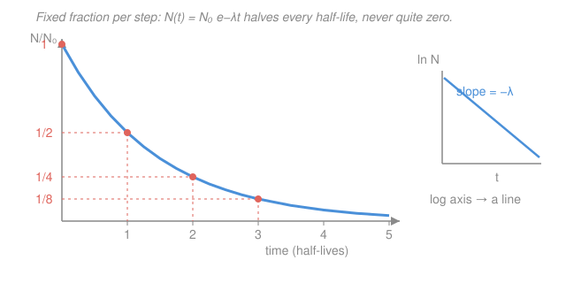

# Intro to Nuclear Engineering & Radiation · Lesson 1.3: Radioactivity and the decay law

> ⏱ ~15 min · Module 1: Nuclear structure, radioactivity & reactions · Builds on: [1.1 The nucleus and its bookkeeping](01-01-nucleus-bookkeeping.md), [1.2 Binding energy & the chart of nuclides](01-02-binding-energy-chart-of-nuclides.md) · Unlocks: [1.4 Decay chains & equilibrium](01-04-decay-chains-equilibrium.md)

## Why this matters

A radioactive source is a clock you cannot reset. Every medical isotope has a shelf life; every reactor keeps making heat for hours after shutdown; every waste form must sit for a span you can compute from a single number. That number is the decay constant, and one exponential law — the same first-order law that governs cooling coffee and discharging capacitors — turns it into activity today, activity next year, atoms present, and grams on the shelf. Master this law and you can quote a source's output on any date and size its hazard.

## The idea

An unstable nucleus has no memory and no schedule. It does not age, wear out, or "get closer" to decaying — at every instant it faces the *same fixed probability per second* of transforming, whether it was made yesterday or a billion years ago. This is genuinely random for any single nucleus.

But a source holds a staggering number of them (a gram of cobalt is $\sim10^{22}$ nuclei), and randomness at that scale becomes near-perfect regularity. If a fixed fraction of whatever remains decays each second, then the population falls by the same *proportion* over equal time steps — halve, halve again, halve again. That "constant fraction per step" is the fingerprint of exponential decay, and it is why the survival curve looks identical no matter where you start reading it. A pile that takes 5 years to drop to half takes another 5 to reach a quarter, not to hit zero.

## The formal version

**The decay constant.** Let $\lambda$ (units of $\text{s}^{-1}$) be the probability per unit time that a given nucleus decays. With $N(t)$ nuclei present, the number decaying in time $dt$ is $\lambda N\,dt$, so the population obeys

$$\frac{dN}{dt} = -\lambda N.$$

*In words:* the rate of loss is proportional to how many you still have — the defining signature of a first-order process.

This is exactly the linear first-order ODE from [ode-refresher](../../ode-refresher/syllabus.md). Separating variables, $\int dN/N = -\int \lambda\,dt$, gives $\ln N = -\lambda t + C$, and applying $N(0)=N_0$:

$$N(t) = N_0\,e^{-\lambda t}.$$

*In words:* start with $N_0$ nuclei and the count decays exponentially, losing the same fraction each second forever.

**Activity.** The measurable quantity is not the atom count but the *decay rate* — how many disintegrations per second the detector sees:

$$A(t) = -\frac{dN}{dt} = \lambda N(t) = A_0\,e^{-\lambda t}, \qquad A_0 = \lambda N_0.$$

*In words:* activity is decays per second; because it is just $\lambda$ times $N$, it obeys the very same exponential — and you can always recover the atom count from a measured activity as $N = A/\lambda$.

**Half-life and mean life.** Set $N = N_0/2$ and solve $e^{-\lambda t}=\tfrac12$:

$$T_{1/2} = \frac{\ln 2}{\lambda} \approx \frac{0.693}{\lambda}, \qquad \tau = \frac{1}{\lambda} = \frac{T_{1/2}}{\ln 2}.$$

*In words:* $T_{1/2}$ is the time to lose half the sample; the **mean life** $\tau$ is the average lifespan of a single nucleus — always *longer* than the half-life (by $1/\ln 2 \approx 1.44$), because the long-lived stragglers pull the average up.

**Units.** Activity is measured in **becquerel**: $1\,\text{Bq} = 1$ decay per second. The older **curie** is $1\,\text{Ci} = 3.7\times10^{10}\,\text{Bq}$ (roughly the activity of 1 g of radium). **Specific activity** is activity per unit mass, $\text{SA} = A/m = \lambda N_A / M$ (with $N_A$ Avogadro's number and $M$ the molar mass) — big for short-lived nuclides, tiny for long-lived ones.

## Picture

The curve drops by the *same factor* over each half-life — 1 → 1/2 → 1/4 → 1/8 — and never reaches zero. Plot the log of the count and that curve straightens into a line of slope $-\lambda$: the cleanest way to *measure* a half-life is to read that slope.

## Worked examples

**Example 1 (the Co-60 workhorse — $\lambda$, atoms, mass, later activity).** A fresh medical $^{60}\text{Co}$ source ($T_{1/2}=5.27$ yr) reads $A_0 = 3.7\times10^{13}\,\text{Bq}$ (1000 Ci). Find (a) $\lambda$, (b) the number of atoms, (c) the mass, (d) the activity after 10.5 yr.

**(a)** Convert the half-life to seconds: $5.27\,\text{yr}\times 3.156\times10^{7}\,\text{s/yr} = 1.663\times10^{8}\,\text{s}$. Then

$$\lambda = \frac{\ln 2}{T_{1/2}} = \frac{0.693}{1.663\times10^{8}\,\text{s}} = 4.17\times10^{-9}\,\text{s}^{-1}.$$

**(b)** Invert $A=\lambda N$:

$$N = \frac{A_0}{\lambda} = \frac{3.7\times10^{13}\,\text{s}^{-1}}{4.17\times10^{-9}\,\text{s}^{-1}} = 8.9\times10^{21}\ \text{atoms}.$$

**(c)** That many atoms of $M \approx 60\,\text{g/mol}$:

$$m = \frac{N}{N_A}\,M = \frac{8.9\times10^{21}}{6.022\times10^{23}}\times 60\,\text{g/mol} = 0.88\ \text{g}.$$

A kilocurie source — a serious industrial gamma emitter — is under a gram of cobalt. (Its specific activity is $A_0/m \approx 4.2\times10^{13}\,\text{Bq/g} \approx 1130\,\text{Ci/g}$.)

**(d)** In 10.5 yr the source ages $10.5/5.27 = 1.99$ half-lives — essentially exactly two, so expect $A_0/4$. Precisely:

$$A = A_0\,e^{-\lambda t} = 3.7\times10^{13}\,e^{-(0.693/5.27)(10.5)} = 3.7\times10^{13}\,e^{-1.381} = 9.3\times10^{12}\,\text{Bq},$$

matching the two-half-lives shortcut $A_0/4 = 9.25\times10^{12}\,\text{Bq}$. **Shortcut worth keeping:** when $t$ is a whole number $n$ of half-lives, just divide by $2^n$ — no exponential needed.

**Example 2 (radiocarbon dating — a "time to reach X" inversion).** Living tissue holds a steady $^{14}\text{C}$ level giving $15.3$ disintegrations per minute per gram of carbon (dpm/g); at death the intake stops and the $^{14}\text{C}$ ($T_{1/2}=5730$ yr) decays away. A charcoal sample from a hearth reads $9.2$ dpm/g. How old is it?

Since $A = A_0 e^{-\lambda t}$ and activity ratio equals atom ratio, solve for $t$ by taking a log:

$$t = \frac{1}{\lambda}\ln\!\frac{A_0}{A} = \frac{T_{1/2}}{\ln 2}\,\ln\!\frac{A_0}{A} = \frac{5730}{0.693}\,\ln\!\frac{15.3}{9.2}.$$

Compute: $T_{1/2}/\ln 2 = 8267$ yr (this is $\tau$, the mean life), and $\ln(15.3/9.2) = \ln(1.663) = 0.509$, so

$$t = 8267 \times 0.509 \approx 4.2\times10^{3}\ \text{yr}.$$

The hearth is about 4,200 years old. The whole method is one rearrangement of the decay law — measuring "how far down the curve" a sample has slid.

## Watch out

- **Activity is not the same as counts, and neither is "how dangerous."** $A=\lambda N$ ties them together, but a huge stockpile of a *long*-lived nuclide (tiny $\lambda$) can read a low activity, while a speck of a *short*-lived one reads high. High activity means many decays per second, not necessarily many atoms — and dose depends further on what particles come out (that's Module 4).
- **The mean life is not the half-life.** $\tau = T_{1/2}/\ln 2 \approx 1.44\,T_{1/2}$, always longer. After one mean life the sample is at $e^{-1}\approx 37\%$, not 50%. Don't use them interchangeably.
- **The decay is memoryless — "half gone" doesn't mean "halfway to done."** A source at $T_{1/2}$ is not aging toward a finish line; it will take *another* $T_{1/2}$ to halve again, and another after that. There is no time at which it is exactly zero.

## One-liner

> One decay constant $\lambda$ fixes everything — $N(t)=N_0e^{-\lambda t}$, $A=\lambda N$, $T_{1/2}=\ln 2/\lambda$ — because radioactivity is nothing but a first-order ODE with a random microscopic clock.

## Problems

**P1 (🟢)** A vial of $^{131}\text{I}$ ($T_{1/2}=8.02$ d), used for thyroid therapy, has activity $5.0\times10^{8}\,\text{Bq}$. (a) Find $\lambda$ in $\text{s}^{-1}$. (b) How many $^{131}\text{I}$ atoms are present? (c) What is the activity 24 days later?

**P2 (🟡)** A sealed $^{137}\text{Cs}$ source has $T_{1/2}=30.1$ yr. (a) What is its mean life $\tau$? (b) A facility may clear the source once its activity has fallen to $1\%$ of today's value — how many years is that? (c) What fraction of the original nuclei remain after exactly one mean life?

**P3 (🔴, optional)** $^{40}\text{K}$ is unstable to two independent channels at once: $\beta^-$ decay to $^{40}\text{Ca}$ with partial half-life $1.40\times10^{9}$ yr, and electron capture to $^{40}\text{Ar}$ with partial half-life $1.19\times10^{10}$ yr. (a) Find the *total* decay constant and the observed half-life of $^{40}\text{K}$. (b) What fraction of $^{40}\text{K}$ decays end up as $^{40}\text{Ar}$? (This branching ratio is the engine of potassium–argon rock dating.)

Solutions

**P1** (a) In seconds, $T_{1/2}=8.02\times86400 = 6.93\times10^{5}\,\text{s}$, so
$$\lambda = \frac{\ln 2}{T_{1/2}} = \frac{0.693}{6.93\times10^{5}\,\text{s}} = 1.00\times10^{-6}\,\text{s}^{-1}.$$
(b) $N = A/\lambda = \dfrac{5.0\times10^{8}}{1.00\times10^{-6}} = 5.0\times10^{14}\ \text{atoms}.$
(c) $24\,\text{d} = 24/8.02 = 2.99 \approx 3$ half-lives, so divide by $2^3=8$: $A = 5.0\times10^{8}/8 = 6.25\times10^{7}\,\text{Bq}$. (Exactly: $A_0e^{-\lambda t}$ with $\lambda t=0.693\times2.99=2.074$ gives $e^{-2.074}=0.126$, so $6.3\times10^{7}\,\text{Bq}$. ✓)

**P2** (a) $\tau = \dfrac{T_{1/2}}{\ln 2} = \dfrac{30.1}{0.693} = 43.4\ \text{yr}.$
(b) Solve $A/A_0 = 0.01$: $t = \tau\ln(A_0/A) = 43.4\times\ln(100) = 43.4\times4.605 = 200\ \text{yr}.$ (A tidy rule: dropping to $1\%$ takes $\ln 100/\ln 2 = 6.64$ half-lives.)
(c) After one mean life, $N/N_0 = e^{-\lambda\tau} = e^{-1} = 0.368$ — about $37\%$ remain, confirming $\tau \neq T_{1/2}$.

**P3** (a) Parallel first-order channels add their rate constants: $\lambda_{\text{tot}} = \lambda_\beta + \lambda_{EC}$ (decay *constants* add; half-lives do not).
$$\lambda_\beta = \frac{0.693}{1.40\times10^{9}} = 4.95\times10^{-10}\,\text{yr}^{-1}, \quad \lambda_{EC} = \frac{0.693}{1.19\times10^{10}} = 5.83\times10^{-11}\,\text{yr}^{-1},$$
$$\lambda_{\text{tot}} = 5.53\times10^{-10}\,\text{yr}^{-1} \;\Rightarrow\; T_{1/2} = \frac{0.693}{\lambda_{\text{tot}}} = 1.25\times10^{9}\ \text{yr}.$$
(b) The Ar branch's share is its fraction of the total rate:
$$\frac{\lambda_{EC}}{\lambda_{\text{tot}}} = \frac{5.83\times10^{-11}}{5.53\times10^{-10}} = 0.105 \approx 11\%.$$
So about $11\%$ of $^{40}\text{K}$ atoms become argon (the rest calcium) — close to the measured $\sim10.7\%$, and exactly why trapped $^{40}\text{Ar}$ in a mineral clocks its age.

## Flashback

**From [1.2 Binding energy & the chart of nuclides](01-02-binding-energy-chart-of-nuclides.md):** Compute the total binding energy of the deuteron $^{2}\text{H}$ and its binding energy per nucleon, given atomic masses $m(^1\text{H}) = 1.007825\,\text{u}$, $m_n = 1.008665\,\text{u}$, $m(^2\text{H}) = 2.014102\,\text{u}$, and $1\,\text{u} = 931.5\,\text{MeV}/c^2$.

Solution

Mass defect (electron masses cancel when using atomic masses): $\Delta m = [m(^1\text{H}) + m_n] - m(^2\text{H}) = 1.007825 + 1.008665 - 2.014102 = 0.002388\,\text{u}$.
$$B = \Delta m\,c^2 = 0.002388\times931.5 = 2.22\ \text{MeV}, \qquad \frac{B}{A} = \frac{2.22}{2} = 1.11\ \text{MeV/nucleon}.$$
The deuteron is real but loosely bound — far below the $\sim8\,\text{MeV/nucleon}$ plateau, which is why it sits at the very bottom-left of the B/A curve and fuses so readily.

## Connections

- **Backward:** the atom-counting ($N = mN_A/M$) and mass–energy unit web from [1.1](01-01-nucleus-bookkeeping.md) is what turns a measured activity into grams of source in Example 1; *which* nuclides are unstable in the first place is the valley-of-stability story from [1.2](01-02-binding-energy-chart-of-nuclides.md).
- **Forward:** [1.4](01-04-decay-chains-equilibrium.md) chains two of these laws together — a parent feeding a daughter — where the daughter's $A=\lambda N$ climbs to match the parent's in secular equilibrium; the same $A_0e^{-\lambda t}$ later reappears as reactor decay heat after shutdown.
- **Sideways:** $dN/dt=-\lambda N$ is *literally* the first-order linear ODE of [ode-refresher](../../ode-refresher/syllabus.md) — the identical mathematics as RC-circuit discharge in [em-refresher](../../em-refresher/syllabus.md) and Newton's law of cooling; and because each decay is an independent random event, the counts a detector records follow Poisson statistics, the bridge to counting uncertainty in [prob-stat-refresher](../../prob-stat-refresher/syllabus.md).
