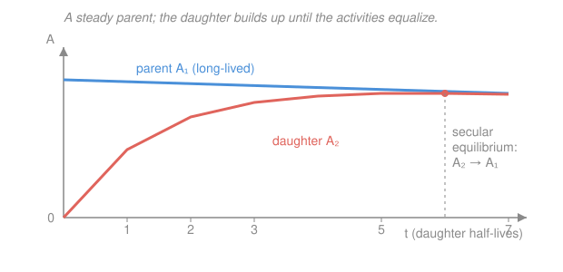

# Intro to Nuclear Engineering & Radiation · Lesson 1.4: Decay chains and equilibrium

> ⏱ ~15 min · Module 1: Nuclear structure, radioactivity & reactions · Builds on: [1.3 Radioactivity and the decay law](01-03-radioactivity-decay-law.md), [`ode-refresher` syllabus](../../ode-refresher/syllabus.md) · Unlocks: [1.5 Nuclear reactions and Q-values](01-05-nuclear-reactions-q-values.md)

## Why this matters

Most radioactive atoms don't decay to something stable in one hop — they decay into something that *also* decays, and so on down a chain, sometimes a dozen links long (all of natural uranium and thorium sit at the top of such chains). This has teeth in the real world: a "pure" $^{226}\text{Ra}$ source starts breeding radon gas the moment you seal it; a $^{99}\text{Mo}$ generator lets a hospital milk short-lived $^{99m}\text{Tc}$ for imaging every morning; and a reactor's spent fuel keeps making heat for years because of the chains still churning inside it. The organizing idea is **equilibrium** — the point where a daughter is created exactly as fast as it decays — and it's what makes all of this predictable.

## The idea

Picture a bucket with a hole in the bottom. Water pours in from a tap (the parent decaying *into* the daughter) and leaks out the hole (the daughter decaying *away*). The water level is the number of daughter atoms. Start empty: the level rises fast, but as it rises the leak speeds up (more atoms → more decays per second), until the leak-out rate exactly matches the pour-in rate. Now the level holds steady — **equilibrium**. It never overflowed and never will; it just settles where inflow equals outflow.

The one subtlety is that the tap isn't infinite — the parent is itself draining, so the inflow slowly weakens over time. Two cases matter. If the parent drains *incredibly* slowly compared to the daughter's leak (parent half-life $\gg$ daughter's), the tap looks essentially constant and the daughter settles to a fixed level whose outflow equals the parent's decay rate — the two **activities become equal**. That's **secular equilibrium**. If the parent drains merely *somewhat* slower than the daughter, the whole system eventually falls off together at the parent's pace, with the daughter running a hair *ahead* of the parent — **transient equilibrium**.

## The formal version

Write the chain parent $\to$ daughter $\to \cdots$ with decay constants $\lambda_1$ (parent) and $\lambda_2$ (daughter), and let $N_1(t), N_2(t)$ be their atom counts. The parent just decays as in [1.3](01-03-radioactivity-decay-law.md); the daughter is *fed* by the parent and *drained* by its own decay:

$$\frac{dN_1}{dt} = -\lambda_1 N_1, \qquad \frac{dN_2}{dt} = \underbrace{\lambda_1 N_1}_{\text{fed in}} - \underbrace{\lambda_2 N_2}_{\text{decays away}}.$$

*In words: the daughter's population changes at the rate its parent supplies it minus the rate it decays.* This is a coupled pair of first-order linear ODEs — exactly the machinery from [`ode-refresher`](../../ode-refresher/syllabus.md). Solving the second with $N_1(t)=N_1^0 e^{-\lambda_1 t}$ and an empty start $N_2(0)=0$ gives the two-step **Bateman equation**:

$$\boxed{\,N_2(t) = \frac{\lambda_1}{\lambda_2 - \lambda_1}\,N_1^0\left(e^{-\lambda_1 t} - e^{-\lambda_2 t}\right)\,}$$

*In words: the daughter count is the difference of two exponentials — one at the parent's slow pace, one at the daughter's fast pace.* You don't need to grind the derivation; you need to *read* it. At $t=0$ the two exponentials cancel, so $N_2=0$ ✓. The fast term $e^{-\lambda_2 t}$ dies first (the buildup), leaving the slow term $e^{-\lambda_1 t}$ to govern the long-time tail. The daughter's **activity** is $A_2 = \lambda_2 N_2$, and $A_1 = \lambda_1 N_1$ as always.

**Secular equilibrium ($\lambda_1 \ll \lambda_2$, i.e. $T_{1/2}^{\text{parent}} \gg T_{1/2}^{\text{daughter}}$).** Over any time short compared to the parent's life, $e^{-\lambda_1 t}\approx 1$ and $\lambda_2-\lambda_1\approx\lambda_2$, so the Bateman result collapses to a clean buildup-to-saturation:

$$A_2(t) = \lambda_2 N_2(t) \approx \lambda_1 N_1^0\left(1 - e^{-\lambda_2 t}\right) = A_1\left(1 - e^{-\lambda_2 t}\right) \;\xrightarrow{\;t \gg T_{1/2}^{\text{daughter}}\;}\; A_1.$$

*In words: the daughter's activity climbs and levels off at the parent's activity — after several daughter half-lives, $\lambda_1 N_1 = \lambda_2 N_2$, the two decay at the same number of events per second.* Same "$1-e^{-t/\tau}$" saturation curve as a capacitor charging through a resistor.

**Transient equilibrium ($\lambda_1 < \lambda_2$ but comparable).** Once the fast term $e^{-\lambda_2 t}$ has died, the daughter tracks the parent but keeps a fixed ratio:

$$\frac{A_2}{A_1} = \frac{\lambda_2}{\lambda_2 - \lambda_1} > 1.$$

*In words: the daughter's activity settles slightly above the parent's, and thereafter both fall off together at the parent's half-life.*

**Decay modes — what each does to $(Z,N)$.** A chain's every step is one of these. Here $Z$ = protons, $N$ = neutrons, $A=Z+N$ = mass number:

| Mode | Emits | $\Delta Z$ | $\Delta N$ | $\Delta A$ | Effect |
|---|---|---|---|---|---|
| $\alpha$ | $\ce{^{4}_{2}He}$ | $-2$ | $-2$ | $-4$ | sheds a helium nucleus (heavy nuclei) |
| $\beta^-$ | $\ce{e-} + \bar{\nu}_e$ | $+1$ | $-1$ | $0$ | a neutron turns into a proton |
| $\beta^+$ / EC | $\ce{e+}+\nu_e$ (or captures $\ce{e-}$) | $-1$ | $+1$ | $0$ | a proton turns into a neutron |
| $\gamma$ | photon | $0$ | $0$ | $0$ | de-excitation only — same nuclide |

*In words: $\alpha$ moves you down-left on the chart of nuclides by two boxes each way; the betas slide you one box along a diagonal of constant $A$; $\gamma$ just dumps excess energy without changing the species.*

## Picture

## Worked examples

**Example 1 (secular equilibrium — a radium source breeding radon).** Seal $^{226}\text{Ra}$ ($T_{1/2}=1600$ yr) with initial activity $A_1 = 3.7\times10^{4}\,\text{Bq}$ (1 μCi). It $\alpha$-decays to $^{222}\text{Rn}$ ($T_{1/2}=3.82$ d), a gas that itself decays. Find the radon's equilibrium activity and how long it takes to get there.

Because the parent's half-life (1600 yr) dwarfs the daughter's (3.82 d), this is textbook secular equilibrium — over weeks the radium activity is effectively constant, $A_1 = 3.7\times10^{4}\,\text{Bq}$. The radon builds as

$$A_2(t) = A_1\left(1 - e^{-\lambda_2 t}\right), \qquad \lambda_2 = \frac{\ln 2}{3.82\,\text{d}} = 0.181\ \text{d}^{-1}.$$

The ceiling is $A_2(\infty) = A_1 = 3.7\times10^{4}\,\text{Bq}$ — the radon ends up **just as active as the radium that feeds it**, even though only a nanogram-scale trace of it ever exists at once. Time to reach 99% of that (a common "good as equilibrium" bar): set $1-e^{-\lambda_2 t}=0.99$, so $e^{-\lambda_2 t}=0.01$ and

$$t = \frac{\ln 100}{\lambda_2} = \frac{4.605}{0.181\ \text{d}^{-1}} = 25.4\ \text{d} \approx 6.6\ \text{daughter half-lives}.$$

So a fresh, radon-purged radium source is back to full radon activity in about a month — the "several daughter half-lives" rule of thumb. (This is exactly why sealed radium sources and old radium-dial watches accumulate radon: the chain never lets you keep the parent alone.)

**Example 2 (balance a chain segment and name every step).** Track the top of the natural uranium ($4n+2$) series and identify each decay mode and its $(Z,N)$ shift:

$$\ce{^{238}_{92}U -> ^{234}_{90}Th -> ^{234}_{91}Pa -> ^{234}_{92}U}$$

Work step by step, checking that $A$ and $Z$ (hence $N=A-Z$) balance at every arrow.

1. $\ce{^{238}_{92}U -> ^{234}_{90}Th + ^{4}_{2}\alpha}$. Mass drops by 4, charge by 2 → **$\alpha$ decay**. $(Z,N)$: $(92,146)\to(90,144)$, so $\Delta Z=-2,\ \Delta N=-2$. ✓
2. $\ce{^{234}_{90}Th -> ^{234}_{91}Pa + \beta- + \bar{\nu}_e}$. $A$ fixed, $Z$ up by 1 → **$\beta^-$ decay** (a neutron became a proton). $(90,144)\to(91,143)$: $\Delta Z=+1,\ \Delta N=-1$. ✓
3. $\ce{^{234}_{91}Pa -> ^{234}_{92}U + \beta- + \bar{\nu}_e}$. Again $A$ fixed, $Z$ up by 1 → **$\beta^-$ decay**. $(91,143)\to(92,142)$: $\Delta Z=+1,\ \Delta N=-1$. ✓

The pattern is the signature of these series: an $\alpha$ step drops $A$ by 4 and pulls the nuclide *below* the valley of stability (too neutron-rich), and the neutron-rich fragment climbs back toward stability with one or two $\beta^-$ steps at constant $A$. Note $A$ only ever changes in units of 4 — which is why the four natural series are labeled $4n$, $4n+1$, $4n+2$, $4n+3$.

## Watch out

- **You might think the daughter's activity can't exceed the parent's.** In secular equilibrium it tops out *equal*, but in **transient** equilibrium the ratio is $\lambda_2/(\lambda_2-\lambda_1) > 1$ — the daughter runs slightly *above* the parent. (The generator workhorse $^{99}\text{Mo}\to{}^{99m}\text{Tc}$ lives here.)
- **You might read equilibrium as "equal numbers of atoms."** It's equal *activities*, not equal counts: $\lambda_1 N_1 = \lambda_2 N_2$. Since $\lambda_2 \gg \lambda_1$, you have far *fewer* daughter atoms than parent atoms — the short-lived daughter is a small, fast-cycling pool.
- **You might expect $\gamma$ emission to make a new element.** It doesn't touch $Z$ or $A$ — it's the same nuclide shedding excitation energy, usually a beat after an $\alpha$ or $\beta$ leaves the daughter in an excited state. The "$\gamma$" in a decay is bookkeeping for energy, not for identity.

## One-liner

> A daughter fills like a leaky bucket until its outflow matches the parent's inflow — and when the parent is long-lived, that balance means their activities become equal: $\lambda_1 N_1 = \lambda_2 N_2$.

## Problems

**P1 (🟢)** A very long-lived parent ($T_{1/2}=100$ yr) feeds a daughter with $T_{1/2}=6.0$ h, starting with no daughter present. (a) Once equilibrium is reached, how does the daughter's activity compare to the parent's? (b) Roughly how long until the daughter reaches about 97% of that level? (Use whole daughter half-lives.)

**P2 (🟡)** Balance each step and name the decay mode, giving $\Delta Z$ and $\Delta N$:

$$\ce{^{212}_{83}Bi -> ^{212}_{84}Po -> ^{208}_{82}Pb}$$

(The first arrow is one decay; the second is another. $^{208}\text{Pb}$ is stable — the series ends here.)

**P3 (🔴, optional)** In *secular* equilibrium the daughter atom count satisfies $\lambda_1 N_1 = \lambda_2 N_2$. For the Example 1 source ($A_1 = 3.7\times10^{4}\,\text{Bq}$, radon $\lambda_2 = 0.181\ \text{d}^{-1}$), how many radon-222 atoms are present at equilibrium? Comment on how that compares to the number of radium atoms (radium $\lambda_1 = \ln2/1600\ \text{yr}$).

Solutions

**P1** (a) Parent half-life (100 yr) $\gg$ daughter half-life (6 h), so this is **secular equilibrium**: the daughter's activity rises to *equal* the parent's, $A_2 = A_1$ (then $\lambda_1 N_1 = \lambda_2 N_2$). (b) Buildup follows $A_2 = A_1(1-e^{-\lambda_2 t})$; after $n$ daughter half-lives the fraction reached is $1-(1/2)^n$. Try values: $n=5\Rightarrow 1-1/32 = 0.969$ (96.9%). So about **5 half-lives $= 5\times6 = 30$ h**. *Check:* $n=4$ gives 93.8% (short), $n=6$ gives 98.4% (past) — 5 is the whole-half-life answer nearest 97%. ✓

**P2** Step 1: $\ce{^{212}_{83}Bi -> ^{212}_{84}Po + \beta- + \bar{\nu}_e}$. Mass number fixed at 212, $Z$ rises $83\to84$ → **$\beta^-$ decay**, $\Delta Z=+1,\ \Delta N=-1$ (neutrons $129\to128$). Step 2: $\ce{^{212}_{84}Po -> ^{208}_{82}Pb + ^{4}_{2}\alpha}$. Mass drops by 4, charge by 2 → **$\alpha$ decay**, $\Delta Z=-2,\ \Delta N=-2$ (neutrons $128\to126$). *Check:* end at $Z=82, N=126, A=208$ — doubly magic, hence stable. ✓ (Both $A$ and $Z$ balance across each arrow.)

**P3** At secular equilibrium $\lambda_2 N_2 = A_2 = A_1 = 3.7\times10^{4}\,\text{Bq}$. Convert $\lambda_2$ to per second: $\lambda_2 = 0.181\ \text{d}^{-1} \div 86400\ \text{s/d} = 2.10\times10^{-6}\ \text{s}^{-1}$. Then

$$N_2 = \frac{A_2}{\lambda_2} = \frac{3.7\times10^{4}\ \text{s}^{-1}}{2.10\times10^{-6}\ \text{s}^{-1}} = 1.76\times10^{10}\ \text{atoms of }^{222}\text{Rn}.$$

For radium, $\lambda_1 = \ln2 / (1600\times3.156\times10^{7}\,\text{s}) = 1.37\times10^{-11}\ \text{s}^{-1}$, so $N_1 = A_1/\lambda_1 = 3.7\times10^{4}/1.37\times10^{-11} = 2.7\times10^{15}$ atoms. The radon pool is about $N_1/N_2 = \lambda_2/\lambda_1 \approx 1.5\times10^{5}$ times *smaller* than the radium pool — same activity, vastly fewer atoms, because the daughter cycles roughly $10^5$ times faster. *Check:* the ratio $N_1/N_2$ equals $\lambda_2/\lambda_1$ exactly, as $\lambda_1 N_1=\lambda_2 N_2$ demands. ✓

## Flashback

**From Lesson 1.3 (Radioactivity and the decay law):** A fresh sample of iodine-131 ($T_{1/2}=8.02$ d) has an activity of $4.0\times10^{8}\,\text{Bq}$. (a) How many $^{131}\text{I}$ atoms does it contain? (b) What is its activity after 24 days?

Solution

(a) $\lambda = \ln2/T_{1/2} = 0.693/(8.02\times86400\ \text{s}) = 1.00\times10^{-6}\ \text{s}^{-1}$. From $A=\lambda N$,

$$N = \frac{A}{\lambda} = \frac{4.0\times10^{8}\ \text{s}^{-1}}{1.00\times10^{-6}\ \text{s}^{-1}} = 4.0\times10^{14}\ \text{atoms}.$$

(b) $24$ d is $24/8.02 = 2.99 \approx 3$ half-lives, so $A = A_0\,(1/2)^{3} = 4.0\times10^{8}/8 = 5.0\times10^{7}\,\text{Bq}$. *Check:* equivalently $A=A_0 e^{-\lambda t}$ with $\lambda t = (1.00\times10^{-6})(24\times86400)=2.07$, giving $e^{-2.07}=0.126$ and $A=5.0\times10^{7}\,\text{Bq}$ — same. ✓ (Three half-lives cut the source to one-eighth, the reason $^{131}\text{I}$ therapy patients clear most of their dose within a couple of weeks.)

## Connections

- **Backward:** the parent equation is untouched from [1.3](01-03-radioactivity-decay-law.md) — a single exponential $N_1=N_1^0 e^{-\lambda_1 t}$; this lesson just couples a second, fed population onto it, and $A=\lambda N$ still turns counts into activities.
- **Forward:** [1.5 Nuclear reactions and Q-values](01-05-nuclear-reactions-q-values.md) treats each decay step as a spontaneous reaction and computes its energy release from the mass differences; downstream, these very chains are the source of a reactor's post-shutdown **decay heat** (Module 3) and the backbone of the uranium/thorium fuel cycle that the [`nuclear-fuel-cycle`](../../nuclear-fuel-cycle/syllabus.md) shelf sequel is built on.
- **Sideways (E&M / ODEs):** the secular buildup $A_2 = A_1(1-e^{-\lambda_2 t})$ is *the same equation* as a capacitor charging through a resistor, $V=V_0(1-e^{-t/RC})$ from [`em-refresher`](../../em-refresher/syllabus.md) — inflow feeding a leaky reservoir to saturation — and the coupled system is a first-order linear ODE pair straight from [`ode-refresher`](../../ode-refresher/syllabus.md).
