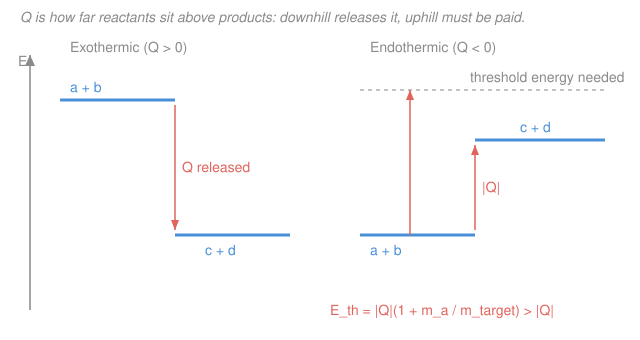

# Intro to Nuclear Engineering & Radiation · Lesson 1.5: Nuclear reactions and Q-values

> ⏱ ~15 min · Module 1: Nuclear structure, radioactivity & reactions · Builds on: [1.2 Binding energy & chart of nuclides](01-02-binding-energy-chart-of-nuclides.md), [1.4 Decay chains & equilibrium](01-04-decay-chains-equilibrium.md) · Unlocks: [Module 2 cross-sections](02-01-microscopic-cross-section.md), [3.1 The fission process](03-01-fission-process-energy.md)

## Why this matters

Every reactor, every neutron detector, every medical isotope is a *reaction* — you fire one nucleus at another and read off what comes out and how much energy rides along. Boron soaks up stray neutrons in a control rod because $^{10}\text{B}(n,\alpha)^{7}\text{Li}$ dumps 2.79 MeV every time; a $^{9}\text{Be}(\alpha,n)$ source lights up a neutron beam on a lab bench. Two questions decide whether a reaction is useful at all: **does it release energy or cost energy, and if it costs, how hard do you have to hit?** Both answers come from one number — the Q-value — and it's just mass-energy bookkeeping, the same $E=mc^2$ ledger you opened for binding energy.

## The idea

A nuclear reaction is a trade. Some nuclei walk in, some walk out, and the mass on the invoice almost never balances — because mass *is* energy here. Weigh everything before, weigh everything after, and the missing mass (times $c^2$) is the energy the reaction hands you. Call it $Q$.

If the products weigh *less* than the reactants, mass was converted to kinetic energy: the fragments fly apart faster than they came in. That's **exothermic**, $Q>0$ — energy released, no minimum push required (in principle a zero-energy neutron can trigger it). If the products weigh *more*, you have to *supply* the difference from the incoming kinetic energy: **endothermic**, $Q<0$, and now there's a speed limit below which the reaction simply can't happen.

Here's the twist that trips people up. For an endothermic reaction you might guess "just bring $|Q|$ of kinetic energy and you're set." Wrong — you need *more*. Momentum has to be conserved too, so the products can't come out at rest; some of your incoming energy is locked up keeping the center of mass moving forward and never becomes available to *make* the reaction. The energy you must actually bring is the **threshold**, and it always sits above $|Q|$.

## The formal version

**Reaction notation.** Write $\ce{a + X -> Y + b}$, or compactly $X(a,b)Y$: target $X$, projectile $a$ in the parentheses, light ejectile $b$, residual nucleus $Y$. Example:

$$\ce{^{10}_{5}B + ^{1}_{0}n -> ^{7}_{3}Li + ^{4}_{2}\alpha} \qquad\text{i.e.}\qquad {}^{10}\text{B}(n,\alpha)^{7}\text{Li}.$$

In words: read the shorthand as "target, then *(what goes in, what comes out)*, then what's left."

**Conservation laws — the bookkeeping.** Across any reaction:

- **Nucleon number $A$** is conserved (top numbers balance): $10+1 = 7+4$. ✓
- **Charge $Z$** is conserved (bottom numbers balance): $5+0 = 3+2$. ✓
- **Energy and momentum** are conserved *together* — the source of the threshold subtlety below.

In words: whatever total $A$ and $Z$ you start with, you end with — that's how you fill in a missing product.

**The Q-value.** Define

$$Q = \big[(m_a+m_X) - (m_b+m_Y)\big]\,c^2.$$

In words: Q is the rest-mass energy that vanished (reactants minus products); positive means energy came *out*, negative means energy had to go *in*. $Q>0$ exothermic, $Q<0$ endothermic.

Two equivalent ways to get $Q$ without ever writing $c^2$:

$$Q = \underbrace{\sum \Delta_{\text{reactants}} - \sum \Delta_{\text{products}}}_{\text{mass excesses }\Delta}\;=\;\underbrace{\sum B_{\text{products}} - \sum B_{\text{reactants}}}_{\text{binding energies }B}.$$

In words: the **mass excess** $\Delta = (M - A\,u)c^2$ (tabulated in MeV) works because $A$ is conserved so the $A\,u$ parts cancel — just add up excesses in, subtract excesses out. Equivalently, energy is released exactly when the products are *more tightly bound* than the reactants (that's the [B/A curve](01-02-binding-energy-chart-of-nuclides.md) doing its job).

**The threshold energy.** For an endothermic reaction ($Q<0$), the minimum lab-frame kinetic energy of the projectile is

$$E_{th} = |Q|\left(1 + \frac{m_a}{m_X}\right).$$

In words: you must bring $|Q|$ to pay the mass debt, *plus* a surcharge $|Q|\,m_a/m_X$ that stays locked in center-of-mass motion — the lighter the target relative to the projectile, the bigger the surcharge. (Exothermic reactions have no threshold; a resting projectile is already "downhill.")

## Picture

## Worked examples

**Example 1 — balance a reaction, then find Q (exothermic).** A thermal neutron hits boron-10; one product is lithium-7. Fill in the other product and find Q.

$$\ce{^{10}_{5}B + ^{1}_{0}n -> ^{7}_{3}Li + ^{A}_{Z}X}$$

*Balance.* Nucleons: $10+1-7 = 4$, so $A=4$. Charge: $5+0-3 = 2$, so $Z=2$. That's $\ce{^{4}_{2}He}$ — an $\alpha$ particle:

$$\ce{^{10}_{5}B + ^{1}_{0}n -> ^{7}_{3}Li + ^{4}_{2}\alpha}.$$

*Q from mass excesses* (in MeV): $\Delta(^{10}\text{B})=12.051$, $\Delta(n)=8.071$, $\Delta(^{7}\text{Li})=14.907$, $\Delta(^{4}\text{He})=2.425$.

$$Q = \big[\Delta(^{10}\text{B})+\Delta(n)\big] - \big[\Delta(^{7}\text{Li})+\Delta(^{4}\text{He})\big] = (12.051+8.071)-(14.907+2.425).$$

$$Q = 20.122 - 17.332 = +2.79\ \text{MeV}.$$

Positive → **exothermic**. Every capture releases 2.79 MeV shared as kinetic energy between the recoiling $^{7}\text{Li}$ and the $\alpha$ — which is exactly why $^{10}\text{B}$ lines control rods and neutron detectors. No threshold: even a zero-energy neutron sets it off (that's what "thermal" boron capture means).

**Example 2 — an endothermic reaction and its threshold.** Rutherford's 1919 transmutation, the first ever induced: fire $\alpha$ particles at nitrogen-14, knock out a proton.

$$\ce{^{14}_{7}N + ^{4}_{2}\alpha -> ^{17}_{8}O + ^{1}_{1}p} \qquad {}^{14}\text{N}(\alpha,p)^{17}\text{O}.$$

Check the books: $A$: $14+4 = 17+1$ ✓; $Z$: $7+2 = 8+1$ ✓. Mass excesses: $\Delta(^{14}\text{N})=2.863$, $\Delta(^{4}\text{He})=2.425$, $\Delta(^{17}\text{O})=-0.809$, $\Delta(^{1}\text{H})=7.289$.

$$Q = (2.863+2.425) - (-0.809+7.289) = 5.288 - 6.480 = -1.19\ \text{MeV}.$$

Negative → **endothermic**. So $\alpha$'s carrying at least 1.19 MeV? Not quite — momentum conservation adds a surcharge. The projectile is the $\alpha$ ($m_a\approx 4$), the target is $^{14}\text{N}$ ($m_X\approx 14$):

$$E_{th} = |Q|\left(1+\frac{m_a}{m_X}\right) = 1.19\left(1+\frac{4}{14}\right) = 1.19 \times 1.286 = 1.53\ \text{MeV}.$$

You must fire $\alpha$'s with **at least 1.53 MeV** — a full 0.34 MeV above $|Q|$ — before a single proton comes out. Below threshold, the reaction is flatly impossible no matter how many $\alpha$'s you throw.

## Watch out

- **You might think $Q<0$ just means "bring $|Q|$."** But the threshold is $|Q|(1+m_a/m_X)$, always *larger*. The extra energy is stuck in center-of-mass motion and never available to the reaction. The mismatch shrinks as the target gets heavy ($m_a/m_X\to 0$) — which is why a heavy target is an efficient anvil.
- **You might worry about electron masses.** Tabulated $\Delta$ and atomic masses *include* the atomic electrons. When charge $Z$ is conserved (it always is), the electron masses cancel between the two sides — so you can use atomic values directly. The lone exception is $\beta^+$ decay, where an extra $2m_ec^2$ correction sneaks in; ordinary $(a,b)$ reactions are safe.
- **You might expect exothermic reactions to run for free.** $Q>0$ removes the *energy* barrier, but two positive nuclei still repel — the **Coulomb barrier** can keep them apart until they're fast enough (or tunnel through). Neutrons dodge this entirely (no charge), which is why neutron-induced reactions like Example 1 fire at thermal energies while [fusion](04-01-fusion-basics.md) needs millions of kelvin despite its huge positive $Q$.

## One-liner

> Q is the mass that turned into motion — positive pays you, negative charges you, and an endothermic charge always costs more than $|Q|$ because momentum keeps some energy for itself.

## Problems

**P1 (🟢)** The deuterium–tritium fusion reaction is $\ce{^{2}_{1}H + ^{3}_{1}H -> ^{4}_{2}He + ^{1}_{0}n}$. Confirm it balances, then compute $Q$ from the mass excesses $\Delta(^{2}\text{H})=13.136$, $\Delta(^{3}\text{H})=14.950$, $\Delta(^{4}\text{He})=2.425$, $\Delta(n)=8.071$ (MeV). Is it exo- or endothermic?

**P2 (🟡)** The reaction $\ce{^{7}_{3}Li + ^{1}_{1}p -> ^{7}_{4}Be + ^{1}_{0}n}$ is a standard bench-top neutron source. Using $\Delta(^{7}\text{Li})=14.907$, $\Delta(^{1}\text{H})=7.289$, $\Delta(^{7}\text{Be})=15.769$, $\Delta(n)=8.071$ (MeV): (a) find $Q$; (b) find the proton threshold energy. (Projectile is the proton, $m_a\approx 1$; target is $^{7}\text{Li}$, $m_X\approx 7$.)

**P3 (🔴, optional)** A gamma photodisintegrates a deuteron: $\ce{^{2}_{1}H + \gamma -> ^{1}_{1}p + ^{1}_{0}n}$. Using $\Delta(^{2}\text{H})=13.136$, $\Delta(^{1}\text{H})=7.289$, $\Delta(n)=8.071$ (MeV): find $Q$, and explain in one line why the minimum photon energy equals the [deuteron's binding energy](01-02-binding-energy-chart-of-nuclides.md).

Solutions

**P1** Balance: $A$: $2+3=4+1$ ✓; $Z$: $1+1=2+0$ ✓.

$$Q = (13.136+14.950)-(2.425+8.071) = 28.086 - 10.496 = +17.59\ \text{MeV}.$$

Positive → **exothermic**, and enormously so per nucleon — this ~17.6 MeV is the prize [4.1 Fusion basics](04-01-fusion-basics.md) is chasing. (Most of it, ~14.1 MeV, rides off with the neutron because momentum splits the energy inversely to mass.)

**P2** (a) $Q = (14.907+7.289)-(15.769+8.071) = 22.196 - 23.840 = -1.64\ \text{MeV}$ → **endothermic**.

(b) Threshold with $m_a/m_X \approx 1/7$:

$$E_{th} = |Q|\left(1+\frac{1}{7}\right) = 1.64 \times 1.143 = 1.88\ \text{MeV}.$$

So protons must exceed ~1.88 MeV before this source emits neutrons — the well-known threshold that makes $^{7}\text{Li}(p,n)$ a tunable, sharp-onset neutron source.

**P3** $Q = 13.136 - (7.289+8.071) = 13.136 - 15.360 = -2.22\ \text{MeV}$ → endothermic. Splitting a deuteron into a free proton and neutron is exactly *undoing* its binding, so $|Q|$ equals the deuteron binding energy $B = [\,m_p+m_n-m_d\,]c^2 = 2.22$ MeV. The photon carries no rest mass and (nearly) no momentum surcharge here, so the minimum photon energy $\approx |Q| = 2.22$ MeV — the classic measurement of the deuteron's binding.

## Flashback

**From Lesson 1.4 (decay modes and the $(Z,N)$ shift):** Uranium-238, $\ce{^{238}_{92}U}$, alpha-decays to a daughter, which then beta-minus decays. Give the atomic number $Z$, neutron number $N$, and mass number $A$ of *both* daughters, and name the elements.

Solution

**After $\alpha$ decay** (lose 2 protons + 2 neutrons, so $A\!-\!4$, $Z\!-\!2$): $Z=90$, $A=234$, $N=234-90=144$ → **thorium-234**, $\ce{^{234}_{90}Th}$.

**After $\beta^-$ decay** (a neutron becomes a proton: $Z\!+\!1$, $A$ unchanged): $Z=91$, $A=234$, $N=234-91=143$ → **protactinium-234**, $\ce{^{234}_{91}Pa}$.

These are the first two steps of the natural U-238 series from [1.4](01-04-decay-chains-equilibrium.md). Same conservation bookkeeping as a reaction — $A$ and $Z$ must balance every step.

## Connections

- **Backward:** the Q-value is [1.2](01-02-binding-energy-chart-of-nuclides.md)'s mass-defect ledger applied to a *reaction* instead of a single nucleus; "products more tightly bound → energy released" is the B/A curve read sideways. The decay in the Flashback is just the special case of a reaction with no projectile.
- **Forward:** $Q$ tells you *how much* energy per event; [Module 2](02-01-microscopic-cross-section.md)'s cross-sections tell you *how often* it happens, and [3.1 Fission](03-01-fission-process-energy.md) is the ~200 MeV Q-value that runs a reactor. Endothermic thresholds reappear as reaction *onsets* on the cross-section-vs-energy curve.
- **Sideways (relativity):** $Q=\Delta m\,c^2$ is Einstein's mass–energy equivalence made arithmetic — the same equation that governs `relativity`, here weighed out in MeV. The threshold surcharge is a lab-frame vs. center-of-mass frame accounting, the same frame-shifting that relativistic kinematics formalizes.
