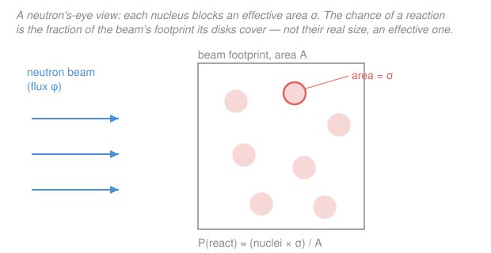

# Intro to Nuclear Engineering & Radiation · Lesson 2.1: The microscopic cross-section

> ⏱ ~15 min · Module 2: Neutron cross-sections & interactions · Builds on: [1.5 Nuclear reactions & Q-values](01-05-nuclear-reactions-q-values.md), [1.3 Radioactivity & the decay law](01-03-radioactivity-decay-law.md) · Unlocks: [2.2 Macroscopic cross-section & mean free path](02-02-macroscopic-cross-section-mean-free-path.md)

## Why this matters

A reactor is a bookkeeping problem in neutrons: every one born in fission either finds a nucleus to react with or leaks away, and the whole art of criticality is tilting those odds. But a neutron is neutral — it feels no Coulomb push, so whether it hits a given nucleus is pure chance. We need a number that captures "how likely is *this* reaction with *this* nucleus," and that number is the **cross-section** $\sigma$. It is the single most-used quantity in nuclear engineering: control-rod worth, shielding thickness, detector efficiency, and the fission rate that sets a reactor's power all trace back to a $\sigma$.

## The idea

Picture standing behind a nucleus and asking: as neutrons stream past, how big a *bullseye* does this nucleus present? Not its literal physical size — a slow neutron can be captured by a nucleus far larger than the nucleus's radius would suggest, and a fast neutron can sail through one that looks huge to a slow one. So we invent an **effective area**: imagine each nucleus carries an invisible disk of area $\sigma$, and a neutron "reacts" exactly when its straight-line path would strike that disk. Bigger disk, more reactions. That disk area *is* the cross-section.

The payoff is that reaction probability becomes geometry. Send a beam at a thin sheet of nuclei and the fraction of neutrons that react is just the **fraction of the sheet's face that the disks cover** — total disk area over total area. Double the disks (more nuclei) or fatten each disk (larger $\sigma$) and twice as many neutrons react. This is why $\sigma$ has units of area even though nothing about it is really geometric: it is a probability dressed up as a target.

One nucleus can offer *several* disks stacked at the same spot — one for "bounce off" (scatter), one for "swallow the neutron" (capture), one for "split" (fission). A neutron that lands on the overlap reacts via whichever channel that disk belongs to. The total disk is the sum, and the *relative* areas tell you which outcome is likely.

## The formal version

**Microscopic cross-section.** For a beam of monoenergetic neutrons striking a single target nucleus, define

$$\sigma \equiv \frac{\text{reactions per second with this nucleus}}{\text{beam intensity } I},$$

where the **beam intensity** (or flux) $I$ has units of neutrons per cm² per second. Since the numerator is per-second and $I$ is per-cm²-per-second, $\sigma$ comes out in **cm²**. *In words: $\sigma$ is the effective target area that converts an incoming particle current into a reaction rate.*

Because a bare nucleus is only about $10^{-12}$ cm across, its geometric area is $\sim 10^{-24}\ \text{cm}^2$, so cross-sections are naturally sized in

$$1\ \text{barn} = 10^{-24}\ \text{cm}^2.$$

*In words: the barn is the nucleus-sized unit of area — one barn is roughly the physical footprint of a mid-weight nucleus, and cross-sections run from a fraction of a barn to thousands of barns.* (The name is a joke: to a neutron, a big cross-section is "as easy to hit as a barn door.")

**Reaction rate.** Rearranging the definition, one target nucleus in a beam of intensity $I$ reacts at rate

$$r = \sigma\, I \qquad [\text{reactions per second per nucleus}].$$

*In words: multiply the effective area by how hard the beam is raining down.* For a chunk of material with number density $N$ nuclei per cm³ bathed in a **flux** $\phi$ (neutrons cm⁻² s⁻¹), every nucleus reacts at rate $\sigma\phi$, so the **reaction rate density** is

$$\boxed{\,R = \sigma\,\phi\,N\,} \qquad [\text{reactions cm}^{-3}\,\text{s}^{-1}].$$

*In words: reactions per unit volume per second = area per nucleus × how many neutrons sweep by × how many nuclei are packed in.* (For a fixed target of $N_{\text{tot}}$ nuclei in a beam, the total rate is simply $R_{\text{tot}} = \sigma\, I\, N_{\text{tot}}$ — same product, with $N_{\text{tot}}$ a count instead of a density.) Flux $\phi$ is the workhorse in a reactor, where neutrons fly every direction; intensity $I$ is its one-directional beam cousin. The product $\sigma\phi$ has units of s⁻¹ — the **per-nucleus reaction rate**, the odds any one nucleus reacts each second.

**Reaction channels.** A neutron meeting a nucleus can do several distinct things, each with its own cross-section:

- $\sigma_s$ — **scattering** (the neutron bounces off, elastic or inelastic);
- $\sigma_\gamma$ — **radiative capture** (the nucleus swallows the neutron and emits a $\gamma$, the $(n,\gamma)$ reaction);
- $\sigma_f$ — **fission** (the nucleus splits);
- plus other absorptions like $(n,\alpha)$, $(n,p)$, …

Group them into **absorption** (anything that consumes the neutron) and total:

$$\sigma_a = \sigma_\gamma + \sigma_f + \cdots, \qquad \sigma_t = \sigma_s + \sigma_a.$$

*In words: absorption $\sigma_a$ is every channel where the neutron does not survive as a free neutron; the total $\sigma_t$ adds scattering back in — it is the cross-section for "anything happens at all."* Because cross-sections are effective areas of independent outcomes, they simply **add** — and each individual rate is $R_x = \sigma_x\,\phi\,N$ with the same flux and density.

## Picture

## Worked examples

**Example 1 (reaction rate — mind the barn).** A thin gold foil ($^{197}\text{Au}$, density $\rho = 19.3\ \text{g/cm}^3$, atomic mass $M = 197\ \text{g/mol}$) sits in a thermal neutron flux $\phi = 1.0\times10^{12}\ \text{n cm}^{-2}\text{s}^{-1}$. Gold's radiative-capture cross-section is $\sigma_\gamma = 98.7\ \text{barn}$. Find the capture rate density.

First the number density (from [1.1](01-01-nucleus-bookkeeping.md)'s bookkeeping),

$$N = \frac{\rho N_A}{M} = \frac{19.3 \times 6.022\times10^{23}}{197} = 5.90\times10^{22}\ \text{cm}^{-3}.$$

Now convert the cross-section — **this is where units go to die**:

$$\sigma_\gamma = 98.7\ \text{barn} \times 10^{-24}\ \tfrac{\text{cm}^2}{\text{barn}} = 9.87\times10^{-23}\ \text{cm}^2.$$

Then

$$R = \sigma_\gamma\,\phi\,N = (9.87\times10^{-23})(1.0\times10^{12})(5.90\times10^{22}) = 5.82\times10^{12}\ \text{captures cm}^{-3}\text{s}^{-1}.$$

Sanity: the *per-nucleus* rate is $\sigma_\gamma\phi = 9.87\times10^{-23}\times10^{12} = 9.87\times10^{-11}\ \text{s}^{-1}$ — any one gold nucleus waits $\sim 10^{10}\ \text{s}$ (centuries) between captures, yet with $\sim 10^{22}$ of them per cm³ the foil still logs trillions of captures per second. That is the whole point of $N$.

**Example 2 (splitting the interactions among channels).** Thermal neutrons ($2200\ \text{m/s}$) strike $^{235}\text{U}$, which has (illustrative $2200\ \text{m/s}$ values) $\sigma_s = 15\ \text{barn}$, $\sigma_\gamma = 99\ \text{barn}$, $\sigma_f = 585\ \text{barn}$. Of all interactions, what fraction are fissions? And *given* a neutron is absorbed, what fraction fission?

Build the sums:

$$\sigma_a = \sigma_\gamma + \sigma_f = 99 + 585 = 684\ \text{barn}, \qquad \sigma_t = \sigma_s + \sigma_a = 15 + 684 = 699\ \text{barn}.$$

The barns cancel in every ratio (all channels see the same $\phi$ and $N$), so probabilities are pure cross-section fractions:

$$\frac{\sigma_f}{\sigma_t} = \frac{585}{699} = 0.837, \qquad \frac{\sigma_f}{\sigma_a} = \frac{585}{684} = 0.855.$$

*In words: about **84%** of all interactions are fissions, and of the neutrons that get absorbed, about **86%** fission while the other 14% are lost to capture.* That capture-to-fission ratio $\alpha = \sigma_\gamma/\sigma_f = 99/585 = 0.17$ is exactly the leak that reappears in [3.2](03-02-fission-products-neutron-yield.md) when we count how many new neutrons each absorption really buys.

## Watch out

- **You might think $\sigma$ is the nucleus's physical size.** It is not — it is a *probability* wearing area's clothing. A slow neutron gives $^{135}\text{Xe}$ a cross-section of millions of barns, thousands of times its geometric footprint, because the neutron lingers long enough to be caught. Cross-sections also swing wildly with energy (that's [2.3](02-03-energy-dependence-1-over-v-resonances.md)); "a barn" is never a fixed property of a nuclide.
- **Don't confuse intensity/flux with rate.** $\phi$ is neutrons *passing through* per cm² per second; $R = \sigma\phi N$ is reactions *happening* per cm³ per second. Flux is traffic; rate is collisions. They share no units.
- **Keep $\sigma_t = \sigma_s + \sigma_a$, not $\sigma_s + \sigma_f$.** Scattering is not absorption, and fission is only *part* of absorption. Forgetting radiative capture inside $\sigma_a$ overcounts the neutrons available to fission — a mistake that quietly inflates every criticality estimate downstream.

## One-liner

> The cross-section $\sigma$ is the effective bullseye a nucleus presents; multiply it by the neutron traffic $\phi$ and the target count $N$ and you get the reaction rate — $R = \sigma\phi N$.

## Problems

**P1 (🟢)** A material with number density $N = 4.0\times10^{22}\ \text{cm}^{-3}$ sits in a flux $\phi = 5.0\times10^{13}\ \text{n cm}^{-2}\text{s}^{-1}$. The reaction cross-section is $\sigma = 2.0\ \text{barn}$. Find the reaction rate density $R$, and the per-nucleus reaction rate $\sigma\phi$.

**P2 (🟡)** A nuclide exposed to a neutron beam has $\sigma_s = 4\ \text{barn}$, $\sigma_\gamma = 6\ \text{barn}$, $\sigma_f = 40\ \text{barn}$. Find $\sigma_a$ and $\sigma_t$. What fraction of all interactions are fissions, and — given that a neutron is absorbed — what fraction fission?

**P3 (🔴)** An experimenter measures a reaction rate density $R = 1.2\times10^{12}\ \text{cm}^{-3}\text{s}^{-1}$ in a foil of number density $N = 6.0\times10^{22}\ \text{cm}^{-3}$ held in a flux $\phi = 2.0\times10^{12}\ \text{n cm}^{-2}\text{s}^{-1}$. Infer the cross-section $\sigma$ and report it in barns. (This is how cross-sections are *measured* — invert $R = \sigma\phi N$.)

Solutions

**P1** Convert the barn first: $\sigma = 2.0\times10^{-24}\ \text{cm}^2$. Then

$$R = \sigma\,\phi\,N = (2.0\times10^{-24})(5.0\times10^{13})(4.0\times10^{22}) = 4.0\times10^{12}\ \text{reactions cm}^{-3}\text{s}^{-1}.$$

Per-nucleus rate: $\sigma\phi = (2.0\times10^{-24})(5.0\times10^{13}) = 1.0\times10^{-10}\ \text{s}^{-1}$ — each nucleus reacts once every $\sim10^{10}$ s on average.

*Check.* Units: $\text{cm}^2 \cdot \text{cm}^{-2}\text{s}^{-1} \cdot \text{cm}^{-3} = \text{cm}^{-3}\text{s}^{-1}$ ✓. And $R = (\sigma\phi)\,N = (1.0\times10^{-10})(4.0\times10^{22}) = 4.0\times10^{12}$ ✓ — consistent two ways.

**P2** Sums:

$$\sigma_a = \sigma_\gamma + \sigma_f = 6 + 40 = 46\ \text{barn}, \qquad \sigma_t = \sigma_s + \sigma_a = 4 + 46 = 50\ \text{barn}.$$

Fraction of *all* interactions that fission:

$$\frac{\sigma_f}{\sigma_t} = \frac{40}{50} = 0.80 = 80\%.$$

Fraction of *absorptions* that fission:

$$\frac{\sigma_f}{\sigma_a} = \frac{40}{46} = 0.870 = 87.0\%.$$

*Check.* The three interaction fractions must sum to 1: scatter $4/50 = 0.08$, capture $6/50 = 0.12$, fission $40/50 = 0.80$; total $= 1.00$ ✓. And conditioning on absorption drops the scattering channel, so $\sigma_f/\sigma_a > \sigma_f/\sigma_t$ ✓.

**P3** Invert the rate law: $\sigma = \dfrac{R}{\phi N}$.

$$\sigma = \frac{1.2\times10^{12}}{(2.0\times10^{12})(6.0\times10^{22})} = \frac{1.2\times10^{12}}{1.2\times10^{35}} = 1.0\times10^{-23}\ \text{cm}^2.$$

Convert back to barns: $\sigma = 1.0\times10^{-23}\ \text{cm}^2 \div 10^{-24}\ \tfrac{\text{cm}^2}{\text{barn}} = 10\ \text{barn}.$

*Check.* Units: $(\text{cm}^{-3}\text{s}^{-1})/[(\text{cm}^{-2}\text{s}^{-1})(\text{cm}^{-3})] = \text{cm}^2$ ✓, and $10$ barn is a plausible mid-range value. ✓

## Flashback

**From Lesson 1.3 (Radioactivity & the decay law):** A sample of $^{24}\text{Na}$ ($T_{1/2} = 15\ \text{h}$) has an activity of $8.0\times10^{8}\ \text{Bq}$. Find (a) the decay constant $\lambda$, (b) the number of $^{24}\text{Na}$ atoms present, and (c) the activity after $30\ \text{h}$.

Solution

(a) Work in seconds: $T_{1/2} = 15\ \text{h} = 5.4\times10^{4}\ \text{s}$, so

$$\lambda = \frac{\ln 2}{T_{1/2}} = \frac{0.693}{5.4\times10^{4}\ \text{s}} = 1.28\times10^{-5}\ \text{s}^{-1}.$$

(b) From $A = \lambda N$,

$$N = \frac{A}{\lambda} = \frac{8.0\times10^{8}}{1.28\times10^{-5}} = 6.24\times10^{13}\ \text{atoms}.$$

(c) $30\ \text{h}$ is exactly two half-lives, so activity halves twice:

$$A = 8.0\times10^{8} \times \left(\tfrac12\right)^{2} = 2.0\times10^{8}\ \text{Bq}.$$

*Check.* Units on $\lambda$: $\text{s}^{-1}$ ✓; on $N$: $\text{Bq}/\text{s}^{-1} = \text{s}^{-1}/\text{s}^{-1} = $ dimensionless count ✓. Two half-lives → factor $\tfrac14$, matching $2.0\times10^{8}$ ✓. Notice the structural echo: activity is $A = \lambda N$ and reaction rate is $R = (\sigma\phi)N$ — both are a *per-atom rate* times the *number of atoms*, with $\lambda$ (spontaneous) playing the role of $\sigma\phi$ (beam-driven).

## Connections

- **Backward:** this builds directly on [1.5](01-05-nuclear-reactions-q-values.md)'s reaction channels — $(n,\gamma)$, $(n,f)$, $(n,\alpha)$ each balanced and Q-valued there now get a *probability* here, one $\sigma$ per channel. The number density $N$ came from [1.1](01-01-nucleus-bookkeeping.md), and the Flashback shows $R = \sigma\phi N$ is the same "rate = per-unit-rate × count" template as the decay law $A = \lambda N$ in [1.3](01-03-radioactivity-decay-law.md).
- **Forward:** [2.2](02-02-macroscopic-cross-section-mean-free-path.md) bundles all $N$ nuclei into the **macroscopic** cross-section $\Sigma = N\sigma$ (units cm⁻¹), turning $R = \Sigma\phi$ and giving beam attenuation $e^{-\Sigma x}$ and the mean free path $1/\Sigma$. [2.3](02-03-energy-dependence-1-over-v-resonances.md) then makes $\sigma$ a function of neutron energy, and the fission fraction from Example 2 feeds the four-factor formula in [3.4](03-04-criticality-four-factor-formula.md).
- **Sideways (probability & kinetic theory):** the "fraction of area covered by disks" argument is the same collision-cylinder reasoning behind mean free path in the kinetic theory of gases — swap neutron-on-nuclei for molecule-on-molecule and $\sigma$ is the collision cross-section (see [`prob-stat-refresher`](../../prob-stat-refresher/syllabus.md) for the probability spine and any kinetic-theory treatment in statistical mechanics).
