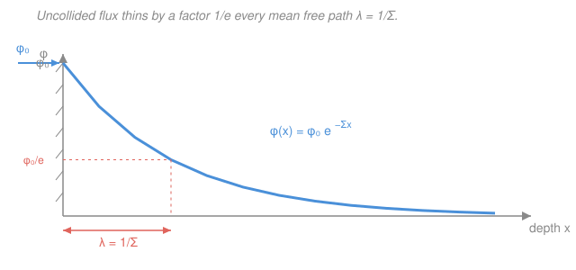

# Intro to Nuclear Engineering & Radiation · Lesson 2.2: Macroscopic cross-section and mean free path

> ⏱ ~15 min · Module 2: Neutron cross-sections & interactions · Builds on: [2.1 The microscopic cross-section](02-01-microscopic-cross-section.md) · Unlocks: [2.3 Energy dependence: 1/v and resonances](02-03-energy-dependence-1-over-v-resonances.md)

## Why this matters

A single nucleus offers a tiny target $\sigma$ — a few barns, $10^{-24}\,\text{cm}^2$. But a cubic centimetre of solid packs $\sim 10^{23}$ of them, and *that* is what a neutron actually flies into. Bundle "target area" and "how many targets per unit volume" into one number, the **macroscopic cross-section** $\Sigma$, and two of the most-used results in the whole field fall out for free: how far a neutron travels before it hits something (the **mean free path**), and how a beam thins as it bores into matter ($e^{-\Sigma x}$). This is the same exponential you'll meet again as gamma attenuation in shielding — learn it once here.

## The idea

Think of walking blindfolded through a forest. One tree is easy to miss. But pack the trees densely enough and you *will* hit one within a few steps — and how soon depends on two things only: how fat each trunk is, and how many trunks per acre. Neutrons through matter are the same story. The microscopic cross-section $\sigma$ is the fatness of one trunk; the number density $N$ is how many trunks per cubic centimetre. Multiply them and you get a single "hittiness" of the material per centimetre of travel — that's $\Sigma$.

Because $\Sigma$ has units of "interaction probability per centimetre," it directly answers the two questions you care about. Its **reciprocal** $1/\Sigma$ is the average distance a neutron coasts before its next collision — the mean free path, exactly like "average steps between tree-hits." And if you send in a *beam*, each slice of material removes a fixed *fraction* of whatever is left, which is the fingerprint of exponential decay: the beam falls off as $e^{-\Sigma x}$. Constant fractional loss per step, forever — same math as radioactive decay, just distance instead of time.

## The formal version

**Number density.** The count of target nuclei per cubic centimetre in a pure material of mass density $\rho$ (g/cm³) and atomic (or molar) mass $M$ (g/mol) is

$$N = \frac{\rho\,N_A}{M}, \qquad N_A = 6.022\times10^{23}\ \text{mol}^{-1}.$$

*In words: grams per cm³, divided by grams per mole, times atoms per mole — the grams cancel and you're left with atoms per cm³.*

**Macroscopic cross-section.** Combine target area with target density:

$$\boxed{\ \Sigma = N\sigma\ } \qquad [\Sigma] = \text{cm}^{-1}.$$

*In words: $\Sigma$ is the total interaction cross-sectional area presented by all the nuclei in one cm³ — equivalently, the probability per unit path length that a neutron interacts.* Check the units: $(\text{cm}^{-3})(\text{cm}^2) = \text{cm}^{-1}$. A neutron travelling a short distance $dx$ has probability $\Sigma\,dx$ of interacting in that step.

**Uncollided-flux attenuation.** Send a beam of flux $\phi_0$ (neutrons cm⁻² s⁻¹) into a slab. Over a slice $dx$ it loses the fraction $\Sigma_t\,dx$ of what remains: $d\phi = -\Sigma_t\,\phi\,dx$. Integrating,

$$\boxed{\ \phi(x) = \phi_0\, e^{-\Sigma_t x}\ }$$

where $\Sigma_t$ is the **total** macroscopic cross-section (any interaction counts as removal from the straight-ahead beam). *In words: the surviving, never-yet-collided flux dies exponentially with depth.* This same first-order ODE, $y' = -\Sigma_t y$, gave the decay law $N(t) = N_0 e^{-\lambda t}$ in [1.3](01-03-radioactivity-decay-law.md) — $\Sigma_t$ plays the role of $\lambda$, depth plays the role of time.

**Mean free path.** The average distance between interactions is

$$\lambda_{\text{mfp}} = \frac{1}{\Sigma}.$$

*In words: if the beam drops by a factor $1/e$ over a distance $1/\Sigma$, then $1/\Sigma$ is the mean coasting distance between collisions.* (Formally, $\lambda_{\text{mfp}} = \int_0^\infty x\,\Sigma e^{-\Sigma x}\,dx = 1/\Sigma$ — the mean of an exponential.) Big $\Sigma$, short hops; small $\Sigma$, long glides.

**Additivity.** $\Sigma$ is built from a rate ($N\sigma$), and rates add. So it adds two ways:

$$\Sigma_t = \Sigma_s + \Sigma_a \qquad\text{(over reaction channels)}, \qquad \Sigma = \sum_i N_i \sigma_i \qquad\text{(over nuclides)}.$$

*In words: total = scatter + absorb; and a mixture or compound just sums each nuclide's own $N_i\sigma_i$ contribution.* The cross-sections here are the ones for the neutron's *current* energy — a crucial caveat that [2.3](02-03-energy-dependence-1-over-v-resonances.md) unpacks.

## Picture

## Worked examples

**Example 1 (why boron eats neutrons — the boss calculation).** Natural boron: density $\rho = 2.34\,\text{g/cm}^3$, atomic mass $M = 10.8\,\text{g/mol}$. Only the $^{10}\text{B}$ isotope (19.9% of natural boron) is the strong absorber, with thermal $\sigma_a = 3840\,\text{barn}$. Find $\Sigma_a$, the absorption mean free path, and the fraction absorbed in a 1 mm slab.

*Step 1 — number density of boron atoms:*

$$N = \frac{\rho N_A}{M} = \frac{2.34 \times 6.022\times10^{23}}{10.8} = 1.30\times10^{23}\ \text{atoms/cm}^3.$$

*Step 2 — keep only the $^{10}\text{B}$ nuclei* (they're the ones with the big $\sigma_a$):

$$N_{10} = 0.199 \times 1.30\times10^{23} = 2.60\times10^{22}\ \text{cm}^{-3}.$$

*Step 3 — macroscopic absorption cross-section* (convert barns: $3840\,\text{b} = 3840\times10^{-24}\,\text{cm}^2 = 3.84\times10^{-21}\,\text{cm}^2$):

$$\Sigma_a = N_{10}\,\sigma_a = (2.60\times10^{22})(3.84\times10^{-21}) \approx 100\ \text{cm}^{-1}.$$

*Step 4 — mean free path:*

$$\lambda_{\text{mfp}} = \frac{1}{\Sigma_a} = \frac{1}{100} = 0.010\ \text{cm} = 0.1\ \text{mm}.$$

A neutron travels only a *tenth of a millimetre*, on average, before boron swallows it. *Step 5 — a 1 mm slab is ten mean free paths thick* ($\Sigma_a x = 100 \times 0.1 = 10$), so the uncollided fraction getting through is $e^{-10} = 4.7\times10^{-5}$, and the fraction absorbed is

$$1 - e^{-\Sigma_a x} = 1 - 4.7\times10^{-5} \approx 0.99995 \approx 100\%.$$

**That is why boron runs control rods and reactor shutdown systems:** a paper-thin layer is an essentially perfect neutron sponge. (This is Boss Problem 2 — same numbers.)

**Example 2 (additivity — water as a compound).** Why is water a moderator, not an absorber? Compute its scattering vs. absorption $\Sigma$. Water: $\rho = 1.0\,\text{g/cm}^3$, $M = 18\,\text{g/mol}$; thermal cross-sections $\sigma_s(\text{H})\approx 20\,\text{b}$, $\sigma_s(\text{O})\approx 3.8\,\text{b}$, $\sigma_a(\text{H})\approx 0.33\,\text{b}$ (oxygen absorbs negligibly).

*Molecule density, then nuclide densities* (2 H and 1 O per molecule):

$$N_{\text{mol}} = \frac{1.0 \times 6.022\times10^{23}}{18} = 3.35\times10^{22}\ \text{cm}^{-3}, \quad N_{\text{H}} = 6.69\times10^{22}, \quad N_{\text{O}} = 3.35\times10^{22}\ \text{cm}^{-3}.$$

*Sum each nuclide's contribution* ($\Sigma = \sum_i N_i\sigma_i$):

$$\Sigma_s = N_{\text{H}}\sigma_s(\text{H}) + N_{\text{O}}\sigma_s(\text{O}) = (6.69\times10^{22})(20\times10^{-24}) + (3.35\times10^{22})(3.8\times10^{-24}) = 1.34 + 0.13 \approx 1.47\ \text{cm}^{-1}.$$

$$\Sigma_a \approx N_{\text{H}}\sigma_a(\text{H}) = (6.69\times10^{22})(0.33\times10^{-24}) \approx 0.022\ \text{cm}^{-1}.$$

Now add the channels: $\Sigma_t = \Sigma_s + \Sigma_a \approx 1.47 + 0.022 \approx 1.49\,\text{cm}^{-1}$. Scattering outweighs absorption by ~65-to-1. A neutron in water scatters roughly every $1/\Sigma_s \approx 0.68\,\text{cm}$ but is almost never absorbed — it bounces around losing energy instead of dying. **That lopsided ratio is exactly what makes a good moderator**, the subject of [2.4](02-04-moderation-slowing-neutrons.md). *(The value $\sigma_s(\text{H})\approx 20\,\text{b}$ is the standard free-atom thermal figure; chemical binding in water nudges it up, but the story is unchanged.)*

## Watch out

- **You might read "$\Sigma = 100\,\text{cm}^{-1}$" as "100% per cm."** It isn't a percentage — it's a rate. The fraction interacting over a finite thickness is $1 - e^{-\Sigma x}$, not $\Sigma x$. The linear form $\Sigma\,dx$ is only the probability over an *infinitesimal* step; over $x = 1\,\text{cm}$ with $\Sigma = 100\,\text{cm}^{-1}$ you don't get "10,000%," you get $1 - e^{-100} \approx 1$.
- **You might add mean free paths. Add the $\Sigma$'s instead.** Reciprocals don't add: for scatter + absorb, $\lambda_t = 1/(\Sigma_s + \Sigma_a)$, which is *shorter* than either $1/\Sigma_s$ or $1/\Sigma_a$ (more ways to interact means shorter hops). Sum the cross-sections first, then invert.
- **$\phi_0 e^{-\Sigma_t x}$ is the *uncollided* flux only.** It counts neutrons that have never interacted — not the total neutron population. A scattered neutron isn't gone; it's just going a new direction (and in a real slab it may scatter *back* into the beam — the "buildup" correction you'll meet in gamma [shielding](../../radiation-detection-shielding/syllabus.md)). Pure $e^{-\Sigma x}$ is exact for a narrow beam and for *absorption* removal.

## One-liner

> $\Sigma = N\sigma$ turns one nucleus's target area into a whole material's "hittiness per cm," so neutrons coast a mean free path $1/\Sigma$ between collisions and a beam thins as $e^{-\Sigma x}$.

## Problems

**P1 (🟢)** A neutron beam enters a slab whose total macroscopic cross-section is $\Sigma_t = 0.25\,\text{cm}^{-1}$. (a) What is the mean free path? (b) What fraction of the beam passes through 6 cm without interacting? (c) How many mean free paths thick is that slab?

**P2 (🟡)** A material has number density $N = 5.0\times10^{22}\,\text{cm}^{-3}$, with thermal cross-sections $\sigma_s = 3.0\,\text{b}$ and $\sigma_a = 0.60\,\text{b}$. (a) Find $\Sigma_s$, $\Sigma_a$, and $\Sigma_t$. (b) Find the total mean free path. (c) Given that a neutron *does* interact, what is the probability the interaction is an absorption? (Reconnect this to $\sigma$ as "relative likelihood of a channel" from [2.1](02-01-microscopic-cross-section.md).)

**P3 (🔴)** Boron carbide, $\ce{B4C}$, is a real control-rod material: $\rho = 2.52\,\text{g/cm}^3$, molar mass $M = 55.2\,\text{g/mol}$, with 4 boron and 1 carbon atom per formula unit. Natural boron is 19.9% $^{10}\text{B}$ ($\sigma_a = 3840\,\text{b}$); carbon's absorption is negligible. Find the absorption macroscopic cross-section $\Sigma_a$ and the absorption mean free path, and compare to pure boron (Example 1).

Solutions

**P1** (a) $\lambda_{\text{mfp}} = 1/\Sigma_t = 1/0.25 = 4\ \text{cm}.$

(b) Uncollided fraction $= e^{-\Sigma_t x} = e^{-(0.25)(6)} = e^{-1.5} = 0.223$, so about **22%** get through untouched.

(c) Thickness in mean free paths $= x/\lambda_{\text{mfp}} = 6/4 = 1.5$ (equivalently $\Sigma_t x = 1.5$). *Check:* 1.5 mfp should transmit a bit under $e^{-1} = 0.37$ but well above $e^{-2} = 0.14$; $0.223$ sits right between. ✓

**P2** (a) Convert barns and multiply:
$$\Sigma_s = N\sigma_s = (5.0\times10^{22})(3.0\times10^{-24}) = 0.15\ \text{cm}^{-1},$$
$$\Sigma_a = N\sigma_a = (5.0\times10^{22})(0.60\times10^{-24}) = 0.030\ \text{cm}^{-1},$$
$$\Sigma_t = \Sigma_s + \Sigma_a = 0.15 + 0.030 = 0.18\ \text{cm}^{-1}.$$

(b) $\lambda_t = 1/\Sigma_t = 1/0.18 = 5.6\ \text{cm}.$

(c) An interaction is absorption with probability
$$\frac{\Sigma_a}{\Sigma_t} = \frac{0.030}{0.18} = \frac{1}{6} \approx 0.167.$$
The $N$ cancels, so this equals $\sigma_a/\sigma_t = 0.60/3.6$ — the channel fractions live at the microscopic level, exactly as [2.1](02-01-microscopic-cross-section.md) said; $\Sigma$ inherits them. ✓

**P3** Number density of $\ce{B4C}$ formula units:
$$N_{\text{mol}} = \frac{\rho N_A}{M} = \frac{2.52 \times 6.022\times10^{23}}{55.2} = 2.75\times10^{22}\ \text{cm}^{-3}.$$
Four borons per unit, of which 19.9% are $^{10}\text{B}$:
$$N_{10} = 0.199 \times 4 \times 2.75\times10^{22} = 2.19\times10^{22}\ \text{cm}^{-3}.$$
$$\Sigma_a = N_{10}\,\sigma_a = (2.19\times10^{22})(3.84\times10^{-21}) \approx 84\ \text{cm}^{-1},$$
$$\lambda_{\text{mfp}} = 1/84 = 0.012\ \text{cm} = 0.12\ \text{mm}.$$
Compared with pure boron's $\Sigma_a \approx 100\,\text{cm}^{-1}$ and $0.1\,\text{mm}$: $\ce{B4C}$ is slightly less concentrated in $^{10}\text{B}$ (the inert carbon takes up room), so its mean free path is a touch longer — but at $\sim 0.1\,\text{mm}$ it's still an essentially perfect neutron absorber, which is why real control rods use it. *Check:* both are $\sim 10^2\,\text{cm}^{-1}$, same order of magnitude, as they must be. ✓

## Flashback

**From Lesson 2.1 (reaction rate $R = \sigma\,\phi\,N$ — fresh numbers):** A thin foil is bombarded by a uniform neutron beam of intensity $\phi = 4.0\times10^{12}\ \text{n·cm}^{-2}\text{s}^{-1}$. The foil has number density $N = 6.0\times10^{22}\ \text{nuclei/cm}^3$ and the relevant cross-section is $\sigma = 5.0\,\text{barn}$. Find the reaction rate per unit volume $R$.

Solution

The volumetric reaction rate is the product of beam intensity, target density, and target area:
$$R = \sigma\,\phi\,N = (5.0\times10^{-24}\,\text{cm}^2)(4.0\times10^{12}\,\text{cm}^{-2}\text{s}^{-1})(6.0\times10^{22}\,\text{cm}^{-3}).$$
Multiply the mantissas ($5 \times 4 \times 6 = 120$) and add the exponents ($-24 + 12 + 22 = 10$):
$$R = 120\times10^{10} = 1.2\times10^{12}\ \text{reactions·cm}^{-3}\text{s}^{-1}.$$
*Check:* units are $\text{cm}^2 \cdot \text{cm}^{-2}\text{s}^{-1} \cdot \text{cm}^{-3} = \text{cm}^{-3}\text{s}^{-1}$ ✓. Notice $\sigma N = \Sigma = 0.30\,\text{cm}^{-1}$ is exactly this lesson's macroscopic cross-section, so equivalently $R = \Sigma\,\phi$ — the reaction rate is "collision rate per cm times flux." ✓

## Connections

- **Backward:** this is [2.1](02-01-microscopic-cross-section.md)'s single-nucleus $\sigma$ scaled up by number density $N = \rho N_A/M$ — and the attenuation ODE $\phi' = -\Sigma_t\phi$ is the identical first-order equation behind the decay law $N(t) = N_0 e^{-\lambda t}$ in [1.3](01-03-radioactivity-decay-law.md), with depth standing in for time.
- **Forward:** the cross-sections in $\Sigma = N\sigma$ depend sharply on neutron energy — [2.3](02-03-energy-dependence-1-over-v-resonances.md) shows why $\sigma_a$ climbs as $1/v$ and spikes at resonances, and [2.4](02-04-moderation-slowing-neutrons.md) uses the scatter-dominated $\Sigma$ of Example 2 to explain moderation. The mean free path also sets the scale for whether neutrons leak out of a reactor (non-leakage in [3.4](03-04-criticality-four-factor-formula.md)).
- **Sideways:** the exact same $e^{-\mu x}$ law governs how gamma rays attenuate in shielding (linear attenuation coefficient $\mu$ replaces $\Sigma$, half-value layer replaces mean free path) — the core of [`radiation-detection-shielding`](../../radiation-detection-shielding/syllabus.md). And the constant-fractional-loss-per-step structure is the same exponential you meet in RC circuits, drug half-lives, and any first-order linear system.
