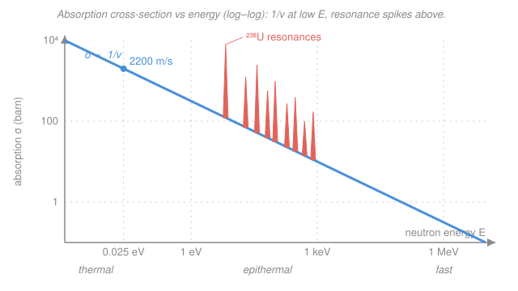

# Intro to Nuclear Engineering & Radiation · Lesson 2.3: Energy dependence — the 1/v law and resonances

> ⏱ ~15 min · Module 2: Neutron cross-sections & interactions · Builds on: [2.2 Macroscopic cross-section & mean free path](02-02-macroscopic-cross-section-mean-free-path.md), [2.1 The microscopic cross-section](02-01-microscopic-cross-section.md) · Unlocks: [2.4 Slowing neutrons down: moderation](02-04-moderation-slowing-neutrons.md), and the resonance-escape factor in [3.4 the four-factor formula](03-04-criticality-four-factor-formula.md)

## Why this matters

A cross-section is not a fixed property of a nucleus — it depends *violently* on how fast the neutron is moving. The same $^{235}$U nucleus that a 2 MeV fission neutron barely notices ($\sigma_f \approx 1$ barn) becomes a 585-barn bullseye once the neutron is slowed to thermal speeds. That single fact is why every thermal reactor on Earth wraps its fuel in a **moderator**: slow the neutrons down and fission gets hundreds of times easier. The flip side is danger — at certain sharply-tuned energies, $^{238}$U swallows neutrons whole. Understanding both behaviors, the smooth $1/v$ rise and the spiky resonances, is what lets you predict whether a pile of uranium will sustain a chain reaction.

## The idea

Two things happen to a neutron's capture probability as you change its energy, and they have completely different flavors.

**The slow, smooth part.** Picture a neutron drifting past a nucleus. Absorption isn't instantaneous — the nucleus needs a moment to "grab" it. A fast neutron blows past in a flash and is gone; a slow neutron loiters in the neighborhood, giving the nucleus far more time to react. So the slower the neutron, the higher its chance of being absorbed. Formalized, the absorption cross-section grows in proportion to the *time spent near the nucleus*, which is proportional to $1/v$. This is the **1/v law**, and it draws a clean downward-sloping straight line on a log–log plot.

**The sharp, spiky part.** Now something more dramatic. When a neutron is absorbed it briefly fuses with the target to form an excited **compound nucleus** — a jittering, energized blob. Nuclei, like atoms, only accept energy in discrete amounts (quantized excited states). If the neutron arrives carrying *exactly* the right energy to land the compound nucleus on one of its excited levels, absorption becomes enormously favored — a **resonance**. It is the nuclear version of pushing a swing at precisely its natural frequency: hit the note and the response is huge; miss by a little and almost nothing happens. These resonances appear as towering, needle-thin spikes poking thousands of times above the smooth $1/v$ background, clustered in the "epithermal" energy range.

## The formal version

**Neutron energy ranges.** Neutrons are sorted by kinetic energy into three loose bands:

- **Thermal** — in equilibrium with the surrounding material at room temperature, most-probable energy $E \approx 0.025\ \text{eV}$, corresponding to speed $v = 2200\ \text{m/s}$ (the standard reference point for tabulated cross-sections).
- **Epithermal** — roughly $1\ \text{eV}$ to $\sim 100\ \text{keV}$; the resonance region.
- **Fast** — $\sim 0.1$–$10\ \text{MeV}$; fission neutrons are born here (average $\approx 2\ \text{MeV}$).

*In words: "thermal" neutrons are as slow as the jiggling atoms around them; "fast" neutrons are freshly ejected from fission and carry a million times more energy.*

**The 1/v law.** Away from resonances, the absorption cross-section of most nuclides obeys

$$\sigma_a(v) = \sigma_a(v_0)\,\frac{v_0}{v},$$

where $v_0 = 2200\ \text{m/s}$ is the thermal reference speed and $\sigma_a(v_0)$ is the tabulated thermal value. *In words: halve the speed and you double the absorption cross-section.* Because kinetic energy is $E = \tfrac12 m v^2$, so $v \propto \sqrt{E}$, the same law in energy form is

$$\sigma_a(E) = \sigma_a(E_0)\,\sqrt{\frac{E_0}{E}}, \qquad \text{i.e.}\quad \sigma_a \propto \frac{1}{\sqrt{E}},$$

with $E_0 = 0.025\ \text{eV}$. *In words: on a log–log plot of $\sigma_a$ against $E$, this is a straight line of slope $-\tfrac12$.* (Scattering cross-sections are roughly flat with energy; it is specifically **absorption** — capture and fission — that follows $1/v$.)

**Resonances.** At an energy $E_r$ where the incident neutron energy plus its binding energy matches an excited state of the compound nucleus, $\sigma_a$ spikes far above the $1/v$ line. Each spike is narrow (widths from milli-eV to eV) and can reach thousands of barns. The canonical example is $^{238}$U, whose first big capture resonance sits at $E_r = 6.67\ \text{eV}$ with a peak of order thousands of barns against a smooth background of only a few barns.

*In words: a resonance is an energy at which the neutron and nucleus are "in tune," so absorption briefly becomes overwhelmingly likely.*

**Why thermal neutrons fission $^{235}$U.** $^{235}$U has a very large thermal fission cross-section, $\sigma_f \approx 585\ \text{barn}$ at $0.025\ \text{eV}$, falling toward $\sim 1\ \text{barn}$ by fast energies (partly the $1/v$ trend, partly its own low-lying resonances). So slowing a neutron from fission-birth speed down to thermal multiplies its fission cross-section by hundreds. That is the entire motive for moderation, coming next in [2.4](02-04-moderation-slowing-neutrons.md).

## Picture

The blue line is the smooth $1/v$ background (slope $-\tfrac12$ in log–log); the coral needles are resonances where the compound nucleus hits an excited state. A fission neutron is born at the far right (fast) and must travel *leftward* across this plot as it slows — running the gauntlet of those spikes on its way to the thermal bullseye.

## Worked examples

**Example 1 (the 1/v law — plug and chug).** Boron-10 absorbs thermal neutrons ($E_0 = 0.025\ \text{eV}$, $v_0 = 2200\ \text{m/s}$) with $\sigma_a = 3840\ \text{barn}$. A neutron has been warmed to $E = 0.10\ \text{eV}$. What is its absorption cross-section?

First the intuition: $0.10\ \text{eV}$ is $4\times$ the thermal energy, so the neutron moves $\sqrt{4} = 2\times$ faster. A faster neutron loiters half as long, so the cross-section should *halve*. Now the arithmetic, using the energy form:

$$\sigma_a(E) = \sigma_a(E_0)\sqrt{\frac{E_0}{E}} = 3840\ \text{barn}\times\sqrt{\frac{0.025}{0.10}} = 3840\times\sqrt{0.25} = 3840\times 0.5 = 1920\ \text{barn}.$$

*Check.* Same answer via speed: $v = v_0\sqrt{E/E_0} = 2200\sqrt{4} = 4400\ \text{m/s}$, and $\sigma_a = 3840\times(2200/4400) = 1920\ \text{barn}$. ✓ Both routes agree, and the value dropped by exactly $2\times$ as the intuition predicted.

**Example 2 (reading a resonance — why it matters downstream).** A $^{238}$U nucleus captures neutrons with $\sigma_c \approx 2\ \text{barn}$ off-resonance, but at its $6.67\ \text{eV}$ resonance the peak is roughly $7000\ \text{barn}$ (a representative figure). (a) By what factor is a neutron *at the resonance energy* more likely to be captured per nucleus it passes? (b) What does this mean for a fission neutron slowing down through $6.67\ \text{eV}$?

**(a)** Capture probability per encounter scales with $\sigma_c$, so the ratio is

$$\frac{\sigma_c^{\text{peak}}}{\sigma_c^{\text{background}}} = \frac{7000}{2} = 3500\times.$$

A neutron passing $^{238}$U at exactly $6.67\ \text{eV}$ is about three-and-a-half thousand times more likely to be swallowed than one a little off that energy.

**(b)** Every fission neutron is born fast ($\sim 2\ \text{MeV}$) and, in a reactor full of $^{238}$U, must slow down *through* the epithermal region to reach the thermal fission energies of $^{235}$U. As it crosses $6.67\ \text{eV}$ it is in mortal danger of resonance capture on $^{238}$U — captured neutrons are lost from the chain (they make $^{239}$U, not fission). The fraction of neutrons that thread all the resonances without being caught is the **resonance-escape probability** $p$, the third factor in [3.4's four-factor formula](03-04-criticality-four-factor-formula.md). The design trick, developed in [2.4](02-04-moderation-slowing-neutrons.md): use a moderator that slows neutrons in big energy *jumps*, so they leap over each narrow resonance instead of dwelling at its energy — raising $p$ and keeping the chain alive.

## Watch out

- **You might think the 1/v law applies to every cross-section.** It doesn't — it's an **absorption** rule (capture and fission). Elastic *scattering* cross-sections are roughly constant with energy over the slowing-down range; that near-constant scattering is exactly what makes moderation work in [2.4](02-04-moderation-slowing-neutrons.md).
- **You might read a resonance as "the neutron resonates."** The tuned object is the **compound nucleus** (target + neutron fused), landing on one of *its* quantized excited states — not the free neutron. Miss the level by a fraction of an eV and the spike collapses back to the $1/v$ background.
- **You might assume slower is always better for a reactor.** Slower boosts $^{235}$U fission, yes — but the trip down passes straight through the $^{238}$U resonances, where neutrons get eaten. The reactor lives or dies on winning that race, which is why moderator choice is a central design decision, not a detail.

## One-liner

> Absorption cross-sections rise as $1/v$ because slow neutrons linger longer, and spike at resonances because the compound nucleus, like a pushed swing, drinks in energy only at its natural notes.

## Problems

**P1 (🟢)** A nuclide has thermal absorption cross-section $\sigma_a = 680\ \text{barn}$ at $E_0 = 0.025\ \text{eV}$ / $v_0 = 2200\ \text{m/s}$, and follows the $1/v$ law. Find $\sigma_a$ (a) for a neutron at $v = 6600\ \text{m/s}$, and (b) for a neutron at $E = 0.10\ \text{eV}$.

**P2 (🟡)** Fission neutrons are born fast. For $^{235}$U the fission cross-section is $\sigma_f \approx 1.3\ \text{barn}$ at $2\ \text{MeV}$ but $\sigma_f \approx 585\ \text{barn}$ at thermal ($0.025\ \text{eV}$). (a) By what factor does slowing a neutron to thermal increase its per-nucleus fission probability? (b) In one sentence, why does a thermal reactor go to the trouble of installing a moderator? (Connects forward to [2.4](02-04-moderation-slowing-neutrons.md) and criticality.)

**P3 (🔴)** For a $1/v$ absorber, show that the reaction rate *per target atom*, $\sigma_a v$, is independent of the neutron speed. A thin foil of such an absorber is placed in a neutron field of density $n$ (neutrons per cm³) moving at speed $v$, so the flux is $\phi = nv$. Explain why the foil's activation rate measures the neutron **density** $n$, not the flux $\phi$. (Uses the reaction-rate picture from [2.1](02-01-microscopic-cross-section.md).)

Solutions

**P1.** Use the $1/v$ law in whichever form matches the given quantity.

(a) Speed form, $\sigma_a(v) = \sigma_a(v_0)\,v_0/v$. Here $v = 6600 = 3v_0$, so
$$\sigma_a = 680\times\frac{2200}{6600} = 680\times\frac{1}{3} = 226.7\ \text{barn}.$$

(b) Energy form, $\sigma_a(E) = \sigma_a(E_0)\sqrt{E_0/E}$. Here $E = 0.10\ \text{eV} = 4E_0$, so
$$\sigma_a = 680\times\sqrt{\frac{0.025}{0.10}} = 680\times\sqrt{0.25} = 680\times 0.5 = 340\ \text{barn}.$$

*Check.* In (a) tripling the speed cut $\sigma$ to a third; in (b) quadrupling the energy doubled the speed and halved $\sigma$. Both move the right direction and are consistent ($v=6600$ corresponds to $E = 0.025\times 3^2 = 0.225\ \text{eV}$, giving an even smaller $\sigma$ than at $0.10\ \text{eV}$, as found). ✓

**P2.**

(a) Fission probability per nucleus scales with $\sigma_f$, so
$$\frac{\sigma_f^{\text{thermal}}}{\sigma_f^{\text{fast}}} = \frac{585}{1.3} = 450\times.$$
Slowing the neutron to thermal makes it about **450 times** more likely to cause fission when it meets a $^{235}$U nucleus.

(b) Because that 450-fold boost in fission cross-section is enormous: deliberately slowing (moderating) the neutrons buys you a chain reaction with far less fissile material than a fast, unmoderated system would need. *(The catch, from Example 2: the neutrons must survive the $^{238}$U resonances on the way down — the resonance-escape probability $p$.)*

**P3.** The reaction rate per target atom is the number of interactions that one nucleus suffers per second, which is (cross-section) × (neutron flux passing it) $= \sigma_a\,\phi = \sigma_a (nv) = (\sigma_a v)\,n$. For a $1/v$ absorber, $\sigma_a = \sigma_a(v_0)\,v_0/v$, so

$$\sigma_a v = \Big(\sigma_a(v_0)\,\frac{v_0}{v}\Big)\,v = \sigma_a(v_0)\,v_0 = \text{constant},$$

the two factors of $v$ cancel. Therefore the rate per atom is $\sigma_a v\,n = [\sigma_a(v_0)v_0]\,n$, proportional to the neutron **density** $n$ alone and blind to how fast the neutrons move. So a thin $1/v$ foil's activation counts the neutrons present ($n$), not the flux $\phi = nv$ — which is exactly why $1/v$ materials (like boron) make clean neutron-density detectors and control absorbers.

*Check.* Units: $\sigma_a v$ has $\text{cm}^2\cdot\text{cm/s} = \text{cm}^3/\text{s}$; times $n$ in $\text{cm}^{-3}$ gives $\text{s}^{-1}$, a rate per atom. ✓

## Flashback

**From Lesson 2.2 (Macroscopic cross-section & mean free path):** A monoenergetic neutron beam strikes a material with atom density $N = 6.0\times 10^{22}\ \text{cm}^{-3}$ and total cross-section $\sigma_t = 4.0\ \text{barn}$. (a) Find the macroscopic cross-section $\Sigma_t$ and the mean free path. (b) What fraction of the beam passes through a $5.0\ \text{cm}$ slab without a single collision?

Solution

(a) With $1\ \text{barn} = 10^{-24}\ \text{cm}^2$,
$$\Sigma_t = N\sigma_t = (6.0\times 10^{22})(4.0\times 10^{-24}) = 0.24\ \text{cm}^{-1}, \qquad \lambda = \frac{1}{\Sigma_t} = \frac{1}{0.24} = 4.2\ \text{cm}.$$

(b) Uncollided fraction follows the attenuation law $e^{-\Sigma_t x}$:
$$\frac{I}{I_0} = e^{-\Sigma_t x} = e^{-(0.24)(5.0)} = e^{-1.2} = 0.30.$$
About **30%** of the beam crosses the slab uncollided.

*Check.* The slab is $5.0/4.2 \approx 1.2$ mean free paths thick, so on average each neutron has $\sim 1.2$ collisions' worth of "chances" — and indeed $e^{-1.2} = 0.30$ survive untouched, a sensible fraction below one-half. ✓

## Connections

- **Backward:** this lesson puts the *energy* dial on the $\sigma$ and $\Sigma = N\sigma$ machinery of [2.1](02-01-microscopic-cross-section.md) and [2.2](02-02-macroscopic-cross-section-mean-free-path.md) — every cross-section you looked up there was implicitly a thermal ($0.025\ \text{eV}$) value, and now you can slide it to any energy.
- **Forward:** [2.4 Moderation](02-04-moderation-slowing-neutrons.md) shows *how* neutrons get slowed (elastic scattering) so they can reach the fat thermal fission cross-section — while dodging the resonances, whose survival fraction becomes the resonance-escape factor $p$ in [3.4's four-factor formula](03-04-criticality-four-factor-formula.md).
- **Sideways (quantum mechanics / stat-mech):** resonances are quantized nuclear energy levels — the same discrete-spectrum idea behind atomic spectral lines and the driven-oscillator resonance of a spring hit at its natural frequency. And "thermal" is literally the Maxwell–Boltzmann equilibrium: a $0.025\ \text{eV}$ neutron carries the average thermal energy $\sim k_B T$ of matter at room temperature.
