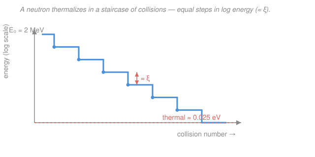
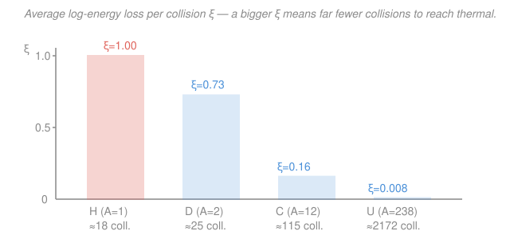

# Intro to Nuclear Engineering & Radiation · Lesson 2.4: Slowing neutrons down: moderation

> ⏱ ~15 min · Module 2: Neutron cross-sections & interactions · Builds on: [2.3 Energy dependence: 1/v & resonances](02-03-energy-dependence-1-over-v-resonances.md), [2.2 Macroscopic cross-section & mean free path](02-02-macroscopic-cross-section-mean-free-path.md) · Unlocks: 3.4 (the four-factor formula) and the whole thermal-reactor picture

## Why this matters

Fission spits out neutrons at about 2 MeV, but [2.3](02-03-energy-dependence-1-over-v-resonances.md) just showed you that $^{235}\text{U}$ fissions hundreds of times more eagerly when a neutron is *slow* — thermal, around 0.025 eV. So a thermal reactor has to knock each newborn neutron down by nearly eight orders of magnitude in energy, fast, before it gets captured or leaks away. The material that does this knocking-down is the **moderator**, and choosing it — light water, heavy water, or graphite — is the single decision that shapes a reactor's size, its fuel enrichment, and its safety. This lesson is why those three materials, and almost nothing else, sit at the heart of every thermal reactor ever built.

## The idea

How do you slow a neutron? You can't brake it with a field — it's neutral. The only lever is collisions: the neutron bumps into nuclei and hands over kinetic energy, like a cue ball scattering off other balls. This is **elastic scattering** — billiard-ball physics, momentum and kinetic energy both conserved.

Now the key intuition, straight from playing pool: **you transfer the most energy when you hit something your own size.** A cue ball striking another cue ball head-on stops dead, dumping *all* its energy. A cue ball striking a bowling ball just bounces back, keeping almost everything. A neutron weighs one atomic mass unit, so it wants to hit *light* nuclei — hydrogen (a lone proton, its exact twin) is the ideal target, uranium the worst. That one fact drives everything: good moderators are made of light atoms.

But there's a second consideration the pool analogy hides. It's not enough to lose lots of energy per hit — the neutron also has to *survive* the journey. Every nucleus it bounces off might instead swallow it (capture). So a good moderator needs three things at once: big energy loss per collision, plenty of collisions actually happening, and almost no appetite for eating neutrons. The tension between "lose energy fast" and "don't get absorbed" is the whole story of why heavy water beats light water in one respect and loses in another.

## The formal version

**Elastic-scattering kinematics.** A neutron (mass $\approx 1$ amu) of energy $E$ hits a nucleus of mass number $A$ at rest. Conserving momentum and kinetic energy (a 1-D head-on collision is just the classical two-body elastic problem), its energy afterward ranges from $E$ (a graze, no loss) down to a minimum

$$E_{\min} = \alpha E, \qquad \alpha \equiv \left(\frac{A-1}{A+1}\right)^2 .$$

*In words: the hardest possible hit, a head-on collision, leaves the neutron with a fraction $\alpha$ of its energy — so the biggest fractional loss per collision is $1-\alpha$.* For hydrogen, $A=1$ gives $\alpha=0$: a head-on hit can take **all** the neutron's energy, exactly the cue-ball-on-cue-ball case. For $^{238}\text{U}$, $\alpha=0.983$: even a perfect hit shaves off under 2%.

**Average logarithmic energy loss.** Because scattering is (nearly) isotropic in the center-of-mass frame, the average energy loss per collision is a fixed *fraction*, not a fixed amount — so the natural bookkeeping is in $\ln E$. The average drop in $\ln E$ per collision is a constant that depends only on $A$:

$$\xi \;\equiv\; \overline{\ln \frac{E}{E'}} \;=\; 1 + \frac{\alpha \ln \alpha}{1-\alpha}.$$

*In words: on average each collision multiplies the neutron's energy down by the same factor $e^{-\xi}$, no matter what energy it started at.* This constancy is what makes the whole problem easy. (For hydrogen the formula is a $0\cdot\ln 0$ limit; it evaluates to $\xi = 1$ exactly. A handy approximation for $A \gtrsim 10$ is $\xi \approx \dfrac{2}{A + 2/3}$.)

**Lethargy** packages this. Define

$$u \equiv \ln\frac{E_0}{E},$$

with $E_0$ a reference (take the 2 MeV birth energy). *In words: lethargy measures how far a neutron has slowed, counting downward-in-energy as upward-in-$u$ — a "slowness" coordinate.* Each collision advances $u$ by $\xi$ on average, so the neutron climbs the lethargy ladder in equal rungs.

**Collisions to thermalize.** To fall from $E_0$ to thermal energy $E_{th}$, the total lethargy gained is $\ln(E_0/E_{th})$, delivered $\xi$ per collision:

$$\boxed{\,\bar n \;=\; \frac{\ln(E_0/E_{th})}{\xi}\,}.$$

*In words: divide the total log-energy drop by the average log-drop per collision, and you get the number of collisions needed.* This is the number the figure below plots for the four candidate nuclei.

**What makes a good moderator.** Three demands, combined into one figure of merit. Big $\xi$ (light nucleus). A high scattering rate, i.e. large macroscopic scattering cross-section $\Sigma_s$ (recall $\Sigma = N\sigma$ from [2.2](02-02-macroscopic-cross-section-mean-free-path.md)), so collisions actually happen. And low absorption $\Sigma_a$, so few neutrons are lost en route. The first two multiply into the **moderating power** $\xi\Sigma_s$; dividing by $\Sigma_a$ gives the **moderating ratio**

$$\text{MR} = \frac{\xi\,\Sigma_s}{\Sigma_a}.$$

*In words: moderating power is how fast you thermalize; the moderating ratio is how much thermalizing you get per neutron you lose — the true scorecard.* This is exactly why the field is $\{$H₂O, D₂O, graphite$\}$: all are light and scatter well, and each strikes a different bargain with absorption.

## Picture

The staircase is the mechanism; the bars are the payoff. Hydrogen's tall $\xi$ means 18 rungs to thermal; uranium's sliver of a $\xi$ means over two thousand — which is why you never thermalize neutrons on the fuel itself.

## Worked examples

**Example 1 (graphite — the full pipeline).** Carbon has $A=12$. Compute $\alpha$, the max fractional loss per collision, $\xi$, and the number of collisions to slow a 2 MeV neutron to 0.025 eV.

$$\alpha = \left(\frac{A-1}{A+1}\right)^2 = \left(\frac{11}{13}\right)^2 = 0.716.$$

Max fractional loss in one hit is $1-\alpha = 0.284$ — even a perfect head-on collision with carbon removes only 28% of the energy. Now $\xi$, with $\ln\alpha = \ln 0.716 = -0.334$:

$$\xi = 1 + \frac{\alpha\ln\alpha}{1-\alpha} = 1 + \frac{(0.716)(-0.334)}{0.284} = 1 - 0.842 = 0.158.$$

(Cross-check with the approximation: $2/(12 + 0.667) = 0.158$. ✓) The total log-energy drop is

$$\ln\frac{E_0}{E_{th}} = \ln\frac{2\times10^6}{0.025} = \ln(8\times10^7) = 18.2,$$

so

$$\bar n = \frac{18.2}{0.158} \approx 115 \text{ collisions.}$$

A neutron rattles around graphite about **115 times** before it's thermal. That's a lot — which is why graphite reactors are physically huge (the neutron needs room to make all those bounces). Compare hydrogen, where $\xi=1$ and $\bar n = 18.2 \approx 18$: six times fewer collisions, hence compact light-water cores.

**Example 2 (light water vs. heavy water — folding in absorption).** Per collision, hydrogen ($\xi=1$, $\bar n\approx 18$) beats deuterium ($A=2$, so $\alpha = (1/3)^2 = 0.111$, $\xi = 0.725$, $\bar n \approx 25$). By the staircase alone, ordinary water should win. But now the second demand bites. Ordinary hydrogen *absorbs* neutrons through radiative capture,

$$\ce{^{1}_{1}H + ^{1}_{0}n -> ^{2}_{1}H + \gamma}, \qquad \sigma_a \approx 0.33\ \text{barn},$$

while deuterium is almost perfectly transparent, $\sigma_a \approx 0.0005$ barn — it has already "caught" one neutron to exist, and is loath to catch another. Put these into the moderating ratio and the verdict flips:

$$\text{MR}(\text{H}_2\text{O}) \approx 62, \qquad \text{MR}(\text{D}_2\text{O}) \approx 4800.$$

Heavy water wastes almost no neutrons, so a reactor moderated by it can sustain a chain reaction on **natural uranium** (0.7% $^{235}$U) — this is the CANDU design. Light water, hungrier for neutrons, forces you to enrich the fuel to 3–5% $^{235}$U to make up the losses. Graphite sits between them (MR $\approx$ 200): mediocre per-collision, low absorption, and cheap and solid, which is why it built the first reactors. The lesson: "best moderator" is never about energy loss alone — it's the moderating ratio, energy-loss-per-neutron-you-keep.

## Watch out

- **You might think a heavier nucleus, carrying more momentum, absorbs more of the neutron's energy.** Exactly backwards. A heavy nucleus barely recoils, so the neutron bounces off with nearly all its energy intact — like a ball off a wall. Light nuclei, which *do* recoil, are the ones that drain energy. Lighter is better.
- **You might think $\xi$ changes as the neutron slows.** It doesn't — that's the whole trick. $\xi$ is the average drop *in $\ln E$*, and it's constant from 2 MeV all the way down, which is precisely why you can just count collisions. (The *fractional* loss is constant; the absolute loss shrinks as the neutron slows.)
- **You might think the fewest-collisions moderator is automatically the best.** Only if it also keeps its neutrons. Hydrogen thermalizes fastest yet has a lower moderating ratio than deuterium or carbon, because it eats too many neutrons on the way down. Speed and thrift are different axes; the moderating ratio weighs both.

## One-liner

> A neutron thermalizes by elastic billiards off light nuclei, each collision costing a fixed slice of *log*-energy $\xi$ — so $\ln(E_0/E_{th})/\xi$ collisions do it, and the best moderator maximizes that loss per neutron it doesn't absorb.

## Problems

**P1 (🟢)** Beryllium is a real moderator with $A=9$. Compute $\alpha$ and $\xi$, then find how many collisions it takes to slow a 2 MeV neutron to 0.025 eV. Is beryllium better or worse than carbon (Example 1) per collision?

**P2 (🟡)** Two candidate moderators, measured in bulk:

| | $\xi$ | $\Sigma_s$ (cm⁻¹) | $\Sigma_a$ (cm⁻¹) |
|---|---|---|---|
| **A** | 0.16 | 0.40 | 0.00030 |
| **B** | 1.00 | 1.50 | 0.022 |

(a) Which thermalizes a neutron in fewer collisions? (b) Compute each moderating ratio $\xi\Sigma_s/\Sigma_a$. (c) Which material would let you run a chain reaction on less-enriched fuel, and what does that tell you about which of A, B is graphite-like and which is water-like?

**P3 (🔴, optional)** Derive the head-on result. A neutron of mass 1 and speed $v$ hits a nucleus of mass $A$ at rest, in one dimension, elastically. Using conservation of momentum and kinetic energy, show the neutron's final speed is $v' = \frac{1-A}{1+A}\,v$, and hence its final energy is $\alpha E$ with $\alpha = \left(\frac{A-1}{A+1}\right)^2$. What does $A=1$ give, and why does that make hydrogen special?

Solutions

**P1** With $A=9$:

$$\alpha = \left(\frac{8}{10}\right)^2 = 0.64, \qquad \ln\alpha = \ln 0.64 = -0.446.$$

$$\xi = 1 + \frac{(0.64)(-0.446)}{1-0.64} = 1 + \frac{-0.286}{0.36} = 1 - 0.793 = 0.207.$$

(Approximation check: $2/(9+0.667) = 0.207$. ✓) Collisions:

$$\bar n = \frac{\ln(2\times10^6/0.025)}{\xi} = \frac{18.2}{0.207} \approx 88 \text{ collisions.}$$

Per collision beryllium ($\xi=0.207$, $\bar n\approx 88$) is **better than carbon** ($\xi=0.158$, $\bar n\approx 115$) — it's lighter ($A=9$ vs 12), so each hit drains more energy and it thermalizes in fewer bounces. (In practice Be is scarce, toxic, and expensive, so graphite usually wins on cost — a reminder that the physics figure of merit isn't the only engineering constraint.)

**P2** (a) Fewer collisions means larger $\xi$: **B** ($\xi=1.00$) thermalizes far faster than **A** ($\xi=0.16$) — roughly 18 vs 115 collisions, using $\ln(8\times10^7)=18.2$.

(b) Moderating ratios:

$$\text{MR}_A = \frac{(0.16)(0.40)}{0.00030} = \frac{0.064}{0.00030} \approx 213, \qquad \text{MR}_B = \frac{(1.00)(1.50)}{0.022} = \frac{1.50}{0.022} \approx 68.$$

(c) **A** has the higher moderating ratio (213 vs 68), so it loses fewer neutrons to absorption per unit of moderating and would sustain a chain reaction on **less-enriched fuel**. A is graphite-like (small $\xi$, tiny $\Sigma_a$, high MR); B is light-water-like (huge $\xi$ so compact, but a hungrier $\Sigma_a$ that pulls its MR down). This is Example 2's tradeoff in numbers: B is faster and more compact, A is thriftier with neutrons.

**P3** Let the neutron's final speed be $v'$ and the nucleus's be $V$. Conservation of momentum (mass 1 and $A$):

$$v = v' + A V.$$

Conservation of kinetic energy:

$$\tfrac12 v^2 = \tfrac12 v'^2 + \tfrac12 A V^2 \;\Longrightarrow\; v^2 = v'^2 + A V^2.$$

From momentum, $V = (v-v')/A$. Substitute:

$$v^2 = v'^2 + A\cdot\frac{(v-v')^2}{A^2} = v'^2 + \frac{(v-v')^2}{A}.$$

Multiply by $A$ and expand $(v-v')^2 = v^2 - 2vv' + v'^2$:

$$A v^2 = A v'^2 + v^2 - 2vv' + v'^2.$$

Group: $A v^2 - v^2 = (A+1)v'^2 - 2vv'$, i.e. $(A-1)v^2 + 2vv' - (A+1)v'^2 = 0$. Divide by $v^2$ and let $x = v'/v$:

$$(A+1)x^2 - 2x - (A-1) = 0 \;\Longrightarrow\; x = \frac{2 \pm \sqrt{4 + 4(A+1)(A-1)}}{2(A+1)} = \frac{1 \pm A}{A+1}.$$

The root $x=1$ is the no-collision case; the physical one is

$$x = \frac{1-A}{1+A} \;\Longrightarrow\; v' = \frac{1-A}{1+A}\,v, \qquad \frac{E'}{E} = x^2 = \left(\frac{A-1}{A+1}\right)^2 = \alpha.$$

For $A=1$: $v'=0$ — the neutron stops dead, handing **all** its energy to the proton (which flies off at speed $v$). That total transfer is exactly why hydrogen is the champion energy-remover per hit, and why $\alpha=0$, $\xi=1$ for it.

## Flashback

**From Lesson 2.3 (the 1/v law):** absorption cross-sections of slow neutrons scale as $\sigma_a \propto 1/v \propto 1/\sqrt{E}$. A certain 1/v absorber has $\sigma_a = 50$ barn for neutrons at thermal energy, 0.025 eV. Partway through moderation a neutron passes through 0.40 eV. What is the absorber's cross-section *there*, and is the neutron more or less likely to be captured than at thermal?

Solution

Using $\sigma_a \propto 1/\sqrt{E}$, scale from the known thermal value:

$$\sigma_a(0.40\ \text{eV}) = 50\ \text{barn}\times\sqrt{\frac{0.025}{0.40}} = 50\times\sqrt{0.0625} = 50\times 0.25 = 12.5\ \text{barn}.$$

Four times *less* likely to be captured at 0.40 eV than at thermal, because it's moving faster and spends less time near each nucleus. This is the whole reason moderation is a race: the faster you drag a neutron down to thermal, the less time it spends at intermediate energies where resonance and 1/v capture can steal it — and it's exactly why a high moderating ratio (few wasted neutrons) matters. ✓

## Connections

- **Backward:** the collision rate hides the macroscopic scattering cross-section $\Sigma_s = N\sigma_s$ from [2.2](02-02-macroscopic-cross-section-mean-free-path.md) — moderating power $\xi\Sigma_s$ is literally log-energy-loss times scatters-per-cm — and the absorption we fight is the 1/v capture of [2.3](02-03-energy-dependence-1-over-v-resonances.md), whose resonances also lie in wait along the slowing-down path.
- **Forward:** thermalizing without wasting neutrons *is* the resonance-escape probability $p$ and part of the thermal utilization $f$ in the four-factor formula [3.4](03-04-criticality-four-factor-formula.md); this lesson closes Module 2 and hands you the "slow neutrons, keep them" idea that criticality runs on. The full spatial slowing-down and diffusion machinery is where [`reactor-physics`](../../reactor-physics/syllabus.md) picks up.
- **Sideways:** the kinematics *is* the elastic two-body collision from classical mechanics — momentum plus kinetic-energy conservation, nothing nuclear — and "thermal" means the neutron has joined the Maxwell–Boltzmann energy distribution of the moderator's atoms at its temperature, the same equilibrium idea statistical mechanics builds from. A 2 MeV neutron doesn't stop moving at 0.025 eV; it stops *losing* energy, because it's now as likely to gain a kick from a jiggling nucleus as to give one.
