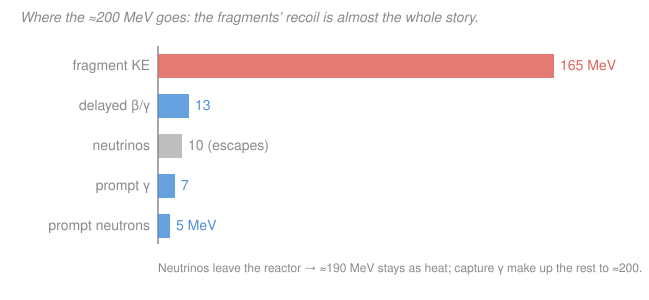
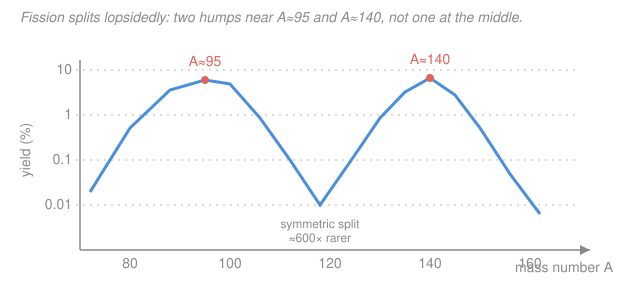

# Intro to Nuclear Engineering & Radiation · Lesson 3.1: The fission process and its energy

> ⏱ ~15 min · Module 3: Fission, the chain reaction & criticality · Builds on: [1.2 Binding energy & the chart of nuclides](01-02-binding-energy-chart-of-nuclides.md), [2.3 Energy dependence: 1/v & resonances](02-03-energy-dependence-1-over-v-resonances.md) · Unlocks: [3.2 Fission products & neutron yield](03-02-fission-products-neutron-yield.md)

## Why this matters

Everything a power reactor does traces back to one number: **a single $^{235}$U fission releases about 200 MeV**. That's roughly 50 million times the energy of burning one carbon atom — which is why a fuel pellet the size of a fingertip holds as much energy as a ton of coal. But the 200 MeV doesn't all show up instantly, and it doesn't all show up as neat useful heat. Knowing *where each MeV goes* is what lets you size a reactor's power from its fission rate — and it's why a reactor that SCRAMmed hours ago still boils water and, if you stop cooling it, still melts. Fukushima was a decay-heat accident, not a criticality accident. This lesson accounts for the whole 200 MeV.

## The idea

Back in [1.2](01-02-binding-energy-chart-of-nuclides.md) we drew the binding-energy-per-nucleon curve $B/A$: a hill that peaks around iron ($A\approx56$) at $\sim8.8$ MeV/nucleon and slopes *down* toward the heavy elements, where $^{235}$U sits at only $\sim7.6$ MeV/nucleon. Nucleons in uranium are **loosely bound** compared to nucleons in mid-weight nuclei. So if you could split a uranium nucleus into two middleweight pieces, every one of its $\sim236$ nucleons would drop into a deeper, tighter binding well — and the energy difference has to come out. That released energy *is* fission's payoff. Same curve, opposite end from fusion.

What triggers the split? A slow neutron wanders in and is absorbed by $^{235}$U (recall from [2.3](02-03-energy-dependence-1-over-v-resonances.md) that thermal neutrons are absorbed enormously readily). The nucleus becomes an excited $^{236}$U — a **compound nucleus**, a hot quivering drop of nuclear fluid. It wobbles. A big enough wobble stretches it into a dumbbell; now the two lobes' mutual electric repulsion (86+ protons shoving apart) overpowers the short-range nuclear "surface tension" holding them together, and the drop snaps into two fragments that fly apart at a fair fraction of light speed. Think of a spinning water droplet pulled into a peanut shape until it pinches off — that liquid-drop picture is exactly how fission was first understood.

The split is **lopsided**: you almost never get two equal halves. Instead one fragment lands near mass 95 and the other near mass 140. And the fragments are born neutron-rich and radioactive — they'll spit out a few prompt neutrons immediately and then beta-decay for minutes, hours, and years afterward. That afterglow is the decay heat.

## The formal version

**A representative fission reaction.** One of thousands of possible splits:

$$\ce{^{235}_{92}U + ^{1}_{0}n -> ^{92}_{36}Kr + ^{141}_{56}Ba + 3 ^{1}_{0}n}$$

*In words: a neutron plus U-235 makes krypton-92, barium-141, and three fresh neutrons.* Check the bookkeeping (as in [1.5](01-05-nuclear-reactions-q-values.md)): charge $92 = 36+56$ ✓; nucleons $236 = 92+141+3$ ✓. The two fragments land near the twin peaks $A\approx95$ and $A\approx140$; the leftover neutrons are what keep a chain reaction alive (that's [3.2](03-02-fission-products-neutron-yield.md)).

**Why $\sim$200 MeV.** The energy released equals the gain in total binding energy — nucleons falling from $^{236}$U's shallow well into the fragments' deeper ones:

$$Q \;\approx\; A\left[\left(\tfrac{B}{A}\right)_{\text{fragments}} - \left(\tfrac{B}{A}\right)_{^{236}\text{U}}\right] \;\approx\; 236\,(8.5 - 7.6)\ \text{MeV} \;\approx\; 200\ \text{MeV}.$$

*In words: multiply the number of nucleons by how much deeper each one gets bound, and you get the energy out.* Equivalently, by $E=mc^2$ this $\sim200$ MeV is a mass loss of $\Delta m = 200/931.5 \approx 0.21$ u — about **0.09% of the fuel's mass converted to energy**.

**The energy budget.** The 200 MeV is *not* delivered all at once, nor all recoverably. The split (numbers per fission, in MeV):

| Channel | Energy (MeV) | Timing |
|---|---|---|
| Kinetic energy of the two fragments | $\approx165$ | prompt |
| Prompt neutrons (kinetic) | $\approx5$ | prompt |
| Prompt $\gamma$ rays | $\approx7$ | prompt |
| Fission-product decay $\beta$ and $\gamma$ | $\approx13$ | **delayed** (seconds → years) |
| Neutrinos (from $\beta$ decay) | $\approx10$ | delayed, **unrecoverable** |
| **Total released** | $\approx200$ | |

*In words: the flying fragments carry about 5/6 of everything; the rest is neutrons, gammas, and a slow radioactive afterglow.* The **fragment kinetic energy dominates** because the two highly-charged pieces are born practically touching and blast apart under Coulomb repulsion — and they stop within microns in the fuel, dumping that $\sim165$ MeV as heat right where they're born. **Neutrinos (** $\sim10$ MeV **) escape the planet entirely** and are lost. So $\sim190$ MeV is deposited locally; neutron captures elsewhere in the core emit extra $\gamma$ rays that recover a few MeV, and by convention we call the **recoverable energy $\approx200$ MeV** per fission.

**Prompt vs. delayed — and decay heat.** About **$93\%$ of the recoverable energy is prompt** (fragments + prompt neutrons + prompt $\gamma$), released within nanoseconds of the split. The remaining $\sim7\%$ is **delayed**: the radioactive fragments keep beta-decaying long after fission stops. *In words: even after you kill the chain reaction, the fission products you already made are still hot.* Immediately after shutdown a reactor still produces $\sim6$–$7\%$ of its full thermal power as **decay heat**, decaying over hours and days — which is exactly why a shut-down core must be cooled for a long time, the central design problem of [reactor thermal hydraulics](../../reactor-thermal-hydraulics/syllabus.md).

## Picture

The second curve is the **mass-yield distribution**: plot how often each fragment mass $A$ appears, and you get twin peaks (each $\sim6\%$ yield) with a valley between them where a symmetric split would land — about 600 times rarer. Nature strongly prefers to make one light and one heavy fragment.

## Worked examples

**Example 1 (the 200 MeV, and fissions per second).** First, sanity-check the release from the $B/A$ climb: a $^{236}$U compound nucleus sits at $B/A\approx7.6$ MeV/nucleon; the fragments near $A\approx95$ and $A\approx140$ sit at $B/A\approx8.5$. Each of the $\sim236$ nucleons drops by $\Delta(B/A)\approx0.85$ MeV, so

$$Q \approx 236 \times 0.85 \approx 200\ \text{MeV}. \checkmark$$

Now turn recoverable energy into a **fission rate**. Convert 200 MeV to joules ($1\ \text{MeV}=1.602\times10^{-13}$ J):

$$E_f = 200\ \text{MeV} \times 1.602\times10^{-13}\ \tfrac{\text{J}}{\text{MeV}} = 3.20\times10^{-11}\ \text{J per fission}.$$

Thermal power is energy-per-fission times fissions-per-second, $P = E_f \times \dot N_f$, so one **watt** of fission heat needs

$$\dot N_f = \frac{P}{E_f} = \frac{1\ \text{J/s}}{3.20\times10^{-11}\ \text{J}} \approx 3.1\times10^{10}\ \text{fissions per second per watt.}$$

*In words: about 31 billion fissions a second keep a one-watt lightbulb's worth of nuclear heat flowing.* This is the master conversion for the whole course — memorize $\sim3.1\times10^{10}$ fissions/s/W.

**Example 2 (fuel burned in a 1 GW-thermal reactor per day).** A typical power reactor runs at $P = 1\ \text{GW}_{\text{th}} = 10^{9}$ W. Its fission rate:

$$\dot N_f = 3.1\times10^{10}\ \tfrac{\text{fissions/s}}{\text{W}} \times 10^{9}\ \text{W} = 3.1\times10^{19}\ \text{fissions/s}.$$

Over one day ($86{,}400$ s) that's $N_f = 3.1\times10^{19}\times 86{,}400 \approx 2.7\times10^{24}$ fissions. Each destroys one $^{235}$U nucleus, so convert atoms → moles → grams (Avogadro $N_A=6.022\times10^{23}$, molar mass $235$ g/mol):

$$m = \frac{2.7\times10^{24}}{6.022\times10^{23}\ \text{mol}^{-1}} \times 235\ \tfrac{\text{g}}{\text{mol}} \approx 4.5\ \text{mol} \times 235 \approx 1.05\ \text{kg}.$$

*In words: a gigawatt reactor fissions about a kilogram of $^{235}$U a day* — the famous rule of thumb **$\sim1.05$ g fissioned per megawatt-day**. (The uranium actually *consumed* is a bit more, since some absorbed neutrons capture without fissioning — the difference is $\eta$ vs. $\nu$ in [3.2](03-02-fission-products-neutron-yield.md).) Compare a coal plant's $\sim$8,000 tons/day and you feel the factor of ten-million.

## Watch out

- **You might think the neutrons or gammas carry most of the energy — they don't.** It's the two fat, highly-charged fragments recoiling: $\sim165$ of the $\sim200$ MeV. They stop in microns, which is why fission heat appears essentially *inside the fuel pin*.
- **You might think "200 MeV released" equals "200 MeV of useful heat."** About 10 MeV leaves as neutrinos and is gone forever; the working $\sim200$ MeV recoverable figure only holds after neutron-capture gammas add a few MeV back. Released, recoverable, and prompt are three different numbers.
- **You might think shutdown means cold.** Killing the chain reaction removes the $\sim93\%$ prompt power instantly, but the $\sim7\%$ decay heat from fission products you already made keeps pouring out for days. Loss of cooling *after* shutdown is a real meltdown path — this is decay heat, not criticality.
- **You might expect fission to split nuclei in half.** The mass-yield curve is double-humped, not single-peaked: asymmetric splits (one $\sim95$, one $\sim140$) dominate over the symmetric one by a couple orders of magnitude.

## One-liner

> Splitting $^{235}$U drops $\sim236$ nucleons into a deeper binding well, releasing $\sim200$ MeV — most of it the recoil of two lopsided fragments — at a rate of about $3.1\times10^{10}$ fissions per second per watt.

## Problems

**P1 (🟢)** A research reactor operates at a steady thermal power of 250 kW. Using the recoverable energy of 200 MeV per fission, estimate the number of fissions occurring per second in its core.

**P2 (🟡)** A fission event releases about 200 MeV. (a) What fraction of that energy is *promptly* recoverable as heat (fragments + prompt neutrons + prompt $\gamma$), and what fraction is delayed (fission-product $\beta/\gamma$), if the $\sim10$ MeV of neutrinos is excluded from the recoverable total of $\sim190$ MeV? (b) A reactor runs at 3000 MW$_{\text{th}}$ and is then SCRAMmed. Estimate its decay-heat power in the first instant after shutdown, and explain in one sentence why this drives cooling requirements.

**P3 (🔴)** Consider the split

$$\ce{^{235}_{92}U + ^{1}_{0}n -> ^{140}_{54}Xe + ^{94}_{38}Sr + x\ ^{1}_{0}n}$$

(a) How many prompt neutrons $x$ are emitted? (b) The fragments $^{140}$Xe and $^{94}$Sr are both neutron-rich and unstable. Using the chart-of-nuclides logic from [1.2](01-02-binding-energy-chart-of-nuclides.md), which decay mode ($\beta^-$ or $\beta^+$) do you expect them to undergo, and why does this tell you where the "delayed" energy in the budget comes from?

Solutions

**P1** Use the master conversion. Energy per fission $E_f = 200\ \text{MeV}\times1.602\times10^{-13}\ \text{J/MeV} = 3.20\times10^{-11}$ J. Power $P = 250\ \text{kW} = 2.5\times10^{5}$ W $= 2.5\times10^{5}$ J/s. Fission rate:

$$\dot N_f = \frac{P}{E_f} = \frac{2.5\times10^{5}}{3.20\times10^{-11}} \approx 7.8\times10^{15}\ \text{fissions/s}.$$

*Check.* Or use the rule of thumb directly: $3.1\times10^{10}\ \text{fissions/s/W}\times 2.5\times10^{5}\ \text{W} = 7.8\times10^{15}$ fissions/s ✓. Units: (J/s)/(J) = 1/s ✓.

**P2** (a) Of the $\sim190$ MeV recoverable (200 minus the 10 MeV of escaping neutrinos), the delayed part is the fission-product $\beta/\gamma\approx13$ MeV. So delayed fraction $\approx 13/190 \approx 6.8\%$, and prompt fraction $\approx 177/190 \approx 93\%$. *In words: about 7% of a reactor's heat is delayed afterglow.*

(b) Just after SCRAM the chain reaction (prompt power) is gone, but the decay heat is still $\sim7\%$ of full power:

$$P_{\text{decay}} \approx 0.07 \times 3000\ \text{MW} \approx 200\ \text{MW}.$$

That is 200 MW of heat with no chain reaction to modulate — you cannot "turn it off," you can only carry it away, so a shut-down core still needs active or passive cooling for days or it will overheat. (In reality the fraction falls quickly — roughly $6\%$ at 1 s, $\sim1\%$ at an hour — but the first instant is the worst case.)

**P3** (a) Nucleon balance: $235+1 = 236$ on the left; fragments give $140+94 = 234$, leaving $236-234 = \mathbf{2}$ prompt neutrons. Charge checks: $92 = 54+38$ ✓.

(b) Both fragments are **neutron-rich** — they inherited uranium's high neutron-to-proton ratio ($N/Z\approx1.55$), far above the $N/Z\approx1.2$–1.3 of stable nuclei at their mass (the valley of stability from [1.2](01-02-binding-energy-chart-of-nuclides.md) bends toward proton-poor as $A$ grows, but the fragments overshoot it). A nucleus with *too many neutrons* lies **below/right of** the valley and converts a neutron to a proton via $\beta^-$ decay, $\ce{n -> p + \beta- + \bar{\nu}_e}$, climbing back toward stability. So expect a **$\beta^-$ chain** from each fragment. Those cascading $\beta^-$ (and their accompanying $\gamma$) decays, playing out over seconds to years, are precisely the "delayed $\beta/\gamma$" $\approx13$ MeV in the energy budget — and the source of decay heat.

## Flashback

**From Lesson 2.4 (Slowing neutrons down: moderation):** A neutron is born from fission at $E_0 = 2$ MeV and must be slowed to thermal energy $E_{\text{th}} = 0.025$ eV before it can efficiently fission $^{235}$U. In graphite, the average logarithmic energy loss per elastic collision is $\xi = 0.158$. Estimate the number of collisions required to thermalize the neutron. *(Fresh variant — different starting energy and moderator than any worked case.)*

Solution

Each elastic collision reduces the neutron's energy by, on average, a fixed *fractional* amount, so $\xi$ is defined as the mean drop in $\ln E$ per collision: $\xi = \langle \ln(E_{\text{before}}/E_{\text{after}})\rangle$. To cross the whole energy range you need the total $\ln$-drop divided by the per-collision drop:

$$n = \frac{1}{\xi}\ln\!\frac{E_0}{E_{\text{th}}} = \frac{1}{0.158}\ln\!\frac{2\times10^{6}\ \text{eV}}{0.025\ \text{eV}} = \frac{1}{0.158}\ln(8\times10^{7}).$$

Now $\ln(8\times10^{7}) = \ln 8 + 7\ln 10 = 2.08 + 16.12 = 18.2$, so

$$n \approx \frac{18.2}{0.158} \approx 115\ \text{collisions.}$$

*Check.* Graphite is a light-ish, weakly-absorbing moderator; $\sim100$+ collisions to thermalize is the textbook figure (versus only $\sim18$ in hydrogen-rich water, where $\xi\approx0.92$). More collisions per neutron means a larger core — one reason graphite reactors are big. This is the flip side of today's lesson: the fast neutrons in the $\sim5$ MeV "prompt neutron" budget line must be slowed by $\sim100$ collisions before they can drive the next fission.

## Connections

- **Backward:** the entire 200 MeV is bookkeeping on the $B/A$ curve from [1.2](01-02-binding-energy-chart-of-nuclides.md) — uranium's shallow binding well versus the fragments' deep ones — and the trigger is the huge thermal absorption cross-section of $^{235}$U from [2.3](02-03-energy-dependence-1-over-v-resonances.md). The reaction balancing is [1.5](01-05-nuclear-reactions-q-values.md)'s conservation laws; the fragments' $\beta^-$ decay is [1.3](01-03-radioactivity-decay-law.md)'s decay law in action.
- **Forward:** [3.2 Fission products & neutron yield](03-02-fission-products-neutron-yield.md) counts the $\nu\approx2.4$ neutrons per fission that make a *chain* possible and separates prompt from delayed neutrons; [3.3](03-03-chain-reaction-multiplication-factor.md) turns "fissions per second" into the multiplication factor $k$ that decides whether the reactor holds steady, dies, or runs away.
- **Sideways:** the $\sim0.09\%$ mass-to-energy conversion is $E=mc^2$ made industrial — the same relativity that governs particle physics, now heating a turbine. And the delayed decay heat is a superposition of first-order radioactive decays (an ODE sum of exponentials) whose removal is the founding problem of [reactor thermal hydraulics](../../reactor-thermal-hydraulics/syllabus.md): a shut-down core that is still, quietly, a 200-megawatt heater.
