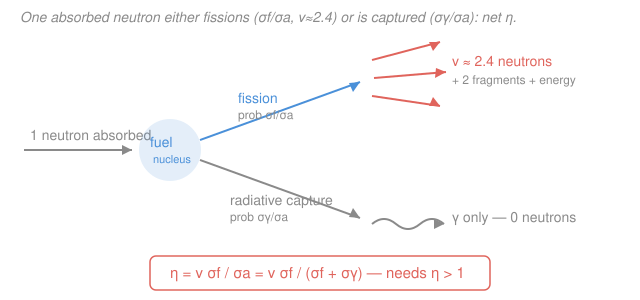

# Intro to Nuclear Engineering & Radiation · Lesson 3.2: Fission products and neutron yield

> ⏱ ~15 min · Module 3: Fission, the chain reaction & criticality · Builds on: [3.1 The fission process and its energy](03-01-fission-process-energy.md), [2.1 The microscopic cross-section](02-01-microscopic-cross-section.md) · Unlocks: [3.3 The chain reaction and the multiplication factor](03-03-chain-reaction-multiplication-factor.md)

## Why this matters

A single fission is a spark; a *reactor* is a fire. What decides whether the spark spreads is bookkeeping on one number: how many neutrons come out of a fission, and how many of those survive to cause the next one. Get that number above one and you have a chain reaction — the whole point of a reactor and a bomb. But a bare "neutrons out" count hides two subtleties that decide whether the fire is *useful*: some absorbed neutrons don't fission at all (they're captured), and a tiny sliver of the neutrons that *do* come out arrive **seconds late**. That sliver — less than 1% — is the only reason a reactor can be steered by a human hand instead of exploding. This lesson sets up both.

## The idea

Fission splits a heavy nucleus into two mid-weight **fission fragments** and flings out a handful of free neutrons. Those neutrons are the seed corn: each one that finds another fuel nucleus and splits it keeps the chain alive. So the first question is just *how many come out per fission* — call it $\nu$ (nu). For thermal $^{235}\text{U}$ it's about 2.4.

But $\nu$ is optimistic. When a neutron is absorbed by a fuel nucleus, fission is only one possible outcome. Sometimes the nucleus just *swallows* the neutron and calms down by spitting out a gamma ray — **radiative capture** — producing no new neutrons at all. So the number that actually matters for sustaining a chain is *neutrons produced per neutron absorbed in the fuel*, which we call $\eta$ (eta). It's $\nu$ knocked down by the fraction of absorptions that actually fission. If $\eta \le 1$, each generation produces no more than it consumes and the fire gutters out. **You need $\eta > 1$ just to have a prayer of a chain** — and that's before you lose neutrons to leakage and to everything else in the reactor (Lesson 3.4's job).

Now the timing twist. The vast majority of fission's neutrons — about 99.35% — fly out *the instant* the nucleus splits: **prompt neutrons**. But a few of the fission fragments are unstable in a special way: they beta-decay into a daughter that is so neutron-rich it immediately boils off a neutron. That neutron appears only when the fragment decays — **seconds later**. These are **delayed neutrons**, about 0.65% of the total. It sounds like a rounding error. It is the difference between a reactor you can control and one you can't.

## The formal version

**Neutrons per fission, $\nu$.** The average number of neutrons released per fission event:

$$\nu \approx 2.42 \quad (\text{thermal fission of } ^{235}\text{U}).$$

*In words: on average, splitting one $^{235}\text{U}$ nucleus with a slow neutron produces about 2.4 fresh neutrons.* (It's fractional because it's an average — any single fission gives 0, 1, 2, 3, … Also note $\nu$ rises with the incident neutron's energy and differs by fuel: $^{239}\text{Pu}$ gives $\nu \approx 2.9$.)

**Reproduction factor, $\eta$.** Recall from [2.1](02-01-microscopic-cross-section.md) that when a neutron meets a fuel nucleus it picks a *channel*, and each channel has a cross-section: $\sigma_f$ for fission, $\sigma_\gamma$ for radiative capture. The **absorption** cross-section bundles every channel that removes the neutron:

$$\sigma_a = \sigma_f + \sigma_\gamma.$$

*In words: "absorbed" means the neutron is gone — whether it caused a fission or was merely captured.* Given an absorption, the probability it was a fission is $\sigma_f/\sigma_a$. So neutrons produced per neutron absorbed in the fuel is

$$\boxed{\;\eta \;=\; \nu\,\frac{\sigma_f}{\sigma_a} \;=\; \nu\,\frac{\sigma_f}{\sigma_f+\sigma_\gamma}\;}$$

*In words: take the $\nu$ neutrons a fission would give, then keep only the fraction $\sigma_f/\sigma_a$ of absorptions that actually fission.* Because $\sigma_f/\sigma_a \le 1$, we always have $\eta \le \nu$; the non-fission capture is pure loss. **The chain-reaction floor is $\eta > 1$** — each absorbed neutron must, on average, more than replace itself. (If the fuel is a *mixture*, e.g. natural uranium, $\sigma_a$ must include capture in the non-fissile isotope too — see Example 1b.)

**Prompt and delayed neutrons.** Split $\nu$ by emission timing:

$$\nu = \nu_p + \nu_d, \qquad \beta \equiv \frac{\nu_d}{\nu} \approx 0.0065 \;\;(\text{for } ^{235}\text{U}).$$

Here $\nu_p$ are **prompt** neutrons (emitted at the moment of fission, $\lesssim 10^{-14}$ s) and $\nu_d$ are **delayed** neutrons, released when certain neutron-rich fragments — the **precursors**, like $^{87}\text{Br}$ and $^{137}\text{I}$ — beta-decay and immediately eject a neutron, on a timescale of fractions of a second up to ~a minute. The **delayed-neutron fraction** $\beta$ is that population's share.

*In words: $\beta$ is the fraction of fission neutrons that show up late because they have to wait for a fragment to decay first.* About 99.35% of neutrons are prompt; only $\beta \approx 0.65\%$ are delayed. We'll see in [3.3](03-03-chain-reaction-multiplication-factor.md) that this tiny $\beta$ multiplies the *effective neutron generation time*: mix a 99.35% population living $\sim10^{-4}$ s with a 0.65% population living $\sim13$ s and the *average* generation stretches to $\sim0.1$ s — slow enough to steer. Hold that thought.

**Fission-product poisons.** Some fission fragments (and their decay daughters) are ferocious neutron absorbers — **poisons**. The champions are $^{135}\text{Xe}$ (thermal absorption cross-section $\approx 2.6\times10^{6}$ barns — the largest of any nuclide) and $^{149}\text{Sm}$ (stable, so it never decays away). *In words: the reactor manufactures its own neutron sponges as it burns, and they eat into the neutron economy* — a running theme for reactor control that we'll quantify later.

## Picture

## Worked examples

**Example 1 — computing $\eta$, and the $\eta>1$ requirement.**

*(a) Pure $^{235}\text{U}$, thermal neutrons.* Use $\nu = 2.42$, $\sigma_f = 582$ barn, $\sigma_\gamma = 99$ barn. First the absorption cross-section:

$$\sigma_a = \sigma_f + \sigma_\gamma = 582 + 99 = 681\ \text{barn}.$$

The fission fraction of absorptions is $\sigma_f/\sigma_a = 582/681 = 0.855$ — about 1 in 7 absorptions is a sterile capture. Then

$$\eta = \nu\,\frac{\sigma_f}{\sigma_a} = 2.42 \times \frac{582}{681} = 2.42 \times 0.855 = 2.07.$$

Comfortably above 1 — pure $^{235}\text{U}$ has neutrons to spare, which is why enrichment buys you margin.

*(b) Natural uranium.* Natural U is only 0.72% $^{235}\text{U}$ by atoms; the other 99.28% is $^{238}\text{U}$, which barely fissions thermally but *does* capture neutrons ($\sigma_a^{238} \approx 2.7$ barn). Now a neutron absorbed "in the fuel" can be eaten by $^{238}\text{U}$ and produce nothing. Weight each isotope's absorption by its atom fraction $a$:

$$\eta_{\text{nat}} = \frac{\nu\,\sigma_f^{235}\,a_{235}}{\sigma_a^{235}\,a_{235} + \sigma_a^{238}\,a_{238}} = \frac{2.42 \times 582 \times 0.0072}{681 \times 0.0072 + 2.7 \times 0.9928}.$$

Numerator $= 2.42 \times 582 \times 0.0072 = 10.14$. Denominator $= 4.90 + 2.68 = 7.58$. So

$$\eta_{\text{nat}} = \frac{10.14}{7.58} = 1.34.$$

Still above 1 — but barely. That thin margin is *why* natural-uranium reactors are so fussy: they demand an excellent moderator (heavy water or reactor-grade graphite) and near-zero parasitic absorption elsewhere, or the surviving $0.34$ gets swallowed by structure and coolant and the chain dies. This is the whole tension the four-factor formula in [3.4](03-04-criticality-four-factor-formula.md) will make quantitative.

**Example 2 — how many neutrons are delayed, and why it dominates control.**

With $\nu = 2.42$ and $\beta = 0.0065$, the delayed neutrons per fission are

$$\nu_d = \beta\,\nu = 0.0065 \times 2.42 = 0.0157 \approx 0.016 \ \text{neutrons per fission},$$

leaving $\nu_p = \nu - \nu_d = 2.42 - 0.016 = 2.404$ prompt. So out of every ~2.4 neutrons, only about **one in sixty-five** is delayed.

Why does that dribble run the show? Because the neutron generation time is an *average* over all the neutrons, and a slow minority drags the average way up. The prompt neutrons alone would give a generation time of $\sim10^{-4}$ s; a chain running on those alone would double in milliseconds — utterly uncontrollable. But blend in even 0.65% of neutrons that don't arrive for ~13 s, and the *effective* generation time becomes roughly

$$\ell_{\text{eff}} \approx (1-\beta)\,(10^{-4}\,\text{s}) + \beta\,(13\,\text{s}) \approx 0.0001 + 0.085 \approx 0.09\ \text{s}.$$

**In one sentence: the delayed neutrons stretch the reactor's response time from milliseconds to a tenth of a second, which is the difference between a machine a control rod can catch and one nothing can** — the payoff developed fully in [3.3](03-03-chain-reaction-multiplication-factor.md).

## Watch out

- **You might think $\eta$ equals $\nu$ ("neutrons out per fission").** It doesn't — $\eta$ is per *absorption*, and some absorptions are non-fission captures that yield nothing. Always $\eta \le \nu$, and in a real fuel mix (natural U) $\eta$ can be far below $\nu$ because a neutron eaten by $^{238}\text{U}$ still counts as "absorbed in the fuel."
- **You might dismiss 0.65% as negligible.** For *how much energy* comes out, sure. For *control*, it is the entire ballgame: remove the delayed neutrons and no reactor on Earth could be operated safely. Small fraction, decisive role — never round $\beta$ to zero.
- **You might think a poison acts the instant fission occurs.** The worst one, $^{135}\text{Xe}$, is mostly *not* produced directly — it grows in from the decay of $^{135}\text{I}$ over hours, so its grip on the neutron economy peaks well after a power change (the notorious "xenon transient" after shutdown). Poisoning is a delayed, dynamic effect, not a fixed tax.

## One-liner

> $\nu$ counts the neutrons a fission makes, $\eta=\nu\,\sigma_f/\sigma_a$ counts the ones that survive being absorbed in fuel — and the 0.65% of them that arrive seconds late is what lets a human steer the chain.

## Problems

**P1 (🟢)** For thermal fission of $^{233}\text{U}$, take $\nu = 2.49$, $\sigma_f = 531$ barn, and $\sigma_\gamma = 46$ barn. Compute $\sigma_a$, the fission probability per absorption, and $\eta$. Is $\eta > 1$?

**P2 (🟡)** A fuel gives $\nu = 2.43$ and a delayed-neutron fraction $\beta = 0.0065$. (a) How many delayed neutrons per fission is that? (b) In a hypothetical reactor running purely on prompt neutrons, the generation time is $10^{-4}$ s; a control operator needs at least ~0.1 s to react. Using the estimate $\ell_{\text{eff}} \approx (1-\beta)(10^{-4}) + \beta\,\bar{t}_d$ with mean delay $\bar{t}_d = 13$ s, find $\ell_{\text{eff}}$ and say in one line why the operator can now cope.

**P3 (🔴)** Reactor-grade plutonium fuel is a mix: $^{239}\text{Pu}$ (fissile: $\nu=2.87$, $\sigma_f=748$ b, $\sigma_\gamma=270$ b) and, say, an equal number of $^{240}\text{Pu}$ atoms (essentially non-fissile thermally, $\sigma_a^{240}\approx 290$ b, mostly capture). Treating "the fuel" as those two isotopes in a 1:1 atom ratio, estimate $\eta$. Compare with the pure-$^{239}\text{Pu}$ value and comment.

Solutions

**P1** Absorption cross-section:

$$\sigma_a = \sigma_f + \sigma_\gamma = 531 + 46 = 577\ \text{barn}.$$

Fission probability per absorption $= \sigma_f/\sigma_a = 531/577 = 0.920$ (only 8% sterile capture — $^{233}\text{U}$ is a *clean* fissile nuclide). Then

$$\eta = \nu\,\frac{\sigma_f}{\sigma_a} = 2.49 \times 0.920 = 2.29.$$

Yes, $\eta = 2.29 > 1$ — with room to spare. (This high $\eta$ even at thermal energy is exactly why $^{233}\text{U}$ is the prize of the thorium fuel cycle.)

*Check.* Units: cross-sections cancel in the ratio, $\nu$ is dimensionless, so $\eta$ is a pure number ✓. It sits below $\nu = 2.49$ as it must, and above the $^{235}\text{U}$ value of 2.07, consistent with the smaller capture fraction. ✓

**P2** (a) Delayed neutrons per fission:

$$\nu_d = \beta\,\nu = 0.0065 \times 2.43 = 0.0158 \approx 0.016.$$

(b) Effective generation time:

$$\ell_{\text{eff}} \approx (1-0.0065)(10^{-4}) + 0.0065 \times 13 = 0.9935\times10^{-4} + 0.0845 \approx 0.085\ \text{s}.$$

The 0.65% of neutrons that take ~13 s to appear pull the *average* generation time from $10^{-4}$ s up to ~0.085 s — comparable to the operator's ~0.1 s reaction budget — so power now changes on a timescale a control rod (or a human) can chase, instead of a millisecond runaway.

*Check.* The delayed term $0.0065\times13 = 0.0845$ swamps the prompt term $10^{-4}$ by ~1000×, confirming that a fraction under 1% sets the timescale. Units are seconds throughout. ✓

**P3** With a 1:1 atom ratio ($a_{239}=a_{240}=0.5$; the equal fractions cancel), weight each isotope's absorption:

$$\eta = \frac{\nu\,\sigma_f^{239}\,a_{239}}{\sigma_a^{239}\,a_{239} + \sigma_a^{240}\,a_{240}}, \qquad \sigma_a^{239} = 748 + 270 = 1018\ \text{b}.$$

$$\eta = \frac{2.87 \times 748 \times 0.5}{1018\times0.5 + 290\times0.5} = \frac{2.87\times748}{1018 + 290} = \frac{2147}{1308} = 1.64.$$

Pure $^{239}\text{Pu}$ alone gives $\eta = \nu\,\sigma_f/\sigma_a = 2.87 \times 748/1018 = 2.11$. The $^{240}\text{Pu}$ dilution drops $\eta$ from 2.11 to about 1.64 — still $>1$, so the mix can chain, but the parasitic capture in $^{240}\text{Pu}$ costs nearly half a neutron per absorption. This is the real-world penalty of "dirty" reactor-grade plutonium: the even isotopes are dead weight that eats the neutron economy.

*Check.* $\eta_{\text{mix}} = 1.64$ lies between the fissile-only value (2.11) and 1, as any dilution with a pure absorber must force it ✓. The equal atom fractions cancel cleanly, so the answer depends only on the cross-section ratio, as expected. ✓

## Flashback

**From Lesson 3.1 (The fission process and its energy):** A small research reactor runs at a steady thermal power of $2\ \text{MW}$. Taking each $^{235}\text{U}$ fission to release $\approx 200\ \text{MeV}$ of recoverable energy, (a) how many fissions occur per second, and (b) roughly what mass of $^{235}\text{U}$ is fissioned per day? (Use $1\ \text{MeV} = 1.602\times10^{-13}\ \text{J}$ and $N_A = 6.022\times10^{23}\ \text{mol}^{-1}$.)

Solution

Energy per fission in joules:

$$E_f = 200\ \text{MeV} \times 1.602\times10^{-13}\ \tfrac{\text{J}}{\text{MeV}} = 3.20\times10^{-11}\ \text{J}.$$

(a) Fission rate is power divided by energy per fission:

$$\dot{n} = \frac{P}{E_f} = \frac{2\times10^{6}\ \text{J/s}}{3.20\times10^{-11}\ \text{J}} = 6.24\times10^{16}\ \text{fissions/s}.$$

(b) Per day, $\dot{n}\times 86{,}400\ \text{s} = 5.39\times10^{21}$ fissions. Each fissioned nucleus is one $^{235}\text{U}$ atom, and one atom has mass $235/N_A = 235/(6.022\times10^{23}) = 3.90\times10^{-22}\ \text{g}$, so

$$m = 5.39\times10^{21} \times 3.90\times10^{-22}\ \text{g} = 2.1\ \text{g of }^{235}\text{U per day}.$$

*Check.* This matches the classic rule of thumb "~1 g of fissile fuel fissioned per megawatt-day": $2\ \text{MW} \times 1\ \text{day} = 2\ \text{MWd}$, so ~2 g — spot on ✓. (Actual fuel *consumed* is somewhat more, since some $^{235}\text{U}$ is lost to capture rather than fission — exactly the $\sigma_\gamma$ channel that made $\eta < \nu$ above.)

## Connections

- **Backward:** $\eta$ is built directly from the fission and capture cross-sections of [2.1](02-01-microscopic-cross-section.md) — the channel-selection idea ("a neutron picks fission *or* capture") is the same probabilistic split, now closed with the yield $\nu$ from [3.1](03-01-fission-process-energy.md)'s fission event.
- **Forward:** $\eta$ is the *first* of the four factors in $k_\infty = \eta f p \varepsilon$ ([3.4](03-04-criticality-four-factor-formula.md)); the multiplication factor $k$ and delayed-neutron control get their full treatment in [3.3](03-03-chain-reaction-multiplication-factor.md), and fission-product poisons ($^{135}\text{Xe}$ transients) shape reactor operation in the sequel course [`reactor-physics`](../../reactor-physics/syllabus.md).
- **Sideways (stochastic processes):** $\nu$ being a fractional *average* over a random count (0, 1, 2, 3, …) makes a fission chain a branching process — the same Galton–Watson mathematics that models population growth and epidemic spread, where "mean offspring $>1$" is precisely the extinction-vs-explosion threshold that $\eta>1$ is here.
