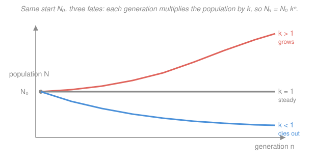

# Intro to Nuclear Engineering & Radiation · Lesson 3.3: The chain reaction and the multiplication factor

> ⏱ ~15 min · Module 3: Fission, the chain reaction & criticality · Builds on: [3.2 Fission products and neutron yield](03-02-fission-products-neutron-yield.md) · Unlocks: [3.4 Criticality and the four-factor formula](03-04-criticality-four-factor-formula.md)

## Why this matters

A fission releases neutrons, and those neutrons can trigger more fissions — a **chain reaction**. Whether that chain fades, holds steady, or explodes comes down to a single number, the multiplication factor $k$: the entire discipline of reactor control is the art of pinning $k$ to within a whisker of $1$. The deepest surprise in all of reactor engineering is that a chain reaction moving at nuclear speeds — a neutron generation lasts about a ten-thousandth of a second — is nonetheless something a human operator can steer with a control rod by hand. That miracle has one cause: **delayed neutrons**. This lesson is where the physics of Module 3 turns into an engineered, controllable machine.

## The idea

Picture one neutron born in a fissile block. It wanders, and one of three things happens to it: it causes a new fission (releasing more neutrons), it gets absorbed without fissioning, or it leaks out the surface. Only the first outcome keeps the chain going. So ask: **on average, how many *new* fission neutrons does one neutron eventually produce?** Call that number $k$.

That one ratio decides everything, because the process *repeats*. If each neutron yields $k$ successors, then a batch of neutrons — a **generation** — is followed by a next generation that is $k$ times as big. Multiply generation after generation and you get a geometric sequence: powers of $k$. If $k<1$ each generation is smaller than the last and the chain dies. If $k=1$ every generation is a carbon copy and the power holds dead steady. If $k>1$ the population climbs, generation on generation, without limit. Three numbers just barely apart — $0.99$, $1.00$, $1.01$ — mean "shuts down," "runs a power plant," and "runs away."

The catch is *speed*. If every generation took a ten-thousandth of a second, even a tiny $k>1$ would double the power dozens of times before you could blink — no mechanical system could react. The escape hatch is that a small fraction of fission neutrons don't come out promptly; they dribble out seconds later from decaying fission products. Those stragglers drag the *average* generation time up from $10^{-4}$ s to about a tenth of a second — slow enough for a control rod to matter.

## The formal version

**The multiplication factor.** Define

$$k = \frac{\text{number of neutrons in one generation}}{\text{number of neutrons in the preceding generation}}.$$

*In words: $k$ is the head-count ratio between successive neutron generations — how many neutrons each one leaves behind.* (You'll sometimes see it written $k_{\text{eff}}$, the *effective* multiplication factor for a real, finite reactor; Lesson 3.4 breaks it into its factors.)

**Criticality classification.** A system is

$$\begin{aligned}
k < 1 &: \textbf{ subcritical} \quad (\text{chain dies out}) \\
k = 1 &: \textbf{ critical} \quad (\text{steady, self-sustaining}) \\
k > 1 &: \textbf{ supercritical} \quad (\text{population grows}).
\end{aligned}$$

*In words: critical is the knife-edge where each fission's neutrons exactly replace the previous generation — a reactor at constant power sits here.* Note "critical" does **not** mean dangerous; a reactor humming along at full power is precisely critical.

**The generation law.** Start with $N_0$ neutrons. After one generation there are $N_0 k$; after two, $N_0 k^2$; after $n$ generations,

$$\boxed{\,N_n = N_0\, k^{n}\,}$$

*In words: the neutron population is a geometric sequence — multiply by $k$ once per generation.* This is exactly a compound-interest curve, with $k-1$ playing the role of the interest rate per generation.

**Generation time and lifetime.** Let $\ell$ (seconds) be the **neutron generation time** (or lifetime): the average time from a neutron's birth to the birth of the neutrons it produces. Then in a real clock, the generation index advances at rate $1/\ell$, and $N(t)=N_0\,k^{t/\ell}=N_0\,e^{(t/\ell)\ln k}$. Writing this as $N(t)=N_0\,e^{t/T}$ defines the **reactor period**

$$T = \frac{\ell}{\ln k}\;\approx\;\frac{\ell}{k-1}\quad(\text{for }k\text{ near }1),$$

the time for the power to change by a factor of $e\approx2.72$. *In words: the reactor period is how fast the power runs away (or decays) — bigger period means slower, gentler change.* A short period is a fast, hard-to-catch transient; an infinite period ($k=1$) is steady state.

**Prompt vs. delayed, and why control is possible.** Most fission neutrons ("prompt") appear within $\sim10^{-14}$ s of the split, so a prompt-only chain has $\ell_{\text{prompt}}\approx10^{-4}$ s (dominated by the neutron's slowing-down and diffusion time, not the fission itself). But a fraction $\beta\approx0.0065$ ($0.65\%$ for $^{235}$U) are **delayed**: emitted seconds later by beta-decaying fission products (see [3.2](03-02-fission-products-neutron-yield.md)). Averaging the prompt neutrons against the delayed ones — whose precursors live $\sim12$ s — pulls the *effective* generation time up to

$$\ell_{\text{eff}}\;\approx\;(1-\beta)\,\ell_{\text{prompt}} + \beta\,\bar\tau_{\text{delay}}\;\approx\;\beta\,\bar\tau_{\text{delay}}\;\approx\;0.0065\times12\ \text{s}\;\approx\;0.1\ \text{s}.$$

*In words: the rare late neutrons dominate the average timing, stretching a $10^{-4}$ s clock to a tenth of a second — a thousandfold slowdown that a mechanical control system can keep up with.*

**Prompt critical — the danger line.** This gift holds only while the reactor *needs* the delayed neutrons to stay critical, i.e. while $k$ exceeds 1 by less than $\beta$. If $k-1$ reaches $\beta$, the prompt neutrons *alone* make $k\ge1$: the chain no longer waits for the stragglers, $\ell$ collapses back to $10^{-4}$ s, and the power runs away uncontrollably. That threshold is **prompt critical**, and staying well below it is the cardinal rule of reactor operation.

## Picture

## Worked examples

**Example 1 (the generation law — growth and decay).** A reactor is nudged to $k=1.002$ and left alone. Starting from $N_0=1000$ neutrons, how many are there after $n=50$ generations? And if instead a subcritical assembly has $k=0.99$, what fraction of the neutrons survive after 100 generations?

*Supercritical case.* Apply $N_n=N_0k^n$ directly:

$$N_{50}=1000\times(1.002)^{50}.$$

Since $(1.002)^{50}=e^{50\ln 1.002}=e^{50\times0.0019980}=e^{0.09990}=1.1051$,

$$N_{50}\approx 1000\times1.105 = 1105\ \text{neutrons}.$$

So a $0.2\%$ per-generation excess compounds to about $+10.5\%$ over 50 generations — the geometric growth is modest per step but relentless.

*Subcritical case.* Same law with $k<1$:

$$\frac{N_{100}}{N_0}=(0.99)^{100}=e^{100\ln0.99}=e^{100\times(-0.01005)}=e^{-1.005}=0.366.$$

About $37\%$ survive after 100 generations — the chain is fading, each generation $1\%$ smaller than the last, and it will keep shrinking toward zero. *Check:* $k>1$ grew, $k<1$ shrank, as the classification demands. ✓

**Example 2 (timescale — why control is possible).** A reactor is made slightly supercritical, $k=1.001$ (so $k-1=0.001$). Find the reactor period $T$ and the factor by which power grows in one second, first assuming the *prompt-only* lifetime $\ell=10^{-4}$ s, then the *delayed-effective* lifetime $\ell_{\text{eff}}=0.1$ s.

*Prompt-only.* With $T\approx \ell/(k-1)$:

$$T_{\text{prompt}}=\frac{10^{-4}}{0.001}=0.1\ \text{s}.$$

In one second the power multiplies by

$$e^{t/T}=e^{1/0.1}=e^{10}\approx 2.2\times10^{4}.$$

A factor of twenty-two *thousand* per second — utterly uncontrollable by any mechanical rod.

*Delayed-effective.* Now $\ell_{\text{eff}}=0.1$ s:

$$T_{\text{eff}}=\frac{0.1}{0.001}=100\ \text{s},\qquad e^{1/100}=1.01.$$

The power creeps up $1\%$ per second, with a $100$-second period — plenty of time for feedback and control rods to respond. *Same $k$, same physics; the only difference is which lifetime governs the clock.* The delayed neutrons buy a factor of $1000$ in reaction time, and that is the entire reason a reactor is a machine and not a bomb. ✓

## Watch out

- **You might think "critical" means dangerous.** It's the opposite — critical ($k=1$) is the steady, controlled operating state of every power reactor. "Supercritical" only means power is *rising* (as it must be during startup); the state to fear is **prompt** critical, when $k-1$ reaches $\beta$.
- **You might think a small $k>1$ is harmless because it's close to 1.** Closeness to 1 sets the *period*, not the safety margin. What matters is whether $k-1$ is below $\beta\approx0.0065$: below it, delayed neutrons keep the transient slow; at it, the reactor goes prompt-critical and the $10^{-4}$ s clock takes over. The reactivity scale of "dollars" ($\rho/\beta$, where $\$1$ = prompt critical) exists precisely to track this.
- **You might think delayed neutrons matter because there are a lot of them.** There are barely any — under $1\%$. They matter because they arrive *late*: a tiny fraction with a huge time-lag dominates the *average* generation time, and it's the average that sets how fast the population can move.

## One-liner

> One number, $k$, decides whether a chain reaction dies ($k<1$), holds ($k=1$), or grows ($k>1$) as $N_n=N_0k^n$ — and a sub-percent trickle of delayed neutrons is what stretches the generation clock enough to steer it.

## Problems

**P1 (🟢)** A reactor operates at exactly $k=1$ at steady power. An operator withdraws a control rod, raising $k$ to $1.0005$. Starting from a neutron population of $2000$, how many neutrons are present after $20$ generations? Is the reactor sub-, critical, or supercritical?

**P2 (🟡)** A subcritical assembly has $k=0.95$. (a) By what factor does the neutron population change each generation? (b) After how many generations does the population fall below $1\%$ of its starting value? (c) In one sentence, why does an assembly with $k$ just under 1 still eventually go quiet?

**P3 (🔴)** For $^{235}$U the delayed fraction is $\beta=0.0065$. A reactor is at $k=1.004$ with effective generation time $\ell_{\text{eff}}=0.08$ s. (a) Find the reactor period $T$ and the power-growth factor over $5$ s. (b) Is the reactor below or above prompt critical, and by how much (compare $k-1$ to $\beta$)? (c) If instead the prompt lifetime $\ell=10^{-4}$ s governed this same $k$, what would the period be — and what does the contrast tell you?

Solutions

**P1** Use $N_n=N_0k^n$ with $N_0=2000$, $k=1.0005$, $n=20$:

$$N_{20}=2000\times(1.0005)^{20}=2000\times e^{20\ln1.0005}=2000\times e^{20\times0.00049988}=2000\times e^{0.0099975}.$$

Since $e^{0.0099975}=1.01005$,

$$N_{20}\approx2000\times1.01005=2020\ \text{neutrons}.$$

Because $k>1$, the reactor is **supercritical** (power rising). *Check:* a $0.05\%$ per-generation excess over 20 generations gives about $+1\%$, matching the head-count. ✓

**P2** (a) Each generation multiplies by $k=0.95$, i.e. the population **drops to $95\%$** (falls $5\%$) per generation.

(b) Solve $(0.95)^n < 0.01$:

$$n\ln0.95 < \ln0.01\;\Longrightarrow\; n > \frac{\ln0.01}{\ln0.95}=\frac{-4.6052}{-0.051293}=89.8.$$

So after **90 generations** the population is below $1\%$ of its start. *Check:* $(0.95)^{90}=e^{90\times(-0.051293)}=e^{-4.616}=0.00987<0.01$ ✓, while $(0.95)^{89}=0.01039>0.01$.

(c) Because $k<1$, *every* generation is strictly smaller than the one before — the geometric sequence $k^n\to0$, so no matter how close $k$ is to 1, the chain fades to nothing (it just takes more generations the closer $k$ is to 1).

**P3** (a) With $T\approx\ell_{\text{eff}}/(k-1)$ and $k-1=0.004$:

$$T=\frac{0.08}{0.004}=20\ \text{s},\qquad \text{growth over }5\text{ s}=e^{t/T}=e^{5/20}=e^{0.25}=1.28.$$

Power rises about $28\%$ over 5 seconds — a brisk but manageable transient.

(b) Compare $k-1=0.004$ with $\beta=0.0065$. Since $0.004<0.0065$, the reactor is **below prompt critical**, with margin $\beta-(k-1)=0.0065-0.004=0.0025$ (in "dollars," $\rho\approx(k-1)/k\approx0.004$, i.e. about $0.004/0.0065\approx\$0.61$ — safely under $\$1$). Delayed neutrons still govern the timing.

(c) With the prompt lifetime $\ell=10^{-4}$ s at the same $k-1=0.004$:

$$T_{\text{prompt}}=\frac{10^{-4}}{0.004}=0.025\ \text{s},\qquad e^{5/0.025}=e^{200},$$

an astronomically large factor — physically, the power would have run away almost instantly. The contrast is the whole point: the delayed-neutron lifetime ($0.08$ s) gives a $20$-second period you can control, while the prompt lifetime would give a $0.025$-second period you cannot. *Check:* the two periods differ by the ratio $\ell_{\text{eff}}/\ell=0.08/10^{-4}=800$, matching $20\ \text{s}/0.025\ \text{s}=800$. ✓

## Flashback

**From Lesson 3.2 (Fission products and neutron yield):** A thermal reactor fuel has, per fissile nucleus, $\nu=2.4$ neutrons emitted per fission, a fission cross-section $\sigma_f=500$ barns, and a radiative-capture cross-section $\sigma_\gamma=100$ barns (so absorption $\sigma_a=\sigma_f+\sigma_\gamma$). Compute the reproduction factor $\eta$ (neutrons produced per neutron absorbed in the fuel). What does $\eta>1$ tell you about the prospects for a chain reaction?

Solution

The reproduction factor is the neutrons emitted per absorption in the fuel:

$$\eta=\nu\,\frac{\sigma_f}{\sigma_a}=\nu\,\frac{\sigma_f}{\sigma_f+\sigma_\gamma}=2.4\times\frac{500}{500+100}=2.4\times\frac{500}{600}=2.4\times0.8333=2.0.$$

*In words:* every neutron the fuel swallows returns, on average, $2.0$ new fission neutrons. Since $\eta=2.0>1$, there's a surplus even before accounting for losses to leakage, non-fuel absorption, and imperfect thermalization — a chain reaction is *possible*, and how much of that surplus survives those losses is exactly what the multiplication factor $k$ (and the four-factor formula of [3.4](03-04-criticality-four-factor-formula.md)) will track. *Check:* $\eta<\nu$ always, because some absorbed neutrons are captured without fissioning; here $2.0<2.4$. ✓

## Connections

- **Backward:** $k$ is built from the per-fission neutron yield $\nu$ and reproduction factor $\eta$ of [3.2](03-02-fission-products-neutron-yield.md), and the delayed fraction $\beta$ introduced there is what makes $k>1$ controllable rather than catastrophic. The geometric law $N_n=N_0k^n$ is the discrete cousin of the exponential decay law $N(t)=N_0e^{-\lambda t}$ from [1.3](01-03-radioactivity-decay-law.md) — a fixed multiplier applied over and over.
- **Forward:** [3.4](03-04-criticality-four-factor-formula.md) opens $k$ up into the four-factor formula $k_\infty=\eta f p\varepsilon$ (times a non-leakage probability for the finite reactor), and recasts closeness-to-critical as **reactivity** $\rho=(k-1)/k$ — the natural knob for the control problem this lesson set up.
- **Sideways (dynamics and control):** $N_n=N_0k^n$ is compound growth — the same math as populations, epidemics ($k$ is the basic reproduction number $R_0$), and interest. And the delayed-neutron trick — deliberately slowing a system's response so a feedback loop can stabilize it — is a control-theory idea shared with any engineered system that must be held at an unstable set-point.
