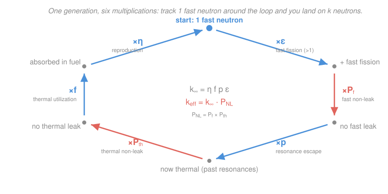

# Intro to Nuclear Engineering & Radiation · Lesson 3.4: Criticality and the four-factor formula

> ⏱ ~15 min · Module 3: Fission, the chain reaction & criticality · Builds on: [3.3 The chain reaction and the multiplication factor](03-03-chain-reaction-multiplication-factor.md), [3.2 Fission products and neutron yield](03-02-fission-products-neutron-yield.md), [2.4 Slowing neutrons down: moderation](02-04-moderation-slowing-neutrons.md) · Unlocks: 4.1 (fusion basics) and the full neutron-transport treatment in [`reactor-physics`](../../reactor-physics/syllabus.md)

## Why this matters

In [3.3](03-03-chain-reaction-multiplication-factor.md) you learned that a reactor lives or dies by one number, the multiplication factor $k$: below 1 the chain reaction fizzles, above 1 it grows, exactly 1 it holds steady. But that lesson never told you *where $k$ comes from*. This lesson opens the box. The **four-factor formula** breaks $k$ into four physical quantities you can each estimate — fuel enrichment, moderator choice, geometry — so you can predict criticality *before* building anything, and know which knob to turn to correct it. It is the back-of-the-envelope every reactor designer starts from, and the bridge from "neutrons interact with nuclei" (Module 2) to "this pile goes critical."

## The idea

Think of one generation of neutrons as a relay race around a loop. You start with a batch of fast neutrons fresh out of fission. Before they can cause the *next* round of fissions, each one has to survive a gauntlet: it might get slowed down, it might leak out the sides, it might be swallowed by something that isn't fuel, it might be captured by a $^{238}\text{U}$ nucleus on its way down in energy. At the end of the loop, the survivors get absorbed in fuel and — if they're lucky enough to cause fission — spawn a fresh batch of fast neutrons. $k$ is just the ratio of the new batch to the old one.

The trick is that this survival is a chain of independent hurdles, and probabilities of independent hurdles **multiply**. So $k$ factors into a product: one number for each stage of the loop. Nail down four of them (for an idealized infinite reactor with no leakage) and you get $k_\infty$; tack on the leakage probability and you get the real, finite-reactor $k_{\text{eff}}$. That's the whole story — a chain reaction bookkept as a running product around one lap.

## The formal version

For an **infinite medium** (imagine a reactor so large that no neutron ever reaches an edge — leakage is impossible), the multiplication factor is the product of four factors:

$$\boxed{\,k_\infty = \eta\, f\, p\, \varepsilon\,}$$

Each factor is a probability or a yield, read off in the order a fission neutron experiences them around the loop (start at the bottom of the list — reproduction — and cycle up):

- **$\varepsilon$ — fast-fission factor** (dimensionless, slightly $>1$). *In words: the bonus from the few fast neutrons that fission $^{238}\text{U}$ before they slow down.* Fission neutrons are born fast ($\sim 2$ MeV), and a small fraction trigger fast fission in $^{238}\text{U}$, adding a handful of extra neutrons. Typically $\varepsilon \approx 1.02$–$1.08$.
- **$p$ — resonance escape probability** ($0 < p < 1$). *In words: the fraction of neutrons that slow all the way to thermal without being captured by a $^{238}\text{U}$ resonance on the way down.* Recall from [2.3](02-03-energy-dependence-1-over-v-resonances.md) that $^{238}\text{U}$ has ferocious capture resonances in the epithermal range; the slowing-down process ([2.4](02-04-moderation-slowing-neutrons.md)) has to thread past them. Typically $p \approx 0.7$–$0.9$.
- **$f$ — thermal utilization** ($0 < f < 1$). *In words: of all the thermal neutrons that get absorbed somewhere, the fraction absorbed in the fuel* (rather than in moderator, cladding, coolant, or poisons):

$$f = \frac{\Sigma_a^{\text{fuel}}}{\Sigma_a^{\text{fuel}} + \Sigma_a^{\text{other}}},$$

using the macroscopic absorption cross-sections $\Sigma_a$ from [2.2](02-02-macroscopic-cross-section-mean-free-path.md). Every neutron soaked up by non-fuel is wasted.
- **$\eta$ — reproduction factor** (dimensionless, $\eta > 1$ for a viable fuel). *In words: the number of fresh fission neutrons produced per thermal neutron absorbed in the fuel.* From [3.2](03-02-fission-products-neutron-yield.md), $\eta = \nu\, \sigma_f / \sigma_a^{\text{fuel}}$ — the neutron yield per fission $\nu$, discounted by the chance that a fuel absorption is a fission rather than a sterile capture. For thermal $^{235}\text{U}$, $\eta \approx 2.07$.

**Finite systems — leakage.** A real reactor is finite, so some neutrons leak out through the surface before finishing the loop. Encode that as the **total non-leakage probability** $P_{NL}$, itself the product of a fast and a thermal piece (leakage can happen while the neutron is fast *and* while it is thermal — two independent hurdles):

$$P_{NL} = P_{NL}^{\text{fast}} \cdot P_{NL}^{\text{thermal}}, \qquad k_{\text{eff}} = k_\infty\, P_{NL}.$$

*In words: the effective multiplication factor is the infinite-medium value knocked down by the fraction of neutrons that don't escape.* (Enlarging the core or wrapping it in a reflector pushes $P_{NL} \to 1$; this is the "six-factor formula" once you split the leakage out.) The criticality verdict from [3.3](03-03-chain-reaction-multiplication-factor.md) is read off $k_{\text{eff}}$: $<1$ subcritical, $=1$ critical, $>1$ supercritical.

**Reactivity.** For control it's handier to measure *how far from critical* you are. Define the **reactivity**:

$$\rho = \frac{k_{\text{eff}} - 1}{k_{\text{eff}}}.$$

*In words: reactivity is the fractional surplus (or deficit) of neutrons per generation — zero exactly at critical, positive above, negative below.* It's a pure fraction, but two rescaled units dominate practice:

- **pcm** ("per cent mille") $= 10^{-5}$, so $\rho$ in pcm $= \rho \times 10^{5}$.
- **dollars**: $\rho_{\$} = \rho/\beta$, where $\beta \approx 0.0065$ for $^{235}\text{U}$ is the delayed-neutron fraction from [3.3](03-03-chain-reaction-multiplication-factor.md). One dollar of reactivity ($\rho = \beta$) is the threshold of *prompt* criticality — the line you never want to cross, because past it the reactor no longer waits for delayed neutrons and becomes uncontrollable.

## Picture

The loop makes the "running product" concrete: enter with 1 fast neutron, get multiplied at each hurdle, exit with $k_{\text{eff}}$ fast neutrons ready to start the next lap. The four blue steps are the four factors; the two coral steps are the leakage losses that turn $k_\infty$ into $k_{\text{eff}}$.

## Worked examples

**Example 1 (the full life cycle — infinite to finite to reactivity).** A thermal reactor has $\eta = 2.02$, $f = 0.65$, $p = 0.80$, $\varepsilon = 1.04$, and total non-leakage $P_{NL} = 0.90$.

*Infinite-medium $k$.* Multiply the four factors:

$$k_\infty = \eta\, f\, p\, \varepsilon = 2.02 \times 0.65 \times 0.80 \times 1.04 = 1.092.$$

Without leakage this pile would be supercritical — good, there's margin to burn on leakage.

*Effective $k$.* Fold in leakage:

$$k_{\text{eff}} = k_\infty\, P_{NL} = 1.092 \times 0.90 = 0.983.$$

Since $k_{\text{eff}} < 1$, the reactor is **subcritical** — as built (this size, this leakage) the chain reaction dies out. Leakage cost us the whole surplus and then some.

*Reactivity.* 

$$\rho = \frac{k_{\text{eff}} - 1}{k_{\text{eff}}} = \frac{0.983 - 1}{0.983} = -0.0173 = -1730\ \text{pcm}.$$

In dollars, $\rho_{\$} = -0.0173/0.0065 \approx -2.7$ dollars — you'd need to *add* about 2.7 dollars of reactivity (more fuel, less leakage) to reach critical.

*How fast does it die?* The population evolves as $N_n = N_0\, k_{\text{eff}}^{\,n}$ (from [3.3](03-03-chain-reaction-multiplication-factor.md)). Starting from 1000 neutrons, after 10 generations:

$$N_{10} = 1000 \times (0.983)^{10} = 1000 \times 0.842 \approx 842\ \text{neutrons}.$$

A gentle decline — subcritical, but only just.

*What would make it exactly critical?* Hold the four factors fixed and ask for the $P_{NL}$ that gives $k_{\text{eff}} = 1$:

$$P_{NL} = \frac{1}{k_\infty} = \frac{1}{1.092} = 0.915.$$

So cutting leakage from 10% down to about 8.5% (raising $P_{NL}$ from 0.90 to 0.915) tips it to critical. That's the kind of thing a neutron reflector buys you.

**Example 2 (one-factor surgery — how much must $f$ rise?).** Take the same subcritical reactor ($k_{\text{eff}} = 0.983$). Suppose leakage is fixed by the geometry, but you can improve **thermal utilization** $f$ — say by enriching the fuel or removing a neutron-hungry impurity from the coolant. How large must $f$ become to reach exactly critical, with $\eta$, $p$, $\varepsilon$, $P_{NL}$ all held fixed?

Set $k_{\text{eff}} = \eta\, f'\, p\, \varepsilon\, P_{NL} = 1$ and solve for the new $f'$:

$$f' = \frac{1}{\eta\, p\, \varepsilon\, P_{NL}} = \frac{1}{2.02 \times 0.80 \times 1.04 \times 0.90} = \frac{1}{1.513} = 0.661.$$

So $f$ must climb from $0.65$ to about $0.661$ — a change of only $\Delta f \approx +0.011$ (a 1.7% relative bump). 

The lesson: near critical, tiny fractional changes in *any single factor* move you across the whole subcritical-to-critical gap, because $k_{\text{eff}}$ is a product — a 1.7% nudge in $f$ is a 1.7% nudge in $k_{\text{eff}}$, and $1730$ pcm is only 1.7%. This is exactly why reactor control is delicate, and why the delayed-neutron cushion ($\beta \approx 650$ pcm) is what makes it *possible* rather than explosive.

## Watch out

- **You might think $k_\infty > 1$ guarantees a working reactor.** It doesn't — $k_\infty$ ignores leakage. A small assembly can have a healthy $k_\infty = 1.1$ and still be stone-cold subcritical because $P_{NL}$ is low (lots of surface, lots of escape). Criticality is always a verdict on $k_{\text{eff}}$, and geometry (the critical *size*) is half the battle.
- **You might treat $\eta$ and $\nu$ as the same thing.** $\nu$ (Lesson 3.2) is neutrons *per fission*; $\eta$ is neutrons *per absorption in fuel*. Since not every absorption causes fission (some are sterile radiative capture), $\eta < \nu$ always. Using $\nu$ where you need $\eta$ over-counts your neutrons.
- **You might read reactivity as if $\rho = k - 1$.** Close, but not equal: $\rho = (k-1)/k$. Near critical ($k \approx 1$) the two nearly coincide, which is why people get sloppy — but the definition carries the $1/k$, and it matters once $k$ drifts from 1.

## One-liner

> A chain reaction is a lap around a loop, and $k$ is what one neutron becomes by the finish: $k_\infty = \eta f p \varepsilon$ for the ideal lap, $k_{\text{eff}} = k_\infty P_{NL}$ once neutrons can leak, and $\rho = (k-1)/k$ measures how far that leaves you from steady.

## Problems

**P1 (🟢)** A reactor design has $\eta = 1.80$, $f = 0.90$, $p = 0.75$, $\varepsilon = 1.03$, and non-leakage $P_{NL} = 0.82$. Compute $k_\infty$ and $k_{\text{eff}}$, and classify the reactor.

**P2 (🟡)** A reactor is exactly critical ($k = 1.000$). An operator inserts a control rod, dropping $k$ to $0.996$. Find the reactivity worth of that rod insertion in pcm, and convert it to dollars (use $\beta = 0.0065$). Is this a "prompt" amount of reactivity?

**P3 (🔴, optional)** A certain fuel-moderator lattice has $k_\infty = 1.05$. An engineer builds a finite core from it and measures that 6% of neutrons leak out ($P_{NL} = 0.94$). (a) Is the core critical? (b) What non-leakage probability is needed for exact criticality, and hence what is the maximum tolerable leakage fraction? (c) Name one physical change that would raise $P_{NL}$ toward that target. *(This "how big must the core be to stop leaking" question is exactly what the neutron-diffusion machinery of [`reactor-physics`](../../reactor-physics/syllabus.md) computes from geometry.)*

Solutions

**P1** Multiply the four factors for the infinite-medium value:

$$k_\infty = \eta\, f\, p\, \varepsilon = 1.80 \times 0.90 \times 0.75 \times 1.03 = 1.251.$$

Fold in leakage:

$$k_{\text{eff}} = k_\infty\, P_{NL} = 1.251 \times 0.82 = 1.026.$$

Since $k_{\text{eff}} > 1$, the reactor is **supercritical** — the population grows generation over generation. (For orientation, $\rho = (1.026-1)/1.026 = +0.0255 = +2550$ pcm $\approx +3.9$ dollars — well past prompt critical, so this is a design on paper, not a controllable operating point.)

*Check.* Units are all dimensionless ✓. The generous $\eta$ and $f$ give a large $k_\infty$; even a hefty 18% leakage can't pull it below 1. ✓

**P2** Reactivity of the rodded state, using $\rho = (k-1)/k$ with $k = 0.996$:

$$\rho = \frac{0.996 - 1}{0.996} = \frac{-0.004}{0.996} = -0.004016 = -402\ \text{pcm}.$$

In dollars, divide by $\beta = 0.0065$:

$$\rho_{\$} = \frac{-0.004016}{0.0065} = -0.62\ \text{dollars}.$$

The rod is worth about $-402$ pcm, or $-0.62$ dollars. Its magnitude ($0.62$ dollars) is **less than one dollar**, so it is *not* a prompt amount — the reactor stays in the delayed-neutron-controlled regime, which is exactly where you want to be maneuvering. (A negative-reactivity insertion can't cause a prompt excursion anyway; the "one dollar" red line matters for *positive* insertions, but the sub-dollar magnitude confirms this is a gentle, controllable move.)

*Check.* $k$ barely below 1 $\Rightarrow$ small negative $\rho$ ✓; $\rho \approx k-1 = -0.004$, and the exact $-0.004016$ is just a hair larger in magnitude because of the $1/k$ with $k<1$ ✓.

**P3** (a) Compute the finite-core multiplication:

$$k_{\text{eff}} = k_\infty\, P_{NL} = 1.05 \times 0.94 = 0.987 < 1,$$

so the core is **subcritical** — despite a perfectly good $k_\infty = 1.05$, leakage killed it.

(b) For exact criticality set $k_\infty P_{NL} = 1$:

$$P_{NL} = \frac{1}{k_\infty} = \frac{1}{1.05} = 0.952.$$

So $P_{NL}$ must rise from $0.94$ to $0.952$; the maximum tolerable leakage fraction is $1 - 0.952 = 0.048$, i.e. **about 4.8%**. The current 6% leakage is just over budget.

(c) Raise $P_{NL}$ by reducing the surface-to-volume ratio through which neutrons escape: **make the core bigger** (toward its critical size), or **surround it with a reflector** (a moderator blanket that scatters escaping neutrons back in). Either change buys back the missing ~1.2% of non-leakage.

*Check.* $k_\infty P_{NL} = 1.05 \times 0.952 = 1.000$ ✓. The required $P_{NL} = 1/k_\infty$ is exactly the Example-1 relation, as it must be. ✓

## Flashback

**From Lesson 3.3 (The chain reaction and the multiplication factor):** A pulsed subcritical assembly is measured to have $k = 1.003$. Starting from a burst of 500 neutrons in one generation, how many neutrons are present 20 generations later, and how is the assembly classified?

Solution

The population grows geometrically as $N_n = N_0\, k^n$ (constant $k$, no external source between pulses):

$$N_{20} = 500 \times (1.003)^{20}.$$

Compute $(1.003)^{20}$: $\ln(1.003) = 0.0029955$, times $20$ is $0.05991$, and $e^{0.05991} = 1.0617$. So

$$N_{20} = 500 \times 1.0617 \approx 531\ \text{neutrons}.$$

Since $k > 1$, the assembly is **supercritical** — the population climbs each generation, here by about 6% over 20 laps.

*Check.* $k$ only slightly above 1 $\Rightarrow$ slow growth, consistent with a modest 500 → 531 over 20 generations ✓. (Note the name "subcritical" in the setup is a distractor — the measured $k = 1.003 > 1$ is the only thing that decides the verdict.)

## Connections

- **Backward:** every factor is cashed out in earlier lessons — $\eta$ and $\nu$ from [3.2](03-02-fission-products-neutron-yield.md), the resonance capture behind $p$ from [2.3](02-03-energy-dependence-1-over-v-resonances.md), the slowing-down that feeds $p$ from [2.4](02-04-moderation-slowing-neutrons.md), the macroscopic cross-sections inside $f$ from [2.2](02-02-macroscopic-cross-section-mean-free-path.md), and the population law $N_0 k^n$ and the delayed-neutron $\beta$ from [3.3](03-03-chain-reaction-multiplication-factor.md). This lesson is where Modules 2 and 3 fuse into a single predictive product.
- **Forward:** the four-factor formula assumes leakage is a single lumped number $P_{NL}$. The full transport treatment in [`reactor-physics`](../../reactor-physics/syllabus.md) *derives* $P_{NL}$ from the neutron-diffusion equation and the core's geometry (the "geometric buckling"), turning "how big must the core be?" into an eigenvalue problem — and reactivity becomes the currency of every control-rod and burnup calculation there.
- **Sideways:** $\rho$ as the fractional growth rate of a self-multiplying population is the reactor's cousin of the growth constant in any first-order rate process — the same math as the decay/growth exponential $N_0 e^{rt}$ you solved as a first-order ODE in [`ode-refresher`](../../ode-refresher/syllabus.md), and structurally the same "reproduction number crosses 1" threshold that epidemiology calls $R_0$: below 1 it dies out, above 1 it takes off.
