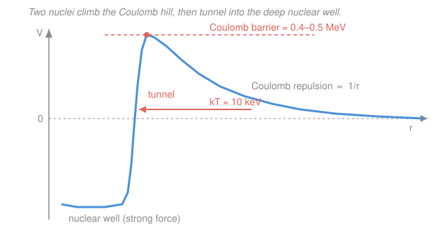

# Intro to Nuclear Engineering & Radiation · Lesson 4.1: Fusion basics

> ⏱ ~15 min · Module 4: Radiation interactions, dose & a reactor overview · Builds on: [1.2 Binding energy & the chart of nuclides](01-02-binding-energy-chart-of-nuclides.md), [1.5 Nuclear reactions & Q-values](01-05-nuclear-reactions-q-values.md) · Unlocks: [`fusion-plasma`](../../fusion-plasma/syllabus.md)

## Why this matters

Fission splits a heavy nucleus; fusion welds two light ones — and both release energy for the *same* reason you met in [1.2](01-02-binding-energy-chart-of-nuclides.md): they climb the binding-energy-per-nucleon curve toward the iron peak. Fusion powers every star and is the prize the tokamak and laser-fusion programs are chasing, because deuterium is nearly free and the ash is helium. The catch is that two positive nuclei violently repel, and the whole engineering problem — 100-million-degree plasmas, magnetic bottles, the Lawson criterion — exists to force them close enough anyway. This lesson is the physics that sets the bar every fusion machine must clear.

## The idea

Look again at the B/A curve from [1.2](01-02-binding-energy-chart-of-nuclides.md). It rises *steeply* on the light side: going from hydrogen toward helium buys a huge jump in binding energy per nucleon. So fusing light nuclei drops the system into a deeper well and spits out the difference — and per nucleon it pays far more than fission (a D-T fusion releases about 3.5 MeV per nucleon, versus roughly 0.85 MeV per nucleon for uranium fission).

So why isn't the world already fusion-powered? Because to fuse, two nuclei must touch — get within the ~femtometer reach of the strong force — and both are positively charged. As they approach, their Coulomb repulsion builds a **barrier**: a hill of potential energy, hundreds of keV tall, that they must surmount before the strong force can grab them and slam them into the deep nuclear well. A gas at fusion-relevant temperatures carries only ~10 keV of thermal energy per particle — nowhere near enough to go *over* the hill. Two things rescue us: **quantum tunneling** lets a nucleus slip *through* the barrier even without the energy to top it, and the **high-energy tail** of a hot plasma's speed distribution supplies the rare fast particles that tunnel most easily. Crank the temperature and both effects switch on. That is the whole reason fusion demands a star's core, or a very good imitation of one.

## The formal version

**The workhorse reaction (D-T).** Deuterium and tritium — the two heavy hydrogen isotopes — fuse to helium plus a neutron:

$$\ce{^{2}_{1}H + ^{3}_{1}H -> ^{4}_{2}He + ^{1}_{0}n}, \qquad Q = +17.6\ \text{MeV}.$$

*In words: one deuteron plus one triton make an alpha particle and a fast neutron, releasing 17.6 MeV* — computed exactly as in [1.5](01-05-nuclear-reactions-q-values.md), from the mass difference times $c^2$. Momentum conservation splits that energy inversely to mass: the light neutron sprints off with $\tfrac{4}{5}(17.6) = 14.1\ \text{MeV}$ and the alpha keeps $\tfrac{1}{5}(17.6) = 3.5\ \text{MeV}$. That split is an engineering fact of life — the 14.1 MeV neutron leaves the plasma to deposit its energy (and breed more tritium) in the surrounding blanket, while the charged 3.5 MeV alpha stays trapped by the magnetic field and *heats the plasma from within*.

**The Coulomb barrier.** Two nuclei of charges $Z_1 e$ and $Z_2 e$ separated by $r$ have electrostatic potential energy

$$V(r) = \frac{k\,Z_1 Z_2 e^2}{r}, \qquad k = \frac{1}{4\pi\varepsilon_0},$$

which for nuclear work is handiest as $k e^2 = 1.44\ \text{MeV·fm}$. *In words: the repulsion energy grows without bound as the nuclei close in — the closer they get, the harder they push apart.* The barrier peaks where the strong force takes over, at a separation of a few femtometers, giving a barrier height of hundreds of keV (Example 1).

**Temperature and the tail.** A plasma at temperature $T$ has a Maxwell–Boltzmann speed distribution with characteristic thermal energy $kT$; fusion research quotes temperatures directly *as* energies, so "$T \approx 10\ \text{keV}$" means $kT \approx 10\ \text{keV}$, i.e. $T \approx 1.2\times10^{8}\ \text{K}$ (using $1\ \text{eV} \approx 11{,}600\ \text{K}$). *In words: a "10 keV plasma" is a hundred million degrees.* Since $10\ \text{keV} \ll$ the barrier, fusion happens only because the exponential tail of the distribution supplies rare fast ions and quantum tunneling lets even those slip through — the reaction rate is set by the product of these two, both bridges to your future courses in tunneling ([`quantum-mechanics`](../../quantum-mechanics/syllabus.md)) and the Maxwell–Boltzmann tail ([`stat-mech`](../../stat-mech/syllabus.md)).

**Ignition and the Lawson criterion.** To get net energy out, a plasma must be *hot* enough to fuse, *dense* enough to fuse often, and *confined* long enough for the fusions to pay for the losses. Lawson's condition bundles all three into a **triple product** of density $n$ (particles per m³), energy-confinement time $\tau$ (s), and temperature $T$ (keV):

$$n\,\tau\,T \;\gtrsim\; 10^{21}\ \text{keV·s/m}^3 \quad (\text{D-T}).$$

*In words: density × how long you hold it × temperature must exceed a threshold* — you can trade the three off, but their product can't drop below the bar. **Ignition** is the stronger milestone where the trapped 3.5 MeV alphas alone keep the plasma hot with no external heating — fusion becomes self-sustaining. (Treat the number as a target to hit, not something we derive here.)

## Picture

## Worked examples

**Example 1 (how tall is the hill?).** Estimate the Coulomb barrier for D-T and compare it to the thermal energy of a 10 keV plasma.

Both nuclei have $Z = 1$, so $Z_1 Z_2 = 1$. The barrier sits where they just touch: add the two nuclear radii using $R \approx r_0 A^{1/3}$ with $r_0 = 1.2\ \text{fm}$,

$$R_{\text{D}} = 1.2\,(2)^{1/3} \approx 1.5\ \text{fm}, \qquad R_{\text{T}} = 1.2\,(3)^{1/3} \approx 1.7\ \text{fm}, \qquad r \approx 3.2\ \text{fm}.$$

Using $k e^2 = 1.44\ \text{MeV·fm}$,

$$V = \frac{k e^2}{r} = \frac{1.44\ \text{MeV·fm}}{3.2\ \text{fm}} \approx 0.45\ \text{MeV} = 450\ \text{keV}.$$

So the barrier is roughly **half an MeV**, while the plasma's thermal energy is only $\sim 10\ \text{keV}$ — about **45× too small**. Classically, essentially nothing should fuse at 10 keV. It happens only because a lucky few ions from the high-energy tail *tunnel* through the barrier rather than climbing it — the "tunnel" arrow in the figure. (This is also why we don't just heat to 500 keV: at those temperatures radiation and confinement losses swamp the gain — ~10 keV is the sweet spot where tunneling plus the tail wins.)

**Example 2 (does it clear the Lawson bar?).** A tokamak runs at $T = 10\ \text{keV}$ with plasma density $n = 10^{20}\ \text{m}^{-3}$. What energy-confinement time $\tau$ does it need to meet the D-T threshold?

Solve the triple product for $\tau$:

$$\tau \;\gtrsim\; \frac{10^{21}}{n\,T} = \frac{10^{21}}{(10^{20})(10)} = \frac{10^{21}}{10^{21}} = 1\ \text{s}.$$

Hold a 10²⁰-per-m³ plasma's heat for about **one second** and you clear the bar — which is exactly why magnetic confinement is so hard: keeping a 100-million-degree gas from cooling for a full second is a monumental feat.

*Contrast — the other route.* Inertial-confinement fusion gives up on long $\tau$ and instead crushes a fuel pellet to enormous density. If a laser holds the fuel for only $\tau \approx 10^{-11}\ \text{s}$ at the same $T = 10\ \text{keV}$, the required density is

$$n \;\gtrsim\; \frac{10^{21}}{T\,\tau} = \frac{10^{21}}{(10)(10^{-11})} = 10^{31}\ \text{m}^{-3},$$

about a thousand times solid density. Same triple product, opposite strategy: magnetic fusion bets on time, inertial fusion bets on density.

## Watch out

- **You might think you must heat the plasma *over* the barrier (~0.5 MeV).** You don't — and you can't afford to. Fusion at ~10 keV runs entirely on quantum tunneling by the fast tail of the distribution; the reaction rate peaks at a compromise energy (the "Gamow peak") far below the barrier top.
- **You might read the Lawson number as needing all three quantities individually large.** It's the *product* $n\tau T$ that must clear the threshold — you trade density against confinement time freely, which is exactly what separates tokamaks (low $n$, long $\tau$) from laser fusion (huge $n$, tiny $\tau$).
- **You might expect the alpha to carry most of the 17.6 MeV since it's the bigger piece.** Backwards: momentum conservation hands the *lighter* neutron the *larger* share (14.1 MeV). That neutron energy leaves the plasma — only the 3.5 MeV alpha stays behind to heat it, which is why ignition is defined by the alphas.

## One-liner

> Fusion pays off because light nuclei climb the steep side of the B/A curve — but only if you tunnel through a ~0.5 MeV Coulomb barrier at ~10 keV, and only if $n\tau T$ clears the Lawson bar.

## Problems

**P1 (🟢)** Compute the Coulomb barrier for two deuterons ($Z=1$ each, D-D fusion) that must approach to $r = 4\ \text{fm}$ to touch. Use $k e^2 = 1.44\ \text{MeV·fm}$. Is it larger or smaller than the D-T barrier from Example 1, and why?

**P2 (🟡)** A magnetic-confinement experiment reaches $n = 2\times10^{20}\ \text{m}^{-3}$, $\tau = 0.4\ \text{s}$, and $T = 10\ \text{keV}$. Compute its triple product and decide whether it meets the D-T Lawson threshold of $10^{21}\ \text{keV·s/m}^3$. If it falls short, by what factor must one quantity improve (holding the others fixed) to reach the bar?

**P3 (🔴)** The proton–proton chain that powers the Sun starts with $\ce{^{1}_{1}H + ^{1}_{1}H}$. The Sun's core is only about $1.5\times10^{7}\ \text{K}$ ($kT \approx 1.3\ \text{keV}$), far cooler than a D-T reactor. Given that the p-p Coulomb barrier is comparable to D-T's (~hundreds of keV), give two physical reasons the Sun fuses at all despite such a low temperature.

Solutions

**P1** With $Z_1 Z_2 = 1$ and $r = 4\ \text{fm}$,

$$V = \frac{k e^2}{r} = \frac{1.44\ \text{MeV·fm}}{4\ \text{fm}} = 0.36\ \text{MeV} = 360\ \text{keV}.$$

That's *smaller* than the D-T barrier (~450 keV) only because I used a slightly larger contact radius here; the *charge* factor $Z_1 Z_2 = 1$ is identical for D-D and D-T, so the two barriers are essentially the same height (a few hundred keV). Barrier height scales as $Z_1 Z_2 / r$ — same charges, so same ballpark. *Check:* units $\text{MeV·fm}/\text{fm} = \text{MeV}$ ✓; the value sits in the "hundreds of keV" range as expected ✓.

**P2** Triple product:

$$n\tau T = (2\times10^{20})(0.4)(10) = 8\times10^{20}\ \text{keV·s/m}^3.$$

Compare to the bar $10^{21}$: it falls short, since $8\times10^{20} < 10^{21}$. The shortfall factor is $10^{21}/(8\times10^{20}) = 1.25$. So any *one* of $n$, $\tau$, or $T$ must improve by a factor of **1.25** (e.g. push $\tau$ from 0.4 s to 0.5 s) to reach ignition-scale conditions. *Check:* $8\times10^{20} \times 1.25 = 10^{21}$ ✓.

**P3** Two reasons, both from this lesson:

1. **Sheer numbers plus time.** The Lawson picture rewards enormous $n\tau$: the Sun's core is fantastically dense and gravitationally confined for *billions of years*, so even a minuscule per-collision fusion probability, multiplied over that density and time, yields steady power. It buys with $n$ and $\tau$ what it lacks in $T$.
2. **Tunneling by the tail.** Even at $kT \approx 1.3\ \text{keV}$, the Maxwell–Boltzmann distribution has a high-energy tail, and quantum tunneling lets those rare fast protons penetrate the barrier without topping it. (A third, more advanced reason: the first p-p step proceeds by the *weak* interaction — a proton must convert to a neutron — making it slow, which is precisely why the Sun burns gently for eons.) *Check:* both mechanisms are the same two that rescue lab fusion at 10 keV — tunneling and the distribution tail — just pushed to lower $T$ by huge $n\tau$. ✓

## Flashback

**From Lesson 1.5 (Nuclear reactions & Q-values):** Compute the Q-value of the deuterium–deuterium fusion reaction $\ce{^{2}_{1}H + ^{2}_{1}H -> ^{3}_{2}He + ^{1}_{0}n}$ using atomic masses $m(\ce{^{2}H}) = 2.014102\ \text{u}$, $m(\ce{^{3}He}) = 3.016029\ \text{u}$, $m(n) = 1.008665\ \text{u}$, and $1\ \text{u} = 931.494\ \text{MeV}/c^2$. Is it exothermic?

Solution

The Q-value is the mass lost, converted to energy (electrons balance: two D atoms carry 2 electrons on the left, the ³He atom carries 2 on the right, and the free neutron none):

$$Q = \big[\,2\,m(\ce{^{2}H}) - m(\ce{^{3}He}) - m(n)\,\big]c^2.$$

$$2(2.014102) - 3.016029 - 1.008665 = 4.028204 - 4.024694 = 0.003510\ \text{u}.$$

$$Q = 0.003510 \times 931.494\ \text{MeV} \approx 3.27\ \text{MeV}.$$

$Q > 0$, so the reaction is **exothermic** — as any fusion of nuclei this light must be, since they lie on the steep left rise of the B/A curve. *Check:* the mass defect is positive (products lighter than reactants) and the yield is a few MeV, in line with D-T's 17.6 MeV being unusually large among fusion reactions. ✓

## Connections

- **Backward:** the energy release traces straight to the B/A curve of [1.2](01-02-binding-energy-chart-of-nuclides.md) — light nuclei sit low on the binding curve, so welding them climbs toward the iron peak — and the +17.6 MeV is a Q-value computed exactly as in [1.5](01-05-nuclear-reactions-q-values.md).
- **Forward:** the 14.1 MeV D-T neutron is the star of [4.2 Photons through matter](04-02-photons-through-matter.md)'s sibling problem — how that fast neutron (and the gammas it spawns) deposits energy and dose in the blanket and shield. The full plasma-confinement machinery is the whole of [`fusion-plasma`](../../fusion-plasma/syllabus.md), which this lesson opens the door to.
- **Sideways:** the barrier is only beatable because of **quantum tunneling** ([`quantum-mechanics`](../../quantum-mechanics/syllabus.md)) acting on the **Maxwell–Boltzmann high-energy tail** ([`stat-mech`](../../stat-mech/syllabus.md)) — the same two ideas that let a below-barrier plasma fuse are the ones that make stars shine.
