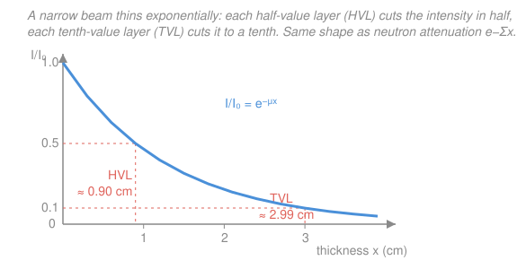
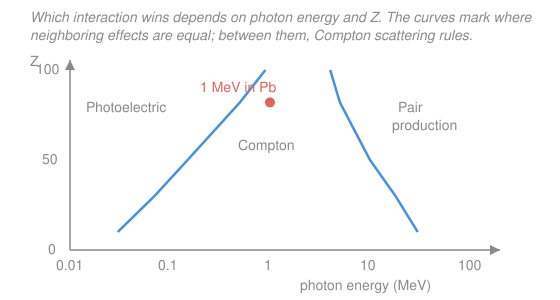

# Intro to Nuclear Engineering & Radiation · Lesson 4.2: Photons through matter

> ⏱ ~15 min · Module 4: Radiation interactions, dose & a reactor overview · Builds on: [2.2 Macroscopic cross-section & mean free path](02-02-macroscopic-cross-section-mean-free-path.md) · Unlocks: [4.4 Dose quantities](04-04-dose-quantities.md), [`radiation-detection-shielding`](../../radiation-detection-shielding/syllabus.md)

## Why this matters

Gamma rays are the reason spent fuel sits behind meters of water and the reason a radiography crew keeps its distance. Unlike a charged particle, a photon doesn't slow down gradually — it either sails through untouched or is knocked out of the beam in a single event. That "all-or-nothing" character makes shielding a clean exponential problem: pick a material, look up one number, and you can size a lead wall to knock a beam down by a factor of a thousand. This lesson gives you that number and the three physical processes hiding behind it.

## The idea

A photon travelling through matter faces a gauntlet of atoms, and at each atom it runs a small chance of a knockout interaction. If it interacts, it leaves the beam — absorbed or scattered off in a new direction. If it doesn't, it keeps going at full energy. There's no friction, no gradual dimming of an individual photon: the *beam* dims only because it keeps losing members.

That is exactly the situation from [2.2](02-02-macroscopic-cross-section-mean-free-path.md), where a neutron beam thinned as $e^{-\Sigma x}$. Same story, new particle: the photon's "removal per centimeter" gets its own symbol, the **linear attenuation coefficient** $\mu$, and the surviving (uncollided) beam falls off as $e^{-\mu x}$. If $\Sigma$ was the neutron's, $\mu$ is the photon's — they play identical roles.

What sets $\mu$? Three competing ways a photon can be removed, each winning in a different regime:

- **Photoelectric effect** — the photon is *completely swallowed* by an atom, kicking out a bound electron. This is a low-energy, high-$Z$ game: its cross-section scales roughly as $Z^4$–$Z^5$, which is why lead (and your dentist's lead apron) is so good at soaking up soft X-rays and low-energy gammas.
- **Compton scattering** — the photon glances off a loosely-bound electron like a cue ball, handing over *part* of its energy and flying onward with less. This dominates the middle-energy band (roughly 0.1–5 MeV for most materials) and depends only weakly on $Z$ — it scales with the *number* of electrons, i.e. with $Z$.
- **Pair production** — above a threshold, the photon vanishes near a nucleus and turns its energy into an electron–positron pair. It can't happen at all below $1.022\,\text{MeV}$ (you need $2m_e c^2$ of energy to make two electron masses), and it grows with energy and with $Z^2$ above that.

Which one wins is a map in two coordinates — photon energy and absorber $Z$ — and that map (Picture, second figure) is worth memorizing.

## The formal version

**Exponential attenuation (narrow beam).** For a collimated ("narrow") beam of mono-energetic photons, the transmitted intensity $I$ after thickness $x$ (cm) is

$$I(x) = I_0\, e^{-\mu x},$$

where $I_0$ is the incident intensity and $\mu$ (units $\text{cm}^{-1}$) is the **linear attenuation coefficient**. *In words: the fraction of photons that make it straight through drops by a constant multiplicative factor for every extra centimeter of material.*

$\mu$ is built the same way $\Sigma$ was: $\mu = n\,\sigma_{\text{tot}}$, where $n$ is atoms per unit volume and $\sigma_{\text{tot}}=\sigma_{\text{photo}}+\sigma_{\text{Compton}}+\sigma_{\text{pair}}$ is the total photon cross-section summed over the three mechanisms. *In words: each process adds its own removal rate, and $\mu$ is their sum.*

**Mass attenuation coefficient.** Because $\mu$ scales with how tightly packed the atoms are, it's cleaner to divide out the density $\rho$ (g/cm³):

$$\frac{\mu}{\rho}\ \ (\text{cm}^2/\text{g}), \qquad I = I_0\, e^{-(\mu/\rho)\,(\rho x)}.$$

*In words: what actually attenuates the beam is the mass you put in its path (grams per cm²), not the raw thickness* — so $\mu/\rho$ is tabulated once per material and barely changes between, say, water and ice.

**Half-value layer and tenth-value layer.** The thickness that halves the beam:

$$\text{HVL} = \frac{\ln 2}{\mu} \approx \frac{0.693}{\mu}, \qquad \text{TVL} = \frac{\ln 10}{\mu} \approx \frac{2.303}{\mu}.$$

*In words: HVL is the "half-life" of the beam in space, and TVL is one full factor-of-ten.* Note $\text{TVL} = (\ln 10/\ln 2)\,\text{HVL} \approx 3.32\,\text{HVL}$, so three HVLs already cut you to about $1/8$ and ten HVLs to about $1/1000$.

**Buildup factor (broad beam).** The clean formula above counts only *uncollided* photons. A real shield is wide, and a Compton-scattered photon can bounce back into the beam line with reduced energy but nonzero dose. We patch this with a **buildup factor** $B \ge 1$:

$$I_{\text{broad}} = B(\mu x)\, I_0\, e^{-\mu x}.$$

*In words: scattered photons "add back" to what a detector sees, so the true intensity behind a thick shield is higher than $e^{-\mu x}$ predicts — a shield designed by the narrow-beam formula is always a little too thin.* $B$ grows with thickness (more chances to scatter) and can reach several for thick, mid-$Z$ shields.

## Picture

## Worked examples

**Example 1 (the shielding workhorse — 1 MeV gammas in lead).** For 1 MeV photons in lead, $\mu = 0.77\,\text{cm}^{-1}$. Find the half-value layer, and the lead thickness that cuts the beam by a factor of 1000.

The HVL is a direct plug-in:

$$\text{HVL} = \frac{\ln 2}{\mu} = \frac{0.693}{0.77} = 0.90\,\text{cm}.$$

For a factor-of-1000 reduction we want $I/I_0 = 1/1000$. Invert the attenuation law:

$$\frac{I}{I_0}=e^{-\mu x}=\frac{1}{1000}\ \Longrightarrow\ \mu x = \ln 1000 \ \Longrightarrow\ x = \frac{\ln 1000}{\mu} = \frac{6.908}{0.77} = 8.97\,\text{cm}.$$

Two sanity checks. First, $\ln 1000 = 3\ln 10$, so $x = 3\,\text{TVL} = 3\times(2.303/0.77)=3\times 2.99=8.97\,\text{cm}$ — a factor of $1000 = 10^3$ is exactly three tenth-value layers. Second, $8.97/0.90 \approx 10$ HVLs, and $2^{10}=1024 \approx 1000$. Everything agrees. About 9 cm of lead per factor of 1000 — that's why shields get heavy fast.

**Example 2 (which mechanism? read the map).** For each case, name the dominant interaction and say why.

- **60 keV photon in lead ($Z=82$).** Low energy, high $Z$ — deep in the upper-left of the map: **photoelectric**. The $Z^4$–$Z^5$ scaling means lead is dramatically more absorbing here than tissue, which is the entire principle behind a lead apron and behind bone showing up bright on an X-ray.
- **1 MeV photon in tissue ($Z \approx 7.5$).** Mid energy, low $Z$ — squarely in the central band: **Compton scattering**. This is the workhorse interaction for reactor and medical gammas in light materials, and it's why dose in tissue tracks electron density rather than $Z$.
- **10 MeV photon in lead ($Z=82$).** Well above the $1.022\,\text{MeV}$ threshold, high $Z$ — upper-right: **pair production**. The $Z^2$ dependence and rise with energy make the heavy nucleus the preferred stage for converting the photon into an $e^-e^+$ pair.

The coral dot on the map (1 MeV in lead, $Z=82$) sits just inside the Compton band — even in lead, a 1 MeV gamma is most likely Compton-scattered, with photoelectric absorption a close second. That mix is exactly what the single number $\mu=0.77\,\text{cm}^{-1}$ in Example 1 is bundling together.

## Watch out

- **You might think a thick enough narrow-beam calculation is a safe shield design — it isn't.** The buildup factor means the real dose behind a broad shield is $B$ times higher than $e^{-\mu x}$ says, and $B$ can be 3–5 for a thick mid-$Z$ slab. Always design with margin (or with tabulated $B$); never trust bare $e^{-\mu x}$ for a final wall.
- **You might think "denser is always better" or "high-$Z$ is always better."** Density helps (it packs more attenuating mass into less thickness — that's the point of the mass-attenuation view), but $Z$ only helps where photoelectric or pair production lead. In the Compton-dominated middle band, attenuation per gram is nearly material-independent, so a gram of water and a gram of lead remove almost equally — lead just wins on grams-per-cm.
- **You might expect a photon to slow down like a bullet in sand.** It doesn't. A photon travels at full energy until a single event removes it (or, in Compton, kicks it to a new energy and direction in one step). "Attenuation" is the beam losing members, not each photon losing speed — very different from the charged particles of [4.3](04-03-charged-particles-through-matter.md).

## One-liner

> A narrow gamma beam thins as $I=I_0e^{-\mu x}$ — photoelectric, Compton, and pair production summed into one $\mu$ — so every $\text{HVL}=\ln2/\mu$ halves it and three TVLs buy you a factor of a thousand.

## Problems

**P1 (🟢)** A narrow beam of 0.5 MeV gammas passes through water, where $\mu = 0.10\,\text{cm}^{-1}$. (a) Find the half-value layer. (b) What fraction of the beam is transmitted through 20 cm of water?

**P2 (🟡)** At 2 MeV the mass attenuation coefficient is about $\mu/\rho = 0.045\,\text{cm}^2/\text{g}$ for both aluminum ($\rho = 2.7\,\text{g/cm}^3$) and iron ($\rho = 7.9\,\text{g/cm}^3$) — in the Compton band, attenuation per gram is nearly material-independent. Find $\mu$ and the HVL for each. Which shields better per centimeter, and why doesn't the near-equal $\mu/\rho$ contradict that?

**P3 (🔴)** You size a lead shield for a factor-of-1000 reduction of 1 MeV gammas using the narrow-beam result from Example 1: $x = 8.97\,\text{cm}$. But this shield is broad, with a buildup factor $B \approx 4$ at that thickness. (a) What is the *actual* intensity reduction factor including buildup? (b) Roughly how much extra lead (using $\text{HVL}=0.90\,\text{cm}$) restores a true factor of 1000, if $B$ stayed fixed?

Solutions

**P1** (a) $\text{HVL} = \ln 2/\mu = 0.693/0.10 = 6.93\,\text{cm}$.

(b) $I/I_0 = e^{-\mu x} = e^{-0.10\times 20} = e^{-2} = 0.135$, so about **13.5%** transmitted.

*Check.* $20\,\text{cm} = 20/6.93 \approx 2.9$ HVLs, and $2^{-2.9} \approx 0.134$ ✓. Units: $\mu x = (\text{cm}^{-1})(\text{cm})$ is dimensionless, as an exponent must be. ✓

**P2** Get $\mu = (\mu/\rho)\,\rho$ for each, then $\text{HVL}=\ln2/\mu$:

$$\text{Al:}\ \mu = 0.045\times 2.7 = 0.122\,\text{cm}^{-1},\quad \text{HVL}=\frac{0.693}{0.122}=5.7\,\text{cm}.$$
$$\text{Fe:}\ \mu = 0.045\times 7.9 = 0.356\,\text{cm}^{-1},\quad \text{HVL}=\frac{0.693}{0.356}=1.9\,\text{cm}.$$

Iron shields far better per centimeter — its HVL is about a third of aluminum's. No contradiction: equal $\mu/\rho$ means equal attenuation *per gram in the path*, but iron packs roughly three times as many grams into each centimeter ($\rho$ ratio $7.9/2.7 \approx 2.9$). Density, not per-gram physics, is what buys you thinner shields in the Compton band.

*Check.* The HVL ratio $5.7/1.9 = 3.0$ matches the density ratio $2.9$ (rounding) ✓ — HVL $\propto 1/\mu \propto 1/\rho$ at fixed $\mu/\rho$.

**P3** (a) Uncollided beam is $e^{-\mu x} = 1/1000$ by construction; buildup multiplies what reaches the far side by $B=4$:

$$\frac{I_{\text{broad}}}{I_0} = B\,e^{-\mu x} = 4\times\frac{1}{1000} = \frac{1}{250}.$$

So the *actual* reduction is only a factor of **250**, not 1000 — the shield underperforms by a factor of 4.

(b) To claw back that factor of 4 you need extra thickness $\Delta x$ with $e^{-\mu\,\Delta x} = 1/4$, i.e. $\Delta x = \ln 4/\mu = 2\,\text{HVL} = 2\times 0.90 = 1.8\,\text{cm}$ more lead (about 10.8 cm total).

*Check.* $\ln 4 = 2\ln 2$, so exactly two HVLs undo a factor of 4 ✓. (In reality $B$ itself creeps up as the shield thickens, so the honest design iterates — but 2 HVLs is the right first correction.)

## Flashback

**From Lesson 2.2 (Macroscopic cross-section & mean free path):** A narrow beam of thermal neutrons passes through a 2 cm slab of a material with total macroscopic cross-section $\Sigma_t = 0.5\,\text{cm}^{-1}$. What fraction of the beam passes through uncollided, and what is the neutron mean free path? (Fresh variant — note the deliberate parallel to $\mu$.)

Solution

Uncollided fraction is the same exponential, with $\Sigma_t$ in place of $\mu$:

$$\frac{I}{I_0} = e^{-\Sigma_t x} = e^{-0.5\times 2} = e^{-1} = 0.368,$$

so about **37%** get through untouched. The mean free path is

$$\lambda = \frac{1}{\Sigma_t} = \frac{1}{0.5} = 2\,\text{cm}.$$

*Check.* The slab is exactly one mean free path thick ($x=\lambda$), so the survivors are $e^{-1}$ — the fraction that goes one mfp without a collision, by definition ✓. Photons obey the identical law with $\mu\leftrightarrow\Sigma_t$; the physics of "removal per unit length" is the same, only the mechanisms differ.

## Connections

- **Backward:** this is [2.2](02-02-macroscopic-cross-section-mean-free-path.md)'s $e^{-\Sigma x}$ wearing a photon's uniform — $\mu$ *is* the photon's macroscopic cross-section, built as $\mu=n\sigma_{\text{tot}}$ just as $\Sigma=N\sigma$, and $1/\mu$ is a photon mean free path. The three cross-sections summing into $\mu$ trace back to [2.1](02-01-microscopic-cross-section.md)'s "cross-section as effective area."
- **Forward:** the energy these interactions dump into electrons becomes **absorbed dose** in [4.4](04-04-dose-quantities.md), and real shield design — buildup factors, broad-beam geometry, dose behind a wall — is the whole subject of [`radiation-detection-shielding`](../../radiation-detection-shielding/syllabus.md), the shelf sequel this lesson is the on-ramp to. Contrast the abrupt, single-event removal here with the gradual stopping of charged particles in [4.3](04-03-charged-particles-through-matter.md).
- **Sideways:** pair production's $1.022\,\text{MeV}$ threshold is $2m_ec^2$ straight out of special relativity ($E=mc^2$) — the photon must carry at least the rest energy of the two particles it creates. The photoelectric effect is the same quantized photon–electron transaction that grounds atomic structure in quantum mechanics and general chemistry.
