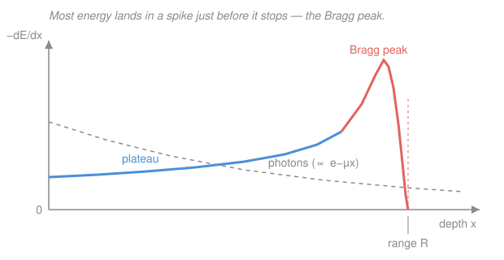

# Intro to Nuclear Engineering & Radiation · Lesson 4.3: Charged particles through matter

> ⏱ ~15 min · Module 4: Radiation interactions, dose & a reactor overview · Builds on: [4.2 Photons through matter](04-02-photons-through-matter.md), [`em-refresher`](../../em-refresher/syllabus.md) · Unlocks: [4.4 Dose quantities](04-04-dose-quantities.md), [`radiation-detection-shielding`](../../radiation-detection-shielding/syllabus.md)

## Why this matters

The alpha particle that will not cross a sheet of paper and the alpha that lodges in your lung are the *same* particle — geometry is the whole story. Charged particles (alphas, betas, fission fragments, therapy protons) don't attenuate like gammas; they plow through matter losing energy the entire way and stop at a **definite depth**. That single fact explains why a beta source is harmless in your pocket but dangerous swallowed, why a proton beam can kill a deep tumor while sparing the skin in front of it, and why you shield betas with plastic, not lead. This lesson is the charged-particle half of "how radiation deposits its energy" — the setup for dose in [4.4](04-04-dose-quantities.md).

## The idea

A gamma ray (Lesson [4.2](04-02-photons-through-matter.md)) travels untouched until *one* violent event removes it — all-or-nothing, which is why a beam thins exponentially but individual photons can go arbitrarily deep. A charged particle is the opposite. It drags its electric field through a sea of atomic electrons, and with *every* atom it passes it tugs on those electrons, kicking them loose (ionization) or bumping them up (excitation). Each nudge steals a few eV. There are so many electrons that the particle bleeds energy **continuously and smoothly**, like a car coasting through deep mud, and eventually runs out — full stop, at a predictable distance.

Two instincts to build. First: **slow, heavy, highly-charged particles are the muddiest.** A slow particle lingers near each electron longer, so it pulls harder; a doubly-charged particle pulls twice as hard on each electron (and energy goes as the square). That's why an alpha — charge $+2$, lumbering — stops in *microns* while a nimble beta of the same energy travels centimeters. Second, the twist that makes it useful: as the particle slows near the end of its track, it deposits energy *faster and faster*, piling up a spike of dose right before it halts — the **Bragg peak**.

## The formal version

**Stopping power.** The energy a charged particle loses per unit path length is the **linear stopping power**

$$S = -\frac{dE}{dx} \qquad \left[\text{MeV/cm, or MeV·cm}^2\text{/g when divided by density}\right].$$

*In words: stopping power is how many MeV the particle sheds per centimeter it travels* — big $S$ means it stops in a short distance.

**Bethe formula (the intuition).** For a particle of charge $ze$ (so $z=2$ for an alpha, $z=1$ for a proton or beta) moving at speed $v$ through a target with electron number density $n_e$, the ionization stopping power is

$$-\frac{dE}{dx} \;\propto\; \frac{z^2}{v^2}\, n_e \,\ln(\cdots),$$

where the logarithm is a slowly-varying factor we'll ignore. *In words: stopping power grows with the square of the particle's charge, falls with the square of its speed, and scales with how many electrons the target packs in.* Three levers:

- **$z^2$** — double the charge, quadruple the drag. Alphas ($z=2$) are hit $4\times$ harder than protons at the same speed.
- **$1/v^2$** — *slower particles deposit more.* This is the counterintuitive one, and it's what builds the Bragg peak.
- **$n_e$** — denser, higher-$Z$ materials (more electrons per cm³) stop particles in less distance. This is why range is best quoted in **g/cm²** (path length × density), which is nearly material-independent.

**Range.** Because the loss is continuous, a particle of initial energy $E_0$ travels a finite, well-defined distance before stopping:

$$R = \int_0^{E_0} \frac{dE}{\,-dE/dx\,}.$$

*In words: add up the little distances it takes to shed each slice of energy, from full energy down to zero.* Unlike photons (no fixed range — only a half-value layer), a charged particle has a sharp **range** $R$: nearly all particles of a given energy stop at almost the same depth. A useful rule of thumb for betas is $R\,[\text{g/cm}^2] \approx 0.4\,E^{1.3}$ with $E$ in MeV.

**The Bragg peak.** Follow the particle inward. It starts fast, so $1/v^2$ is small and it deposits gently (the *plateau*). As it slows, $1/v^2$ climbs, so $-dE/dx$ climbs — and in the last fraction of the range it is crawling, dumping energy furiously in a narrow **Bragg peak** just before it stops dead. *In words: a charged particle saves its biggest energy dump for the very end of its trip.* Placing that peak on a tumor is the entire basis of **proton and ion therapy**.

**Bremsstrahlung.** Light particles have a second loss channel. Whenever a charge accelerates it radiates ([`em-refresher`](../../em-refresher/syllabus.md)); a beta *decelerating* in the field of a nucleus emits a photon — **bremsstrahlung** ("braking radiation"). The radiated fraction grows with the target's atomic number and the particle's energy, roughly

$$f \;\approx\; 3.5\times10^{-4}\, Z\, E \quad (E \text{ in MeV}),$$

and radiative loss scales as $1/m^2$, so it matters for feather-light electrons but is negligible for alphas and protons. *In words: fast electrons in high-Z materials turn part of their energy into penetrating X-rays.* The engineering consequence is backwards from intuition: **shield betas with low-Z materials** (plastic, aluminum), because lead would breed a shower of bremsstrahlung X-rays that then need their *own* shielding.

## Picture

## Worked examples

**Example 1 (Bethe scaling — why an alpha stops in microns).** Compare the stopping power of a 5 MeV alpha, a 5 MeV proton, and a 5 MeV beta entering tissue. Use $S \propto z^2/v^2$; for the heavy particles $v$ is non-relativistic, so $\tfrac12 m v^2 = E \Rightarrow v^2 = 2E/m$, giving $S \propto z^2 m /E$. At fixed $E$ we just compare $z^2 m$ (in units of the proton, using $m_\alpha \approx 4m_p$):

$$\frac{S_\alpha}{S_p} \approx \frac{z_\alpha^2\, m_\alpha}{z_p^2\, m_p} = \frac{2^2 \cdot 4}{1^2 \cdot 1} = 16.$$

The alpha deposits energy about **16× faster** than a proton of the same energy — it is both more charged and, being heavier, much slower ($v_\alpha/v_p = \sqrt{m_p/m_\alpha} = 1/2$). Its range is correspondingly tiny: a 5 MeV alpha stops in roughly $40\ \mu\text{m}$ of tissue (a few cm of air) — literally stopped by the dead outer layer of your skin or a sheet of paper.

The beta is a different animal: at 5 MeV an electron is *ultra-relativistic*, $v \approx c$, so its $1/v^2$ is as small as it can be. With $z=1$ and $v\approx c$, its stopping power is roughly $1/94$ of the proton's (which had $v^2/c^2 = 2E/m_pc^2 = 2\cdot5/938 \approx 0.011$) and $\sim\!1/1500$ of the alpha's. Same 5 MeV, but the beta travels **centimeters** where the alpha travels microns. That three-order-of-magnitude spread in range, from one formula, is the practical heart of radiation protection.

**Example 2 (shielding choice — plastic beats lead for betas).** You must shield a beta source with maximum energy $E = 2$ MeV. Compare the bremsstrahlung produced in aluminum ($Z = 13$) versus lead ($Z = 82$) using $f \approx 3.5\times10^{-4}\,Z\,E$:

$$f_{\text{Al}} = 3.5\times10^{-4}(13)(2) \approx 0.0091, \qquad f_{\text{Pb}} = 3.5\times10^{-4}(82)(2) \approx 0.057.$$

Aluminum converts about **0.9%** of the beta energy into X-rays; lead converts about **5.7%** — roughly $82/13 \approx 6\times$ more. Both materials will physically stop a 2 MeV beta in a couple of millimeters, but lead does it while spraying six times as many penetrating bremsstrahlung photons out the back, and those X-rays sail through far more shielding than the betas ever would. So you stop the betas with a low-Z absorber (a few mm of plastic or aluminum), and *only then*, if the residual X-rays matter, back it with lead. Reaching for lead first makes the problem worse.

## Watch out

- **You might think range works like a half-value layer.** It doesn't. Photons have *no* maximum range — a beam attenuates by a fixed fraction per HVL and stragglers go deep ([4.2](04-02-photons-through-matter.md)). Charged particles have a sharp, near-identical stopping depth: past the range, dose is essentially zero.
- **You might think faster particles are more damaging locally.** Backwards — the $1/v^2$ law means a particle deposits the *most* energy per cm when it's *slowest*, right at the end of its track. That's the Bragg peak, and it's why the dose peaks deep, not at the surface.
- **You might reach for lead to stop betas.** High-Z is great for gammas but terrible for betas: it maximizes bremsstrahlung. Low-Z materials (plastic, water, aluminum) stop the electrons cleanly with far fewer X-rays.

## One-liner

> Charged particles bleed energy continuously by ionizing electrons at a rate $-dE/dx \propto z^2/v^2$, stop at a sharp range, and — because slow means muddy — dump their heaviest dose in a Bragg peak just before they halt.

## Problems

**P1 (🟢)** A 4 MeV alpha and a 4 MeV proton enter soft tissue. Using $S \propto z^2/v^2$ with both particles non-relativistic ($v^2 = 2E/m$, $m_\alpha \approx 4m_p$), find the ratio of their stopping powers at this energy. Which one stops in a shorter distance, and roughly by what factor is its range shorter?

**P2 (🟡)** A phosphorus-32 source emits betas with maximum energy $E = 1.7$ MeV. You have sheets of Lucite (plastic, $Z \approx 6$) and lead ($Z = 82$). (a) Using $f \approx 3.5\times10^{-4}\,Z\,E$, estimate the fraction of beta energy radiated as bremsstrahlung in each. (b) Which sheet do you put *first* in the beam, and why? Tie your answer to the job of the [`radiation-detection-shielding`](../../radiation-detection-shielding/syllabus.md) course.

**P3 (🔴)** In proton therapy a beam is aimed at a tumor 15 cm deep. Explain, from the $1/v^2$ stopping law, why a single proton energy deposits most of its dose at a well-defined depth (sparing tissue *beyond* the tumor entirely), whereas a gamma beam of the same range deposits most of its dose near the *entrance*. What must you vary to "paint" dose across a tumor several cm thick?

Solutions

**P1** With $v^2 = 2E/m$, stopping power $S \propto z^2/v^2 = z^2 m/(2E)$. At equal $E$ the ratio is just $z^2 m$:

$$\frac{S_\alpha}{S_p} = \frac{z_\alpha^2\, m_\alpha}{z_p^2\, m_p} = \frac{2^2 \cdot 4m_p}{1^2 \cdot m_p} = 16.$$

The alpha's stopping power is about **16× larger**, so it loses its energy in a much shorter distance — its range is roughly $16\times$ *shorter* than the proton's (the range is set by how fast energy drains, $R \sim E_0/\bar S$). Physically the alpha is doubly charged *and*, being $\sim\!4\times$ heavier, moves at half the proton's speed ($v_\alpha/v_p = \sqrt{m_p/m_\alpha} = 1/2$), so both levers push the same way. This is why alphas stop in tens of microns while protons of equal energy reach a fraction of a millimeter to millimeters.

*Check.* Units are dimensionless (a ratio). Both effects — more charge, less speed — increase the alpha's drag, consistent with the factor being well above 1. ✓

**P2** (a) With $E = 1.7$ MeV:

$$f_{\text{Lucite}} = 3.5\times10^{-4}(6)(1.7) \approx 0.0036 \;(\approx 0.36\%), \qquad f_{\text{Pb}} = 3.5\times10^{-4}(82)(1.7) \approx 0.049 \;(\approx 4.9\%).$$

Lead radiates about $82/6 \approx 14\times$ more of the beta energy as penetrating X-rays.

(b) Put the **Lucite first**. Both sheets stop the 1.7 MeV betas in a couple of millimeters, but doing it in low-Z plastic produces $\sim\!14\times$ fewer bremsstrahlung photons. Those X-rays are far more penetrating than the betas, so generating them in a lead front layer would defeat the purpose. The correct stack is low-Z absorber (stop the betas quietly) then, if needed, high-Z behind it to mop up residual X-rays — exactly the layered shield-design reasoning that [`radiation-detection-shielding`](../../radiation-detection-shielding/syllabus.md) formalizes.

*Check.* The ratio tracks $Z$ ($82$ vs $6$), and both fractions are small — bremsstrahlung is a minor energy channel at these energies but matters because the photons it makes are the penetrating hazard. ✓

**P3** A proton loses energy by ionization at a rate $-dE/dx \propto 1/v^2$. Entering fast, it deposits little (the plateau); as it slows near the end of its range it deposits energy faster and faster, piling most of its dose into the narrow Bragg peak at a depth set by the beam energy — and past that depth it has *stopped*, so tissue beyond the tumor gets essentially nothing. A gamma beam has no such peak: it attenuates exponentially ([4.2](04-02-photons-through-matter.md)), so intensity — and dose — is *highest where it enters* and falls off with depth, irradiating everything in front of the tumor most heavily. To cover a tumor several cm thick you **vary the proton energy** (deeper peak for higher energy), stacking many Bragg peaks at successive depths — a "spread-out Bragg peak" — to paint uniform dose across the target while still sparing the far side.

*Check.* Consistent with the figure: the charged-particle curve peaks at depth then cuts to zero, while the photon curve is monotonically falling from the surface. ✓

## Flashback

**From Lesson 4.2 (Photons through matter):** A narrow beam of gamma rays passes through a shield whose linear attenuation coefficient at this energy is $\mu = 0.20\ \text{cm}^{-1}$. (a) Find the half-value layer. (b) Find the thickness needed to cut the beam intensity to 5% of its incident value.

Solution

Uncollided intensity follows $I(x) = I_0\,e^{-\mu x}$.

(a) Half-value layer: set $I/I_0 = \tfrac12$, so $e^{-\mu x_{1/2}} = \tfrac12 \Rightarrow x_{1/2} = \dfrac{\ln 2}{\mu} = \dfrac{0.693}{0.20} \approx 3.5\ \text{cm}.$

(b) For 5%: $e^{-\mu x} = 0.05 \Rightarrow x = \dfrac{\ln(1/0.05)}{\mu} = \dfrac{\ln 20}{0.20} = \dfrac{2.996}{0.20} \approx 15\ \text{cm}.$

*Check.* $15\ \text{cm} \approx 4.3\,x_{1/2}$, and $(\tfrac12)^{4.3} \approx 0.051$ ✓ — a bit over four halvings gets you to ~5%. Note the *contrast* with this lesson: the gamma beam never fully stops (it just keeps halving), whereas a charged particle of a given energy stops dead at its range. ✓

## Connections

- **Backward:** this is the charged-particle companion to [4.2](04-02-photons-through-matter.md)'s photon attenuation — continuous energy loss and a sharp range, versus all-or-nothing removal and an exponential tail. It also cashes in the alpha and beta decays of [1.4](01-04-decay-chains-equilibrium.md): now you know *how far* those emitted particles actually travel.
- **Forward:** [4.4 Dose quantities](04-04-dose-quantities.md) turns "energy deposited per gram" into absorbed dose (gray) and, via radiation weighting, equivalent dose — where the alpha's dense, short-range ionization track (high $-dE/dx$) is exactly why it carries a weighting factor $w_R = 20$. Detector physics in [`radiation-detection-shielding`](../../radiation-detection-shielding/syllabus.md) runs on the same ionization the Bethe formula describes.
- **Sideways (electromagnetism):** bremsstrahlung is Larmor's "accelerating charges radiate" from [`em-refresher`](../../em-refresher/syllabus.md), and the ionization drag itself is the Coulomb force acting between the passing charge and every atomic electron — the same $1/r^2$ interaction, integrated over a whole track.
