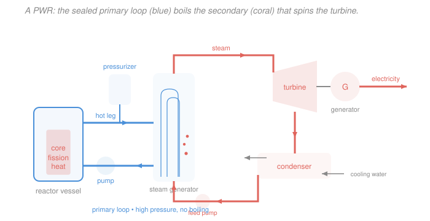
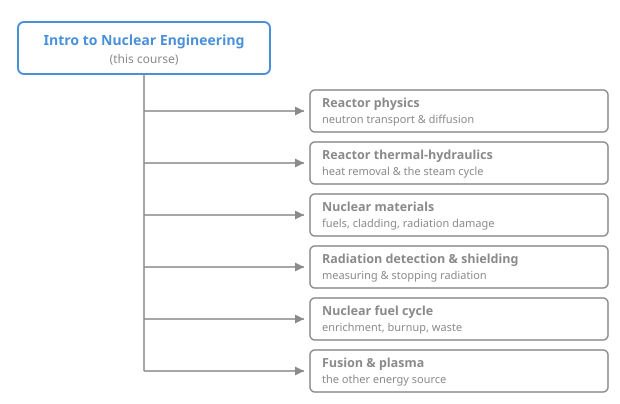

# Intro to Nuclear Engineering & Radiation · Lesson 4.5: Reactor types and the nuclear landscape

> ⏱ ~15 min · Module 4: Radiation interactions, dose & a reactor overview · Builds on: [3.4 Criticality and the four-factor formula](03-04-criticality-four-factor-formula.md), [2.4 Slowing neutrons down: moderation](02-04-moderation-slowing-neutrons.md) · Unlocks: [`reactor-physics`](../../reactor-physics/syllabus.md), [`reactor-thermal-hydraulics`](../../reactor-thermal-hydraulics/syllabus.md), [`nuclear-materials`](../../nuclear-materials/syllabus.md), [`radiation-detection-shielding`](../../radiation-detection-shielding/syllabus.md), [`nuclear-fuel-cycle`](../../nuclear-fuel-cycle/syllabus.md), [`fusion-plasma`](../../fusion-plasma/syllabus.md)

## Why this matters

You now own the physics core: binding energy, the decay law, cross-sections, moderation, the chain reaction, criticality, and dose. This final lesson spends that capital. Every power reactor on Earth is the *same four decisions* — what fuel, what moderator, what coolant, how to control — arranged differently, and the four-factor formula from [3.4](03-04-criticality-four-factor-formula.md) is exactly the ledger that tells you which combinations can even go critical. Get the interlock right and you understand why a Canadian CANDU burns uranium straight out of the ground while an American PWR needs an enrichment plant behind it. This is also the map: the branches of the nuclear shelf this course feeds all start from the reactor you're about to assemble.

## The idea

A reactor is a machine for holding a fission chain reaction at exactly $k=1$ and carrying the heat away. Strip away the engineering and there are four parts, each answering one question:

- **Fuel** — *what fissions?* Almost always uranium (enriched or natural) or plutonium.
- **Moderator** — *what slows the neutrons down?* Thermal reactors need neutrons dropped from ~2 MeV to ~0.025 eV so $^{235}$U fissions readily (the 1/v law and resonances from Module 2). Light water, heavy water, or graphite. Fast reactors skip this entirely.
- **Coolant** — *what carries the heat out?* Water, gas, or liquid metal. Sometimes the coolant *is* the moderator (water does both), sometimes they're separate (graphite moderator, gas coolant).
- **Control** — *what pins $k$ at 1?* Neutron-absorbing control rods (boron, cadmium) and dissolved poisons, riding on the delayed neutrons that make the reactor slow enough to steer.

The whole art is that these choices **interlock**. Pick a moderator that absorbs neutrons (like ordinary water), and you've spent part of your neutron budget on the moderator — so you must claw it back by enriching the fuel. Pick a moderator that barely absorbs (heavy water, graphite), and natural uranium is rich enough. The four-factor formula is where the trade shows up as arithmetic.

## The formal version

**A reactor's job, in one equation.** From [3.4](03-04-criticality-four-factor-formula.md), the infinite-medium multiplication factor is

$$k_\infty = \eta\, f\, p\, \varepsilon,$$

and with leakage, $k_{\text{eff}} = k_\infty\, P_{NL}$. Steady operation demands $k_{\text{eff}} = 1$. *In words: for every neutron this generation, exactly one survives to cause the next fission — no more, no less.* The design's job is to make the four factors and the non-leakage probability multiply to 1.

The factor that reactor type turns on is the **thermal utilization** $f$ — the fraction of thermal neutrons absorbed that get absorbed *in the fuel* rather than wasted in moderator, coolant, or structure:

$$f = \frac{\Sigma_a^{F}}{\Sigma_a^{F} + \Sigma_a^{M} + \Sigma_a^{\text{other}}},$$

where $\Sigma_a^{F}$ is the fuel's macroscopic absorption cross-section (from [2.2](02-02-macroscopic-cross-section-mean-free-path.md), $\Sigma = N\sigma$) and $\Sigma_a^{M}$ the moderator's. *In words: a moderator that drinks neutrons drops $f$, and you have to make up the loss somewhere — usually by enriching the fuel to raise $\eta$ and $\Sigma_a^{F}$.* This one term is why light-water reactors need enriched fuel and heavy-water reactors don't.

**The major reactor types.** The whole landscape fits in one table — read it as four columns answering the four questions:

| Type | Moderator | Coolant | Fuel | Signature |
|---|---|---|---|---|
| **PWR** (pressurized water) | light water $\ce{H2O}$ | light water (same) | ~3–5% enriched $\ce{^{235}U}$ | primary loop kept liquid at ~155 bar; heat handed to a *separate* steam loop |
| **BWR** (boiling water) | light water | light water (same) | ~3–5% enriched | water **boils in the core**; that steam drives the turbine directly |
| **PHWR / CANDU** (heavy water) | heavy water $\ce{D2O}$ | heavy water | **natural** uranium (0.72% $\ce{^{235}U}$) | $\ce{D2O}$ barely absorbs neutrons, so no enrichment needed |
| **Gas-cooled** (e.g. AGR, HTGR) | graphite | $\ce{CO2}$ or He | slightly enriched | high outlet temperature, good thermal efficiency |
| **Fast reactor** (SFR, LFR) | **none** | liquid sodium or lead | plutonium / high-enriched | fast spectrum; can **breed** more fuel than it burns |

The **PWR is the workhorse** — most of the world's power reactors. Light water is a superb moderator (hydrogen is nearly a neutron's mass, so it thermalizes in few collisions, per [2.4](02-04-moderation-slowing-neutrons.md)) and a cheap coolant, and it does both jobs at once. Its one cost — hydrogen's appetite for neutrons — is paid with enrichment.

The **fast reactor is the outlier**: no moderator at all. Neutrons stay fast, and at high energy $^{238}$U captures a neutron and transmutes into fissile plutonium — the reactor can make more fuel than it consumes. "Fast" refers to the *neutron energy spectrum*, not how quickly the power changes.

## Picture

A PWR traced end to end — fission heat enters the sealed primary loop, crosses into the secondary loop at the steam generator, and leaves as electricity.

## Worked examples

**Example 1 (design reasoning — why $\ce{D2O}$ lets CANDU burn natural uranium).** A PWR needs 3–5% enriched fuel; a CANDU runs on natural uranium (0.72% $^{235}$U). Same physics — what changed?

Track it through $k_\infty = \eta f p \varepsilon$. Natural uranium is a *thin* fuel: it fissions less per neutron absorbed, so its reproduction factor $\eta$ (neutrons produced per thermal neutron absorbed in fuel) is low, around $\eta \approx 1.34$, versus $\sim 1.8$ for enriched. With every factor already lean, the design cannot afford to waste neutrons anywhere else.

Now compare moderators through $f$. Ordinary hydrogen in $\ce{H2O}$ has a thermal absorption cross-section of about 0.33 barn per atom — small, but not zero, and a reactor is packed with water. Deuterium in $\ce{D2O}$ absorbs roughly **a thousand times less** (it is already the "$\ce{H}+n$" product, so it barely captures another neutron). Model a bare fuel-plus-moderator lattice with an illustrative fuel absorption $\Sigma_a^{F} = 0.36\ \text{cm}^{-1}$:

$$f_{\ce{D2O}} = \frac{0.36}{0.36 + 0.0001} \approx 0.9997, \qquad f_{\ce{H2O}} = \frac{0.36}{0.36 + 0.10} \approx 0.78.$$

(The $\ce{H2O}$ moderator term is large not because hydrogen is greedy per atom, but because thermalizing natural uranium takes a *lot* of water in the lattice.) With natural-U factors $\eta p \varepsilon \approx 1.24$:

$$k_\infty^{\,\ce{D2O}} \approx 1.24 \times 0.9997 = 1.24 \;(> 1,\ \text{sustains}), \qquad k_\infty^{\,\ce{H2O}} \approx 1.24 \times 0.78 = 0.97 \;(< 1,\ \text{dies}).$$

**In words:** heavy water's near-invisibility to neutrons keeps $f\approx 1$, so natural uranium's meager neutron surplus is enough. Light water eats the surplus, so you must *enrich* — more $^{235}$U raises $\eta$ and $\Sigma_a^{F}$, dragging $f$ and $k_\infty$ back above 1. There's a trade the numbers hide: $\ce{D2O}$ is a *worse* moderator per collision (deuterium is twice a neutron's mass, so more collisions to thermalize), but that costs only reactor size, whereas neutron absorption costs criticality itself. CANDU pays in heavy-water inventory to skip the enrichment plant.

**Example 2 (trace the energy — from fission heat to the grid in a PWR).** A PWR core runs at $3400\ \text{MW}$ **thermal**. Follow the energy.

*Step 1 — fissions per second.* Each fission releases about $200\ \text{MeV} = 200 \times 1.602\times10^{-13}\,\text{J} = 3.2\times10^{-11}\,\text{J}$ (from [3.1](03-01-fission-process-energy.md)). To make $3.4\times10^{9}\,\text{W} = 3.4\times10^{9}\,\text{J/s}$:

$$\dot N_{\text{fis}} = \frac{3.4\times10^{9}\,\text{J/s}}{3.2\times10^{-11}\,\text{J}} \approx 1.06\times10^{20}\ \text{fissions/s}.$$

*Step 2 — the heat path.* That heat appears mostly as fission-fragment kinetic energy stopped in the fuel pins (the range physics of [4.3](04-03-charged-particles-through-matter.md)). The **primary loop** — pressurized to ~155 bar so it *cannot boil* — carries it out at ~315 °C to the **steam generator**. There it crosses into a separate **secondary loop**, which *does* boil; that steam spins the **turbine**, which turns the **generator**. Spent steam condenses in the **condenser** and returns as feedwater. Two loops, so the water that touched the core never reaches the turbine.

*Step 3 — electricity.* A steam cycle is a heat engine, capped by Carnot (the thermodynamics `reactor-thermal-hydraulics` develops). At a typical thermal efficiency $\eta_{\text{th}} \approx 0.33$:

$$P_{\text{elec}} = \eta_{\text{th}}\, P_{\text{th}} = 0.33 \times 3400\ \text{MW} \approx 1120\ \text{MW}_e,$$

with the other ~2280 MW dumped to the condenser's cooling water. That ~1120 MWe is a large reactor's grid contribution — enough for roughly a million homes.

## Watch out

- **You might think "moderator" and "coolant" are always the same thing.** In a PWR they are (water does both), which is why it's easy to conflate. But in a gas-cooled reactor the moderator is solid graphite and the coolant is $\ce{CO2}$ or helium; in a fast reactor there's no moderator at all and the coolant is liquid sodium. They're two separate jobs that *sometimes* share a material.
- **You might think a PWR's core water boils.** It doesn't — the whole point of "pressurized" is that ~155 bar keeps the primary water liquid at 315 °C; boiling happens only in the *secondary* loop, at the steam generator. A **BWR** is the design that deliberately boils water right in the core and pipes that steam to the turbine.
- **You might read "fast reactor" as "reacts fast" or "ramps power fast."** No — "fast" is the neutron *energy spectrum*. Fast reactors run without a moderator so neutrons stay at MeV energies, which is what lets $^{238}$U breed into plutonium.

## One-liner

> A reactor is four interlocking choices — fuel, moderator, coolant, control — and the four-factor formula is the ledger that says which combinations can hold $k=1$: absorb neutrons in the moderator and you pay it back in enrichment.

## Problems

**P1 (🟢)** Classify each described reactor by naming its type, using only the moderator/coolant/fuel clues:
(a) light water is both moderator and coolant, and the water boils inside the core to drive the turbine directly;
(b) heavy water moderates, and the fuel is natural uranium;
(c) solid graphite moderates while carbon-dioxide gas cools;
(d) there is no moderator and liquid sodium is the coolant.

**P2 (🟡)** A PWR core produces $3000\ \text{MW}$ thermal at a plant thermal efficiency of 34%. (a) What is the electrical output? (b) Roughly how much heat is rejected to the condenser? (c) Estimate the fission rate (use $200\ \text{MeV} = 3.2\times10^{-11}\,\text{J}$ per fission).

**P3 (🔴)** A thermal lattice has fuel absorption $\Sigma_a^{F} = 0.36\ \text{cm}^{-1}$ and, for its moderator choice, $\Sigma_a^{M} = 0.10\ \text{cm}^{-1}$ (light water) or $\Sigma_a^{M} = 0.0001\ \text{cm}^{-1}$ (heavy water). The fuel is natural uranium with $\eta\, p\, \varepsilon = 1.24$. (a) Compute the thermal utilization $f$ and $k_\infty$ for each moderator. (b) Which moderator lets this natural-uranium core reach criticality, and what must you change about the fuel to make the other one work?

Solutions

**P1** (a) **BWR** (boiling water reactor) — light-water moderator/coolant that boils in the core. (b) **PHWR / CANDU** (pressurized heavy-water reactor) — $\ce{D2O}$ moderator with natural uranium; the low absorption of heavy water is exactly what makes natural fuel viable. (c) **Gas-cooled reactor** (e.g. AGR / Magnox) — graphite moderator, $\ce{CO2}$ coolant. (d) **Fast reactor** (sodium-cooled fast reactor, SFR) — no moderator means a fast spectrum; liquid sodium carries heat without slowing neutrons.

**P2** (a) Electrical output:

$$P_{\text{elec}} = \eta_{\text{th}} P_{\text{th}} = 0.34 \times 3000\ \text{MW} = 1020\ \text{MW}_e.$$

(b) Energy conservation — everything not made into electricity is rejected as heat:

$$P_{\text{reject}} = P_{\text{th}} - P_{\text{elec}} = 3000 - 1020 = 1980\ \text{MW}$$

dumped to the condenser cooling water. (c) Fission rate:

$$\dot N_{\text{fis}} = \frac{P_{\text{th}}}{E_{\text{fis}}} = \frac{3.0\times10^{9}\,\text{J/s}}{3.2\times10^{-11}\,\text{J}} \approx 9.4\times10^{19}\ \text{fissions/s}.$$

*Check.* A bit less thermal power than Example 1's 3400 MW, and a bit less fission rate ($9.4$ vs $10.6 \times10^{19}$/s) — consistent. Units: (J/s)/J = 1/s ✓.

**P3** (a) Thermal utilization $f = \Sigma_a^{F} / (\Sigma_a^{F} + \Sigma_a^{M})$:

$$f_{\ce{H2O}} = \frac{0.36}{0.36 + 0.10} = \frac{0.36}{0.46} = 0.783, \qquad f_{\ce{D2O}} = \frac{0.36}{0.36 + 0.0001} = 0.99972.$$

Then $k_\infty = \eta p \varepsilon \cdot f = 1.24\, f$:

$$k_\infty^{\,\ce{H2O}} = 1.24 \times 0.783 = 0.97, \qquad k_\infty^{\,\ce{D2O}} = 1.24 \times 0.99972 = 1.24.$$

(b) **Heavy water** reaches criticality ($k_\infty = 1.24 > 1$); light water falls short ($k_\infty = 0.97 < 1$), so a natural-uranium light-water core *cannot* sustain a chain reaction. To make the light-water design work you must **enrich the fuel** (raise $^{235}$U to ~3–5%), which increases $\eta$ and the fuel's absorption $\Sigma_a^{F}$ — pushing both $f$ and $k_\infty$ back above 1. That single line is the reason PWRs come with an enrichment plant and CANDUs don't.

*Check.* $f_{\ce{D2O}}\approx 1$ because the moderator term is a ten-thousandth of the fuel term; $f_{\ce{H2O}}$ is dragged down by a moderator term ~28% of the fuel term. The physics matches Example 1. ✓

## Flashback

**From Lesson 3.4 (Criticality and the four-factor formula):** A thermal reactor has $\eta = 1.75$, $f = 0.68$, $p = 0.88$, $\varepsilon = 1.03$, and total non-leakage probability $P_{NL} = 0.95$. (a) Compute $k_\infty$. (b) Compute $k_{\text{eff}}$ and classify the reactor. (c) Find the reactivity $\rho = (k-1)/k$ in pcm. (Fresh numbers — different reactor from the module's boss problem.)

Solution

(a) Infinite-medium multiplication:

$$k_\infty = \eta f p \varepsilon = 1.75 \times 0.68 \times 0.88 \times 1.03.$$

Step by step: $1.75 \times 0.68 = 1.19$; $\;1.19 \times 0.88 = 1.0472$; $\;1.0472 \times 1.03 = 1.0786$. So $k_\infty \approx 1.079$.

(b) With leakage:

$$k_{\text{eff}} = k_\infty P_{NL} = 1.0786 \times 0.95 = 1.0247.$$

Since $k_{\text{eff}} > 1$, the reactor is **supercritical** — the neutron population grows generation over generation, so control rods would need to be inserted to bring it to $k_{\text{eff}} = 1$.

(c) Reactivity:

$$\rho = \frac{k_{\text{eff}} - 1}{k_{\text{eff}}} = \frac{1.0247 - 1}{1.0247} = \frac{0.0247}{1.0247} = 0.0241 = 2410\ \text{pcm}.$$

*Check.* $\rho > 0$ matches supercritical; $2410\ \text{pcm} = 0.0241$, and since $\rho$ and $k-1$ agree to within a factor $k\approx 1$, the small-reactivity approximation $\rho \approx k-1$ holds. Leakage cost the reactor $k_\infty - k_{\text{eff}} = 1.079 - 1.025 \approx 0.054$ in multiplication. ✓

## Connections

- **Backward:** this lesson is the four-factor formula of [3.4](03-04-criticality-four-factor-formula.md) cashed out as hardware — thermal utilization $f$ decides moderator choice, and moderation itself is [2.4](02-04-moderation-slowing-neutrons.md). The heat you carry away is the ~200 MeV of [3.1](03-01-fission-process-energy.md), and the other power source, [4.1 fusion](04-01-fusion-basics.md), is the branch `fusion-plasma` picks up.
- **Forward:** you've finished the trunk; the nuclear shelf now branches. Each course below assumes exactly the physics you just built (map below).

- **Sideways (thermodynamics):** the reactor's back half is a plain steam cycle — a Carnot-limited heat engine — so the reactor's electrical output is governed by the same second law that limits any power plant. That bridge, fission heat → Rankine cycle → grid, is where `reactor-thermal-hydraulics` and classical thermodynamics meet the nuclear physics of this course.
