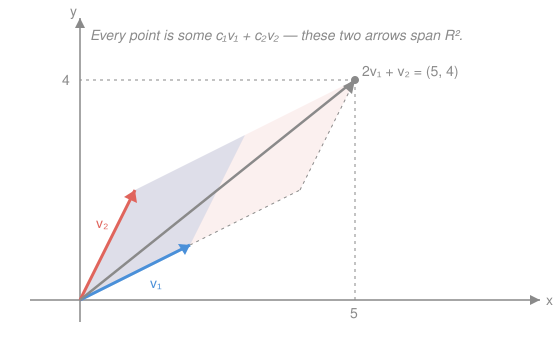

# Linear Algebra · Lesson 1.1: Vectors, linear combinations, and span

> ⏱ ~15 min · Module 1: Vectors, spaces, and linear systems · Builds on: (course start) · Unlocks: 1.2 (independence, basis, dimension)

## Why this matters

Almost every question in this course reduces to one shape: *given some vectors, what can you build from them?* A robot arm's reachable positions, the set of forces a pair of thrusters can produce, the outputs a linear model can fit, the states a physical system can occupy — all of these are **spans**. Get fluent with "linear combination" and "span" now and the rest of linear algebra becomes bookkeeping on top of a picture you already own.

## The idea

A **vector** is one object you can look at two ways. Geometrically it's an *arrow* — a magnitude and a direction, floating free (only the displacement matters, not where you pin the tail). Algebraically it's a *list of numbers*, its coordinates. The point $(3, 2)$ and the arrow that goes 3 right and 2 up are the same vector wearing different clothes; the whole subject is the habit of switching between the two on demand.

You're allowed exactly two moves. **Add** two vectors by walking one, then the other — lay them tip-to-tail and the arrow from the first tail to the last tip is the sum. **Scale** a vector by a number: stretch it (factor 2), shrink it (factor $\tfrac12$), or flip it around (negative factor). That's it. Chain those two moves together — scale a few vectors, add the results — and you've formed a **linear combination**.

Now the key question. Start with some vectors and take *every* linear combination of them — all choices of scaling coefficients. The set of destinations you can reach is their **span**. Two arrows pointing in genuinely different directions in the plane can reach anywhere: span is the whole plane. But if the second arrow is just a stretched copy of the first, every combination stays pinned to one line — span is only that line. Span answers the question **"where can these vectors take me?"**

## The formal version

Work in $\mathbb{R}^n$, the set of vectors with $n$ real coordinates, written as columns:
$$\mathbf{v} = \begin{bmatrix} v_1 \\ \vdots \\ v_n \end{bmatrix}.$$
Here $\mathbf{v}$ (boldface) is the vector and $v_i$ its $i$-th coordinate.

**The two operations.** For vectors $\mathbf{u}, \mathbf{v} \in \mathbb{R}^n$ and a scalar $c \in \mathbb{R}$, addition and scalar multiplication act coordinate by coordinate:
$$\mathbf{u} + \mathbf{v} = \begin{bmatrix} u_1 + v_1 \\ \vdots \\ u_n + v_n \end{bmatrix}, \qquad c\,\mathbf{v} = \begin{bmatrix} c\,v_1 \\ \vdots \\ c\,v_n \end{bmatrix}.$$
In words: add by matching up slots and summing; scale by multiplying every slot by the same number.

**Linear combination.** Given vectors $\mathbf{v}_1, \dots, \mathbf{v}_k$ and scalars $c_1, \dots, c_k$ (the *coefficients* or *weights*), the vector
$$c_1 \mathbf{v}_1 + c_2 \mathbf{v}_2 + \cdots + c_k \mathbf{v}_k$$
is a linear combination of them. In words: pick a weight for each vector, scale each by its weight, add the pile.

**Span.** The span is the set of *all* such combinations:
$$\operatorname{span}(\mathbf{v}_1, \dots, \mathbf{v}_k) = \{\, c_1 \mathbf{v}_1 + \cdots + c_k \mathbf{v}_k \;:\; c_1, \dots, c_k \in \mathbb{R} \,\}.$$
In words: every destination reachable by some choice of weights — geometrically a point, a line, a plane, or all of $\mathbb{R}^n$, always passing through the origin (take all weights $0$).

**Subspace.** A set $S \subseteq \mathbb{R}^n$ is a subspace if it contains $\mathbf{0}$ and is **closed** under both operations: whenever $\mathbf{u}, \mathbf{v} \in S$ and $c \in \mathbb{R}$, both $\mathbf{u} + \mathbf{v} \in S$ and $c\,\mathbf{v} \in S$. In words: you can never combine members and fall out of the set. Every span *is* a subspace — that's the payoff of the definition, and the reason spans are the natural objects here.

## Picture

Reading it: $\mathbf{v}_1$ and $\mathbf{v}_2$ point in different directions, so sliding scaled copies tip-to-tail lands you anywhere in the plane. The gray arrow is the specific combination $2\mathbf{v}_1 + \mathbf{v}_2$; walk two blue steps, then one red step. Had $\mathbf{v}_2$ been a multiple of $\mathbf{v}_1$ (collinear), every combination would collapse onto the blue line and the span would be that line alone.

## Worked examples

**Example 1 (mechanical — is a target in the span?).** Is $\begin{bmatrix} 5 \\ 4 \end{bmatrix}$ a linear combination of $\mathbf{v}_1 = \begin{bmatrix} 2 \\ 1 \end{bmatrix}$ and $\mathbf{v}_2 = \begin{bmatrix} 1 \\ 2 \end{bmatrix}$?

We need weights $c_1, c_2$ with $c_1 \mathbf{v}_1 + c_2 \mathbf{v}_2 = \begin{bmatrix} 5 \\ 4 \end{bmatrix}$. Matching coordinates gives two equations:
$$2c_1 + c_2 = 5, \qquad c_1 + 2c_2 = 4.$$
From the first, $c_2 = 5 - 2c_1$. Substitute into the second: $c_1 + 2(5 - 2c_1) = 4 \Rightarrow c_1 + 10 - 4c_1 = 4 \Rightarrow -3c_1 = -6 \Rightarrow c_1 = 2$, so $c_2 = 1$. Check: $2\begin{bmatrix}2\\1\end{bmatrix} + 1\begin{bmatrix}1\\2\end{bmatrix} = \begin{bmatrix}5\\4\end{bmatrix}$. ✓ Yes — and that's the gray arrow in the picture.

**Example 2 (why you'd care — a span that is only a line).** A cart rolls on a straight track laid along the direction $\mathbf{d} = \begin{bmatrix} 3 \\ 1 \end{bmatrix}$. Where can it go? Every reachable position is $t\,\mathbf{d}$ for some scalar $t$ — a linear combination of the *single* vector $\mathbf{d}$. So its span is the line $\{(3t, t) : t \in \mathbb{R}\}$, i.e. all points with $y = x/3$. The point $\begin{bmatrix} 6 \\ 2 \end{bmatrix}$ is reachable ($t = 2$); the point $\begin{bmatrix} 6 \\ 3 \end{bmatrix}$ is not, because $6/3 \neq 3$ forces inconsistent values of $t$. One vector spans a line, and a target is reachable only if it lies on that line — the same reachability logic as Example 1, one dimension smaller.

## Watch out

- You might think adding a vector *grows* the span. But if the new vector already lies in the current span (a combination of what you have), it adds nothing — span is unchanged. Redundant directions are exactly what Lesson 1.2 hunts down.
- You might think any line or plane is a subspace. Only those **through the origin** qualify: a subspace must contain $\mathbf{0}$ (weights all zero), so the line $y = x + 1$ is not a subspace even though it looks just like one that is.
- You might think $\operatorname{span}$ means "the vectors themselves." It's the entire infinite set of their combinations — the whole plane in the picture, not just the two arrows drawn.

## One-liner

> A span is the complete set of places a handful of vectors can take you by scaling and adding — a flat sheet through the origin, and the home base for everything downstream.

## Problems

**P1 (🟢)** Express $\begin{bmatrix} 7 \\ 4 \end{bmatrix}$ as a linear combination of $\mathbf{e} = \begin{bmatrix} 1 \\ 0 \end{bmatrix}$ and $\mathbf{w} = \begin{bmatrix} 1 \\ 2 \end{bmatrix}$: find $c_1, c_2$ with $c_1 \mathbf{e} + c_2 \mathbf{w} = \begin{bmatrix} 7 \\ 4 \end{bmatrix}$.

**P2 (🟡)** Does $\begin{bmatrix} 3 \\ 3 \\ 3 \end{bmatrix}$ lie in $\operatorname{span}\!\left( \begin{bmatrix} 1 \\ 1 \\ 0 \end{bmatrix}, \begin{bmatrix} 0 \\ 1 \\ 1 \end{bmatrix} \right)$? Decide by trying to solve for the weights.

**P3 (🔴, optional)** Two thrusters on a spacecraft produce force vectors $\mathbf{f}_1 = \begin{bmatrix} 1 \\ 0 \\ 1 \end{bmatrix}$ and $\mathbf{f}_2 = \begin{bmatrix} 0 \\ 1 \\ 1 \end{bmatrix}$ (newtons). The set of net forces they can jointly produce is $\operatorname{span}(\mathbf{f}_1, \mathbf{f}_2)$. Show this span is a plane through the origin in $\mathbb{R}^3$, and find a single linear equation $ax + by + cz = 0$ that every reachable force satisfies. (Downstream: that equation's coefficient vector is the plane's *normal* — the germ of orthogonality in Module 4.)

Solutions

**P1** Coordinate equations: $c_1 + c_2 = 7$ (top) and $2c_2 = 4$ (bottom). The bottom gives $c_2 = 2$ immediately; then $c_1 = 7 - 2 = 5$. So
$$5\begin{bmatrix} 1 \\ 0 \end{bmatrix} + 2\begin{bmatrix} 1 \\ 2 \end{bmatrix} = \begin{bmatrix} 5 \\ 0 \end{bmatrix} + \begin{bmatrix} 2 \\ 4 \end{bmatrix} = \begin{bmatrix} 7 \\ 4 \end{bmatrix}.$$
Verification: plug back — $(5+2, \,0+4) = (7,4)$. ✓ (Note $\mathbf{e}$ is a standard axis vector, so $c_2$ set the height and $c_1$ just corrected the horizontal — a preview of coordinates in 1.2.)

**P2** Seek $c_1, c_2$ with $c_1\begin{bmatrix}1\\1\\0\end{bmatrix} + c_2\begin{bmatrix}0\\1\\1\end{bmatrix} = \begin{bmatrix}3\\3\\3\end{bmatrix}$. Coordinate by coordinate:
$$\text{(top) } c_1 = 3, \quad \text{(mid) } c_1 + c_2 = 3, \quad \text{(bot) } c_2 = 3.$$
Top forces $c_1 = 3$, bottom forces $c_2 = 3$, but then the middle needs $c_1 + c_2 = 3 + 3 = 6 \neq 3$. The three equations are inconsistent — **no** such weights exist, so $(3,3,3)$ is **not** in the span.
Verification: the closest honest attempt $3\mathbf{v}_1 + 3\mathbf{v}_2 = (3, 6, 3) \neq (3,3,3)$; any span member has middle coordinate = (top) + (bottom), and $3 \neq 3 + 3$, confirming the miss. (In fact the span is exactly the plane $x + z = y$, and $(3,3,3)$ fails it since $3 + 3 \neq 3$.)

**P3** A general element of the span is
$$c_1 \mathbf{f}_1 + c_2 \mathbf{f}_2 = \begin{bmatrix} c_1 \\ c_2 \\ c_1 + c_2 \end{bmatrix}.$$
As $c_1, c_2$ range over all reals, the first two coordinates $(x, y) = (c_1, c_2)$ are completely free, and the third is forced: $z = c_1 + c_2 = x + y$. Two free parameters trace a 2-dimensional flat sheet, and it passes through the origin (at $c_1 = c_2 = 0$) — a plane through the origin. Every reachable force obeys
$$x + y - z = 0.$$
Verification: check the generators — $\mathbf{f}_1 = (1,0,1)$: $1 + 0 - 1 = 0$ ✓; $\mathbf{f}_2 = (0,1,1)$: $0 + 1 - 1 = 0$ ✓. Since both spanning vectors satisfy the linear equation and the equation is linear, every combination $c_1\mathbf{f}_1 + c_2\mathbf{f}_2$ satisfies it too. ✓ (The coefficient vector $(1, 1, -1)$ is perpendicular to the whole plane — hold that thought for 4.1.)

## Connections

- **Forward:** [1.2](01-02-linear-independence-basis-dimension.md) asks the follow-up question — *which* of your vectors actually enlarge the span (independence), and what's the smallest spanning set (a basis) and its size (dimension). The redundancy trap in "Watch out" is precisely what independence formalizes.
- **Forward:** [1.3](01-03-linear-systems-elimination-rank.md) turns the coordinate-matching in the worked examples into a systematic method — Gaussian elimination — and $A\mathbf{x} = \mathbf{b}$ is exactly "is $\mathbf{b}$ in the span of $A$'s columns?"
- **Sideways (physics/CS):** reachable positions, achievable forces (P3), and the outputs of a linear model are all spans; asking whether a target is attainable is asking whether it lies in one — the recurring question this course teaches you to answer fast.
