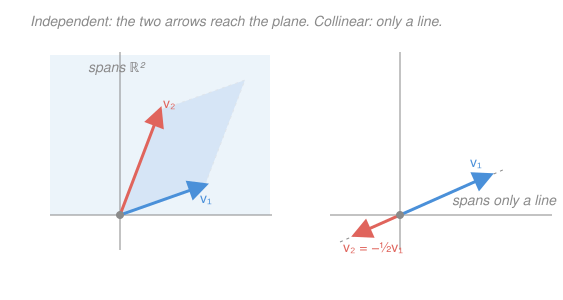

# Linear Algebra · Lesson 1.2: Linear independence, basis, and dimension

> ⏱ ~15 min · Module 1: Vectors, spaces, and linear systems · Builds on: [1.1 Vectors, linear combinations, and span](01-01-vectors-span-linear-combinations.md) · Unlocks: 1.3 (linear systems and rank)

## Why this matters

In [1.1](01-01-vectors-span-linear-combinations.md) you learned to describe every reachable point as a *span*. But a span can be described wastefully — with more vectors than it needs, some of them redundant. This lesson gives you the two tools that fix that: **independence** (a redundancy detector) and **basis** (the minimal, non-redundant description). The payoff is **dimension** — a single number that pins down "how big" a space is, immune to how you happened to write it down. Every coordinate system in physics, every degrees-of-freedom count, every "the model has 3 free parameters" is this idea.

## The idea

Suppose you're describing directions on a flat map. "North" and "East" are enough — from those two you can reach anywhere. Add "Northeast" to the list and you've gained *nothing*: Northeast was already a combination of the other two. It's **redundant**. A set of vectors is **independent** when there is no such freeloader — no vector in the set is a combination of the others, so deleting any one strictly shrinks the span.

A **basis** is the sweet spot: enough vectors to reach everything (it *spans*), but not one more than necessary (it's *independent*). It's a minimal complete address system. North/East is a basis for the plane; North/East/Northeast is not (redundant); North alone is not (can't reach off its line). And the crucial fact: **every** basis for a given space has the *same number* of vectors. That count is the **dimension**.

## The formal version

**Linear independence.** Vectors $\mathbf v_1, \dots, \mathbf v_k$ are *linearly independent* if the only scalars $c_1, \dots, c_k$ solving

$$c_1\mathbf v_1 + c_2\mathbf v_2 + \cdots + c_k\mathbf v_k = \mathbf 0$$

are $c_1 = c_2 = \cdots = c_k = 0$ (all zero). Otherwise they are *dependent*. In words: the **only** way to combine them into the zero vector is to use nothing at all. If some *non-trivial* combination (not all $c_i$ zero) hits $\mathbf 0$, you can solve that equation for one $\mathbf v_i$ in terms of the rest — that $\mathbf v_i$ is the freeloader.

**Basis.** A set $\{\mathbf v_1, \dots, \mathbf v_n\}$ is a *basis* for a space $V$ if it (i) is linearly independent and (ii) spans $V$ (every vector in $V$ is some combination of them). In words: independent = *maximal* without redundancy, spanning = *complete*; a basis is both at once — a minimal spanning set, equivalently a maximal independent set.

**Dimension.** Every basis of $V$ has the same number of vectors; that number is $\dim V$. In words: "how many independent directions the space has" is a well-defined property of the space, not of your chosen basis. ($\dim \mathbb{R}^n = n$, via the standard basis $\mathbf e_1, \dots, \mathbf e_n$.)

**Coordinates.** If $\{\mathbf v_1, \dots, \mathbf v_n\}$ is a basis, every $\mathbf x \in V$ has *exactly one* expression $\mathbf x = c_1\mathbf v_1 + \cdots + c_n\mathbf v_n$. The scalars $(c_1, \dots, c_n)$ are the **coordinates of $\mathbf x$ in that basis**. In words: a basis turns every vector into a unique list of numbers — and uniqueness is exactly what independence buys you (two different lists giving the same $\mathbf x$ would subtract to a non-trivial combination equal to $\mathbf 0$).

## Picture

## Worked examples

**Example 1 (mechanical — run the redundancy test).** Are $\mathbf v_1 = \begin{bmatrix} 1 \\ 3 \end{bmatrix}$, $\mathbf v_2 = \begin{bmatrix} 2 \\ 1 \end{bmatrix}$ independent? Set a combination to zero and see if anything but $\mathbf 0$ survives:

$$c_1\begin{bmatrix} 1 \\ 3 \end{bmatrix} + c_2\begin{bmatrix} 2 \\ 1 \end{bmatrix} = \begin{bmatrix} 0 \\ 0 \end{bmatrix} \;\Longrightarrow\; \begin{cases} c_1 + 2c_2 = 0 \\ 3c_1 + \phantom{2}c_2 = 0. \end{cases}$$

From the first, $c_1 = -2c_2$. Substitute into the second: $3(-2c_2) + c_2 = -5c_2 = 0$, so $c_2 = 0$, hence $c_1 = 0$. Only the trivial solution — **independent**. Geometrically, they point in genuinely different directions, so together they reach all of $\mathbb{R}^2$: they're a basis.

**Example 2 (why you'd care — coordinates in a tilted basis).** The standard basis isn't the only useful one. Take $\mathbf b_1 = \begin{bmatrix} 1 \\ 1 \end{bmatrix}$, $\mathbf b_2 = \begin{bmatrix} 1 \\ -1 \end{bmatrix}$ (independent — neither is a multiple of the other, so they're a basis of $\mathbb{R}^2$). What are the coordinates of $\mathbf x = \begin{bmatrix} 5 \\ 1 \end{bmatrix}$ in this basis? Solve $c_1\mathbf b_1 + c_2\mathbf b_2 = \mathbf x$:

$$\begin{cases} c_1 + c_2 = 5 \\ c_1 - c_2 = 1 \end{cases} \;\Longrightarrow\; c_1 = 3,\; c_2 = 2.$$

So $\mathbf x$ has coordinates $(3, 2)$ in the $\{\mathbf b_1, \mathbf b_2\}$ basis. **Check:** $3\begin{bmatrix} 1 \\ 1 \end{bmatrix} + 2\begin{bmatrix} 1 \\ -1 \end{bmatrix} = \begin{bmatrix} 5 \\ 1 \end{bmatrix}$. ✓ Same arrow, different address system — and $\mathbf b_1, \mathbf b_2$ are exactly the axes a symmetric matrix will hand you as its natural coordinates later ([3.1](03-01-eigenvalues-eigenvectors.md)).

## Watch out

- You might think "these vectors are different, so they're independent." Being *distinct* isn't the test — $\begin{bmatrix} 1 \\ 2 \end{bmatrix}$ and $\begin{bmatrix} 2 \\ 4 \end{bmatrix}$ are different vectors but *dependent* (the second is $2\times$ the first). The test is whether a non-trivial combination hits $\mathbf 0$.
- You might think more vectors means a bigger span. Past dimension, extra vectors are pure redundancy: any 3 vectors in $\mathbb{R}^2$ are automatically dependent (P3) — they can't out-span the plane, they can only repeat it.
- You might think "spans" and "is a basis" are the same. Spanning alone allows freeloaders (e.g. $\{\mathbf e_1, \mathbf e_2, \mathbf e_1 + \mathbf e_2\}$ spans $\mathbb{R}^2$ but is *not* a basis). A basis must *also* be independent — and only a basis gives **unique** coordinates.

## One-liner

> Independence means no vector is a freeloader; a basis is the smallest freeloader-free set that still reaches everything, and its size — the dimension — is the same no matter which basis you pick.

## Problems

**P1 (🟢)** Decide whether each pair is linearly independent: (a) $\left\{\begin{bmatrix} 1 \\ 2 \end{bmatrix}, \begin{bmatrix} 2 \\ 4 \end{bmatrix}\right\}$ and (b) $\left\{\begin{bmatrix} 1 \\ 2 \end{bmatrix}, \begin{bmatrix} 2 \\ 1 \end{bmatrix}\right\}$. For each, say what its span is (a line? all of $\mathbb{R}^2$?).

**P2 (🟡)** Show that $\left\{\begin{bmatrix} 1 \\ 0 \\ 0 \end{bmatrix}, \begin{bmatrix} 1 \\ 1 \\ 0 \end{bmatrix}, \begin{bmatrix} 1 \\ 1 \\ 1 \end{bmatrix}\right\}$ is a basis of $\mathbb{R}^3$, then find the coordinates of $\begin{bmatrix} 3 \\ 2 \\ 1 \end{bmatrix}$ in it.

**P3 (🔴, optional)** Find a basis for the plane $P = \{(x, y, z) : x + y + z = 0\}$ inside $\mathbb{R}^3$, and state its dimension. (Hint: solve the constraint for one variable and read off the free ones — this is the null-space move of [1.3](01-03-linear-systems-elimination-rank.md), seen early.)

Solutions

**P1** (a) $\begin{bmatrix} 2 \\ 4 \end{bmatrix} = 2\begin{bmatrix} 1 \\ 2 \end{bmatrix}$, so $2\mathbf v_1 - \mathbf v_2 = \mathbf 0$ is a non-trivial combination hitting zero — **dependent**. Its span is the single **line** through the origin in the direction $(1,2)$.

(b) Set $c_1\begin{bmatrix} 1 \\ 2 \end{bmatrix} + c_2\begin{bmatrix} 2 \\ 1 \end{bmatrix} = \mathbf 0$: equations $c_1 + 2c_2 = 0$ and $2c_1 + c_2 = 0$. First gives $c_1 = -2c_2$; substitute: $2(-2c_2) + c_2 = -3c_2 = 0 \Rightarrow c_2 = 0 \Rightarrow c_1 = 0$. Only the trivial solution — **independent**. Two independent vectors in $\mathbb{R}^2$ span **all of $\mathbb{R}^2$** (they're a basis).

**P2** *Independence.* Set $c_1\begin{bmatrix} 1 \\ 0 \\ 0 \end{bmatrix} + c_2\begin{bmatrix} 1 \\ 1 \\ 0 \end{bmatrix} + c_3\begin{bmatrix} 1 \\ 1 \\ 1 \end{bmatrix} = \mathbf 0$. Reading components bottom-up:

$$\text{(3rd) } c_3 = 0, \quad \text{(2nd) } c_2 + c_3 = 0 \Rightarrow c_2 = 0, \quad \text{(1st) } c_1 + c_2 + c_3 = 0 \Rightarrow c_1 = 0.$$

Only the trivial solution, so the set is independent. Three independent vectors in $\mathbb{R}^3$ (which has dimension 3) automatically span it, so the set is a **basis**.

*Coordinates of $(3,2,1)$.* Solve $c_1\begin{bmatrix} 1 \\ 0 \\ 0 \end{bmatrix} + c_2\begin{bmatrix} 1 \\ 1 \\ 0 \end{bmatrix} + c_3\begin{bmatrix} 1 \\ 1 \\ 1 \end{bmatrix} = \begin{bmatrix} 3 \\ 2 \\ 1 \end{bmatrix}$, again bottom-up:

$$c_3 = 1, \quad c_2 + c_3 = 2 \Rightarrow c_2 = 1, \quad c_1 + c_2 + c_3 = 3 \Rightarrow c_1 = 1.$$

Coordinates $(1, 1, 1)$. **Check:** $1\begin{bmatrix} 1 \\ 0 \\ 0 \end{bmatrix} + 1\begin{bmatrix} 1 \\ 1 \\ 0 \end{bmatrix} + 1\begin{bmatrix} 1 \\ 1 \\ 1 \end{bmatrix} = \begin{bmatrix} 3 \\ 2 \\ 1 \end{bmatrix}$. ✓

**P3** The constraint $x + y + z = 0$ solves for one variable, say $x = -y - z$, leaving $y$ and $z$ free. Every point of $P$ is then

$$\begin{bmatrix} x \\ y \\ z \end{bmatrix} = \begin{bmatrix} -y - z \\ y \\ z \end{bmatrix} = y\begin{bmatrix} -1 \\ 1 \\ 0 \end{bmatrix} + z\begin{bmatrix} -1 \\ 0 \\ 1 \end{bmatrix}.$$

So $P = \operatorname{span}\left\{\begin{bmatrix} -1 \\ 1 \\ 0 \end{bmatrix}, \begin{bmatrix} -1 \\ 0 \\ 1 \end{bmatrix}\right\}$ (spanning). These two are independent: neither is a scalar multiple of the other (their last two entries, $(1,0)$ and $(0,1)$, can't be scaled into each other). An independent spanning set is a **basis**, so $\dim P = 2$ — as expected, one linear constraint cuts $\mathbb{R}^3$ down to a 2D plane. **Check:** both basis vectors satisfy the constraint, $-1 + 1 + 0 = 0$ ✓ and $-1 + 0 + 1 = 0$ ✓.

## Connections

- **Backward:** this sharpens [1.1](01-01-vectors-span-linear-combinations.md)'s *span* — independence is the test for whether a spanning set is wasteful, and a basis is the span written with zero waste.
- **Forward:** [1.3](01-03-linear-systems-elimination-rank.md) turns the independence test into a mechanical procedure — elimination — and names the count of independent directions the **rank**; P3's "free variables" become the null space. Independence also underlies diagonalizability in [3.2](03-02-diagonalization.md) (you need a *basis* of eigenvectors) and orthonormal bases in [Module 4](04-01-inner-products-orthogonality.md).
- **Sideways (physics/econ):** "dimension" is *degrees of freedom* — a bead on a wire has 1, a system with one conserved constraint loses one dimension (exactly P3). A basis is a choice of independent coordinates for a state space, the setup for every Lagrangian and every linear economic model.
