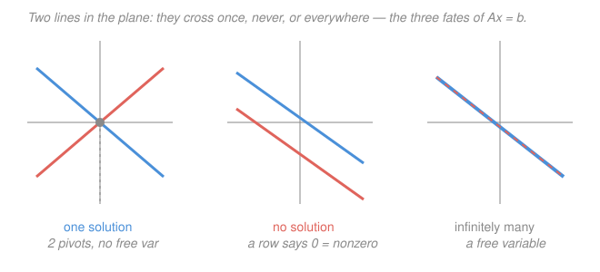

# Linear Algebra · Lesson 1.3: Linear systems, elimination, and rank

> ⏱ ~15 min · Module 1: Vectors, spaces, and linear systems · Builds on: [1.1 Vectors, linear combinations, and span](01-01-vectors-span-linear-combinations.md), [1.2 Linear independence, basis, and dimension](01-02-linear-independence-basis-dimension.md) · Unlocks: Module 2 (matrices as maps)

## Why this matters

Nearly every computation downstream ends in the same request: *solve $A\mathbf{x} = \mathbf{b}$.* Fitting a model, balancing a chemical reaction, finding a circuit's currents, computing an eigenvector once you know its eigenvalue — all of them collapse to a linear system. And the answer isn't always "here's the solution": sometimes there's exactly one, sometimes none, sometimes a whole flat sheet of them. **Elimination** is the one algorithm that solves the system *and* tells you which of the three cases you're in — and **rank**, the number it hands you along the way, is the single most useful summary of what a matrix does.

## The idea

A system of linear equations is just several "matching" conditions on the same unknowns. Stack the coefficients into a matrix $A$, the unknowns into a column $\mathbf{x}$, the right-hand sides into a column $\mathbf{b}$, and the whole system becomes one equation, $A\mathbf{x} = \mathbf{b}$. Reading it through Lesson 1.1: this asks *is $\mathbf{b}$ a linear combination of the columns of $A$?* — the weights are exactly $\mathbf{x}$.

To solve it, you're allowed three moves that never change the solution set: swap two equations, scale an equation by a nonzero number, or add a multiple of one equation to another. **Gaussian elimination** is the disciplined use of those moves to chew the system into a staircase — each equation starting further to the right than the one above — from which you can read the answer by back-substitution.

The staircase's corners are the **pivots**. A column with a pivot pins down its variable; a column *without* one leaves a **free variable** you can set to anything. That count is everything: no free variables and consistent means a *unique* solution; a free variable means *infinitely many*; a contradiction row ("$0 = 5$") means *none*. The number of pivots is the **rank** — how many of your equations were genuinely independent, and equivalently how many columns of $A$ point in genuinely new directions.

## The formal version

**The system.** For an $m \times n$ matrix $A$ (with entry $a_{ij}$ in row $i$, column $j$), an unknown $\mathbf{x} \in \mathbb{R}^n$, and a right-hand side $\mathbf{b} \in \mathbb{R}^m$,
$$A\mathbf{x} = \mathbf{b} \quad\Longleftrightarrow\quad x_1\mathbf{a}_1 + x_2\mathbf{a}_2 + \cdots + x_n\mathbf{a}_n = \mathbf{b},$$
where $\mathbf{a}_j$ is the $j$-th column of $A$. In words: solving the system is finding weights $x_j$ that build $\mathbf{b}$ out of $A$'s columns — solvable exactly when $\mathbf{b} \in \operatorname{span}(\mathbf{a}_1, \dots, \mathbf{a}_n)$.

**Elimination on the augmented matrix.** Glue $\mathbf{b}$ onto $A$ as an extra column, $[\,A \mid \mathbf{b}\,]$, and apply row operations until the left block is in **row echelon form** (REF): each row's leading nonzero entry (its **pivot**) sits strictly right of the pivot above, and all-zero rows sink to the bottom.

**Pivots, free variables, rank.** A column holding a pivot is a **pivot column**; its variable is determined by back-substitution. A non-pivot column gives a **free variable**. The **rank** is
$$\operatorname{rank}(A) = \#\{\text{pivots}\} = \dim(\text{column space of } A),$$
and the free variables number $n - \operatorname{rank}(A)$. In words: rank counts the independent directions among the columns (the Lesson 1.2 idea, now computable), and whatever the rank leaves unaccounted for becomes freedom in the solution.

**The three outcomes.** Read off REF of $[\,A \mid \mathbf{b}\,]$:
- **No solution** if any row is $[\,0\ \cdots\ 0 \mid c\,]$ with $c \neq 0$ (the impossible equation $0 = c$).
- Otherwise (consistent) **unique solution** if every column of $A$ is a pivot column ($\operatorname{rank} = n$, no free variables).
- Otherwise **infinitely many**, one free parameter per free variable.

**Homogeneous systems and the null space.** When $\mathbf{b} = \mathbf{0}$ the system $A\mathbf{x} = \mathbf{0}$ is always consistent ($\mathbf{x} = \mathbf{0}$ works). Its solution set
$$\operatorname{null}(A) = \{\mathbf{x} \in \mathbb{R}^n : A\mathbf{x} = \mathbf{0}\}$$
is the **null space** — a subspace of dimension $n - \operatorname{rank}(A)$. In words: it's every combination of the columns that cancels to zero, i.e. every dependency among them.

**The structure theorem.** If $\mathbf{x}_p$ is *one* solution of $A\mathbf{x} = \mathbf{b}$ (a **particular** solution), then *every* solution is
$$\mathbf{x} = \mathbf{x}_p + \mathbf{x}_h, \qquad \mathbf{x}_h \in \operatorname{null}(A).$$
In words: find one solution, then slide it around by anything the null space allows — the full solution set is a shifted copy of the null space. (Check: $A(\mathbf{x}_p + \mathbf{x}_h) = \mathbf{b} + \mathbf{0} = \mathbf{b}$.)

## Picture

Each equation in two unknowns is a line. **One solution:** the lines cross once (two pivots, no freedom). **No solution:** parallel lines never meet — elimination surfaces a row "$0 = \text{nonzero}$." **Infinitely many:** the two equations describe the *same* line — elimination kills the second row to "$0 = 0$," leaving a free variable that slides you along it. The pivot pattern is just the algebra of which picture you drew.

## Worked examples

**Example 1 (mechanical — unique solution).** Solve
$$\begin{cases} x + y + z = 4 \\ 2x + 3y + z = 9 \\ x + y + 2z = 5 \end{cases}$$
Augment and eliminate. Use row 1 to clear the first column:
$$\left[\begin{array}{ccc|c} 1 & 1 & 1 & 4 \\ 2 & 3 & 1 & 9 \\ 1 & 1 & 2 & 5 \end{array}\right]
\xrightarrow[\;R_3 - R_1\;]{R_2 - 2R_1}
\left[\begin{array}{ccc|c} 1 & 1 & 1 & 4 \\ 0 & 1 & -1 & 1 \\ 0 & 0 & 1 & 1 \end{array}\right].$$
Three pivots (in columns $x, y, z$) — rank $3 = n$, so a unique solution and no freedom. Back-substitute from the bottom: $z = 1$; then $y - z = 1 \Rightarrow y = 2$; then $x + y + z = 4 \Rightarrow x = 1$. Solution $(x,y,z) = (1,2,1)$. Verify in all three originals: $1+2+1 = 4$ ✓, $2 + 6 + 1 = 9$ ✓, $1 + 2 + 2 = 5$ ✓.

**Example 2 (why you'd care — a free variable).** Two measurements, three unknowns — the underdetermined systems that fitting and network problems throw at you constantly:
$$\begin{cases} x + 2y - z = 3 \\ 2x + 4y + z = 9 \end{cases}
\qquad
\left[\begin{array}{ccc|c} 1 & 2 & -1 & 3 \\ 2 & 4 & 1 & 9 \end{array}\right]
\xrightarrow{R_2 - 2R_1}
\left[\begin{array}{ccc|c} 1 & 2 & -1 & 3 \\ 0 & 0 & 3 & 3 \end{array}\right].$$
Pivots in columns $x$ and $z$; column $y$ has none, so **$y$ is free** and $\operatorname{rank} = 2$. Bottom row: $3z = 3 \Rightarrow z = 1$. Top row: $x + 2y - 1 = 3 \Rightarrow x = 4 - 2y$. Writing the free variable as a parameter,
$$\mathbf{x} = \begin{bmatrix} 4 - 2y \\ y \\ 1 \end{bmatrix} = \underbrace{\begin{bmatrix} 4 \\ 0 \\ 1 \end{bmatrix}}_{\mathbf{x}_p} + \, y\underbrace{\begin{bmatrix} -2 \\ 1 \\ 0 \end{bmatrix}}_{\text{spans } \operatorname{null}(A)}.$$
A particular solution plus the null-space line — a whole line of solutions, dimension $n - \operatorname{rank} = 3 - 2 = 1$. Verify the null vector kills $A$: $(-2) + 2(1) - 0 = 0$ ✓ and $2(-2) + 4(1) + 0 = 0$ ✓; and $\mathbf{x}_p$ solves the system: $4 - 0 - 1 = 3$ ✓, $8 + 0 + 1 = 9$ ✓. So *every* point on that line is a solution.

## Watch out

- You might think a zero row means "no solution." A row $[\,0\ \cdots\ 0 \mid 0\,]$ is the harmless "$0 = 0$" — a redundant equation, giving a free variable (infinite solutions). Only $[\,0\ \cdots\ 0 \mid c\,]$ with $c \neq 0$ is a contradiction. Consistency is about $\operatorname{rank}[\,A \mid \mathbf{b}\,]$ vs. $\operatorname{rank}(A)$: equal means solvable, one bigger means none.
- You might count *equations* as the rank. Rank counts *pivots* — the independent equations. Three equations that reduce to two pivots have rank 2, and one of them was secretly redundant (its row echeloned to zeros).
- You might think a free variable is a choice with no consequences. It's a genuine degree of freedom in the answer, but the *number* of them is fixed at $n - \operatorname{rank}(A)$ — you don't get to pick how many, only which columns end up free (the non-pivot ones).

## One-liner

> Elimination turns any system into a staircase whose pivots you count as rank; that count decides unique, none, or a whole null-space of solutions — general answer = one particular solution + the null space.

## Problems

**P1 (🟢)** Solve by elimination on the augmented matrix, and state the rank:
$$\begin{cases} x + 2y + z = 8 \\ 2x + y + z = 7 \\ x + y + 2z = 9 \end{cases}$$

**P2 (🟡)** For $\begin{cases} x + 3y + z = 4 \\ 2x + 6y + z = 7 \end{cases}$, find $\operatorname{rank}(A)$, identify the free variable, and write the **entire** solution set in the form $\mathbf{x}_p + t\,\mathbf{n}$ where $\mathbf{n}$ spans the null space.

**P3 (🔴)** For which real values of $t$ does the system
$$\begin{cases} x + y + z = 2 \\ 2x + 3y + 2z = 5 \\ 2x + 3y + (t^2 - t)z = t + 3 \end{cases}$$
have (a) a unique solution, (b) no solution, (c) infinitely many? For case (c), give the full solution set. *(Hint: eliminate down to the last row and watch when its coefficient and its right-hand side each hit zero.)*

Solutions

**P1** Augment and clear column 1 with row 1:
$$\left[\begin{array}{ccc|c} 1 & 2 & 1 & 8 \\ 2 & 1 & 1 & 7 \\ 1 & 1 & 2 & 9 \end{array}\right]
\xrightarrow[\;R_3 - R_1\;]{R_2 - 2R_1}
\left[\begin{array}{ccc|c} 1 & 2 & 1 & 8 \\ 0 & -3 & -1 & -9 \\ 0 & -1 & 1 & 1 \end{array}\right]
\xrightarrow{R_3 - \frac{1}{3}R_2}
\left[\begin{array}{ccc|c} 1 & 2 & 1 & 8 \\ 0 & -3 & -1 & -9 \\ 0 & 0 & \frac{4}{3} & 4 \end{array}\right].$$
Three pivots, so **$\operatorname{rank} = 3$** and the solution is unique. Back-substitute: $\frac{4}{3}z = 4 \Rightarrow z = 3$; then $-3y - z = -9 \Rightarrow -3y = -6 \Rightarrow y = 2$; then $x + 2y + z = 8 \Rightarrow x + 4 + 3 = 8 \Rightarrow x = 1$. Solution $(1,2,3)$. Verify: $1 + 4 + 3 = 8$ ✓, $2 + 2 + 3 = 7$ ✓, $1 + 2 + 6 = 9$ ✓.

**P2** Eliminate:
$$\left[\begin{array}{ccc|c} 1 & 3 & 1 & 4 \\ 2 & 6 & 1 & 7 \end{array}\right]
\xrightarrow{R_2 - 2R_1}
\left[\begin{array}{ccc|c} 1 & 3 & 1 & 4 \\ 0 & 0 & -1 & -1 \end{array}\right].$$
Pivots in columns $x$ and $z$, so **$\operatorname{rank}(A) = 2$** and column $y$ has no pivot: **$y$ is the free variable**. Bottom row: $-z = -1 \Rightarrow z = 1$. Top row: $x + 3y + 1 = 4 \Rightarrow x = 3 - 3y$. With $y = t$,
$$\mathbf{x} = \begin{bmatrix} 3 - 3t \\ t \\ 1 \end{bmatrix} = \begin{bmatrix} 3 \\ 0 \\ 1 \end{bmatrix} + t\begin{bmatrix} -3 \\ 1 \\ 0 \end{bmatrix}.$$
Verify the null vector: $(-3) + 3(1) + 0 = 0$ ✓ and $2(-3) + 6(1) + 0 = 0$ ✓ (it kills $A$). Verify $\mathbf{x}_p = (3,0,1)$: $3 + 0 + 1 = 4$ ✓ and $6 + 0 + 1 = 7$ ✓. The solution set is a line; nullity $= 3 - 2 = 1$, as promised.

**P3** Eliminate with row 1, then subtract row 2 from row 3:
$$\left[\begin{array}{ccc|c} 1 & 1 & 1 & 2 \\ 2 & 3 & 2 & 5 \\ 2 & 3 & t^2-t & t+3 \end{array}\right]
\xrightarrow[\;R_3 - 2R_1\;]{R_2 - 2R_1}
\left[\begin{array}{ccc|c} 1 & 1 & 1 & 2 \\ 0 & 1 & 0 & 1 \\ 0 & 1 & t^2-t-2 & t-1 \end{array}\right]
\xrightarrow{R_3 - R_2}
\left[\begin{array}{ccc|c} 1 & 1 & 1 & 2 \\ 0 & 1 & 0 & 1 \\ 0 & 0 & (t-2)(t+1) & t-2 \end{array}\right],$$
since $t^2 - t - 2 = (t-2)(t+1)$. The last row reads $(t-2)(t+1)\,z = t - 2$.

- **(a) Unique** when the $z$-coefficient is nonzero: $t \neq 2$ and $t \neq -1$. Then $z = \dfrac{t-2}{(t-2)(t+1)} = \dfrac{1}{t+1}$, three pivots, rank 3.
- **(b) No solution** at $t = -1$: the row becomes $0\cdot z = -3$, an impossible equation ($\operatorname{rank}(A) = 2 < 3 = \operatorname{rank}[\,A\mid\mathbf b\,]$).
- **(c) Infinitely many** at $t = 2$: the row becomes $0 \cdot z = 0$, leaving $z$ free (rank 2). Then row 2 gives $y = 1$, and row 1 gives $x + 1 + z = 2 \Rightarrow x = 1 - z$. So
$$\mathbf{x} = \begin{bmatrix} 1 \\ 1 \\ 0 \end{bmatrix} + z\begin{bmatrix} -1 \\ 0 \\ 1 \end{bmatrix}.$$
Verify $\mathbf{x}_p = (1,1,0)$ at $t = 2$ (where $t^2 - t = 2$, $t + 3 = 5$): $1+1+0=2$ ✓, $2+3+0=5$ ✓, $2+3+0=5$ ✓. Null vector $(-1,0,1)$: $-1+0+1=0$ ✓, $-2+0+2=0$ ✓, $-2 + 0 + 2(1) = 0$ ✓.

## Flashback

**From Lesson 1.2 (Linear independence, basis, and dimension):** Are $\mathbf{v}_1 = \begin{bmatrix} 1 \\ 0 \\ 1 \end{bmatrix}$, $\mathbf{v}_2 = \begin{bmatrix} 1 \\ 1 \\ 0 \end{bmatrix}$, $\mathbf{v}_3 = \begin{bmatrix} 0 \\ 1 \\ -1 \end{bmatrix}$ linearly independent? If not, give an explicit dependence relation. *(Notice you're solving $A\mathbf{x} = \mathbf{0}$ for the matrix whose columns are the $\mathbf{v}_i$ — independence is just "the null space is only $\mathbf{0}$.")*

Solution

Independence asks whether $c_1\mathbf{v}_1 + c_2\mathbf{v}_2 + c_3\mathbf{v}_3 = \mathbf{0}$ forces $c_1 = c_2 = c_3 = 0$. Coordinate by coordinate:
$$\text{(row 1) } c_1 + c_2 = 0, \quad \text{(row 2) } c_2 + c_3 = 0, \quad \text{(row 3) } c_1 - c_3 = 0.$$
From row 1, $c_1 = -c_2$; from row 2, $c_3 = -c_2$; substitute into row 3: $-c_2 - (-c_2) = 0$, true for *every* $c_2$. So there's a free variable — a nontrivial solution exists and the vectors are **dependent**. Take $c_2 = -1$ (so $c_1 = 1$, $c_3 = 1$):
$$\mathbf{v}_1 - \mathbf{v}_2 + \mathbf{v}_3 = \begin{bmatrix} 1-1+0 \\ 0-1+1 \\ 1-0-1 \end{bmatrix} = \begin{bmatrix} 0 \\ 0 \\ 0 \end{bmatrix}. \checkmark$$
Equivalently $\mathbf{v}_2 = \mathbf{v}_1 + \mathbf{v}_3$. The dependence coefficients $(1,-1,1)$ are exactly a null-space vector of $[\,\mathbf{v}_1\ \mathbf{v}_2\ \mathbf{v}_3\,]$ — dependence among columns *is* a nonzero null space, which is why $\operatorname{rank} = 2 < 3$ here.

## Connections

- **Backward:** $A\mathbf{x} = \mathbf{b}$ is the systematic engine behind [1.1](01-01-vectors-span-linear-combinations.md)'s coordinate-matching — "is $\mathbf{b}$ in the span of the columns?" — and rank is [1.2](01-02-linear-independence-basis-dimension.md)'s independence made computable: $\operatorname{rank}$ pivots = number of independent columns, and dependence among columns is precisely a nonzero null space (the Flashback).
- **Forward:** Module 2 reads $A$ as a *map*; [2.2](02-02-inverses-and-four-subspaces.md) names the null space and column space as two of the four fundamental subspaces and proves rank + nullity = $n$ (which you've already been computing as pivots + free variables). A unique solution for every $\mathbf{b}$ is exactly invertibility.
- **Sideways (physics/econ/CS):** circuit currents (Kirchhoff), chemical balancing, static equilibrium, and linear economic models are all $A\mathbf{x} = \mathbf{b}$; rank tells you whether the design is well-posed (unique), over-constrained (none — needs least-squares, [4.2](04-02-projection-least-squares.md)), or under-determined (a null space of free configurations).
