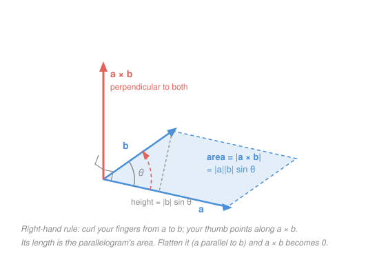

# Linear Algebra · Lesson 1.4: The cross product and orientation in 3D

> ⏱ ~15 min · Module 1: Vectors, spaces, and linear systems · Builds on: [1.1 Vectors, linear combinations, and span](01-01-vectors-span-linear-combinations.md), [1.2 Linear independence, basis, and dimension](01-02-linear-independence-basis-dimension.md) · Unlocks: [2.3 Determinants](02-03-determinants.md), and every twist-and-spin formula downstream — [statics 1.3](../../statics/lessons/01-03-moment-of-a-force.md), [engineering-dynamics 3.1](../../engineering-dynamics/lessons/03-01-rotation-instantaneous-center.md), [mechanics 4.1](../../mechanics-refresher/lessons/04-01-rotational-dynamics.md)–[4.2](../../mechanics-refresher/lessons/04-02-angular-momentum.md), [em-refresher 3.1](../../em-refresher/lessons/03-01-magnetic-force.md)

## Why this matters

Four of the formulas you will use most often in physics and engineering are one operation wearing four uniforms:

$$\begin{aligned} \vec M &= \vec r\times\vec F &&(\text{moment of a force}) & \mathbf L &= \mathbf r\times\mathbf p &&(\text{angular momentum}) \\ \mathbf v &= \boldsymbol\omega\times\mathbf r &&(\text{velocity of a spinning body}) & \mathbf F &= q\,\mathbf v\times\mathbf B &&(\text{magnetic force}) \end{aligned}$$

Every one of them takes two vectors and returns a third that points along an **axis** — the axis a force twists about, the axis a body spins about, the axis a magnetic field bends a charge around. That is what the cross product is for. It also hands you, for free, the area of a parallelogram, the normal direction to a plane, and (in [calc-refresher 5.1](../../calc-refresher/lessons/05-01-vector-fields-div-curl.md)) the curl of a vector field. This lesson is the one place the whole library points to for it.

## The idea

You already have one way to multiply two vectors into something meaningful: the **dot product**, which measures how much they *agree*. It is biggest when they point the same way and exactly zero when they're perpendicular. (It gets its proper treatment in [4.1](04-01-inner-products-orthogonality.md); the card entry is [dot product](../reference.md#dot-product).)

The cross product is its exact complement. It measures how much two vectors **disagree** — how much genuine *plane* they open up between them. Zero when they're parallel (no plane, they're on the same line), biggest when they're perpendicular.

Two facts make the answer a *vector* rather than a number:

1. **Size.** Two vectors sharing a tail span a parallelogram. Its **area** is the honest measure of "how much plane they opened up," and that area is the cross product's length.
2. **Direction.** In 3D, a plane is completely named by the one direction perpendicular to it — its **normal**. So the natural place to point the answer is straight out of the parallelogram. There are two ways out (up or down), and the **right-hand rule** picks one: curl the fingers of your right hand from the first vector toward the second, and your thumb is the answer.

Swap the two inputs and your fingers curl the other way — the thumb flips. That single sentence is why the cross product is **anticommutative**, and why sign conventions in mechanics ("counterclockwise positive") are not arbitrary decoration.

## The formal version

Throughout, $\mathbf a = (a_1,a_2,a_3)$ and $\mathbf b = (b_1,b_2,b_3)$ live in $\mathbb R^3$, $\theta \in [0,\pi]$ is the angle between them, and $\lVert\mathbf a\rVert = \sqrt{a_1^2+a_2^2+a_3^2}$ is length. Physics writes the standard basis as $\hat i, \hat j, \hat k$; this course writes $\mathbf e_1,\mathbf e_2,\mathbf e_3$ — same three vectors.

**Geometric definition.** $\mathbf a\times\mathbf b$ is the unique vector that is perpendicular to both $\mathbf a$ and $\mathbf b$, oriented by the right-hand rule, with length

$$\lVert\mathbf a\times\mathbf b\rVert = \lVert\mathbf a\rVert\,\lVert\mathbf b\rVert\sin\theta.$$

In words: *its length is the area of the parallelogram the two vectors span, and it sticks out of that parallelogram's plane.* (Base $\lVert\mathbf a\rVert$ times height $\lVert\mathbf b\rVert\sin\theta$ — the Picture below is exactly this sentence.) Note the $\sin$, where the dot product had a $\cos$.

**Component formula.**

$$\mathbf a\times\mathbf b = \big(a_2b_3 - a_3b_2,\;\; a_3b_1 - a_1b_3,\;\; a_1b_2 - a_2b_1\big).$$

In words: *each output slot is a little $2\times2$ cross-multiplication of the other two slots.* Slot 1 uses slots 2 and 3, slot 2 uses slots 3 and 1, slot 3 uses slots 1 and 2 — always in that cyclic order $1\to2\to3\to1$, which is how you check a sign you're unsure of.

**The determinant mnemonic.** Nobody memorizes the formula above. Instead, stack the basis vectors on top of the two vectors and expand along the first row:

$$\mathbf a\times\mathbf b = \begin{vmatrix} \mathbf e_1 & \mathbf e_2 & \mathbf e_3 \\ a_1 & a_2 & a_3 \\ b_1 & b_2 & b_3 \end{vmatrix} = \mathbf e_1\begin{vmatrix} a_2 & a_3 \\ b_2 & b_3\end{vmatrix} - \mathbf e_2\begin{vmatrix} a_1 & a_3 \\ b_1 & b_3\end{vmatrix} + \mathbf e_3\begin{vmatrix} a_1 & a_2 \\ b_1 & b_2\end{vmatrix}.$$

In words: *cofactor expansion along the top row, with the $+\,-\,+$ sign pattern* — the same bookkeeping [2.3](02-03-determinants.md) develops properly, and the reason the middle term carries a minus sign. Strictly this is an abuse of notation (a real determinant doesn't have vectors in one row and numbers in the others), but the arithmetic is identical, so use it. Two payoffs land immediately from [2.3](02-03-determinants.md): swapping two rows negates a determinant (⟹ anticommutativity), and a repeated row gives zero (⟹ $\mathbf a\times\mathbf a = \mathbf 0$).

**Algebraic rules.**

$$\mathbf b\times\mathbf a = -\,(\mathbf a\times\mathbf b), \qquad \mathbf a\times\mathbf a = \mathbf 0, \qquad \mathbf a\times(\mathbf b+\mathbf c) = \mathbf a\times\mathbf b + \mathbf a\times\mathbf c, \qquad (c\,\mathbf a)\times\mathbf b = c\,(\mathbf a\times\mathbf b).$$

In words: *order matters (it flips the sign), a vector crossed with itself dies, and it distributes over addition like ordinary multiplication.* That third rule is doing real work downstream: it is exactly **Varignon's theorem** in [statics 1.3](../../statics/lessons/01-03-moment-of-a-force.md) — split an awkward force into components, moment each piece, add.

**The zero test — and its mirror image.** For nonzero $\mathbf a, \mathbf b$:

$$\mathbf a\times\mathbf b = \mathbf 0 \iff \mathbf a \parallel \mathbf b \iff \{\mathbf a,\mathbf b\} \text{ is linearly dependent}, \qquad\qquad \mathbf a\cdot\mathbf b = 0 \iff \mathbf a \perp \mathbf b.$$

In words: *the cross product vanishes on parallel vectors, the dot product on perpendicular ones* — they detect opposite things. The cross product is therefore a computable **independence test** for two vectors in $\mathbb R^3$, straight out of [1.2](01-02-linear-independence-basis-dimension.md): parallel means one is a multiple of the other, means the parallelogram is flat, means area zero. The two are locked together by **Lagrange's identity**,

$$\lVert\mathbf a\times\mathbf b\rVert^2 + (\mathbf a\cdot\mathbf b)^2 = \lVert\mathbf a\rVert^2\,\lVert\mathbf b\rVert^2,$$

which is just $\sin^2\theta + \cos^2\theta = 1$ in disguise — and a free arithmetic check on any computation you do.

**The basis cycle.** Everything reduces to nine little products, and only three need remembering:

$$\mathbf e_1\times\mathbf e_2 = \mathbf e_3, \qquad \mathbf e_2\times\mathbf e_3 = \mathbf e_1, \qquad \mathbf e_3\times\mathbf e_1 = \mathbf e_2,$$

with $\mathbf e_i\times\mathbf e_i = \mathbf 0$ and the reversed products picking up a minus sign ($\mathbf e_2\times\mathbf e_1 = -\mathbf e_3$). In words: *go forward around the cycle $1\to2\to3\to1$ and you get a plus; go backward and you get a minus.* In physics notation: $\hat i\times\hat j = \hat k$, $\hat j\times\hat k = \hat i$, $\hat k\times\hat i = \hat j$.

**Scalar triple product.** Dotting a third vector into a cross product gives a genuine determinant:

$$\mathbf a\cdot(\mathbf b\times\mathbf c) = \begin{vmatrix} a_1 & a_2 & a_3 \\ b_1 & b_2 & b_3 \\ c_1 & c_2 & c_3\end{vmatrix} = \text{signed volume of the parallelepiped on } \mathbf a,\mathbf b,\mathbf c.$$

In words: *cross two of them to get the base area, then dot with the third to pick off the height.* It is zero exactly when the three vectors are coplanar — the three-vector version of the independence test. This is the object statics calls the *moment about an axis*, $M_a = \hat u\cdot(\vec r\times\vec F)$: the part of a twist that a particular shaft actually feels.

**Why this only exists in 3D.** In $\mathbb R^n$, being perpendicular to two independent vectors is two independent linear conditions, so the candidate directions form a subspace of dimension $n-2$. For the answer to be *one* direction — a single line, so that fixing a length and a handedness picks out one vector — you need $n - 2 = 1$. Only $n = 3$ works. In $\mathbb R^2$ the perpendicular-to-both space is $\{\mathbf 0\}$, which is why the "2D cross product" that [engineering-dynamics 3.1](../../engineering-dynamics/lessons/03-01-rotation-instantaneous-center.md) uses is really a single number, the $\mathbf e_3$-component $a_1b_2 - a_2b_1$, read as an out-of-page twist. In $\mathbb R^4$ there's a whole *plane* of perpendicular candidates and no principled way to choose. The cross product is a genuine three-dimensional accident — which is why differential geometry replaces it with the wedge product ([differential-geometry 3.2](../../differential-geometry/lessons/03-02-differential-forms-wedge-product.md)), the version that works in every dimension.

## Picture

## Worked examples

**Example 1 (mechanical — compute it, then check it three ways).** Let $\mathbf a = (1,2,3)$ and $\mathbf b = (4,5,6)$. Expand the determinant along the top row:

$$\mathbf a\times\mathbf b = \begin{vmatrix} \mathbf e_1 & \mathbf e_2 & \mathbf e_3 \\ 1 & 2 & 3 \\ 4 & 5 & 6\end{vmatrix} = \mathbf e_1(2\cdot 6 - 3\cdot 5) - \mathbf e_2(1\cdot 6 - 3\cdot 4) + \mathbf e_3(1\cdot 5 - 2\cdot 4) = (-3,\;6,\;-3).$$

Watch the middle sign: the minor is $6 - 12 = -6$, and the checkerboard minus turns it into $+6$.

Three checks, all worth doing until the operation is automatic:

- **Perpendicular to both.** $\mathbf a\cdot(\mathbf a\times\mathbf b) = -3 + 12 - 9 = 0$ ✓ and $\mathbf b\cdot(\mathbf a\times\mathbf b) = -12 + 30 - 18 = 0$ ✓.
- **Lagrange.** $\lVert\mathbf a\times\mathbf b\rVert^2 = 9 + 36 + 9 = 54$, and $\lVert\mathbf a\rVert^2\lVert\mathbf b\rVert^2 - (\mathbf a\cdot\mathbf b)^2 = 14\cdot 77 - 32^2 = 1078 - 1024 = 54$ ✓.
- **Anticommutativity.** $\mathbf b\times\mathbf a = (3,-6,3)$, the negative — recompute it once and you'll never write a cross product in the wrong order again.

So the parallelogram on $\mathbf a$ and $\mathbf b$ has area $\sqrt{54} = 3\sqrt6 \approx 7.35$, and the triangle with those two edges has half that, $\approx 3.67$.

**Example 2 (why you'd care — the moment of a force).** A horizontal bracket sticks out from a wall bolt at the origin $O$; its tip is at $\mathbf r = (0.4,\,0.3,\,0)$ metres. A load hangs on the tip, pulling straight down: $\mathbf F = (0,\,0,\,-150)$ newtons. How hard does this try to twist the bolt, and about which axis?

$$\vec M_O = \mathbf r\times\mathbf F = \begin{vmatrix} \mathbf e_1 & \mathbf e_2 & \mathbf e_3 \\ 0.4 & 0.3 & 0 \\ 0 & 0 & -150\end{vmatrix} = \mathbf e_1\big(0.3(-150) - 0\big) - \mathbf e_2\big(0.4(-150) - 0\big) + \mathbf e_3(0) = (-45,\;60,\;0)\ \text{N}\cdot\text{m}.$$

Read the answer. Its **direction** lies flat in the horizontal plane and is perpendicular to the bracket ($\vec M_O\cdot\mathbf r = -45(0.4) + 60(0.3) = 0$ ✓): that horizontal line through the bolt is the axis the bracket is trying to hinge about, which is exactly where a real bracket snaps. Its **magnitude** is $\lVert\vec M_O\rVert = \sqrt{45^2 + 60^2} = 75$ N·m.

Cross-check against the lever-arm formula that mechanics states first, $M = Fd$ with $d$ the perpendicular distance from the pivot to the force's line of action. Here $\mathbf r \perp \mathbf F$, so $\sin\theta = 1$ and the lever arm is the whole arm: $d = \lVert\mathbf r\rVert = \sqrt{0.4^2+0.3^2} = 0.5$ m, giving $M = 150 \times 0.5 = 75$ N·m ✓. The two formulas are the same statement, because $d = \lVert\mathbf r\rVert\sin\theta$ is precisely the parallelogram's height.

And the degenerate case is the physical one you already know: push the load *along* the bracket instead of across it and $\mathbf F$ becomes parallel to $\mathbf r$, so $\mathbf r\times\mathbf F = \mathbf 0$. Pulling a wrench along its own handle loosens nothing. [Statics 1.3](../../statics/lessons/01-03-moment-of-a-force.md) is this example with the mechanics vocabulary attached.

## Watch out

- You might think $\mathbf a\times\mathbf b = \mathbf b\times\mathbf a$ because ordinary multiplication commutes. It does not — you get the *negative*. In a moment problem this is the difference between clockwise and counterclockwise, and $\vec r\times\vec F$ (arm crossed into force) is never $\vec F\times\vec r$.
- You might think $\mathbf a\times\mathbf b = \mathbf 0$ means one of the vectors is zero, the way $xy = 0$ works for numbers. It means they are **parallel** — two perfectly good 10-metre vectors along the same line cross to zero. Mirror trap: $\mathbf a\cdot\mathbf b = 0$ means *perpendicular*, not small. Sine versus cosine is the whole difference; mixing them up is the most common error in this lesson.
- You might think you can drop the parentheses, as in $\mathbf a\times\mathbf b\times\mathbf c$. The cross product is **not associative**: $\mathbf e_1\times(\mathbf e_1\times\mathbf e_2) = \mathbf e_1\times\mathbf e_3 = -\mathbf e_2$, while $(\mathbf e_1\times\mathbf e_1)\times\mathbf e_2 = \mathbf 0\times\mathbf e_2 = \mathbf 0$. Always parenthesize.

## One-liner

> The cross product of two vectors is the parallelogram they span, packaged as a vector: length equal to its area, $\lVert\mathbf a\rVert\lVert\mathbf b\rVert\sin\theta$, aimed out of its plane by the right hand — zero exactly when the two are parallel, and possible only in three dimensions.

## Problems

**P1 (🟢)** For $\mathbf a = (2,-1,3)$ and $\mathbf b = (1,4,-2)$: compute $\mathbf a\times\mathbf b$, verify it is perpendicular to both, and give the area of the triangle with edges $\mathbf a$ and $\mathbf b$.

**P2 (🟡)** A spanner is bolted at the origin, and you push on it at the point $\mathbf r = (0.6,\,0.2,\,0)$ metres with the force $\mathbf F = (0,\,-90,\,0)$ newtons.
(a) Find $\vec M_O = \mathbf r\times\mathbf F$, and say which way it twists (out of the page is $+\mathbf e_3$).
(b) Find the lever arm $d$ from $\lVert\vec M_O\rVert = \lVert\mathbf F\rVert\,d$, and explain the number geometrically.
(c) Recompute the moment using $\mathbf r' = (0.6,\,3,\,0)$ — another point on the same line of action of $\mathbf F$. What does the result say about *where* along a force's line you are allowed to apply it?

**P3 (🔴, optional)** A rigid body spins about the vertical axis with angular velocity $\boldsymbol\omega = \omega\,\mathbf e_3$. A point of the body sits at $\mathbf r = (x,y,z)$, and its velocity is $\mathbf v = \boldsymbol\omega\times\mathbf r$.
(a) Compute $\mathbf v$ in components.
(b) Show $\mathbf v\perp\boldsymbol\omega$ and $\mathbf v\perp\mathbf r$, and that $\lVert\mathbf v\rVert = \omega\sqrt{x^2+y^2}$ — not $\omega\lVert\mathbf r\rVert$.
(c) Which points of the body have $\mathbf v = \mathbf 0$, and why does the zero test predict them without any computation?

Solutions

**P1** Expand along the top row:

$$\mathbf a\times\mathbf b = \begin{vmatrix} \mathbf e_1 & \mathbf e_2 & \mathbf e_3 \\ 2 & -1 & 3 \\ 1 & 4 & -2\end{vmatrix} = \mathbf e_1\big((-1)(-2) - (3)(4)\big) - \mathbf e_2\big((2)(-2) - (3)(1)\big) + \mathbf e_3\big((2)(4) - (-1)(1)\big).$$

Slot by slot: $2 - 12 = -10$; $-(-4 - 3) = +7$; $8 + 1 = 9$. So $\mathbf a\times\mathbf b = (-10,\,7,\,9)$.

Perpendicularity: $\mathbf a\cdot(\mathbf a\times\mathbf b) = -20 - 7 + 27 = 0$ ✓ and $\mathbf b\cdot(\mathbf a\times\mathbf b) = -10 + 28 - 18 = 0$ ✓.

Area: $\lVert\mathbf a\times\mathbf b\rVert = \sqrt{100 + 49 + 81} = \sqrt{230}$ is the *parallelogram's* area, so the triangle is half of it,

$$\text{area} = \tfrac12\sqrt{230} \approx 7.58.$$

(Lagrange check: $\lVert\mathbf a\rVert^2\lVert\mathbf b\rVert^2 - (\mathbf a\cdot\mathbf b)^2 = 14\cdot 21 - (-8)^2 = 294 - 64 = 230$ ✓.)

**P2** (a) Only the third slot survives, since both vectors are flat in the $\mathbf e_1\mathbf e_2$-plane:

$$\vec M_O = \big(\,0.2\cdot 0 - 0\cdot(-90),\;\; 0\cdot 0 - 0.6\cdot 0,\;\; 0.6(-90) - 0.2\cdot 0\,\big) = (0,\,0,\,-54)\ \text{N}\cdot\text{m}.$$

The $\mathbf e_3$-component is negative, so the twist is **into the page: 54 N·m clockwise**. (Sanity: you're pushing *down* at a point to the *right* of the bolt — clockwise is right.)

(b) $d = \lVert\vec M_O\rVert / \lVert\mathbf F\rVert = 54/90 = 0.6$ m. Geometrically, $\mathbf F$ points straight down, so its line of action is the vertical line $x = 0.6$; the perpendicular distance from the origin to that line is $0.6$ m. The $y$-coordinate of the push never mattered — only how far the line of action *misses* the bolt.

(c) With $\mathbf r' = (0.6,\,3,\,0)$, the third slot is $0.6(-90) - 3(0) = -54$, so $\vec M_O = (0,0,-54)$ — **identical**. Sliding the application point anywhere along the force's line of action leaves the moment unchanged, because the extra piece of $\mathbf r'$ you added is parallel to $\mathbf F$ and crosses with it to zero. This is the *principle of transmissibility* in statics, and it is a one-line corollary of the zero test.

**P3** (a) With $\boldsymbol\omega = (0,0,\omega)$ and $\mathbf r = (x,y,z)$:

$$\mathbf v = \boldsymbol\omega\times\mathbf r = \big(\,0\cdot z - \omega y,\;\; \omega x - 0\cdot z,\;\; 0\cdot y - 0\cdot x\,\big) = (-\omega y,\;\omega x,\;0).$$

(b) $\mathbf v\cdot\boldsymbol\omega = 0 + 0 + 0 = 0$ ✓ (no vertical velocity: the body spins, it doesn't rise). $\mathbf v\cdot\mathbf r = -\omega yx + \omega xy + 0 = 0$ ✓ (motion is tangent to the circle, never along the radius). Length:

$$\lVert\mathbf v\rVert = \sqrt{\omega^2y^2 + \omega^2x^2} = \omega\sqrt{x^2+y^2}.$$

The relevant radius is the distance to the **axis**, $\sqrt{x^2+y^2}$, not the distance to the origin $\sqrt{x^2+y^2+z^2}$ — a point high up on the axis is far from the origin and still barely moving. (Consistent with the geometric definition: $\lVert\boldsymbol\omega\times\mathbf r\rVert = \omega\lVert\mathbf r\rVert\sin\theta$, and $\lVert\mathbf r\rVert\sin\theta$ *is* the distance to the axis.)

(c) $\mathbf v = \mathbf 0$ exactly when $x = y = 0$: the points on the rotation axis itself. No computation needed — those are the points whose $\mathbf r$ is **parallel** to $\boldsymbol\omega$, and the cross product of parallel vectors is zero. The axis is the set of points that don't move, which is what "axis" means. In two dimensions this same formula, $\omega\,\mathbf e_3\times(x,y,0) = \omega(-y,x,0)$, is the rotate-90°-and-scale rule that [engineering-dynamics 3.1](../../engineering-dynamics/lessons/03-01-rotation-instantaneous-center.md) uses on every rigid-body problem.

## Flashback

**From Lesson 1.2 (Linear independence, basis, and dimension):** Are $\mathbf u = (1,-1,2)$, $\mathbf v = (3,0,1)$, $\mathbf w = (1,2,-3)$ linearly independent? If not, exhibit an explicit dependence and state the dimension of their span.

Solution

Test the definition: look for $c_1\mathbf u + c_2\mathbf v + c_3\mathbf w = \mathbf 0$ with the $c_i$ not all zero. Slot by slot,

$$c_1 + 3c_2 + c_3 = 0, \qquad -c_1 + 0c_2 + 2c_3 = 0, \qquad 2c_1 + c_2 - 3c_3 = 0.$$

Add the first equation to the second: $3c_2 + 3c_3 = 0$, so $c_2 = -c_3$. Subtract twice the first from the third: $-5c_2 - 5c_3 = 0$ — the same condition, no new information. Back-substitute into the first: $c_1 = -3c_2 - c_3 = 3c_3 - c_3 = 2c_3$.

There is a free parameter, so nontrivial solutions exist and the three vectors are **dependent**. Taking $c_3 = 1$ gives $(c_1,c_2,c_3) = (2,-1,1)$:

$$2\mathbf u - \mathbf v + \mathbf w = \mathbf 0, \qquad\text{i.e.}\qquad \mathbf w = \mathbf v - 2\mathbf u.$$

Check: $\mathbf v - 2\mathbf u = (3,0,1) - (2,-2,4) = (1,2,-3) = \mathbf w$ ✓. Since $\mathbf u$ and $\mathbf v$ are *not* multiples of each other, they are independent, so the span is a **plane**: dimension 2.

*Now with today's tool:* $\mathbf u\times\mathbf v = (-1,\,5,\,3)$ is the normal to that plane, and the scalar triple product confirms the dependence in one stroke — $\mathbf w\cdot(\mathbf u\times\mathbf v) = -1 + 10 - 9 = 0$, zero volume, so all three are coplanar. Same verdict, no elimination.

## Connections

- **Backward:** the zero test is [1.2](01-02-linear-independence-basis-dimension.md)'s independence question for two vectors in $\mathbb R^3$, now answered by a single computation; the scalar triple product extends it to three. The "why only 3D" count is the same dimension bookkeeping as rank and nullity in [1.3](01-03-linear-systems-elimination-rank.md).
- **Forward:** [2.3](02-03-determinants.md) turns the determinant mnemonic into the real thing — and gives the deeper reading, that $\lvert\mathbf a\cdot(\mathbf b\times\mathbf c)\rvert$ is a volume because determinants *are* volume scaling. [4.1](04-01-inner-products-orthogonality.md) does the same for the dot product's $\cos\theta$.
- **Sideways (mechanics and EM):** this single operation is the moment $\vec r\times\vec F$ in [statics 1.3](../../statics/lessons/01-03-moment-of-a-force.md), the rigid-body velocity $\boldsymbol\omega\times\mathbf r$ in [engineering-dynamics 3.1](../../engineering-dynamics/lessons/03-01-rotation-instantaneous-center.md), the torque and angular momentum $\mathbf r\times\mathbf p$ of [mechanics 4.1](../../mechanics-refresher/lessons/04-01-rotational-dynamics.md)–[4.2](../../mechanics-refresher/lessons/04-02-angular-momentum.md), and the magnetic force $q\,\mathbf v\times\mathbf B$ of [em-refresher 3.1](../../em-refresher/lessons/03-01-magnetic-force.md) — where "no force on a charge moving along the field" is nothing but the zero test again.
- **Sideways (calculus):** the curl $\nabla\times\mathbf F$ in [calc-refresher 5.1](../../calc-refresher/lessons/05-01-vector-fields-div-curl.md) is this same determinant with the top row's basis vectors kept and the second row's entries replaced by the derivative operators $\partial_x,\partial_y,\partial_z$. Its 3D-only awkwardness is exactly the 3D-only awkwardness diagnosed above, and [differential-geometry 3.2](../../differential-geometry/lessons/03-02-differential-forms-wedge-product.md) is the general fix.
