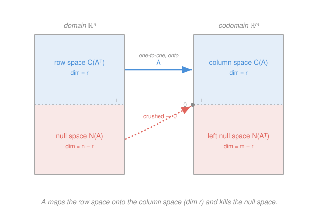

# Linear Algebra · Lesson 2.2: Inverses and the four fundamental subspaces

> ⏱ ~15 min · Module 2: Matrices as linear maps · Builds on: [2.1 Matrices as linear transformations](02-01-matrices-as-linear-maps.md), [1.3 Linear systems, elimination, and rank](01-03-linear-systems-elimination-rank.md) · Unlocks: 2.3 (determinants)

## Why this matters

A matrix is a map (Lesson 2.1). The first question about any map is: **can you undo it?** If $A$ turns $\mathbf x$ into $\mathbf b$, is there a matrix $A^{-1}$ that turns $\mathbf b$ back into $\mathbf x$ — every time, uniquely? Solving $A\mathbf x = \mathbf b$, changing coordinates, running a dynamical system backward all hinge on this. And when the answer is *no*, the map isn't just "broken" — it's leaking information in a completely structured way that the **four fundamental subspaces** name exactly. This lesson is the anatomy of a linear map: what it preserves, what it destroys, and where its outputs actually live.

## The idea

Think of $A$ as a machine that eats a vector and spits out another. Two things can go wrong. It can **crush** distinct inputs together — if two different $\mathbf x$'s land on the same output, you can't reverse the arrow, because "back" is ambiguous. And it can **miss** targets — its outputs might only fill a slice of the codomain, so some $\mathbf b$ are simply unreachable. A map you can invert does neither: nothing gets crushed, nothing gets missed. For that you need exactly as many independent columns as coordinates — a **square matrix of full rank**.

When the map *does* crush, the crushing is organized. The set of inputs sent to $\mathbf 0$ — the vectors the map annihilates — forms a whole subspace, the **null space**. The domain then splits cleanly in two: a part the map handles faithfully (the **row space**), and the part it flattens to nothing (the null space). These two pieces are perpendicular, and together they account for every input direction. The same story plays out on the output side. That's the "big picture": one map, four subspaces, two right angles.

## The formal version

Throughout, $A$ is an $m \times n$ matrix — a map from $\mathbb R^n$ (the **domain**, inputs) to $\mathbb R^m$ (the **codomain**, outputs) — and $r = \operatorname{rank}(A)$ is its number of pivots (Lesson 1.3), i.e. its number of independent columns.

**The inverse.** A square $n \times n$ matrix $A$ is **invertible** if there is a matrix $A^{-1}$ with
$$A^{-1}A = A A^{-1} = I,$$
where $I$ is the $n\times n$ identity. *In words:* $A^{-1}$ is the map that undoes $A$ (and $A$ undoes it). It exists **iff** $A$ is square with full rank $r = n$ — equivalently, its columns are linearly independent, equivalently $A\mathbf x = \mathbf 0$ forces $\mathbf x = \mathbf 0$ (nothing but $\mathbf 0$ gets crushed). Then $A\mathbf x = \mathbf b$ has the unique solution $\mathbf x = A^{-1}\mathbf b$.

**The 2×2 formula.** For $A = \begin{bmatrix} a & b \\ c & d \end{bmatrix}$ with $ad - bc \neq 0$,
$$A^{-1} = \frac{1}{ad-bc}\begin{bmatrix} d & -b \\ -c & a \end{bmatrix}.$$
*In words:* swap the diagonal, negate the off-diagonal, divide by $ad-bc$. That number $ad-bc$ is the determinant (Lesson 2.3); when it's $0$ there's no inverse. **Bigger matrices:** row-reduce $[\,A \mid I\,]$ until the left block becomes $I$; the right block becomes $A^{-1}$ (Gauss–Jordan — the same elimination from 1.3, run on $I$ alongside).

**The four fundamental subspaces.** Every $m\times n$ matrix has four:

| Subspace | Symbol | Lives in | Meaning | Dimension |
|---|---|---|---|---|
| Column space | $C(A)$ | $\mathbb R^m$ | span of the columns = all reachable outputs $A\mathbf x$ | $r$ |
| Null space | $N(A)$ | $\mathbb R^n$ | all $\mathbf x$ with $A\mathbf x = \mathbf 0$ (what's crushed) | $n - r$ |
| Row space | $C(A^\top)$ | $\mathbb R^n$ | span of the rows | $r$ |
| Left null space | $N(A^\top)$ | $\mathbb R^m$ | all $\mathbf y$ with $A^\top \mathbf y = \mathbf 0$ | $m - r$ |

**Rank–nullity.** In the domain,
$$\operatorname{rank}(A) + \dim N(A) = n.$$
*In words:* every input direction is either seen by the map (row space, $r$ of them) or killed by it (null space, $n-r$ of them) — no direction is both, none is neither. This is just "pivot columns + free columns = all columns" from elimination, read geometrically.

**The two orthogonality relations.**
$$C(A^\top) \perp N(A) \ \text{ in } \mathbb R^n, \qquad C(A) \perp N(A^\top) \ \text{ in } \mathbb R^m.$$
*In words:* in the domain, the row space and null space are perpendicular complements (they meet only at $\mathbf 0$ and fill all of $\mathbb R^n$); same for column space and left null space in the codomain. The first is almost a tautology once you look: $A\mathbf x = \mathbf 0$ says *each row dotted with $\mathbf x$ is zero* — so any null-space vector is orthogonal to every row, hence to the whole row space.

## Picture

## Worked examples

**Example 1 (mechanical — invert a 2×2 and check).** Let $A = \begin{bmatrix} 3 & 1 \\ 2 & 2 \end{bmatrix}$. Determinant $ad - bc = 3\cdot 2 - 1\cdot 2 = 4 \neq 0$, so it's invertible:
$$A^{-1} = \frac{1}{4}\begin{bmatrix} 2 & -1 \\ -2 & 3 \end{bmatrix}.$$
Check: $A A^{-1} = \frac{1}{4}\begin{bmatrix} 3 & 1 \\ 2 & 2 \end{bmatrix}\begin{bmatrix} 2 & -1 \\ -2 & 3 \end{bmatrix} = \frac{1}{4}\begin{bmatrix} 6-2 & -3+3 \\ 4-4 & -2+6 \end{bmatrix} = \frac{1}{4}\begin{bmatrix} 4 & 0 \\ 0 & 4 \end{bmatrix} = I.$ ✓

**Example 2 (why you'd care — anatomy of a rank-deficient map).** Let $A = \begin{bmatrix} 1 & 2 & 3 \\ 2 & 5 & 7 \\ 1 & 3 & 4 \end{bmatrix}$ ($m = n = 3$). Eliminate: $R_2 \to R_2 - 2R_1$, $R_3 \to R_3 - R_1$, then $R_3 \to R_3 - R_2$:
$$\begin{bmatrix} 1 & 2 & 3 \\ 0 & 1 & 1 \\ 0 & 0 & 0 \end{bmatrix}.$$
Two pivots (columns 1 and 2), so $r = 2 < 3$ — **not invertible**, even though it's square. The map collapses $\mathbb R^3$ onto a 2D slice.

- **Column space** $C(A)$: the pivot columns of the *original* $A$, so $\Big\{\begin{bmatrix}1\\2\\1\end{bmatrix}, \begin{bmatrix}2\\5\\3\end{bmatrix}\Big\}$ — a plane in $\mathbb R^3$, $\dim = 2$.
- **Null space** $N(A)$: solve the reduced system. $x_3$ is free; row 2 gives $x_2 = -x_3$, row 1 gives $x_1 = -2x_2 - 3x_3 = -x_3$. Setting $x_3 = 1$: basis $\Big\{\begin{bmatrix}-1\\-1\\1\end{bmatrix}\Big\}$, a line, $\dim = 1$.

Rank–nullity: $2 + 1 = 3 = n$. ✓ The two independent input directions the map sees (row space) plus the one it crushes (null space) reconstitute all of $\mathbb R^3$.

## Watch out

- You might think "square guarantees invertible." **No** — Example 2 is square and singular. Invertibility needs *full rank*: independent columns. A square matrix that squashes any direction to $\mathbf 0$ can't be undone, because that direction's information is gone.
- You might read the column space off the *reduced* matrix's pivot columns. **Take the pivot columns from the original $A$.** Elimination changes the column space (it combines rows), so the reduced columns span the wrong plane — but it correctly *locates which* columns are pivots.
- You might think $A^{-1}$ means "divide by $A$." There's no division of matrices, and order matters: $A^{-1}A = AA^{-1} = I$ holds for the true two-sided inverse, but $AB \neq BA$ in general, so never rearrange products by "cancelling."

## One-liner

> A map is invertible exactly when it crushes nothing (full rank); otherwise the domain splits into the row space it maps faithfully and the perpendicular null space it flattens — and $\operatorname{rank} + \operatorname{nullity} = n$ counts both.

## Problems

**P1 (🟢)** Invert $A = \begin{bmatrix} 4 & 3 \\ 1 & 1 \end{bmatrix}$ using the 2×2 formula, then verify $A A^{-1} = I$ by multiplying it out.

**P2 (🟡)** For $A = \begin{bmatrix} 1 & 2 & 1 \\ 2 & 4 & 0 \\ 3 & 6 & 1 \end{bmatrix}$, find a basis for the column space $C(A)$ and a basis for the null space $N(A)$, and confirm $\operatorname{rank} + \dim N(A) = n$.

**P3 (🔴)** Let $B = \begin{bmatrix} 1 & 1 & 0 \\ 0 & 1 & 1 \end{bmatrix}$. Find a basis vector $\mathbf n$ for $N(B)$, then dot it with *each row* of $B$ to verify $C(B^\top) \perp N(B)$. Finally, explain in one sentence why the equation $B\mathbf x = \mathbf 0$ **guarantees** this orthogonality for any matrix.

Solutions

**P1** Determinant $ad - bc = 4\cdot 1 - 3\cdot 1 = 1$. So
$$A^{-1} = \frac{1}{1}\begin{bmatrix} 1 & -3 \\ -1 & 4 \end{bmatrix} = \begin{bmatrix} 1 & -3 \\ -1 & 4 \end{bmatrix}.$$
Check: $A A^{-1} = \begin{bmatrix} 4 & 3 \\ 1 & 1 \end{bmatrix}\begin{bmatrix} 1 & -3 \\ -1 & 4 \end{bmatrix} = \begin{bmatrix} 4-3 & -12+12 \\ 1-1 & -3+4 \end{bmatrix} = \begin{bmatrix} 1 & 0 \\ 0 & 1 \end{bmatrix} = I.$ ✓

**P2** $n = 3$ columns. Eliminate: $R_2 \to R_2 - 2R_1$, $R_3 \to R_3 - 3R_1$:
$$\begin{bmatrix} 1 & 2 & 1 \\ 0 & 0 & -2 \\ 0 & 0 & -2 \end{bmatrix} \xrightarrow{R_3 - R_2} \begin{bmatrix} 1 & 2 & 1 \\ 0 & 0 & -2 \\ 0 & 0 & 0 \end{bmatrix}.$$
Pivots in columns 1 and 3, so $r = 2$.
- **Column space:** pivot columns of the original $A$: $\Big\{\begin{bmatrix}1\\2\\3\end{bmatrix}, \begin{bmatrix}1\\0\\1\end{bmatrix}\Big\}$, $\dim = 2$. (Column 2 is exactly $2\times$ column 1, the redundancy.)
- **Null space:** $x_2$ is free. Row 2 ($-2x_3 = 0$) gives $x_3 = 0$; row 1 ($x_1 + 2x_2 + x_3 = 0$) gives $x_1 = -2x_2$. Set $x_2 = 1$: basis $\Big\{\begin{bmatrix}-2\\1\\0\end{bmatrix}\Big\}$, $\dim = 1$. Check: $A\begin{bmatrix}-2\\1\\0\end{bmatrix} = \begin{bmatrix}-2+2+0\\-4+4+0\\-6+6+0\end{bmatrix} = \mathbf 0$. ✓
- **Rank–nullity:** $r + \dim N(A) = 2 + 1 = 3 = n$. ✓

**P3** Solve $B\mathbf x = \mathbf 0$: $x_1 + x_2 = 0$ and $x_2 + x_3 = 0$. Take $x_3 = 1 \Rightarrow x_2 = -1 \Rightarrow x_1 = 1$. So $\mathbf n = \begin{bmatrix}1\\-1\\1\end{bmatrix}$ (and $\dim N(B) = 1$). Check: $B\mathbf n = \begin{bmatrix}1-1+0\\0-1+1\end{bmatrix} = \mathbf 0$. ✓

Dot with each row: row $1 = (1,1,0)$: $1\cdot 1 + 1\cdot(-1) + 0\cdot 1 = 0$. ✓ Row $2 = (0,1,1)$: $0\cdot 1 + 1\cdot(-1) + 1\cdot 1 = 0$. ✓ So $\mathbf n$ is orthogonal to both rows, hence to their span $C(B^\top)$.

**Why it's automatic:** the matrix–vector product $B\mathbf x$ is literally the column of dot products of each row with $\mathbf x$, so $B\mathbf x = \mathbf 0$ *says* every row is orthogonal to $\mathbf x$ — that is exactly $C(B^\top) \perp N(B)$.

## Flashback

**From Lesson 2.1 (Matrices as linear transformations):** A linear map $T$ on $\mathbb R^2$ sends $\mathbf e_1 \mapsto \begin{bmatrix}2\\1\end{bmatrix}$ and $\mathbf e_2 \mapsto \begin{bmatrix}1\\3\end{bmatrix}$. (a) Write its matrix $A$ and compute $A\begin{bmatrix}1\\1\end{bmatrix}$. (b) Let $S$ be the map that swaps coordinates ($\mathbf e_1 \mapsto \mathbf e_2$, $\mathbf e_2 \mapsto \mathbf e_1$). Find the matrix of "do $T$, then $S$" and describe what it did to $A$.

Solution

(a) Columns are the images of the basis vectors, so $A = \begin{bmatrix} 2 & 1 \\ 1 & 3 \end{bmatrix}$. Then $A\begin{bmatrix}1\\1\end{bmatrix} = \begin{bmatrix}2+1\\1+3\end{bmatrix} = \begin{bmatrix}3\\4\end{bmatrix}$.

(b) The swap has matrix $S = \begin{bmatrix} 0 & 1 \\ 1 & 0 \end{bmatrix}$ (its columns are $\mathbf e_2, \mathbf e_1$). "Do $T$, then $S$" is the composition $S \circ T = SA$ (rightmost map acts first — the order rule from 2.1):
$$SA = \begin{bmatrix} 0 & 1 \\ 1 & 0 \end{bmatrix}\begin{bmatrix} 2 & 1 \\ 1 & 3 \end{bmatrix} = \begin{bmatrix} 1 & 3 \\ 2 & 1 \end{bmatrix}.$$
Left-multiplying by $S$ **swapped the rows** of $A$. (Left-multiply acts on rows; right-multiply would act on columns — and $AS \neq SA$, so order matters.)

## Connections

- **Backward:** the null space is the homogeneous solution set from [1.3](01-03-linear-systems-elimination-rank.md), and rank–nullity is that lesson's "pivot vs. free columns" count seen as a splitting of the domain; the inverse is the clean case of 2.1's map where composition with $A^{-1}$ returns the identity.
- **Forward:** [2.3](02-03-determinants.md) turns the invertibility test into a single number — $\det A = 0 \iff$ the columns are dependent $\iff$ the map crushes something. The full solution set of $A\mathbf x = \mathbf b$ (particular solution + null space) is the shape Boss problem 1 asked for.
- **Sideways (statistics):** the column space is where least-squares lives — when $\mathbf b \notin C(A)$ the system is unsolvable, and projection onto $C(A)$ finds the best reachable answer, with the residual landing in the left null space $N(A^\top)$. That's Module 4 ([4.2](04-02-projection-least-squares.md)), and it's the geometry behind linear regression.
