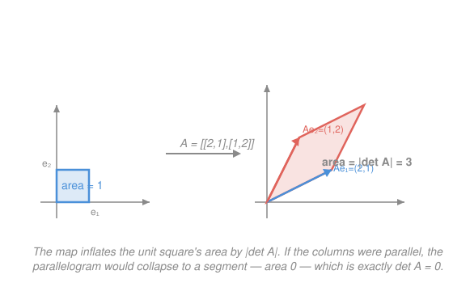

# Linear Algebra · Lesson 2.3: Determinants: volume, orientation, and invertibility

> ⏱ ~15 min · Module 2: Matrices as linear maps · Builds on: [2.1 Matrices as linear transformations](02-01-matrices-as-linear-maps.md), [2.2 Inverses and the four fundamental subspaces](02-02-inverses-and-four-subspaces.md) · Unlocks: Module 3 (eigenvalues)

## Why this matters

A linear map takes a region and moves it — stretching, rotating, shearing, flipping. One number tracks the single most important thing that happens to that region: **by how much did its area (or volume) change, and did the map turn it inside out?** That number is the determinant. It answers "is this map invertible?" at a glance ($\det \neq 0$ ⟺ yes), it tells you whether a change of variables inflates or shrinks volume (the Jacobian in `calc-refresher`'s multivariable integration is a determinant), and it is the machine that will manufacture eigenvalues in the very next module. Learn to read it as *scaling*, not as a formula to memorize.

## The idea

Feed a linear map the unit square (in 2D) or the unit cube (in 3D) — the little box of area/volume $1$ sitting at the origin. The map turns it into a parallelogram (or parallelepiped). The **determinant is the factor by which the box's area changed**, with a sign attached.

- **Size.** $|\det A| = 3$ means every region comes out $3$ times bigger; $|\det A| = \tfrac12$ means everything is squashed to half its area. The factor is the *same* for every region, not just the unit box — that's what "linear" buys you.
- **Sign.** A positive determinant means the map kept the box's handedness (a counterclockwise corner stays counterclockwise); a negative determinant means it **flipped orientation**, like a mirror. A pure reflection has $\det = -1$.
- **Zero.** $\det A = 0$ is the crisis case: the map has crushed the box flat — a square collapses onto a line, a cube onto a plane. Area/volume becomes $0$. Once you've collapsed a dimension you can't un-collapse it, so the map is **not invertible**. This is the whole punchline, and it ties straight back to [2.2](02-02-inverses-and-four-subspaces.md).

So: determinant = signed volume-scaling factor, and it vanishes exactly when the map loses a dimension.

## The formal version

**The $2\times 2$ determinant.** For $A = \begin{bmatrix} a & b \\ c & d \end{bmatrix}$,
$$\det A = ad - bc.$$
In words: this is the **signed area** of the parallelogram spanned by the columns $\begin{bmatrix} a \\ c \end{bmatrix}$ and $\begin{bmatrix} b \\ d \end{bmatrix}$ — positive if the second column sits counterclockwise from the first, negative if clockwise.

**The $3\times 3$ determinant by cofactor expansion.** Expand along the first row of $A = \begin{bmatrix} a_{11} & a_{12} & a_{13} \\ a_{21} & a_{22} & a_{23} \\ a_{31} & a_{32} & a_{33} \end{bmatrix}$:
$$\det A = a_{11}\det\!\begin{bmatrix} a_{22} & a_{23} \\ a_{32} & a_{33} \end{bmatrix} - a_{12}\det\!\begin{bmatrix} a_{21} & a_{23} \\ a_{31} & a_{33} \end{bmatrix} + a_{13}\det\!\begin{bmatrix} a_{21} & a_{22} \\ a_{31} & a_{32} \end{bmatrix}.$$
In words: walk along the top row; each entry is weighted by the $2\times 2$ determinant of what's left when you delete its row and column, with signs $+\,-\,+$. You may expand along *any* row or column (same sign checkerboard $\begin{smallmatrix}+&-&+\\-&+&-\\+&-&+\end{smallmatrix}$) — pick the one with the most zeros to save work, and cross-check with a second expansion.

**Row-reduction shortcut.** Elimination to an upper-triangular form multiplies the pivots: $\det A = \pm(\text{product of pivots})$, the sign flipping once per row swap. A triangular matrix's determinant is just its diagonal product — the cheap way for large matrices.

**The headline equivalence.** For a square $A$, the following all say the same thing:
$$\det A = 0 \iff A \text{ is singular (no inverse)} \iff \text{the columns are linearly dependent} \iff A\text{ has a nontrivial null space.}$$
In words: no volume, no inverse. If the columns are dependent they span less than full dimension, so the image box is flat ($\det = 0$); some nonzero $\mathbf x$ then solves $A\mathbf x = \mathbf 0$ (the map sends a whole direction to the origin) — exactly the null space from [2.2](02-02-inverses-and-four-subspaces.md).

**Three properties worth memorizing.** For square $A, B$ of the same size:
$$\det(AB) = \det A \,\det B, \qquad \det(A^{-1}) = \frac{1}{\det A}, \qquad \det(A^\top) = \det A.$$
In words: scalings **multiply** under composition (do map $B$ then map $A$, volumes scale by each in turn); undoing a map scales volume by the reciprocal; and transposing never changes the determinant (so "rows" and "columns" tell the same volume story).

## Picture

Reading it: the map $A = \begin{bmatrix} 2 & 1 \\ 1 & 2 \end{bmatrix}$ sends the unit square (area $1$, left) to the parallelogram spanned by its columns $A\mathbf e_1 = \begin{bmatrix}2\\1\end{bmatrix}$ and $A\mathbf e_2 = \begin{bmatrix}1\\2\end{bmatrix}$ (right). That parallelogram's area is $\det A = 2\cdot 2 - 1\cdot 1 = 3$: the box got three times bigger. If the two columns had been parallel, the parallelogram would flatten to a segment of area $0$ — and that is precisely $\det A = 0$.

## Worked examples

**Example 1 (mechanical — the $2\times 2$, read as area).** Take the map in the Picture, $A = \begin{bmatrix} 2 & 1 \\ 1 & 2 \end{bmatrix}$:
$$\det A = (2)(2) - (1)(1) = 4 - 1 = 3.$$
Positive, so orientation is preserved; magnitude $3$, so the map triples every area. Since $\det A = 3 \neq 0$, $A$ is invertible — no dimension was crushed.

**Example 2 (why you'd care — a $3\times 3$ invertibility test).** Is $B = \begin{bmatrix} 1 & 2 & 1 \\ 0 & 1 & 3 \\ 2 & 0 & 1 \end{bmatrix}$ invertible? Rather than attempt elimination blind, take the determinant. Expand along the first row:
$$\det B = 1\det\!\begin{bmatrix} 1 & 3 \\ 0 & 1 \end{bmatrix} - 2\det\!\begin{bmatrix} 0 & 3 \\ 2 & 1 \end{bmatrix} + 1\det\!\begin{bmatrix} 0 & 1 \\ 2 & 0 \end{bmatrix}.$$
$$= 1(1\cdot 1 - 3\cdot 0) - 2(0\cdot 1 - 3\cdot 2) + 1(0\cdot 0 - 1\cdot 2) = 1(1) - 2(-6) + 1(-2) = 1 + 12 - 2 = 11.$$
**Cross-check** by expanding down the first column (entries $1, 0, 2$), which reuses one minor and kills a term:
$$\det B = 1\det\!\begin{bmatrix} 1 & 3 \\ 0 & 1 \end{bmatrix} - 0 + 2\det\!\begin{bmatrix} 2 & 1 \\ 1 & 3 \end{bmatrix} = 1(1) + 2(6 - 1) = 1 + 10 = 11. \ ✓$$
Both roads give $11$. So $B$ is invertible, orientation-preserving, and inflates volume by a factor of $11$.

## Watch out

- You might think a bigger matrix means a bigger determinant. Size and determinant are unrelated: $10I_2 = \begin{bmatrix}10&0\\0&10\end{bmatrix}$ has $\det = 100$, while the huge-looking $\begin{bmatrix}1&2\\2&4\end{bmatrix}$ has $\det = 0$. What matters is whether the columns are independent, not how large the entries are.
- You might think the sign of the determinant is a nuisance to ignore. It carries real information — orientation. A single row swap or a reflection like $\begin{bmatrix}0&1\\1&0\end{bmatrix}$ ($\det = -1$) flips handedness; $\det$'s magnitude is the area factor, its sign is the mirror flag.
- You might think $\det(A + B) = \det A + \det B$ by analogy with the product rule. **Almost never true** — determinants multiply, they do not add. Try $A = B = I_2$: $\det(A+B) = \det(2I_2) = 4$, but $\det A + \det B = 1 + 1 = 2$.

## One-liner

> The determinant is the signed factor by which a map scales volume — positive keeps orientation, negative mirrors it, and zero means the map flattened space and threw away its inverse.

## Problems

**P1 (🟢)** Compute both determinants:
(a) $\det\begin{bmatrix} 3 & 1 \\ 2 & 4 \end{bmatrix}$; (b) $\det\begin{bmatrix} 2 & 0 & 1 \\ 1 & 3 & 2 \\ 0 & 1 & 1 \end{bmatrix}$ (cofactor expansion — expand along whichever row or column you like, then cross-check with a second one).

**P2 (🟡)** Decide whether $C = \begin{bmatrix} 1 & 2 & 0 \\ 2 & 4 & 1 \\ 3 & 6 & 1 \end{bmatrix}$ is invertible by computing $\det C$. Then, *without* referring to the determinant, point to a linear dependence among the columns that explains your answer — and connect it to $C$ having a nontrivial null space.

**P3 (🔴)** A horizontal **shear** is the map $S = \begin{bmatrix} 1 & k \\ 0 & 1 \end{bmatrix}$ (it slides points sideways by an amount proportional to their height). Show algebraically that $\det S = 1$ for every $k$, then explain *geometrically* why a shear must preserve area — by describing what it does to the unit square. (This is why shears show up as "area-preserving deformations" in mechanics and in the change-of-variables that keeps a probability density normalized.)

Solutions

**P1** (a) $\det\begin{bmatrix} 3 & 1 \\ 2 & 4 \end{bmatrix} = (3)(4) - (1)(2) = 12 - 2 = 10.$

(b) Expand along the **first column** (entries $2, 1, 0$ — the zero kills a term):
$$\det = 2\det\!\begin{bmatrix} 3 & 2 \\ 1 & 1 \end{bmatrix} - 1\det\!\begin{bmatrix} 0 & 1 \\ 1 & 1 \end{bmatrix} + 0 = 2(3 - 2) - 1(0 - 1) = 2(1) - 1(-1) = 2 + 1 = 3.$$
Cross-check along the **first row** (entries $2, 0, 1$):
$$\det = 2\det\!\begin{bmatrix} 3 & 2 \\ 1 & 1 \end{bmatrix} - 0 + 1\det\!\begin{bmatrix} 1 & 3 \\ 0 & 1 \end{bmatrix} = 2(1) + 1(1) = 3. \ ✓$$
Both give $\det = 3$, so this map is invertible.

**P2** Expand $\det C$ along the first row:
$$\det C = 1\det\!\begin{bmatrix} 4 & 1 \\ 6 & 1 \end{bmatrix} - 2\det\!\begin{bmatrix} 2 & 1 \\ 3 & 1 \end{bmatrix} + 0 = 1(4 - 6) - 2(2 - 3) = (-2) - 2(-1) = -2 + 2 = 0.$$
So $\det C = 0$ and $C$ is **not invertible** (singular). The reason without the determinant: the **second column is exactly twice the first**, $\begin{bmatrix}2\\4\\6\end{bmatrix} = 2\begin{bmatrix}1\\2\\3\end{bmatrix}$ — a linear dependence, so the three columns span at most a plane, not all of $\mathbb R^3$. Equivalently, $2\,(\text{col }1) - 1\,(\text{col }2) + 0\,(\text{col }3) = \mathbf 0$, which says
$$C\begin{bmatrix} 2 \\ -1 \\ 0 \end{bmatrix} = \mathbf 0.$$
That nonzero vector is in the **null space** of $C$ (from [2.2](02-02-inverses-and-four-subspaces.md)): the map sends a whole direction to the origin, crushing volume to $0$ — which is what $\det C = 0$ announced.

**P3** Algebra: $\det S = (1)(1) - (k)(0) = 1$ for every $k$. ✓

Geometry: the unit square has corners $(0,0), (1,0), (1,1), (0,1)$. The shear fixes the bottom edge (points at height $0$ don't move, since it slides by $k \cdot \text{height}$) and pushes the top edge sideways by $k$: the top corners become $(1,1)\to(1+k,1)$ and $(0,1)\to(k,1)$. The result is a parallelogram with the **same base** (length $1$ along the $x$-axis) and the **same height** (still $1$, since no point changed its $y$-coordinate). Area $=$ base $\times$ height $= 1 \times 1 = 1$, unchanged — matching $\det S = 1$. Sliding a stack of cards sideways doesn't change how much table the stack covers.

## Flashback

**From Lesson 1.3 (Linear systems, elimination, and rank):** Find the **rank** of $M = \begin{bmatrix} 1 & 2 & 3 \\ 2 & 4 & 6 \\ 1 & 1 & 1 \end{bmatrix}$ by elimination, and use it to predict $\det M$ *without expanding a single cofactor*.

Solution

Eliminate below the first pivot. $R_2 \leftarrow R_2 - 2R_1$ gives $(0,0,0)$; $R_3 \leftarrow R_3 - R_1$ gives $(0,-1,-2)$:
$$M \longrightarrow \begin{bmatrix} 1 & 2 & 3 \\ 0 & 0 & 0 \\ 0 & -1 & -2 \end{bmatrix}.$$
There are only **two** nonzero rows (two pivots, in columns 1 and 2), so $\operatorname{rank}(M) = 2 < 3$. A full $3\times 3$ needs rank $3$ to be invertible, so $M$ is singular and therefore $\det M = 0$ — no cofactors required. (The tell was visible from the start: $R_2 = 2R_1$, a dependent row, and by $\det(M^\top) = \det M$ a dependent row kills the determinant just as a dependent column does.)

## Connections

- **Backward:** the headline equivalence is [2.2](02-02-inverses-and-four-subspaces.md)'s invertibility story told in one number — $\det A = 0$ is the singular/dependent-columns/nontrivial-null-space condition, now *computable*. The "product of pivots" shortcut is [1.3](01-03-linear-systems-elimination-rank.md)'s elimination reused: rank $< n$ (a zero pivot) forces $\det = 0$.
- **Forward:** [3.1](03-01-eigenvalues-eigenvectors.md) defines eigenvalues as the numbers $\lambda$ making $A - \lambda I$ singular — i.e. the roots of $\det(A - \lambda I) = 0$. The whole eigenvalue machine is this lesson's collapse condition turned into an equation.
- **Sideways (calculus):** the change-of-variables factor in a multivariable integral is $|\det J|$, the determinant of the Jacobian — the local area/volume-scaling of a nonlinear map, read exactly as the box-scaling here. The shear in P3 is the linear archetype of an area-preserving substitution.
