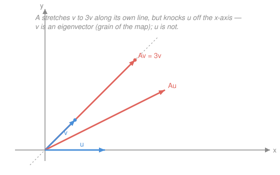

# Linear Algebra · Lesson 3.1: Eigenvalues and eigenvectors

> ⏱ ~15 min · Module 3: Eigenvalues and diagonalization · Builds on: [2.3 Determinants](02-03-determinants.md), [2.1 Matrices as linear transformations](02-01-matrices-as-linear-maps.md) · Unlocks: 3.2 (diagonalization)

## Why this matters

A matrix pushes almost every vector into a new direction — but a few special directions it merely *stretches*. Those are the map's skeleton. Find them and a tangled transformation falls apart into independent one-dimensional stretches: matrix powers become trivial, a coupled system of differential equations decouples into separate exponentials, a vibrating structure reveals its normal modes, a Markov chain reveals its steady state, and a quadratic form reveals its principal axes. Eigenvalues are where linear algebra stops being bookkeeping and starts predicting long-run behavior — the whole back half of this course runs on them.

## The idea

Apply a matrix $A$ to a vector and two things can change: its *direction* and its *length*. For most vectors, both change — the arrow swings to a new heading. But for certain privileged directions, $A$ leaves the heading alone and only rescales: the output lands on the *same line* as the input, just longer, shorter, or flipped. Such a direction is an **eigenvector**, and the scale factor is its **eigenvalue**.

Think of the map as having a *grain*, like wood. Push across the grain and things twist; push along the grain and you slide straight. Eigenvectors are the grain — the axes along which $A$ acts as pure scaling, no rotation. A shear has one grain direction; a symmetric matrix has a full perpendicular set; a pure rotation has *none* (every arrow swings), which is exactly why its eigenvalues will turn out complex.

Finding them looks circular at first — you need the direction to get the factor and the factor to get the direction — but there's a clean way in. If $A$ scales some nonzero $\mathbf v$ by $\lambda$, then $A\mathbf v - \lambda\mathbf v = \mathbf 0$, i.e. the matrix $A - \lambda I$ crushes a nonzero vector to zero. A matrix that kills a nonzero vector is **singular** — and singular means **determinant zero**. So the eigenvalues are exactly the $\lambda$ that make $\det(A - \lambda I) = 0$. That single equation, straight out of [2.3](02-03-determinants.md), unlocks everything.

## The formal version

Let $A$ be an $n\times n$ matrix and $I$ the $n\times n$ identity.

**Eigenvector / eigenvalue.** A nonzero vector $\mathbf v \ne \mathbf 0$ is an **eigenvector** of $A$ with **eigenvalue** $\lambda \in \mathbb{R}$ (or $\mathbb{C}$) if
$$A\mathbf v = \lambda\mathbf v.$$
In words: $A$ acts on $\mathbf v$ as plain multiplication by the number $\lambda$ — same direction (or exactly reversed, if $\lambda<0$), scaled by $|\lambda|$. The requirement $\mathbf v \ne \mathbf 0$ is essential: $\mathbf 0$ satisfies the equation for *every* $\lambda$ and carries no information.

**Characteristic polynomial.** Rewrite the condition as $(A - \lambda I)\mathbf v = \mathbf 0$ with $\mathbf v \ne \mathbf 0$. A nonzero solution exists iff $A - \lambda I$ is singular, i.e.
$$\det(A - \lambda I) = 0.$$
In words: the eigenvalues are the roots of the polynomial $p(\lambda) = \det(A - \lambda I)$ — the values that make $A - \lambda I$ collapse. For an $n\times n$ matrix this is a degree-$n$ polynomial, so there are $n$ eigenvalues counted with multiplicity (some possibly repeated or complex).

**Eigenspace.** For each eigenvalue $\lambda$, its eigenvectors together with $\mathbf 0$ form the **eigenspace**
$$E_\lambda = \{\mathbf v : (A - \lambda I)\mathbf v = \mathbf 0\} = \text{null space of } (A - \lambda I).$$
In words: once you have $\lambda$, its eigenvectors are just the null space of $A - \lambda I$ — solve that homogeneous system ([2.2](02-02-inverses-and-four-subspaces.md)). It's a whole subspace, so eigenvectors are never unique: any nonzero scalar multiple works, which is why we report a *direction*.

**Two free checks (for a 2×2, worth memorizing).** The eigenvalues always satisfy
$$\lambda_1 + \lambda_2 = \operatorname{tr}(A) \quad(\text{sum of diagonal entries}), \qquad \lambda_1\,\lambda_2 = \det(A).$$
In words: the trace is the sum of the eigenvalues and the determinant is their product — a two-second sanity check on any answer. (Note $\lambda = 0$ is an eigenvalue exactly when $\det A = 0$: a singular matrix scales some direction to nothing.)

## Picture

Reading it, with $A = \begin{bmatrix} 2 & 1 \\ 1 & 2 \end{bmatrix}$: the eigenvector $\mathbf v = \begin{bmatrix}1\\1\end{bmatrix}$ maps to $A\mathbf v = \begin{bmatrix}3\\3\end{bmatrix} = 3\mathbf v$ — the red output sits on the *same* dashed line as the blue input, just three times as long ($\lambda = 3$). The ordinary vector $\mathbf u = \begin{bmatrix}2\\0\end{bmatrix}$ maps to $A\mathbf u = \begin{bmatrix}4\\2\end{bmatrix}$, which lifts off the $x$-axis: its heading changed, so $\mathbf u$ is not an eigenvector. Eigenvectors are the lines $A$ leaves invariant.

## Worked examples

**Example 1 (mechanical — the full recipe).** Find the eigenvalues and eigenvectors of $A = \begin{bmatrix} 4 & 1 \\ 2 & 3 \end{bmatrix}$.

*Step 1 — characteristic polynomial.*
$$\det(A - \lambda I) = \det\begin{bmatrix} 4-\lambda & 1 \\ 2 & 3-\lambda \end{bmatrix} = (4-\lambda)(3-\lambda) - 2 = \lambda^2 - 7\lambda + 10 = (\lambda - 2)(\lambda - 5).$$
So $\lambda_1 = 2,\ \lambda_2 = 5$. Check: sum $= 7 = \operatorname{tr}(A) = 4+3$ ✓; product $= 10 = \det A = 12 - 2$ ✓.

*Step 2 — eigenvector for each $\lambda$ (null space of $A - \lambda I$).* For $\lambda = 5$:
$$A - 5I = \begin{bmatrix} -1 & 1 \\ 2 & -2 \end{bmatrix} \Rightarrow -x + y = 0 \Rightarrow y = x \Rightarrow \mathbf v_5 = \begin{bmatrix} 1 \\ 1 \end{bmatrix}.$$
For $\lambda = 2$:
$$A - 2I = \begin{bmatrix} 2 & 1 \\ 2 & 1 \end{bmatrix} \Rightarrow 2x + y = 0 \Rightarrow y = -2x \Rightarrow \mathbf v_2 = \begin{bmatrix} 1 \\ -2 \end{bmatrix}.$$
*Verify by plugging back:* $A\mathbf v_5 = \begin{bmatrix}4+1\\2+3\end{bmatrix} = \begin{bmatrix}5\\5\end{bmatrix} = 5\mathbf v_5$ ✓, and $A\mathbf v_2 = \begin{bmatrix}4-1\\2-3\end{bmatrix} = \begin{bmatrix}2\\-4\end{bmatrix} = 2\mathbf v_2$ ✓.

**Example 2 (why you'd care — eigenvalues predict long-run behavior).** Take the picture matrix $A = \begin{bmatrix} 2 & 1 \\ 1 & 2 \end{bmatrix}$, with eigenpairs $\lambda = 3,\ \mathbf v = \begin{bmatrix}1\\1\end{bmatrix}$ and $\lambda = 1,\ \mathbf w = \begin{bmatrix}1\\-1\end{bmatrix}$ (found the same way; verify the checks: $\operatorname{tr}=4=3+1$, $\det=3=3\cdot 1$). Now iterate the map — the linear dynamical system $\mathbf x_{k+1} = A\mathbf x_k$. Split any start state into grain components, $\mathbf x_0 = a\mathbf v + b\mathbf w$. Because $A$ just scales each grain,
$$\mathbf x_k = A^k\mathbf x_0 = a\,3^k\,\mathbf v + b\,1^k\,\mathbf w = a\,3^k\begin{bmatrix}1\\1\end{bmatrix} + b\begin{bmatrix}1\\-1\end{bmatrix}.$$
The $\mathbf v$-part explodes by $3\times$ every step while the $\mathbf w$-part stays fixed, so after a few iterations the state points essentially along $\begin{bmatrix}1\\1\end{bmatrix}$ regardless of where it started. That is the **dominant eigenvector**: the direction a repeated map settles into, and its eigenvalue is the growth rate. This is the engine of [3.2](03-02-diagonalization.md) (matrix powers, Markov steady states, boss problem 3) — eigenvalues turn "apply $A$ a thousand times" into "raise a number to the thousandth power."

## Watch out

- You might think the zero vector could be an eigenvector — it can't, by definition. $\mathbf 0$ satisfies $A\mathbf 0 = \lambda\mathbf 0$ for *every* $\lambda$, so it would label every number an eigenvalue and mean nothing. Eigenvectors are nonzero; eigenvalues (including $\lambda = 0$) are fine.
- You might think an eigenvector is one specific arrow. It's a whole *line* (the eigenspace): if $\mathbf v$ works, so does $5\mathbf v$ or $-\mathbf v$, since scaling both sides of $A\mathbf v = \lambda\mathbf v$ preserves it. Report the direction, not a magnitude.
- You might think a real matrix must have a real eigenvector. A rotation like $\begin{bmatrix}0&-1\\1&0\end{bmatrix}$ turns *every* real arrow off its line, so it has no real eigen-direction at all — its characteristic polynomial $\lambda^2 + 1$ has complex roots $\pm i$. Complex eigenvalues aren't a failure; they *are* the signature of rotation (Problem 2).

## One-liner

> Eigenvectors are the directions a matrix only stretches; find the stretch factors as the roots of $\det(A - \lambda I) = 0$, then read each eigenvector off the null space of $A - \lambda I$.

## Problems

**P1 (🟢)** Find the eigenvalues and an eigenvector for each, for $A = \begin{bmatrix} 2 & 1 \\ 1 & 2 \end{bmatrix}$. Confirm your eigenvalues against the trace and determinant.

**P2 (🟡)** Find the eigenvalues of the rotation matrix $R = \begin{bmatrix} 0 & -1 \\ 1 & 0 \end{bmatrix}$. Explain geometrically why $R$ has no real eigenvector, and confirm your eigenvalues against $\operatorname{tr}(R)$ and $\det(R)$.

**P3 (🔴, optional)** Show that the eigenvalues of a $2\times 2$ upper-triangular matrix $T = \begin{bmatrix} a & b \\ 0 & d \end{bmatrix}$ are exactly its diagonal entries $a$ and $d$. Then, for the concrete case $\begin{bmatrix} 5 & 7 \\ 0 & 2 \end{bmatrix}$, find an eigenvector for each eigenvalue and verify $T\mathbf v = \lambda\mathbf v$ directly.

Solutions

**P1** Characteristic polynomial:
$$\det\begin{bmatrix} 2-\lambda & 1 \\ 1 & 2-\lambda \end{bmatrix} = (2-\lambda)^2 - 1 = \lambda^2 - 4\lambda + 3 = (\lambda - 1)(\lambda - 3),$$
so $\lambda = 1$ and $\lambda = 3$. Checks: sum $= 4 = \operatorname{tr}(A) = 2+2$ ✓; product $= 3 = \det A = 4 - 1$ ✓.

Eigenvectors (null space of $A - \lambda I$):
- $\lambda = 3$: $\begin{bmatrix} -1 & 1 \\ 1 & -1 \end{bmatrix}\Rightarrow y = x \Rightarrow \mathbf v_3 = \begin{bmatrix} 1 \\ 1 \end{bmatrix}$. Verify: $A\mathbf v_3 = \begin{bmatrix}3\\3\end{bmatrix} = 3\mathbf v_3$ ✓.
- $\lambda = 1$: $\begin{bmatrix} 1 & 1 \\ 1 & 1 \end{bmatrix}\Rightarrow y = -x \Rightarrow \mathbf v_1 = \begin{bmatrix} 1 \\ -1 \end{bmatrix}$. Verify: $A\mathbf v_1 = \begin{bmatrix}2-1\\1-2\end{bmatrix} = \begin{bmatrix}1\\-1\end{bmatrix} = 1\cdot\mathbf v_1$ ✓.

(These are the picture's grain and Example 2's decomposition — the two eigen-directions are perpendicular, a preview of the spectral theorem in [5.1](05-01-spectral-theorem-quadratic-forms.md).)

**P2** Characteristic polynomial:
$$\det\begin{bmatrix} -\lambda & -1 \\ 1 & -\lambda \end{bmatrix} = \lambda^2 + 1 = 0 \Rightarrow \lambda = \pm i.$$
Checks: sum $= i + (-i) = 0 = \operatorname{tr}(R) = 0 + 0$ ✓; product $= (i)(-i) = 1 = \det R = 0 - (-1)$ ✓. Geometrically $R$ rotates every vector in the plane by $90^\circ$; after a quarter-turn no nonzero real arrow can land back on its own line, so there is no real $\mathbf v$ with $R\mathbf v = \lambda\mathbf v$ for real $\lambda$. The eigenvalues are purely imaginary — the algebraic fingerprint of pure rotation (their magnitude $|\pm i| = 1$ records that rotation preserves length).

**P3** For $T = \begin{bmatrix} a & b \\ 0 & d \end{bmatrix}$,
$$\det(T - \lambda I) = \det\begin{bmatrix} a-\lambda & b \\ 0 & d-\lambda \end{bmatrix} = (a-\lambda)(d-\lambda) - (b)(0) = (a-\lambda)(d-\lambda),$$
because the determinant of a triangular matrix is the product of its diagonal (the $b$ entry never enters — the lower-left $0$ zeroes its cofactor). The roots are $\lambda = a$ and $\lambda = d$, the diagonal entries. (The same argument works for any $n\times n$ triangular matrix: $\det(T-\lambda I) = \prod_i (t_{ii} - \lambda)$, so the diagonal *is* the eigenvalue list.)

Concrete case $\begin{bmatrix} 5 & 7 \\ 0 & 2 \end{bmatrix}$, eigenvalues $5$ and $2$:
- $\lambda = 5$: $T - 5I = \begin{bmatrix} 0 & 7 \\ 0 & -3 \end{bmatrix}\Rightarrow 7y = 0 \Rightarrow y = 0,\ x$ free $\Rightarrow \mathbf v_5 = \begin{bmatrix} 1 \\ 0 \end{bmatrix}$. Verify: $T\mathbf v_5 = \begin{bmatrix}5\\0\end{bmatrix} = 5\mathbf v_5$ ✓.
- $\lambda = 2$: $T - 2I = \begin{bmatrix} 3 & 7 \\ 0 & 0 \end{bmatrix}\Rightarrow 3x + 7y = 0 \Rightarrow \mathbf v_2 = \begin{bmatrix} 7 \\ -3 \end{bmatrix}$. Verify: $T\mathbf v_2 = \begin{bmatrix}5\cdot 7 + 7\cdot(-3)\\2\cdot(-3)\end{bmatrix} = \begin{bmatrix}14\\-6\end{bmatrix} = 2\mathbf v_2$ ✓.

Checks: sum $= 7 = \operatorname{tr} = 5+2$ ✓; product $= 10 = \det = 5\cdot 2 - 7\cdot 0$ ✓.

## Flashback

**From Lesson 2.3 (Determinants):** Compute $\det B$ for $B = \begin{bmatrix} 1 & 2 & 0 \\ 0 & 3 & 1 \\ 2 & 0 & 1 \end{bmatrix}$ by cofactor expansion, and state whether $B$ is invertible. Bonus: is $\lambda = 0$ an eigenvalue of $B$?

Solution

Expand along the first row:
$$\det B = 1\cdot\det\begin{bmatrix}3&1\\0&1\end{bmatrix} - 2\cdot\det\begin{bmatrix}0&1\\2&1\end{bmatrix} + 0 = 1(3-0) - 2(0-2) + 0 = 3 + 4 = 7.$$
Since $\det B = 7 \ne 0$, $B$ is **invertible**. And $\lambda = 0$ is an eigenvalue exactly when $\det(B - 0\cdot I) = \det B = 0$; here it's $7$, so **$\lambda = 0$ is not** an eigenvalue — $B$ scales no direction to nothing. (That equivalence, $\det A = 0 \iff \lambda = 0$ is an eigenvalue, is the bridge from [2.3](02-03-determinants.md) into this lesson.)

## Connections

- **Backward:** the whole method is [2.3](02-03-determinants.md) plus [2.2](02-02-inverses-and-four-subspaces.md) — a determinant equation locates the eigenvalues (singular $\iff \det = 0$), then a null-space solve produces each eigenvector. The action-on-a-vector picture is [2.1](02-01-matrices-as-linear-maps.md)'s "where does the map send $\mathbf x$," restricted to the directions it leaves fixed.
- **Forward:** [3.2](03-02-diagonalization.md) collects the eigenvectors into $A = PDP^{-1}$, making $A^k$ and long-run dynamics (Example 2) a one-line computation; [5.1](05-01-spectral-theorem-quadratic-forms.md) shows a *symmetric* matrix always has a full orthogonal set of eigenvectors (its principal axes), and [5.2](05-02-svd.md) builds the SVD from the eigenvalues of $A^\top A$.
- **Sideways (physics):** eigenvalues are normal-mode frequencies of a vibrating system and the principal axes of a stress or inertia tensor — the directions along which coupled motion decouples into independent oscillations. Complex eigenvalues (Problem 2) mark oscillatory or rotational modes; the dominant eigenvalue sets the long-run growth rate of any linear dynamical or population model.
