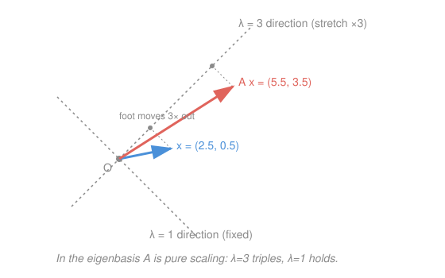

# Linear Algebra · Lesson 3.2: Diagonalization and matrix powers

> ⏱ ~15 min · Module 3: Eigenvalues and diagonalization · Builds on: [3.1 Eigenvalues and eigenvectors](03-01-eigenvalues-eigenvectors.md) · Unlocks: Module 4 (inner products and orthogonality)

## Why this matters

You found the eigenvectors in 3.1 — the directions a map merely stretches. Diagonalization is the payoff: it says a matrix, viewed in its own eigenbasis, is *nothing but a list of scale factors*. That turns brutal computations into trivial ones. Want $A^{100}$? In the eigenbasis you just raise each scale factor to the 100th. This one trick powers the long-run behavior of every linear dynamical system — population models, Markov chains, the discrete evolution $\mathbf x_{k+1} = A\mathbf x_k$ that physics and econ run forward in time.

## The idea

A generic matrix mixes coordinates: $A\mathbf x$ rotates and shears, and multiplying $A$ by itself repeatedly compounds the mess. But look at $A$ through the *right* pair of glasses — its eigenvectors — and the mess vanishes. Along each eigen-direction the map does one boring thing: multiply by a number, the eigenvalue. Nothing leaks between directions.

So computing $A\mathbf x$ becomes a three-step recipe: (1) rewrite $\mathbf x$ in the eigenbasis (how much of each eigen-direction is in it), (2) scale each piece by its eigenvalue, (3) translate back to ordinary coordinates. The middle step is just multiplication by a diagonal matrix. And here's the magic for powers: steps (1) and (3) are the same every time you apply $A$, so they cancel in the interior of $A^k$, leaving only the diagonal scaling raised to the $k$-th power. Ten applications of a tangled map collapse into ten independent scalars raised to the tenth.

## The formal version

**Diagonalization.** An $n\times n$ matrix $A$ is **diagonalizable** if it has $n$ linearly independent eigenvectors $\mathbf v_1,\dots,\mathbf v_n$ with eigenvalues $\lambda_1,\dots,\lambda_n$. Stack the eigenvectors as columns of $P$ and the eigenvalues down the diagonal of $D$:

$$P = \begin{bmatrix} \mathbf v_1 & \cdots & \mathbf v_n \end{bmatrix}, \qquad D = \begin{bmatrix} \lambda_1 & & \\ & \ddots & \\ & & \lambda_n \end{bmatrix}, \qquad A = P D P^{-1}.$$

In words: $P^{-1}$ rewrites a vector in eigen-coordinates, $D$ scales each coordinate by its eigenvalue, and $P$ maps back to ordinary coordinates. The column order of $P$ must match the diagonal order of $D$.

**Similar matrices.** $A$ and $D$ are **similar** ($A = PDP^{-1}$): they are the *same linear map* written in two different bases. The eigenbasis is simply the basis in which that map is pure scaling. Similar matrices share eigenvalues, determinant, and trace — those are properties of the map, not of the coordinates.

**Matrix powers.** Because the interior $P^{-1}P$ collapses to the identity,

$$A^k = \big(PDP^{-1}\big)^k = P D^k P^{-1}, \qquad D^k = \begin{bmatrix} \lambda_1^k & & \\ & \ddots & \\ & & \lambda_n^k \end{bmatrix}.$$

In words: powering a diagonalizable matrix costs only powering scalars. This is the entire reason anyone diagonalizes.

**Linear dynamical systems.** Iterating $\mathbf x_{k} = A\mathbf x_{k-1}$ from a start $\mathbf x_0$ gives $\mathbf x_k = A^k \mathbf x_0$. Expand $\mathbf x_0 = c_1\mathbf v_1 + \cdots + c_n\mathbf v_n$ in the eigenbasis and each mode evolves on its own:

$$\mathbf x_k = c_1\lambda_1^k\,\mathbf v_1 + \cdots + c_n\lambda_n^k\,\mathbf v_n.$$

In words: the state is a blend of eigen-modes, and mode $i$ grows or shrinks by the factor $\lambda_i$ each step. The **largest-magnitude eigenvalue wins** the long run: its mode dominates, so $\mathbf x_k$ swings toward that eigenvector and grows (or decays) at rate $|\lambda_{\max}|$.

**Markov chains.** A **stochastic matrix** (columns of transition probabilities summing to $1$) always has $\lambda = 1$ as an eigenvalue, and every other eigenvalue satisfies $|\lambda| \le 1$. So the $\lambda=1$ mode is the survivor: its eigenvector, normalized to sum to $1$, is the **steady state** the chain converges to regardless of where it started.

**When it fails.** If $A$ has a repeated eigenvalue but too few independent eigenvectors to fill $P$ (a *defective* matrix), no eigenbasis exists and $A$ is not diagonalizable — the best you can do is the near-diagonal **Jordan form**. We only flag this; we don't drill it. A quick sufficient guarantee: $n$ *distinct* eigenvalues $\Rightarrow$ always diagonalizable.

## Picture

For $A = \begin{bmatrix}2&1\\1&2\end{bmatrix}$ the eigen-directions are $(1,1)$ with $\lambda=3$ and $(1,-1)$ with $\lambda=1$. The map leaves each vector's $\lambda=1$ component alone and triples its $\lambda=3$ component — which is exactly why repeated application drags everything toward the $(1,1)$ line.

## Worked examples

**Example 1 (mechanical — build $P$ and $D$).** Take $A = \begin{bmatrix}2&1\\1&2\end{bmatrix}$. Its characteristic polynomial is $\det(A-\lambda I) = (2-\lambda)^2 - 1 = \lambda^2 - 4\lambda + 3 = (\lambda-1)(\lambda-3)$, so $\lambda = 3$ and $\lambda = 1$.

- $\lambda = 3$: $A - 3I = \begin{bmatrix}-1&1\\1&-1\end{bmatrix}$ gives $\mathbf v_1 = \begin{bmatrix}1\\1\end{bmatrix}$.
- $\lambda = 1$: $A - I = \begin{bmatrix}1&1\\1&1\end{bmatrix}$ gives $\mathbf v_2 = \begin{bmatrix}1\\-1\end{bmatrix}$.

$$P = \begin{bmatrix}1&1\\1&-1\end{bmatrix}, \quad D = \begin{bmatrix}3&0\\0&1\end{bmatrix}, \quad P^{-1} = \frac{1}{-2}\begin{bmatrix}-1&-1\\-1&1\end{bmatrix} = \begin{bmatrix}\tfrac12 & \tfrac12\\[2pt] \tfrac12 & -\tfrac12\end{bmatrix}.$$

Check: $PD = \begin{bmatrix}3&1\\3&-1\end{bmatrix}$, and $PDP^{-1} = \begin{bmatrix}3&1\\3&-1\end{bmatrix}\begin{bmatrix}\tfrac12&\tfrac12\\\tfrac12&-\tfrac12\end{bmatrix} = \begin{bmatrix}2&1\\1&2\end{bmatrix} = A$. ✓

**Example 2 (why you'd care — a two-state model runs forward).** Let $A = \begin{bmatrix}2&1\\1&2\end{bmatrix}$ drive $\mathbf x_k = A^k\mathbf x_0$ from $\mathbf x_0 = \begin{bmatrix}1\\0\end{bmatrix}$. Instead of multiplying matrices, split $\mathbf x_0$ in the eigenbasis: solve $c_1\begin{bmatrix}1\\1\end{bmatrix} + c_2\begin{bmatrix}1\\-1\end{bmatrix} = \begin{bmatrix}1\\0\end{bmatrix}$, giving $c_1 = c_2 = \tfrac12$. Then

$$\mathbf x_k = \tfrac12\,3^k\begin{bmatrix}1\\1\end{bmatrix} + \tfrac12\,1^k\begin{bmatrix}1\\-1\end{bmatrix}.$$

At $k=10$: $3^{10} = 59049$, so $\mathbf x_{10} = \tfrac12\begin{bmatrix}59050\\59048\end{bmatrix} = \begin{bmatrix}29525\\29524\end{bmatrix}$. The $\lambda=1$ mode is a fixed sliver of size $\tfrac12$; the $\lambda=3$ mode has ballooned by $3^{10}$ and utterly dominates — the state now points essentially along $(1,1)$ and multiplies by $3$ every further step. That is the dominant eigenvalue governing the long run, read straight off the eigenvalues without ever forming $A^{10}$.

## Watch out

- You might think every square matrix diagonalizes. Only those with a *full* set of independent eigenvectors do. A repeated eigenvalue is the warning sign — check whether it supplies enough eigenvectors (e.g. $\begin{bmatrix}1&1\\0&1\end{bmatrix}$ has $\lambda=1$ twice but only one eigenvector, so it's defective).
- You might think $A^k = P D^k P^{-1}$ means $A^k = P^k D^k P^{-k}$. No — the interior $P^{-1}P$ pairs cancel; $P$ and $P^{-1}$ each appear exactly *once*, on the outside. Powering happens only inside, on $D$.
- You might mix up the order in $P$ versus $D$. Column $j$ of $P$ must be the eigenvector for the eigenvalue in slot $j$ of $D$. Swap a column without swapping the matching diagonal entry and $PDP^{-1}$ is no longer $A$.

## One-liner

> Diagonalization is just changing to the basis where the map is pure scaling — and in that basis powers, limits, and long-run dynamics all read straight off the eigenvalues.

## Problems

**P1 (🟢)** Diagonalize $A = \begin{bmatrix}2&1\\1&2\end{bmatrix}$: write down $P$, $D$, and $P^{-1}$, and confirm $A = PDP^{-1}$ by multiplying it back out. (Use Example 1's eigen-data, but do the final product yourself.)

**P2 (🟡)** Using that diagonalization, find a closed form for $A^k$ as a single $2\times2$ matrix in terms of $3^k$. Verify it against $A^2$ computed directly, and say what the entries do as $k\to\infty$ — which eigenvalue is in charge?

**P3 (🔴, Boss-3 style)** The Fibonacci numbers satisfy $F_{n+1} = F_n + F_{n-1}$ with $F_0 = 0$, $F_1 = 1$. Writing $\begin{bmatrix}F_{n+1}\\F_n\end{bmatrix} = M\begin{bmatrix}F_n\\F_{n-1}\end{bmatrix}$ with $M = \begin{bmatrix}1&1\\1&0\end{bmatrix}$, diagonalize $M$ and use it to derive **Binet's formula** for $F_n$ in closed form. What is the growth rate of $F_n$?

Solutions

**P1** Eigenvalues $\lambda = 3, 1$ with eigenvectors $\begin{bmatrix}1\\1\end{bmatrix}, \begin{bmatrix}1\\-1\end{bmatrix}$, so

$$P = \begin{bmatrix}1&1\\1&-1\end{bmatrix},\quad D = \begin{bmatrix}3&0\\0&1\end{bmatrix},\quad P^{-1} = \begin{bmatrix}\tfrac12&\tfrac12\\[2pt]\tfrac12&-\tfrac12\end{bmatrix}\ \ \left(\det P = -2\right).$$

Multiply back: $PD = \begin{bmatrix}3&1\\3&-1\end{bmatrix}$, then

$$PDP^{-1} = \begin{bmatrix}3&1\\3&-1\end{bmatrix}\begin{bmatrix}\tfrac12&\tfrac12\\[2pt]\tfrac12&-\tfrac12\end{bmatrix} = \begin{bmatrix}\tfrac32+\tfrac12 & \tfrac32-\tfrac12\\[2pt] \tfrac32-\tfrac12 & \tfrac32+\tfrac12\end{bmatrix} = \begin{bmatrix}2&1\\1&2\end{bmatrix} = A.\ ✓$$

**P2** $A^k = PD^kP^{-1}$ with $D^k = \begin{bmatrix}3^k&0\\0&1\end{bmatrix}$. Then $PD^k = \begin{bmatrix}3^k&1\\3^k&-1\end{bmatrix}$, so

$$A^k = \begin{bmatrix}3^k&1\\3^k&-1\end{bmatrix}\begin{bmatrix}\tfrac12&\tfrac12\\[2pt]\tfrac12&-\tfrac12\end{bmatrix} = \frac12\begin{bmatrix}3^k+1 & 3^k-1\\ 3^k-1 & 3^k+1\end{bmatrix}.$$

Check at $k=2$: $\tfrac12\begin{bmatrix}10&8\\8&10\end{bmatrix} = \begin{bmatrix}5&4\\4&5\end{bmatrix}$, and directly $A^2 = \begin{bmatrix}2&1\\1&2\end{bmatrix}^2 = \begin{bmatrix}5&4\\4&5\end{bmatrix}$. ✓ (Also $k=1$ returns $A$.) As $k\to\infty$ every entry $\to \tfrac12 \cdot 3^k$: all four grow like $3^k$ and the matrix tends to $\tfrac12 3^k\begin{bmatrix}1&1\\1&1\end{bmatrix}$. The dominant eigenvalue $\lambda = 3$ is in charge; the $\lambda=1$ mode contributes only the fixed $\pm\tfrac12$ that becomes negligible.

**P3** Characteristic polynomial: $\det(M-\lambda I) = (1-\lambda)(-\lambda) - 1 = \lambda^2 - \lambda - 1 = 0$, so

$$\lambda = \frac{1\pm\sqrt5}{2}: \qquad \varphi = \frac{1+\sqrt5}{2}\ (\approx 1.618), \quad \psi = \frac{1-\sqrt5}{2}\ (\approx -0.618).$$

For eigenvalue $\lambda$, the row $v_1 - \lambda v_2 = 0$ gives eigenvector $\begin{bmatrix}\lambda\\1\end{bmatrix}$, so $\mathbf v_\varphi = \begin{bmatrix}\varphi\\1\end{bmatrix}$, $\mathbf v_\psi = \begin{bmatrix}\psi\\1\end{bmatrix}$. Since $\begin{bmatrix}F_{n+1}\\F_n\end{bmatrix} = M^n\begin{bmatrix}F_1\\F_0\end{bmatrix} = M^n\begin{bmatrix}1\\0\end{bmatrix}$, expand the start vector in the eigenbasis:

$$\begin{bmatrix}1\\0\end{bmatrix} = a\begin{bmatrix}\varphi\\1\end{bmatrix} + b\begin{bmatrix}\psi\\1\end{bmatrix} \ \Rightarrow\ a+b = 0,\ \ a\varphi + b\psi = 1.$$

With $b=-a$: $a(\varphi-\psi) = 1$ and $\varphi - \psi = \sqrt5$, so $a = \tfrac{1}{\sqrt5}$, $b = -\tfrac{1}{\sqrt5}$. Each mode scales by its eigenvalue:

$$\begin{bmatrix}F_{n+1}\\F_n\end{bmatrix} = a\varphi^n\begin{bmatrix}\varphi\\1\end{bmatrix} + b\psi^n\begin{bmatrix}\psi\\1\end{bmatrix}.$$

Reading the **second component** gives Binet's formula:

$$\boxed{\,F_n = \frac{\varphi^n - \psi^n}{\sqrt5}\,}.$$

Check: $F_1 = \tfrac{\varphi-\psi}{\sqrt5} = \tfrac{\sqrt5}{\sqrt5} = 1$ ✓; $F_2 = \tfrac{\varphi^2-\psi^2}{\sqrt5} = \tfrac{(\varphi+1)-(\psi+1)}{\sqrt5} = 1$ ✓ (using $\lambda^2 = \lambda+1$). Since $|\psi| < 1$, the $\psi^n$ term vanishes and $F_n \approx \varphi^n/\sqrt5$: Fibonacci grows geometrically at the **golden ratio** $\varphi \approx 1.618$, and the ratio $F_{n+1}/F_n \to \varphi$ — the dominant eigenvalue is the growth rate, exactly as in the dynamical-system picture.

## Flashback

**From Lesson 3.1 (Eigenvalues and eigenvectors):** Find the eigenvalues and an eigenvector for each, of $B = \begin{bmatrix}4&2\\1&3\end{bmatrix}$. (This is a *non-symmetric* matrix, so don't expect orthogonal eigenvectors — just independent ones.)

Solution

Characteristic polynomial: $\det(B-\lambda I) = (4-\lambda)(3-\lambda) - (2)(1) = \lambda^2 - 7\lambda + 10 = (\lambda-2)(\lambda-5)$, so $\lambda = 5$ and $\lambda = 2$.

- $\lambda = 5$: $B - 5I = \begin{bmatrix}-1&2\\1&-2\end{bmatrix}$, so $-v_1 + 2v_2 = 0 \Rightarrow \mathbf v = \begin{bmatrix}2\\1\end{bmatrix}$. Check: $B\begin{bmatrix}2\\1\end{bmatrix} = \begin{bmatrix}10\\5\end{bmatrix} = 5\begin{bmatrix}2\\1\end{bmatrix}$. ✓
- $\lambda = 2$: $B - 2I = \begin{bmatrix}2&2\\1&1\end{bmatrix}$, so $v_1 + v_2 = 0 \Rightarrow \mathbf v = \begin{bmatrix}1\\-1\end{bmatrix}$. Check: $B\begin{bmatrix}1\\-1\end{bmatrix} = \begin{bmatrix}2\\-2\end{bmatrix} = 2\begin{bmatrix}1\\-1\end{bmatrix}$. ✓

Two distinct eigenvalues $\Rightarrow$ two independent eigenvectors $\Rightarrow$ $B$ is diagonalizable (with $P = \begin{bmatrix}2&1\\1&-1\end{bmatrix}$, $D = \begin{bmatrix}5&0\\0&2\end{bmatrix}$ if you wanted to continue).

## Connections

- **Backward:** this is [3.1](03-01-eigenvalues-eigenvectors.md) cashed in — the eigenvectors become the columns of $P$, the eigenvalues the diagonal of $D$. The change-of-basis $P^{-1}(\cdot)P$ is the "same map, new basis" idea from [2.1 Matrices as linear maps](02-01-matrices-as-linear-maps.md), and $\det A = \det D = \prod \lambda_i$ ties back to [2.3 Determinants](02-03-determinants.md).
- **Forward:** Module 4's orthogonality upgrades this. When $A$ is *symmetric* (Example 1's matrix is), the eigenvectors come out orthogonal and $P$ can be chosen orthogonal, so $P^{-1} = P^\top$ — the spectral theorem of [5.1](05-01-spectral-theorem-quadratic-forms.md), and its cousin the [SVD](05-02-svd.md) for non-square maps.
- **Sideways (dynamics/econ):** $\mathbf x_k = A^k\mathbf x_0$ is the discrete-time analog of the continuous system $\dot{\mathbf x} = A\mathbf x$, whose solution $e^{At}\mathbf x_0$ is diagonalized the same way (eigenvalues become growth exponents instead of per-step multipliers). The Markov steady state ($\lambda=1$ eigenvector) is the discrete sibling of an equilibrium; the dominant eigenvalue is the long-run growth rate of a Leslie population model or a linear macro model.
