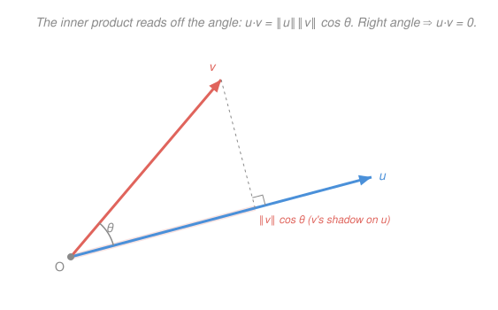

# Linear Algebra · Lesson 4.1: Inner products, norms, and orthogonality

> ⏱ ~15 min · Module 4: Inner products and orthogonality · Builds on: [1.1 Vectors, linear combinations, and span](01-01-vectors-span-linear-combinations.md) · Unlocks: 4.2 (projection and least squares)

## Why this matters

So far a vector space knows about *direction and combination* but nothing about *size or angle* — span, independence, and rank never once measured a length. Yet almost every application needs those: how *close* is a prediction to the data, how *aligned* are two signals, is this direction *perpendicular* to that plane? A single gadget — the **inner product** — installs both length and angle onto a vector space at once. It's the object that turns bare algebra into geometry, and it's the exact setting least-squares statistics and quantum mechanics live in.

## The idea

Start with the familiar case in $\mathbb{R}^n$: the **dot product**. Multiply two vectors slot-by-slot and add up the results — one number out. That number secretly encodes geometry. Dot a vector with *itself* and you get the sum of squared coordinates, which by Pythagoras is length-squared. Dot two *different* vectors and you get $\|\mathbf u\|\|\mathbf v\|\cos\theta$ — the lengths times the cosine of the angle between them. So one operation hands you both length (dot with self) and angle (dot with another). The headline special case: when the two vectors are perpendicular, $\cos 90^\circ = 0$, so **the dot product is zero exactly when the vectors are at right angles**.

The leap of Module 4 is to notice that nothing forced us to use *that* particular pairing. Any operation that behaves like the dot product — symmetric, linear in each slot, and giving a positive length to every nonzero vector — earns the name **inner product** and installs its own notion of length and angle. That freedom is not abstract nonsense: it lets "vectors" be functions, with $\langle f,g\rangle=\int fg$, so that $\sin x$ and $\cos x$ can be *perpendicular* — the seed of Fourier analysis.

## The formal version

An **inner product** on a real vector space $V$ is a rule $\langle\cdot,\cdot\rangle$ taking two vectors to a number, satisfying, for all $\mathbf u,\mathbf v,\mathbf w\in V$ and scalars $a,b$:

- **Symmetry:** $\langle\mathbf u,\mathbf v\rangle=\langle\mathbf v,\mathbf u\rangle$.
- **Bilinearity** (linear in each slot): $\langle a\mathbf u+b\mathbf w,\;\mathbf v\rangle=a\langle\mathbf u,\mathbf v\rangle+b\langle\mathbf w,\mathbf v\rangle$.
- **Positive-definiteness:** $\langle\mathbf v,\mathbf v\rangle\ge 0$, with equality *only* when $\mathbf v=\mathbf 0$.

In words: the pairing doesn't care about order, it distributes over sums and pulls out scalars, and every nonzero vector pairs positively with itself (so it can have a real length). The **standard inner product** on $\mathbb{R}^n$ is the dot product,
$$\langle\mathbf u,\mathbf v\rangle=\mathbf u\cdot\mathbf v=\mathbf u^\top\mathbf v=\sum_{i=1}^{n}u_i v_i,$$
where $u_i,v_i$ are the coordinates and $\mathbf u^\top$ is the row-vector transpose of the column $\mathbf u$.

**Norm (length).** The inner product defines the length of a vector as
$$\|\mathbf v\|=\sqrt{\langle\mathbf v,\mathbf v\rangle}.$$
In words: length is the square root of a vector paired with itself — positive-definiteness is precisely what makes that square root real and honest.

**Angle.** For nonzero $\mathbf u,\mathbf v$, the angle $\theta$ between them is fixed by
$$\cos\theta=\frac{\langle\mathbf u,\mathbf v\rangle}{\|\mathbf u\|\,\|\mathbf v\|}.$$
In words: normalize away both lengths and what remains of the inner product *is* the cosine of the angle.

**Orthogonality.** $\mathbf u$ and $\mathbf v$ are **orthogonal**, written $\mathbf u\perp\mathbf v$, when
$$\langle\mathbf u,\mathbf v\rangle=0.$$
In words: right angles are the zero set of the inner product — the single most useful fact in the module.

**Cauchy–Schwarz inequality.** For all $\mathbf u,\mathbf v$,
$$|\langle\mathbf u,\mathbf v\rangle|\le\|\mathbf u\|\,\|\mathbf v\|,$$
with equality iff one is a scalar multiple of the other. In words: the inner product can never exceed the product of the lengths — which is *why* the ratio in the angle formula stays in $[-1,1]$ and $\cos\theta$ is well-defined. From it follows the **triangle inequality** $\|\mathbf u+\mathbf v\|\le\|\mathbf u\|+\|\mathbf v\|$: a detour through $\mathbf u$ then $\mathbf v$ is never shorter than going straight.

**Orthonormal set.** Vectors $\mathbf q_1,\dots,\mathbf q_k$ are **orthonormal** if each has unit length and any two are orthogonal: $\langle\mathbf q_i,\mathbf q_j\rangle=1$ if $i=j$ and $0$ otherwise. In words: mutually perpendicular unit vectors — the cleanest possible coordinate system, and the target of Gram–Schmidt in 4.3.

## Picture

Reading it: the inner product $\mathbf u\cdot\mathbf v$ equals $\|\mathbf u\|$ times $\|\mathbf v\|\cos\theta$ — the length of $\mathbf u$ times the length of $\mathbf v$'s *shadow* on $\mathbf u$ (the highlighted stub, dropped by the dashed perpendicular). Swing $\mathbf v$ until that perpendicular lands right at the origin and the shadow vanishes: $\cos\theta=0$, the right-angle mark appears, and $\mathbf u\cdot\mathbf v=0$. That shadow is exactly the projection that Lesson 4.2 builds on.

## Worked examples

**Example 1 (mechanical — length and angle from the dot product).** Take $\mathbf u=\begin{bmatrix}1\\2\\2\end{bmatrix}$, $\mathbf v=\begin{bmatrix}2\\0\\1\end{bmatrix}$ in $\mathbb{R}^3$.
$$\langle\mathbf u,\mathbf v\rangle=(1)(2)+(2)(0)+(2)(1)=4,\quad \|\mathbf u\|=\sqrt{1+4+4}=3,\quad \|\mathbf v\|=\sqrt{4+0+1}=\sqrt5.$$
So $\cos\theta=\dfrac{4}{3\sqrt5}\approx0.596$, giving $\theta\approx53.4^\circ$. One dot product delivered both lengths *and* the angle — that's the whole point of the gadget.

**Example 2 (why you'd care — perpendicular functions).** Let the "vectors" be functions on $[-\pi,\pi]$ with inner product $\langle f,g\rangle=\int_{-\pi}^{\pi}f(x)g(x)\,dx$ (symmetric, bilinear, and positive-definite since $\langle f,f\rangle=\int f^2\ge0$). Are $f(x)=\sin x$ and $g(x)=\cos x$ orthogonal?
$$\langle\sin,\cos\rangle=\int_{-\pi}^{\pi}\sin x\cos x\,dx=\int_{-\pi}^{\pi}\tfrac12\sin 2x\,dx=0,$$
because $\sin 2x$ is odd and the interval is symmetric. So $\sin x\perp\cos x$ — genuinely perpendicular functions. Decomposing a signal into mutually orthogonal sines and cosines *is* the Fourier series, and it works for the same reason orthonormal bases work in $\mathbb{R}^n$: perpendicular components don't interfere.

## Watch out

- You might think length and angle are baked into a vector. They aren't — they come from the *choice* of inner product. Weight the coordinates differently, e.g. $\langle\mathbf u,\mathbf v\rangle=2u_1v_1+u_2v_2$, and both lengths and "which vectors are perpendicular" change, even though the vectors are the same lists of numbers.
- You might think any slot-by-slot rule is an inner product. It must be *positive-definite*: a pairing that assigns a nonzero vector zero (or negative) length isn't an inner product, and its "$\sqrt{\langle\mathbf v,\mathbf v\rangle}$" isn't a norm. (Relativity's spacetime "dot product" fails this on purpose — hence *not* a genuine inner product.)
- You might think $\langle\mathbf u,\mathbf v\rangle=0$ means one of them is zero. It means they're **perpendicular** — two long nonzero vectors at a right angle pair to exactly zero. Orthogonality is a *relationship*, not a smallness.

## One-liner

> An inner product is the one gadget that installs length and angle onto a vector space — and its zero set is exactly "perpendicular."

## Problems

**P1 (🟢)** For $\mathbf u=\begin{bmatrix}2\\-1\\2\end{bmatrix}$ and $\mathbf v=\begin{bmatrix}1\\2\\2\end{bmatrix}$ in $\mathbb{R}^3$, compute $\langle\mathbf u,\mathbf v\rangle$, both norms $\|\mathbf u\|$ and $\|\mathbf v\|$, and the angle $\theta$ between them.

**P2 (🟡)** Find **all** values of $k$ for which $\mathbf u=\begin{bmatrix}k\\2\\k\end{bmatrix}$ and $\mathbf v=\begin{bmatrix}k\\-3\\1\end{bmatrix}$ are orthogonal. Then verify Cauchy–Schwarz for the pair $\mathbf a=\begin{bmatrix}1\\1\\1\end{bmatrix}$, $\mathbf b=\begin{bmatrix}1\\2\\3\end{bmatrix}$ — compute both sides and confirm the inequality is strict.

**P3 (🔴, optional)** Prove the **Pythagorean identity**: if $\mathbf u\perp\mathbf v$ then $\|\mathbf u+\mathbf v\|^2=\|\mathbf u\|^2+\|\mathbf v\|^2$. Work purely from the inner-product axioms (so it holds in *every* inner-product space, not just $\mathbb{R}^n$), and point out exactly where orthogonality is used.

Solutions

**P1** Dot product: $\langle\mathbf u,\mathbf v\rangle=(2)(1)+(-1)(2)+(2)(2)=2-2+4=4$. Norms: $\|\mathbf u\|=\sqrt{4+1+4}=3$ and $\|\mathbf v\|=\sqrt{1+4+4}=3$. Angle:
$$\cos\theta=\frac{4}{3\cdot 3}=\frac{4}{9}\approx0.444,\qquad \theta=\arccos\!\tfrac49\approx63.6^\circ.$$
Check: both vectors have integer length $3$ (each is a permutation-with-sign of $(1,2,2)$), and $4/9\in[-1,1]$ as Cauchy–Schwarz guarantees. ✓

**P2** Orthogonality means $\langle\mathbf u,\mathbf v\rangle=0$:
$$\langle\mathbf u,\mathbf v\rangle=(k)(k)+(2)(-3)+(k)(1)=k^2+k-6=(k+3)(k-2).$$
This is zero iff $k=2$ or $k=-3$ — **two** values.
Verify: $k=2$ gives $\mathbf u=(2,2,2),\mathbf v=(2,-3,1)$ with dot $4-6+2=0$ ✓; $k=-3$ gives $\mathbf u=(-3,2,-3),\mathbf v=(-3,-3,1)$ with dot $9-6-3=0$ ✓.

Cauchy–Schwarz for $\mathbf a=(1,1,1)$, $\mathbf b=(1,2,3)$:
$$|\langle\mathbf a,\mathbf b\rangle|=|1+2+3|=6,\qquad \|\mathbf a\|\,\|\mathbf b\|=\sqrt3\cdot\sqrt{14}=\sqrt{42}\approx6.48.$$
Since $6<6.48$, the inequality holds and is **strict** — as it must be, because $\mathbf a$ and $\mathbf b$ are not scalar multiples of each other (equality needs parallel vectors). ✓

**P3** Expand the squared norm using $\|\mathbf w\|^2=\langle\mathbf w,\mathbf w\rangle$ and bilinearity:
$$\|\mathbf u+\mathbf v\|^2=\langle\mathbf u+\mathbf v,\;\mathbf u+\mathbf v\rangle=\langle\mathbf u,\mathbf u\rangle+\langle\mathbf u,\mathbf v\rangle+\langle\mathbf v,\mathbf u\rangle+\langle\mathbf v,\mathbf v\rangle.$$
By symmetry $\langle\mathbf u,\mathbf v\rangle=\langle\mathbf v,\mathbf u\rangle$, so the middle terms combine:
$$\|\mathbf u+\mathbf v\|^2=\|\mathbf u\|^2+2\langle\mathbf u,\mathbf v\rangle+\|\mathbf v\|^2.$$
Now use orthogonality: $\mathbf u\perp\mathbf v$ means $\langle\mathbf u,\mathbf v\rangle=0$, killing the cross term and leaving
$$\|\mathbf u+\mathbf v\|^2=\|\mathbf u\|^2+\|\mathbf v\|^2.$$
Orthogonality is used at exactly one spot — dropping the $2\langle\mathbf u,\mathbf v\rangle$ cross term. Nothing here referred to coordinates, so the identity holds in any inner-product space (functions included). Numerical sanity check in $\mathbb{R}^2$ with $\mathbf u=(3,0)\perp\mathbf v=(0,4)$: $\|\mathbf u+\mathbf v\|^2=\|(3,4)\|^2=25=9+16$. ✓ (This is Pythagoras itself — the theorem is a one-line corollary of the axioms.)

## Flashback

**From Lesson 1.1 (Vectors, linear combinations, and span):** Is $\begin{bmatrix}4\\1\\5\end{bmatrix}$ in $\operatorname{span}\!\left(\begin{bmatrix}1\\1\\2\end{bmatrix},\begin{bmatrix}2\\-1\\1\end{bmatrix}\right)$? Decide by solving for the weights.

Solution

Seek $c_1,c_2$ with $c_1\begin{bmatrix}1\\1\\2\end{bmatrix}+c_2\begin{bmatrix}2\\-1\\1\end{bmatrix}=\begin{bmatrix}4\\1\\5\end{bmatrix}$. Coordinate by coordinate:
$$\text{(top) } c_1+2c_2=4,\quad\text{(mid) } c_1-c_2=1,\quad\text{(bot) } 2c_1+c_2=5.$$
Subtract mid from top: $3c_2=3\Rightarrow c_2=1$, then mid gives $c_1=1+c_2=2$. Check the *third*, so-far-unused equation: $2(2)+1=5$ ✓. All three hold, so **yes** — $(4,1,5)=2\mathbf v_1+\mathbf v_2$ lies in the span. (The third equation mattering is the tell that a $\mathbb{R}^3$ target isn't automatically reachable from two vectors — their span is only a plane.)

## Connections

- **Backward:** this is [1.1](01-01-vectors-span-linear-combinations.md)'s span picture upgraded with a ruler and protractor — and P3 of 1.1 already smuggled orthogonality in as the plane's *normal* vector $(1,1,-1)$, which is exactly a "dot product $=0$" condition.
- **Forward:** [4.2](04-02-projection-least-squares.md) turns the dashed "shadow" in the picture into the **orthogonal projection**, and the residual-perpendicular-to-subspace condition is just $\langle\cdot,\cdot\rangle=0$ applied to a whole subspace; [4.3](04-03-gram-schmidt-qr.md) manufactures orthonormal sets on demand.
- **Sideways (calculus):** the dot product is the algebra behind the **gradient** in [`calc-refresher` 4.1](../../calc-refresher/lessons/04-01-partial-derivatives-and-gradient.md) — the directional derivative $\nabla f\cdot\mathbf u$ is an inner product, which is why the gradient points in the steepest direction (maximal alignment) and the level set is orthogonal to it.
- **Sideways (physics):** an *inner-product space* is the arena of quantum mechanics — states are vectors, and the overlap $\langle\psi|\phi\rangle$ is this exact pairing (complexified); orthogonal states are perfectly distinguishable, and Example 2's perpendicular functions are the discrete cousins of a measurement's orthogonal outcomes.
